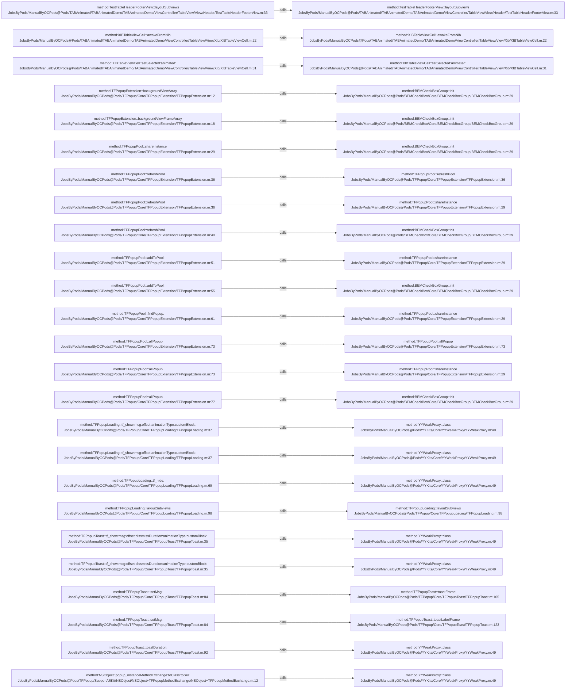

# `calls 符号关系 - 055`

[toc]

---

## 🔥 前言

这张图只展示一个分片，避免所有关系塞进一张图导致看不清。

```mermaid
flowchart LR
  S1["method:TestTableHeaderFooterView::layoutSubviews<br/>JobsByPods/ManualByOCPods@Pods/TABAnimated/TABAnimatedDemo/TABAnimatedDemo/ViewController/TableView/View/Header/TestTableHeaderFooterView.m:33"]
  T1["method:TestTableHeaderFooterView::layoutSubviews<br/>JobsByPods/ManualByOCPods@Pods/TABAnimated/TABAnimatedDemo/TABAnimatedDemo/ViewController/TableView/View/Header/TestTableHeaderFooterView.m:33"]
  S1 -->|calls| T1
  S2["method:XIBTableViewCell::awakeFromNib<br/>JobsByPods/ManualByOCPods@Pods/TABAnimated/TABAnimatedDemo/TABAnimatedDemo/ViewController/TableView/View/Xib/XIBTableViewCell.m:22"]
  T2["method:XIBTableViewCell::awakeFromNib<br/>JobsByPods/ManualByOCPods@Pods/TABAnimated/TABAnimatedDemo/TABAnimatedDemo/ViewController/TableView/View/Xib/XIBTableViewCell.m:22"]
  S2 -->|calls| T2
  S3["method:XIBTableViewCell::setSelected:animated:<br/>JobsByPods/ManualByOCPods@Pods/TABAnimated/TABAnimatedDemo/TABAnimatedDemo/ViewController/TableView/View/Xib/XIBTableViewCell.m:31"]
  T3["method:XIBTableViewCell::setSelected:animated:<br/>JobsByPods/ManualByOCPods@Pods/TABAnimated/TABAnimatedDemo/TABAnimatedDemo/ViewController/TableView/View/Xib/XIBTableViewCell.m:31"]
  S3 -->|calls| T3
  S4["method:TFPopupExtension::backgroundViewArray<br/>JobsByPods/ManualByOCPods@Pods/TFPopup/Core/TFPopupExtension/TFPopupExtension.m:12"]
  T4["method:BEMCheckBoxGroup::init<br/>JobsByPods/ManualByOCPods@Pods/BEMCheckBox/Core/BEMCheckBoxGroup/BEMCheckBoxGroup.m:29"]
  S4 -->|calls| T4
  S5["method:TFPopupExtension::backgroundViewFrameArray<br/>JobsByPods/ManualByOCPods@Pods/TFPopup/Core/TFPopupExtension/TFPopupExtension.m:18"]
  T5["method:BEMCheckBoxGroup::init<br/>JobsByPods/ManualByOCPods@Pods/BEMCheckBox/Core/BEMCheckBoxGroup/BEMCheckBoxGroup.m:29"]
  S5 -->|calls| T5
  S6["method:TFPopupPool::shareInstance<br/>JobsByPods/ManualByOCPods@Pods/TFPopup/Core/TFPopupExtension/TFPopupExtension.m:29"]
  T6["method:BEMCheckBoxGroup::init<br/>JobsByPods/ManualByOCPods@Pods/BEMCheckBox/Core/BEMCheckBoxGroup/BEMCheckBoxGroup.m:29"]
  S6 -->|calls| T6
  S7["method:TFPopupPool::refreshPool<br/>JobsByPods/ManualByOCPods@Pods/TFPopup/Core/TFPopupExtension/TFPopupExtension.m:36"]
  T7["method:TFPopupPool::refreshPool<br/>JobsByPods/ManualByOCPods@Pods/TFPopup/Core/TFPopupExtension/TFPopupExtension.m:36"]
  S7 -->|calls| T7
  S8["method:TFPopupPool::refreshPool<br/>JobsByPods/ManualByOCPods@Pods/TFPopup/Core/TFPopupExtension/TFPopupExtension.m:36"]
  T8["method:TFPopupPool::shareInstance<br/>JobsByPods/ManualByOCPods@Pods/TFPopup/Core/TFPopupExtension/TFPopupExtension.m:29"]
  S8 -->|calls| T8
  S9["method:TFPopupPool::refreshPool<br/>JobsByPods/ManualByOCPods@Pods/TFPopup/Core/TFPopupExtension/TFPopupExtension.m:40"]
  T9["method:BEMCheckBoxGroup::init<br/>JobsByPods/ManualByOCPods@Pods/BEMCheckBox/Core/BEMCheckBoxGroup/BEMCheckBoxGroup.m:29"]
  S9 -->|calls| T9
  S10["method:TFPopupPool::addToPool:<br/>JobsByPods/ManualByOCPods@Pods/TFPopup/Core/TFPopupExtension/TFPopupExtension.m:51"]
  T10["method:TFPopupPool::shareInstance<br/>JobsByPods/ManualByOCPods@Pods/TFPopup/Core/TFPopupExtension/TFPopupExtension.m:29"]
  S10 -->|calls| T10
  S11["method:TFPopupPool::addToPool:<br/>JobsByPods/ManualByOCPods@Pods/TFPopup/Core/TFPopupExtension/TFPopupExtension.m:55"]
  T11["method:BEMCheckBoxGroup::init<br/>JobsByPods/ManualByOCPods@Pods/BEMCheckBox/Core/BEMCheckBoxGroup/BEMCheckBoxGroup.m:29"]
  S11 -->|calls| T11
  S12["method:TFPopupPool::findPopup:<br/>JobsByPods/ManualByOCPods@Pods/TFPopup/Core/TFPopupExtension/TFPopupExtension.m:61"]
  T12["method:TFPopupPool::shareInstance<br/>JobsByPods/ManualByOCPods@Pods/TFPopup/Core/TFPopupExtension/TFPopupExtension.m:29"]
  S12 -->|calls| T12
  S13["method:TFPopupPool::allPopup<br/>JobsByPods/ManualByOCPods@Pods/TFPopup/Core/TFPopupExtension/TFPopupExtension.m:73"]
  T13["method:TFPopupPool::allPopup<br/>JobsByPods/ManualByOCPods@Pods/TFPopup/Core/TFPopupExtension/TFPopupExtension.m:73"]
  S13 -->|calls| T13
  S14["method:TFPopupPool::allPopup<br/>JobsByPods/ManualByOCPods@Pods/TFPopup/Core/TFPopupExtension/TFPopupExtension.m:73"]
  T14["method:TFPopupPool::shareInstance<br/>JobsByPods/ManualByOCPods@Pods/TFPopup/Core/TFPopupExtension/TFPopupExtension.m:29"]
  S14 -->|calls| T14
  S15["method:TFPopupPool::allPopup<br/>JobsByPods/ManualByOCPods@Pods/TFPopup/Core/TFPopupExtension/TFPopupExtension.m:77"]
  T15["method:BEMCheckBoxGroup::init<br/>JobsByPods/ManualByOCPods@Pods/BEMCheckBox/Core/BEMCheckBoxGroup/BEMCheckBoxGroup.m:29"]
  S15 -->|calls| T15
  S16["method:TFPopupLoading::tf_show:msg:offset:animationType:customBlock:<br/>JobsByPods/ManualByOCPods@Pods/TFPopup/Core/TFPopupLoading/TFPopupLoading.m:37"]
  T16["method:YYWeakProxy::class<br/>JobsByPods/ManualByOCPods@Pods/YYKits/Core/YYWeakProxy/YYWeakProxy.m:49"]
  S16 -->|calls| T16
  S17["method:TFPopupLoading::tf_show:msg:offset:animationType:customBlock:<br/>JobsByPods/ManualByOCPods@Pods/TFPopup/Core/TFPopupLoading/TFPopupLoading.m:37"]
  T17["method:YYWeakProxy::class<br/>JobsByPods/ManualByOCPods@Pods/YYKits/Core/YYWeakProxy/YYWeakProxy.m:49"]
  S17 -->|calls| T17
  S18["method:TFPopupLoading::tf_hide:<br/>JobsByPods/ManualByOCPods@Pods/TFPopup/Core/TFPopupLoading/TFPopupLoading.m:69"]
  T18["method:YYWeakProxy::class<br/>JobsByPods/ManualByOCPods@Pods/YYKits/Core/YYWeakProxy/YYWeakProxy.m:49"]
  S18 -->|calls| T18
  S19["method:TFPopupLoading::layoutSubviews<br/>JobsByPods/ManualByOCPods@Pods/TFPopup/Core/TFPopupLoading/TFPopupLoading.m:98"]
  T19["method:TFPopupLoading::layoutSubviews<br/>JobsByPods/ManualByOCPods@Pods/TFPopup/Core/TFPopupLoading/TFPopupLoading.m:98"]
  S19 -->|calls| T19
  S20["method:TFPopupToast::tf_show:msg:offset:dissmissDuration:animationType:customBlock:<br/>JobsByPods/ManualByOCPods@Pods/TFPopup/Core/TFPopupToast/TFPopupToast.m:35"]
  T20["method:YYWeakProxy::class<br/>JobsByPods/ManualByOCPods@Pods/YYKits/Core/YYWeakProxy/YYWeakProxy.m:49"]
  S20 -->|calls| T20
  S21["method:TFPopupToast::tf_show:msg:offset:dissmissDuration:animationType:customBlock:<br/>JobsByPods/ManualByOCPods@Pods/TFPopup/Core/TFPopupToast/TFPopupToast.m:35"]
  T21["method:YYWeakProxy::class<br/>JobsByPods/ManualByOCPods@Pods/YYKits/Core/YYWeakProxy/YYWeakProxy.m:49"]
  S21 -->|calls| T21
  S22["method:TFPopupToast::setMsg:<br/>JobsByPods/ManualByOCPods@Pods/TFPopup/Core/TFPopupToast/TFPopupToast.m:84"]
  T22["method:TFPopupToast::toastFrame<br/>JobsByPods/ManualByOCPods@Pods/TFPopup/Core/TFPopupToast/TFPopupToast.m:105"]
  S22 -->|calls| T22
  S23["method:TFPopupToast::setMsg:<br/>JobsByPods/ManualByOCPods@Pods/TFPopup/Core/TFPopupToast/TFPopupToast.m:84"]
  T23["method:TFPopupToast::toastLabelFrame<br/>JobsByPods/ManualByOCPods@Pods/TFPopup/Core/TFPopupToast/TFPopupToast.m:123"]
  S23 -->|calls| T23
  S24["method:TFPopupToast::toastDuration:<br/>JobsByPods/ManualByOCPods@Pods/TFPopup/Core/TFPopupToast/TFPopupToast.m:92"]
  T24["method:YYWeakProxy::class<br/>JobsByPods/ManualByOCPods@Pods/YYKits/Core/YYWeakProxy/YYWeakProxy.m:49"]
  S24 -->|calls| T24
  S25["method:NSObject::popup_instanceMethodExchange:toClass:toSel:<br/>JobsByPods/ManualByOCPods@Pods/TFPopup/Support/UIKit/NSObject/NSObject+TFPopupMethodExchange/NSObject+TFPopupMethodExchange.m:12"]
  T25["method:YYWeakProxy::class<br/>JobsByPods/ManualByOCPods@Pods/YYKits/Core/YYWeakProxy/YYWeakProxy.m:49"]
  S25 -->|calls| T25
```

<a id="🔚" href="#前言" style="font-size:17px; color:green; font-weight:bold;">我是有底线的➤点我回到首页</a>
