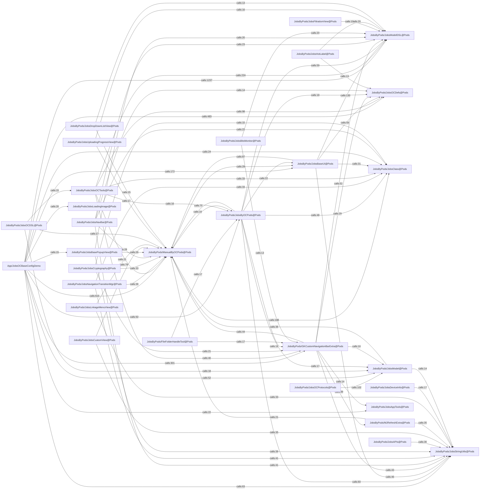

# `模块关联 Top 图`

[toc]

---

## 🔥 前言

模块级关系图来自 `edges/module-coupling.tsv`，每条边的数字是聚合权重。

```mermaid
flowchart LR
  M1["App/JobsOCBaseConfigDemo"]
  M2["JobsByPods/JobsModelDSL@Pods"]
  M3["JobsByPods/ManualByOCPods@Pods"]
  M4["JobsByPods/JobsOCDefs@Pods"]
  M5["JobsByPods/GKCustomNavigationBarExtra@Pods"]
  M6["JobsByPods/JobsOCTools@Pods"]
  M7["JobsByPods/JobsClass@Pods"]
  M8["JobsByPods/JobsBaseUI@Pods"]
  M9["JobsByPods/JobsOCProtocols@Pods"]
  M10["JobsByPods/JobsModel@Pods"]
  M11["JobsByPods/JobsByOCPods@Pods"]
  M12["JobsByPods/JobsStringUtils@Pods"]
  M13["JobsByPods/JobsNavBar@Pods"]
  M14["JobsByPods/JobsNavigationTransitionMgr@Pods"]
  M15["JobsByPods/MJRefreshExtra@Pods"]
  M16["JobsByPods/JobsBasePopupView@Pods"]
  M17["JobsByPods/JobsAPIs@Pods"]
  M18["JobsByPods/JobsCustomView@Pods"]
  M19["JobsByPods/JobsCryptography@Pods"]
  M20["JobsByPods/JobsLinkageMenuView@Pods"]
  M21["JobsByPods/JobsAppTools@Pods"]
  M22["JobsByPods/JobsLoadingImage@Pods"]
  M23["JobsByPods/JobsBitsMonitor@Pods"]
  M24["JobsByPods/JobsFiltrationView@Pods"]
  M25["JobsByPods/JobsHotLabel@Pods"]
  M26["JobsByPods/JobsOCDSL@Pods"]
  M27["JobsByPods/FileFolderHandleTool@Pods"]
  M28["JobsByPods/JobsDeviceInfo@Pods"]
  M29["JobsByPods/JobsUploadingProgressView@Pods"]
  M30["JobsByPods/JobsDropDownListView@Pods"]
  M1 -->|calls:1237| M2
  M1 -->|calls:616| M3
  M1 -->|calls:483| M4
  M1 -->|calls:301| M5
  M6 -->|calls:224| M2
  M3 -->|calls:188| M7
  M1 -->|calls:172| M8
  M8 -->|calls:130| M2
  M9 -->|calls:102| M10
  M6 -->|calls:98| M4
  M1 -->|calls:92| M11
  M8 -->|calls:87| M3
  M6 -->|calls:78| M3
  M11 -->|calls:70| M3
  M1 -->|calls:63| M12
  M11 -->|calls:60| M12
  M8 -->|calls:59| M4
  M11 -->|calls:59| M2
  M1 -->|calls:52| M10
  M5 -->|calls:52| M2
  M11 -->|calls:48| M7
  M8 -->|calls:46| M12
  M5 -->|calls:44| M3
  M5 -->|calls:43| M12
  M13 -->|calls:41| M12
  M14 -->|calls:41| M12
  M6 -->|calls:40| M5
  M5 -->|calls:39| M15
  M16 -->|calls:39| M12
  M14 -->|calls:39| M3
  M17 -->|calls:36| M12
  M10 -->|calls:36| M3
  M18 -->|calls:35| M12
  M15 -->|calls:35| M12
  M19 -->|calls:33| M3
  M20 -->|calls:33| M12
  M14 -->|calls:33| M7
  M6 -->|calls:33| M7
  M8 -->|calls:31| M7
  M5 -->|calls:29| M4
  M3 -->|calls:29| M8
  M13 -->|calls:28| M3
  M16 -->|calls:26| M3
  M1 -->|calls:24| M7
  M13 -->|calls:23| M2
  M1 -->|calls:22| M21
  M11 -->|calls:22| M8
  M18 -->|calls:22| M3
  M13 -->|calls:22| M7
  M19 -->|calls:21| M5
  M20 -->|calls:21| M3
  M15 -->|calls:21| M3
  M1 -->|calls:20| M22
  M16 -->|calls:20| M2
  M23 -->|calls:20| M2
  M24 -->|calls:20| M2
  M11 -->|calls:19| M5
  M25 -->|calls:19| M2
  M11 -->|calls:18| M4
  M26 -->|calls:18| M10
  M27 -->|calls:17| M5
  M27 -->|calls:17| M11
  M11 -->|calls:17| M10
  M28 -->|calls:17| M12
  M26 -->|calls:17| M3
  M29 -->|calls:17| M3
  M5 -->|calls:16| M10
  M6 -->|calls:16| M11
  M29 -->|calls:16| M2
  M3 -->|calls:16| M11
  M1 -->|calls:15| M16
  M19 -->|calls:15| M7
  M30 -->|calls:15| M3
  M26 -->|calls:15| M6
  M5 -->|calls:14| M21
  M10 -->|calls:14| M12
  M13 -->|calls:14| M4
  M23 -->|calls:13| M5
  M30 -->|calls:13| M2
  M25 -->|calls:13| M4
```

<a id="🔚" href="#前言" style="font-size:17px; color:green; font-weight:bold;">我是有底线的➤点我回到首页</a>
