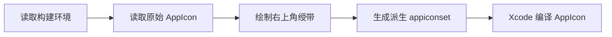

# `JobsAppIconRibbon`


[toc]

---

## 🔥 <font id=前言>前言</font>

> `JobsAppIconRibbon` 是一个构建期 App 图标环境绶带生成器。它会在原始 AppIcon 的右上角绘制 `DEBUG`、`RELEASE` 或自定义文案，方便从桌面图标直接识别安装包环境。

该模块没有运行时代码，不需要在 [**Swift**](https://www.swift.org/) 或 [**Objective-C**](https://developer.apple.com/library/archive/documentation/Cocoa/Conceptual/ProgrammingWithObjectiveC/Introduction/Introduction.html) 中 `import`。它由 [**CocoaPods**](https://cocoapods.org/) 注册到 [**Xcode**](https://developer.apple.com/xcode) Build Phase，并在资源编译前生成派生 AppIcon。

## 一、快速使用 <a href="#前言" style="font-size:17px; color:green;"><b>🔼</b></a> <a href="#🔚" style="font-size:17px; color:green;"><b>🔽</b></a>

1. 在 `Podfile` 或依赖拆分文件中引入：

   ```ruby
   pod 'JobsAppIconRibbon', :path => './JobsByPods/JobsAppIconRibbon@Pods'
   ```

2. 在项目根目录创建 `JobsAppIconRibbon.config`：

   ```properties
   SOURCE_APPICONSET=项目内原始AppIcon.appiconset的相对路径
   OUTPUT_NAME_PREFIX=JobsAppIconRibbon
   RIBBON_TEXT=
   DEBUG_TEXT=DEBUG
   RELEASE_TEXT=RELEASE
   BACKGROUND_COLOR=#8B4513
   TEXT_COLOR=#FFFFFF
   FONT_NAME=HelveticaNeue-Bold
   FONT_SIZE_RATIO=0.105
   ```

3. 配置 App Target 的 `ASSETCATALOG_COMPILER_APPICON_NAME`：

   | Configuration | AppIcon 名称 |
   | --- | --- |
   | Debug | `JobsAppIconRibbon-Debug` |
   | Release | `JobsAppIconRibbon-Release` |

4. 安装 Pods 并正常构建：

   ```shell
   pod install --no-repo-update
   ```

不需要添加任何业务层调用代码。

## 二、配置项 <a href="#前言" style="font-size:17px; color:green;"><b>🔼</b></a> <a href="#🔚" style="font-size:17px; color:green;"><b>🔽</b></a>

| 配置项 | 默认值 | 说明 |
| --- | --- | --- |
| `SOURCE_APPICONSET` | 无 | 原始 AppIcon 的项目相对路径，必填 |
| `OUTPUT_NAME_PREFIX` | `JobsAppIconRibbon` | 派生 AppIcon 名称前缀 |
| `RIBBON_TEXT` | 空 | 非空时所有环境强制使用该文案 |
| `DEBUG_TEXT` | `DEBUG` | Debug 环境文案 |
| `RELEASE_TEXT` | `RELEASE` | Release 环境文案 |
| `BACKGROUND_COLOR` | `#8B4513` | 绶带背景色，支持 `#RRGGBB`、`#RRGGBBAA` |
| `TEXT_COLOR` | `#FFFFFF` | 文字颜色，支持 `#RRGGBB`、`#RRGGBBAA` |
| `FONT_NAME` | `HelveticaNeue-Bold` | macOS 字体名称，找不到时使用系统粗体 |
| `FONT_SIZE_RATIO` | `0.105` | 字号占图标边长的比例 |

## 三、自定义环境 <a href="#前言" style="font-size:17px; color:green;"><b>🔼</b></a> <a href="#🔚" style="font-size:17px; color:green;"><b>🔽</b></a>

以 `UAT` 为例，在配置文件中增加：

```properties
TEXT_UAT=验收
```

再将 `UAT` Configuration 的 AppIcon 名称设为：

```text
JobsAppIconRibbon-UAT
```

非 Debug、Release 的 Configuration 会读取 `TEXT_<大写环境名>`。其中非字母数字字符转换为下划线，例如 `Pre-Release` 对应 `TEXT_PRE_RELEASE`。

## 四、生成规则 <a href="#前言" style="font-size:17px; color:green;"><b>🔼</b></a> <a href="#🔚" style="font-size:17px; color:green;"><b>🔽</b></a>



- 原始 AppIcon 始终只读。
- 派生目录与原始 `.appiconset` 位于同一个 `.xcassets`。
- 输出名称为 `<OUTPUT_NAME_PREFIX>-<CONFIGURATION>.appiconset`。
- 建议在 `.gitignore` 中加入：

  ```gitignore
  **/JobsAppIconRibbon-*.appiconset/
  ```

## 五、目录与职责 <a href="#前言" style="font-size:17px; color:green;"><b>🔼</b></a> <a href="#🔚" style="font-size:17px; color:green;"><b>🔽</b></a>

```text
JobsAppIconRibbon@Pods/
├── JobsAppIconRibbon.podspec
├── JobsPodspecKit.rb
├── README.md
└── Scripts/
    ├── JobsAppIconRibbon.sh
    └── JobsAppIconRibbonGenerator.swift
```

- `JobsAppIconRibbon.podspec`：声明 `before_compile` 构建脚本。
- `JobsPodspecKit.rb`：应用 OC 新工程本地 Pod 的标准构建配置。
- `Scripts/JobsAppIconRibbon.sh`：解析项目根目录、配置文件和 Configuration。
- `Scripts/JobsAppIconRibbonGenerator.swift`：使用 macOS 图像能力生成派生图标。
- 项目根目录的 `../../JobsAppIconRibbon.config`：项目级样式和路径配置。

## 六、手动验证 <a href="#前言" style="font-size:17px; color:green;"><b>🔼</b></a> <a href="#🔚" style="font-size:17px; color:green;"><b>🔽</b></a>

正常使用时直接通过 [**Xcode**](https://developer.apple.com/xcode) 构建。需要独立验证脚本时，在项目根目录执行：

```shell
JOBS_APP_ICON_RIBBON_NONINTERACTIVE=1 \
CONFIGURATION=Debug \
PODS_PODFILE_DIR_PATH="$PWD" \
zsh './JobsByPods/JobsAppIconRibbon@Pods/Scripts/JobsAppIconRibbon.sh'
```

日志位于系统临时目录中的 `JobsAppIconRibbon.log`。

## 七、常见问题 <a href="#前言" style="font-size:17px; color:green;"><b>🔼</b></a> <a href="#🔚" style="font-size:17px; color:green;"><b>🔽</b></a>

- 找不到配置文件：确认项目根目录存在 `JobsAppIconRibbon.config`。
- 找不到源图标：确认 `SOURCE_APPICONSET` 是项目根目录下的相对路径，并包含 `Contents.json`。
- 构建后图标未变化：确认当前 Configuration 的 `ASSETCATALOG_COMPILER_APPICON_NAME` 使用派生名称。
- 字体未生效：`FONT_NAME` 必须是 macOS 可识别的字体名称；不可用时会回退到系统粗体。
- 绶带重复叠加：不要把 `SOURCE_APPICONSET` 指向 `JobsAppIconRibbon-*` 派生目录。

## 八、风险边界 <a href="#前言" style="font-size:17px; color:green;"><b>🔼</b></a> <a href="#🔚" style="font-size:17px; color:green;"><b>🔽</b></a>

- 模块只重建当前环境对应的派生 `.appiconset`，不会覆盖原始 AppIcon。
- 派生目录属于构建产物，不建议提交 Git。
- App Store 包是否显示 `RELEASE` 由项目决定；不需要时可让正式 Configuration 使用原始 AppIcon。
- 修改图标或样式后，建议分别构建 Debug、Release 并检查桌面显示效果。

<a id="🔚" href="#前言" style="font-size:17px; color:green; font-weight:bold;">我是有底线的➤点我回到首页</a>
