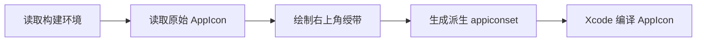

# `JobsAppIconRibbon`


[toc]

> 中文架构入口：[架构脉络与关键设计](#jobs-architecture)。

---

## 🔥 <font id=前言>前言</font>

> `JobsAppIconRibbon` 是一个构建期 App 图标环境绶带生成器。它会在原始 AppIcon 的右上角绘制 `DEBUG`、`RELEASE` 或自定义文案，方便从桌面图标直接识别安装包环境。

该模块没有运行时代码，不需要在 [**Swift**](https://www.swift.org/) 或 [**Objective-C**](https://developer.apple.com/library/archive/documentation/Cocoa/Conceptual/ProgrammingWithObjectiveC/Introduction/Introduction.html) 中 `import`。它由 [**CocoaPods**](https://cocoapods.org/) 注册到 [**Xcode**](https://developer.apple.com/xcode) Build Phase，并在资源编译前生成派生 AppIcon。

## 一、快速使用 <a href="#前言" style="font-size:17px; color:green;"><b>🔼</b></a> <a href="#🔚" style="font-size:17px; color:green;"><b>🔽</b></a>

1. 在 `Podfile` 或依赖拆分文件中引入：

   ```ruby
   pod 'JobsAppIconRibbon', :path => './JobsByPods/JobsAppIconRibbon@Pods'
   ```

2. 在项目根目录创建 `JobsAppIconRibbon.config`：

   ```properties
   SOURCE_APPICONSET=项目内原始AppIcon.appiconset的相对路径
   OUTPUT_NAME_PREFIX=JobsAppIconRibbon
   RIBBON_TEXT=
   DEBUG_TEXT=DEBUG
   RELEASE_TEXT=RELEASE
   BACKGROUND_COLOR=#8B4513
   TEXT_COLOR=#FFFFFF
   FONT_NAME=HelveticaNeue-Bold
   FONT_SIZE_RATIO=0.105
   ```

3. 配置 App Target 的 `ASSETCATALOG_COMPILER_APPICON_NAME`：

   | Configuration | AppIcon 名称 |
   | --- | --- |
   | Debug | `JobsAppIconRibbon-Debug` |
   | Release | `JobsAppIconRibbon-Release` |

4. 安装 Pods 并正常构建：

   ```shell
   pod install --no-repo-update
   ```

不需要添加任何业务层调用代码。

## 二、配置项 <a href="#前言" style="font-size:17px; color:green;"><b>🔼</b></a> <a href="#🔚" style="font-size:17px; color:green;"><b>🔽</b></a>

| 配置项 | 默认值 | 说明 |
| --- | --- | --- |
| `SOURCE_APPICONSET` | 无 | 原始 AppIcon 的项目相对路径，必填 |
| `OUTPUT_NAME_PREFIX` | `JobsAppIconRibbon` | 派生 AppIcon 名称前缀，仅 ASCII 字母、数字、`_`、`-` |
| `RIBBON_TEXT` | 空 | 非空时所有环境强制使用该文案 |
| `DEBUG_TEXT` | `DEBUG` | Debug 环境文案 |
| `RELEASE_TEXT` | `RELEASE` | Release 环境文案 |
| `BACKGROUND_COLOR` | `#8B4513` | 绶带背景色，支持 `#RRGGBB`、`#RRGGBBAA` |
| `TEXT_COLOR` | `#FFFFFF` | 文字颜色，支持 `#RRGGBB`、`#RRGGBBAA` |
| `FONT_NAME` | `HelveticaNeue-Bold` | macOS 字体名称，找不到时使用系统粗体 |
| `FONT_SIZE_RATIO` | `0.105` | 字号占图标边长的比例，有限且 `0 < ratio <= 1` |

## 三、自定义环境 <a href="#前言" style="font-size:17px; color:green;"><b>🔼</b></a> <a href="#🔚" style="font-size:17px; color:green;"><b>🔽</b></a>

以 `UAT` 为例，在配置文件中增加：

```properties
TEXT_UAT=验收
```

再将 `UAT` Configuration 的 AppIcon 名称设为：

```text
JobsAppIconRibbon-UAT
```

非 Debug、Release 的 Configuration 会读取 `TEXT_<大写环境名>`。其中非字母数字字符转换为下划线，例如 `Pre-Release` 对应 `TEXT_PRE_RELEASE`。

## 四、生成规则 <a href="#前言" style="font-size:17px; color:green;"><b>🔼</b></a> <a href="#🔚" style="font-size:17px; color:green;"><b>🔽</b></a>

流程图见[架构脉络与关键设计](#jobs-architecture-diagram-1)。

- 原始 AppIcon 始终只读。
- 派生目录与原始 `.appiconset` 位于同一个 `.xcassets`。
- 输出名称为 `<OUTPUT_NAME_PREFIX>-<CONFIGURATION>.appiconset`。
- 建议在 `.gitignore` 中加入：

  ```gitignore
  **/JobsAppIconRibbon-*.appiconset/
  ```

## 五、目录与职责 <a href="#前言" style="font-size:17px; color:green;"><b>🔼</b></a> <a href="#🔚" style="font-size:17px; color:green;"><b>🔽</b></a>

```text
JobsAppIconRibbon@Pods/
├── JobsAppIconRibbon.podspec
├── JobsPodspecKit.rb
├── README.md
├── Scripts/
    ├── JobsAppIconRibbon.sh
    └── JobsAppIconRibbonGenerator.swift
└── Tests/  # 独立回归，1 个文件
```

- `JobsAppIconRibbon.podspec`：声明 `before_compile` 构建脚本。
- `JobsPodspecKit.rb`：应用 OC 新工程本地 Pod 的标准构建配置。
- `Scripts/JobsAppIconRibbon.sh`：解析项目根目录、配置文件和 Configuration。
- `Scripts/JobsAppIconRibbonGenerator.swift`：使用 macOS 图像能力生成派生图标。
- 项目根目录的 `../../JobsAppIconRibbon.config`：项目级样式和路径配置。

## 六、手动验证 <a href="#前言" style="font-size:17px; color:green;"><b>🔼</b></a> <a href="#🔚" style="font-size:17px; color:green;"><b>🔽</b></a>

正常使用时直接通过 [**Xcode**](https://developer.apple.com/xcode) 构建。需要独立验证脚本时，在项目根目录执行：

```shell
JOBS_APP_ICON_RIBBON_NONINTERACTIVE=1 \
CONFIGURATION=Debug \
PODS_PODFILE_DIR_PATH="$PWD" \
zsh './JobsByPods/JobsAppIconRibbon@Pods/Scripts/JobsAppIconRibbon.sh'
```

日志位于系统临时目录中的 `JobsAppIconRibbon.log`。

## 七、常见问题 <a href="#前言" style="font-size:17px; color:green;"><b>🔼</b></a> <a href="#🔚" style="font-size:17px; color:green;"><b>🔽</b></a>

- 找不到配置文件：确认项目根目录存在 `JobsAppIconRibbon.config`。
- 找不到源图标：确认 `SOURCE_APPICONSET` 是项目根目录下的相对路径，并包含 `Contents.json`。
- 构建后图标未变化：确认当前 Configuration 的 `ASSETCATALOG_COMPILER_APPICON_NAME` 使用派生名称。
- 字体未生效：`FONT_NAME` 必须是 macOS 可识别的字体名称；不可用时会回退到系统粗体。
- 绶带重复叠加：不要把 `SOURCE_APPICONSET` 指向 `JobsAppIconRibbon-*` 派生目录。

## 八、风险边界 <a href="#前言" style="font-size:17px; color:green;"><b>🔼</b></a> <a href="#🔚" style="font-size:17px; color:green;"><b>🔽</b></a>

- 模块只重建当前环境对应的派生 `.appiconset`，不会覆盖原始 AppIcon。
- 派生目录属于构建产物，不建议提交 Git。
- App Store 包是否显示 `RELEASE` 由项目决定；不需要时可让正式 Configuration 使用原始 AppIcon。
- 修改图标或样式后，建议分别构建 Debug、Release 并检查桌面显示效果。

<a id="jobs-architecture"></a>

## 九、架构脉络与关键设计 <a href="#前言" style="font-size:17px; color:green;"><b>🔼</b></a> <a href="#🔚" style="font-size:17px; color:green;"><b>🔽</b></a>

本节用于用中文快速理解组件，并为按框架重建提供入口；关注职责、运行关系和关键边界，不要求逐行复刻。

### 9.1、设计目的与职责划分 <a href="#前言" style="font-size:17px; color:green;"><b>🔼</b></a> <a href="#🔚" style="font-size:17px; color:green;"><b>🔽</b></a>

这是构建期图标派生工具，不是运行时 UI 控件。构建配置与样式参数交给 [**Swift**](https://www.swift.org/) 生成器，生成器在原始 AppIcon 图片上绘制环境绶带，输出独立的派生 appiconset 供当前构建使用。

### 9.2、运行脉络 <a href="#前言" style="font-size:17px; color:green;"><b>🔼</b></a> <a href="#🔚" style="font-size:17px; color:green;"><b>🔽</b></a>

读取原始 AppIcon 与环境配置 → 解析颜色/字体/文案 → 对图标绘制绶带 → 输出派生资源集 → 构建使用派生图标名。

<a id="jobs-architecture-diagram-1"></a>

原「四、生成规则」流程图集中于此，原章节的参数说明和示例仍保留。


```mermaid
flowchart LR
    A[读取构建环境] --> B[读取原始 AppIcon]
    B --> C[绘制右上角绶带]
    C --> D[生成派生 appiconset]
    D --> E[Xcode 编译 AppIcon]
```

### 9.3、关键设计与边界 <a href="#前言" style="font-size:17px; color:green;"><b>🔼</b></a> <a href="#🔚" style="font-size:17px; color:green;"><b>🔽</b></a>

- 原始图标不被覆盖；SOURCE_APPICONSET 不应指回已派生目录，否则可能重复叠加。
- 构建环境与运行时环境不同，修改图标后需要重新构建才能体现在桌面。
- 字体不可用时存在回退，派生目录属于构建产物；是否给正式包加绶带由项目配置决定。

### 9.4、阅读与重建顺序 <a href="#前言" style="font-size:17px; color:green;"><b>🔼</b></a> <a href="#🔚" style="font-size:17px; color:green;"><b>🔽</b></a>

先看 podspec/构建入口与配置参数，再看 Scripts 中的 options、configuration、render；无需重建一套 App 内图标切换界面。

源码定位（路径以本 README 所在目录为基准；只带走 README 时，可把文件名作为职责定位线索）：

- [Scripts/JobsAppIconRibbonGenerator.swift](<./Scripts/JobsAppIconRibbonGenerator.swift>)

依赖与编译入口：[JobsAppIconRibbon.podspec](<./JobsAppIconRibbon.podspec>)。源码范围、资源及可选 subspec 以这里的声明为准；辅助脚本动态补充的依赖不在上述摘录中展开。

## 十、生成安全与失败保留 <a href="#前言" style="font-size:17px; color:green;"><b>🔼</b></a> <a href="#🔚" style="font-size:17px; color:green;"><b>🔽</b></a>

`OUTPUT_NAME_PREFIX` 只接受 ASCII 字母、数字、`_` 和 `-`；`FONT_SIZE_RATIO` 必须是有限数且满足 `0 < ratio <= 1`。非法配置在写入派生目录前失败，Configuration 中不安全的名称字符会归一化为 `-`。

输入与输出解析符号链接后的路径不得相同，输出符号链接及非目录目标均拒绝；`Contents.json` 内图片文件名不能越出源 `.appiconset`。每张图片解码、绘制及编码都先在同级临时 staging 目录完成，全部成功后才用 macOS 原子目录交换替换既有输出；首次生成使用目录重命名。任一验证、渲染或交换失败都保留原始输入和上次成功的输出，临时 staging 随作用域退出清理。

可重复 Mac 回归入口为 [Tests/run_regression.rb](<./Tests/run_regression.rb>)，通过真实生成器及故障输入校验配置拒绝、路径别名、输出符号链接、破损图片与失败时旧输出保留。命令见本轮单元验证；验证结果见本 README 统一验收记录。

## 十一、目录计数与安装边界 <a href="#前言" style="font-size:17px; color:green;"><b>🔼</b></a> <a href="#🔚" style="font-size:17px; color:green;"><b>🔽</b></a>

计数递归扫描当前目录内的普通文件，排除 `.DS_Store` / `._*`；源码与头文件计入 `.h`、`.m`、`.mm`、`.c`、`.cc`、`.cpp`、`.hpp`、`.swift`。资源目录中的目录、资源编译结果和文件大小不计入文件数，文件存在不代表必然打包。

| 目录 | 实际文件 | 源码 / 头文件 | 安装边界 |
| --- | --- | --- | --- |
| `Core/`（无目录） | 0 | 0 | 公共入口与核心实现；公开 / 私有头由 podspec 指定 |
| `Support/`（无目录） | 0 | 0 | 仅供当前 Pod 内部实现，按实际 subspec / private header 映射 |
| `Resource/`（无目录） | 0 | 0 | 非代码资源；按 resources / resource_bundles 和排除规则安装 |
| `Tests/` | 1 | 0 | 只由独立测试目标或回归 harness 使用，不进入生产 source_files |

`Core` 的物理目录不等于所有头文件均公开；`Support` 和测试 fixture 不作为 App 或其它 Pod 的稳定消费入口。根聚合头与 `public_header_files` 是外部引用依据。

## 十二、本轮单元验证 <a href="#前言" style="font-size:17px; color:green;"><b>🔼</b></a> <a href="#🔚" style="font-size:17px; color:green;"><b>🔽</b></a>

当前结果：**Debug / Release 单 Pod 编译、macOS 生产实现回归已完成；本 Pod 无独立 Stability 回归；整体验收记录见根 [JobsByPods升级实施与编译验证.md](<../../JobsByPods升级实施与编译验证.md>)**。生产源码、测试源码、资源与工程配置的指纹一致且命令真实退出成功，才可复用对应验证记录。

生产行为与边界按上述核心契约验收；逐 Pod 编译与独立行为回归分别记录结果。

从本 README 所在目录回到工程根目录，再运行该 Pod 的 Debug / Release 单元编译：

```shell
cd ../..
ruby ScriptsByPods/jobs_pods_stability_verify.rb/jobs_pods_stability_verify.rb \
  --phase pods --pod JobsAppIconRibbon
```

当前没有 `Stability` test_spec；单独 Pod 的编译覆盖不能等同于行为测试通过，集成场景由宿主验收。

本地生产实现回归 harness：

```shell
ruby JobsByPods/JobsAppIconRibbon@Pods/Tests/run_regression.rb
```

运行前应已安装工程依赖；runner 的 `--phase pods` 默认分别编译 Debug / Release，`--phase tests` 默认运行 Debug（JobsOCSnowflake 默认 Debug / Release），并将命令、源码指纹、日志和退出码保存到工程 `work/JobsPodsStability/`。如需固定输出目录，使用 runner 的 `--output`。

<a id="🔚" href="#前言" style="font-size:17px; color:green; font-weight:bold;">我是有底线的➤点我回到首页</a>
