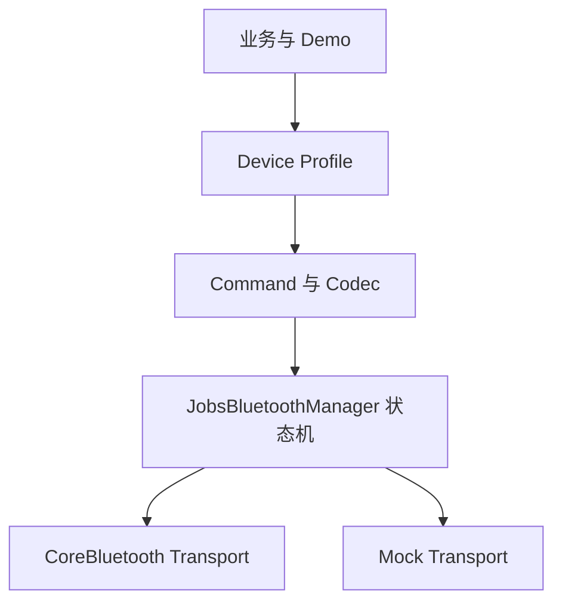

# `JobsBluetooth`


[toc]

> 中文架构入口：[架构脉络与关键设计](#jobs-architecture)。

---

## 🔥 <font id=前言>前言</font>

> `JobsBluetooth` 是面向 [**iOS**](https://developer.apple.com/ios/) BLE 中央设备场景的通用基础设施。它把 [**CoreBluetooth**](https://developer.apple.com/documentation/corebluetooth) 与设备协议、业务 UI 分离，并通过点语法和链式 DSL 完成配置。

## 一、能力边界 <a href="#前言" style="font-size:17px; color:green;"><b>🔼</b></a> <a href="#🔚" style="font-size:17px; color:green;"><b>🔽</b></a>

- 支持扫描、过滤、连接、断开、Service / Characteristic 发现、读取、写入和通知。
- 支持设备 Profile、协议 Encoder / Decoder、命令模型、超时与重试参数预留。
- 支持 Mock Transport；模拟器和无真机环境也能运行完整 Demo。
- 本 Pod 面向 BLE，不承诺任意经典蓝牙、蓝牙音频或未经 MFi 授权的 ExternalAccessory 能力。

## 二、架构 <a href="#前言" style="font-size:17px; color:green;"><b>🔼</b></a> <a href="#🔚" style="font-size:17px; color:green;"><b>🔽</b></a>

流程图见[架构脉络与关键设计](#jobs-architecture-diagram-1)。

## 三、DSL 快速开始 <a href="#前言" style="font-size:17px; color:green;"><b>🔼</b></a> <a href="#🔚" style="font-size:17px; color:green;"><b>🔽</b></a>

```objc
JobsBluetoothProfile *profile = JobsBluetoothProfile.new
    .byIdentifier(@"jobs.sensor")
    .byServiceUUIDStrings(@[@"FFF0"])
    .byWriteUUIDString(@"FFF1")
    .byNotifyUUIDString(@"FFF2")
    .byScanTimeout(10)
    .byMaximumReconnectCount(3);

JobsBluetoothManager *manager = [JobsBluetoothManager.alloc initWithProfile:profile]
    .byMockTransport(JobsBluetoothMockTransport.new.byEnabled(YES))
    .onLog(^(NSString *message) {
        NSLog(@"%@", message);
    });

[manager startScan];
```

## 四、线程与生命周期 <a href="#前言" style="font-size:17px; color:green;"><b>🔼</b></a> <a href="#🔚" style="font-size:17px; color:green;"><b>🔽</b></a>

- [**CoreBluetooth**](https://developer.apple.com/documentation/corebluetooth) 回调由 Manager 收口，业务层不直接持有 `CBPeripheral`。
- 业务回调默认投递到主队列，也可以通过 `byCallbackQueue` 指定。
- 主动断开与异常断开拥有不同入口；自动重连策略应由 Profile 决定。
- 配置 DSL 返回当前主对象；扫描、连接、发送等终止动作不伪造链式返回值。

## 五、权限配置 <a href="#前言" style="font-size:17px; color:green;"><b>🔼</b></a> <a href="#🔚" style="font-size:17px; color:green;"><b>🔽</b></a>

- App 的 `Info.plist` 至少配置 `NSBluetoothAlwaysUsageDescription`。
- 兼容旧系统时同时配置 `NSBluetoothPeripheralUsageDescription`。
- 需要后台 BLE 时，由宿主 App 在 Background Modes 中启用 `bluetooth-central`，Pod 不替宿主偷偷开启。

## 六、扩展设备协议 <a href="#前言" style="font-size:17px; color:green;"><b>🔼</b></a> <a href="#🔚" style="font-size:17px; color:green;"><b>🔽</b></a>

- UUID 和连接策略写入 `JobsBluetoothProfile`。
- 业务对象转字节写入 Encoder。
- Notify 字节转业务对象写入 Decoder。
- CRC、分包、加密和应答匹配作为独立策略注入，不写进 Manager。

## 七、Demo 覆盖 <a href="#前言" style="font-size:17px; color:green;"><b>🔼</b></a> <a href="#🔚" style="font-size:17px; color:green;"><b>🔽</b></a>

Demo 覆盖权限、扫描、过滤、RSSI、连接、多设备、服务发现、Read、Write、Notify、MTU、分包、命令队列、超时、重试、重连、前后台、Profile、Codec、校验、握手、Mock、录制回放、诊断、DSL、OTA 扩展和未知协议占位。

<a id="jobs-architecture"></a>

## 八、架构脉络与关键设计 <a href="#前言" style="font-size:17px; color:green;"><b>🔼</b></a> <a href="#🔚" style="font-size:17px; color:green;"><b>🔽</b></a>

本节用于用中文快速理解组件，并为按框架重建提供入口；关注职责、运行关系和关键边界，不要求逐行复刻。

### 8.1、设计目的与职责划分 <a href="#前言" style="font-size:17px; color:green;"><b>🔼</b></a> <a href="#🔚" style="font-size:17px; color:green;"><b>🔽</b></a>

以 Manager 组织 BLE 扫描、单个当前连接、服务特征发现、读写和通知，Profile 描述 UUID 与编解码入口，Command 保存 payload 及扩展参数，MockTransport 提供模拟广告与回显。当前实现是基础传输骨架。

### 8.2、运行脉络 <a href="#前言" style="font-size:17px; color:green;"><b>🔼</b></a> <a href="#🔚" style="font-size:17px; color:green;"><b>🔽</b></a>

配置 Profile → 扫描并连接 → 发现服务和特征 → 写入 payload 并立即回报提交 → 独立接收 Notify 数据并解码

<a id="jobs-architecture-diagram-1"></a>

原「二、架构」流程图集中于此，原章节的参数说明和示例仍保留。



### 8.3、关键设计与边界 <a href="#前言" style="font-size:17px; color:green;"><b>🔼</b></a> <a href="#🔚" style="font-size:17px; color:green;"><b>🔽</b></a>

- Command 虽有 timeout、retryCount、priority、responseMatcher 字段，当前 Manager 没有消费这些字段形成命令队列、超时重试或应答匹配；不能把参数预留写成已实现能力。
- 真实发送按 MTU 分包并等待所需写 ACK；配置 responseMatcher 时还需匹配业务响应。未配置 matcher 的空数据成功只表示全部写入完成；无响应写入仅表示系统发送队列接受，不承诺外设确认。Notify 保留独立的数据回调。
- Manager 保存多个已发现外设，但只持有一个 connectedPeripheral，不是完整的多连接管理器。
- Ready 在全部所需服务/特征发现及通知订阅完成后设置；业务协议握手仍由 responseMatcher 决定。Mock 回显和注入 ACK 测试不能替代真实外设互操作验收。
- 原文架构图表达分层意图，Demo 覆盖项不等于每项都在 Core 落地。重建可先完成现有路径，再明确设计队列、分包、重连等扩展。

### 8.4、阅读与重建顺序 <a href="#前言" style="font-size:17px; color:green;"><b>🔼</b></a> <a href="#🔚" style="font-size:17px; color:green;"><b>🔽</b></a>

先读 Profile、Command 和状态定义，再逐步跟踪 Manager 的 scan/connect/send/Notify，最后看 MockTransport；补扩展时单独定义结束与错误语义。

源码定位（路径以本 README 所在目录为基准；只带走 README 时，可把文件名作为职责定位线索）：

- [JobsBluetooth.h](<./JobsBluetooth.h>)
- [Core/JobsBluetoothManager/JobsBluetoothManager.h](<./Core/JobsBluetoothManager/JobsBluetoothManager.h>)
- [Core/JobsBluetoothCommand/JobsBluetoothCommand.h](<./Core/JobsBluetoothCommand/JobsBluetoothCommand.h>)
- [Core/JobsBluetoothMockTransport/JobsBluetoothMockTransport.h](<./Core/JobsBluetoothMockTransport/JobsBluetoothMockTransport.h>)
- [Core/JobsBluetoothPeripheral/JobsBluetoothPeripheral.h](<./Core/JobsBluetoothPeripheral/JobsBluetoothPeripheral.h>)

依赖与编译入口：[JobsBluetooth.podspec](<./JobsBluetooth.podspec>)。其中根级依赖声明包括 `JobsOCDefs`、`JobsBlock`。源码范围、资源及可选 subspec 以这里的声明为准；辅助脚本动态补充的依赖不在上述摘录中展开。

## 九、运行合同与失败边界 <a href="#前言" style="font-size:17px; color:green;"><b>🔼</b></a> <a href="#🔚" style="font-size:17px; color:green;"><b>🔽</b></a>

- 公共扫描/连接/读写入口收口到主队列；scan 与 connect timeout 按当前 generation 生效。服务发现等待全部所需特征和通知订阅完成后才进入 Ready；断开、失败、换外设清理特征并取消在途命令。
- 命令快照按优先级进入有界队列（最多 128 等待项），单条在途；按最大 GATT 长度分包，withResponse 等待 ACK，withoutResponse 尊重发送流控。没有 responseMatcher 的完成仅表示写入被接受；有 matcher 则等待匹配业务响应。
- timeout 非法/非正回退 5 秒，最长 3600 秒；retryCount 最多 8，只有明确幂等协议可以使用。ACK 超时断开以隔离迟到 ACK；连接或取消使每条命令只完成一次。自动重连策略由业务调用方决定，Profile.maximumReconnectCount 不代表引擎已自动重连。
- 业务 decoder 错误向命令传播；Mock 使用相同排队/匹配/超时路径。Stability 注入外设 IO，检查首次连接、ACK 错误恰好一次、旧外设 ACK 隔离、分包等待及匹配响应不得早于最后 ACK；不初始化 CBCentralManager。真实射频、各设备 MTU、服务顺序及协议幂等仍须真机验证。

## 十、目录计数与安装边界 <a href="#前言" style="font-size:17px; color:green;"><b>🔼</b></a> <a href="#🔚" style="font-size:17px; color:green;"><b>🔽</b></a>

计数递归扫描当前目录内的普通文件，排除 `.DS_Store` / `._*`；源码与头文件计入 `.h`、`.m`、`.mm`、`.c`、`.cc`、`.cpp`、`.hpp`、`.swift`。资源目录中的目录、资源编译结果和文件大小不计入文件数，文件存在不代表必然打包。

| 目录 | 实际文件 | 源码 / 头文件 | 安装边界 |
| --- | --- | --- | --- |
| `Core/` | 12 | 12 | 公共入口与核心实现；公开 / 私有头由 podspec 指定 |
| `Support/`（无目录） | 0 | 0 | 仅供当前 Pod 内部实现，按实际 subspec / private header 映射 |
| `Resource/` | 1 | 0 | 非代码资源；按 resources / resource_bundles 和排除规则安装 |
| `Tests/` | 2 | 2 | 只由独立测试目标或回归 harness 使用，不进入生产 source_files |

`Core` 的物理目录不等于所有头文件均公开；`Support` 和测试 fixture 不作为 App 或其它 Pod 的稳定消费入口。根聚合头与 `public_header_files` 是外部引用依据。

根级命名资源 bundle：`JobsBluetoothPrivacy.bundle`；已有运行资源保持各自 bundle 查找合同。

隐私声明入口：[Resource/PrivacyInfo.xcprivacy](<./Resource/PrivacyInfo.xcprivacy>)，通过 `JobsBluetoothPrivacy.bundle` 安装。声明类别与理由按该文件记录：

| API 类别 | 理由标识 | 当前代码用途 |
| --- | --- | --- | --- |

当前 `NSPrivacyAccessedAPITypes` 为空；该文件保留本 Pod 的不跟踪及无采集条目声明。

该文件记录当前 Pod 使用的 API 类别；宿主仍需按自身实际调用和数据行为维护自己的声明。最终产物是否包含该命名 bundle，随独立 Pod 与主工程资源验收一起核对。

## 十一、本轮单元验证 <a href="#前言" style="font-size:17px; color:green;"><b>🔼</b></a> <a href="#🔚" style="font-size:17px; color:green;"><b>🔽</b></a>

当前结果：**Debug / Release 单 Pod 编译、Debug Stability 回归已完成；整体验收记录见根 [JobsByPods升级实施与编译验证.md](<../../JobsByPods升级实施与编译验证.md>)**。生产源码、测试源码、资源与工程配置的指纹一致且命令真实退出成功，才可复用对应验证记录。

生产行为与边界按上述核心契约验收；逐 Pod 编译与独立行为回归分别记录结果。

从本 README 所在目录回到工程根目录，再运行该 Pod 的 Debug / Release 单元编译：

```shell
cd ../..
ruby ScriptsByPods/jobs_pods_stability_verify.rb/jobs_pods_stability_verify.rb \
  --phase pods --pod JobsBluetooth
```

当前 podspec 显式提供 `Stability` test_spec。`Tests/` 与测试 fixture 只进入测试目标；真实行为断言通过后再回填结果。指定可用模拟器 UDID：

```shell
ruby ScriptsByPods/jobs_pods_stability_verify.rb/jobs_pods_stability_verify.rb \
  --phase tests --pod JobsBluetooth --simulator '<UDID>'
```

运行前应已安装工程依赖；runner 的 `--phase pods` 默认分别编译 Debug / Release，`--phase tests` 默认运行 Debug（JobsOCSnowflake 默认 Debug / Release），并将命令、源码指纹、日志和退出码保存到工程 `work/JobsPodsStability/`。如需固定输出目录，使用 runner 的 `--output`。

<a id="🔚" href="#前言" style="font-size:17px; color:green; font-weight:bold;">我是有底线的➤点我回到首页</a>
