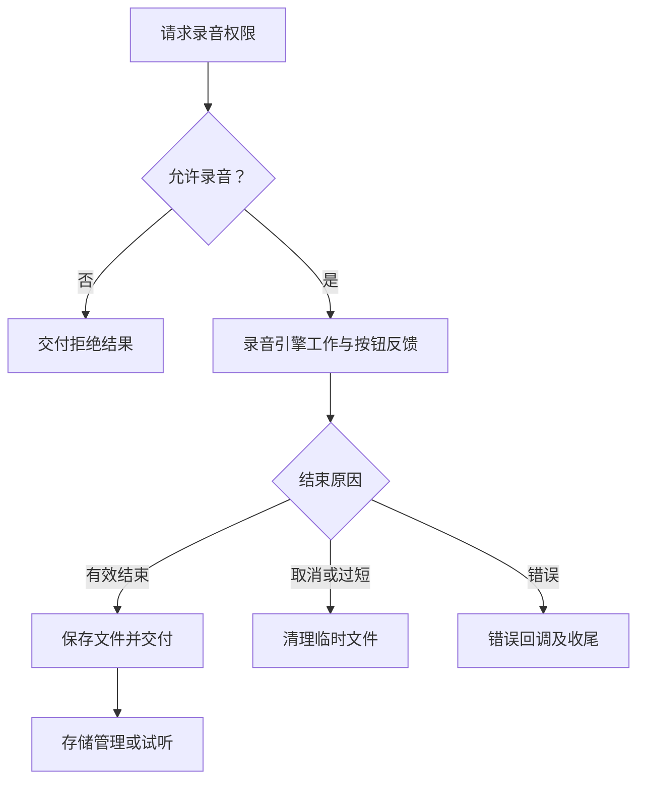

# JobsOCAudioRecorder

> 中文架构入口：[架构脉络与关键设计](#jobs-architecture)。

录音与本地音频管理组件。录音引擎、文件仓库、播放器、按住录音按钮之间仅通过公开接口协作。

- `Core`：提供短暂/长时间录音、录音文件管理、播放能力和圆形录音快门。
- 圆形快门统一采用微信风格的白色内圆、留白间隔和白色外圈；按住时内圆保持白色，红色进度沿外圈线性推进，达到最短有效时长后松开保存，移出取消。
- `minimumValidDuration` 默认 `3` 秒；不足时先走 `onCancel` 删除临时录音，再走 `onTooShort` 交给业务层提示。
- 短录音计时继续复用 `JobsOCTimer`，组件本身不持有 Demo 页面布局。

## 一、架构脉络与关键设计

本节用于用中文快速理解组件，并为按框架重建提供入口；关注职责、运行关系和关键边界，不要求逐行复刻。

### 1.1、设计目的与职责划分

将录音引擎、录音文件记录/存储、播放与圆形快门组织在独立组件中。引擎控制系统音频对象，Store 管理文件，快门将按住、松开和移出手势转为录制动作。

### 1.2、运行脉络

准备录音权限和会话 → 按住开始录制 → 计时更新快门 → 松开保存或移出取消 → Store 管理文件并供播放。

下图用于说明主要关系；异常、退出与线程边界结合下一节阅读。

### 1.3、关键设计与边界

- 短录音最短有效时长默认 3 秒；不足时先 onCancel 清理临时文件，再 onTooShort 通知业务。
- 取消与正常停止保存不同，不能保留已取消的临时录音。
- 短录音计时依赖 JobsOCTimer，Demo 布局与业务提示留在宿主。

### 1.4、阅读与重建顺序

先看录音记录和 Store，再看引擎协议与快门事件；重建时先明确文件何时创建、保存和删除。

源码定位（路径以本 README 所在目录为基准；只带走 README 时，可把文件名作为职责定位线索）：

- [Core/JobsOCAudioRecorder.h](<./Core/JobsOCAudioRecorder.h>)

依赖与编译入口：[JobsOCAudioRecorder.podspec](<./JobsOCAudioRecorder.podspec>)。其中显式依赖声明包括 `JobsOCTimer`、`JobsOCDSL`、`JobsBlock`、`JobsOCDefs`。源码范围、资源及可选 subspec 以这里的声明为准；辅助脚本动态补充的依赖不在上述摘录中展开。
