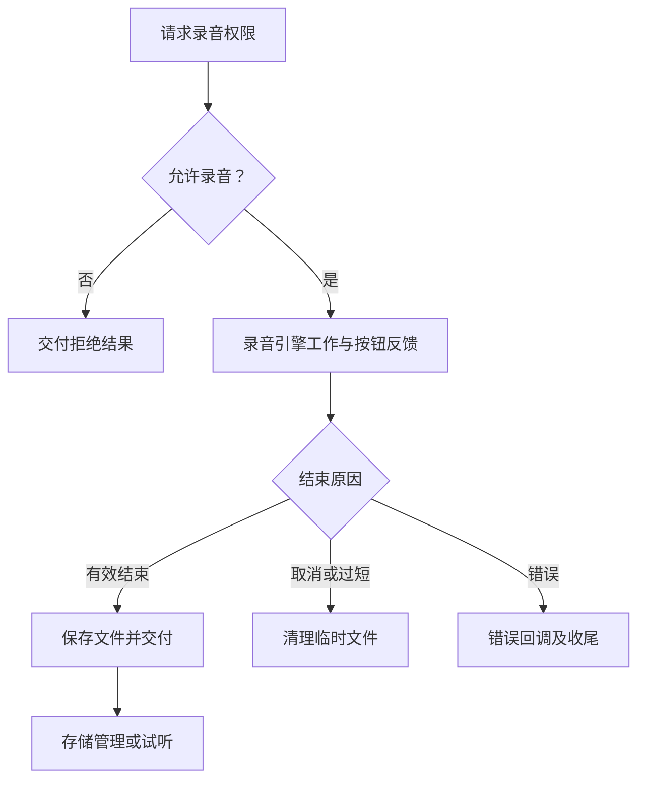

# <span id="前言">JobsOCAudioRecorder</span>


[toc]

---

> 中文架构入口：[架构脉络与关键设计](#jobs-architecture)。

录音与本地音频管理组件。录音引擎、文件仓库、播放器、按住录音按钮之间仅通过公开接口协作。

- `Core`：提供短暂/长时间录音、录音文件管理、播放能力和圆形录音快门。
- 圆形快门统一采用微信风格的白色内圆、留白间隔和白色外圈；按住时内圆保持白色，红色进度沿外圈线性推进，达到最短有效时长后松开保存，移出取消。
- `minimumValidDuration` 默认 `3` 秒；不足时先走 `onCancel` 删除临时录音，再走 `onTooShort` 交给业务层提示。
- 短录音计时继续复用 `JobsOCTimer`，组件本身不持有 Demo 页面布局。

<a id="jobs-architecture"></a>

## 一、架构脉络与关键设计 <a href="#前言" style="font-size:17px; color:green;"><b>🔼</b></a> <a href="#🔚" style="font-size:17px; color:green;"><b>🔽</b></a>

本节用于用中文快速理解组件，并为按框架重建提供入口；关注职责、运行关系和关键边界，不要求逐行复刻。

### 1.1、设计目的与职责划分 <a href="#前言" style="font-size:17px; color:green;"><b>🔼</b></a> <a href="#🔚" style="font-size:17px; color:green;"><b>🔽</b></a>

将录音引擎、录音文件记录/存储、播放与圆形快门组织在独立组件中。引擎控制系统音频对象，Store 管理文件，快门将按住、松开和移出手势转为录制动作。

### 1.2、运行脉络 <a href="#前言" style="font-size:17px; color:green;"><b>🔼</b></a> <a href="#🔚" style="font-size:17px; color:green;"><b>🔽</b></a>

准备录音权限和会话 → 按住开始录制 → 计时更新快门 → 松开保存或移出取消 → Store 管理文件并供播放。

下图用于说明主要关系；异常、退出与线程边界结合下一节阅读。


```mermaid
flowchart TD
    A["请求录音权限"] --> B{"允许录音？"}
    B -->|否| C["交付拒绝结果"]
    B -->|是| D["录音引擎工作与按钮反馈"]
    D --> E{"结束原因"}
    E -->|有效结束| F["保存文件并交付"]
    E -->|取消或过短| G["清理临时文件"]
    E -->|错误| H["错误回调及收尾"]
    F --> I["存储管理或试听"]
```

### 1.3、关键设计与边界 <a href="#前言" style="font-size:17px; color:green;"><b>🔼</b></a> <a href="#🔚" style="font-size:17px; color:green;"><b>🔽</b></a>

- 短录音最短有效时长默认 3 秒；不足时先 onCancel 清理临时文件，再 onTooShort 通知业务。
- 取消与正常停止保存不同，不能保留已取消的临时录音。
- 短录音计时依赖 JobsOCTimer，Demo 布局与业务提示留在宿主。

### 1.4、阅读与重建顺序 <a href="#前言" style="font-size:17px; color:green;"><b>🔼</b></a> <a href="#🔚" style="font-size:17px; color:green;"><b>🔽</b></a>

先看录音记录和 Store，再看引擎协议与快门事件；重建时先明确文件何时创建、保存和删除。

源码定位（路径以本 README 所在目录为基准；只带走 README 时，可把文件名作为职责定位线索）：

- [Core/JobsOCAudioRecorder.h](<./Core/JobsOCAudioRecorder.h>)

依赖与编译入口：[JobsOCAudioRecorder.podspec](<./JobsOCAudioRecorder.podspec>)。其中根级依赖声明包括 `JobsOCTimer`、`JobsOCDSL`、`JobsBlock`、`JobsOCDefs`。源码范围、资源及可选 subspec 以这里的声明为准；辅助脚本动态补充的依赖不在上述摘录中展开。

## 二、运行合同与失败边界 <a href="#前言" style="font-size:17px; color:green;"><b>🔼</b></a> <a href="#🔚" style="font-size:17px; color:green;"><b>🔽</b></a>

- 调用方先申请麦克风权限。start 仅在 prepare/record 真正成功后返回 YES；启动失败删除临时文件、归还会话并返回错误，输出文件使用 UUID 防碰撞。
- 引擎在录制与 stop 收尾期间拒绝新 session；finish/encodeError 检查 recorder identity，只结束一次当前录音，通知在主线程。音频会话中断取消当前录音并上报错误，不自动恢复录音。
- 录音或收尾期间拒绝切换播放会话；播放失败清理 player 与 AudioSession。权限、系统中断、锁屏和路由变化仍需真机验收。

## 三、目录计数与安装边界 <a href="#前言" style="font-size:17px; color:green;"><b>🔼</b></a> <a href="#🔚" style="font-size:17px; color:green;"><b>🔽</b></a>

计数递归扫描当前目录内的普通文件，排除 `.DS_Store` / `._*`；源码与头文件计入 `.h`、`.m`、`.mm`、`.c`、`.cc`、`.cpp`、`.hpp`、`.swift`。资源目录中的目录、资源编译结果和文件大小不计入文件数，文件存在不代表必然打包。

| 目录 | 实际文件 | 源码 / 头文件 | 安装边界 |
| --- | --- | --- | --- |
| `Core/` | 2 | 2 | 公共入口与核心实现；公开 / 私有头由 podspec 指定 |
| `Support/`（无目录） | 0 | 0 | 仅供当前 Pod 内部实现，按实际 subspec / private header 映射 |
| `Resource/` | 1 | 0 | 非代码资源；按 resources / resource_bundles 和排除规则安装 |
| `Tests/` | 9 | 8 | 只由独立测试目标或回归 harness 使用，不进入生产 source_files |

`Core` 的物理目录不等于所有头文件均公开；`Support` 和测试 fixture 不作为 App 或其它 Pod 的稳定消费入口。根聚合头与 `public_header_files` 是外部引用依据。

根级命名资源 bundle：`JobsOCAudioRecorderPrivacy.bundle`；已有运行资源保持各自 bundle 查找合同。

隐私声明入口：[Resource/PrivacyInfo.xcprivacy](<./Resource/PrivacyInfo.xcprivacy>)，通过 `JobsOCAudioRecorderPrivacy.bundle` 安装。声明类别与理由按该文件记录：

| API 类别 | 理由标识 | 当前代码用途 |
| --- | --- | --- | --- |
| `NSPrivacyAccessedAPICategoryFileTimestamp` | `C617.1` | 文件时间戳读取，用于本地文件 / 缓存生命周期处理 |

理由使用合同：`C617.1`：仅访问本 App、同组或 CloudKit 容器内文件。范围依据 [Apple 理由定义](https://developer.apple.com/documentation/bundleresources/app-privacy-configuration/nsprivacyaccessedapitypes/nsprivacyaccessedapitypereasons)。

该文件记录当前 Pod 使用的 API 类别；宿主仍需按自身实际调用和数据行为维护自己的声明。最终产物是否包含该命名 bundle，随独立 Pod 与主工程资源验收一起核对。

## 四、本轮单元验证 <a href="#前言" style="font-size:17px; color:green;"><b>🔼</b></a> <a href="#🔚" style="font-size:17px; color:green;"><b>🔽</b></a>

当前结果：**Debug / Release 单 Pod 编译、Debug Stability 回归、macOS 生产实现回归已完成；整体验收记录见根 [JobsByPods升级实施与编译验证.md](<../../JobsByPods升级实施与编译验证.md>)**。生产源码、测试源码、资源与工程配置的指纹一致且命令真实退出成功，才可复用对应验证记录。

生产行为与边界按上述核心契约验收；逐 Pod 编译与独立行为回归分别记录结果。

从本 README 所在目录回到工程根目录，再运行该 Pod 的 Debug / Release 单元编译：

```shell
cd ../..
ruby ScriptsByPods/jobs_pods_stability_verify.rb/jobs_pods_stability_verify.rb \
  --phase pods --pod JobsOCAudioRecorder
```

当前 podspec 显式提供 `Stability` test_spec。`Tests/` 与测试 fixture 只进入测试目标；真实行为断言通过后再回填结果。指定可用模拟器 UDID：

```shell
ruby ScriptsByPods/jobs_pods_stability_verify.rb/jobs_pods_stability_verify.rb \
  --phase tests --pod JobsOCAudioRecorder --simulator '<UDID>'
```

本地生产实现回归 harness：

```shell
ruby JobsByPods/JobsOCAudioRecorder@Pods/Tests/run_regression.rb
```

运行前应已安装工程依赖；runner 的 `--phase pods` 默认分别编译 Debug / Release，`--phase tests` 默认运行 Debug（JobsOCSnowflake 默认 Debug / Release），并将命令、源码指纹、日志和退出码保存到工程 `work/JobsPodsStability/`。如需固定输出目录，使用 runner 的 `--output`。

- 录音/播放器初始化返回 nil 时先判空，再清理临时文件、归还本次已激活的音频会话并返回原 NSError；不会执行 nil 的 byDelegate Block。Tests 提供 session/factory 替身，回归完整 startWithMode/toggleURL 的失败初始化路径，不使用麦克风权限或真实音频会话。录音 factory 记录 partial-file 写入的实际 BOOL；XCTest 先断言 fixture 创建成功，再断言生产失败清理后文件已不存在，避免用原本不存在的文件证明清理有效。测试通过 KVC 检查私有 recorder/currentURL 状态，不为测试增加公有 getter 或替身影子状态。

<a id="🔚" href="#前言" style="font-size:17px; color:green; font-weight:bold;">我是有底线的➤点我回到首页</a>
