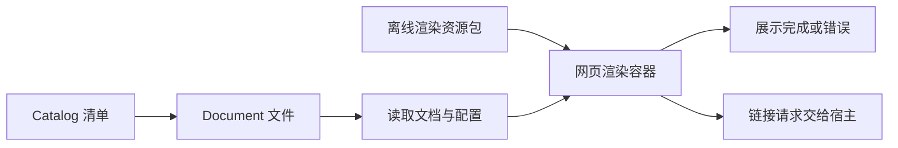

# JobsOCMarkdown

[toc]

> 中文架构入口：[架构脉络与关键设计](#jobs-architecture)。

---

## 一、能力

`JobsOCMarkdown` 是面向 Jobs Objective-C 新工程的本地 Markdown 渲染 Pod。
它使用 `WKWebView` 承载成熟的 Web 解析内核，支持：

- CommonMark / GFM、表格、删除线、任务列表；
- `[toc]`、标题锚点、文档内跳转；
- Objective-C、Swift、Shell 等代码高亮与复制；
- Mermaid、KaTeX；
- 原始 HTML、项目相对图片和其它本地资源；
- 浅色、深色、跟随系统与自定义 CSS；
- UTF-8 文本在原生层与 JavaScript 运行时之间安全传输；
- 构建期文档清单，以及 Markdown 文件之间的链接。

## 二、接入

```ruby
pod 'JobsOCMarkdown', :path => './JobsByPods/JobsOCMarkdown@Pods'
```

宿主 App 还需要在构建阶段调用 `Support/JobsMarkdownPackager.rb`，把当前仓库的
Markdown 和被引用的本地资源写入 App 内的 `JobsMarkdownDocuments.bundle`。
OC 老工程不依赖本 Pod，而是把同一组 Objective-C 源码、资源和打包器直接集成
进主工程。

## 三、读取与渲染

```objective-c
NSError *error = nil;
JobsOCMarkdownCatalog *catalog = [JobsOCMarkdownCatalog bundledCatalogWithError:&error];
JobsOCMarkdownDocument *document = catalog.documents.firstObject;
[markdownView loadDocument:document];
```

文档列表属于宿主 Demo；Pod 只负责清单模型、文件读取与渲染。宿主 Demo 的
详情导航标题跟随当前文档标题，列表点按态使用主题语义背景色。

## 四、第三方内核

资源包内原样包含 `markdown-it`、`highlight.js`、`Mermaid`、`KaTeX` 和
`DOMPurify` 的浏览器发行文件。版本与许可证见 `ThirdPartyLicenses`，Jobs 自有
代码不修改这些第三方文件。

<a id="jobs-architecture"></a>

## 五、架构脉络与关键设计

本节用于用中文快速理解组件，并为按框架重建提供入口；关注职责、运行关系和关键边界，不要求逐行复刻。

### 5.1、设计目的与职责划分

用 Catalog/Document 管理文档清单与文件定位，Configuration 控制渲染选项，MarkdownView 承载网页渲染。资源包提供 markdown-it、代码高亮、图表、公式和净化库，文档列表属于宿主。

### 5.2、运行脉络

选择清单中的文档 → 定位并读取文件 → 载入渲染资源和配置 → 网页视图展示 → 处理链接或外部资源。

下图用于说明主要关系；异常、退出与线程边界结合下一节阅读。



### 5.3、关键设计与边界

- 文档读取、[**Markdown**](https://markdown.cn) 转换和 WebView 展示是不同阶段，错误要能定位到对应阶段。
- 离线浏览依赖完整资源包，不能只复制原生视图类。
- 第三方浏览器发行文件及许可证原样保留，不属于自研重建范围。

### 5.4、阅读与重建顺序

先看 Catalog/Document 的路径约定，再看 Configuration 与 View 的加载流程，最后核对资源包和远程访问边界。

源码定位（路径以本 README 所在目录为基准；只带走 README 时，可把文件名作为职责定位线索）：

- [JobsOCMarkdown.h](<./JobsOCMarkdown.h>)
- [Core/JobsOCMarkdownConfiguration.h](<./Core/JobsOCMarkdownConfiguration.h>)
- [Core/JobsOCMarkdownView.h](<./Core/JobsOCMarkdownView.h>)
- [Core/JobsOCMarkdownCatalog.h](<./Core/JobsOCMarkdownCatalog.h>)
- [Core/JobsOCMarkdownDocument.h](<./Core/JobsOCMarkdownDocument.h>)

依赖与编译入口：[JobsOCMarkdown.podspec](<./JobsOCMarkdown.podspec>)。其中显式依赖声明包括 `JobsMakes`、`JobsOCDSL`、`JobsOCDefs`、`JobsBlock`、`Masonry`。源码范围、资源及可选 subspec 以这里的声明为准；辅助脚本动态补充的依赖不在上述摘录中展开。
