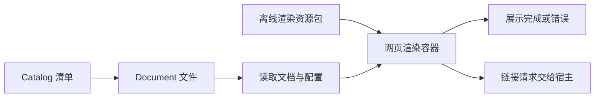

# <span id="前言">JobsOCMarkdown</span>


[toc]

---

[toc]

> 中文架构入口：[架构脉络与关键设计](#jobs-architecture)。

---

## 一、能力 <a href="#前言" style="font-size:17px; color:green;"><b>🔼</b></a> <a href="#🔚" style="font-size:17px; color:green;"><b>🔽</b></a>

`JobsOCMarkdown` 是面向 Jobs Objective-C 新工程的本地 Markdown 渲染 Pod。
它使用 `WKWebView` 承载成熟的 Web 解析内核，支持：

- CommonMark / GFM、表格、删除线、任务列表；
- `[toc]`、标题锚点、文档内跳转；
- Objective-C、Swift、Shell 等代码高亮与复制；
- Mermaid、KaTeX；
- 原始 HTML、项目相对图片和其它本地资源；
- 浅色、深色、跟随系统与自定义 CSS；
- UTF-8 文本在原生层与 JavaScript 运行时之间安全传输；
- 构建期文档清单，以及 Markdown 文件之间的链接。

## 二、接入 <a href="#前言" style="font-size:17px; color:green;"><b>🔼</b></a> <a href="#🔚" style="font-size:17px; color:green;"><b>🔽</b></a>

```ruby
pod 'JobsOCMarkdown', :path => './JobsByPods/JobsOCMarkdown@Pods'
```

宿主 App 还需要在构建阶段调用 `Support/JobsMarkdownPackager.rb`，把当前仓库的
Markdown 和被引用的本地资源写入 App 内的 `JobsMarkdownDocuments.bundle`。
打包器会主动把 Xcode 非交互 Shell 返回的文件系统路径规范为 UTF-8，中文目录
不会因为构建进程缺少 `LANG` / `LC_ALL` 而导致清单 JSON 生成失败。
OC 老工程不依赖本 Pod，而是把同一组 Objective-C 源码、资源和打包器直接集成
进主工程。

打包器固定排除 `Products`、`Intermediates`、自有验证树
`work/JobsPodsStability/full`，以及任意位置的 `JobsMarkdownDocuments.bundle`
组件，避免旧构建文档再次进入清单。文档扫描和本地引用资源共用这组静态规则；
普通 `worknotes` / `work/notes` 文档及构建树外的 proof JSON 仍按原规则复制，
不整体排除 `work`。新旧主工程沿用三个构建参数，无须临时环境变量。

## 三、读取与渲染 <a href="#前言" style="font-size:17px; color:green;"><b>🔼</b></a> <a href="#🔚" style="font-size:17px; color:green;"><b>🔽</b></a>

```objective-c
NSError *error = nil;
JobsOCMarkdownCatalog *catalog = [JobsOCMarkdownCatalog bundledCatalogWithError:&error];
JobsOCMarkdownDocument *document = catalog.documents.firstObject;
[markdownView loadDocument:document];
```

文档列表属于宿主 Demo；Pod 只负责清单模型、文件读取与渲染。宿主 Demo 的
详情导航标题跟随当前文档标题，列表点按态使用主题语义背景色。

## 四、第三方内核 <a href="#前言" style="font-size:17px; color:green;"><b>🔼</b></a> <a href="#🔚" style="font-size:17px; color:green;"><b>🔽</b></a>

资源包内原样包含 `markdown-it`、`highlight.js`、`Mermaid`、`KaTeX` 和
`DOMPurify` 的浏览器发行文件。版本与许可证见 `ThirdPartyLicenses`，Jobs 自有
代码不修改这些第三方文件。

<a id="jobs-architecture"></a>

## 五、架构脉络与关键设计 <a href="#前言" style="font-size:17px; color:green;"><b>🔼</b></a> <a href="#🔚" style="font-size:17px; color:green;"><b>🔽</b></a>

本节用于用中文快速理解组件，并为按框架重建提供入口；关注职责、运行关系和关键边界，不要求逐行复刻。

### 5.1、设计目的与职责划分 <a href="#前言" style="font-size:17px; color:green;"><b>🔼</b></a> <a href="#🔚" style="font-size:17px; color:green;"><b>🔽</b></a>

用 Catalog/Document 管理文档清单与文件定位，Configuration 控制渲染选项，MarkdownView 承载网页渲染。资源包提供 markdown-it、代码高亮、图表、公式和净化库，文档列表属于宿主。

### 5.2、运行脉络 <a href="#前言" style="font-size:17px; color:green;"><b>🔼</b></a> <a href="#🔚" style="font-size:17px; color:green;"><b>🔽</b></a>

选择清单中的文档 → 定位并读取文件 → 载入渲染资源和配置 → 网页视图展示 → 处理链接或外部资源。

下图用于说明主要关系；异常、退出与线程边界结合下一节阅读。


```mermaid
flowchart LR
    A["Catalog 清单"] --> B["Document 文件"]
    B --> C["读取文档与配置"]
    D["离线渲染资源包"] --> E["网页渲染容器"]
    C --> E
    E --> F["展示完成或错误"]
    E --> G["链接请求交给宿主"]
```

### 5.3、关键设计与边界 <a href="#前言" style="font-size:17px; color:green;"><b>🔼</b></a> <a href="#🔚" style="font-size:17px; color:green;"><b>🔽</b></a>

- 文档读取、[**Markdown**](https://markdown.cn) 转换和 WebView 展示是不同阶段，错误要能定位到对应阶段。
- 离线浏览依赖完整资源包，不能只复制原生视图类。
- 第三方浏览器发行文件及许可证原样保留，不属于自研重建范围。

### 5.4、阅读与重建顺序 <a href="#前言" style="font-size:17px; color:green;"><b>🔼</b></a> <a href="#🔚" style="font-size:17px; color:green;"><b>🔽</b></a>

先看 Catalog/Document 的路径约定，再看 Configuration 与 View 的加载流程，最后核对资源包和远程访问边界。

源码定位（路径以本 README 所在目录为基准；只带走 README 时，可把文件名作为职责定位线索）：

- [JobsOCMarkdown.h](<./JobsOCMarkdown.h>)
- [Core/JobsOCMarkdownConfiguration.h](<./Core/JobsOCMarkdownConfiguration.h>)
- [Core/JobsOCMarkdownView.h](<./Core/JobsOCMarkdownView.h>)
- [Core/JobsOCMarkdownCatalog.h](<./Core/JobsOCMarkdownCatalog.h>)
- [Core/JobsOCMarkdownDocument.h](<./Core/JobsOCMarkdownDocument.h>)

依赖与编译入口：[JobsOCMarkdown.podspec](<./JobsOCMarkdown.podspec>)。其中根级依赖声明包括 `JobsMakes`、`JobsOCDSL`、`JobsOCDefs`、`JobsBlock`、`Masonry`。源码范围、资源及可选 subspec 以这里的声明为准；辅助脚本动态补充的依赖不在上述摘录中展开。

## 六、文档加载与生命周期 <a href="#前言" style="font-size:17px; color:green;"><b>🔼</b></a> <a href="#🔚" style="font-size:17px; color:green;"><b>🔽</b></a>

`byDocument(document)`、`loadDocument(document)` 和 `reloadDocument()` 进入同一加载流程。内部保存 document 后读取文件，不递归调用链式入口。销毁时只操作已创建的网页对象，移除消息 handler 并停止导航；晚到的 JavaScript 完成回调在宿主释放后直接结束。

文件缺失、UTF-8 读取失败和渲染资源缺失通过已有错误 delegate 回传。调用方在主线程创建和更新视图；资源中的第三方发行文件保持原样。

回归测试位于 `Tests/JobsOCMarkdownStabilityTests/`。在包含该 Pod 的 XCTest 宿主中运行，覆盖以上生命周期和边界合同；源码编译通过不能替代这些行为断言。

## 七、目录计数与安装边界 <a href="#前言" style="font-size:17px; color:green;"><b>🔼</b></a> <a href="#🔚" style="font-size:17px; color:green;"><b>🔽</b></a>

计数递归扫描当前目录内的普通文件，排除 `.DS_Store` / `._*`；源码与头文件计入 `.h`、`.m`、`.mm`、`.c`、`.cc`、`.cpp`、`.hpp`、`.swift`。资源目录中的目录、资源编译结果和文件大小不计入文件数，文件存在不代表必然打包。

| 目录 | 实际文件 | 源码 / 头文件 | 安装边界 |
| --- | --- | --- | --- |
| `Core/` | 8 | 8 | 公共入口与核心实现；公开 / 私有头由 podspec 指定 |
| `Support/` | 3 | 2 | 仅供当前 Pod 内部实现，按实际 subspec / private header 映射 |
| `Resource/` | 31 | 0 | 非代码资源；按 resources / resource_bundles 和排除规则安装 |
| `Tests/` | 2 | 2 | 只由独立测试目标或回归 harness 使用，不进入生产 source_files |

`Core` 的物理目录不等于所有头文件均公开；`Support` 和测试 fixture 不作为 App 或其它 Pod 的稳定消费入口。根聚合头与 `public_header_files` 是外部引用依据。

根级私有头模式：`Support/Native/**/*.h`；相应实现照常编译，头文件不从公共聚合入口消费。

根级命名资源 bundle：`JobsOCMarkdownResources.bundle`；已有运行资源保持各自 bundle 查找合同。

## 八、本轮单元验证 <a href="#前言" style="font-size:17px; color:green;"><b>🔼</b></a> <a href="#🔚" style="font-size:17px; color:green;"><b>🔽</b></a>

当前结果：**Debug / Release 单 Pod 编译、Debug Stability 回归已完成；整体验收记录见根 [JobsByPods升级实施与编译验证.md](<../../JobsByPods升级实施与编译验证.md>)**。生产源码、测试源码、资源与工程配置的指纹一致且命令真实退出成功，才可复用对应验证记录。

生产行为与边界按上述核心契约验收；逐 Pod 编译与独立行为回归分别记录结果。

从本 README 所在目录回到工程根目录，再运行该 Pod 的 Debug / Release 单元编译：

```shell
cd ../..
ruby ScriptsByPods/jobs_pods_stability_verify.rb/jobs_pods_stability_verify.rb \
  --phase pods --pod JobsOCMarkdown
```

当前 podspec 显式提供 `Stability` test_spec。`Tests/` 与测试 fixture 只进入测试目标；真实行为断言通过后再回填结果。指定可用模拟器 UDID：

```shell
ruby ScriptsByPods/jobs_pods_stability_verify.rb/jobs_pods_stability_verify.rb \
  --phase tests --pod JobsOCMarkdown --simulator '<UDID>'
```

运行前应已安装工程依赖；runner 的 `--phase pods` 默认分别编译 Debug / Release，`--phase tests` 默认运行 Debug（JobsOCSnowflake 默认 Debug / Release），并将命令、源码指纹、日志和退出码保存到工程 `work/JobsPodsStability/`。如需固定输出目录，使用 runner 的 `--output`。

<a id="🔚" href="#前言" style="font-size:17px; color:green; font-weight:bold;">我是有底线的➤点我回到首页</a>
