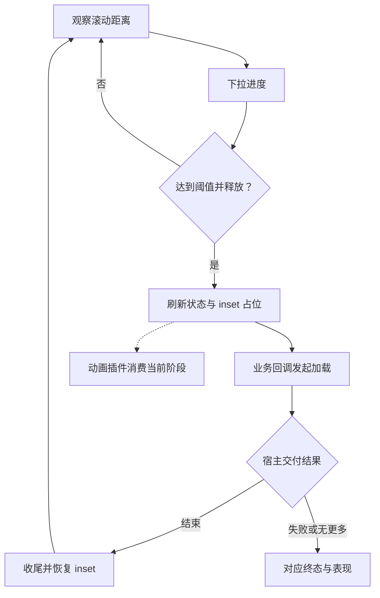

# `JobsOCRefresher`


[toc]

> 中文架构入口：[架构脉络与关键设计](#jobs-architecture)。

---

## 🔥 <font id=前言>前言</font>

> `JobsOCRefresher` 是 Jobs [**Objective-C**](https://developer.apple.com/library/archive/documentation/Cocoa/Conceptual/ProgrammingWithObjectiveC/Introduction/Introduction.html) 侧刷新 / 加载更多组件，设计目标是保留 [**MJRefresh**](https://github.com/CoderMJLee/MJRefresh) 的低学习成本，同时补齐横向刷新、横向反向语义、统一状态机和动画热插拔。

## 一、用途 <a href="#前言" style="font-size:17px; color:green;"><b>🔼</b></a> <a href="#🔚" style="font-size:17px; color:green;"><b>🔽</b></a>

- `JobsOCRefresher` 通过 `UIScrollView` 分类挂载能力，`UITableView` 和 `UICollectionView` 可以共用。
- 支持纵向 `Header` / `Footer`，也支持横向 `Left` / `Right`。
- 横向支持两种语义模式：
  - `JobsOCRefreshHorizontalModeRefreshRightLoadLeft`：右拉刷新，左拉加载更多。
  - `JobsOCRefreshHorizontalModeLoadRightRefreshLeft`：右拉加载更多，左拉刷新。
- 状态机覆盖 `idle`、`pulling`、`ready`、`refreshing`、`ending`、`failed`、`disabled`、`noMoreData`、`removed`。
- 默认皮肤支持横向竖排文案与最近一次刷新时间；动画表现只依赖 `JobsRefreshAnimatorProtocol`，不再写死具体素材类型。
- `JobsFuseAnimation` 内置系统菊花、单图、多图定时轮播、GIF、Lottie、今日头条风格双三角和抖音风格双球动画。
- 配置阶段通过 `config.animator` 注入；挂载后通过 `jobs_replaceRefreshAnimator:atPosition:` 原位热替换，不重建刷新状态机。
- 默认配置开启刷新触发时的震动反馈，可用 `jobs_enableRefreshHaptics:NO` 显式关闭；声音反馈可通过 `soundName` 或 `jobs_setRefreshSound` 指定主 bundle 内音频资源。

## 二、目录结构 <a href="#前言" style="font-size:17px; color:green;"><b>🔼</b></a> <a href="#🔚" style="font-size:17px; color:green;"><b>🔽</b></a>

```text
JobsOCRefresher@Pods
├── JobsOCRefresher.h
├── JobsOCRefresher.podspec
├── JobsPodspecKit.rb
├── README.md
└── Core
    └── JobsOCRefresher
        ├── JobsOCRefreshDefines
        │   ├── JobsOCRefreshDefines.h
        │   └── JobsOCRefreshDefines.m
        ├── JobsOCRefreshConfig
        │   ├── JobsOCRefreshConfig.h
        │   └── JobsOCRefreshConfig.m
        ├── JobsOCRefreshComponent
        │   ├── JobsOCRefreshComponent.h
        │   └── JobsOCRefreshComponent.m
        └── UIScrollView+JobsOCRefresher
            ├── UIScrollView+JobsOCRefresher.h
            └── UIScrollView+JobsOCRefresher.m
```

## 三、安装方式 <a href="#前言" style="font-size:17px; color:green;"><b>🔼</b></a> <a href="#🔚" style="font-size:17px; color:green;"><b>🔽</b></a>

- 默认核心：

  ```ruby
  pod 'JobsOCRefresher', :path => 'JobsByPods/JobsOCRefresher@Pods'
  ```

- 动画实现统一由 `JobsFuseAnimation` 提供，`JobsOCRefresher` 会通过 podspec 自动接入，不再提供按具体素材类型拆分的子规格。

## 四、使用方式 <a href="#前言" style="font-size:17px; color:green;"><b>🔼</b></a> <a href="#🔚" style="font-size:17px; color:green;"><b>🔽</b></a>

### 4.1、纵向刷新 / 加载更多

```objc
[tableView jobs_byRefreshHeaderWithAction:^{
    /// 请求完成后恢复
    [tableView jobs_switchRefreshAt:JobsOCRefreshPositionHeader
                             toState:JobsOCRefreshStateIdle];
}];

[tableView jobs_byRefreshFooterWithAction:^{
    /// 没有更多数据时
    [tableView jobs_switchRefreshAt:JobsOCRefreshPositionFooter
                             toState:JobsOCRefreshStateNoMoreData];
}];
```

### 4.2、横向刷新 / 加载更多

```objc
[collectionView jobs_setHorizontalRefreshMode:JobsOCRefreshHorizontalModeRefreshRightLoadLeft];

[collectionView jobs_bySideRefreshAt:JobsOCRefreshPositionLeft
                               config:nil
                               action:^{
    [collectionView jobs_switchRefreshAt:JobsOCRefreshPositionLeft
                                 toState:JobsOCRefreshStateIdle];
}];

[collectionView jobs_bySideRefreshAt:JobsOCRefreshPositionRight
                               config:nil
                               action:^{
    [collectionView jobs_switchRefreshAt:JobsOCRefreshPositionRight
                                 toState:JobsOCRefreshStateIdle];
}];
```

### 4.3、震动 / 声音反馈

```objc
JobsOCRefreshConfig *config = JobsOCRefreshConfig.defaultHeaderConfig;
config.enablesHaptics = YES;
config.soundName = @"refresh.wav";

[tableView jobs_byRefreshHeaderWithConfig:config
                                   action:^{
    [tableView jobs_switchRefreshAt:JobsOCRefreshPositionHeader
                             toState:JobsOCRefreshStateIdle];
}];

[[tableView jobs_enableRefreshHaptics:YES] jobs_setRefreshSound:@"refresh.wav"];
```

### 4.4、动画插件与热替换

```objc
JobsOCRefreshConfig *config = JobsOCRefreshConfig.defaultHeaderConfig;
config.showsText = NO;
config.animator = [[JobsTodayNewsRefreshView alloc] initWithConfig:JobsTodayNewsRefreshConfig.config];

[tableView jobs_byRefreshHeaderWithConfig:config action:^{
    [tableView jobs_switchRefreshAt:JobsOCRefreshPositionHeader
                             toState:JobsOCRefreshStateIdle];
}];
```

```objc
id<JobsRefreshAnimatorProtocol> douyinAnimator =
    [[JobsDouyinRefreshView alloc] initWithConfig:JobsDouyinRefreshConfig.config];
[tableView jobs_replaceRefreshAnimator:douyinAnimator
                            atPosition:JobsOCRefreshPositionHeader];
```

首次挂载没有旧动画视图时会直接安装新插件；运行时热替换只在旧视图存在时先停用并卸载，再挂载新视图并同步当前刷新状态。

其它内置实现：

```objc
config.animator = [[JobsImageRefreshView alloc] initWithImage:singleImage];
config.animator = [[JobsImageRefreshView alloc] initWithImages:images frameInterval:0.08];
config.animator = [[JobsGIFRefreshView alloc] initWithGIFNamed:@"refresh.gif"];
config.animator = [[JobsLottieRefreshView alloc] initWithAnimationNamed:@"refresh.json"];
```

业务自定义插件只需实现 `refreshAnimatorView`、`refreshAnimatorPreferredSize` 和 `refreshAnimatorApplyPhase:progress:`。

## 五、公开能力 <a href="#前言" style="font-size:17px; color:green;"><b>🔼</b></a> <a href="#🔚" style="font-size:17px; color:green;"><b>🔽</b></a>

- `JobsOCRefresher.h`：聚合头，随 `Core` 子规格一起进入 Public Headers，外部固定通过 `<JobsOCRefresher/JobsOCRefresher.h>` 引用。
- `JobsOCRefreshDefines`：方向、位置、语义、横向模式与状态；刷新回调类型由 `JobsBlock` 统一承接。
- `JobsOCRefreshConfig`：触发距离、组件长度、文案、声音、震动、动画协议对象；默认文案走 `JobsLanMgr` 的 `.tr` 国际化入口。
- `JobsOCRefreshComponent`：把刷新状态映射为动画阶段，负责协议视图托管与布局，不识别具体动画类型。
- `UIScrollView+JobsOCRefresher`：挂载、切换状态、热替换动画、移除刷新组件。

## 六、风险边界 <a href="#前言" style="font-size:17px; color:green;"><b>🔼</b></a> <a href="#🔚" style="font-size:17px; color:green;"><b>🔽</b></a>

- 当前 Core 不依赖 `MJRefresh` / `XZMRefresh`，行为由本 Pod 自己维护。
- 当前 Core 直接依赖 `JobsBlock`、`JobsLanMgr`、`JobsMakes`、`JobsOCDSL`、`JobsOCDefs` 和 `JobsFuseAnimation`；素材解码、计时和品牌动画继续留在动画框架内。
- 协议替换发生在当前刷新槽位中；正在刷新时替换，新插件会立即接收当前 `refreshing` 阶段。
- 修改 `podspec` 后建议执行 `pod install --no-repo-update`，并检查 `Pods/Pods.xcodeproj` 是否能正常展开 `Development Pods > JobsOCRefresher`。

## 明暗主题契约

- 页面、列表和弹框的普通承载面使用 `JobsSystemBackgroundColor` / `JobsSecondarySystemBackgroundColor`，正文、说明和占位文字使用 `JobsLabelColor` / `JobsSecondaryLabelColor` / `JobsPlaceholderTextColor`，确保白天浅底深字、黑夜深底浅字。
- 品牌色、媒体画布、二维码、相机、视频、手写和马赛克内容保留业务色；颜色写入 `CGColor`、`CALayer`、CoreText 或自绘上下文时，需要在主题通知或 Trait 变化后重新解析和绘制。
- 验证时从 Demo 全局主题入口分别切换白天和黑夜，检查组件的背景、文字、禁用态、占位态与弹出层对比度。

<a id="jobs-architecture"></a>

## 七、架构脉络与关键设计

本节用于用中文快速理解组件，并为按框架重建提供入口；关注职责、运行关系和关键边界，不要求逐行复刻。

### 7.1、设计目的与职责划分

由滚动视图分类托管刷新挂载与状态，Config 定义触发位置和策略，Component 展示文案、时间与动画。动画通过统一协议接入 JobsFuseAnimation，刷新治理与表现分离。

### 7.2、运行脉络

挂载刷新组件 → 滚动产生拉动进度 → 到达条件触发刷新 → 业务完成后结束 → 更新状态/时间并恢复布局。

下图用于说明主要关系；异常、退出与线程边界结合下一节阅读。



### 7.3、关键设计与边界

- 上下左右位置影响布局与触发距离，不能假定只有竖向下拉。
- replaceAnimator 支持原位替换表现，不能因此丢失当前进度和刷新状态。
- 刷新回调只表示触发，业务需要明确结束或无更多数据状态。

### 7.4、阅读与重建顺序

先读 Defines/Config，再追踪 UIScrollView 分类的状态推进，最后看 Component 到动画协议的映射。

源码定位（路径以本 README 所在目录为基准；只带走 README 时，可把文件名作为职责定位线索）：

- [JobsOCRefresher.h](<./JobsOCRefresher.h>)
- [Core/JobsOCRefresher/JobsOCRefreshConfig/JobsOCRefreshConfig.h](<./Core/JobsOCRefresher/JobsOCRefreshConfig/JobsOCRefreshConfig.h>)
- [Core/JobsOCRefresher/UIScrollView+JobsOCRefresher/UIScrollView+JobsOCRefresher.h](<./Core/JobsOCRefresher/UIScrollView+JobsOCRefresher/UIScrollView+JobsOCRefresher.h>)
- [Core/JobsOCRefresher/JobsOCRefreshComponent/JobsOCRefreshComponent.h](<./Core/JobsOCRefresher/JobsOCRefreshComponent/JobsOCRefreshComponent.h>)
- [Core/JobsOCRefresher/JobsOCRefreshDefines/JobsOCRefreshDefines.h](<./Core/JobsOCRefresher/JobsOCRefreshDefines/JobsOCRefreshDefines.h>)

依赖与编译入口：[JobsOCRefresher.podspec](<./JobsOCRefresher.podspec>)。其中显式依赖声明包括 `JobsBlock`、`JobsLanMgr`、`JobsMakes`、`JobsOCDSL`、`JobsOCDefs`、`JobsFuseAnimation`。源码范围、资源及可选 subspec 以这里的声明为准；辅助脚本动态补充的依赖不在上述摘录中展开。

<a id="🔚" href="#前言" style="font-size:17px; color:green; font-weight:bold;">我是有底线的➤点我回到首页</a>
