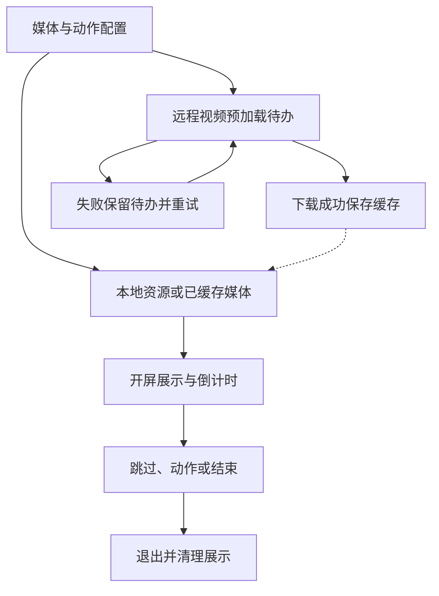

# `JobsOCSplash`


[toc]

> 中文架构入口：[架构脉络与关键设计](#jobs-architecture)。

---

## 🔥 <font id=前言>前言</font>

> `JobsOCSplash` 是 OC 版本地开屏 Pod，对齐 Swift 项目里的 `JobsSwiftSplash`，支持图片、GIF、视频、倒计时跳过和开屏交互行为。

## 一、功能说明 <a href="#前言" style="font-size:17px; color:green;"><b>🔼</b></a> <a href="#🔚" style="font-size:17px; color:green;"><b>🔽</b></a>

- 内容支持本地静态图、本地 GIF、远程图片、本地视频和远程视频。
- 依赖 `JobsBlock`、`JobsOCDefs`、`JobsByOCPods`、`JobsOCDSL`、`JobsMakes`、`JobsOCTimer`，block 类型、属性宏和按钮倒计时能力不在本 Pod 内重复定义。
- UIImageView / UIView / CALayer 的图片、Frame、父视图附着、自动缩放与按钮高亮调整统一走现有 Jobs DSL；AVPlayer / WebKit 等尚未覆盖的专属 API 保留系统调用，待底层封装补齐后再迁移。
- 远程媒体首次下载到 `Caches/JobsOCSplash`，后续直接读取本地缓存。
- 远程视频采用预加载策略：缓存完整时才播放远程文件；未缓存时立即播放配置的本地视频兜底，并在倒计时按钮左侧显示“仅在 Wi-Fi 环境下下载视频”。预加载只允许非蜂窝网络，任务由缓存单例持有，开屏倒计时结束或用户手动移除覆盖层都不会取消；失败后退避重试并跨启动恢复待下载 URL，直到缓存成功。
- 跳过按钮默认显示在安全区右上角，也可以通过 `bySkipButtonFrame` 指定 Frame。
- 跳过按钮的背景色与圆角统一走 `jobsResetBtnBgCor` / `jobsResetBtnCornerRadiusValue`：iOS 16+ 写入 `UIButtonConfiguration.background`，旧系统回退传统按钮管线。创建时先按默认 `36pt` 高度应用 `18pt` 圆角，保证首帧就是胶囊形；布局完成后再按当前实际高度的一半校准。
- 开屏页作为宿主页面上的子控制器覆盖层，不创建导航栏或返回按键；宿主是系统导航、Tab、Split 或 Page 容器时，Presenter 会把覆盖层挂到当前可见内容控制器，不会把开屏页塞进容器自身的管理栈。
- 倒计时按钮基于 `UIButton+Timer`，运行期间保持可点击；倒计时结束或用户点击右上角按钮都会执行统一的 `finish`，直接移除开屏覆盖层。
- 开屏展示期间会暂停宿主页面已有手势，退出时恢复原状态，避免宿主手势拦截跳过按钮或穿透到开屏下方。
- 点击开屏和摇一摇默认打开百度，也可替换为自定义 block 或关闭行为。
- `JobsOCSplashPreferences` 持久化记录下次启动是否展示开屏，以及下次启动采用的内容类型；内容类型覆盖本地图片、本地 GIF、远程图片、本地视频和远程视频，首次使用默认为本地图片。

## 二、接入示例 <a href="#前言" style="font-size:17px; color:green;"><b>🔼</b></a> <a href="#🔚" style="font-size:17px; color:green;"><b>🔽</b></a>

```objc
#import <JobsOCSplash/JobsOCSplash.h>

JobsOCSplashConfiguration *configuration = [JobsOCSplashConfiguration localImage:@"Splash"]
    .byCountdownSeconds(@5)
    .byLanguageCode(nil)
    .bySkipButtonVisible(YES)
    .byTapAction([JobsOCSplashAction openURL:[NSURL URLWithString:@"https://www.baidu.com"]])
    .byShakeAction(JobsOCSplashAction.none)
    .bySkip(^(__kindof UIViewController *splashVC) {
        NSLog(@"进入首页");
    });

[JobsOCSplashPresenter showOver:self configuration:configuration];
```

## 三、内容配置 <a href="#前言" style="font-size:17px; color:green;"><b>🔼</b></a> <a href="#🔚" style="font-size:17px; color:green;"><b>🔽</b></a>

```objc
[JobsOCSplashConfiguration localImage:@"Splash"];
[JobsOCSplashConfiguration localGIF:@"SplashAnimation"];
[JobsOCSplashConfiguration remoteImage:[NSURL URLWithString:@"https://example.com/splash.jpg"]];
[JobsOCSplashConfiguration localVideo:@"SplashVideo" fileExtension:@"mp4" bundle:nil];
[JobsOCSplashConfiguration remoteVideo:[NSURL URLWithString:@"https://example.com/splash.mp4"]
                     fallbackLocalVideo:@"SplashVideo"
                           fileExtension:@"mp4"
                                  bundle:nil];
```

业务设置页应完整展示 `JobsOCSplashContentType` 的五种内容类型，并把用户选择写入 `JobsOCSplashPreferences.contentTypeForNextLaunch`；启动入口读取该设置后，再为所选类型提供实际资源名或 URL。

## 四、目录边界 <a href="#前言" style="font-size:17px; color:green;"><b>🔼</b></a> <a href="#🔚" style="font-size:17px; color:green;"><b>🔽</b></a>

- `JobsOCSplash.h`：公开聚合头。
- `Core/JobsOCSplash`：配置、动作、展示控制器、缓存、GIF 解码、本地化。
- `Resource/*.lproj`：跳过按钮文案。
- `JobsPodspecKit.rb`：本地 podspec 基座。

## 五、验证方式 <a href="#前言" style="font-size:17px; color:green;"><b>🔼</b></a> <a href="#🔚" style="font-size:17px; color:green;"><b>🔽</b></a>

```shell
ruby -c JobsOCSplash.podspec
```

```shell
pod install --no-repo-update
```

跳过 / 倒计时按钮的点按使用 `onClickBy` Block 链式入口，其它触摸阶段继续使用 `onJobsEvent` 表达。

## 明暗主题契约

- 页面、列表和弹框的普通承载面使用 `JobsSystemBackgroundColor` / `JobsSecondarySystemBackgroundColor`，正文、说明和占位文字使用 `JobsLabelColor` / `JobsSecondaryLabelColor` / `JobsPlaceholderTextColor`，确保白天浅底深字、黑夜深底浅字。
- 品牌色、媒体画布、二维码、相机、视频、手写和马赛克内容保留业务色；颜色写入 `CGColor`、`CALayer`、CoreText 或自绘上下文时，需要在主题通知或 Trait 变化后重新解析和绘制。
- 验证时从 Demo 全局主题入口分别切换白天和黑夜，检查组件的背景、文字、禁用态、占位态与弹出层对比度。

<a id="jobs-architecture"></a>

## 六、架构脉络与关键设计

本节用于用中文快速理解组件，并为按框架重建提供入口；关注职责、运行关系和关键边界，不要求逐行复刻。

### 6.1、设计目的与职责划分

将开屏拆为配置、媒体展示、Action、Presenter、缓存、GIF 解码和本地化。Presenter 把开屏作为宿主内容页上的子控制器覆盖层，媒体缓存独立管理下载，倒计时与手动跳过汇入结束路径。

### 6.2、运行脉络

读取开屏配置 → 选择本地媒体或完整缓存 → 挂载覆盖层并暂停宿主手势 → 倒计时/点击/跳过 → 移除覆盖层并恢复原状态。

下图用于说明主要关系；异常、退出与线程边界结合下一节阅读。



### 6.3、关键设计与边界

- 开屏没有导航栏和返回键；不要用 push/pop 实现覆盖层退出。
- 未缓存的远程视频走本地视频兜底，预加载由缓存单例持有，不随开屏退出取消。
- 倒计时期间跳过按钮应可用，手动与自动结束需要避免重复移除。
- Action 表达打开 URL 或自定义动作，媒体播放和业务动作不能混为一体。

### 6.4、阅读与重建顺序

先看 Configuration 与 Presenter，再看控制器结束路径、MediaCache 和 Action；重建时先明确展示生命周期与下载生命周期分离。

源码定位（路径以本 README 所在目录为基准；只带走 README 时，可把文件名作为职责定位线索）：

- [JobsOCSplash.h](<./JobsOCSplash.h>)
- [Core/JobsOCSplash/JobsOCSplashConfiguration/JobsOCSplashConfiguration.h](<./Core/JobsOCSplash/JobsOCSplashConfiguration/JobsOCSplashConfiguration.h>)
- [Core/JobsOCSplash/JobsOCSplashAction/JobsOCSplashAction.h](<./Core/JobsOCSplash/JobsOCSplashAction/JobsOCSplashAction.h>)
- [Core/JobsOCSplash/JobsOCSplashGIFDecoder/JobsOCSplashGIFDecoder.h](<./Core/JobsOCSplash/JobsOCSplashGIFDecoder/JobsOCSplashGIFDecoder.h>)
- [Core/JobsOCSplash/JobsOCSplashLocalization/JobsOCSplashLocalization.h](<./Core/JobsOCSplash/JobsOCSplashLocalization/JobsOCSplashLocalization.h>)

依赖与编译入口：[JobsOCSplash.podspec](<./JobsOCSplash.podspec>)。其中显式依赖声明包括 `JobsBlock`、`JobsOCDefs`、`JobsByOCPods`、`JobsOCDSL`、`JobsMakes`、`JobsOCTimer`。源码范围、资源及可选 subspec 以这里的声明为准；辅助脚本动态补充的依赖不在上述摘录中展开。

<a id="🔚" href="#前言" style="font-size:17px; color:green; font-weight:bold;">我是有底线的➤点我回到首页</a>
