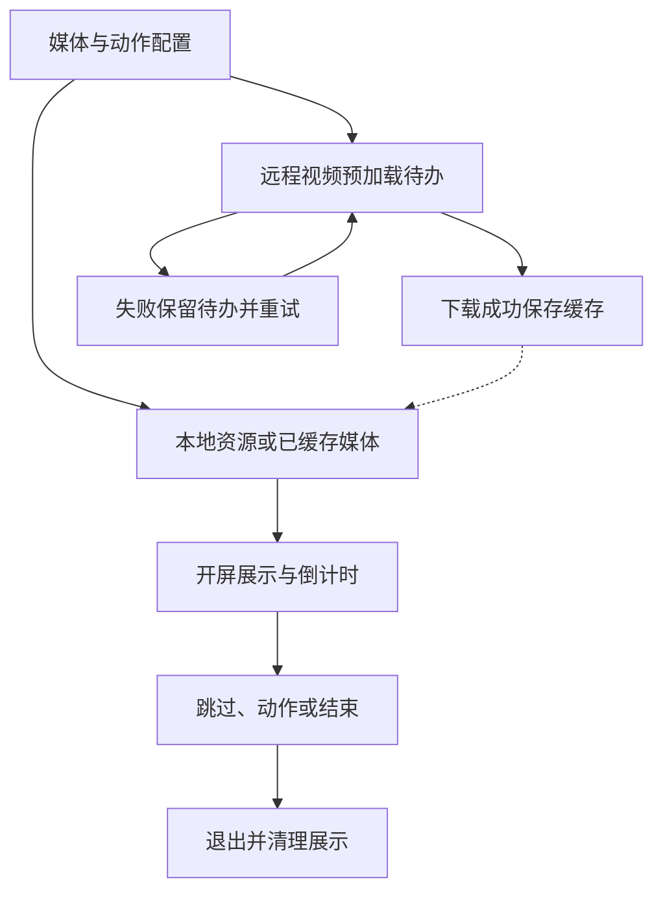

# `JobsOCSplash`


[toc]

> 中文架构入口：[架构脉络与关键设计](#jobs-architecture)。

---

## 🔥 <font id=前言>前言</font>

> `JobsOCSplash` 是 OC 版本地开屏 Pod，对齐 Swift 项目里的 `JobsSwiftSplash`，支持图片、GIF、视频、倒计时跳过和开屏交互行为。

## 一、功能说明 <a href="#前言" style="font-size:17px; color:green;"><b>🔼</b></a> <a href="#🔚" style="font-size:17px; color:green;"><b>🔽</b></a>

- 内容支持本地静态图、本地 GIF、远程图片、本地视频和远程视频。
- 依赖 `JobsBlock`、`JobsOCDefs`、`JobsByOCPods`、`JobsOCDSL`、`JobsMakes`、`JobsOCTimer`，block 类型、属性宏和按钮倒计时能力不在本 Pod 内重复定义。
- UIImageView / UIView / CALayer 的图片、Frame、父视图附着、自动缩放与按钮高亮调整统一走现有 Jobs DSL；AVPlayer / WebKit 等尚未覆盖的专属 API 保留系统调用，待底层封装补齐后再迁移。
- 远程媒体首次下载到 `Caches/JobsOCSplash`，后续直接读取本地缓存。
- 远程视频采用预加载策略：缓存完整时才播放远程文件；未缓存时立即播放配置的本地视频兜底，并在倒计时按钮左侧显示“仅在 Wi-Fi 环境下下载视频”。预加载只允许非蜂窝网络，任务由缓存单例持有，开屏倒计时结束或用户手动移除覆盖层都不会取消；临时失败最多 5 次退避重试并跨启动恢复待下载 URL；终止错误会清除记录。
- 跳过按钮默认显示在安全区右上角，也可以通过 `bySkipButtonFrame` 指定 Frame。
- 跳过按钮的背景色与圆角统一走 `jobsResetBtnBgCor` / `jobsResetBtnCornerRadiusValue`：iOS 16+ 写入 `UIButtonConfiguration.background`，旧系统回退传统按钮管线。创建时先按默认 `36pt` 高度应用 `18pt` 圆角，保证首帧就是胶囊形；布局完成后再按当前实际高度的一半校准。
- 开屏页作为宿主页面上的子控制器覆盖层，不创建导航栏或返回按键；宿主是系统导航、Tab、Split 或 Page 容器时，Presenter 会把覆盖层挂到当前可见内容控制器，不会把开屏页塞进容器自身的管理栈。
- 倒计时按钮基于 `UIButton+Timer`，运行期间保持可点击；倒计时结束或用户点击右上角按钮都会执行统一的 `finish`，直接移除开屏覆盖层。
- 开屏展示期间会暂停宿主页面已有手势，退出时恢复原状态，避免宿主手势拦截跳过按钮或穿透到开屏下方。
- 点击开屏和摇一摇默认打开百度，也可替换为自定义 block 或关闭行为。
- `JobsOCSplashPreferences` 持久化记录下次启动是否展示开屏，以及下次启动采用的内容类型；内容类型覆盖本地图片、本地 GIF、远程图片、本地视频和远程视频，首次使用默认为本地图片。

## 二、接入示例 <a href="#前言" style="font-size:17px; color:green;"><b>🔼</b></a> <a href="#🔚" style="font-size:17px; color:green;"><b>🔽</b></a>

```objc
#import <JobsOCSplash/JobsOCSplash.h>

JobsOCSplashConfiguration *configuration = [JobsOCSplashConfiguration localImage:@"Splash"]
    .byCountdownSeconds(@5)
    .byLanguageCode(nil)
    .bySkipButtonVisible(YES)
    .byTapAction([JobsOCSplashAction openURL:[NSURL URLWithString:@"https://www.baidu.com"]])
    .byShakeAction(JobsOCSplashAction.none)
    .bySkip(^(__kindof UIViewController *splashVC) {
        NSLog(@"进入首页");
    });

[JobsOCSplashPresenter showOver:self configuration:configuration];
```

## 三、内容配置 <a href="#前言" style="font-size:17px; color:green;"><b>🔼</b></a> <a href="#🔚" style="font-size:17px; color:green;"><b>🔽</b></a>

```objc
[JobsOCSplashConfiguration localImage:@"Splash"];
[JobsOCSplashConfiguration localGIF:@"SplashAnimation"];
[JobsOCSplashConfiguration remoteImage:[NSURL URLWithString:@"https://example.com/splash.jpg"]];
[JobsOCSplashConfiguration localVideo:@"SplashVideo" fileExtension:@"mp4" bundle:nil];
[JobsOCSplashConfiguration remoteVideo:[NSURL URLWithString:@"https://example.com/splash.mp4"]
                     fallbackLocalVideo:@"SplashVideo"
                           fileExtension:@"mp4"
                                  bundle:nil];
```

业务设置页应完整展示 `JobsOCSplashContentType` 的五种内容类型，并把用户选择写入 `JobsOCSplashPreferences.contentTypeForNextLaunch`；启动入口读取该设置后，再为所选类型提供实际资源名或 URL。

## 四、目录边界 <a href="#前言" style="font-size:17px; color:green;"><b>🔼</b></a> <a href="#🔚" style="font-size:17px; color:green;"><b>🔽</b></a>

- `JobsOCSplash.h`：公开聚合头。
- `Core/JobsOCSplash`：配置、动作、展示控制器、缓存、GIF 解码、本地化。
- `Resource/*.lproj`：跳过按钮文案。
- `JobsPodspecKit.rb`：本地 podspec 基座。

## 五、验证方式 <a href="#前言" style="font-size:17px; color:green;"><b>🔼</b></a> <a href="#🔚" style="font-size:17px; color:green;"><b>🔽</b></a>

```shell
ruby -c JobsOCSplash.podspec
```

```shell
pod install --no-repo-update
```

跳过 / 倒计时按钮的点按使用 `onClickBy` Block 链式入口，其它触摸阶段继续使用 `onJobsEvent` 表达。

## 六、明暗主题契约 <a href="#前言" style="font-size:17px; color:green;"><b>🔼</b></a> <a href="#🔚" style="font-size:17px; color:green;"><b>🔽</b></a>

- 页面、列表和弹框的普通承载面使用 `JobsSystemBackgroundColor` / `JobsSecondarySystemBackgroundColor`，正文、说明和占位文字使用 `JobsLabelColor` / `JobsSecondaryLabelColor` / `JobsPlaceholderTextColor`，确保白天浅底深字、黑夜深底浅字。
- 品牌色、媒体画布、二维码、相机、视频、手写和马赛克内容保留业务色；颜色写入 `CGColor`、`CALayer`、CoreText 或自绘上下文时，需要在主题通知或 Trait 变化后重新解析和绘制。
- 验证时从 Demo 全局主题入口分别切换白天和黑夜，检查组件的背景、文字、禁用态、占位态与弹出层对比度。

<a id="jobs-architecture"></a>

## 七、架构脉络与关键设计 <a href="#前言" style="font-size:17px; color:green;"><b>🔼</b></a> <a href="#🔚" style="font-size:17px; color:green;"><b>🔽</b></a>

本节用于用中文快速理解组件，并为按框架重建提供入口；关注职责、运行关系和关键边界，不要求逐行复刻。

### 7.1、设计目的与职责划分 <a href="#前言" style="font-size:17px; color:green;"><b>🔼</b></a> <a href="#🔚" style="font-size:17px; color:green;"><b>🔽</b></a>

将开屏拆为配置、媒体展示、Action、Presenter、缓存、GIF 解码和本地化。Presenter 把开屏作为宿主内容页上的子控制器覆盖层，媒体缓存独立管理下载，倒计时与手动跳过汇入结束路径。

### 7.2、运行脉络 <a href="#前言" style="font-size:17px; color:green;"><b>🔼</b></a> <a href="#🔚" style="font-size:17px; color:green;"><b>🔽</b></a>

读取开屏配置 → 选择本地媒体或完整缓存 → 挂载覆盖层并暂停宿主手势 → 倒计时/点击/跳过 → 移除覆盖层并恢复原状态。

下图用于说明主要关系；异常、退出与线程边界结合下一节阅读。


```mermaid
flowchart TD
    A["媒体与动作配置"] --> B["本地资源或已缓存媒体"]
    A --> C["远程视频预加载待办"]
    B --> D["开屏展示与倒计时"]
    D --> E["跳过、动作或结束"]
    E --> F["退出并清理展示"]
    C --> G["下载成功保存缓存"]
    C --> H["失败保留待办并重试"]
    H --> C
    G -.-> B
```

### 7.3、关键设计与边界 <a href="#前言" style="font-size:17px; color:green;"><b>🔼</b></a> <a href="#🔚" style="font-size:17px; color:green;"><b>🔽</b></a>

- 开屏没有导航栏和返回键；不要用 push/pop 实现覆盖层退出。
- 未缓存的远程视频走本地视频兜底，预加载由缓存单例持有，不随开屏退出取消。
- 倒计时期间跳过按钮应可用，手动与自动结束需要避免重复移除。
- Action 表达打开 URL 或自定义动作，媒体播放和业务动作不能混为一体。

### 7.4、阅读与重建顺序 <a href="#前言" style="font-size:17px; color:green;"><b>🔼</b></a> <a href="#🔚" style="font-size:17px; color:green;"><b>🔽</b></a>

先看 Configuration 与 Presenter，再看控制器结束路径、MediaCache 和 Action；重建时先明确展示生命周期与下载生命周期分离。

源码定位（路径以本 README 所在目录为基准；只带走 README 时，可把文件名作为职责定位线索）：

- [JobsOCSplash.h](<./JobsOCSplash.h>)
- [Core/JobsOCSplash/JobsOCSplashConfiguration/JobsOCSplashConfiguration.h](<./Core/JobsOCSplash/JobsOCSplashConfiguration/JobsOCSplashConfiguration.h>)
- [Core/JobsOCSplash/JobsOCSplashAction/JobsOCSplashAction.h](<./Core/JobsOCSplash/JobsOCSplashAction/JobsOCSplashAction.h>)
- [Core/JobsOCSplash/JobsOCSplashGIFDecoder/JobsOCSplashGIFDecoder.h](<./Core/JobsOCSplash/JobsOCSplashGIFDecoder/JobsOCSplashGIFDecoder.h>)
- [Core/JobsOCSplash/JobsOCSplashLocalization/JobsOCSplashLocalization.h](<./Core/JobsOCSplash/JobsOCSplashLocalization/JobsOCSplashLocalization.h>)

依赖与编译入口：[JobsOCSplash.podspec](<./JobsOCSplash.podspec>)。其中根级依赖声明包括 `JobsBlock`、`JobsOCDefs`、`JobsByOCPods`、`JobsOCDSL`、`JobsMakes`、`JobsOCTimer`。源码范围、资源及可选 subspec 以这里的声明为准；辅助脚本动态补充的依赖不在上述摘录中展开。

## 八、运行合同与失败边界 <a href="#前言" style="font-size:17px; color:green;"><b>🔼</b></a> <a href="#🔚" style="font-size:17px; color:green;"><b>🔽</b></a>

- 远程图片先检查 HTTP 2xx 和 ImageIO 格式，再保存；损坏历史图片缓存删除并重新下载，关闭开屏后的回调不再更新 UI。所有下载 completion 回到主线程。
- 文件先复制到缓存目录内 staging，再原子替换最终文件，失败不会先删旧缓存。缓存默认 7 天失效；图片/GIF 编码不超过 16 MiB、最多 120 帧、累计不超过 24M 像素，超限拒绝解码。
- 视频资源等待上限 30 分钟；临时失败最多 5 次退避尝试，4xx（除 408/429）及取消立即终止并清除待下载记录，失败 completion 返回 nil。本地视频继续负责即时兜底，终止后可由新的 preload 请求显式重试。

- downloadImage:completion: 按 URL 合并传输，返回 JobsOCSplashMediaDownloadToken；必须持有 token，cancel() 或释放 token 静默退订，仅最后订阅离开才取消底层 task。兼容 download:completion: 仍创建独立真实 task，其 cancel 不影响合并订阅。缓存容量上限 256 MiB、单媒体文件 128 MiB、有效期 7 天；超量先淘汰最早文件。远程图先显示配置的打包资源，磁盘读取与 GIF 解码在后台，UI 回主线程。

## 九、目录计数与安装边界 <a href="#前言" style="font-size:17px; color:green;"><b>🔼</b></a> <a href="#🔚" style="font-size:17px; color:green;"><b>🔽</b></a>

计数递归扫描当前目录内的普通文件，排除 `.DS_Store` / `._*`；源码与头文件计入 `.h`、`.m`、`.mm`、`.c`、`.cc`、`.cpp`、`.hpp`、`.swift`。资源目录中的目录、资源编译结果和文件大小不计入文件数，文件存在不代表必然打包。

| 目录 | 实际文件 | 源码 / 头文件 | 安装边界 |
| --- | --- | --- | --- |
| `Core/` | 18 | 18 | 公共入口与核心实现；公开 / 私有头由 podspec 指定 |
| `Support/`（无目录） | 0 | 0 | 仅供当前 Pod 内部实现，按实际 subspec / private header 映射 |
| `Resource/` | 4 | 0 | 非代码资源；按 resources / resource_bundles 和排除规则安装 |
| `Tests/` | 7 | 6 | 只由独立测试目标或回归 harness 使用，不进入生产 source_files |

`Core` 的物理目录不等于所有头文件均公开；`Support` 和测试 fixture 不作为 App 或其它 Pod 的稳定消费入口。根聚合头与 `public_header_files` 是外部引用依据。

根级命名资源 bundle：`JobsOCSplashResources.bundle`、`JobsOCSplashPrivacy.bundle`；已有运行资源保持各自 bundle 查找合同。

隐私声明入口：[Resource/PrivacyInfo.xcprivacy](<./Resource/PrivacyInfo.xcprivacy>)，通过 `JobsOCSplashPrivacy.bundle` 安装。声明类别与理由按该文件记录：

| API 类别 | 理由标识 | 当前代码用途 |
| --- | --- | --- | --- |
| `NSPrivacyAccessedAPICategoryUserDefaults` | `CA92.1` | 本应用本地偏好或状态的读取与保存 |
| `NSPrivacyAccessedAPICategoryFileTimestamp` | `C617.1` | 文件时间戳读取，用于本地文件 / 缓存生命周期处理 |

理由使用合同：`CA92.1`：仅供本 App 访问自身偏好；`C617.1`：仅访问本 App、同组或 CloudKit 容器内文件。范围依据 [Apple 理由定义](https://developer.apple.com/documentation/bundleresources/app-privacy-configuration/nsprivacyaccessedapitypes/nsprivacyaccessedapitypereasons)。

该文件记录当前 Pod 使用的 API 类别；宿主仍需按自身实际调用和数据行为维护自己的声明。最终产物是否包含该命名 bundle，随独立 Pod 与主工程资源验收一起核对。

## 十、本轮单元验证 <a href="#前言" style="font-size:17px; color:green;"><b>🔼</b></a> <a href="#🔚" style="font-size:17px; color:green;"><b>🔽</b></a>

当前结果：**Debug / Release 单 Pod 编译、Debug Stability 回归、macOS 生产实现回归已完成；整体验收记录见根 [JobsByPods升级实施与编译验证.md](<../../JobsByPods升级实施与编译验证.md>)**。生产源码、测试源码、资源与工程配置的指纹一致且命令真实退出成功，才可复用对应验证记录。

生产行为与边界按上述核心契约验收；逐 Pod 编译与独立行为回归分别记录结果。

从本 README 所在目录回到工程根目录，再运行该 Pod 的 Debug / Release 单元编译：

```shell
cd ../..
ruby ScriptsByPods/jobs_pods_stability_verify.rb/jobs_pods_stability_verify.rb \
  --phase pods --pod JobsOCSplash
```

当前 podspec 显式提供 `Stability` test_spec。`Tests/` 与测试 fixture 只进入测试目标；真实行为断言通过后再回填结果。指定可用模拟器 UDID：

```shell
ruby ScriptsByPods/jobs_pods_stability_verify.rb/jobs_pods_stability_verify.rb \
  --phase tests --pod JobsOCSplash --simulator '<UDID>'
```

本地生产实现回归 harness：

```shell
ruby JobsByPods/JobsOCSplash@Pods/Tests/run_regression.rb
```

运行前应已安装工程依赖；runner 的 `--phase pods` 默认分别编译 Debug / Release，`--phase tests` 默认运行 Debug（JobsOCSnowflake 默认 Debug / Release），并将命令、源码指纹、日志和退出码保存到工程 `work/JobsPodsStability/`。如需固定输出目录，使用 runner 的 `--output`。

<a id="🔚" href="#前言" style="font-size:17px; color:green; font-weight:bold;">我是有底线的➤点我回到首页</a>
