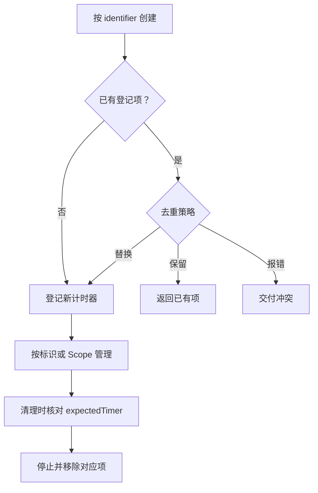

# `JobsOCTimerMgr`

<iframe
  src="https://dragonir.github.io/3d/#/earth"
  title="Jobs出品，必属精品"
  width="100%"
  height="400"
  style="border:0; display:block;"
  allowfullscreen>
</iframe>

[toc]

> 中文架构入口：[架构脉络与关键设计](#jobs-architecture)。

---

## 🔥 <font id=前言>前言</font> <a href="#🔚" style="font-size:17px; color:green;"><b>🔽</b></a>

> 这份自述用于记录 `JobsOCTimerMgr` 在 Jobs 本地 [**CocoaPods**](https://cocoapods.org/) 体系里的职责边界、目录结构、依赖关系和验证方式。
补充描述：JobsOCTimerMgr is a local Objective-C component library that provides centralized timer creation, lifecycle management, callback management, and foreground/background policy handling for Jobs projects.


## 一、Pod 定位 <a href="#前言" style="font-size:17px; color:green;"><b>🔼</b></a> <a href="#🔚" style="font-size:17px; color:green;"><b>🔽</b></a>

| 项目 | 内容 |
| ---- | ---- |
| Pod 名称 | `JobsOCTimerMgr` |
| Pod 类型 | 自建本地 Pod |
| 版本 | `1.0.0` |
| 平台 | `ios 12.0` |
| 摘要 | Objective-C timer manager component for Jobs projects. |
| 首页 | [https://example.local/JobsOCTimerMgr](https://example.local/JobsOCTimerMgr) |
| 许可证 | `MIT / LICENSE` |
| 作者 | `Jobs / lg295060456@gmail.com` |
| podspec | `JobsByPods/JobsOCTimerMgr@Pods/JobsOCTimerMgr.podspec` |
| source | `{ :path => '.' }` |

## 二、适用场景 <a href="#前言" style="font-size:17px; color:green;"><b>🔼</b></a> <a href="#🔚" style="font-size:17px; color:green;"><b>🔽</b></a>

- 作为 Jobs 项目内的独立能力 Pod，向 App 或其它 Pod 提供 `JobsOCTimerMgr` 相关能力。
- 当 `JobsOCTimerMgr` 的 `Core`、`Support`、资源、依赖或公开头文件发生变化时，同步更新本 README，避免后续排查只看源码不看边界。
- 参与本地 Pods 拆分时，先确认能力归属，再决定放入当前 Pod、迁移到 `Support`，还是下沉为更基础的公共 Pod。

## 三、目录结构 <a href="#前言" style="font-size:17px; color:green;"><b>🔼</b></a> <a href="#🔚" style="font-size:17px; color:green;"><b>🔽</b></a>

```text
JobsOCTimerMgr@Pods/
├── JobsOCTimerMgr.podspec  # Pod 描述文件
├── JobsOCTimerMgr.h  # 根聚合头文件
├── README.md  # 当前自述
├── JobsPodspecKit.rb  # 本地 podspec 基座
├── Core/  # 公开 API 与核心实现，6 个文件
└── LICENSE  # 许可证文件
```

- `JobsOCTimerMgr.podspec` 是当前 Pod 的 [**CocoaPods**](https://cocoapods.org/) 描述入口。
- `README.md` 是当前文件，负责说明用途、边界、依赖、资源和风险。
- 若目录中存在 `JobsPodspecKit.rb`，说明该 Pod 使用 Jobs 本地 podspec 基座动态映射 `Support`。

## 四、`Core` / `Support` 边界 <a href="#前言" style="font-size:17px; color:green;"><b>🔼</b></a> <a href="#🔚" style="font-size:17px; color:green;"><b>🔽</b></a>

- `Core` 当前包含 4 个文件，其中源码 / 头文件 4 个；按 Jobs 规范，它是 `JobsOCTimerMgr` 对外公开 API 和核心实现的边界。
- `Core/JobsTimerMgr+DSL/` 维护 `JobsTimerMgr` 公开管理动作的链式入口；`_JobsTimerMgrEntry` 只保留在 `JobsTimerMgr.m` 内部，不进入公开头边界。
- 当前目录没有 `Support` 文件夹；如后续补内部兼容代码，优先放入 `Support` 并让 podspec 动态映射。
- `Core` 里需要暴露给外部的头文件应进入 `public_header_files`；实现细节、兼容代码、内部分类优先放在 `Support`。
- 不要用互相依赖或扩大 `HEADER_SEARCH_PATHS` 掩盖边界问题，必要时把公共能力下沉到更底层 Pod。

## 五、公开能力与依赖 <a href="#前言" style="font-size:17px; color:green;"><b>🔼</b></a> <a href="#🔚" style="font-size:17px; color:green;"><b>🔽</b></a>

### 5.1、公开头文件

- `JobsOCTimerMgr.h`
- `Core/**/*.h`

### 5.2、源码入口

- `JobsOCTimerMgr.h`
- `Core/**/*.{h,m,mm}`

### 5.3、默认安装边界

- `Core` 通过 Pod 根级 `source_files` 直接映射真实磁盘目录，不再创建虚拟 `Core` subspec，避免 [**Xcode**](https://developer.apple.com/xcode) 的 Development Pods 出现 `Core/Core`。
- `Support` 仅在真实目录存在时按 podspec 映射；`Resource` 与 `Core` 平级承载非代码资源。

### 5.4、系统框架

- `Foundation`
- `UIKit`

### 5.5、Pod 依赖

- `JobsMakes`
- `JobsBlock`
- `JobsOCDefs`
- `JobsOCTimer`
- `JobsOCProtocols`

## 六、引用方式 <a href="#前言" style="font-size:17px; color:green;"><b>🔼</b></a> <a href="#🔚" style="font-size:17px; color:green;"><b>🔽</b></a>

推荐在 [**Objective-C**](https://developer.apple.com/library/archive/documentation/Cocoa/Conceptual/ProgrammingWithObjectiveC/Introduction/Introduction.html) 代码里使用保护性引用，优先走 [**CocoaPods**](https://cocoapods.org/) 生成的公共头映射：

```objc
#if __has_include(<JobsOCTimerMgr/JobsOCTimerMgr.h>)
#import <JobsOCTimerMgr/JobsOCTimerMgr.h>
#else
#import "JobsOCTimerMgr.h"
#endif
```

- 自建 Pod 对外优先引用公共入口头，不要绕开聚合头直接引用 `Support` 内部子头。
- `JobsOCTimerMgr.h` 聚合计时管理器与 DSL，是调用方统一入口。

### 6.1、推荐 DSL

```objc
NSString *identifier = @"home.countdown";
NSString *scopeIdentifier = @"home.page";

JobsTimerMgr.shared
.byUpsertScopedTimer(identifier,
                     scopeIdentifier,
                     JobsTimerTypeNSTimer,
                     JobsTimerBackgroundPolicyPauseAndResume,
                     YES,
                     ^(JobsTimer * _Nullable timer) {
    timer.byTimerStyle(TimerStyle_anticlockwise)
    .byTimeInterval(1)
    .byStartTime(10)
    .byQueue(dispatch_get_main_queue());
}, nil)
.byOnTick(identifier, ^(CGFloat time) {
    // 更新倒计时 UI
})
.byOnFinishVoid(identifier, ^{
    // 倒计时结束
});
```

同 identifier 的 `upsert` 会先原子替换注册项，再在隔离队列外停止旧 timer。旧 timer 已排队的回调会核对 Entry 身份，不会误投递给替换后的新注册项。

`JobsTimerBackgroundPolicyPauseAndResume` 在应用失去活跃态时暂停，并在重新活跃后只恢复自动暂停项；`JobsTimerBackgroundPolicyCancel` 只在真实进入后台时停止并移除。`startImmediately`、`start:` 和 `resume:` 完成生命周期动作后都会复核当前应用状态，因此在应用已经 inactive / background 时启动也不会绕过策略。

列表复用时先保存 `[manager timerForIdentifier:identifier]` 返回的实例，再调用 `stopAndRemove:expectedTimer:`；只有 identifier 仍指向该实例时才会移除注册项。页面生命周期使用 `pauseScope:`、`resumeScope:`、`stopAndRemoveScope:`，Scope 只恢复自己暂停的 Timer，不会误恢复业务手动暂停项。倒计时 Model 应保存绝对 `endAt`，Timer tick 只负责触发 UI 重算。

## 七、资源说明 <a href="#前言" style="font-size:17px; color:green;"><b>🔼</b></a> <a href="#🔚" style="font-size:17px; color:green;"><b>🔽</b></a>

- 当前目录扫描到资源类文件 0 个，`Resource` 目录文件 0 个。
- podspec 资源声明如下：

- podspec 未显式声明 `resources`，如新增图片、xib、bundle、json、plist 等资源，需要同步补齐。

## 八、验证方式 <a href="#前言" style="font-size:17px; color:green;"><b>🔼</b></a> <a href="#🔚" style="font-size:17px; color:green;"><b>🔽</b></a>

修改 `JobsOCTimerMgr` 后，优先按风险从低到高验证：

```shell
ruby -c JobsOCTimerMgr.podspec
```

```shell
pod lib lint JobsOCTimerMgr.podspec --allow-warnings --verbose
```

```shell
pod install --no-repo-update
```

- 如果本机 [**Ruby**](https://www.ruby-lang.org) / [**CocoaPods**](https://cocoapods.org/) 环境不适合实际执行，至少保留未执行声明，并检查 `PodspecDependencyReport` 里的依赖链路。
- 增删依赖后重点排查循环引用、公开头暴露和 `Support` 泄漏。

## 九、风险说明 <a href="#前言" style="font-size:17px; color:green;"><b>🔼</b></a> <a href="#🔚" style="font-size:17px; color:green;"><b>🔽</b></a>

- `Core` 头文件会进入公开 API 边界，新增 import 时要确认不会把内部实现细节暴露给外部。
- `Support` 只服务当前 Pod；App 层或其它 Pod 不应依赖 `Support/**/*.h` 的搜索路径命中。
- DSL 相关 Block 统一收口到 `JobsBlock`，不要在 `JobsTimerMgr+DSL.h` 里私自新增 typedef。
- 注册字典只在串行隔离队列中读写；停止旧 timer、批量停止以及回调执行都放在队列外，避免重入死锁。
- `fireOnceAndRemove` 删除前必须核对 timer 身份，防止并发 upsert 后误删新注册项。
- Cell / Model 解绑必须使用 `stopAndRemove:expectedTimer:`；禁止把 identifier-only 清理异步延迟到复用之后。
- 页面级多 Timer 统一挂到 Scope，并在消失、重现和释放时分别暂停、恢复、整组停止。
- Manager 的应用通知、当前状态复核和手动暂停状态使用同一个 Entry 状态机；不要绕过 Manager 直接修改 `timerForIdentifier:` 返回对象的生命周期。
- 第三方手动托管 Pod 要保留上游来源信息，只做本地托管适配，不抹掉作者、homepage 和 license。
- 执行 `pod install` 成功后，如生成了新的 `PodspecDependencyReport`，以报告为准继续校正上下依赖关系。
- `JobsOCBaseConfigDemoTests` 覆盖自动暂停恢复、手动暂停保护、实例安全取消和 Scope 生命周期。

## 十、系统计时机制对比与 Manager 选型 <a href="#前言" style="font-size:17px; color:green;"><b>🔼</b></a> <a href="#🔚" style="font-size:17px; color:green;"><b>🔽</b></a>

### 10.1、Manager 不替代内核选择

`JobsOCTimerMgr` 解决的是“谁拥有 Timer、如何查找、去重、暂停、恢复和清理”，不是把所有系统计时机制抹成同一种行为。四种底层机制分属不同框架：

- [**Foundation.NSTimer**](https://developer.apple.com/documentation/foundation/nstimer) 依赖 RunLoop。
- [**DispatchSourceTimer**](https://developer.apple.com/documentation/dispatch/dispatchsourcetimer) 在指定 GCD Queue 投递。
- [**CADisplayLink**](https://developer.apple.com/documentation/quartzcore/cadisplaylink) 跟随显示刷新节奏。
- [**CFRunLoopTimerRef**](https://developer.apple.com/documentation/corefoundation/cfrunlooptimer) 提供 Core Foundation 级 RunLoop 控制。

它们都不是硬实时机制，也都不会赋予 App 后台保活能力。Manager upsert 时仍要先按场景选择 `timerType`。

### 10.2、四种内核怎么选

| 系统机制 | 调度模型 | 优势 | 代价与风险 | 推荐场景 | `JobsTimerType` |
| ---- | ---- | ---- | ---- | ---- | ---- |
| `NSTimer` | 依赖指定线程的 RunLoop 与 Mode | API 简单；适合 UI 低频刷新；支持 `tolerance` 节能 | RunLoop 忙或 Mode 不匹配会延后；不是实时计时器 | 轮播、验证码、普通 UI 倒计时 | `JobsTimerTypeNSTimer` |
| GCD Timer | 在指定 Dispatch Queue 上投递事件，不依赖 RunLoop | 队列可控；适合非 UI 调度；leeway 可平衡功耗 | suspend/resume/cancel 状态必须配平；仍受 QoS、系统负载和队列阻塞影响 | 心跳、轮询、缓存清理、工作队列节拍 | `JobsTimerTypeGCD` |
| `CADisplayLink` | 跟随显示刷新周期回调 | 与屏幕刷新协调；提供时间戳；适配高刷屏 | 实际帧率会变化；主线程繁忙会掉帧；不适合业务倒计时 | 逐帧动画、进度绘制、视觉插值 | `JobsTimerTypeDisplayLink` |
| `CFRunLoopTimerRef` | Core Foundation 级 RunLoop Timer | 可控制 RunLoop、Mode、下一次触发时间与上下文 | C API 冗长；所有权和线程亲和复杂；仍受 RunLoop 延迟 | 基础设施、精细 RunLoop 集成或 C/CF 互操作 | `JobsTimerTypeRunLoop` |

### 10.3、邻近 API 的边界

| API | 适合 | 不适合 |
| ---- | ---- | ---- |
| `dispatch_after` | 一次性延迟执行 | 重复、暂停、恢复、注册表治理 |
| `performSelector:withObject:afterDelay:` | 当前 RunLoop 上的一次性延迟消息 | 跨队列调度、重复任务、复杂取消治理 |
| `BGTaskScheduler` | 系统择机执行后台刷新或维护任务 | 秒级准点触发、常驻后台 Timer |

### 10.4、场景决策顺序

1. 屏幕逐帧刷新选择 `JobsTimerTypeDisplayLink`。
2. 非 UI 工作队列、心跳或轮询选择 `JobsTimerTypeGCD`。
3. 主线程低频 UI 刷新选择 `JobsTimerTypeNSTimer`，并使用 common Mode。
4. 需要直接控制 RunLoop Timer 或进行 Core Foundation 互操作时选择 `JobsTimerTypeRunLoop`。
5. 只有一次延迟动作时使用 `dispatch_after` 等一次性 API，不创建受管重复 Timer。
6. App 被系统挂起后需要执行工作时，改用匹配业务资格的后台系统机制。

### 10.5、什么时候必须上 Manager

- 单个对象私有、生命周期清楚、无需跨对象查找时，直接使用 `JobsTimer`。
- 同一业务可能重复创建 Timer 时，用 identifier 管理。
- 列表复用时，用稳定 Model identifier，并使用 `expectedTimer` 精准解绑。
- 页面或业务域有多条 Timer 时，用 Scope 整组 pause/resume/remove。
- 倒计时把绝对 `endAt` 作为时间真值；Manager 管物理 Timer，不承担业务时间真值。
- GCD Timer 只能避开 RunLoop Mode 影响，仍需面对队列阻塞、QoS、系统负载和 leeway。

<a id="jobs-architecture"></a>

## 十一、架构脉络与关键设计

本节用于用中文快速理解组件，并为按框架重建提供入口；关注职责、运行关系和关键边界，不要求逐行复刻。

### 11.1、设计目的与职责划分

在 JobsTimer 之上按稳定 identifier 注册任务，管理多回调、前后台策略、精准取消和 Scope 生命周期。Model 持有业务时间语义，Manager 持有物理 Timer，页面只需持有相应 Scope。

### 11.2、运行脉络

以标识创建/替换任务 → 注册 tick/finish 回调 → 按策略启动 → 根据标识或 Scope 控制 → 校验期望 Timer 后精准移除。

下图用于说明主要关系；异常、退出与线程边界结合下一节阅读。



### 11.3、关键设计与边界

- 同标识替换先原子更新注册项，再在锁外停止旧 Timer，避免外部回调进入锁内。
- 列表复用通过 expectedTimer 区分新旧实例，旧 Cell 的清理不能误删同标识的新 Timer。
- 追加回调、任务本体和 Scope 所有权分开；Manager 不改变底层精度，也不替业务维护 endAt。

### 11.4、阅读与重建顺序

先读标识协议和后台策略，再看 upsert、回调注册、expectedTimer 取消和 Scope；用一次列表复用场景串联职责。

源码定位（路径以本 README 所在目录为基准；只带走 README 时，可把文件名作为职责定位线索）：

- [JobsOCTimerMgr.h](<./JobsOCTimerMgr.h>)
- [Core/JobsTimerMgr+DSL/JobsTimerMgr+DSL.h](<./Core/JobsTimerMgr+DSL/JobsTimerMgr+DSL.h>)
- [Core/JobsTimerMgr/JobsTimerMgr.h](<./Core/JobsTimerMgr/JobsTimerMgr.h>)

依赖与编译入口：[JobsOCTimerMgr.podspec](<./JobsOCTimerMgr.podspec>)。其中显式依赖声明包括 `JobsMakes`、`JobsBlock`、`JobsOCDefs`、`JobsOCTimer`、`JobsOCProtocols`。源码范围、资源及可选 subspec 以这里的声明为准；辅助脚本动态补充的依赖不在上述摘录中展开。

<a id="🔚" href="#前言" style="font-size:17px; color:green; font-weight:bold;">我是有底线的➤点我回到首页</a>
