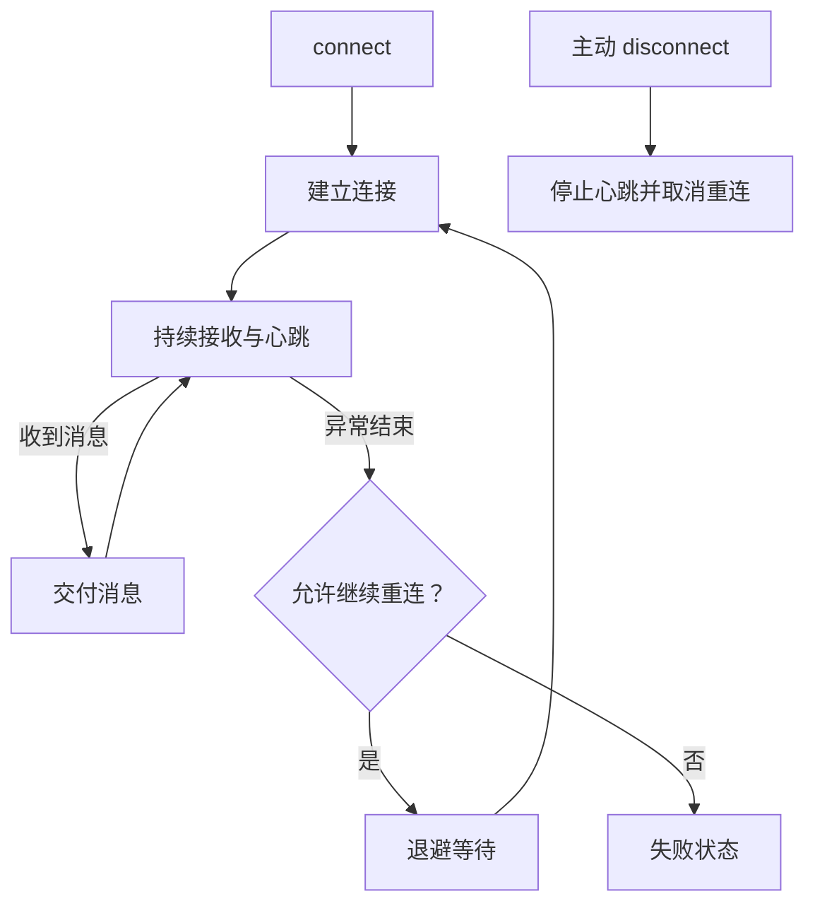

# `JobsOCWebSocket`


[toc]

> 中文架构入口：[架构脉络与关键设计](#jobs-architecture)。

---

## 🔥 <font id=前言>前言</font>

> `JobsOCWebSocket` 是基于 `SocketRocket` 的轻量 WebSocket Pod，只封装连接生命周期、线程切换、心跳、退避重连和状态回调，不介入业务协议、鉴权或消息模型。

## 一、默认策略 <a href="#前言" style="font-size:17px; color:green;"><b>🔼</b></a> <a href="#🔚" style="font-size:17px; color:green;"><b>🔽</b></a>

- 心跳间隔：30 秒。
- 自动重连：默认开启。
- 退避序列：1、2、4、8、16 秒。
- 最大重连次数：5 次。
- 状态、消息和重连通知统一切回主线程。

## 二、接入示例 <a href="#前言" style="font-size:17px; color:green;"><b>🔼</b></a> <a href="#🔚" style="font-size:17px; color:green;"><b>🔽</b></a>

```objc
#import <JobsOCWebSocket/JobsOCWebSocket.h>

JobsOCWebSocketClient *client = [
    [JobsOCWebSocketClient alloc]
    initWithURL:[NSURL URLWithString:@"wss://ws.postman-echo.com/raw"]
];
client.delegate = self;
[client connect];

NSError *error = nil;
[client sendText:@"Hello WebSocket" error:&error];
```

主动退出页面时调用 `disconnect`，它会停止心跳并取消待执行的自动重连。

<a id="jobs-architecture"></a>

## 三、架构脉络与关键设计

本节用于用中文快速理解组件，并为按框架重建提供入口；关注职责、运行关系和关键边界，不要求逐行复刻。

### 3.1、设计目的与职责划分

在 SocketRocket 上组织连接状态、心跳、退避重连和主线程事件回调。客户端只负责传输生命周期，不定义业务鉴权、消息模型或应答协议。

### 3.2、运行脉络

connect → 建立连接并启动心跳 → 收发消息 → 异常断开后按策略退避重连；主动 disconnect 终止心跳和待重连。

下图用于说明主要关系；异常、退出与线程边界结合下一节阅读。



### 3.3、关键设计与边界

- 默认心跳 30 秒、自动重连开启，原文给出 1/2/4/8/16 秒和最多 5 次的默认重连策略。
- 主动断开与异常断开不同，退出页面后不应再被自动重连唤醒。
- 状态、消息和重连通知回到主线程，传输成功仍不等于业务应答成功。

### 3.4、阅读与重建顺序

先看 State 与 delegate，再看 connect/disconnect、心跳和重连调度；最后连接业务编码层。

源码定位（路径以本 README 所在目录为基准；只带走 README 时，可把文件名作为职责定位线索）：

- [JobsOCWebSocket.h](<./JobsOCWebSocket.h>)
- [Core/JobsOCWebSocketClient/JobsOCWebSocketClient.h](<./Core/JobsOCWebSocketClient/JobsOCWebSocketClient.h>)

依赖与编译入口：[JobsOCWebSocket.podspec](<./JobsOCWebSocket.podspec>)。其中显式依赖声明包括 `SocketRocket`、`JobsBlock`、`JobsOCDefs`、`SRWebSocketExtra`。源码范围、资源及可选 subspec 以这里的声明为准；辅助脚本动态补充的依赖不在上述摘录中展开。

<a id="🔚" href="#前言" style="font-size:17px; color:green; font-weight:bold;">我是有底线的➤点我回到首页</a>
