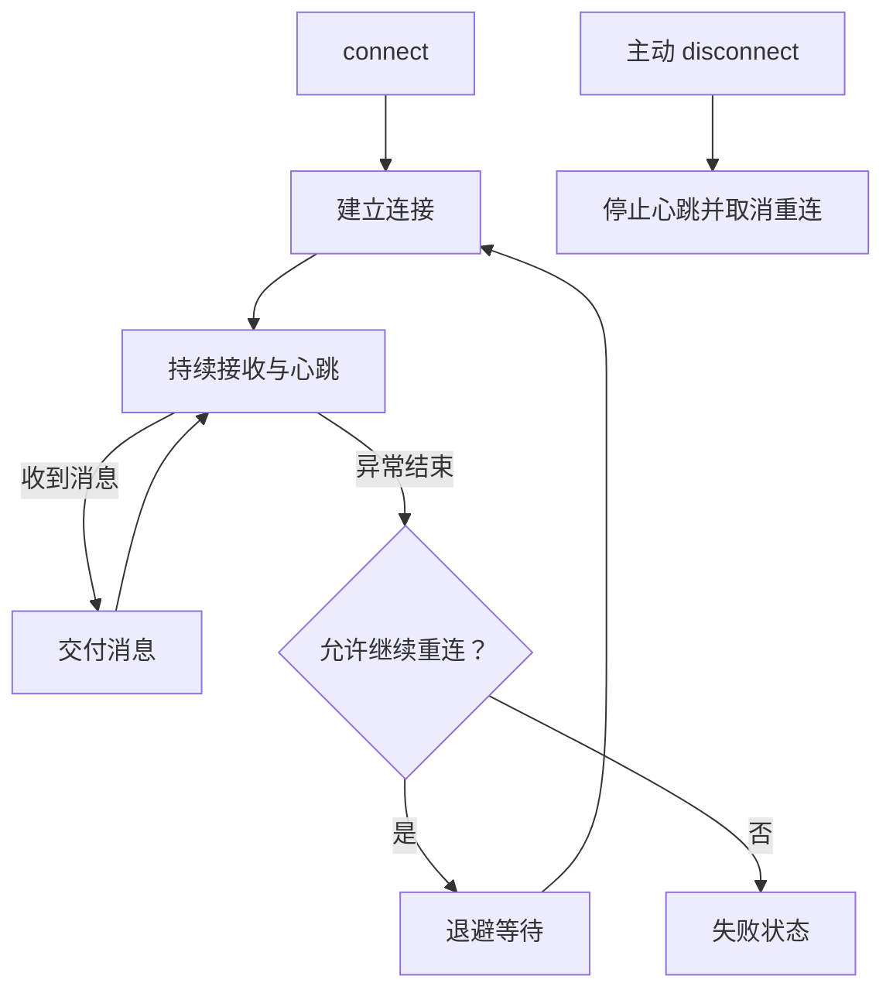

# `JobsOCWebSocket`


[toc]

> 中文架构入口：[架构脉络与关键设计](#jobs-architecture)。

---

## 🔥 <font id=前言>前言</font>

> `JobsOCWebSocket` 是基于 `SocketRocket` 的轻量 WebSocket Pod，只封装连接生命周期、线程切换、心跳、退避重连和状态回调，不介入业务协议、鉴权或消息模型。

## 一、默认策略 <a href="#前言" style="font-size:17px; color:green;"><b>🔼</b></a> <a href="#🔚" style="font-size:17px; color:green;"><b>🔽</b></a>

- 心跳间隔：30 秒。
- 自动重连：默认开启。
- 退避序列：1、2、4、8、16 秒。
- 最大重连次数：5 次。
- 状态、消息和重连通知统一切回主线程。

## 二、接入示例 <a href="#前言" style="font-size:17px; color:green;"><b>🔼</b></a> <a href="#🔚" style="font-size:17px; color:green;"><b>🔽</b></a>

```objc
#import <JobsOCWebSocket/JobsOCWebSocket.h>

JobsOCWebSocketClient *client = [
    [JobsOCWebSocketClient alloc]
    initWithURL:[NSURL URLWithString:@"wss://ws.postman-echo.com/raw"]
];
client.delegate = self;
[client connect];

NSError *error = nil;
[client sendText:@"Hello WebSocket" error:&error];
```

主动退出页面时调用 `disconnect`，它会停止心跳并取消待执行的自动重连。

<a id="jobs-architecture"></a>

## 三、架构脉络与关键设计 <a href="#前言" style="font-size:17px; color:green;"><b>🔼</b></a> <a href="#🔚" style="font-size:17px; color:green;"><b>🔽</b></a>

本节用于用中文快速理解组件，并为按框架重建提供入口；关注职责、运行关系和关键边界，不要求逐行复刻。

### 3.1、设计目的与职责划分 <a href="#前言" style="font-size:17px; color:green;"><b>🔼</b></a> <a href="#🔚" style="font-size:17px; color:green;"><b>🔽</b></a>

在 SocketRocket 上组织连接状态、心跳、退避重连和主线程事件回调。客户端只负责传输生命周期，不定义业务鉴权、消息模型或应答协议。

### 3.2、运行脉络 <a href="#前言" style="font-size:17px; color:green;"><b>🔼</b></a> <a href="#🔚" style="font-size:17px; color:green;"><b>🔽</b></a>

connect → 建立连接并启动心跳 → 收发消息 → 异常断开后按策略退避重连；主动 disconnect 终止心跳和待重连。

下图用于说明主要关系；异常、退出与线程边界结合下一节阅读。


```mermaid
flowchart TD
    A["connect"] --> B["建立连接"]
    B --> C["持续接收与心跳"]
    C -->|收到消息| D["交付消息"]
    D --> C
    C -->|异常结束| E{"允许继续重连？"}
    E -->|是| F["退避等待"]
    F --> B
    E -->|否| G["失败状态"]
    H["主动 disconnect"] --> I["停止心跳并取消重连"]
```

### 3.3、关键设计与边界 <a href="#前言" style="font-size:17px; color:green;"><b>🔼</b></a> <a href="#🔚" style="font-size:17px; color:green;"><b>🔽</b></a>

- 默认心跳 30 秒、自动重连开启，原文给出 1/2/4/8/16 秒和最多 5 次的默认重连策略。
- 主动断开与异常断开不同，退出页面后不应再被自动重连唤醒。
- 状态、消息和重连通知回到主线程，传输成功仍不等于业务应答成功。

### 3.4、阅读与重建顺序 <a href="#前言" style="font-size:17px; color:green;"><b>🔼</b></a> <a href="#🔚" style="font-size:17px; color:green;"><b>🔽</b></a>

先看 State 与 delegate，再看 connect/disconnect、心跳和重连调度；最后连接业务编码层。

源码定位（路径以本 README 所在目录为基准；只带走 README 时，可把文件名作为职责定位线索）：

- [JobsOCWebSocket.h](<./JobsOCWebSocket.h>)
- [Core/JobsOCWebSocketClient/JobsOCWebSocketClient.h](<./Core/JobsOCWebSocketClient/JobsOCWebSocketClient.h>)

依赖与编译入口：[JobsOCWebSocket.podspec](<./JobsOCWebSocket.podspec>)。其中根级依赖声明包括 `SocketRocket`、`JobsBlock`、`JobsOCDefs`、`SRWebSocketExtra`。源码范围、资源及可选 subspec 以这里的声明为准；辅助脚本动态补充的依赖不在上述摘录中展开。

## 四、运行合同与失败边界 <a href="#前言" style="font-size:17px; color:green;"><b>🔼</b></a> <a href="#🔚" style="font-size:17px; color:green;"><b>🔽</b></a>

- 连接和 URL 切换在实例 workQueue 顺序执行，send 同步调用按实例 queue-specific 标识判断，不借用另一 client 的队列。
- 心跳携带独立 payload，只有当前 socket 对应 pong 才确认存活。下一心跳仍未收到匹配 pong 时断开并按现有退避策略重连；迟到 socket 回调被忽略。heartbeatInterval<=0 可关闭，非有限值不启动。
- 回调在主线程。重连延迟检查有限值并限制最大 24 小时；系统挂起后恢复时允许心跳判断旧连接失效。

## 五、目录计数与安装边界 <a href="#前言" style="font-size:17px; color:green;"><b>🔼</b></a> <a href="#🔚" style="font-size:17px; color:green;"><b>🔽</b></a>

计数递归扫描当前目录内的普通文件，排除 `.DS_Store` / `._*`；源码与头文件计入 `.h`、`.m`、`.mm`、`.c`、`.cc`、`.cpp`、`.hpp`、`.swift`。资源目录中的目录、资源编译结果和文件大小不计入文件数，文件存在不代表必然打包。

| 目录 | 实际文件 | 源码 / 头文件 | 安装边界 |
| --- | --- | --- | --- |
| `Core/` | 2 | 2 | 公共入口与核心实现；公开 / 私有头由 podspec 指定 |
| `Support/`（无目录） | 0 | 0 | 仅供当前 Pod 内部实现，按实际 subspec / private header 映射 |
| `Resource/`（无目录） | 0 | 0 | 非代码资源；按 resources / resource_bundles 和排除规则安装 |
| `Tests/` | 4 | 4 | 只由独立测试目标或回归 harness 使用，不进入生产 source_files |

`Core` 的物理目录不等于所有头文件均公开；`Support` 和测试 fixture 不作为 App 或其它 Pod 的稳定消费入口。根聚合头与 `public_header_files` 是外部引用依据。

## 六、本轮单元验证 <a href="#前言" style="font-size:17px; color:green;"><b>🔼</b></a> <a href="#🔚" style="font-size:17px; color:green;"><b>🔽</b></a>

当前结果：**Debug / Release 单 Pod 编译、Debug Stability 回归已完成；整体验收记录见根 [JobsByPods升级实施与编译验证.md](<../../JobsByPods升级实施与编译验证.md>)**。生产源码、测试源码、资源与工程配置的指纹一致且命令真实退出成功，才可复用对应验证记录。

生产行为与边界按上述核心契约验收；逐 Pod 编译与独立行为回归分别记录结果。

从本 README 所在目录回到工程根目录，再运行该 Pod 的 Debug / Release 单元编译：

```shell
cd ../..
ruby ScriptsByPods/jobs_pods_stability_verify.rb/jobs_pods_stability_verify.rb \
  --phase pods --pod JobsOCWebSocket
```

当前 podspec 显式提供 `Stability` test_spec。`Tests/` 与测试 fixture 只进入测试目标；真实行为断言通过后再回填结果。指定可用模拟器 UDID：

```shell
ruby ScriptsByPods/jobs_pods_stability_verify.rb/jobs_pods_stability_verify.rb \
  --phase tests --pod JobsOCWebSocket --simulator '<UDID>'
```

运行前应已安装工程依赖；runner 的 `--phase pods` 默认分别编译 Debug / Release，`--phase tests` 默认运行 Debug（JobsOCSnowflake 默认 Debug / Release），并将命令、源码指纹、日志和退出码保存到工程 `work/JobsPodsStability/`。如需固定输出目录，使用 runner 的 `--output`。

<a id="🔚" href="#前言" style="font-size:17px; color:green; font-weight:bold;">我是有底线的➤点我回到首页</a>
