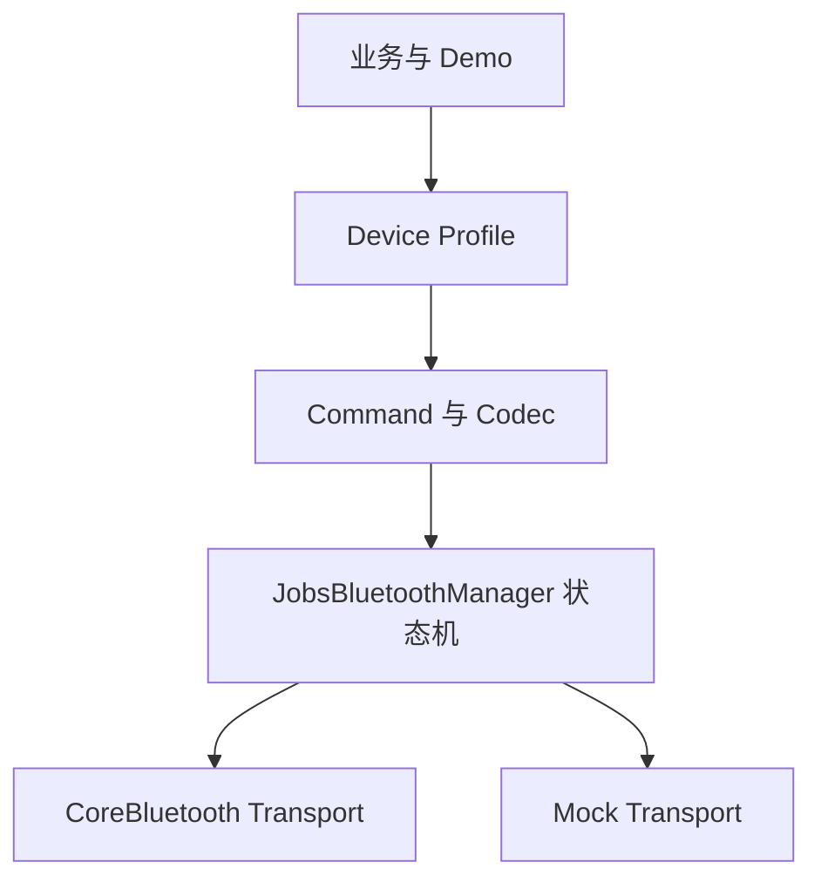

# `JobsBluetooth`


[toc]

---

## 🔥 <font id=前言>前言</font>

> `JobsBluetooth` 是面向 [**iOS**](https://developer.apple.com/ios/) BLE 中央设备场景的通用基础设施。当前目录遵循 OC 老工程的主工程集成习惯，不使用本地 Pod；源码、聚合头和文档直接进入 App target。

## 一、能力边界 <a href="#前言" style="font-size:17px; color:green;"><b>🔼</b></a> <a href="#🔚" style="font-size:17px; color:green;"><b>🔽</b></a>

- 支持扫描、过滤、连接、断开、Service / Characteristic 发现、读取、写入和通知。
- 支持设备 Profile、协议 Encoder / Decoder、命令模型、超时与重试参数预留。
- 支持 Mock Transport；模拟器和无真机环境也能运行完整 Demo。
- 本模块面向 BLE，不承诺任意经典蓝牙、蓝牙音频或未经 MFi 授权的 ExternalAccessory 能力。

## 二、架构



## 三、DSL 快速开始

```objc
JobsBluetoothProfile *profile = JobsBluetoothProfile.new
    .byIdentifier(@"jobs.sensor")
    .byServiceUUIDStrings(@[@"FFF0"])
    .byWriteUUIDString(@"FFF1")
    .byNotifyUUIDString(@"FFF2")
    .byScanTimeout(10)
    .byMaximumReconnectCount(3);

JobsBluetoothManager *manager = [JobsBluetoothManager.alloc initWithProfile:profile]
    .byMockTransport(JobsBluetoothMockTransport.new.byEnabled(YES))
    .onLog(^(NSString *message) {
        NSLog(@"%@", message);
    });

[manager startScan];
```

## 四、线程与生命周期

- [**CoreBluetooth**](https://developer.apple.com/documentation/corebluetooth) 回调由 Manager 收口，业务层不直接持有 `CBPeripheral`。
- 业务回调默认投递到主队列，也可以通过 `byCallbackQueue` 指定。
- 主动断开与异常断开拥有不同入口；自动重连策略应由 Profile 决定。
- 配置 DSL 返回当前主对象；扫描、连接、发送等终止动作不伪造链式返回值。

## 五、权限配置

- App 的 `Info.plist` 至少配置 `NSBluetoothAlwaysUsageDescription`。
- 兼容旧系统时同时配置 `NSBluetoothPeripheralUsageDescription`。
- 需要后台 BLE 时，由宿主 App 在 Background Modes 中启用 `bluetooth-central`，Pod 不替宿主偷偷开启。

## 六、扩展设备协议

- UUID 和连接策略写入 `JobsBluetoothProfile`。
- 业务对象转字节写入 Encoder。
- Notify 字节转业务对象写入 Decoder。
- CRC、分包、加密和应答匹配作为独立策略注入，不写进 Manager。

## 七、Demo 覆盖

Demo 覆盖权限、扫描、过滤、RSSI、连接、多设备、服务发现、Read、Write、Notify、MTU、分包、命令队列、超时、重试、重连、前后台、Profile、Codec、校验、握手、Mock、录制回放、诊断、DSL、OTA 扩展和未知协议占位。

<a id="🔚" href="#前言" style="font-size:17px; color:green; font-weight:bold;">我是有底线的➤点我回到首页</a>
