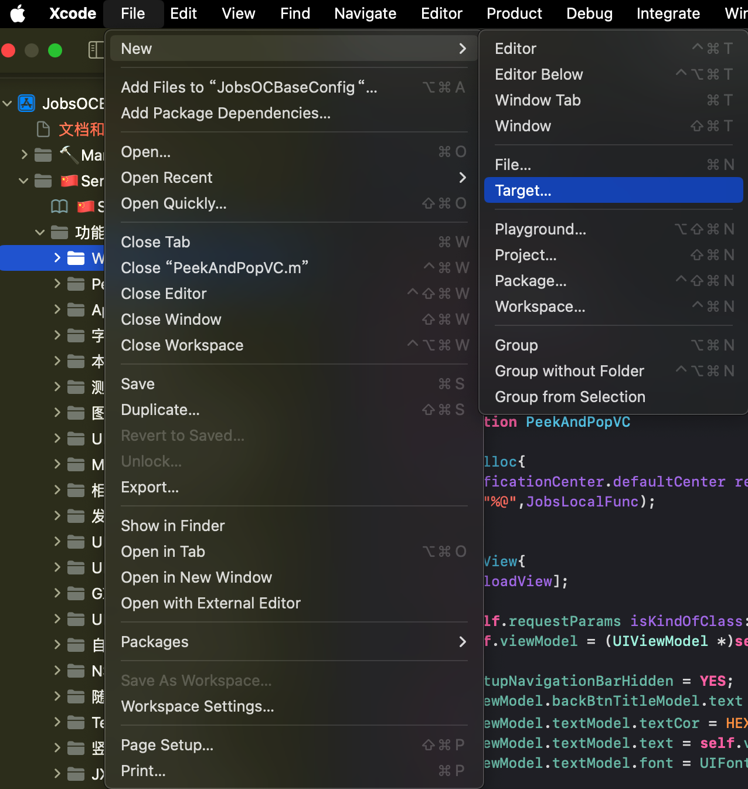
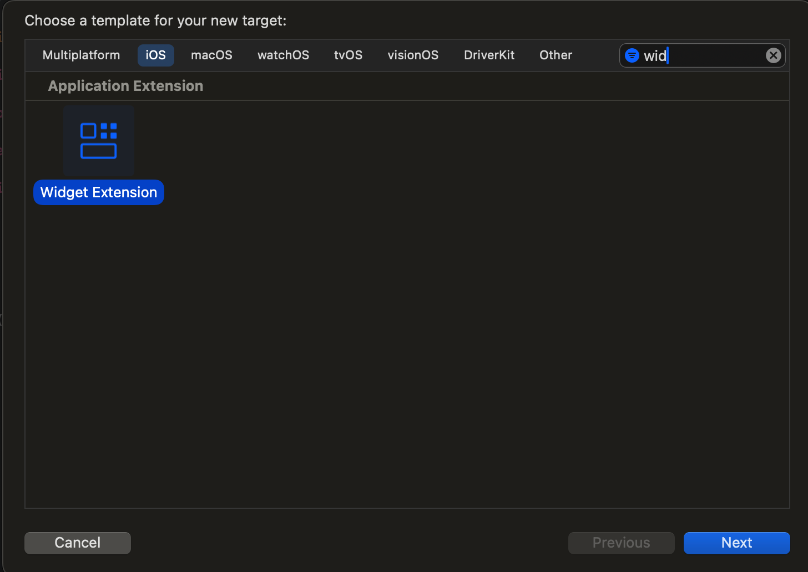
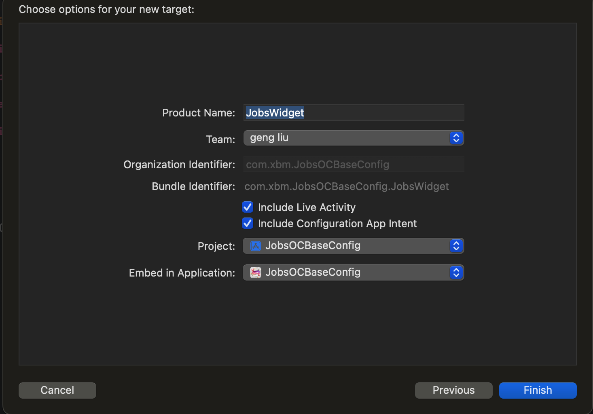
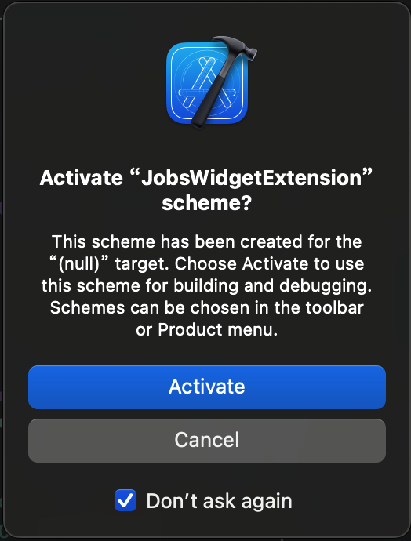

# iOS.Widget

## 1、创建Widget扩展 <a href="#前言" style="font-size:17px; color:green;"><b>🔼</b></a> <a href="#🔚" style="font-size:17px; color:green;"><b>🔽</b></a>

首先，确保你已经有一个现有的iOS项目。然后，在你的Xcode项目中添加一个新的Widget扩展：

* 在Xcode中选择你的项目，然后点击“File” -> “New” -> “Target”。

  

* 选择“Widget Extension”，然后点击“Next”。

  * xcode默认创建Widget是swift版本的

  

* 给你的Widget扩展命名，例如“ImageWidget”，然后点击“Finish”。

  

  

## 2、配置Widget <a href="#前言" style="font-size:17px; color:green;"><b>🔼</b></a> <a href="#🔚" style="font-size:17px; color:green;"><b>🔽</b></a>

## 3、相关的OC代码 <a href="#前言" style="font-size:17px; color:green;"><b>🔼</b></a> <a href="#🔚" style="font-size:17px; color:green;"><b>🔽</b></a>

<a id="🔚" href="#前言" style="font-size:17px; color:green; font-weight:bold;">我是有底线的➤点我回到首页</a>