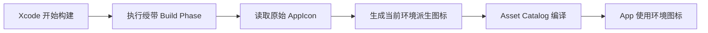

# `JobsAppIconRibbon`（主工程集成版）


[toc]

---

## 🔥 <font id=前言>前言</font>

> 本目录为 OC 老工程直接集成的 App 图标环境绶带模块。它在构建期为原始 AppIcon 生成带 `DEBUG`、`RELEASE` 或自定义环境文案的派生图标，不依赖本地 Pod。

该能力只参与 [**Xcode**](https://developer.apple.com/xcode) 构建，不包含 App 运行时代码，也不需要在 [**Objective-C**](https://developer.apple.com/library/archive/documentation/Cocoa/Conceptual/ProgrammingWithObjectiveC/Introduction/Introduction.html) 中调用。

## 一、当前工程使用方式 <a href="#前言" style="font-size:17px; color:green;"><b>🔼</b></a> <a href="#🔚" style="font-size:17px; color:green;"><b>🔽</b></a>

当前工程已经完成以下接入：

- Build Phases 中存在 `Generate AppIcon Environment Ribbon`。
- 该阶段位于 `Compile Sources` 和资源编译之前。
- Debug 使用 `JobsAppIconRibbon-Debug`。
- Release 使用 `JobsAppIconRibbon-Release`。
- 构建时自动读取 `./JobsAppIconRibbon.config`，无需业务代码调用。

正常使用只需打开配置文件修改样式，然后构建对应环境。

## 二、目录结构 <a href="#前言" style="font-size:17px; color:green;"><b>🔼</b></a> <a href="#🔚" style="font-size:17px; color:green;"><b>🔽</b></a>

```text
JobsAppIconRibbon/
├── JobsAppIconRibbon.config
├── README.md
└── Scripts/
    ├── JobsAppIconRibbon.sh
    └── JobsAppIconRibbonGenerator.swift
```

- `JobsAppIconRibbon.config`：源图标、文案、颜色和字体配置。
- `Scripts/JobsAppIconRibbon.sh`：适配 [**Xcode**](https://developer.apple.com/xcode) 环境并调用生成器。
- `Scripts/JobsAppIconRibbonGenerator.swift`：读取原图并绘制右上角绶带。

## 三、配置项 <a href="#前言" style="font-size:17px; color:green;"><b>🔼</b></a> <a href="#🔚" style="font-size:17px; color:green;"><b>🔽</b></a>

```properties
SOURCE_APPICONSET=JobsOCBaseConfigDemo/其他/资源文件管理/图片资源文件/xcassets/Assets.xcassets/AppIcon.appiconset
OUTPUT_NAME_PREFIX=JobsAppIconRibbon

RIBBON_TEXT=
DEBUG_TEXT=DEBUG
RELEASE_TEXT=RELEASE

BACKGROUND_COLOR=#8B4513
TEXT_COLOR=#FFFFFF
FONT_NAME=HelveticaNeue-Bold
FONT_SIZE_RATIO=0.105
```

| 配置项 | 默认值 | 说明 |
| --- | --- | --- |
| `SOURCE_APPICONSET` | 当前项目 AppIcon | 项目根目录下的原始 `.appiconset` 相对路径 |
| `OUTPUT_NAME_PREFIX` | `JobsAppIconRibbon` | 派生 AppIcon 名称前缀 |
| `RIBBON_TEXT` | 空 | 非空时覆盖所有环境文案 |
| `DEBUG_TEXT` | `DEBUG` | Debug 环境文案 |
| `RELEASE_TEXT` | `RELEASE` | Release 环境文案 |
| `BACKGROUND_COLOR` | `#8B4513` | 绶带背景色 |
| `TEXT_COLOR` | `#FFFFFF` | 文字颜色 |
| `FONT_NAME` | `HelveticaNeue-Bold` | macOS 字体名称 |
| `FONT_SIZE_RATIO` | `0.105` | 字号占图标边长的比例 |

颜色支持 `#RRGGBB` 和 `#RRGGBBAA`。字体不存在时自动回退到系统粗体。

## 四、新增构建环境 <a href="#前言" style="font-size:17px; color:green;"><b>🔼</b></a> <a href="#🔚" style="font-size:17px; color:green;"><b>🔽</b></a>

例如新增 `UAT` Configuration：

1. 在 `JobsAppIconRibbon.config` 中增加：

   ```properties
   TEXT_UAT=验收
   ```

2. 将 `UAT` 的 `ASSETCATALOG_COMPILER_APPICON_NAME` 设置为：

   ```text
   JobsAppIconRibbon-UAT
   ```

3. 确认 Build Phase 的输出路径仍使用：

   ```text
   JobsAppIconRibbon-$(CONFIGURATION).appiconset
   ```

## 五、移植到其它主工程 <a href="#前言" style="font-size:17px; color:green;"><b>🔼</b></a> <a href="#🔚" style="font-size:17px; color:green;"><b>🔽</b></a>

1. 将整个 `JobsAppIconRibbon` 目录复制到目标工程的启动配置目录。
2. 修改 `JobsAppIconRibbon.config` 中的 `SOURCE_APPICONSET`。
3. 在 App Target 新增 Run Script Build Phase，并放在源码和资源编译之前。
4. Shell 选择 `/bin/zsh`，调用 `./Scripts/JobsAppIconRibbon.sh`。
5. 向脚本传入项目根目录、配置路径和非交互标记。
6. 分别配置各 Configuration 的 `ASSETCATALOG_COMPILER_APPICON_NAME`。
7. 在 `.gitignore` 中忽略 `**/JobsAppIconRibbon-*.appiconset/`。

推荐的 Build Phase 调用形式：

```shell
JOBS_APP_ICON_RIBBON_NONINTERACTIVE=1 \
JOBS_APP_ICON_RIBBON_PROJECT_DIR="${SRCROOT}" \
JOBS_APP_ICON_RIBBON_CONFIG_PATH="${SRCROOT}/目标目录/JobsAppIconRibbon.config" \
/bin/zsh "${SRCROOT}/目标目录/Scripts/JobsAppIconRibbon.sh"
```

## 六、生成流程 <a href="#前言" style="font-size:17px; color:green;"><b>🔼</b></a> <a href="#🔚" style="font-size:17px; color:green;"><b>🔽</b></a>



派生图标生成在原始 `.appiconset` 的相邻目录，原始图片和 `Contents.json` 不会被修改。

## 七、常见问题与风险 <a href="#前言" style="font-size:17px; color:green;"><b>🔼</b></a> <a href="#🔚" style="font-size:17px; color:green;"><b>🔽</b></a>

- 找不到配置文件：检查 Build Phase 中的 `JOBS_APP_ICON_RIBBON_CONFIG_PATH`。
- 找不到原始图标：检查 `SOURCE_APPICONSET` 是否相对于 `SRCROOT`，以及 `Contents.json` 是否存在。
- 图标没有切换：检查当前 Configuration 的 `ASSETCATALOG_COMPILER_APPICON_NAME`。
- 绶带重复：不得将 `SOURCE_APPICONSET` 指向派生目录。
- 派生 `.appiconset` 是构建产物，不应提交 Git。
- App Store 包是否保留 `RELEASE` 绶带由项目自行决定；不需要时让正式 Configuration 使用原始 AppIcon。

<a id="🔚" href="#前言" style="font-size:17px; color:green; font-weight:bold;">我是有底线的➤点我回到首页</a>
