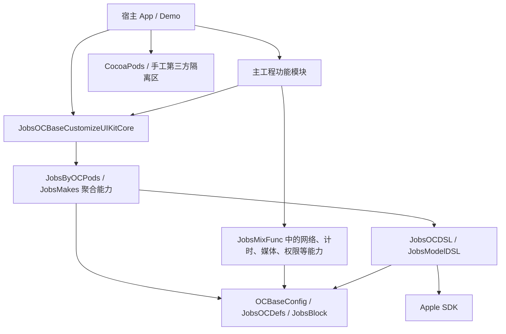
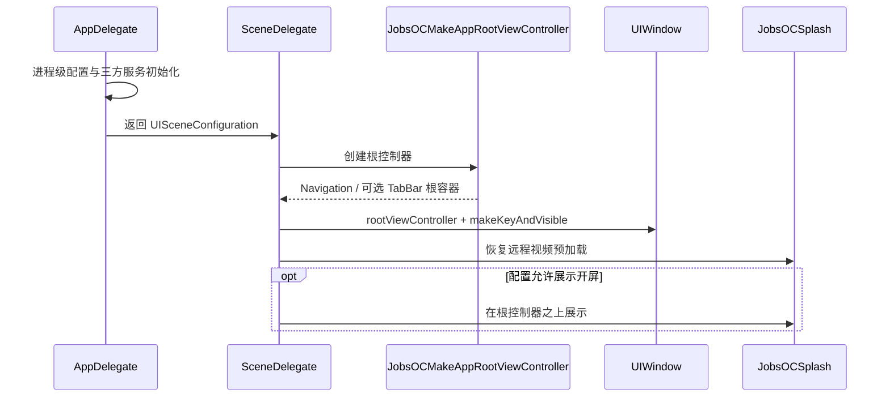

# [**Objective-C**](https://developer.apple.com/library/archive/documentation/Cocoa/Conceptual/ProgrammingWithObjectiveC/Introduction/Introduction.html) 工程项目框架配置方案@JobsKits


[toc]

---

## 🔥 <font id=前言>前言</font>

> 本文以 `JobsOCBaseConfigDemo` 当前工程为样板，说明 Jobs [**Objective-C**](https://developer.apple.com/library/archive/documentation/Cocoa/Conceptual/ProgrammingWithObjectiveC/Introduction/Introduction.html) 项目从宿主、启动、主工程基础层、资源、Widget 到验证工具的完整配置方案。凡与本文冲突时，以主工程当前实现、聚合头、`Podfile.deps`、`Podfile` 和 Xcode target 配置为准。

- 权威源优先级：

  1. `OCBaseConfig/`、`JobsOCBaseCustomizeUIKitCore/` 与主工程 Jobs 自建能力的当前实现和聚合头。
  2. 宿主源码、`Podfile.deps`、`Podfile`、Xcode target 与 Build Phase。
  3. 根 README、本工程文档和 Xcode CodeSnippets。

- 扫描和修改边界：

  - 可以维护：宿主与主工程中 Jobs 自建、已经明确接管的源码和文档。
  - 默认排除：根目录 `Pods/`、`PodsManual/`、`JobsByPods/ManualByOCPods@Pods/`、供应商源码、生成物、构建缓存和所有权不明文件。
  - 生成物只由对应流程刷新，不手工修改 Pods 工程、`Podfile.lock`、依赖报告或构建产物。

- 当前工程基线：

  - App、Unit Tests、UI Tests、Widget Extension 共同组成工程 target。
  - App 与 Widget 当前部署目标均为 iOS 16.6；外部依赖仍由 CocoaPods 静态 framework 集成。
  - Jobs 能力直接集成在主工程；宿主同时承担基础层、启动编排、业务装配、Demo 入口和宿主资源。

OC 侧核心调用思想是：`JobsMake` 创建对象，`JobsOCDSL` / `JobsModelDSL` 配置属性，`UIView+DSL` / `Masonry+DSL` 完成父视图装配和约束，依赖真实 `frame` 的效果放到约束刷新之后。

## 一、基础原则 <a href="#前言" style="font-size:17px; color:green;"><b>🔼</b></a>

- UI 创建优先使用主工程公开聚合头和 `jobsMakeXXX`；业务代码不穿透到基础层私有目录。
- `JobsMake` 只负责对象创建和 Block 入口，不负责堆业务配置。
- Block 内部优先使用 `JobsOCDSL` / `JobsModelDSL` 点语法链式赋值。
- 链式调用先写当前类本层能力，再写父类公共能力。
- 加到父视图必须早于 [**Masonry**](https://github.com/SnapKit/Masonry) 约束。
- frame 依赖效果可以在 `byAddTo` + 约束 + `layoutIfNeeded` 之后执行。
- `UIView+DSL` 的 `byRemove()` 只负责移出父视图；`UIView+MasonryDSL` 的 `byClearConstraints()` 只负责清空 Masonry 约束；不同 Category 不得用同一个 Selector 承担不同副作用。

## 二、UI 创建与装配顺序 <a href="#前言" style="font-size:17px; color:green;"><b>🔼</b></a>

### 2.1、标准流程

- 第一步：用 `jobsMakeLabel`、`jobsMakeButton`、`jobsMakeTextView`、`jobsMakeTextField`、`jobsMakeTableViewByPlain`、`jobsMakeCollectionView` 等方法创建对象。
- 第二步：在 Block 内使用当前类 DSL 配置属性，例如 `UILabel` 的 `byText`、`byFont`、`byTextAlignment`、`byNumberOfLines`。
- 第三步：再使用父类 DSL 配置公共属性，例如 `UIView` 的 `byBgColor`、`byAlpha`、`byCornerRadius`。
- 第四步：通过 `UIView+MasonryDSL` 的 `byAddTo(superview, makeBlock)` 加到父视图并完成首次 [**Masonry**](https://github.com/SnapKit/Masonry) 约束。
- 第五步：如果效果依赖真实 `frame`，在父视图 `layoutIfNeeded` 之后再做渐变、阴影路径、局部切角、动画初始位置等处理。

### 2.2、`UILabel` 示例

```objc
_titleLab = jobsMakeLabel(^(__kindof UILabel * _Nullable label) {
    label
        .byText(@"标题".tr)
        .byFont(UIFontWeightBoldSize(16))
        .byTextCor(JobsLabelColor)
        .byTextAlignment(NSTextAlignmentCenter)
        .byNumberOfLines(1)
        .byBgColor(JobsClearColor)
        .addOn(self.contentView)
        .byAdd(^(MASConstraintMaker *make) {
            make.edges.equalTo(self.contentView).insets(UIEdgeInsetsMake(8, 12, 8, 12));
        });
});
```

### 2.3、frame 依赖效果

```objc
_badgeView = jobsMakeView(^(__kindof UIView * _Nullable view) {
    view
        .byBgColor(JobsSystemRedColor)
        .addOn(self.contentView)
        .byAdd(^(MASConstraintMaker *make) {
            make.right.top.equalTo(self.contentView);
            make.size.mas_equalTo(CGSizeMake(18, 18));
        });

    [self.contentView layoutIfNeeded];
    view.byCornerRadius(CGRectGetWidth(view.bounds) / 2.0);
});
```

## 三、继承链调用顺序 <a href="#前言" style="font-size:17px; color:green;"><b>🔼</b></a>

- 子类 DSL 必须优先调用，父类 DSL 靠后调用。
- 如果先调用父类 DSL，返回值可能收口为 `UIView`，后面就无法继续调用 `UILabel`、`UIButton`、`UITextField` 等本层方法。
- 公共属性只放在父类 DSL，子类特有属性只放在子类 DSL，不通过重复定义解决链式顺序问题。

```objc
label
    .byText(@"先 UILabel".tr)
    .byFont(UIFontWeightRegularSize(15))
    .byTextAlignment(NSTextAlignmentCenter)
    .byBgColor(JobsClearColor)
    .addOn(self.view)
    .byAdd(^(MASConstraintMaker *make) {
        make.center.equalTo(self.view);
    });
```

## 四、`UITableView` / `UICollectionView` 方向 <a href="#前言" style="font-size:17px; color:green;"><b>🔼</b></a>

- Swift 侧已经把常用 `UITableView` / `UICollectionView` 协议方法封装为 Block，OC 侧现在同步落地了优先级最高的一批入口。
- OC 侧继续保留 `byDelegate` / `byDataSource` 传统协议入口，同时新增轻量 Block 入口。
- 当前优先覆盖：`byTarget`、`byNumberOfSections`、`byNumberOfRowsInSection`、`cellForRowAt`、`didSelectRowAt`、`byNumberOfItemsInSection`、`cellForItemAt`、`didSelectItemAt`。
- 推荐顺序仍然不变：先列表本层属性，再公共 `UIView` / `UIScrollView` 属性，最后 `byAddTo` 进父视图；`byTarget` 和列表 Block 配置放在列表本层链里。
- Block 化适合简单页面和 Demo；复杂页面仍允许使用正式协议，避免把所有业务塞进创建闭包。

```objc
_tableView = jobsMakeTableViewByPlain(^(__kindof UITableView * _Nullable tableView) {
    tableView
        .byRowHeight(56)
        .bySeparatorStyle(UITableViewCellSeparatorStyleSingleLine)
        .byTarget(self)
        .byNumberOfRowsInSection(^NSInteger(id  _Nonnull target, UITableView * _Nonnull tv, NSInteger section) {
            return self.dataMutArr.count;
        })
        .cellForRowAt(^__kindof UITableViewCell * _Nonnull(id  _Nonnull target, UITableView * _Nonnull tv, NSIndexPath * _Nonnull indexPath) {
            UITableViewCell *cell = [tv dequeueReusableCellWithIdentifier:@"UITableViewCell"];
            if (!cell) {
                cell = [UITableViewCell.alloc initWithStyle:UITableViewCellStyleDefault reuseIdentifier:@"UITableViewCell"];
            }
            cell.textLabel.byText(self.dataMutArr[indexPath.row]);
            return cell;
        })
        .didSelectRowAt(^(id  _Nonnull target, UITableView * _Nonnull tv, NSIndexPath * _Nonnull indexPath) {
            [tv deselectRowAtIndexPath:indexPath animated:YES];
        })
        .byDelegate(self)
        .byDataSource(self)
        .addOn(self.view)
        .byAdd(^(MASConstraintMaker *make) {
            make.edges.equalTo(self.view);
        });
});
```

```objc
_collectionView = jobsMakeCollectionView(^(__kindof UICollectionView * _Nullable collectionView) {
    collectionView
        .byCollectionViewLayout(self.flowLayout)
        .byBackgroundView(nil)
        .byTarget(self)
        .byNumberOfItemsInSection(^NSInteger(id  _Nonnull target, UICollectionView * _Nonnull cv, NSInteger section) {
            return self.dataMutArr.count;
        })
        .cellForItemAt(^__kindof UICollectionViewCell * _Nonnull(id  _Nonnull target, UICollectionView * _Nonnull cv, NSIndexPath * _Nonnull indexPath) {
            UICollectionViewCell *cell = [cv dequeueReusableCellWithReuseIdentifier:@"UICollectionViewCell" forIndexPath:indexPath];
            return cell;
        })
        .didSelectItemAt(^(id  _Nonnull target, UICollectionView * _Nonnull cv, NSIndexPath * _Nonnull indexPath) {
            [cv deselectItemAtIndexPath:indexPath animated:YES];
        })
        .addOn(self.view)
        .byAdd(^(MASConstraintMaker *make) {
            make.edges.equalTo(self.view);
        });
});
```

## 五、与 Swift 侧对照 <a href="#前言" style="font-size:17px; color:green;"><b>🔼</b></a>

| Swift 侧 | OC 侧 | 说明 |
| --- | --- | --- |
| `UILabel()` / `UIButton.sys()` | `jobsMakeLabel` / `jobsMakeButton` | OC 侧用 `JobsMake` 提供创建 Block。 |
| `JobsSwiftDSL` | `JobsOCDSL` | UI 属性点语法链式配置。 |
| `SnapKit` / `byAddTo` | `Masonry` / `UIView+MasonryDSL` | 加父视图和约束收口。 |
| Swift Model DSL | `JobsModelDSL` | 配置 `JobsLocationModel`、`UIButtonModel`、`UITextModel` 等模型。 |
| 列表 Block 化 | OC 已落地首批接口 | 当前已支持 `byTarget`、`byNumberOfRowsInSection`、`cellForRowAt`、`didSelectRowAt`、`byNumberOfItemsInSection`、`cellForItemAt`、`didSelectItemAt`。 |

## 六、快速 UI DSL 全配置 <a href="#前言" style="font-size:17px; color:green;"><b>🔼</b></a>

### 6.1、书写约定

- 所有 UI 配置优先使用 `JobsMake` + `JobsOCDSL` / `JobsModelDSL` 点语法链式写法。
- 点语法以行为最小单位提行书写，方便复制后按行删除或注释。
- 跟在某一行 DSL 后面的说明统一用两根双斜杠 `//`；单独成行的说明统一用三根双斜杠 `///`。
- 颗粒度要细：标题、颜色、字体、图片、状态、事件、装配、约束分别独立成行，不合并表达。
- 同一 DSL 同时存在单参数和二参数写法时，默认首选单参数写法；二参数写法只用于 `UIControlStateSelected`、`UIControlStateDisabled`、`UIControlStateHighlighted` 等非默认状态差异。
- 调用顺序固定为：当前 UI 类型本层 DSL、父类公共 DSL、事件 DSL、`addOn` / `byAddTo` + [**Masonry**](https://github.com/SnapKit/Masonry) 约束。

### 6.2、`UILabel`

```objc
_titleLab = jobsMakeLabel(^(__kindof UILabel * _Nullable label) {
    label
        .byText(@"标题".tr) // 设置文本
        .byFont(UIFontWeightBoldSize(16)) // 设置字体
        .byTextCor(JobsLabelColor) // 设置文字颜色
        .byTextAlignment(NSTextAlignmentCenter) // 设置对齐方式
        .byNumberOfLines(1) // 设置行数
        .makeLabelByShowingType(UILabelShowingType_02) // 设置展示策略
        .byBgColor(JobsClearColor) // 设置背景色
        .byCornerRadius(JobsWidth(8)) // 设置圆角
        .byClipsToBounds(YES) // 裁剪圆角
        .addOn(self.contentView) // 加入父视图
        .byAdd(^(MASConstraintMaker *make) { // 部署约束
            make.edges.equalTo(self.contentView).insets(UIEdgeInsetsMake(8, 12, 8, 12));
        });
});
```

### 6.3、`UIButton`

```objc
_submitBtn = jobsMakeButton(^(__kindof UIButton * _Nullable button) {
    button
        .jobsResetBtnTitle(@"确认".tr) // 进入按钮配置管线设置标题
        .jobsResetBtnTitleCor(JobsWhiteColor) // 设置标题颜色
        .jobsResetBtnTitleFont(UIFontWeightBoldSize(16)) // 设置标题字体
        .jobsResetBtnImage(JobsIMG(@"icon_submit")) // 设置图片
        .jobsResetBtnBgCor(JobsSystemBlueColor) // 设置可见背景色
        .jobsResetBtnCornerRadiusValue(JobsWidth(10)) // 设置配置背景圆角
        .onClickBy(^(UIButton *sender) { // 绑定点按事件
            sender.byToggleSelected();
        })
        .addOn(self.view) // 加入父视图
        .byAdd(^(MASConstraintMaker *make) { // 部署约束
            make.left.right.equalTo(self.view).inset(JobsWidth(16));
            make.height.mas_equalTo(JobsWidth(48));
            make.bottom.equalTo(self.view.mas_safeAreaLayoutGuideBottom).offset(-JobsWidth(16));
        });
});
```

`UIButton+UIControlState` 直接集成于主工程并由既有 UIKit 聚合头公开。普通状态优先使用 `selectedStateImageBy` 等单状态入口；需要 `UIControlStateSelected | UIControlStateHighlighted` 这类组合态时，使用接受任意状态位的二参数 Block DSL：

```objc
button
    .imageForStateBy(activeImage, UIControlStateSelected | UIControlStateHighlighted)
    .backgroundImageForStateBy(activeBackgroundImage, UIControlStateSelected | UIControlStateHighlighted);
```

### 6.4、`UITextField`

```objc
_nameTextField = jobsMakeTextField(^(__kindof UITextField * _Nullable textField) {
    textField
        .byText(@"") // 设置文本
        .byFont(UIFontWeightRegularSize(15)) // 设置字体
        .byTextCor(JobsLabelColor) // 设置文字颜色
        .byTextAlignment(NSTextAlignmentLeft) // 设置对齐方式
        .byPlaceholder(@"请输入名称".tr) // 设置占位文字
        .byPlaceholderColor(JobsSecondaryLabelColor) // 设置占位颜色
        .byPlaceholderFont(UIFontWeightRegularSize(15)) // 设置占位字体
        .byKeyboardType(UIKeyboardTypeDefault) // 设置键盘类型
        .byReturnKeyType(UIReturnKeyDone) // 设置返回键
        .byClearButtonMode(UITextFieldViewModeWhileEditing) // 设置清除按钮
        .byDelegate(self) // 设置代理
        .byBgColor(JobsSecondarySystemBackgroundColor) // 设置背景色
        .byCornerRadius(JobsWidth(8)) // 设置圆角
        .byClipsToBounds(YES) // 裁剪圆角
        .addOn(self.view) // 加入父视图
        .byAdd(^(MASConstraintMaker *make) { // 部署约束
            make.top.equalTo(self.titleLab.mas_bottom).offset(JobsWidth(12));
            make.left.right.equalTo(self.view).inset(JobsWidth(16));
            make.height.mas_equalTo(JobsWidth(44));
        });
});
```

### 6.5、`UITextView`

```objc
_remarkTextView = jobsMakeTextView(^(__kindof UITextView * _Nullable textView) {
    textView
        .byText(@"备注".tr) // 设置文本
        .byFont(UIFontWeightRegularSize(15)) // 设置字体
        .byTextCor(JobsLabelColor) // 设置文字颜色
        .byTextAlignment(NSTextAlignmentLeft) // 设置对齐方式
        .byEditable(YES) // 允许编辑
        .bySelectable(YES) // 允许选择
        .byDataDetectorTypes(UIDataDetectorTypeNone) // 设置数据识别
        .byKeyboardType(UIKeyboardTypeDefault) // 设置键盘类型
        .byDelegate(self) // 设置代理
        .byBgColor(JobsSecondarySystemBackgroundColor) // 设置背景色
        .byCornerRadius(JobsWidth(8)) // 设置圆角
        .byClipsToBounds(YES) // 裁剪圆角
        .addOn(self.view) // 加入父视图
        .byAdd(^(MASConstraintMaker *make) { // 部署约束
            make.top.equalTo(self.nameTextField.mas_bottom).offset(JobsWidth(12));
            make.left.right.equalTo(self.view).inset(JobsWidth(16));
            make.height.mas_equalTo(JobsWidth(120));
        });
});
```

### 6.6、`UIImageView`

```objc
_avatarImgView = jobsMakeImageView(^(__kindof UIImageView * _Nullable imageView) {
    imageView
        .byImage(JobsIMG(@"avatar_placeholder")) // 设置图片
        .byHighlightedImage(JobsIMG(@"avatar_selected")) // 设置高亮图片
        .byContentMode(UIViewContentModeScaleAspectFill) // 设置填充模式
        .byUserInteractionEnabled(YES) // 开启交互
        .byBgColor(JobsTertiarySystemBackgroundColor) // 设置背景色
        .byCornerRadius(JobsWidth(32)) // 设置圆角
        .byClipsToBounds(YES) // 裁剪圆角
        .addOn(self.view) // 加入父视图
        .byAdd(^(MASConstraintMaker *make) { // 部署约束
            make.top.equalTo(self.remarkTextView.mas_bottom).offset(JobsWidth(12));
            make.left.equalTo(self.view).offset(JobsWidth(16));
            make.size.mas_equalTo(CGSizeMake(JobsWidth(64), JobsWidth(64)));
        });
});
```

### 6.7、`UITableView`

```objc
_tableView = jobsMakeTableViewByPlain(^(__kindof UITableView * _Nullable tableView) {
    tableView
        .byRowHeight(JobsWidth(56)) // 设置行高
        .byEstimatedRowHeight(JobsWidth(56)) // 设置预估行高
        .bySeparatorStyle(UITableViewCellSeparatorStyleSingleLine) // 设置分割线
        .byKeyboardDismissMode(UIScrollViewKeyboardDismissModeOnDrag) // 拖拽收键盘
        .byShowsVerticalScrollIndicator(YES) // 显示纵向滚动条
        .byAlwaysBounceVertical(YES) // 允许纵向回弹
        .byTarget(self) // 设置 Block 目标
        .byNumberOfRowsInSection(^NSInteger(id  _Nonnull target, UITableView * _Nonnull tv, NSInteger section) { // 设置行数
            return self.dataMutArr.count;
        })
        .cellForRowAt(^__kindof UITableViewCell * _Nonnull(id  _Nonnull target, UITableView * _Nonnull tv, NSIndexPath * _Nonnull indexPath) { // 设置 cell
            UITableViewCell *cell = [tv dequeueReusableCellWithIdentifier:@"UITableViewCell"];
            if (!cell) cell = [UITableViewCell.alloc initWithStyle:UITableViewCellStyleDefault reuseIdentifier:@"UITableViewCell"];
            cell.textLabel.byText(self.dataMutArr[indexPath.row]);
            return cell;
        })
        .didSelectRowAt(^(id  _Nonnull target, UITableView * _Nonnull tv, NSIndexPath * _Nonnull indexPath) { // 设置选中事件
            [tv deselectRowAtIndexPath:indexPath animated:YES];
        })
        .byDelegate(self) // 设置代理
        .byDataSource(self) // 设置数据源
        .byBgColor(JobsSystemBackgroundColor) // 设置背景色
        .addOn(self.view) // 加入父视图
        .byAdd(^(MASConstraintMaker *make) { // 部署约束
            make.edges.equalTo(self.view);
        });
});
```

### 6.8、`UICollectionView`

```objc
_collectionView = jobsMakeCollectionView(^(__kindof UICollectionView * _Nullable collectionView) {
    collectionView
        .byCollectionViewLayout(self.flowLayout) // 设置布局对象
        .byShowsVerticalScrollIndicator(NO) // 隐藏纵向滚动条
        .byAlwaysBounceVertical(YES) // 允许纵向回弹
        .byKeyboardDismissMode(UIScrollViewKeyboardDismissModeOnDrag) // 拖拽收键盘
        .byTarget(self) // 设置 Block 目标
        .byNumberOfItemsInSection(^NSInteger(id  _Nonnull target, UICollectionView * _Nonnull cv, NSInteger section) { // 设置 item 数
            return self.dataMutArr.count;
        })
        .cellForItemAt(^__kindof UICollectionViewCell * _Nonnull(id  _Nonnull target, UICollectionView * _Nonnull cv, NSIndexPath * _Nonnull indexPath) { // 设置 cell
            UICollectionViewCell *cell = [cv dequeueReusableCellWithReuseIdentifier:@"UICollectionViewCell" forIndexPath:indexPath];
            return cell;
        })
        .didSelectItemAt(^(id  _Nonnull target, UICollectionView * _Nonnull cv, NSIndexPath * _Nonnull indexPath) { // 设置选中事件
            [cv deselectItemAtIndexPath:indexPath animated:YES];
        })
        .byDelegate(self) // 设置代理
        .byDataSource(self) // 设置数据源
        .byBgColor(JobsSystemBackgroundColor) // 设置背景色
        .addOn(self.view) // 加入父视图
        .byAdd(^(MASConstraintMaker *make) { // 部署约束
            make.edges.equalTo(self.view);
        });
});
```

## 七、成熟工程总览 <a href="#前言" style="font-size:17px; color:green;"><b>🔼</b></a> <a href="#🔚" style="font-size:17px; color:green;"><b>🔽</b></a>

### 7.1、工程基线

| 维度 | 当前方案 | 维护边界 |
| --- | --- | --- |
| 宿主 | `JobsOCBaseConfigDemo` | 基础层、启动编排、业务装配、Demo 入口与宿主资源。 |
| 工程入口 | `JobsOCBaseConfigDemo.xcworkspace` | 集成外部 Pods 后从 workspace 打开和构建。 |
| 工程格式 | Xcode `objectVersion 77` | 保留文件系统同步 Group，不为旧工具随意重写工程结构。 |
| 部署目标 | App / Widget iOS 16.6 | 外部依赖的最低版本由各依赖真实能力决定。 |
| 链接方式 | CocoaPods 静态 framework | CocoaPods 只管理外部依赖，Jobs 自建能力直接编入主工程。 |
| Targets | App、Unit Tests、UI Tests、Widget Extension | 新 target 必须同步 Info、Entitlements、Bundle ID、资源和依赖。 |
| 自建能力 | 主工程源码目录 | 由 Xcode 文件引用、Target Membership 和聚合头共同交付。 |
| 自动化 | Simulator Build、协议图生成 | 以 workspace、真实 Scheme 和无个人凭据环境为门禁。 |

### 7.2、目录职责

以下路径均以仓库根目录为基准：

```text
.
├── JobsOCBaseConfigDemo/
│   ├── 启动配置/                         # AppDelegate、SceneDelegate、根容器
│   ├── 业务逻辑/                         # Common、根列表与独立功能 Demo
│   ├── OCBaseConfig/                     # 定义、Block、通用功能与系统能力
│   ├── JobsOCDSL/                        # UIKit 与 Model 链式配置
│   ├── JobsOCBaseCustomizeUIKitCore/     # UIKit 基座、工厂、事件、导航和主题
│   ├── JobsOCBaseCustomize3rdCore/       # 已接管的第三方适配边界
│   ├── 其他/资源文件管理/                # Assets、多语言和宿主资源
│   ├── PodsManual/                       # 手工第三方隔离区，不按 Jobs 源码维护
│   └── 🔨Manual_Add_ThirdParty（按需引入）/
├── JobsOCWidgetExtension/                # WidgetKit Extension 与共享 Store
├── ScriptsByPods/                        # CocoaPods 与工程辅助脚本
├── Podfile                               # 外部依赖安装策略和 Build Settings
├── Podfile.deps                          # 外部依赖声明
├── PodspecDependencyReport/              # 依赖分析生成物
├── OC工程项目框架配置方案@Jobs.md/       # 当前工程文档
└── .github/workflows/                   # CI
```

- 主业务按控制器、Common 和独立功能 Demo 组织；复用能力进入主工程既有基础层，不在多个页面复制。
- 一个类型或一组成套文件用同名目录收口；控制器不夹带独立 Model、Cell、View 和工具类。
- `PodsManual/`、手工第三方和供应商源码不因被工程引用就自动变成 Jobs 可维护源码。

### 7.3、分层关系



- `OCBaseConfig/JobsOCDefs` / `JobsBlock`：基础宏、类型和 Block 语义。
- `JobsMakes`：对象工厂，只负责创建对象和暴露配置 Block。
- `JobsOCDSL` / `JobsModelDSL`：系统对象与 Jobs Model 的链式配置。
- `JobsByOCPods` 聚合能力：UIKit 工厂、按钮配置管线、事件、装配和通用扩展。
- `JobsOCBaseCustomizeUIKitCore`：BaseVC、导航容器、全局导航和主题等页面基座。
- `OCBaseConfig/JobsMixFunc`：直接集成的独立功能；只组合本功能真实需要的基础能力。

### 7.4、权威源与所有权

- 自建 API 以主工程当前实现和公开聚合头为准；README、本文和 CodeSnippets 是消费说明，不是第二份实现。
- 文件被编入主 target 不代表一定属于 Jobs；版权、文件头、上游路径或历史显示为第三方时仍然排除。
- 主工程集成完整性的证据是磁盘源码、聚合头、Xcode 文件引用、Target Membership、资源 Build Phase 和真实调用方。
- 没有执行依赖生成流程时，不手工伪造 `Podfile.lock`、Pods 工程或依赖报告的一致性。

## 八、启动、根容器与全局 UI <a href="#前言" style="font-size:17px; color:green;"><b>🔼</b></a> <a href="#🔚" style="font-size:17px; color:green;"><b>🔽</b></a>

### 8.1、启动链路



- `AppDelegate` 负责进程级能力：日志、网络、键盘、导航、语言、比例尺、调试工具、播放器缓存和开屏预加载等统一初始化。
- `SceneDelegate` 负责窗口级能力：创建 `UIWindow`、调用根控制器工厂、恢复 Scene 前后台状态和展示开屏覆盖层。
- `JobsOCMakeAppRootViewController()` 是根页面权威入口；需要切换根结构时仍经这一入口编排。
- 新初始化不要继续无边界堆进一个大方法；可复用能力放主工程对应基础目录，入口层只负责时序和开关。

### 8.2、根列表与导航

- 默认业务入口是 `ViewController_1` 及其导航容器；配置允许时可切换为自定义 TabBar 根结构。
- 根列表统一承接搜索、设置、排序 / 折叠、Demo 路由、图标映射和悬浮入口；新增 Demo 要同步对账这些消费者。
- 根切换仍按 Scene 生命周期处理；主题不参与 Window 遍历，只重放已登记的背景、文字与显式图片资源。
- Jobs 自维护页面优先继承 `BaseViewController` 等当前页面基座；导航统一走基座默认导航流程、`byGKNav*` DSL 与 `jobs_ensureDemoThemeButton` 所在公共层。
- 公共层注入的主题入口按钮始终使用透明背景，不显示额外色块。
- 页面原有业务右按钮先建立，再由公共导航层补主题入口；不能用主题按钮覆盖业务动作。
- `UIAlertController` 是系统弹框，不参与 Demo 导航栏和主题按钮注入；直接 `presentViewController:` 即可。
- `JobsOCGraphicCaptchaCharacterUnitSimplifiedChinese` 与 `JobsOCGraphicCaptchaCharacterUnitTraditionalChinese` 分别表示简体、繁体汉字，兼容值 `JobsOCGraphicCaptchaCharacterUnitChinese` 表示两者合集。
- 图形验证码把英文大写、英文小写、阿拉伯数字、简体汉字、繁体汉字作为五类独立字符池；可用 `twoMixedConfig`、`threeMixedConfig`、`fourMixedConfig`、`fullMixedConfig`，对应 Demo 展示两两、三三、四四和全部组合。

### 8.3、全局主题与页面生命周期

- `JobsThemeCenter` 集成于主工程 `JobsOCDefs`，读取 `JobsThemeResources.json`、持久化状态、维护弱引用绑定并发布 `JobsThemeDidChangeNotification`。
- `JobsLabelColor`、`JobsSecondaryLabelColor`、`JobsSystemBackgroundColor` 等背景 / 文字语义宏携带主题 Key；UIKit setter 自动登记，切换时不写 `overrideUserInterfaceStyle`，不遍历 Scene、Window 或控制器树。
- 数据包留在 App 资源目录；OC 老工程不新增 Pod。图片只有显式使用 `JobsThemeImage(...)` 时参与主题。
- 自定义绘制、`CGColor`、`CALayer`、CoreText 和第三方容器使用 `bindObject:slot:apply:` 显式登记背景 / 文字资源。
- UI 验证覆盖初始、布局、点按 / 刷新、结束 / 停止、前后台、明暗主题、键盘、弹层和自定义绘制；“按钮能点”不等于全局主题完成。

### 8.4、页面标准骨架

```objc
#import "JobsBaseUI.h"
#import "JobsByOCPods.h"
#import "JobsDefines.h"
#import "JobsMakes.h"
#import "JobsOCDSL.h"
#import <Masonry/Masonry.h>

@interface FeatureDemoVC : BaseViewController
@end

@interface FeatureDemoVC ()

Prop_strong(UIView *, contentView);

@end

@implementation FeatureDemoVC

-(void)viewDidLoad{
    [super viewDidLoad];
    self.view.byBgColor(JobsSystemBackgroundColor);
    self.contentView.byVisible(YES);
}

-(UIView *)contentView{
    if(!_contentView){
        _contentView = jobsMakeView(^(__kindof UIView *view) {
            view
                .byBgColor(JobsSecondarySystemBackgroundColor)
                .addOn(self.view)
                .byAdd(^(MASConstraintMaker *make) {
                    make.edges.equalTo(self.view);
                });
        });
    };return _contentView;
}

@end
```

- 进入视图层级、绑定事件 / 约束 / delegate、会刷新或参与换肤的对象，必须是属性并由懒加载 getter 收口。
- 页面布局统一使用 [**Masonry**](https://github.com/SnapKit/Masonry)；首次 `mas_makeConstraints`，常量变化 `mas_updateConstraints`，结构变化才 `mas_remakeConstraints`。
- `viewDidLoad` 只编排导航、唤醒 UI、绑定数据和首屏请求，不承载大段对象创建与业务状态机。

### 8.5、动态时钟入口图标

`JobsClockIconView` 只输出表盘外圈、固定时针、旋转分针和中心点，不绘制数字或时间刻度，也不附带标题、按钮和状态文案。组件内部复用 `JobsImageRotator` 与 `JobsOCTimer`；默认顺时针，调用方可传入逆时针方向和 Timer 间隔。

```objc
JobsClockIconView *clockIcon =
    [[JobsClockIconView alloc] initWithDirection:JobsImageRotationDirectionCounterclockwise
                                        interval:JobsClockIconViewDefaultInterval];
[clockIcon start];
```

页面消失、Cell 离屏或关闭分组时停止 Timer；系统开启“减弱动态效果”时不主动播放入口动画。

## 九、主工程集成与外部依赖治理 <a href="#前言" style="font-size:17px; color:green;"><b>🔼</b></a> <a href="#🔚" style="font-size:17px; color:green;"><b>🔽</b></a>

### 9.1、直接集成标准

```text
JobsOCBaseConfigDemo/
├── OCBaseConfig/
│   ├── JobsOCDefs/             # 基础定义
│   ├── JobsBlock/              # Block 类型
│   └── JobsMixFunc/            # 独立功能模块
├── JobsOCDSL/                  # UI / Model DSL
├── JobsOCBaseCustomizeUIKitCore/
│   ├── JobsMakes.h             # 创建入口
│   ├── JobsByOCPods.h          # UIKit 聚合入口
│   └── JobsBaseUI.h            # 页面基座聚合入口
├── 业务逻辑/功能模块/          # 对应 Demo 与调用入口
└── 其他/资源文件管理/          # 宿主统一资源
```

- 新能力先确定归属，再把源码、资源、Demo 和聚合头放入主工程既有目录；不要为 Jobs 内部能力新增本地 Pod 形态。
- 磁盘文件存在不等于已经集成，必须同步 Xcode 文件引用、Target Membership、Compile Sources / Copy Bundle Resources。
- 聚合头只公开业务调用需要的最小 API；实现细节、兼容头和第三方私有类型留在 `.m` 或模块内部。
- 删除 / 重命名必须同时处理磁盘目录、聚合头、工程引用、Build Phase、Demo、菜单、资源和调用方。

### 9.2、CocoaPods 与第三方边界

- CocoaPods 继续负责 Masonry、网络、图片、响应式、播放器等外部依赖，不承载 Jobs 主工程基础层。
- `Podfile.deps` 只声明依赖；`appCommon`、`gk`、`jx`、`ui`、`videoFunc` 等函数按能力分组，新增依赖先判断归属。
- 手工第三方统一留在 `PodsManual/`、`JobsByPods/ManualByOCPods@Pods/` 或明确隔离区；不做 Jobs 风格批量改写。
- 页面已经有 Jobs 适配层时，不直接散落第三方 API；确需暴露第三方类型时，由对应主工程功能模块承担耦合。
- `Podfile` 统一管理安装策略、Build Settings 和受控安装钩子；安装期兼容补丁必须可定位、可失败提示、可随上游升级删除。

### 9.3、依赖方向与调用边界

- 基础定义层不能依赖 UI 或业务功能层；功能模块可以组合基础层，基础层不能反向依赖功能模块。
- Jobs DSL 链式方法除终止动作外都要返回可继续链下去的当前对象；子类专属 DSL 先于父类 DSL。
- 已有 Jobs 系统 API / Model 封装时，业务不再散落一套原生写法；缺失时先补封装，再回到调用方。
- 修改公共能力后同步扫描宿主调用、聚合头、Xcode 工程引用、Demo、根 README、本文和 CodeSnippets。

## 十、资源、多语言、隐私与 Widget <a href="#前言" style="font-size:17px; color:green;"><b>🔼</b></a> <a href="#🔚" style="font-size:17px; color:green;"><b>🔽</b></a>

### 10.1、资源与多语言

- 宿主资源放在 `其他/资源文件管理/`，按 Assets、图片、字体、音视频、JSON、Lottie、网页和语言包分类。
- App 文案使用 `Localizable.strings` 与 `.tr`；Display Name、权限等系统文案使用各语言 `InfoPlist.strings`。
- 当前宿主包含 `en`、`zh-Hans`、`fil`、`fil-PH` 语言资源；新增语言时同步工程引用、target membership、缺失 key 和系统展示文案。
- 本地图、网络图、SVG、Icon Font 和 Unicode 图标优先经 Jobs 资源门面；新增入口图标优先从 [**iconfont**](https://www.iconfont.cn/) 选择并落入真实资源目录。
- 资源重命名时同步工程引用、Build Phase、访问 Helper、Demo 和测试；资源缺失必须有可见兜底或明确错误。
- Markdown 文档浏览能力直接集成在 `OCBaseConfig/JobsMixFunc/JobsOCMarkdown`；宿主 Build Phase 扫描仓库内 Jobs 自有 `*.md`，保留相对目录并复制本地引用资源到 `JobsMarkdownDocuments.bundle`。设备端只读取该构建产物，老工程不新增本地 Pod。

### 10.2、权限、Entitlements 与隐私

- 权限 key 只在真实功能需要时启用，文案说明用途和用户收益；历史空权限说明不得进入生产配置。
- `Info.plist`、`InfoPlist.strings`、Capabilities、Entitlements 和实际调用必须成套存在。
- 相机、麦克风、相册、蓝牙、后台音频和 App Group 等能力分别核对系统版本、拒绝态、后台行为和审核边界。
- 使用 Required Reason API 的 Jobs 自维护模块，按实际归属提供 `PrivacyInfo.xcprivacy` 并加入主 target 的资源阶段；不直接修改第三方清单。

### 10.3、Widget Extension 与 App Group

- `JobsOCWidgetExtension/` 承载 WidgetKit target，`JobsOCWidgetSharedStore.swift` 是共享状态入口。
- App 与 Widget 的 Entitlements 当前统一使用 `group.com.JobsOCBaseConfigDemo`。
- 宿主通过 `JobsWidgetCenterBridge` 写入共享状态并刷新 Timeline；Extension 只读取共享模型生成条目和视图。
- Widget target 保持 `APPLICATION_EXTENSION_API_ONLY = YES`，不能引用仅 App 可用的 API，也不能把宿主全部依赖拖进扩展。
- 完整验证需要在模拟器 / 真机桌面添加 Widget；宿主页中的预览不等于系统扩展已经运行。

## 十一、网络、媒体、工具链与 CI <a href="#前言" style="font-size:17px; color:green;"><b>🔼</b></a> <a href="#🔚" style="font-size:17px; color:green;"><b>🔽</b></a>

### 11.1、网络、数据、日志与生命周期

- 网络经 `JobsNetWorkTools`、YTKNetwork / AFNetworking 适配层等稳定门面接入；页面至少区分加载、成功、空、可重试失败、不可恢复失败和取消。
- 数据按业务选择 Realm、FMDB、文件、UserDefaults 或 Keychain；明确线程、迁移、加密、过期和清理策略。
- CocoaLumberjack 等日志要结构化并脱敏；Debug 打印不能成为 Release 唯一观测手段。
- 定时器、录音录像、WebSocket、视频帧队列、WebView、通知与观察者必须有停止、清理和前后台策略。
- 列表多 Timer 通过 `JobsTimerMgr` 的 `scopeIdentifier` 归组：Cell / Model 解绑用 `stopAndRemove:expectedTimer:` 防止旧清理误杀新实例，页面消失 / 重现 / 释放分别暂停、恢复、整组移除；倒计时只信任 Model 的绝对 `endAt`。
- 开屏支持本地图 / GIF / 远程图、本地视频和远程视频时，失败路径要可降级，不能阻塞根页面可用性。

### 11.2、依赖图、CodeGraph 与 CI

- `PodspecDependencyReport` 是 CocoaPods 依赖分析生成物，不手工编辑结论；主工程直接集成关系仍以 Xcode 工程和调用链为准。
- 仓库存在 `.codegraph/` 时，理解符号、调用路径和改动影响优先使用 CodeGraph；索引不能替代编译器和测试。
- `ScriptsByPods/` 已提供 CodeGraph 初始化 / 导出、Pod 边界审计、导入修复和 Xcode 依赖查询工具；按各脚本 README 使用。
- GitHub Actions 通过 workspace + App Scheme 构建 iOS Simulator，并独立生成 OC 协议关系图。
- CI 与脚本不能写死个人证书、Cookie、Token 或本机缓存；可选增强缺失时要显式降级或给出可诊断错误。

## 十二、新项目落地清单 <a href="#前言" style="font-size:17px; color:green;"><b>🔼</b></a> <a href="#🔚" style="font-size:17px; color:green;"><b>🔽</b></a>

### 12.1、工程与启动

- [ ] 修改 App、Tests、UITests、Widget target、Scheme、Bundle ID、Display Name、Team、版本号和 AppIcon。
- [ ] 统一部署目标、静态链接、Build Settings 和 User Script Sandboxing。
- [ ] `AppDelegate` 只保留生产需要的进程级初始化，`SceneDelegate` 只处理 Window 和 Scene 生命周期。
- [ ] 根控制器统一从 `JobsOCMakeAppRootViewController()` 返回；登录态、深链、推送和开屏通过可测试入口编排。
- [ ] 多 Scene 场景下，主题、语言、根切换和全局浮层覆盖全部 Window。

### 12.2、组件与业务

- [ ] 在 `Podfile.deps` 修改 target 名，并删除新项目不需要的外部依赖和 Demo 能力。
- [ ] 保留 `JobsOCDefs / JobsBlock → JobsMakes / JobsOCDSL → JobsByOCPods → JobsBaseUI` 的基础依赖方向。
- [ ] Jobs 内部能力放入主工程既有基础目录，补齐聚合头、工程引用和 target membership，不新增本地 Pod。
- [ ] 页面使用属性 + 懒加载 + JobsMake + JobsOCDSL / JobsModelDSL + Masonry。
- [ ] 按钮可见标题、图片、背景和圆角统一走 `jobsResetBtn*` 管线，事件使用 `onClickBy`。
- [ ] 网络、缓存、日志、计时器、权限、通知和媒体分别通过稳定门面接入。
- [ ] 独立功能有独立 Demo 页面、根入口和图标映射；不以空壳或聚合 Workbench 作为完成标准。

### 12.3、资源、测试与交付

- [ ] 删除靶场无关的大资源、权限、语言、后台模式、Widget 和 App Group。
- [ ] 对账 `Info.plist`、`InfoPlist.strings`、`Localizable.strings`、Entitlements、Capabilities 和实际调用。
- [ ] Required Reason API 的 Privacy Manifest 跟随真实模块，并确认加入主 target 的资源阶段。
- [ ] Unit Tests 覆盖纯逻辑、解析、缓存键和状态机；UI Tests 覆盖启动、根入口、主题、语言和关键导航。
- [ ] 根 README、本文、CodeSnippets 与真实 API 对齐；公共能力变化后核对主工程引用和全部调用方。

## 十三、验证、风险与持续维护 <a href="#前言" style="font-size:17px; color:green;"><b>🔼</b></a> <a href="#🔚" style="font-size:17px; color:green;"><b>🔽</b></a>

### 13.1、低副作用静态检查

```shell
git diff --check -- \
  'OC工程项目框架配置方案@Jobs.md/OC工程项目框架配置方案@Jobs.md'

plutil -lint \
  JobsOCBaseConfigDemo/Info.plist \
  JobsOCBaseConfigDemo/JobsOCBaseConfigDemo.entitlements \
  JobsOCWidgetExtension/Info.plist \
  JobsOCWidgetExtension/JobsOCWidgetExtension.entitlements

ruby -c Podfile
ruby -c Podfile.deps
```

- Markdown 同时检查标题层级、代码围栏、相对图片、内部锚点、专有名词链接和列表缩进。
- 改动 `.m` 时可以先用 Clang 做定向语法检查，但它不能替代完整模块编译。
- Xcode 工程引用可用 `xcodeproj` 解析并核对 target；解析成功不能代替真实 workspace 构建。

### 13.2、按风险升级验证

| 变更类型 | 最低验证 | 完整验证 |
| --- | --- | --- |
| 纯文档 | 标题、围栏、链接、示例 API、`git diff --check` | 对照当前源码与工程配置人工通读。 |
| OC 源码 | 定向语法和调用扫描 | App Scheme 编译与相关测试。 |
| 主工程集成 | 文件、聚合头、pbxproj、Target Membership 扫描 | workspace `-list`、真实 Scheme 构建。 |
| 外部 Pod | Ruby 语法与依赖声明扫描 | `pod install`、workspace 构建和相关测试。 |
| 资源 / 权限 | 路径、声明、Info、Entitlements | 最终 Bundle、拒绝态、前后台与审核场景验证。 |
| UI / 主题 / 生命周期 | 调用链、约束和状态检查 | 模拟器 / 真机覆盖全状态，不能以静态检查冒充视觉证据。 |
| Widget / App Group | Entitlements、共享 key、Extension API 检查 | 系统桌面添加 Widget、写入共享状态并刷新 Timeline。 |

- `pod install`、`xcodebuild`、清缓存和下载依赖等有副作用命令，只在任务确实需要时执行并明确范围。
- 静态通过、工程解析通过、App 编译通过、模拟器表现和真机表现是不同证据，交付时分别说明。

### 13.3、风险与文档防漂移

- 不把业务 UI、历史网格算法、动画状态机直接搬进公共 DSL。
- 不在公开头中为方便调用扩大 import；私有实现留在 `.m` 或模块内部。
- 不通过重复定义父类属性解决链式返回类型；应修正返回类型和调用顺序。
- 新增或修改底层自建 API 时，同步 OC 新老工程对应实现、公开头、相关 Pod / 根 README、宿主 Demo、两份《OC工程项目框架配置方案@Jobs.md》以及公共 Xcode 代码块目录 `/Users/jobs/Library/Developer/Xcode/UserData/CodeSnippets`；没有对应项也要完成检索并在交付中说明。
- Swift 底层自建 API 按相同流程同步 Swift 实现、相关 README / Demo、`SwiftDoc.md/Swift工程项目框架配置方案@Jobs.md` 和同一个公共 Xcode CodeSnippets 目录。
- 修改启动、根容器、主题、语言或 Widget 时同步生命周期验证项。
- 文档示例应能直接复制，但调用方仍要显式保留所属模块的最小 import、依赖和系统版本边界。

<a id="🔚" href="#前言" style="font-size:17px; color:green; font-weight:bold;">我是有底线的➤点我回到首页</a>
