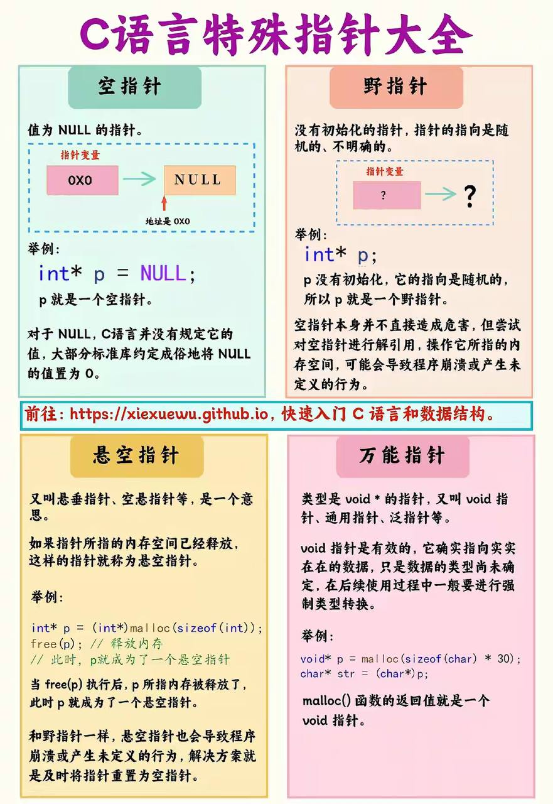
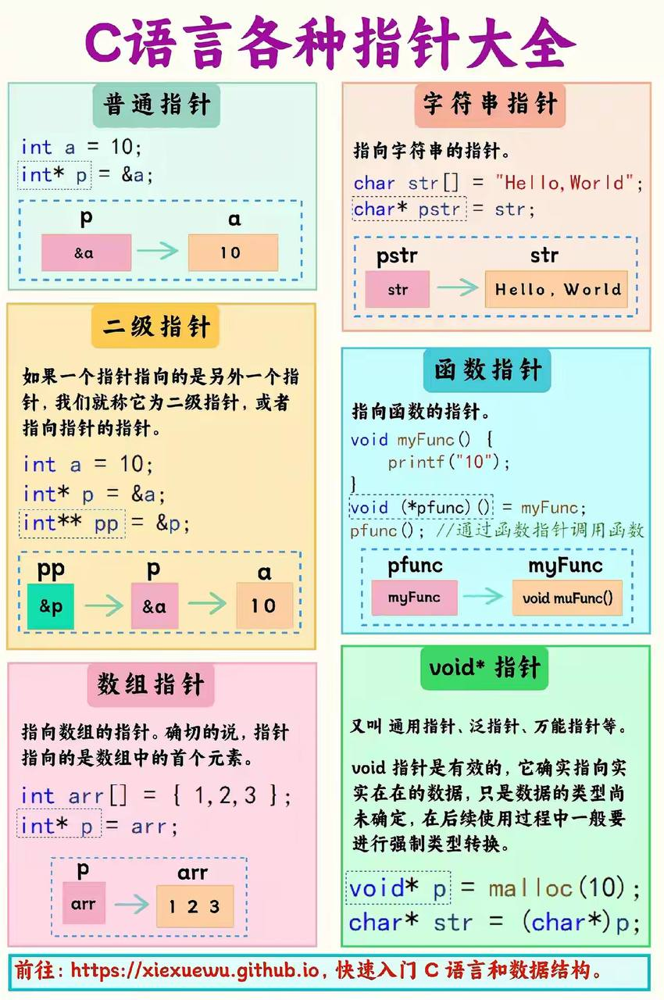

# [**Objective-C**](https://developer.apple.com/library/archive/documentation/Cocoa/Conceptual/ProgrammingWithObjectiveC/) 相关经验


[toc]

---

## 🔥 <font id=前言>前言</font>

- 对 [**Objective-C**](https://developer.apple.com/library/archive/documentation/Cocoa/Conceptual/ProgrammingWithObjectiveC/) 相关概念进行总结和梳理。
- 文中的内存布局、对象生命周期和线程行为均应结合目标架构、编译器、ARC 与系统版本理解，避免把实现细节当成永久不变的语言规则。
- 重点结论可直接跳转：[**Block 是否应该保存为属性**](#Block属性化边界)。

## 一、C语言指针 <a href="#前言" style="font-size:17px; color:green;"><b>🔼</b></a> <a href="#🔚" style="font-size:17px; color:green;"><b>🔽</b></a>





### 1.1、`int *p = &a`

- 这行代码是在C或C++中声明了一个整数指针变量 `p`，并将其初始化为变量 `a` 的地址；
- `&a` 表示取变量 `a` 的地址，然后将这个地址赋给指针变量 `p`；
- 这样，`p` 就指向了变量 `a` 的位置，可以通过 `p` 来访问和操作变量 `a`；
- `int *p` 表示 `p` 是一个整数指针，可以用来存储整数变量的地址；
- 整数指针是指一个指针，其目标是整数类型的变量

### 1.2、数组<font color=red>指针</font> 和 指针<font color=red>数组</font>

- <font color=red>**数组指针（Pointer to Array）**</font>

  - <u>本质是指针</u>

  - 是指向整个数组的指针

  - 示例

    ```c
    #include <stdio.h>

    int main() {
        int arr[10];
        /// int 表示数组的元素类型是整数。
        /// (*p) 表示 p 是一个指针。
        /// [10] 表示数组的大小是10。
        int (*p)[10] = &arr;

        for(int i = 0; i < 10; i++) {
            (*p)[i] = i; // 使用数组指针访问数组元素
        }

        for(int i = 0; i < 10; i++) {
            printf("%d ", (*p)[i]);
        }return 0;
    }
    ```

- 指针数组（Array of Pointers）

  - <u>本质是数组</u>

  - 是一个数组，其中的每个元素都是指针

  - 示例

    ```c
    #include <stdio.h>

    int main() {
        int a = 1, b = 2, c = 3;
        /// int * 表示数组的元素是指向整数的指针。
            /// p[3] 表示数组的大小是3。
        int *p[3];

        p[0] = &a;
        p[1] = &b;
        p[2] = &c;

        for(int i = 0; i < 3; i++) {
            printf("%d ", *p[i]); // 使用指针数组访问变量的值
        }return 0;
    }
    ```

## 二、<font color="red" id=内存分布>**内存分布**</font> <a href="#前言" style="font-size:17px; color:green;"><b>🔼</b></a> <a href="#🔚" style="font-size:17px; color:green;"><b>🔽</b></a>

```lua
+-----------------------------------------------------------------------------------------------------------+
| 代码段（Text）只读，固定大小
|         * 包括：程序代码、只读的常量（如 const 修饰的全局变量和字符串常量）。
+-----------------------------------------------------------------------------------------------------------+
| 全局区/数据段 （Data）
|         * 包括：已初始化的全局变量和已初始化的静态变量（包括全局和局部的静态变量）。
+-----------------------------------------------------------------------------------------------------------+
| 全局区/BSS 段（Block Started by Symbol）：未初始化的全局变量、未初始化的静态变量。
+-----------------------------------------------------------------------------------------------------------+
| 全局区/常量区：字符串常量（如字面量字符串）和编译期决定的只读变量（大多数实现将其归于代码段）。
|         * 注：如果常量区与代码段分开，则可以单独列出。
+-----------------------------------------------------------------------------------------------------------+
| 堆（Heap） 🔽 向高地址增长，动态分配内存（如 malloc 或 new 分配的内存）。
|            * 堆是动态分配的内存区域，用于存储程序运行时动态分配的内存；
|         * 堆上的内存可以通过函数如 malloc()、calloc() 或者 new 来分配，并通过 free() 或者 delete 函数来进行释放；
|     * 存储动态创建的对象，生命周期不受函数作用域限制，且内存管理通常由开发者或垃圾回收机制负责；
|     * 发生逃逸并由 ARC / copy 管理的 Block
+-----------------------------------------------------------------------------------------------------------+
| 栈（Stack）🔼 向低地址增长，用于局部变量、函数调用参数及返回地址等。
|            * 栈（Stack）用于存储函数的局部变量、函数参数、函数的返回地址等；
|       * 每次函数调用时，会在栈（Stack）上分配一块称为栈帧（Stack Frame）的内存，函数返回后，栈帧（Stack Frame）会被销毁；
|     * 栈（Stack）的大小是有限的，通常比堆的大小小得多 ；栈（Stack）<< 堆（Heap）
|     * 可以看作是一个容器；
|       * 其中元素的添加和移除都发生在同一端，通常称为栈顶；
|       * 向栈（Stack）中添加元素的操作称为“压栈”（Push），从栈中移除元素的操作称为“弹栈”（Pop）；
|       * 在栈（Stack）中，最后压入的元素首先被弹出，这就是先进后出的特性；
|     * 栈在计算机科学和软件工程中有广泛的应用，例如函数调用的过程、表达式求值、逆波兰表达式计算等场景都可以使用栈来实现。
+-----------------------------------------------------------------------------------------------------------+
```

> 💡 提示：
>
> - 上图仅用于理解常见进程内存区域，不是固定 ABI 布局图。段的位置、地址高低、栈和堆的增长方向都可能随系统、架构、链接器和安全随机化策略变化。
> - 全局区包含：
>   - **数据段（Data）**：包含已初始化的全局变量和已初始化的静态变量，属于全局区。
>   - **BSS段（Block Started by Symbol）**：包含未初始化的全局变量和静态变量，也属于全局区。变量在程序启动时会自动初始化为零。
>   - **常量区**：存储常量（如字面量字符串和编译期决定的只读变量）。在一些实现中，常量区也会和代码段合并，通常会归类到全局区的一部分。

## 三、内存数据 <a href="#前言" style="font-size:17px; color:green;"><b>🔼</b></a> <a href="#🔚" style="font-size:17px; color:green;"><b>🔽</b></a>

- 当前 Apple arm64 平台采用小端字节序：多字节整数的最低有效字节存放在最低地址；跨平台协议和文件格式仍应显式约定字节序。

  - 例如数值 `0x123456` 的最低有效字节是 `0x56`，在小端表示中位于最低地址。

- 一个字节 === 8bit

- 数组首个元素的地址值 === 数组地址值

  |  表达式   | 类型（类型不一致就导致：编译器对数据的处理方式不一致） |              含义              |
  | :-------: | :----------------------------------------------------: | :----------------------------: |
  |   `arr`   |                   `int *`（退化后）                    |        指向首元素的指针        |
  | `&arr[0]` |                        `int *`                         |        指向首元素的指针        |
  |  `&arr`   |                      `int (*)[5]`                      | 指向整个数组的指针（数组指针） |

- 内存对于数据只有记录的权利，至于对这个数据的解读，是来源于程序本身。举例：

  - 负数 = 正数去反 + 1，那么此数据就是首位为1。对于int就是负数，对于无符号int就是一个很大的数
  - 对于ASCII码，至于将这段数据解读成ASCII码还是数字，也是根据程序本身来的

- `float` 与 `double` 都是浮点类型；常见的 IEEE 754 实现中，`float` 为 32 位（4 字节），`double` 为 64 位（8 字节）。
- 实际大小应以目标平台的 `sizeof(float)`、`sizeof(double)` 为准，不能写成 `Float` 8 字节、`Double` 16 字节。

## 四、数据结构 <a href="#前言" style="font-size:17px; color:green;"><b>🔼</b></a> <a href="#🔚" style="font-size:17px; color:green;"><b>🔽</b></a>

### 4.1、数据结构总览

- 一维线性结构

  | 数据结构               | 中文说明                     | 常见用途                       |
  | ---------------------- | ---------------------------- | ------------------------------ |
  | **数组 (Array)**       | 连续内存的元素集合，访问快   | 快速读取、固定大小数据         |
  | **链表 (Linked List)** | 一个个节点串起来，插入删除快 | 动态数据、频繁插入删除         |
  | **栈 (Stack)**         | 后进先出（LIFO）             | 函数调用、表达式计算、撤销操作 |
  | **队列 (Queue)**       | 先进先出（FIFO）             | 排队、任务调度                 |
  | **双端队列 (Deque)**   | 两头都能进出                 | 缓存、滑动窗口                 |

- 非线性结构

  | 数据结构                 | 中文说明                    | 常见用途                 |
  | ------------------------ | --------------------------- | ------------------------ |
  | **树 (Tree)**            | 每个节点有子节点，像家谱    | 搜索、分类、XML解析      |
  | **二叉树 (Binary Tree)** | 每个节点最多两个子节点      | 排序、搜索               |
  | **堆 (Heap)**            | 一种特殊的树，最大堆/最小堆 | 优先队列、Top K 问题     |
  | **Trie 树（字典树）**    | 专门用来处理字符串前缀的树  | 自动补全、拼写检查       |
  | **B 树/B+ 树**           | 多叉平衡树                  | 数据库、文件系统索引     |
  | **图 (Graph)**           | 节点+边，可有环             | 地图、社交关系、网络拓扑 |

- 杂项 & 复合结构

  | 数据结构                      | 中文说明                               | 常见用途             |
  | ----------------------------- | -------------------------------------- | -------------------- |
  | **哈希表 (Hash Table)**       | 键值对结构，查找超快                   | 字典、缓存、键值映射 |
  | **并查集 (Union-Find)**       | 用来快速判断“两个元素是否属于同一集合” | 网络连通性、分组     |
  | **布隆过滤器 (Bloom Filter)** | 用很小空间判断“某个值是否可能存在”     | 数据库、去重、缓存   |
  | **跳表 (Skip List)**          | 类似多层链表，查找效率接近平衡树       | Redis 内部、排序结构 |
  | **位图 (BitMap)**             | 用一堆 0/1 表示状态                    | 去重、统计、压缩存储 |

### 4.2、各个数据结构的介绍

- 树（Tree）

  | 工具/功能    | 说明                                                    |
  | ------------ | ------------------------------------------------------- |
  | 文件夹结构   | 操作系统的目录结构（C盘、D盘）就是树形的                |
  | UI 层级结构  | iOS / Android 的界面控件是树形排列的                    |
  | 搜索引擎索引 | 比如字典排序、拼音联想功能，用的是“字典树（Trie Tree）” |
  | 数据库索引   | 数据库如 MySQL 用“B+树”加快查找速度                     |
  | 游戏技能树   | 技能之间有父子关系，也是树                              |
  | 决策树（AI） | 机器学习里，决策树是一种模型结构                        |

- 链表（Linked List）

  | 工具/功能            | 说明                                                 |
  | -------------------- | ---------------------------------------------------- |
  | 音乐播放器的播放队列 | 一首接一首，可以随时插入/删除某一首歌                |
  | 操作系统的任务队列   | 比如打印任务，按顺序处理，每次取一个任务             |
  | 实现“栈”和“队列”     | 比如浏览器“后退/前进”，经常用链表实现                |
  | 内存管理系统         | 操作系统分配/回收内存，常用双向链表表示内存块        |
  | Undo/Redo 功能       | 像 Word 的“撤销”功能，背后是一个链表串着每一步的记录 |

- 图（Graph）

  | 工具/功能              | 说明                                                         |
  | ---------------------- | ------------------------------------------------------------ |
  | 地图导航（高德、百度） | 城市就是“点”，道路就是“边”，用图算法找最短路径，比如 Dijkstra 算法 |
  | 社交网络               | 每个人是一个“点”，好友关系是“边”，朋友圈背后是社交图结构     |
  | 游戏地图               | 游戏中的迷宫、路径选择，也是图                               |
  | 网络拓扑               | 网络设备的连接结构（比如服务器、交换机）就是图               |
  | 项目依赖管理           | 比如编译一个程序，不同模块之间有依赖关系，用图可以管理编译顺序 |
  | 知识图谱               | AI 和搜索引擎中的知识关联就是一个超大的图结构                |

- 哈希表（Hash Table）的本质

  - 本质是通过将键（key）映射到一个确定的位置（”哈希桶”或“槽位”）来实现高效的数据存储和检索；
    - **快速查找**：哈希表可以在平均情况下以常量时间复杂度（O(1)）进行查找、插入和删除操作。这是因为哈希函数将键转换成一个固定长度的值，使得每个键都有一个确定的位置，从而可以直接在该位置进行操作；
    - **均匀分布**：良好设计的哈希函数可以使键在哈希表中均匀分布，尽量减少哈希冲突的发生。哈希冲突是指不同的键经过哈希函数后映射到了同一个桶中，解决冲突的方法通常包括链地址法和开放地址法等；
    - **灵活性**：哈希表适用于各种类型的数据，可以存储键值对、对象等各种形式的数据；
    - **空间效率**：尽管哈希表可能会消耗一定的内存空间，但在大多数情况下，哈希表的空间效率是很高的，尤其是在数据量较大时；

## 五、内存表示 <a href="#前言" style="font-size:17px; color:green;"><b>🔼</b></a> <a href="#🔚" style="font-size:17px; color:green;"><b>🔽</b></a>

- <font color=red>内存只负责记录，实际释义是通过程序来的，通过不同的数据类型来展现其表达的真正含义</font>

- ASCII 字符与整数在内存中如何区分？

  - 内存只保存比特，不保存“这是字符还是整数”的标签；类型信息、指令和上下文决定同一段比特如何解释；
  - 数据类型决定存储大小、对齐、合法操作和格式化方式，但不同类型完全可能拥有相同的底层比特；

    - **字符 (Character):** 在许多编程语言中，字符通常使用 Unicode 编码表示。在 [**Swift**](https://www.swift.org/) 中，`Character` 表示扩展字形簇，其存储大小不等于单个 Unicode 标量大小；
    - **整数 (Integer):** [**Swift**](https://www.swift.org/) 的整数类型包括 `Int`、`UInt`、`Int8`、`Int16`、`Int32`、`Int64` 等，它们具有不同的位宽和符号语义；

  - ASCII 是字符到整数编码值的映射，标准 ASCII 使用 7 位，实际通常存放在至少 1 字节的整数单元中；
  - Unicode 字符串和高级语言的字符类型可能采用更复杂的内部表示，不能用“字符一定比整数占用更多内存”概括；
    *以下是一个简单的 [**Swift**](https://www.swift.org/) 示例，演示字符和整数在当前目标平台上的布局差异：*

    ```swift
    let char: Character = "A"
    let asciiValue = char.asciiValue  // 获取字符的ASCII码

    let integer: Int = 65  // 整数表示ASCII码

    print("Character '\(char)' 在内存中的表示为: \(MemoryLayout.size(ofValue: char)) 字节")
    print("整数 \(integer) 在内存中的表示为: \(MemoryLayout.size(ofValue: integer)) 字节")

    // 结果还受目标架构、标准库实现、字节序与对齐规则影响。
    ```

- ASCII码在内存里是用数字表示，但如果一个纯数字在内存怎么表示呢？会不会和ASCII码冲突？

  - ASCII码是一种将字符映射到数字的编码方式，而数字本身在内存中以二进制形式表示；

  - ASCII码通常用一个字节（8位）来表示，而纯数字也是以二进制形式存储；

  - ASCII 编码值与普通整数不需要“避免冲突”；即使比特相同，也会由当前类型和使用上下文作出不同解释。举例：

    > ➡️ 二者虽然底层比特相同，但**数据类型不同**，解释方式不同，不会冲突。
    >
    > 虽然 `00111001` 在**二进制中确实等于十进制的 57**，但：
    >
    > **在字符上下文中（`char` 类型）**：`00111001` 被解释为 **字符 `'9'`**，即 ASCII 编码。
    >
    > **在整数上下文中（`int` 类型）**：`00111001` 被解释为 **数值 57**。

    | 表达式 |  含义  | 内存（二进制） | 十进制 |   ASCII 字符   |
    | :----: | :----: | :------------: | :----: | :------------: |
    | `'9'`  | 字符 9 |   `00111001`   |  `57`  |     `'9'`      |
    |  `9`   | 数值 9 |   `00001001`   |  `9`   | 无（不是字符） |

- 计算机内存是怎么去表示浮点数的?
  - 计算机内存使用**IEEE 754标准**来表示浮点数；
  - 这标准规定了浮点数的存储方式，包括单精度（32位）和双精度（64位）两种格式；
    - 单精度浮点数的结构存储为：1位符号位 + 8位指数部分 + 23位尾数部分
    - 双精度浮点数的存储结构为：1位符号位 + 11位指数部分 + 52位尾数部分
    - 这种存储方式允许计算机在有限的内存中表示广泛的浮点数值，并提供了一种平衡精度和存储空间的方法；
  - 浮点数通常由三部分组成：符号位、指数部分和尾数部分；
    - 符号位表示正负；
    - 指数部分用于表示数的大小；
    - 尾数部分则包含数值的有效数字；

## 六、时间复杂度、空间复杂度 <a href="#前言" style="font-size:17px; color:green;"><b>🔼</b></a> <a href="#🔚" style="font-size:17px; color:green;"><b>🔽</b></a>

> - 时间复杂度：做事要几步？
> - 空间复杂度：占地要几张纸？

```c
for (int i = 0; i < n; i++) {
    printf("Hello\n");
}
```

- 时间复杂度是 O(n)，因为循环执行 n 次。
- 额外空间复杂度是 O(1)，因为使用的辅助存储不随 n 增长；输出本身是否计入空间要看分析口径。

## 七、内存对齐：结构体（struct） VS 联合体（union） <a href="#前言" style="font-size:17px; color:green;"><b>🔼</b></a> <a href="#🔚" style="font-size:17px; color:green;"><b>🔽</b></a>

| 项目         | `struct`（结构体）                                | `union`（共用体）                   |
| ------------ | ------------------------------------------------- | ----------------------------------- |
| **内存布局** | 所有成员 **并排排列**，每个成员都有自己的内存空间 | 所有成员 **共享同一块内存**（重叠） |
| **大小**     | 成员大小、成员间填充和尾部填充之和                | 至少容纳最大成员，并满足联合体对齐要求 |
| **成员状态** | 成员可以 **同时使用**                             | 任一时刻**只建议访问一个成员**      |
| **应用场景** | 普通数据结构，多字段同时生效                      | 节省内存（如协议数据包中的变体）    |

- 数据布局主要由编译器依据目标平台 ABI 和类型对齐要求决定；可用编译器指令调整打包方式，但这可能降低访问性能或造成跨平台兼容问题。

  ```c
  // #pragma pack 是编译器扩展，可能影响性能和 ABI 兼容性。
  #pragma pack(push, 1)  // 将对齐方式设置为 1 字节
  union MyUnion {
      char c;
      int i;
      double d;
  };
  #pragma pack(pop)  // 恢复默认对齐方式

  #pragma pack(push, 1)  // 将对齐方式设置为 1 字节
  struct MyStruct {
      char c;
      int i;
      double d;
  };
  #pragma pack(pop)  // 恢复默认对齐方式
  ```

- 联合体（union）

  - **所有成员共用同一块内存**，它们不会“同时存在”。**你任意时刻只能安全地使用其中一个成员**。

  - 联合体必须足以容纳最大成员，并满足所有成员中最严格的对齐要求；最终 `sizeof(union)` 通常向该对齐值的整数倍取整。

    ```c
    union U1{
            char a[6];// 6 （最大成员）
            int b; // 4 （最大对齐数）
            char c; // 1
        }u1; // 8 = 4 * 2

    union{
            char a[9]; // 9 （最大成员）
            int b; // 4 （最大对齐数）
            union U1 uu1;// 8
        }u2; //12 = 4 * 3,如果*2 = 8 无法涵盖9，所以必须3倍

    union{
            char a[7];// 7
            int b;// 4 （最大对齐数）
            union U1 uu1;// 8 （最大成员）
        }u3; //8
    ```

- 结构体（`struct`）

  - 结构体成员按声明顺序布局在一段连续存储中，但成员之间以及末尾都可能存在填充字节；
  - 结构体本身可以位于栈、堆、全局区、对象内部或寄存器中，具体取决于声明位置、所有权、优化和 ABI；“值传递必在栈、指针传递必在堆”是错误结论；
  - 每个成员起始地址需要满足该成员类型的对齐要求，结构体整体也要满足自身对齐要求，以保证结构体数组中的每个元素都正确对齐；
  - 通常结构体对齐值不小于其成员所需对齐值的最大值，但 `#pragma pack`、编译器属性和 ABI 都可能改变最终布局；
  - 使用 `sizeof`、`_Alignof`（C11）和 `offsetof` 验证目标平台的真实结果，不要只靠手算。

    ```c
    struct S1{
            char a; // 1
            int b; // 4
            char c; // 1
        }s1; //12 = 4 * 3
    ```

## 八、<font color="red">**atomic/nonatomic**</font> <a href="#前言" style="font-size:17px; color:green;"><b>🔼</b></a> <a href="#🔚" style="font-size:17px; color:green;"><b>🔽</b></a>

- [**Apple Objective-C 属性文档**](https://developer.apple.com/library/archive/documentation/Cocoa/Conceptual/ProgrammingWithObjectiveC/EncapsulatingData/EncapsulatingData.html)中的 `atomic` / `nonatomic` 只描述编译器合成访问器的原子性，不等同于整个对象或业务逻辑的线程安全。
- 默认行为：未显式声明时，`@property` 默认为 `atomic`。
- `atomic` 保证一次合成的 `getter` 或 `setter` 不会返回或写入“半个值”，但不保证“读取—修改—写回”这类复合操作原子，也不保证多个属性之间的一致性。
- 不应依赖某一种具体锁实现；编译器和运行时的实现细节可能变化。
- `nonatomic` 不提供并发访问保证，通常开销更低。iOS 项目常用 `nonatomic`，再用串行队列、锁、actor 或明确的线程约束保护共享状态。
- 自定义访问器时，线程安全语义需要自行实现，不能因为声明了 `atomic` 就默认成立。

## 九、<font color="red">**strong/copy**</font> <a href="#前言" style="font-size:17px; color:green;"><b>🔼</b></a> <a href="#🔚" style="font-size:17px; color:green;"><b>🔽</b></a>

- `copy` 的结果由对象所属类及其 `NSCopying` 实现决定，不能简单概括为“不可变对象浅拷贝，其余全部深拷贝”。
- Foundation 的不可变对象在 `copy` 时经常直接返回自身；可变对象在 `copy` 时通常产生不可变副本，`mutableCopy` 通常产生可变副本。
- 容器对象的 `copy` 通常只复制容器结构，容器内元素是否继续复制要看具体 API，不能默认是递归深拷贝。
- 字符串、数组、字典等希望保持不可变语义的属性通常使用 `copy`，以防调用方传入可变子类后继续修改。
- Jobs 工程源码声明属性时使用 `Prop_copy(...)`、`Prop_strong(...)` 等 `JobsDefineProperty` 宏；下面的原生 `@property` 仅用于解释语言机制。

  ```objective-c
  #import <Foundation/Foundation.h>

  @interface MyClass : NSObject

  @property (nonatomic,strong)NSString *strongString;
  @property (nonatomic,copy)NSString *copyString;

  @end

  @implementation MyClass
  @end

  int main(int argc, const char * argv[]) {
      @autoreleasepool {
          NSMutableString *mutableStr = [NSMutableString stringWithString:@"初始值"];

          MyClass *obj = [[MyClass alloc] init];
          obj.strongString = mutableStr; // 使用 strong 属性赋值
          obj.copyString = mutableStr;   // 使用 copy 属性赋值

          NSLog(@"修改前 - strongString: %@, copyString: %@", obj.strongString, obj.copyString);

          // 修改原来的 mutableStr 的值
          [mutableStr appendString:@" - 修改后"];

          NSLog(@"修改后 - strongString: %@, copyString: %@", obj.strongString, obj.copyString);
      }return 0;
  }
  ```

  ```
  修改前 - strongString: 初始值, copyString: 初始值
  修改后 - strongString: 初始值 - 修改后, copyString: 初始值

  如果用 strong，会有可能意外地共享同一个可变对象，导致外部修改影响到内部数据。
  使用 copy 则确保即使传入的是一个可变对象，属性也只会保留一个不可变的副本，从而避免了这种不确定性。
  ```

## 十、<font color="red">**Objective-C / Clang Block**</font> <a href="#前言" style="font-size:17px; color:green;"><b>🔼</b></a> <a href="#🔚" style="font-size:17px; color:green;"><b>🔽</b></a>

> [**Block**](https://clang.llvm.org/docs/BlockLanguageSpec.html) 是 Clang 为 C、Objective-C、C++ 和 Objective-C++ 提供的语言扩展：它既包含可执行代码，也可以携带从外层作用域捕获的状态。

### 10.1、Block 的捕获规则

| 外部变量 | 默认捕获方式 | Block 内能否修改 |
| -------- | ------------ | ---------------- |
| 自动局部变量 | 创建 Block 表达式时按值捕获 | 默认不能修改捕获副本 |
| `__block` 局部变量 | 通过可转移的共享存储访问 | 可以修改，外部作用域能看到新值 |
| 全局变量、静态变量 | 直接访问对应存储 | 可以修改，不需要 `__block` |
| Objective-C 对象 | 捕获对象引用；ARC 下通常形成强引用 | 可以修改对象状态，不能直接改写未加 `__block` 的局部绑定 |

```objective-c
int value = 10;
__block int mutableValue = 10;

void (^printValue)(void) = ^{
    NSLog(@"value = %d", value); // 按值捕获，输出 10
    mutableValue = 30;           // 修改共享的 __block 存储
};

value = 20;
printValue();
NSLog(@"mutableValue = %d", mutableValue); // 输出 30
```

- `__block` 只用于局部变量的捕获与可变性，不能修饰 `@property`。
- 当捕获它的 Block 发生逃逸时，`__block` 存储可能从自动存储迁移到堆；代码不应依赖其内部转发结构。
- Block 捕获 `self` 或实例变量时会间接捕获 `self`。如果 `self` 又长期持有该 Block，就可能形成循环引用。

### 10.2、Block 的存储与生命周期

| 情况 | 可能的存储 | 生命周期要点 |
| ---- | ---------- | ------------ |
| 不捕获自动局部状态 | 全局存储 | 通常与进程生命周期一致 |
| 未逃逸且捕获局部状态 | 自动存储或编译器优化后的等价形式 | 不应保存到原作用域之外 |
| 被复制或发生逃逸 | 堆或编译器管理的等价形式 | 由 ARC / 所有者管理生命周期 |

- Block 可能位于自动存储、全局存储或堆中，不能笼统地写成“Block 都在堆上”。
- “栈 Block / 堆 Block / 全局 Block”有助于理解 ABI，但不要依赖私有类名、对象地址高低或某次打印结果编写业务逻辑。
- ARC 会在 Block 逃逸时按需要管理复制；属性仍应显式使用 `copy`，因为它准确表达“保存捕获状态并延长生命周期”的语义。

<a id="Block属性化边界"></a>

### 10.3、Block 保存为属性：不是一律禁止，而是按生命周期决定

> **结论：默认不把临时 Block 属性化；只有回调必须在当前方法返回后继续存在时，才保存为 `copy` 属性。**

| 场景 | 是否保存为属性 | 原因 |
| ---- | -------------- | ---- |
| 方法内立即同步执行 | ❌ 不需要 | 参数或局部变量已经足够，属性会扩大状态范围 |
| 一次普通枚举、排序、配置回调 | ❌ 通常不需要 | Block 不需要逃逸当前调用 |
| 异步结果需要稍后回调 | ✅ 可以 | 回调必须跨越当前方法生命周期 |
| UIControl 事件、代理式持续回调 | ✅ 可以 | 需要在对象生命周期内重复触发 |
| 防抖、节流、任务依赖 | ✅ 可以 | 需要保存回调及相关状态 |
| 只触发一次的延迟回调 | ✅ 可以，但触发后清空 | 缩短持有周期并降低循环引用风险 |

标准 Objective-C 语法中，Block 属性按 [**Apple Working with Blocks**](https://developer.apple.com/library/archive/documentation/Cocoa/Conceptual/ProgrammingWithObjectiveC/WorkingwithBlocks/WorkingwithBlocks.html) 的建议使用 `copy`：

```objective-c
@property(nonatomic, copy, nullable) void (^completion)(NSString *result);
```

Jobs 工程不在业务文件中重复声明已有 Block 类型，也不直接写原生 `@property`；复用 `JobsBlock` 中的类型并使用 `JobsDefineProperty` 宏：

```objective-c
/// jobsByCtrlBlock 定义在 JobsBlock。
Prop_copy(nullable)jobsByCtrlBlock block;
```

当前工程 `JobsByPods/JobsBaseUI@Pods/Core/UIBaseObject/JobsControlTarget/JobsControlTarget.{h,m}` 就是合理的属性化场景：目标对象需要跨越绑定方法持续保存 UIControl 回调。对于 `JobsInvokePolicyOnce`，实现先复制局部变量、再清空属性、最后调用：

```objective-c
if (!self.block) return;
jobsByCtrlBlock blk = [self.block copy];
self.block = nil; // 调用前解除长期持有，避免重入时再次触发
if (blk) blk(sender);
```

这段顺序同时保证本次调用期间 Block 仍然存活，并尽早解除对象对一次性回调的持有。

### 10.4、Block 属性化的风险与处理

- **禁止 `assign`**：`assign` 不管理对象生命周期，保存 Block 可能产生悬垂引用。ARC 下 `strong` 往往也能维持生命周期，但 `copy` 才是 Apple 推荐且语义明确的 Block 属性写法。
- **防止循环引用**：如果对象长期持有 Block，而 Block 又使用对象，应按业务生命周期使用 `__weak` / `__strong`。

  ```objective-c
  __weak typeof(self) weakSelf = self;
  self.completion = ^(NSString *result) {
      __strong typeof(weakSelf) self = weakSelf;
      if (!self) return;
      self.status = result;
  };
  ```

- **一次性回调及时清空**：优先采用“复制到局部变量 → 属性置空 → 调用”的顺序。
- **`copy` 不提供线程安全**：并发读写或调用同一个 Block 属性仍需串行队列、锁或明确的线程隔离。
- **分类关联属性也要复制**：通过 Associated Objects 保存 Block 时使用 `OBJC_ASSOCIATION_COPY` 或 `OBJC_ASSOCIATION_COPY_NONATOMIC`。
- **避免无意义的长期状态**：如果 Block 只是当前方法的实现细节，保持为参数或局部变量；不要为了调用方便把它升级为属性。

### 10.5、`NSString` 属性不要使用 `assign`

- Objective-C 对象属性使用 `assign` 不会维持对象生命周期，`NSString *` 也不例外，可能形成悬垂引用。
- 希望隔离调用方传入的 `NSMutableString` 时使用 `copy`；明确共享同一对象时才考虑 `strong`。
- Jobs 工程对应写法为 `Prop_copy()` 或 `Prop_strong()`，不能把 Block 的 `copy` 结论误写成“所有对象都必须 copy”。

## 十一、固态硬盘可以替代内存进行工作吗？（不能完全替代） <a href="#前言" style="font-size:17px; color:green;"><b>🔼</b></a> <a href="#🔚" style="font-size:17px; color:green;"><b>🔽</b></a>

- 结论
  - RAM 与 SSD 都是电子存储设备，但技术不同：常见主存使用 DRAM，SSD 使用 NAND Flash；不能写成“两者都使用闪存”。
  - <font color=red>SSD 不能等价替代 RAM。操作系统可以把暂时不用的内存页换出到 SSD，但访问延迟、带宽和写入特性都与 RAM 有数量级差异。</font>
- 访问速度
  - **RAM（随机存取内存）**：内存是非常快的存储介质，提供<u>纳秒级</u>的访问时间，是CPU进行高速数据访问和处理的主要存储器。
  - **SSD（固态硬盘）**：固态硬盘虽然比传统机械硬盘（HDD）快得多，但其访问时间仍然在<u>微秒级</u>，比RAM慢很多。
- **闪存类型和结构**：
  - **RAM（随机存取内存）**：使用的是 **DRAM（动态随机存取内存）**，<u>这种内存需要不断刷新以保持数据</u>。DRAM 的工作原理与 SSD 使用的 NAND 闪存不同，**主要是因为它存储的数据是通过电容存储的，而不是通过电子的存储单元**。
  - **SSD（固态硬盘）**： 使用的是 **NAND 闪存**，它是基于存储单元通过电子来保持数据，<u>并且在设备关闭时仍能保持数据</u>。NAND 闪存的特点是**块级存储**，它的数据写入是以块为单位的，这使得 SSD 适合大容量的长期存储，但读写速度比 RAM 慢。
- 其他
  - 由于SSD的速度比RAM慢得多，**使用虚拟内存会导致系统性能下降**
  - **SSD有写入寿命限制**，频繁使用虚拟内存可能会加速SSD的磨损

## 十二、常见锁 <a href="#前言" style="font-size:17px; color:green;"><b>🔼</b></a> <a href="#🔚" style="font-size:17px; color:green;"><b>🔽</b></a>

- 互斥锁（Mutex, Mutual Exclusion Lock）：
  - 互斥锁是一种基本的锁，用于确保一次只有一个线程可以访问某资源。
  - 如果一个线程获得了锁，其他线程必须等待锁被释放。

- 读写锁（Read-Write Lock）：
  - 读写锁允许多个线程同时读取，但写操作是排他的，即在写操作进行时，其他读线程或写线程都要等待。

- 递归锁（Recursive Lock）：
  - 允许同一线程多次加锁，但必须按次数成对解锁；它只避免同一线程的自重入死锁，不解决线程之间的死锁。
  - 递归锁对某些场景很有用，比如在递归函数中使用锁。

- 自旋锁（Spin Lock）：
  - 自旋锁是轻量级锁，如果锁被占用，线程不会立即挂起，而是会不断尝试获取锁。
  - 只有在持锁时间极短且不会发生优先级反转等问题时才可能有收益；iOS 上不要使用已弃用的 `OSSpinLock`，应根据场景选择系统当前支持的锁或串行队列。

## 十三、Objective-C 中与 Java `LinkedHashSet` 对应的选择 <a href="#前言" style="font-size:17px; color:green;"><b>🔼</b></a> <a href="#🔚" style="font-size:17px; color:green;"><b>🔽</b></a>

- `NSOrderedSet` 同时保留元素顺序并保证元素唯一，是最接近 `LinkedHashSet` 语义的 Foundation 集合。
- 需要增删时使用 `NSMutableOrderedSet`。
- 两者的具体复杂度、相等性判断和线程安全语义不必然与 Java `LinkedHashSet` 完全一致，不能只因功能相似就假设实现相同。

## 十四、可能会存在属性没有对应的 `getter` 和 `setter` 方法的情况 <a href="#前言" style="font-size:17px; color:green;"><b>🔼</b></a> <a href="#🔚" style="font-size:17px; color:green;"><b>🔽</b></a>

- 一个例子是使用 `@dynamic` 关键字来声明属性。在使用 Core Data 框架或者实现了自定义的动态属性存取方法时，你可能会使用 `@dynamic` 来告诉编译器，该属性的 `getter` 和 `setter` 方法由运行时或其他方式动态生成，而不是在编译时静态声明。
- 另一个例子是在 Objective-C 中使用[**关联对象（Associated Objects）**](#AssociatedObjects)。关联对象允许你向已有的类中添加属性，而无需修改类的源代码。这种情况下，你可能不会显式地声明属性的 getter 和 setter 方法，而是通过关联对象来存取属性值。

## 十五、<font id=OC.copy>OC.copy</font> <a href="#前言" style="font-size:17px; color:green;"><b>🔼</b></a> <a href="#🔚" style="font-size:17px; color:green;"><b>🔽</b></a>

- `copy` / `mutableCopy` 的结果取决于类对 `NSCopying` / `NSMutableCopying` 的实现，不能从“可变或不可变”推导所有自定义类的行为。
- Foundation 集合和字符串通常遵循以下语义：

  | 接收者 | `copy` 常见结果 | `mutableCopy` 常见结果 |
  | ------ | --------------- | --------------------- |
  | 不可变对象 | 可能直接返回自身 | 新的可变对象 |
  | 可变对象 | 新的不可变对象 | 新的可变对象 |

- 暴露为 `NSString`、`NSArray`、`NSDictionary` 等不可变类型的属性通常使用 `copy`，以隔离调用方传入的可变子类。
- 声明为可变类型的属性通常使用 `strong` 保持可变性；如果需要独立的可变副本，应在 setter 或初始化阶段显式 `mutableCopy`。
- Jobs 工程属性示例：

  ```objective-c
  Prop_copy()NSString *name;             // 隔离 NSMutableString
  Prop_strong()NSMutableArray *btns;     // 保持集合可变
  ```

- Associated Objects 保存可变集合时使用 `OBJC_ASSOCIATION_RETAIN_NONATOMIC`；使用 `COPY` 通常会得到不可变副本。

<a id="AssociatedObjects"></a>

## 十六、**OC.AssociatedObjects（关联对象）** <a href="#前言" style="font-size:17px; color:green;"><b>🔼</b></a> <a href="#🔚" style="font-size:17px; color:green;"><b>🔽</b></a>

- Associated Objects 依赖 Objective-C Runtime，可在不增加实例变量的情况下给对象附加额外状态。
- [**Swift**](https://www.swift.org/) 并非“一律没有关联对象”：继承自 `NSObject` 或可被 Objective-C Runtime 管理的类实例可以使用相关 API；纯 [**Swift**](https://www.swift.org/) 值类型不能作为宿主对象使用这套机制。
- key 必须在进程内保持唯一且地址稳定。Category 属性推荐让 getter 使用 `_cmd`，setter 使用 `@selector(propertyName)`，二者会得到同一个 selector 地址。
- 标量用 `NSNumber` 包装，结构体用 `NSValue` 包装，Block 使用 `COPY`，普通对象和可变集合通常使用 `RETAIN`。
- `OBJC_ASSOCIATION_ASSIGN` 不是 ARC 的自动置空弱引用，不能用它模拟安全的 `weak`。
- `objc_removeAssociatedObjects(object)` 会移除该对象上的所有关联值，可能误删其他模块的数据；通常应针对自己的 key 设置 `nil`。
- `ATOMIC` / `NONATOMIC` 策略不等同于完整业务线程安全，并发复合操作仍需额外同步。

### 16.1、保存 Block

Jobs 工程复用 `JobsBlock` 中的 `jobsByNotificationBlock`，并使用属性宏：

```objective-c
@interface NSNotificationCenter (JobsBlock)

Prop_copy(nullable)jobsByNotificationBlock jobsNotificationBlock;

@end

@implementation NSNotificationCenter (JobsBlock)

-(jobsByNotificationBlock)jobsNotificationBlock{
    return objc_getAssociatedObject(self, _cmd);
}

-(void)setJobsNotificationBlock:(jobsByNotificationBlock)jobsNotificationBlock{
    objc_setAssociatedObject(self,
                             @selector(jobsNotificationBlock),
                             jobsNotificationBlock,
                             OBJC_ASSOCIATION_COPY_NONATOMIC);
}

@end
```

### 16.2、保存标量与结构体

```objective-c
@interface UIViewController (JobsState)

Prop_assign()BOOL setupNavigationBarHidden;
Prop_assign()CGRect jobsRect;

@end

@implementation UIViewController (JobsState)

-(BOOL)setupNavigationBarHidden{
    return [objc_getAssociatedObject(self, _cmd) boolValue];
}

-(void)setSetupNavigationBarHidden:(BOOL)setupNavigationBarHidden{
    objc_setAssociatedObject(self,
                             @selector(setupNavigationBarHidden),
                             @(setupNavigationBarHidden),
                             OBJC_ASSOCIATION_RETAIN_NONATOMIC);
}

-(CGRect)jobsRect{
    return [objc_getAssociatedObject(self, _cmd) CGRectValue];
}

-(void)setJobsRect:(CGRect)jobsRect{
    objc_setAssociatedObject(self,
                             @selector(jobsRect),
                             [NSValue valueWithCGRect:jobsRect],
                             OBJC_ASSOCIATION_RETAIN_NONATOMIC);
}

@end
```

### 16.3、保存 `SEL`

`SEL` 不是 Objective-C 对象，先转为 `NSString` 保存，读取时再还原：

```objective-c
@interface UIViewController (JobsSelector)

Prop_assign()SEL jobsSelector;

@end

@implementation UIViewController (JobsSelector)

-(SEL)jobsSelector{
    NSString *selectorName = objc_getAssociatedObject(self, _cmd);
    return selectorName.length ? NSSelectorFromString(selectorName) : NULL;
}

-(void)setJobsSelector:(SEL)jobsSelector{
    objc_setAssociatedObject(self,
                             @selector(jobsSelector),
                             jobsSelector ? NSStringFromSelector(jobsSelector) : nil,
                             OBJC_ASSOCIATION_COPY_NONATOMIC);
}

@end
```

## 十七、`UIViewController` 常见生命周期回调 <a href="#前言" style="font-size:17px; color:green;"><b>🔼</b></a> <a href="#🔚" style="font-size:17px; color:green;"><b>🔽</b></a>

> 不存在所有控制器都严格执行一次的“固定 11 步”。初始化路径、容器控制器、转场、布局轮次和视图是否重新加载都会影响回调次数与时序。

- `initWithCoder:`：从 Storyboard / Nib 解档创建控制器时调用；纯代码创建通常走其他初始化方法。
- `awakeFromNib`：对象完成 Nib 解档后收到回调。
- `loadView`：控制器需要其根视图且根视图尚未加载时创建或装载视图。
- `viewDidLoad`：当前这次根视图加载完成后调用，适合做与视图绑定的初始化。
- `viewWillAppear:` / `viewDidAppear:`：每次视图即将 / 已经进入可见层级时都可能调用。
- `updateViewConstraints`、`viewWillLayoutSubviews`、`viewDidLayoutSubviews`：约束或布局更新时可能重复调用，不能假设每次出现只调用一次。
- `viewWillDisappear:` / `viewDidDisappear:`：每次视图即将 / 已经离开可见层级时都可能调用。

## 十八、序列化 VS 反序列化 <a href="#前言" style="font-size:17px; color:green;"><b>🔼</b></a> <a href="#🔚" style="font-size:17px; color:green;"><b>🔽</b></a>

- 序列化：将对象（如数组、字典、模型等）**转换为字节流（如 JSON、二进制、XML）**，用于持久化（保存到文件、磁盘）或传输（如网络）。
- 反序列化：将字节流（JSON、XML、二进制等）**还原成原始对象（如数组、字典、模型）**。

## 十九、KVC 和 KVO <a href="#前言" style="font-size:17px; color:green;"><b>🔼</b></a> <a href="#🔚" style="font-size:17px; color:green;"><b>🔽</b></a>

> 1、KVO 和 KVC 在实际开发中经常一起结合使用，以实现对对象属性的动态访问和监听；
> 2、这两个特性能够使得代码更加灵活，同时也方便了数据模型和视图之间的通信；
> 3、在实际应用中，需要注意使用 KVO 和 KVC 时的内存管理和性能问题，以确保应用的稳定性和性能优化；

### 19.1、__covariant、__contravariant

> - 在 Objective-C 中，`__covariant` 和 `__contravariant` 是用于 **泛型类型参数协变性（covariance）与逆变性（contravariance）** 的关键字。它们出现在泛型类的声明中，目的是为编译器提供**类型安全的协变/逆变检查**，尤其是在泛型和容器类型传递之间转换时更有用。
> - 不使用时默认是**不变（invariant）**：默认情况下，泛型是**不变的**：`MyArray<NSString *>` 和 `MyArray<NSObject *>` 之间互相赋值会编译报错。
> - 一般写代码用不到，除非封装框架

| 关键字            | 中文含义 | 作用                            | 示例含义                                                   |
| ----------------- | -------- | ------------------------------- | ---------------------------------------------------------- |
| `__covariant`     | 协变     | 允许**子类向上转型**（子 ➜ 父） | `NSArray<NSString *>` 可以赋值给 `NSArray<NSObject *>`     |
| `__contravariant` | 逆变     | 允许**父类向下转型**（父 ➜ 子） | `MyHandler<NSObject *>` 可以赋值给 `MyHandler<NSString *>` |

- 协变（`__covariant`）—— 常用于只读容器，如 `NSArray`

  ```objective-c
  @interface MyArray<__covariant ObjectType> : NSObject
  @property (nonatomic, strong) ObjectType object;
  @end

  MyArray<NSString *> *strArray = [MyArray new];
  MyArray<NSObject *> *objArray = strArray; // ✅ 合法
  ```

  ```objective-c
  /// 允许 NSArray<NSString *> * 赋值给 NSArray<NSObject *> *
  @interface NSArray<__covariant ObjectType> : NSObject <NSCopying, NSMutableCopying, NSSecureCoding, NSFastEnumeration>

  @end
  ```

- 逆变（`__contravariant`）—— 常用于处理器/回调类，表示只写行为

  > - 苹果的 API 中 **几乎没有使用 `__contravariant`**
  >   - Apple 很少封装“只写”的泛型类，比如“只接收对象”的处理器或回调类型。
  >   - Apple 大多通过 `id`、`SEL`、`delegate`、`target-action` 模式实现动态分发，不依赖泛型逆变。
  >   - Apple 更注重稳定和兼容，不使用容易让开发者困惑的语言特性，尤其是在泛型不参与运行时的 Objective-C 中。

  ```objective-c
  @interface MyHandler<__contravariant ObjectType> : NSObject
  - (void)handle:(ObjectType)obj;
  @end

  MyHandler<NSObject *> *objHandler = [MyHandler new];
  MyHandler<NSString *> *strHandler = objHandler; // ✅ 合法
  ```

### 19.2、KVC（<font color="red">***K***</font>ey-<font color="red">***V***</font>alue <font color="red">***C***</font>oding）：**键值**<font color="red">存储</font>

- KVC 使用字符串形式的 `key` / `keyPath` 动态读取或设置值，常用入口是 `valueForKey:`、`setValue:forKey:`、`valueForKeyPath:` 和 `setValue:forKeyPath:`。
- KVC 并非简单地“绕过 getter / setter”。设置值时优先查找符合约定的 setter；读取值时优先查找符合约定的 getter 或集合访问器。
- 当类方法 `+accessInstanceVariablesDirectly` 返回 `YES` 且未找到访问器时，KVC 才会按约定顺序查找相关实例变量。
- 找不到合法键时分别进入 `valueForUndefinedKey:` 或 `setValue:forUndefinedKey:`；默认实现会抛出异常，可按业务需要重写。
- 给标量属性传入 `nil` 会进入 `setNilValueForKey:`；默认实现同样会抛出异常。
- `keyPath` 表示逐段访问的键路径，不等同于“任意实例变量路径”。路径中的每一段都必须满足 KVC 规则。

<a id="KVO"></a>

### 19.3、KVO（<font color="red">***K***</font>ey-<font color="red">***V***</font>alue <font color="red">***O***</font>bserving）：**属性**<font color="red">观察</font>

- [**Apple KVO Compliance**](https://developer.apple.com/library/archive/documentation/Cocoa/Conceptual/KeyValueObserving/Articles/KVOCompliance.html) 说明了自动与手动通知规则；KVO 允许对象监听另一个对象的 KVO-compliant key 变化。
- **KVO 不是“只能由 KVC 触发”**：自动通知可由符合 KVC 约定的 setter、点语法调用 setter、`setValue:forKey:` 或可变集合代理触发；也可用 `willChangeValueForKey:` / `didChangeValueForKey:` 手动发送通知。
- 直接修改实例变量通常会绕过自动 KVO；如必须直接修改，需要手动通知或调整设计。
- KVO 支持 Objective-C 对象，也支持 KVC 能处理的标量和结构体；变化字典中的非对象值会被包装。
- 并非所有系统类的所有属性都支持 KVO。对 Apple 框架类型，只观察文档明确声明为 KVO-compliant 的属性。
- 典型步骤是注册观察、处理变化、在不再需要时取消观察；基于 Block 的现代观察 API 则通过持有并释放观察令牌管理生命周期。
- ReactiveObjC 的绑定和监听建立在自身信号语义以及 KVO、通知、UI 事件等事件源之上，不能把所有 RAC 信号都等同为 KVO。
### 19.4、[**RAC**](https://github.com/ReactiveCocoa/ReactiveObjC)

#### 19.4.1、🧊冷信号

- 特点：每个订阅都会独立触发一次 → “点播”

  - 每个订阅者都会触发一次“放电影”的动作（副作用）
  - 每个人看到的内容是完整的，但互相独立

- `createSignal`、网络请求、定制的耗时任务 → 都是冷信号

  ```objective-c
  RACSignal *signal = [RACSignal createSignal:^RACDisposable *(id<RACSubscriber> sub) {
      NSLog(@"🎬 播放一次电影");
      [sub sendNext:@"片段1"];
      [sub sendCompleted];
      return nil;
  }];

  [signal subscribeNext:...]; // 播放一次电影
  [signal subscribeNext:...]; // 再播放一次
  ```

#### 19.4.2、🔥 热信号

- 特点：所有订阅共享一个事件源 → “直播”。

  - 数据源本身一直在发生，不会因为“你订阅了”才重新开始
  - 多个订阅者共享同一个事件源

- `rac_textSignal`（监听输入框）、KVO、通知、按钮点击事件 → 都是热信号

  ```objective-c
  [[self.textField rac_textSignal] subscribeNext:^(NSString *t) {
      NSLog(@"观众A 收到: %@", t);
  }];

  [[self.textField rac_textSignal] subscribeNext:^(NSString *t) {
      NSLog(@"观众B 收到: %@", t);
  }];
  // A 和 B 收到的事件完全相同，来自同一个输入框
  ```

### 19.5、KVO相应的观察方法

> **`observeValueForKeyPath:ofObject:change:context:`**

- 这是 [***KVO***](#KVO) 的经典回调方法之一；
- 当被观察对象的属性值发生变化时，系统会调用这个方法，并传递一些参数，包括被观察的属性的键路径、被观察的对象、属性的改变信息以及上下文信息；
- 观察者对象在实现这个方法时，可以根据传递的信息执行相应的操作，比如更新 UI、处理数据等；
- 观察者对象应该在不需要监听属性变化时取消观察，以防止悬挂指针或野指针的问题；
  - 在观察者对象的 `dealloc` 方法中，需要调用 `removeObserver:forKeyPath:` 或 `removeObserver:forKeyPath:context:` 方法来移除观察者
```objective-c
#import <Foundation/Foundation.h>

@interface MyObject : NSObject
@property (nonatomic, strong) NSString *name;
@end

@implementation MyObject
@end

@interface Observer : NSObject
@property (nonatomic, strong) MyObject *obj;
@end

@implementation Observer

- (instancetype)init {
    if (self = [super init]) {
        self.obj = [MyObject new];
        // 添加观察者
        [self.obj addObserver:self
                   forKeyPath:@"name"
                      options:NSKeyValueObservingOptionNew | NSKeyValueObservingOptionOld
                      context:nil];

        // 触发观察
        self.obj.name = @"New Name";
    }
    return self;
}
// KVO 回调方法
- (void)observeValueForKeyPath:(NSString *)keyPath
                      ofObject:(id)object
                        change:(NSDictionary<NSKeyValueChangeKey,id> *)change
                       context:(void *)context {
    if ([keyPath isEqualToString:@"name"]) {
        NSLog(@"🔍 属性 name 发生变化: %@ → %@",
              change[NSKeyValueChangeOldKey],
              change[NSKeyValueChangeNewKey]);
    } else {
        [super observeValueForKeyPath:keyPath ofObject:object change:change context:context];
    }
}
// 记得移除观察者（dealloc 中）
- (void)dealloc {
    [self.obj removeObserver:self forKeyPath:@"name"];
    NSLog(@"✅ 已移除观察者");
}

@end
// 测试主函数
int main(int argc, const char * argv[]) {
    @autoreleasepool {
        Observer *observer = [[Observer alloc] init];
        // 稍作停留，确保观察触发
        [[NSRunLoop currentRunLoop] runUntilDate:[NSDate dateWithTimeIntervalSinceNow:0.1]];
    }
    return 0;
}
```
### 19.6、KVC 与 KVO 的关系

- KVC 负责“按键访问值”，KVO 负责“观察符合约定的键发生变化”，两者职责不同。
- 通过 `setValue:forKey:` 修改一个启用了自动 KVO 的键时，会触发对应观察通知；因此“KVC 修改绝不会触发 KVO”是错误结论。
- 调用符合约定的 setter 同样可以触发自动 KVO，并不要求调用方显式使用 KVC API。
- KVO 注册使用 key path 标识观察目标，但收到变化后通常可直接读取 `change` 字典，不必再次调用 `valueForKey:`。
- 手动调用 `willChangeValueForKey:` / `didChangeValueForKey:` 也能发送 KVO 通知，这说明 KVO 并非只能由 KVC 方法触发。
## 二十、MVP <a href="#前言" style="font-size:17px; color:green;"><b>🔼</b></a> <a href="#🔚" style="font-size:17px; color:green;"><b>🔽</b></a>

- MVP（**M**odel-**V**iew-**P**resenter）模式是一种软件架构模式，用于设计和组织用户界面（UI）代码；
- 它是**基于MVC**（**M**odel-**V**iew-**C**ontroller）模式的变种，***旨在解决 MVC 模式中 Controller 过于臃肿和难以测试的问题***；
- 在 MVP 模式中，UI 层被分为三个主要组件：
  - **Model（模型）**：Model 表示应用程序的数据和业务逻辑。它独立于 UI 和 Presenter，并**负责处理数据的获取、存储和处理**；
  - **View（视图）**：View 是用户界面的可视化部分，负责呈现数据给用户并接收用户的输入操作。View 应该尽量减少业务逻辑，并且**只负责 UI 的展示**；
  - **Presenter（呈现者）**：Presenter 充当了*** View 和 Model 之间的中介***，负责协调用户界面和数据之间的交互。它接收来自 View 的用户输入，并根据需要更新 Model。同时，它也监听 Model 的变化，并相应地更新 View。**Presenter 通常包含了大部分业务逻辑**；
- MVP 模式的主要思想是***将 UI 逻辑从 View 中抽离出来，并将其交给 Presenter 处理***；
  - 这样可以使得 UI 更加简洁；
  - 可测试性更强；
  - 同时也降低了代码的耦合度，使得代码更易于维护和扩展；
- MVP 缺点：
  - **视图和 Presenter 之间的绑定**：视图和 Presenter 之间的交互通常需要通过接口或回调来实现，这会增加一些额外的代码和复杂性；
  - **繁琐**：相比于 MVVM，MVP 中需要手动进行数据绑定，因此可能会显得更加繁琐；
```
UserModel.h/.m         // 模型（Model）
UserView.h/.m          // 视图（View）
UserPresenter.h/.m     // 主持人（Presenter）
ViewController.m       // 控制器，组合 View 和 Presenter
```

**Model（模型层）**

```objective-c
// UserModel.h
@interface UserModel : NSObject
@property (nonatomic, copy) NSString *name;
@end

// UserModel.m
@implementation UserModel
@end
```

**View（视图层）**

```objective-c
// UserView.h
@class UserView;
@protocol UserViewDelegate <NSObject>
- (void)userViewDidTapChangeName:(UserView *)view;
@end

@interface UserView : UIView
@property (nonatomic, weak) id<UserViewDelegate> delegate;
- (void)updateWithUserName:(NSString *)name;
@end

// UserView.m
@interface UserView ()
@property (nonatomic, strong) UILabel *nameLabel;
@property (nonatomic, strong) UIButton *changeButton;
@end

@implementation UserView

- (instancetype)initWithFrame:(CGRect)frame {
    if (self = [super initWithFrame:frame]) {
        _nameLabel = [[UILabel alloc] initWithFrame:CGRectMake(20, 100, 200, 30)];
        [self addSubview:_nameLabel];

        _changeButton = [UIButton buttonWithType:UIButtonTypeSystem];
        _changeButton.frame = CGRectMake(20, 150, 100, 40);
        [_changeButton setTitle:@"改名" forState:UIControlStateNormal];
        [_changeButton addTarget:self action:@selector(changeNameTapped) forControlEvents:UIControlEventTouchUpInside];
        [self addSubview:_changeButton];
    }
    return self;
}

- (void)updateWithUserName:(NSString *)name {
    self.nameLabel.text = [NSString stringWithFormat:@"用户名：%@", name];
}

- (void)changeNameTapped {
    if ([self.delegate respondsToSelector:@selector(userViewDidTapChangeName:)]) {
        [self.delegate userViewDidTapChangeName:self];
    }
}

@end
```

**Presenter（业务逻辑层）**

```objective-c
// UserPresenter.h
#import "UserView.h"
#import "UserModel.h"

@interface UserPresenter : NSObject <UserViewDelegate>
@property (nonatomic, strong) UserModel *model;
@property (nonatomic, weak) UserView *view;
- (instancetype)initWithView:(UserView *)view;
- (void)loadUser;
@end

// UserPresenter.m
@implementation UserPresenter

- (instancetype)initWithView:(UserView *)view {
    if (self = [super init]) {
        self.view = view;
        self.view.delegate = self;
        self.model = [UserModel new];
    }
    return self;
}

- (void)loadUser {
    self.model.name = @"Tom";
    [self.view updateWithUserName:self.model.name];
}

- (void)userViewDidTapChangeName:(UserView *)view {
    self.model.name = @"Jerry";
    [self.view updateWithUserName:self.model.name];
}

@end
```

**组合：ViewController**

```objective-c
// ViewController.m
#import "UserPresenter.h"
#import "UserView.h"

@interface ViewController ()
@property (nonatomic, strong) UserView *userView;
@property (nonatomic, strong) UserPresenter *presenter;
@end

@implementation ViewController

- (void)viewDidLoad {
    [super viewDidLoad];

    self.userView = [[UserView alloc] initWithFrame:self.view.bounds];
    [self.view addSubview:self.userView];

    self.presenter = [[UserPresenter alloc] initWithView:self.userView];
    [self.presenter loadUser];
}

@end
```

## 二十一、雪花算法 <a href="#前言" style="font-size:17px; color:green;"><b>🔼</b></a> <a href="#🔚" style="font-size:17px; color:green;"><b>🔽</b></a>

- 雪花算法（Snowflake）是一种分布式唯一ID生成算法；
- 最初**由Twitter开发**用于**生成全局唯一的ID**；
- 它的设计目标是在分布式系统中生成趋势递增的唯一 ID，但唯一性依赖机器 ID 分配不冲突、时钟回拨处理正确、同一时间片序列号不溢出等前提；
- 核心思想是把 64 位 ID 划分为符号位、时间戳、节点标识和序列号等字段。不同实现的位数分配与纪元可以不同，不能把某一种拆分当成唯一标准；
- 雪花算法（Snowflake）算法的ID通常包含以下几个部分：
  - **时间戳（Timestamp）**：占用了64位中的一部分，通常是毫秒级的时间戳，可以精确到毫秒级别；
  - **机器ID**：用来标识不同的机器，确保不同机器生成的ID不会发生冲突。在一些实现中，这个部分通常包括了数据中心ID和机器ID；
  - **序列号（Sequence Number）**：用来解决同一毫秒内生成多个ID时的冲突问题。序列号占用了一定的位数，可以确保在同一毫秒内生成的ID在机器ID相同的情况下是唯一的；
- 若某个实现给节点标识分配 10 位，则最多编码 1024 个节点值；实际可用节点数和容错方式由该实现的分配策略决定。
## 二十二、IPv6 <a href="#前言" style="font-size:17px; color:green;"><b>🔼</b></a> <a href="#🔚" style="font-size:17px; color:green;"><b>🔽</b></a>
- IPv6 地址长度为 128 位，理论地址组合数为 2<sup>128</sup>。
- TCP / UDP 端口字段仍为 16 位，因此端口取值范围仍是 `0...65535`，并不会因为 IPv6 而增加。
- IPv6 同样存在特殊地址范围，例如链路本地地址 `fe80::/10`、唯一本地地址 `fc00::/7`、回环地址 `::1/128` 以及其他保留范围；不能写成“IPv6 没有私有或保留地址”。
- 2<sup>128</sup> × 2<sup>16</sup> = 2<sup>144</sup> 只是理论上的地址与端口组合上限，不代表所有组合都可分配、可路由或可用于业务连接。

## 二十三、一个IP能有多少个端口（**65,536**） <a href="#前言" style="font-size:17px; color:green;"><b>🔼</b></a> <a href="#🔚" style="font-size:17px; color:green;"><b>🔽</b></a>
- TCP 和 UDP 的端口字段都是 16 位，取值为 `0...65535`，共有 **65,536 个数值**；端口 `0` 有特殊含义，通常不作为普通服务的目标端口。

  | 范围          | 个数  | 2 的次方表示   | 名称          |
  | ------------- | ----- | -------------- | ------------- |
  | 0 ~ 1023      | 1024  | 2¹⁰            | 系统保留端口  |
  | 1024 ~ 49151  | 48128 | 2¹⁵ + 2¹⁴ - 2² | 注册端口      |
  | 49152 ~ 65535 | 16384 | 2¹⁴            | 动态/私有端口 |
  | **总计**      | 65536 | 2¹⁶            | 全部端口空间  |
- 端口由 TCP、UDP 等传输层协议分别管理；同一个数值的 TCP 端口和 UDP 端口不是同一个端点。

## 二十四、OC.非正式协议 <a href="#前言" style="font-size:17px; color:green;"><b>🔼</b></a> <a href="#🔚" style="font-size:17px; color:green;"><b>🔽</b></a>

> [**Apple Protocols 文档**](https://developer.apple.com/library/archive/documentation/Cocoa/Conceptual/ObjectiveC/Chapters/ocProtocols.html)中的非正式协议，是 Objective-C 早期用 Category（通常是 `NSObject` 的 Category）发布一组可选方法约定的历史做法。它没有 `@protocol` 对象，也没有正式的编译期遵循检查。

- 调用方通常先用 `respondsToSelector:` 判断目标是否实现某个可选方法，再发送消息。
- Objective-C 2.0 支持正式协议的 `@optional` 后，新代码一般优先声明正式 `@protocol`，以获得明确的类型约束、遵循关系和运行时自省。
- `UITableViewDelegate` 与 `UITableViewDataSource` 都是正式协议，不能作为非正式协议示例；类应在接口中显式声明遵循。

```objective-c
@interface JobsListVC : UIViewController
<
UITableViewDelegate,
UITableViewDataSource
>
@end
```

- 只有维护历史 API 或解释旧 Cocoa 设计时，才需要重点讨论非正式协议。

## 二十五、<font color="red">**OC和JS交互**</font> <a href="#前言" style="font-size:17px; color:green;"><b>🔼</b></a> <a href="#🔚" style="font-size:17px; color:green;"><b>🔽</b></a>

- 通常情况下是通过**字符串**进行交流

- **JavaScriptCore 框架：**允许在 Objective-C 或 [**Swift**](https://www.swift.org/) 代码中执行 JavaScript，并在支持的类型范围内完成对象桥接。
- `WKUserContentController` 会持有注册的 script message handler；控制器同时持有 `WKWebView` 时，直接注册 `self` 可能形成循环引用，应使用弱代理或在生命周期结束前调用 `removeScriptMessageHandlerForName:`。
- 不要把未校验的外部字符串直接拼接成 JavaScript 执行；优先使用结构化消息，并限定可调用能力与来源。

  ```objective-c
  // 引入 JavaScriptCore 框架
  #import <JavaScriptCore/JavaScriptCore.h>
  // 创建一个 JavaScriptContext 对象
  JSContext *context = JSContext.new;
  // 定义 JavaScript 函数
  NSString *jsCode = @"function add(x, y) { return x + y; }";
  [context evaluateScript:jsCode];
  // 调用 JavaScript 函数
  JSValue *addFunction = context[@"add"];
  JSValue *result = [addFunction callWithArguments:@[@10, @20]];
  // 获取结果
  NSInteger sum = [result toInt32];
  NSLog(@"Sum: %ld", (long)sum); // 输出: Sum: 30
  ```

  ```objective-c
  // ViewController.m

  #import "ViewController.h"
  #import <WebKit/WebKit.h>

  @interface ViewController () <WKNavigationDelegate,WKUIDelegate,WKScriptMessageHandler>
  @property (nonatomic, strong) WKWebView *webView;
  @end

  @implementation ViewController

  - (void)viewDidLoad {
      [super viewDidLoad];
      // 创建 WKWebView
      WKWebViewConfiguration *configuration = WKWebViewConfiguration.new;
      // 添加消息处理程序
      [configuration.userContentController addScriptMessageHandler:self name:@"myHandler"];

      self.webView = [WKWebView.alloc initWithFrame:self.view.bounds configuration:configuration];
      self.webView.navigationDelegate = self;
      self.webView.UIDelegate = self;
      [self.view addSubview:self.webView];

      NSString *htmlPath = [NSBundle.mainBundle pathForResource:@"index" ofType:@"html"];
      NSString *htmlString = [NSString stringWithContentsOfFile:htmlPath
                                                       encoding:NSUTF8StringEncoding
                                                          error:nil];
      [self.webView loadHTMLString:htmlString baseURL:nil];

      // OC 调用 JS
      [self.webView.configuration.userContentController addScriptMessageHandler:self // 消息处理程序对象，一般是遵循 WKScriptMessageHandler 协议的 Objective-C 对象
                                                                                                                          name:@"myHandler"];// 消息的名称或标识符，用于区分不同类型的消息
  }
  // JS 调用 OC
  - (void)userContentController:(WKUserContentController *)userContentController
        didReceiveScriptMessage:(WKScriptMessage *)message{

      NSString *messageBody = (NSString *)message.body;
      NSLog(@"Received message from JavaScript: %@", messageBody);
      // 在这里处理 JavaScript 发送过来的消息
  }

  @end
  ```

  ```html
  <!-- index.html -->

  <!DOCTYPE html>
  <html lang="en">
  <head>
      <meta charset="UTF-8">
      <meta name="viewport" content="width=device-width, initial-scale=1.0">
      <title>JavaScript Objective-C Interactions</title>
  </head>
  <body>
      <h1>JavaScript Objective-C Interactions</h1>

      <button onclick="sendMessageToObjC()">Send Message to Objective-C</button>

      <script>
          function sendMessageToObjC() {
              var message = "Hello from JavaScript!";
              window.webkit.messageHandlers.myHandler.postMessage(message);// 关键代码：向 Objective-C 发送消息
          }
      </script>
  </body>
  </html>
  ```

- 带导航栏的`WebView`控制器

  ```objective-c
  @interface JobsNavBarWebVC : JobsBaseWebVC
  <
  WKNavigationDelegate
  ,WKScriptMessageHandler
  >

  @end
  ```

  ```objective-c
  @implementation JobsNavBarWebVC

  - (void)viewDidLoad {
      [super viewDidLoad];
      self.view.backgroundColor = JobsWhiteColor;
      self.makeGKNavByConfig(self.makeNav0ByTitle(self.viewModel.textModel.text));
  }

  #pragma mark —— BaseViewProtocol
  /// makeNormaleWebView
  /// self.webView.loadRequest(self.urlString.URLRequest);
  +(JobsRetVCByWebViewBlock _Nonnull)initByWebView{
      @jobs_weakify(self)
      return ^__kindof UIViewController <BaseViewControllerProtocol>*_Nullable(__kindof WKWebView *_Nonnull webView){
          @jobs_strongify(self)
          UIViewController <BaseViewControllerProtocol>*vc = (UIViewController *)self.class.new;
          vc.webView = webView;
          vc.view.addSubview(webView)
              .remakeBy(^(MASConstraintMaker *_Nonnull make){
                  make.top.equalTo(vc.gk_navigationBar.mas_bottom);
                  make.left.right.bottom.equalTo(vc.view);
          });
          webView.loadRequest(webView.url.URLRequest);/// 创建即加载
          return vc;
      };
  }
  #pragma mark —— WKScriptMessageHandler
  /// JS 回调 Objective-C 方法
  - (void)userContentController:(WKUserContentController *)userContentController
        didReceiveScriptMessage:(WKScriptMessage *)message {
      if(self.objBlock) self.objBlock(jobsMakeViewModel(^(__kindof UIViewModel * _Nullable data) {
          data.userContentCtrl = userContentController;
          data.scriptMsg = message;
      }));
  }
  #pragma mark —— WKNavigationDelegate
  /// 决定是否允许一个导航行为（例如：用户点击链接、JS 跳转等）
  -(void)webView:(WKWebView *)webView
  decidePolicyForNavigationAction:(WKNavigationAction *)navigationAction
  decisionHandler:(WKNavigationDelegateBlock2 _Nonnull)decisionHandler{
      // decisionHandler(WKNavigationActionPolicyAllow); // 允许加载
      // decisionHandler(WKNavigationActionPolicyCancel); // 拒绝加载
  }
  /// 同上，但支持根据网页偏好设置返回更详细的控制选项（iOS 14+）
  -(void)webView:(WKWebView *)webView
  decidePolicyForNavigationAction:(WKNavigationAction *)navigationAction
     preferences:(WKWebpagePreferences *)preferences
  decisionHandler:(WKNavigationDelegateBlock3 _Nonnull)decisionHandler{
      // 可设置网页偏好，如是否允许 JavaScript
  }
  /// 决定是否允许一个响应（如页面返回的数据）继续导航
  -(void)webView:(WKWebView *)webView
  decidePolicyForNavigationResponse:(WKNavigationResponse *)navigationResponse
  decisionHandler:(WKNavigationDelegateBlock1 _Nonnull)decisionHandler{
      // decisionHandler(WKNavigationResponsePolicyAllow); // 允许响应
      // decisionHandler(WKNavigationResponsePolicyCancel); // 拒绝响应
  }
  /// 开始加载网页时调用（刚开始请求）
  -(void)webView:(WKWebView *)webView
  didStartProvisionalNavigation:(null_unspecified WKNavigation *)navigation {

  }
  /// 收到服务器跳转请求时调用（如 302 重定向）
  -(void)webView:(WKWebView *)webView
  didReceiveServerRedirectForProvisionalNavigation:(null_unspecified WKNavigation *)navigation {

  }
  /// 加载网页失败（如无法连接、找不到页面）
  -(void)webView:(WKWebView *)webView
  didFailProvisionalNavigation:(null_unspecified WKNavigation *)navigation
       withError:(NSError *)error {

  }
  /// 网页内容开始返回时调用（DOM 开始加载）
  -(void)webView:(WKWebView *)webView
  didCommitNavigation:(null_unspecified WKNavigation *)navigation {

  }
  /// 网页加载完成
  -(void)webView:(WKWebView *)webView
  didFinishNavigation:(null_unspecified WKNavigation *)navigation {

  }
  /// 导航失败（一般是网页中途出错，比如 JS 异常等）
  -(void)webView:(WKWebView *)webView
  didFailNavigation:(null_unspecified WKNavigation *)navigation
       withError:(NSError *)error {

  }
  /// 处理身份验证（如 HTTPS 证书验证）
  -(void)webView:(WKWebView *)webView
  didReceiveAuthenticationChallenge:(NSURLAuthenticationChallenge *)challenge
  completionHandler:(void (^)(NSURLSessionAuthChallengeDisposition disposition, NSURLCredential * _Nullable credential))completionHandler {

  }
  /// web 内容进程被系统终止（崩溃或内存压力）
  -(void)webViewWebContentProcessDidTerminate:(WKWebView *)webView {

  }
  /// 是否允许继续使用过时的 TLS 协议（iOS 14+，安全性相关）
  -(void)webView:(WKWebView *)webView
  authenticationChallenge:(NSURLAuthenticationChallenge *)challenge
  shouldAllowDeprecatedTLS:(jobsByBOOLBlock _Nonnull)decisionHandler {

  }
  /// 某个导航行为变成了下载操作（例如：点击了文件链接）
  -(void)webView:(WKWebView *)webView
  navigationAction:(WKNavigationAction *)navigationAction
  didBecomeDownload:(WKDownload *)download {

  }
  /// 某个响应变成了下载（如服务器返回了文件类型）
  -(void)webView:(WKWebView *)webView
  navigationResponse:(WKNavigationResponse *)navigationResponse
  didBecomeDownload:(WKDownload *)download {

  }
  /// 是否跳转到某个历史记录项（支持即时返回）
  -(void)webView:(WKWebView *)webView
  shouldGoToBackForwardListItem:(WKBackForwardListItem *)backForwardListItem
  willUseInstantBack:(BOOL)willUseInstantBack
  completionHandler:(jobsByBOOLBlock _Nonnull)completionHandler {

  }

  @end
  ```

- 平铺的`WebView`控制器

  ```objective-c
  @interface JobsBaseWebVC : BaseViewController
  <
  WKNavigationDelegate
  ,WKScriptMessageHandler
  >
  /// makeNormaleWebView
  /// self.webView.loadRequest(self.urlString.URLRequest);
  +(JobsRetVCByWebViewBlock _Nonnull)initByWebView;

  @end
  ```

  ```objective-c
  @implementation JobsBaseWebVC

  - (void)viewDidLoad {
      [super viewDidLoad];
      self.view.backgroundColor = JobsCor(@"#FF0000");
      self.makeNavByConfig(self.makeNav0ByTitle(self.viewModel.textModel.text));
  }
  #pragma mark —— 一些公共方法
  /// TODO
  #pragma mark —— BaseViewProtocol
  /// makeNormaleWebView
  /// self.webView.loadRequest(self.urlString.URLRequest);
  +(JobsRetVCByWebViewBlock _Nonnull)initByWebView{
      @jobs_weakify(self)
      return ^__kindof UIViewController <BaseViewControllerProtocol>*_Nullable(__kindof WKWebView *_Nonnull webView){
          @jobs_strongify(self)
          UIViewController <BaseViewControllerProtocol>*vc = (UIViewController *)self.class.new;
          @jobs_weakify(vc)
          vc.webView = webView;
          vc.view.addSubview(webView)
              .setMasonryBy(^(MASConstraintMaker *_Nonnull make){
                  @jobs_strongify(vc)
                  make.edges.equalTo(vc.view);
          }).on();
          webView.loadRequest(webView.url.URLRequest);/// 创建即加载
          return vc;
      };
  }
  #pragma mark —— WKScriptMessageHandler
  /// JS 回调 Objective-C 方法
  - (void)userContentController:(WKUserContentController *)userContentController
        didReceiveScriptMessage:(WKScriptMessage *)message {
      if(self.objBlock) self.objBlock(jobsMakeViewModel(^(__kindof UIViewModel * _Nullable data) {
          data.userContentCtrl = userContentController;
          data.scriptMsg = message;
      }));
  }
  #pragma mark —— WKNavigationDelegate
  /// 网页开始加载
  - (void)webView:(WKWebView *)webView
  didStartProvisionalNavigation:(WKNavigation *)navigation {
      [self.activityIndicatorView startAnimating];
  }
  /// 网页加载完成
  - (void)webView:(WKWebView *)webView
  didFinishNavigation:(WKNavigation *)navigation {
      @jobs_weakify(self)
      [UIView animateWithDuration:0.5 animations:^{
  //        @jobs_strongify(self)
      } completion:^(BOOL finished) {
          @jobs_strongify(self)
          [self.activityIndicatorView stopAnimating];
          [self.activityIndicatorView removeFromSuperview];
      }];
  }
  /// 加载网页失败（如无法连接、找不到页面）
  - (void)webView:(WKWebView *)webView
  didFailProvisionalNavigation:(WKNavigation *)navigation
        withError:(NSError *)error {
      NSLog(@"网页加载失败: %@", error.localizedDescription);
      [self.activityIndicatorView stopAnimating];
  }
  #pragma mark —— LazyLoad
  @synthesize activityIndicatorView = _activityIndicatorView;
  -(UIActivityIndicatorView *)activityIndicatorView{
      if(!_activityIndicatorView){
          _activityIndicatorView = self.view.addSubview(UIActivityIndicatorView.initBy(UIActivityIndicatorViewStyleLarge));
          _activityIndicatorView.center = self.view.center;
      }return _activityIndicatorView;
  }

  @end
  ```
## 二十六、**OC.依赖注入** <a href="#前言" style="font-size:17px; color:green;"><b>🔼</b></a> <a href="#🔚" style="font-size:17px; color:green;"><b>🔽</b></a>

- <font color="red">Objective-C 没有语言内置的依赖注入容器，但可以通过构造器、属性或方法参数实现依赖注入；Java、C#、[**Swift**](https://www.swift.org/) 同样通常依赖框架或手工组合，而不是由语言自动完成注入。</font>

  > <span style="color:Blue; font-weight:bold;">**在这个示例中，`UserService` 类在构造函数中接受一个 `Logger` 对象作为参数，然后将其存储在实例变量中。这样，调用 `UserService` 的代码可以提供自己的 `Logger` 实例，从而实现了依赖注入。**</span>

  - ***Logger.h：***

    ```objective-c
    #import <Foundation/Foundation.h>

    @interface Logger : NSObject
    - (void)log:(NSString *)message;
    @end
    ```

  - ***Logger.m：***

    ```objective-c
    #import "Logger.h"

    @implementation Logger
    - (void)log:(NSString *)message {
        NSLog(@"%@", message);
    }
    @end
    ```

  - ***UserService.h：***

    ```objective-c
    #import <Foundation/Foundation.h>
    #import "Logger.h"

    @interface UserService : NSObject

    @property(nonatomic, strong) Logger *logger;
    - (instancetype)initWithLogger:(Logger *)logger;
    - (void)doSomething;

    @end
    ```

  - ***UserService.m：***

    ```objective-c
    #import "UserService.h"

    @implementation UserService
    - (instancetype)initWithLogger:(Logger *)logger {
        if (self = [super init]) {
            self.logger = logger;
        }return self;
    }

    - (void)doSomething {
        // 使用依赖注入的 Logger 对象记录日志
        [self.logger log:@"Something is done in UserService"];
    }

    @end
    ```

## 二十七、函数（方法）签名 <a href="#前言" style="font-size:17px; color:green;"><b>🔼</b></a> <a href="#🔚" style="font-size:17px; color:green;"><b>🔽</b></a>
- “签名”包含哪些信息取决于具体语言和上下文，不能用一套规则覆盖 C、Objective-C、Java 与 [**Swift**](https://www.swift.org/)。
- C 函数声明包含函数名、参数类型与返回类型，但 C 不支持按参数类型重载同名函数。
- Objective-C 方法在消息分派时主要由 selector 标识，selector 由方法名及各段参数标签组成；参数变量名和返回类型不能用来区分同一个 selector。
- `-doWorkWithName:count:` 与 `-doWorkWithID:count:` 是不同 selector；仅把同一 selector 的参数类型改掉，不能形成合法重载。

## 二十八、方法重载：不同语言的规则不同 <a href="#前言" style="font-size:17px; color:green;"><b>🔼</b></a> <a href="#🔚" style="font-size:17px; color:green;"><b>🔽</b></a>

> - 方法的重载（Overloading）是指在同一个类中定义多个同名但参数列表不同的方法。
>   - 方法的参数列表必须不同；
>   - 参数列表包括参数的类型、数量和顺序。

- [**Swift**](https://www.swift.org/) 支持重载；函数签名会考虑基础名称、参数标签、参数类型与顺序等信息。仅交换两个同类型、同标签参数的声明无法形成可区分的重载，不能概括成“参数顺序永远不参与签名”。

  ```swift
  class MathFunctions {
      // 方法重载：参数为两个整数
      func add(_ a: Int, _ b: Int) -> Int {
          return a + b
      }

      // 方法重载：参数为三个整数
      func add(_ a: Int, _ b: Int, _ c: Int) -> Int {
          return a + b + c
      }

      // 方法重载：参数为两个浮点数
      func add(_ a: Double, _ b: Double) -> Double {
          return a + b
      }
  }

  let math = MathFunctions()

  // 调用不同的重载方法
  print("Sum of 2 and 3 is: \(math.add(2, 3))")
  print("Sum of 2, 3 and 4 is: \(math.add(2, 3, 4))")
  print("Sum of 2.5 and 3.5 is: \(math.add(2.5, 3.5))")
  ```
- Objective-C 不支持像 Java / C++ 那样按参数类型重载同一个 selector；通常通过不同参数标签形成不同 selector。

- Dart 不支持传统的同名方法重载，通常用可选参数、命名参数或不同方法名表达。

- Java 支持按参数类型列表重载；只有当交换顺序后得到不同的类型序列时才形成不同重载，单纯交换同类型参数的变量名不算。

  ```java
  public class OverloadExample {
      // 方法重载：参数为两个整数
      public int add(int a, int b) {
          return a + b;
      }

      // 方法重载：参数为三个整数
      public int add(int a, int b, int c) {
          return a + b + c;
      }

      // 方法重载：参数为两个浮点数
      public double add(double a, double b) {
          return a + b;
      }

      public static void main(String[] args) {
          OverloadExample example = new OverloadExample();

          // 调用不同的重载方法
          System.out.println("Sum of 2 and 3 is: " + example.add(2, 3));
          System.out.println("Sum of 2, 3 and 4 is: " + example.add(2, 3, 4));
          System.out.println("Sum of 2.5 and 3.5 is: " + example.add(2.5, 3.5));
      }
  }
  ```
## 二十九、<font color="red">**OC.定时器**</font> <a href="#前言" style="font-size:17px; color:green;"><b>🔼</b></a> <a href="#🔚" style="font-size:17px; color:green;"><b>🔽</b></a>

### 29.1、GCD

- **优势：**
  - **简单易用：** GCD 提供了简单易用的 API，使得在应用程序中执行并发任务变得非常容易。你只需使用几行代码就可以实现任务的并行执行。
  - **性能优化：** GCD 使用底层系统资源来管理任务的执行，可以根据系统的资源状况来动态调整任务的执行顺序和优先级，从而优化应用程序的性能。
  - **多核支持：** GCD 可以利用多核处理器来并行执行任务，从而提高应用程序的性能和响应速度。
  - **自动管理：** GCD 可以自动管理线程的生命周期和资源，你不需要手动创建和管理线程，从而减少了代码的复杂性和出错的可能性。
  - **灵活性：** GCD 提供了多种不同类型的队列和调度方式，可以满足不同类型任务的需求，例如串行队列、并行队列、同步执行、异步执行等。
- **劣势：**
  - **学习曲线：** 对于初学者来说，GCD 的概念可能比较抽象，需要一定的学习成本才能掌握其使用方法和最佳实践。
  - **调试困难：** 由于 GCD 是基于异步执行的，并且任务的执行顺序和时间不确定，因此在调试时可能会遇到一些困难，特别是涉及到多个并发任务时。
  - **竞争条件：** 如果不正确地使用 GCD，可能会导致竞争条件和死锁等并发问题，因此在编写并发代码时需要特别小心。
  - **不适合所有场景：** 虽然 GCD 可以满足大多数应用程序的并发需求，但并不适用于所有类型的并发任务，特别是涉及到复杂的同步和通信问题时可能需要使用其他并发技术。

### 29.2、NSTimer

- 优势：
  - **简单易用：** NSTimer 的使用非常简单，只需创建一个实例并指定一个目标方法和触发时间间隔，然后将其添加到运行循环中即可。
  - **灵活性：** NSTimer 可以执行一次性或重复任务；如需限定重复次数，由业务代码自行计数并 `invalidate`。
  - **RunLoop 集成：** 适合与界面和 RunLoop 模式配合的低频调度。

- **劣势：**
  - **不是实时计时器：** 触发时间受 RunLoop 模式、主线程负载、系统调度和 `tolerance` 影响，只保证不会早于计划时间，不保证准点执行。
  - **运行循环依赖：** NSTimer 是依赖于运行循环的，如果运行循环被阻塞或者停止了，NSTimer 的触发也会受到影响。
  - **线程边界：** Timer 应在其所属 RunLoop 的线程中安排和管理；不能因为能在任意线程创建对象，就推导出对同一 Timer 的跨线程并发操作天然安全。
  - **内存管理：** 如果 NSTimer 持有它的目标对象，而目标对象又持有 NSTimer，可能会导致循环引用和内存泄漏的问题，因此在使用时需要小心管理内存。
  - **不适合高精度或逐帧任务：** 逐帧动画优先考虑 `CADisplayLink`，精度要求更高的后台调度应选择更合适的时钟与调度 API。

### 29.3、CADisplayLink

`CADisplayLink` 将回调与屏幕刷新节奏关联，适合驱动逐帧动画和渲染状态更新；它不是保证每一帧都必定执行的高精度计时器。

- **优势：**
  - **同屏幕刷新同步：** CADisplayLink 会在每次屏幕刷新之前调用指定的方法，确保动画更新与屏幕刷新同步，从而实现流畅的动画效果。
  - **时间信息：** 可通过 `timestamp`、`targetTimestamp` 和首选帧率范围计算动画进度；首选帧率是调度目标，不是绝对保证。
  - **简单易用：** CADisplayLink 的使用非常简单，只需创建一个实例并指定一个目标方法，然后将其添加到主运行循环中即可。
  - **适配刷新率：** 系统会结合屏幕能力和调度状态安排回调，业务仍应按时间差更新动画，不能按固定帧数假设持续时间。

- **劣势：**
  - **主线程阻塞：** 使用 CADisplayLink 进行动画更新时，相关的方法会在主线程中执行，如果动画逻辑复杂或者处理时间过长，可能会导致主线程阻塞，影响应用的响应性能。
  - **不适合所有场景：** CADisplayLink 适用于实现基于帧率的动画效果，但并不适用于所有类型的动画，例如复杂的过渡效果或基于物理引擎的动画。
  - **需谨慎管理：** 使用 CADisplayLink 进行动画更新时，需要谨慎管理内存和资源，避免出现内存泄漏或性能问题。

## 三十、<font color="red">**OC.多线程**</font> <a href="#前言" style="font-size:17px; color:green;"><b>🔼</b></a> <a href="#🔚" style="font-size:17px; color:green;"><b>🔽</b></a>

### 30.1、pthread

> *pthread（**P**OSIX **Thread**s）*是一套<font color="red">***C语言编写***</font>的**跨平台多线程API**，**使用难度大**，需要**手动管理线程生命周期**。（需要更加谨慎地处理线程的同步和互斥操作，以避免出现死锁、数据竞争等问题）
>
> - **线程创建和管理**： pthread 库允许程序员创建、销毁、等待和控制线程的执行。通过调用 pthread_create 函数，程序可以创建新的线程并指定线程执行的函数。程序还可以使用 pthread_join 函数等待线程的结束，并使用 pthread_exit 函数退出当前线程；
> - **线程同步**： pthread 提供了一系列的同步机制，如互斥锁（Mutex）、条件变量（Condition Variable）、信号量（Semaphore）等，可以用于多线程之间的同步和互斥操作。这些同步机制可以帮助程序员避免多个线程同时访问共享资源导致的竞态条件和数据不一致性问题；
> - **线程调度和优先级**： pthread 允许程序员设置线程的调度策略和优先级，以及控制线程的调度行为。程序员可以通过设置线程的属性来指定线程的调度策略和优先级，以及其他相关的属性；
> - **线程取消和退出**： pthread 允许程序员取消线程的执行，并在需要时优雅地退出线程。程序员可以使用 pthread_cancel 函数取消指定线程的执行，并使用 pthread_exit 函数主动退出当前线程；
> - **线程局部存储**： pthread 提供了线程局部存储（Thread-Specific Data，TSD）的机制，允许程序员为每个线程分配独立的存储空间。这些存储空间对于每个线程是私有的，可以用于存储线程特定的数据；

```c
/// main.c
#include <stdio.h>
#include <stdlib.h>
#include <pthread.h>
#include <string.h>   // strerror
#include <unistd.h>

static void *print_message(void *arg) {
    const char *message = (const char *)arg;  // 传入的是字符串字面量，静态存储期，安全
    printf("子线程：%s\n", message);
    return NULL;
}

int main(void) {
    pthread_t thread1, thread2;

    const char *msg1 = "线程1正在运行...";
    const char *msg2 = "线程2正在运行...";

    int rc;

    rc = pthread_create(&thread1, NULL, print_message, (void *)msg1);
    if (rc != 0) {
        fprintf(stderr, "创建线程1失败: %s\n", strerror(rc)); // pthread_* 返回错误码，不一定设置 errno
        exit(EXIT_FAILURE);
    }

    rc = pthread_create(&thread2, NULL, print_message, (void *)msg2);
    if (rc != 0) {
        fprintf(stderr, "创建线程2失败: %s\n", strerror(rc));
        exit(EXIT_FAILURE);
    }

    pthread_join(thread1, NULL);
    pthread_join(thread2, NULL);

    puts("主线程：所有子线程执行完毕。");
    return 0;
}
```

```c
gcc main.c -pthread -o demo
```

### 30.2、NSThread

> Cocoa 框架中的一部分<font color="red">***（较为底层）***</font>。面向对象操作线程，使用相对简单，需要手动管理线程生命周期；
>
> - **线程创建和管理**： 使用 `NSThread` 类，您可以创建新的线程，并通过调用 `start` 方法来启动线程的执行。您可以在创建线程时指定线程执行的方法，并传递参数给该方法。通过 `isExecuting` 和 `isFinished` 等属性，您可以查询线程的执行状态；
> - **线程调度和优先级**： `NSThread` 允许您设置线程的调度优先级，以及控制线程的调度行为。您可以使用 `threadPriority` 属性来设置线程的优先级，范围为 0.0 到 1.0，其中 1.0 表示最高优先级。您还可以使用 `sleepForTimeInterval:` 方法来让线程休眠一段时间；
> - **线程同步**： `NSThread` 并**没有提供专门的同步机制**，但您可以使用其他的同步机制，如互斥锁（`NSLock`）、条件变量（`NSCondition`）等，来确保多个线程之间的同步和互斥操作。您可以在不同的线程中使用这些同步机制来避免竞态条件和数据不一致性问题；
> - **线程退出**：通常让入口方法自然返回，并用协作式取消标记提前结束任务。`+[NSThread exit]` 只能终止当前线程且会绕过正常控制流，不应作为从外部强制停止另一线程的方案；
> - **线程局部存储**： `NSThread` **并不直接支持线程局部存储的机制**，但您可以使用线程的字典属性来实现类似的功能。每个 `NSThread` 对象都有一个 `threadDictionary` 属性，您可以使用这个属性来存储和访问线程特定的数据；

```objective-c
int main(int argc, const char * argv[]) {
    @autoreleasepool {
        MyThreadTask *task = [[MyThreadTask alloc] init];
        // 创建并启动线程
        NSThread *thread = [[NSThread alloc] initWithTarget:task selector:@selector(runTask:) object:@"Hello from thread!"];
        [thread start];
        // 主线程日志
        NSLog(@"🌍 主线程：%@", [NSThread currentThread]);
        // 等待子线程执行（可选，简单方式是 sleep）
        [NSThread sleepForTimeInterval:1.0];
    }return 0;
}

- (void)runTask:(NSString *)message {
    NSLog(@"👤 子线程：%@，线程：%@", message, [NSThread currentThread]);
}
```

### 30.3、GCD

- GCD（Grand Central Dispatch）以队列和任务为核心，由系统负责调度执行资源；它是并发编程 API，不等同于“每提交一个任务就创建一条线程”。
  - **队列（Dispatch Queue）**：串行队列按入队顺序开始执行任务；并发队列允许多个任务并发执行，但具体并行度由系统决定。
  - **同步和异步（Sync / Async）**：同步提交会等待任务完成；异步提交通常在入队后立即返回，但任务在哪条线程执行由目标队列决定。异步提交到主队列仍然在主线程执行。
  - **主队列和全局队列**：主队列绑定主线程；全局队列是系统提供的并发队列，现代代码应使用 QoS 表达任务的重要性和响应需求。
  - **信号量（Dispatch Semaphore）**：可以协调资源或限制并发，但错误地在主线程等待会造成卡顿或死锁。
  - **调度组（Dispatch Group）**：用于聚合一组任务的完成状态；`notify` 不阻塞等待线程，`wait` 会阻塞当前线程。

- 线程组：`dispatch_group_t`
  - 允许等待一组任务完成后再执行其他操作；

  - 可以向线程组添加任务，并使用`dispatch_group_notify`方法来设置一个回调，该回调将在所有任务完成后被调用；

    ```swift
    // 导入必要的头文件
    #import <Foundation/Foundation.h>

    int main(int argc, const char * argv[]) {
        @autoreleasepool {
            // 创建一个串行队列
            dispatch_queue_t queue = dispatch_queue_create("com.example.queue", DISPATCH_QUEUE_SERIAL);
            // 创建一个线程组
            dispatch_group_t group = dispatch_group_create();
            // 向线程组中添加任务
            dispatch_group_async(group, queue, ^{
                // 第一个异步任务
                NSLog(@"Task 1 started");
                sleep(2); // 模拟耗时操作
                NSLog(@"Task 1 completed");
            });
            dispatch_group_async(group, queue, ^{
                // 第二个异步任务
                NSLog(@"Task 2 started");
                sleep(3); // 模拟耗时操作
                NSLog(@"Task 2 completed");
            });
            // 设置一个回调，在所有任务完成后执行
            dispatch_group_notify(group, queue, ^{
                NSLog(@"All tasks completed");
            });
            // 等待线程组中的任务完成
            dispatch_group_wait(group, DISPATCH_TIME_FOREVER);
            NSLog(@"Main thread continues after all tasks completed");
        }return 0;
    }
    /**
    创建了一个串行队列和一个线程组。
    然后，向线程组中添加了两个异步任务，并设置了一个回调，以便在所有任务完成后执行。
    最后，调用了dispatch_group_wait函数，使当前线程等待线程组中的任务完成。
    */
    ```

- GCD的定时器

  > 创建了一个定时器，每隔1秒执行一次任务。定时器在10秒后被取消，然后程序退出。可以根据需要调整定时器的间隔时间。

  - **OC.GCD.Timer**

    ```objective-c
    #import <Foundation/Foundation.h>

    int main(int argc, const char * argv[]) {
        @autoreleasepool {
            // 创建DispatchSourceTimer对象
            dispatch_source_t timer = dispatch_source_create(DISPATCH_SOURCE_TYPE_TIMER,
                                                             0,
                                                             0, dispatch_get_global_queue(DISPATCH_QUEUE_PRIORITY_DEFAULT, 0));
            // 设置定时器的初始时间、间隔时间和精度
            dispatch_source_set_timer(timer,
                                      dispatch_time(DISPATCH_TIME_NOW, 0),
                                      1ull * NSEC_PER_SEC,
                                      100ull * NSEC_PER_MSEC);
            // 设定定时器的执行任务
            dispatch_source_set_event_handler(timer, ^{
                // 这里是定时器触发时执行的任务
                NSLog(@"Timer fired!");
            });
            // 启动定时器
            dispatch_resume(timer);
            // 为了让程序不立即结束，可以让主线程等待一段时间
            // 这里只是为了演示目的，实际中你可能会有其他的需要
            dispatch_after(dispatch_time(DISPATCH_TIME_NOW,
                                         (int64_t)(10.0 * NSEC_PER_SEC)),
                           dispatch_get_main_queue(), ^{
                // 取消定时器
                dispatch_source_cancel(timer);
                NSLog(@"Timer canceled!");
                // 退出程序
                exit(EXIT_SUCCESS);
            });
            // 让主线程开始运行RunLoop，以便定时器能够工作
            NSRunLoop.mainRunLoop.run;
        }return 0;
    }
    ```

  - [**Swift**](https://www.swift.org/).GCD.Timer

    ```swift
    import Foundation

    let queue = DispatchQueue.global(qos: .utility)
    // 创建一个在指定队列回调的 DispatchSourceTimer
    let timer = DispatchSource.makeTimerSource(queue: queue)
    // 设置定时器的初始时间、间隔时间和队列
    timer.schedule(deadline: .now(),
                   repeating: .seconds(1),
                   leeway: .milliseconds(100))
    // 设定定时器的执行任务
    timer.setEventHandler {
        // 这里是定时器触发时执行的任务
        print("Timer fired!")
    }
    // 启动定时器
    timer.activate()
    // 为了让程序不立即结束，可以让主线程等待一段时间
    // 这里只是为了演示目的，实际中你可能会有其他的需要
    let mainQueue = DispatchQueue.main
    mainQueue.asyncAfter(deadline: .now() + .seconds(10)) {
        // 取消定时器
        timer.cancel()
        print("Timer canceled!")
        // 退出程序
        exit(EXIT_SUCCESS)
    }
    // 让主线程开始运行RunLoop，以便定时器能够工作
    RunLoop.main.run()
    /**
      这段代码创建了一个定时器，每隔1秒执行一次任务。
      你可以根据需要调整定时器的间隔时间。
      在这个例子中，定时器在10秒后被取消，然后程序退出。
    */
    ```

### 30.4、NSOperation

> - `NSOperation` / `NSOperationQueue` 是面向对象的任务与队列抽象，支持依赖、取消、状态观察和最大并发数等能力。不要把“内部可能利用底层并发设施”写成稳定的公开实现承诺。
> - `NSOperation` 用于表示任务；常见做法是使用 `NSBlockOperation`，或为复杂、可取消的任务自定义 `NSOperation` 子类。
>   - **任务管理**： *NSOperation* 封装了一个执行任务的对象，可以用于执行各种类型的任务。您可以通过子类化 *NSOperation* 类，实现自定义的任务逻辑，并在其中执行所需的操作。
>   - **任务依赖**： *NSOperation* 提供了任务依赖的机制，允许您指定任务之间的依赖关系。这样，您可以确保某个任务在其依赖的所有任务完成后才开始执行。通过 `addDependency:` 方法，您可以为一个操作添加一个或多个依赖。
>   - **任务队列**： *NSOperationQueue* 是用于管理 *NSOperation* 对象的队列，它负责调度和执行队列中的操作。您可以将操作添加到队列中，并指定执行顺序、并发性等属性。队列可以是串行队列或并发队列，分别用于按顺序执行任务或并行执行任务。
>   - **线程管理**： *NSOperation* 可以自动管理线程，无需手动创建线程。*NSOperationQueue* 内部会自动创建并管理线程池，根据需要创建和回收线程，以确保任务的高效执行。
>   - **取消和暂停**：`cancel` 只是设置取消状态，自定义任务必须主动检查 `isCancelled` 并尽快结束；暂停队列只阻止尚未开始的任务继续启动，不会暂停已经执行中的任务。
>   - **KVO 监听**：`NSOperation` 的执行状态可通过 [***KVO（Key-Value Observing）***](#KVO) 观察；自定义异步 Operation 必须正确维护并通知 `isExecuting`、`isFinished` 等状态。

- 使用 `NSBlockOperation`

  ```objective-c
  #import <Foundation/Foundation.h>

  int main(int argc, const char * argv[]) {
      @autoreleasepool {
          NSBlockOperation *operation = [NSBlockOperation blockOperationWithBlock:^{
              NSLog(@"🧵 执行任务，线程：%@", [NSThread currentThread]);
          }];
          // 也可以添加多个 block（并发执行）
          [operation addExecutionBlock:^{
              NSLog(@"📌 附加任务1，线程：%@", [NSThread currentThread]);
          }];
          [operation addExecutionBlock:^{
              NSLog(@"📌 附加任务2，线程：%@", [NSThread currentThread]);
          }];
          [operation start]; // ⚠️ 如果直接调用 start，会在当前线程（通常是主线程）同步执行
      }return 0;
  }
  ```

- 配合 `NSOperationQueue` 异步执行

  ```objective-c
  #import <Foundation/Foundation.h>

  int main(int argc, const char * argv[]) {
      @autoreleasepool {
          NSOperationQueue *queue = [[NSOperationQueue alloc] init];
          NSBlockOperation *op1 = [NSBlockOperation blockOperationWithBlock:^{
              NSLog(@"任务1 - %@", [NSThread currentThread]);
          }];
          NSBlockOperation *op2 = [NSBlockOperation blockOperationWithBlock:^{
              NSLog(@"任务2 - %@", [NSThread currentThread]);
          }];
          [queue addOperation:op1];
          [queue addOperation:op2];
          // 主线程等待一会以观察子线程输出
          [NSThread sleepForTimeInterval:1.0];
      }return 0;
  }
  ```


- 添加任务依赖关系

  ```objective-c
  NSBlockOperation *downloadOp = [NSBlockOperation blockOperationWithBlock:^{
      NSLog(@"📥 下载完成");
  }];

  NSBlockOperation *processOp = [NSBlockOperation blockOperationWithBlock:^{
      NSLog(@"📦 处理完成");
  }];

  [processOp addDependency:downloadOp];

  NSOperationQueue *queue = [[NSOperationQueue alloc] init];
  [queue addOperations:@[downloadOp, processOp] waitUntilFinished:NO];
  ```

- 自定义 NSOperation 子类（用于复杂任务）

  ```objective-c
  @interface MyOperation : NSOperation
  @end

  @implementation MyOperation

  - (void)main {
      if (self.isCancelled) return;
      NSLog(@"🔧 自定义任务运行中：%@", [NSThread currentThread]);
  }

  @end
  ```

## 三十一、**OC.Runtime.消息转发机制** <a href="#前言" style="font-size:17px; color:green;"><b>🔼</b></a> <a href="#🔚" style="font-size:17px; color:green;"><b>🔽</b></a>

> Objective-C 中的消息转发机制是一种在***运行时动态处理未知消息***的机制：<font color="red">***当一个对象接收到一个它无法识别的消息时，Objective-C 运行时系统会通过一系列的步骤来处理这个未知消息，并尝试找到合适的接收者来处理该消息***</font>。

消息转发机制一般分为三个阶段：

1. **动态方法解析（Dynamic Method Resolution）**：
   在这个阶段，Objective-C 运行时会调用类方法 `+resolveInstanceMethod:` 或 `+resolveClassMethod:`。通过这些方法，类有机会动态添加方法实现，从而使得接收到的消息可以被处理。如果方法解析成功，消息将被重发，重新执行；
2. **备用接收者（Fallback Recipients）**：
   如果动态方法解析失败，Objective-C 运行时会调用 `-forwardingTargetForSelector:` 方法，以寻找备用接收者来处理消息。在这个方法中，对象有机会返回另一个对象来处理该消息。如果返回了一个非空的对象，则消息将被转发到这个对象，而不再继续后续的步骤；
3. **完整消息转发（Complete Message Forwarding）**：
   如果备用接收者也无法处理消息，最后的选择是使用完整的消息转发机制。Objective-C 运行时会调用 `-forwardInvocation:` 方法，并将消息包装成一个 *NSInvocation* 对象传递给该方法。在 `-forwardInvocation:` 方法中，对象可以选择将消息发送给其他对象，或者抛出异常，或者其他自定义处理。如果 `-forwardInvocation:` 方法没有被实现，或者在其中没有将消息发送给其他对象，那么将会抛出一个 *NSInvalidArgumentException* 异常。
   通过这三个阶段，Objective-C 运行时可以实现动态消息处理的能力，使得对象能够在运行时动态地处理未知消息，从而增强了语言的灵活性和动态性；

## 三十二、`dylib` 与 `dyld` <a href="#前言" style="font-size:17px; color:green;"><b>🔼</b></a> <a href="#🔚" style="font-size:17px; color:green;"><b>🔽</b></a>

- `dylib` 是 Darwin 平台常见的动态库文件形式，通常采用 Mach-O 格式，文件类型可为 `MH_DYLIB`。
- `dyld` 是 Apple 的动态链接加载器，负责装载 Mach-O 镜像、解析依赖、绑定符号和执行初始化流程；开源代码可参考 [**Apple dyld**](https://github.com/apple-oss-distributions/dyld)。
- 动态库不是独立应用程序入口，需要由可执行文件或其他镜像加载后使用。
- 现代 Apple 系统会使用 dyld shared cache 优化系统库装载，许多系统库不再以可直接枚举的独立文件形式出现；不要依赖旧系统中的固定缓存目录。
- 动态库的装载与初始化顺序受依赖图、链接信息、运行时装载和系统优化共同影响，不能仅靠 Xcode 中 `Link Binary With Libraries` 的显示顺序推断。

## 三十三、`+load` 和 `+initialize` 的区别 <a href="#前言" style="font-size:17px; color:green;"><b>🔼</b></a> <a href="#🔚" style="font-size:17px; color:green;"><b>🔽</b></a>

| 对比项 | `+load` | `+initialize` |
| ------ | ------- | ------------- |
| 触发时机 | Runtime 装载包含该实现的类或 Category 时 | 类第一次接收消息前按需触发 |
| 是否依赖业务主动使用类 | 否，镜像被装载即可触发 | 是，未使用的类通常不会触发 |
| 父子类关系 | 父类先于子类 | 父类先完成初始化，再初始化子类 |
| Category | 类和 Category 都可各自实现并收到 `+load` | Category 实现可能替换类的同名实现，不应依赖多个实现都执行 |
| 典型用途 | 极少量、必须尽早完成的 Runtime 注册 | 类级惰性初始化，但现代代码通常优先显式初始化或 `dispatch_once` |

- Runtime 自动调用 `+load` 时走专门的装载流程，不应把它等同于普通业务消息调用，也不要手动调用。
- 每个具体的类或 Category 实现通常在一次装载过程中调用一次 `+load`；不同镜像和 Category 的相对顺序不应作为业务依赖。
- `+initialize` 具有 Runtime 同步语义。子类未实现时可能继承父类实现，因此同一份实现可能以不同的 `self` 被调用；需要只初始化某个类时判断 `self == SomeClass.class`。
- 两者都不适合执行网络请求、磁盘重活或复杂依赖初始化，以免拖慢启动或阻塞首次消息发送。

## 三十四、[**`objc_msgSend` 方法调用流程**](https://github.com/apple-oss-distributions/objc4) <a href="#前言" style="font-size:17px; color:green;"><b>🔼</b></a> <a href="#🔚" style="font-size:17px; color:green;"><b>🔽</b></a>

- Objective-C 消息表达式通常由编译器按目标架构 ABI 降低为 `objc_msgSend` 或相关入口；向 `super` 发送消息会走对应的 super 分派入口。
- 不要写成“结构体返回值一定调用 `objc_msgSend_stret`”：是否使用专用入口取决于架构、ABI 和返回类型，arm64 等架构的规则与旧架构不同。
- 给`receiver`（方法调用者/消息接收者）发送一条消息（`SEL`方法名）
  - 参数 1 : `receiver`
  - 参数 2 : `SEL`
  - 参数 3、4、5... : `SEL`方法的参数
- `objc_msgSend()`的执行流程可以分为 3 大阶段：
  - 消息发送
  - 动态方法解析
  - 消息转发

## 三十五、**OC.database** <a href="#前言" style="font-size:17px; color:green;"><b>🔼</b></a> <a href="#🔚" style="font-size:17px; color:green;"><b>🔽</b></a>

### 35.1、OC.[**SQLite**](https://sqlite.org/)

> - 零配置：可在无需配置的情况下使用的简单的数据库引擎
> - C库：跨平台
> - 适用于嵌入式系统、移动应用和小型项目

- **需要在Xcode项目中添加`libsqlite3.tbd`库**

  ```objective-c
  #import <sqlite3.h>
  // 打开数据库连接
  sqlite3 *database;
  NSString *databasePath;

  NSArray *paths = NSSearchPathForDirectoriesInDomains(NSDocumentDirectory, NSUserDomainMask, YES);
  NSString *documentsDirectory = [paths objectAtIndex:0];
  databasePath = [documentsDirectory stringByAppendingPathComponent:@"test.db"];

  if (sqlite3_open([databasePath UTF8String], &database) == SQLITE_OK) {
      NSLog(@"数据库打开成功！");
      // 创建表格
      const char *sqlStatement = "CREATE TABLE IF NOT EXISTS contacts (id INTEGER PRIMARY KEY AUTOINCREMENT, name TEXT, age INTEGER)";
      char *errorMessage;
      if (sqlite3_exec(database, sqlStatement, NULL, NULL, &errorMessage) != SQLITE_OK) {
          NSLog(@"创建表格失败: %s", errorMessage);
      }
      // 插入数据
      const char *insertStatement = "INSERT INTO contacts (name, age) VALUES (?, ?)";
      sqlite3_stmt *compiledStatement;
      if (sqlite3_prepare_v2(database, insertStatement, -1, &compiledStatement, NULL) == SQLITE_OK) {
          sqlite3_bind_text(compiledStatement, 1, [@"John Doe" UTF8String], -1, SQLITE_TRANSIENT);
          sqlite3_bind_int(compiledStatement, 2, 30);

          if (sqlite3_step(compiledStatement) != SQLITE_DONE) {
              NSLog(@"插入数据失败！");
          }
      }
      sqlite3_finalize(compiledStatement);
      // 查询数据
      const char *selectStatement = "SELECT * FROM contacts";
      if (sqlite3_prepare_v2(database, selectStatement, -1, &compiledStatement, NULL) == SQLITE_OK) {
          while (sqlite3_step(compiledStatement) == SQLITE_ROW) {
              int contactID = sqlite3_column_int(compiledStatement, 0);
              NSString *name = [NSString stringWithUTF8String:(char *)sqlite3_column_text(compiledStatement, 1)];
              int age = sqlite3_column_int(compiledStatement, 2);
              NSLog(@"ID: %d, Name: %@, Age: %d", contactID, name, age);
          }
      }
      sqlite3_finalize(compiledStatement);
      // 关闭数据库连接
      sqlite3_close(database);
  } else {
      NSLog(@"数据库打开失败！");
  }
  ```

### 35.2、OC.[**FMDB**](https://github.com/ccgus/fmdb)

> - [**FMDB**](https://github.com/ccgus/fmdb) 是面向 Apple 平台的 SQLite Objective-C 封装，简化连接、参数绑定、查询和事务调用。
> - SQLite 是否适合不能只按“数据大或小”判断；更关键的是并发写入量、是否跨网络共享、查询与索引设计以及单文件存储是否符合需求。
> - FMDB 本身不提供云端实时同步；同步协议、冲突处理和服务端能力需要另行设计。

```objective-c
// ViewController.m
#import "ViewController.h"
#import "FMDB.h"

@interface ViewController ()
@property (nonatomic, strong) FMDatabase *database;
@end

@implementation ViewController

- (void)viewDidLoad {
    [super viewDidLoad];
    // 获取沙盒中数据库文件路径
    NSString *docsDir = [NSSearchPathForDirectoriesInDomains(NSDocumentDirectory, NSUserDomainMask, YES) objectAtIndex:0];
    NSString *databasePath = [docsDir stringByAppendingPathComponent:@"test.db"];
    // 初始化数据库
    self.database = [FMDatabase databaseWithPath:databasePath];
    if (!self.database.open) {
        NSLog(@"Could not open database.");
        return;
    }
    // 创建表格
    BOOL success = [self.database executeUpdate:@"CREATE TABLE IF NOT EXISTS contacts (id INTEGER PRIMARY KEY, name TEXT, age INTEGER)"];
    if (!success) {
        NSLog(@"Error creating table: %@", self.database.lastErrorMessage);
    }
    // 插入数据
    success = [self.database executeUpdate:@"INSERT INTO contacts (name, age) VALUES (?, ?)", @"John Doe", @(30)];
    if (!success) {
        NSLog(@"Error inserting data: %@", self.database.lastErrorMessage);
    }
    // 查询数据
    FMResultSet *resultSet = [self.database executeQuery:@"SELECT * FROM contacts"];
    while (resultSet.next) {
        NSString *name = [resultSet stringForColumn:@"name"];
        NSInteger age = [resultSet intForColumn:@"age"];
        NSLog(@"Name: %@, Age: %ld", name, (long)age);
    }
    // 更新数据
    success = [self.database executeUpdate:@"UPDATE contacts SET age = ? WHERE name = ?", @(35), @"John Doe"];
    if (!success) {
        NSLog(@"Error updating data: %@", self.database.lastErrorMessage);
    }
    // 删除数据
    success = [self.database executeUpdate:@"DELETE FROM contacts WHERE name = ?", @"John Doe"];
    if (!success) {
        NSLog(@"Error deleting data: %@", self.database.lastErrorMessage);
    }

    [self.database close];
}

@end
```
### 35.3、OC.[**Realm**](https://github.com/realm/realm-swift)

> - Realm 是对象数据库，Realm Cocoa 仓库同时包含 Realm Objective-C 与 Realm [**Swift**](https://www.swift.org/)。
> - 本地数据库 API 不要求直接编写 SQL，但仍需要理解数据模型、事务、线程约束和迁移。
> - “实时同步”不是本地 Realm 数据库自动具备的能力；MongoDB Atlas Device Sync / App Services 已进入弃用或终止支持阶段，选型前必须核对当前官方迁移说明。
> - 不做“强烈推荐”的绝对选型结论，应根据维护状态、迁移成本、查询能力和团队技术栈与 SQLite / Core Data 等方案比较。

```objective-c
#import <Realm/Realm.h>

// 定义数据模型
@interface Person : RLMObject
@property NSString *name;
@property NSInteger age;
@end

@implementation Person
@end

int main(int argc, const char * argv[]) {
    @autoreleasepool {
        // 创建 Realm 数据库实例
        RLMRealm *realm = [RLMRealm defaultRealm];

        // 执行数据库操作
        [realm transactionWithBlock:^{
            // 增加数据
            Person *person = Person.new;
            person.name = @"John";
            person.age = 30;
            [realm addObject:person];
            // 查询数据
            RLMResults<Person *> *persons = Person.allObjects;
            NSLog(@"Number of persons: %lu", (unsigned long)persons.count);
            for (Person *person in persons) {
                NSLog(@"Name: %@, Age: %ld", person.name, (long)person.age);
            }
            // 修改数据
            Person *firstPerson = persons.firstObject;
            if (firstPerson) {
                firstPerson.age = 31;
            }
            // 删除数据
            [realm deleteObject:firstPerson];
        }];
    }return 0;
}
```
## 三十六、❗FAQ <a href="#前言" style="font-size:17px; color:green;"><b>🔼</b></a> <a href="#🔚" style="font-size:17px; color:green;"><b>🔽</b></a>

- <font color=red>**如何用`UITableView`来处理大数据灌入的业务场景**</font>

  - 懒加载 + 分页机制

  - 复用`UITableViewCell`

  - 提前计算高度（避免自动计算影响性能）

  - 分页 + 服务端下发数据摘要（点击进入详情页时，再请求完整数据）

      > **数据摘要**是一种让列表页展示内容**更快、更轻、更流畅**的后端策略。只返回必要信息，延迟加载重内容，是大数据 App 的核心优化技巧。

      | 模式       | 说明                                                         |
      | ---------- | ------------------------------------------------------------ |
      | ✅ 数据摘要 | 服务端只返回 ID、标题、缩略图、时间等基础字段，列表中快速展示 |
      | ❌ 数据全量 | 服务端返回完整详情（大图、多段文本、评论等），浪费带宽和内存 |

      | 客户端功能         | 后端返回字段设计建议               |
      | ------------------ | ---------------------------------- |
      | 快速显示缩略图     | 提供压缩图 URL（如 `thumbUrl`）    |
      | 快速显示摘要文本   | `summary` 字段提前拼接好           |
      | 页面优化滚动       | 每页数据量和字段长度限制在合理范围 |
      | 支持下拉刷新和续载 | 后端支持分页参数 `page`, `size`    |

  - 避免频繁 **`reloadData`**

    - 不要每次数据变动都 **`reloadData`**，优先使用：

      ```objective-c
      [tableView insertRowsAtIndexPaths:@[newIndexPath] withRowAnimation:UITableViewRowAnimationNone];
      ```

    - 所有 UIKit 更新必须在主线程执行；但“包一层 `dispatch_async`”不会自动解决数据源与 UI 不一致。先在同一状态快照上更新数据源，再选择批量更新、Diffable Data Source 或 `reloadData`。

  - 使用轻量 Model，避免大对象

    - 数据模型应只包含展示所需字段，避免将图片、富文本、数据库连接等塞入模型

  - 异步处理耗时任务

  - 预加载（可选）

    ```objective-c
    - (void)scrollViewDidScroll:(UIScrollView *)scrollView {
        NSIndexPath *lastVisibleIndexPath = [[self.tableView indexPathsForVisibleRows] lastObject];
        if (lastVisibleIndexPath.row > self.dataSource.count - 10) {
            [self loadMoreData];
        }
    }
    ```

  - 💥考虑使用 Diffable DataSource（iOS 13+）

    - 如果你在支持 iOS 13+，建议使用 `UITableViewDiffableDataSource` 实现增量更新，性能更佳。

  - 💥替代方案（极大数据）如果数据量达到几万条甚至几十万条，可以考虑：

    - `UICollectionView` + `UICollectionViewCompositionalLayout`（更强的分片加载能力）

      > - 在 `UICollectionView` 中，**UICollectionViewCompositionalLayout** 是 Apple 从 **iOS 13** 引入的一种 **全新的布局系统**，全名是：**UICollectionViewCompositionalLayout**
      >
      > - **UICollectionViewCompositionalLayout**是一种模块化构建**UICollectionView**布局的`积木式`方式，让你用少量代码实现复杂结构，性能更好，灵活性极高。
      >
      > ```objective-c
      >   UICollectionViewCompositionalLayout
      >    └── Section（NSCollectionLayoutSection）
      >         └── Group（NSCollectionLayoutGroup）
      >              └── Item（NSCollectionLayoutItem）
      >   ```
      >
      > ```objective-c
      >   /// 必须使用 UICollectionViewCompositionalLayout 初始化
      >   /// 建议使用 UICollectionViewDiffableDataSource 配合使用（管理数据更方便）
      >   UICollectionViewCompositionalLayout *layout =
      >       [[UICollectionViewCompositionalLayout alloc] initWithSectionProvider:^NSCollectionLayoutSection *(NSInteger sectionIndex, id<NSCollectionLayoutEnvironment> layoutEnvironment) {
      >       // 1. 定义每个 item 大小（宽占满，高为 44）
      >       NSCollectionLayoutSize *itemSize = [NSCollectionLayoutSize sizeWithWidthDimension:[NSCollectionLayoutDimension fractionalWidthDimension:1.0]
      >                                                                          heightDimension:[NSCollectionLayoutDimension absoluteDimension:44]];
      >       NSCollectionLayoutItem *item = [NSCollectionLayoutItem itemWithLayoutSize:itemSize];
      >       // 2. 定义 group（一行一个 item）
      >       NSCollectionLayoutSize *groupSize = [NSCollectionLayoutSize sizeWithWidthDimension:[NSCollectionLayoutDimension fractionalWidthDimension:1.0]
      >                                                                           heightDimension:[NSCollectionLayoutDimension absoluteDimension:44]];
      >       NSCollectionLayoutGroup *group = [NSCollectionLayoutGroup horizontalGroupWithLayoutSize:groupSize subitems:@[item]];
      >       // 3. 定义 section（一个 group 组成一个 section）
      >       NSCollectionLayoutSection *section = [NSCollectionLayoutSection sectionWithGroup:group];
      >       return section;
      >   }];
      >   ```
      >
      > | 优点     | 说明                                   |
      >   | -------- | -------------------------------------- |
      >   | 灵活     | 横向滚动、瀑布流、嵌套布局都能轻松实现 |
      >   | 性能     | 使用系统布局模型，实际性能仍需按页面测量 |
      >   | 模块化   | Section 可以单独配置，多个样式共存     |
      >   | 简洁     | 少量代码即可定义复杂布局               |
      >   | iOS 原生 | 不需要三方库                           |

  - [**Texture**](https://github.com/TextureGroup/Texture)（原 AsyncDisplayKit）是以异步测量、预加载和节点抽象为核心的 UI 框架。是否采用应结合当前维护状态、最低系统版本和实际性能测试判断。

      > - 核心目标是把部分测量、布局和显示准备移出主线程，降低复杂列表的主线程压力；它不能保证任何页面都“绝不卡顿”。
      >
      > - [**Texture**](https://github.com/TextureGroup/Texture)和 **UIKit** 可以互相嵌套、协同使用。你可以把 **Node** 嵌入 **UIKit** 视图中，也可以把 **UIView** 添加进 **Node** 树中。
      >
      >   ```objective-c
      >   /// Node 嵌入 UIKit（常用）
      >
      >   /// node.view 是延迟生成的 UIView，只有访问时才真正创建。
      >   ASDisplayNode *node = [[ASDisplayNode alloc] init];
      >   node.frame = CGRectMake(10, 100, 200, 50);
      >   node.backgroundColor = UIColor.redColor;
      >
      >   [self.view addSubview:node.view]; // ✅ node.view 就是实际的 UIView
      >   ```
      >
      >   ```objective-c
      >   /// UIView 嵌入 Node（不推荐。如需）
      >
      >   UILabel *label = [[UILabel alloc] init];
      >   label.text = @"传统 UILabel";
      >   /// initWithViewBlock: 的机制允许将任何 UIKit 控件包装成一个 Node
      >   ASDisplayNode *node = [[ASDisplayNode alloc] initWithViewBlock:^UIView * _Nonnull{
      >       return label;
      >   }];
      >   ```
      >
      >   ```objective-c
      >   /// 控制器级别互相嵌套
      >   /// ASViewController 是 UIViewController 的子类，可以当成普通 VC 使用
      >   ASViewController *vc = [[ASViewController alloc] initWithNode:rootNode];
      >   [self.navigationController pushViewController:vc animated:YES];
      >   ```
      >
      > - Texture 常用 **Node** 对应 UIKit 显示组件，但并非所有 UIKit 类型都存在一一对应且完全等价的 Node。
      >
      >   | UIKit 类             | Texture 对应类（Node）                        | 说明                                |
      >   | -------------------- | --------------------------------------------- | ----------------------------------- |
      >   | `UIView`             | `ASDisplayNode`                               | 所有 Node 的基类，代表可渲染视图    |
      >   | `UILabel`            | `ASTextNode`                                  | 异步文本节点，支持富文本，异步绘制  |
      >   | `UITextView`         | 无完全等价的一对一映射                       | `ASTextNode` 可交互但不是可编辑 UITextView |
      >   | `UIButton`           | `ASButtonNode`                                | 支持异步文本、图片的按钮            |
      >   | `UIImageView`        | `ASImageNode` / `ASNetworkImageNode`          | 分别用于一般图片与网络图片场景      |
      >   | `UITableView`        | `ASTableNode`                                 | 异步表格列表，内部是 UITableView    |
      >   | `UICollectionView`   | `ASCollectionNode`                            | 异步瀑布流，内部是 UICollectionView |
      >   | `UIScrollView`       | `ASScrollNode`                                | 异步滚动容器，可横纵方向配置        |
      >   | `UITextField`        | `ASEditableTextNode`                          | 可编辑文本输入节点                  |
      >   | `UIStackView`        | `ASStackLayoutSpec`                           | 布局规格，不是 UIStackView 子类     |
      >   | `UILayoutConstraint` | `ASLayoutSpec` 系列（Inset、Ratio 等）        | 替代 AutoLayout 的布局工具          |
      >   | `UIViewController`   | `ASViewController`                            | 与 Node 配合使用的控制器            |
      >
      > - 生命周期与 UIKit 差异点
      >
      >   | 点                | 说明                                                         |
      >   | ----------------- | ------------------------------------------------------------ |
      >   | View 不立即生成   | 所有 Node 默认 **不会立刻生成 UIView/CALayer**，直到真正需要展示 |
      >   | 不推荐 addSubview | 推荐使用 `layoutSpecThatFits:` 来描述布局，而不是直接 add    |
      >   | 支持异步构建 UI   | 可以在 `ASCellNode` 的 `init` 中构建复杂 UI，无需触发主线程  |
      >
      > - 图片自动缓存 + 解码
      >
      >   > 1、自动处理图片解码、缓存、异步加载
      >   >
      >   > 2、支持网络图片和本地图片
      >   >
      >   > 3、比 **SDWebImage** 更省力（甚至内置预解码）
      >
      > - **布局系统灵活**
      >
      >   > 1、内建 Flexbox（类似 CSS）
      >   >
      >   > 2、支持自动布局、手动布局
      >   >
      >   > 3、不依赖 AutoLayout，性能更高
      >
      > | 特性        | 传统 UIKit                       | AsyncDisplayKit（Texture）                                   |
      >   | ----------- | -------------------------------- | ------------------------------------------------------------ |
      >   | 绘制线程    | UIKit 视图层级操作在主线程       | 支持对适合的内容做异步显示准备                               |
      >   | UI 更新方式 | 主线程更新 View 层级             | View 层级提交仍受主线程规则约束，部分准备工作可异步           |
      >   | 滚动性能    | 取决于布局、绘制、数据和图片成本 | 预加载与异步处理可降低卡顿风险，最终以 Instruments 实测为准  |
      >   | 卡顿原因    | 主线程工作过量会掉帧             | 框架减少部分主线程工作，但业务代码仍可能阻塞                 |
      >   | 渲染机制    | `UIView.drawRect:`               | `ASDisplayNode.display`                                      |
      >   | 节点模型    | UIKit 中的 `UIView`/`UILabel` 等 | 使用 `ASDisplayNode` 统一管理显示内容                        |
      >   | 是否懒加载  | 取决于业务与容器复用策略         | Node 支持按需加载与范围预加载                                |
      >   | 多线程安全  | UIKit 状态遵守主线程约束          | 仅文档明确允许的 Node API 可跨线程使用，不能概括为全部线程安全 |
      >   | 使用复杂度  | 简单直接                         | 相对复杂，是否收益需要实测                                   |
      >   | 适合场景    | 小量静态 UI                      | **大量数据、高性能滚动列表**（如朋友圈、Feed）               |
      >
      > - Demo：实现一个支持异步加载的 `ASTableView`，每个 cell 展示：一张图片（网络异步加载）+ 一段标题文字（ASTextNode）
      >
      >   ```ruby
      >   platform :ios, '11.0'
      >   use_frameworks!
      >
      >   target 'AsyncTableDemo' do
      >     pod 'Texture'
      >   end
      >   ```
      >
      >   ```objective-c
      >   #import <AsyncDisplayKit/AsyncDisplayKit.h>
      >
      >   @interface MyCellNode : ASCellNode
      >
      >   - (instancetype)initWithTitle:(NSString *)title imageURL:(NSURL *)url;
      >
      >   @end
      >   ```
      >
      >   ```objective-c
      >   #import "MyCellNode.h"
      >
      >   @interface MyCellNode ()
      >   @property (nonatomic, strong) ASTextNode *titleNode;
      >   @property (nonatomic, strong) ASNetworkImageNode *imageNode;
      >   @end
      >
      >   @implementation MyCellNode
      >
      >   - (instancetype)initWithTitle:(NSString *)title imageURL:(NSURL *)url {
      >       self = [super init];
      >       if (self) {
      >           self.automaticallyManagesSubnodes = YES;
      >
      >           _titleNode = [[ASTextNode alloc] init];
      >           _titleNode.attributedText = [[NSAttributedString alloc] initWithString:title
      >                                                                        attributes:@{
      >               NSFontAttributeName: [UIFont boldSystemFontOfSize:16],
      >               NSForegroundColorAttributeName: UIColor.darkTextColor
      >           }];
      >
      >           _imageNode = [[ASNetworkImageNode alloc] init];
      >           _imageNode.URL = url;
      >           _imageNode.style.preferredSize = CGSizeMake(60, 60);
      >           _imageNode.cornerRadius = 8;
      >           _imageNode.clipsToBounds = YES;
      >
      >           [self setSelectionStyle:ASTableViewCellSelectionStyleNone];
      >       }
      >       return self;
      >   }
      >
      >   - (ASLayoutSpec *)layoutSpecThatFits:(ASSizeRange)constrainedSize {
      >       _titleNode.style.flexShrink = 1.0;
      >
      >       ASStackLayoutSpec *horizontalStack = [ASStackLayoutSpec
      >           stackLayoutSpecWithDirection:ASStackLayoutDirectionHorizontal
      >           spacing:10
      >           justifyContent:ASStackLayoutJustifyContentStart
      >           alignItems:ASStackLayoutAlignItemsCenter
      >           children:@[_imageNode, _titleNode]];
      >
      >       UIEdgeInsets insets = UIEdgeInsetsMake(10, 15, 10, 15);
      >       return [ASInsetLayoutSpec insetLayoutSpecWithInsets:insets child:horizontalStack];
      >   }
      >
      >   @end
      >   ```
      >
      >   ```objective-c
      >   #import <AsyncDisplayKit/AsyncDisplayKit.h>
      >   #import "MyCellNode.h"
      >
      >   @interface AsyncTableVC : ASViewController<ASTableNode *><ASTableDataSource, ASTableDelegate>
      >   @property (nonatomic, strong) ASTableNode *tableNode;
      >   @property (nonatomic, strong) NSArray<NSDictionary *> *dataSource;
      >   @end
      >
      >   @implementation AsyncTableVC
      >
      >   - (instancetype)init {
      >       _tableNode = [[ASTableNode alloc] initWithStyle:UITableViewStylePlain];
      >       self = [super initWithNode:_tableNode];
      >       if (self) {
      >           _tableNode.delegate = self;
      >           _tableNode.dataSource = self;
      >           self.title = @"Async Table";
      >           self.dataSource = [self fakeData];
      >       }
      >       return self;
      >   }
      >
      >   - (NSArray *)fakeData {
      >       NSMutableArray *arr = @[].mutableCopy;
      >       for (int i = 0; i < 100; i++) {
      >           [arr addObject:@{
      >               @"title": [NSString stringWithFormat:@"第 %d 条内容：异步加载 Cell", i+1],
      >               @"image": @"https://picsum.photos/60"
      >           }];
      >       }
      >       return arr;
      >   }
      >
      >   #pragma mark - ASTableDataSource
      >
      >   - (NSInteger)tableNode:(ASTableNode *)tableNode numberOfRowsInSection:(NSInteger)section {
      >       return self.dataSource.count;
      >   }
      >
      >   - (ASCellNodeBlock)tableNode:(ASTableNode *)tableNode nodeBlockForRowAtIndexPath:(NSIndexPath *)indexPath {
      >       NSDictionary *dict = self.dataSource[indexPath.row];
      >       NSString *title = dict[@"title"];
      >       NSURL *imgURL = [NSURL URLWithString:dict[@"image"]];
      >
      >       return ^ASCellNode *{
      >           return [[MyCellNode alloc] initWithTitle:title imageURL:imgURL];
      >       };
      >   }
      >
      >   @end
      >   ```
      >
      >   ```objective-c
      >   #import "AppDelegate.h"
      >   #import "AsyncTableVC.h"
      >
      >   @implementation AppDelegate
      >   /// 设置为根控制器
      >   - (BOOL)application:(UIApplication *)application didFinishLaunchingWithOptions:(NSDictionary *)launchOptions {
      >       self.window = [[UIWindow alloc] initWithFrame:UIScreen.mainScreen.bounds];
      >       self.window.rootViewController = [[UINavigationController alloc] initWithRootViewController:[[AsyncTableVC alloc] init]];
      >       [self.window makeKeyAndVisible];
      >       return YES;
      >   }
      >
      >   @end
      >   ```
      >
      > - ## ❗注意事项
      >
      >   1、 `ASDisplayNode.view` 不能过早访问，否则失去异步构建优势（建议在 `didLoad` 或之后访问）
      >   2、 `ASCellNode` 中不要强行访问 UIKit，否则会阻塞异步布局
      >   3、 嵌套使用时注意线程：Node 可在子线程布局，UIKit 只能在主线程操作

  - 💥**Instagram**.[**IGListKit**](https://github.com/Instagram/IGListKit)

    > - **Instagram（Meta）团队开源** 的一个高性能列表框架，专门用来解决 UIKit 中 `UICollectionView` 在处理**复杂数据结构和动态列表更新**时性能低下、代码臃肿的问题。
    >
    > | 项目     | 内容                                                         |
    >   | -------- | ------------------------------------------------------------ |
    >   | 名称     | [**IGListKit**](https://github.com/Instagram/IGListKit)      |
    >   | 作者     | Instagram（Meta）开源                                        |
    >   | 语言     | Objective-C / [**Swift**](https://www.swift.org/)（桥接）     |
    >   | 基于     | UICollectionView                                             |
    >   | 核心概念 | Section Controller                                           |
    >   | 适用场景 | **动态 Cell 高度、多个 Cell 类型混排、数据频繁刷新等复杂场景** |
    >
    >   ✅ [**IGListKit**](https://github.com/Instagram/IGListKit) 的优势
    >
    >   | 优势             | 描述                                                         |
    >   | ---------------- | ------------------------------------------------------------ |
    >   | 🚀 高性能         | 支持差异化更新（diffing），不必 reloadData，全局刷新不会卡顿 |
    >   | 🔄 数据驱动       | 每条数据和 UI 完全解耦，自动计算哪些 Cell 改变               |
    >   | 🔗 松耦合结构     | 数据 <-> SectionController 分离，易于维护与复用              |
    >   | 📦 支持 Cell 嵌套 | 支持嵌套列表，如：Feed + 评论结构                            |
    >   | 🧠 Diff 算法      | 使用 `IGListDiffable` 协议对比旧数据与新数据，高效更新 UI    |
    >
    > - Demo：
    >
    >   ```ruby
    >   pod 'IGListKit'
    >   ```
    >
    >   ```objective-c
    >   #import <IGListKit/IGListDiffable.h>
    >
    >   @interface FruitModel : NSObject <IGListDiffable>
    >   @property (nonatomic, copy) NSString *name;
    >   @end
    >
    >   @implementation FruitModel
    >
    >   - (id<NSObject>)diffIdentifier {
    >       return self.name;
    >   }
    >
    >   - (BOOL)isEqualToDiffableObject:(nullable id<IGListDiffable>)object {
    >       return [self.name isEqualToString:((FruitModel *)object).name];
    >   }
    >
    >   @end
    >   ```
    >
    >   ```objective-c
    >   #import <IGListKit/IGListSectionController.h>
    >
    >   @interface FruitSectionController : IGListSectionController
    >   @property (nonatomic, strong) FruitModel *model;
    >   @end
    >
    >   @implementation FruitSectionController
    >
    >   - (NSInteger)numberOfItems {
    >       return 1;
    >   }
    >
    >   - (CGSize)sizeForItemAtIndex:(NSInteger)index {
    >       return CGSizeMake(self.collectionContext.containerSize.width, 44);
    >   }
    >
    >   - (UICollectionViewCell *)cellForItemAtIndex:(NSInteger)index {
    >       UICollectionViewCell *cell = [self.collectionContext dequeueReusableCellOfClass:UICollectionViewCell.class
    >                                                                 forSectionController:self
    >                                                                              atIndex:index];
    >
    >       // 清除旧内容
    >       for (UIView *subview in cell.contentView.subviews) [subview removeFromSuperview];
    >
    >       UILabel *label = [[UILabel alloc] initWithFrame:cell.contentView.bounds];
    >       label.text = self.model.name;
    >       [cell.contentView addSubview:label];
    >       return cell;
    >   }
    >
    >   - (void)didUpdateToObject:(id)object {
    >       self.model = object;
    >   }
    >   @end
    >   ```
    >
    >   ```objective-c
    >   #import <IGListKit/IGListKit.h>
    >   /// 控制器中绑定 IGListAdapter
    >   @interface ViewController () <IGListAdapterDataSource>
    >   @property (nonatomic, strong) IGListAdapter *adapter;
    >   @property (nonatomic, strong) UICollectionView *collectionView;
    >   @property (nonatomic, strong) NSArray<FruitModel *> *data;
    >   @end
    >
    >   @implementation ViewController
    >
    >   - (void)viewDidLoad {
    >       [super viewDidLoad];
    >
    >       self.data = @[
    >           [self fruit:@"苹果"],
    >           [self fruit:@"香蕉"],
    >           [self fruit:@"橘子"]
    >       ];
    >
    >       UICollectionViewFlowLayout *layout = [UICollectionViewFlowLayout new];
    >       self.collectionView = [[UICollectionView alloc] initWithFrame:self.view.bounds collectionViewLayout:layout];
    >       [self.view addSubview:self.collectionView];
    >
    >       self.adapter = [[IGListAdapter alloc] initWithUpdater:[IGListAdapterUpdater new]
    >                                              viewController:self];
    >       self.adapter.collectionView = self.collectionView;
    >       self.adapter.dataSource = self;
    >   }
    >
    >   - (FruitModel *)fruit:(NSString *)name {
    >       FruitModel *m = [FruitModel new];
    >       m.name = name;
    >       return m;
    >   }
    >
    >   // IGListAdapterDataSource
    >   - (NSArray<id<IGListDiffable>> *)objectsForListAdapter:(IGListAdapter *)listAdapter {
    >       return self.data;
    >   }
    >
    >   - (IGListSectionController *)listAdapter:(IGListAdapter *)listAdapter sectionControllerForObject:(id)object {
    >       return [FruitSectionController new];
    >   }
    >
    >   - (nullable UIView *)emptyViewForListAdapter:(IGListAdapter *)listAdapter {
    >       return nil;
    >   }
    >   @end
    >   ```
    >
    > - ⚠️ 注意
    >
    >   1、对初学者不算轻量，学习曲线略高
    >   2、不适合简单列表，适合复杂业务模块化

- 服务端可以把很多动作都塞进 `POST`，为什么仍要区分 `PUT`、`PATCH`、`DELETE`？

  - 语义明确（语义化 API）➡️ 使用不同的 HTTP 方法，能让人一眼看懂接口的**用途**，代码更清晰、逻辑更规范。

    | 方法     | 语义说明                                   |
    | -------- | ------------------------------------------ |
    | `POST`   | 让目标资源按其自身语义处理请求，常用于创建或动作 |
    | `PUT`    | 更新整个资源（或者新增一个已知地址的资源） |
    | `PATCH`  | 部分更新资源                               |
    | `DELETE` | 删除资源                                   |

  - 符合 RESTful 规范

    > REST 设计理念强调：**不同操作使用不同的动词来表达意图**，这样系统更统一、可扩展性更强。

    ```http
    GET    /users/123       -> 获取用户信息
    POST   /users           -> 新建用户
    PUT    /users/123       -> 替换用户信息
    PATCH  /users/123       -> 更新部分字段
    DELETE /users/123       -> 删除用户
    ```

  - 幂等性（Idempotency）区别

    ➡️ 幂等指重复相同请求对服务端“预期效果”与执行一次相同，不要求每次 HTTP 状态码和响应体完全一致。

    | 方法     | 幂等性   | 说明                           |
    | -------- | -------- | ------------------------------ |
    | `POST`   | 默认不保证 | 可借助幂等键和服务端约束实现业务幂等 |
    | `PUT`    | ✅ 是     | 重复替换目标资源的预期效果相同 |
    | `PATCH`  | ⚠️ 不一定 | 由补丁格式与服务端语义决定     |
    | `DELETE` | ✅ 是     | 重复删除后的目标资源状态相同，响应可不同 |

  - ✅ 4. **便于中间件、缓存、API 网关优化**

    > 很多 **代理服务器 / 网关 / 缓存系统** 会根据 HTTP 方法来决定是否缓存或转发请求。例如：
    >
    > - `GET` 通常可缓存，但仍受响应头和认证等规则约束
    > - `POST` 在满足显式缓存条件时也可以缓存，只是实践中较少
    > - `PUT/PATCH/DELETE` 会影响缓存失效与重验证策略，具体由协议实现和中间件配置决定

## 三十七、其他 <a href="#前言" style="font-size:17px; color:green;"><b>🔼</b></a> <a href="#🔚" style="font-size:17px; color:green;"><b>🔽</b></a>

- 两个类共同遵循同一个协议不会导致编译错误；常见问题其实是头文件循环导入或类声明互相依赖。优先使用 `@class` / `@protocol` 前向声明，并在 `.m` 中导入完整头文件。

- <span style="color:purple; font-weight:bold;">Objective-C 远程配置与“热更新”边界</span>

  - 可以下载图片、文案、配置和服务端功能开关，但必须校验来源、签名、缓存与回滚策略。
  - 不要把 JavaScriptCore、JSPatch 一类“下载并执行新代码以改变功能”的方案直接当成可上架做法。[**App Review Guidelines 2.5.2**](https://developer.apple.com/app-store/review/guidelines/) 限制 App 下载、安装或执行会引入或改变功能的代码。
  - 远程配置只应在 App 已内置能力的安全边界内选择参数或启停功能，不能借配置绕过审核新增未审核功能。
  - 上线前应按当前分发方式、地区和 App 类型重新核对最新审核规则，不能依赖旧框架曾经可用的经验。

- <span style="color:purple; font-weight:bold;">**为什么有些文件没有后缀名，却依然可以被识别成图片并成功读取**</span>

  - 这通常是因为文件系统和操作系统依赖于文件的“魔术数字”（Magic Number）来确定文件类型，而**不仅仅是依赖于文件扩展名**；
  - 魔术数字是文件头的一部分，它是一个固定的字节序列，用于标识文件的类型；
  - 对于图像文件来说，它们的文件头通常包含特定的标识符或字节序列，这些信息告诉操作系统或应用程序这是一个图像文件，以及它的格式是什么（如JPEG、PNG、GIF等）；
  - 因此，即使一个文件没有文件扩展名，只要它的文件头包含了与某种图像格式对应的魔术数字，操作系统或应用程序就能够识别它为图像文件，并相应地进行处理。这使得即使文件名被更改或者缺失，文件仍然可以正确地被识别和处理；
  以下是几种常见图像格式的典型魔术数字：

    - **JPEG/JFIF**：JPEG 文件的典型魔术数字是 `FF D8 FF`。

    - **PNG**：PNG 文件的典型魔术数字是 `89 50 4E 47 0D 0A 1A 0A`。

    - **GIF**：GIF 文件的典型魔术数字是 `47 49 46 38`（以及后面的 `39` 或 `37`）。

    - **BMP**：BMP 文件的典型魔术数字是 `42 4D`。

    - **TIFF**：TIFF 文件的典型魔术数字有多种，常见的是 `49 49 2A 00` 或 `4D 4D 00 2A`。

    这些魔术数字通常是文件头的开头几个字节，用于识别文件的类型和格式。当操作系统或应用程序读取文件时，它们会检查这些字节序列，以确定文件的类型，并相应地进行处理。

- <span style="color:purple; font-weight:bold;">打开 VPN 后 Charles 不一定失灵；问题通常来自 VPN 接管路由或代理、系统代理未生效、证书未信任、HTTPS Pinning 或目标流量不经过当前网络接口。应逐项核对代理链路与证书，而不是把 VPN 视为唯一原因。</span>

- <span style="color:purple; font-weight:bold;">Git 允许工作区中出现嵌套仓库，但父仓库不会像普通目录那样递归跟踪子仓库内容；需要独立版本历史时应显式使用 Submodule。</span>

  > Submodule 会让父仓库记录子仓库路径及目标提交，子仓库继续维护自己的历史；无意嵌套则容易出现 “embedded git repository” 警告和克隆后内容不完整。

  在你的情况下，有几个备选的解决方案：

  - **子模块（Submodule）：**
    使用 Git 的子模块是一个常见的方法，可以将一个仓库嵌套到另一个仓库中。你可以将每个子文件夹作为一个独立的子模块。子模块允许你将其他Git仓库嵌套到你的项目中，每个子模块有自己的`.git`目录。
    在你的主项目目录中运行：

    ```bash
    git submodule add <repository-url> <path-to-submodule>
    ```

  其中，`<repository-url>` 是子模块的Git仓库地址，`<path-to-submodule>` 是子模块存储的目录路径。
  - **单一仓库：**
    如果你希望这三个子文件夹共享同一个Git仓库，而不是各自有独立的仓库，那么可以将它们合并为一个单一的Git仓库。将这三个子文件夹的内容复制到主项目目录下，然后使用一次性的 `git init` 进行初始化。

    ```bash
    cd <path-to>/main/project
    git init
    git add .
    git commit -m "Initial commit"
    ```

  这样，你的整个项目都在同一个仓库中了。
  - **多个独立仓库：**
  如果你希望保持这三个子文件夹的独立性，而且不希望使用子模块，你可以维护这四个仓库（主项目和三个子项目）作为独立的Git仓库。这样，你需要在每个子文件夹中独立进行版本控制。
  选择哪种方法取决于你的具体需求，每个方法都有其优劣之处。子模块通常用于处理外部依赖，而将所有内容放在一个仓库中可能更容易管理，但这也取决于你的项目结构和开发流程。

- <span style="color:purple; font-weight:bold;">`ping` 的目标应是主机名或 IP 地址，不包含 URL scheme、路径或端口。</span>它使用 ICMP 测试网络可达性，不能证明某个 TCP / UDP 服务端口可用。

  ```bash
  ping 10.242.91.199
  ```
  测试 TCP 端口可使用 `nc`：

  ```bash
  nc -vz 10.242.91.199 8070
  ```

- <span style="color:purple; font-weight:bold;">浏览器访问 IP 地址时建议显式写出 `http://` 或 `https://`。</span>现代浏览器可能启用 HTTPS-First、自动升级或记住 HSTS 规则，不能一概写成“省略后必定使用 HTTP”。

  ```text
  http://192.0.2.10
  https://192.0.2.10
  ```

  HTTPS 还要求服务端证书能够验证当前访问的主机名或 IP；示例地址使用文档保留网段，不代表真实服务。

- <span style="color:purple; font-weight:bold;">配置 GitHub SSH</span>

  - 先检查本机是否已经有可用密钥，避免无意覆盖。新环境优先使用 GitHub 当前文档推荐的 Ed25519：

    ```bash
    ssh-keygen -t ed25519 -C "your_email@example.com"
    ```

  - 为私钥设置口令，并将默认密钥加入 `ssh-agent`：

    ```bash
    eval "$(ssh-agent -s)"
    ssh-add ~/.ssh/id_ed25519
    ```

  - 只把公钥 `~/.ssh/id_ed25519.pub` 添加到 GitHub 的 `Settings` > `SSH and GPG keys`；私钥不得上传或发送给他人。
  - 测试主机名必须是 `github.com`：

    ```bash
    ssh -T git@github.com
    ```

  - 旧系统不支持 Ed25519 时再使用 RSA 4096。完整步骤见 [**GitHub SSH 官方文档**](https://docs.github.com/en/authentication/connecting-to-github-with-ssh/generating-a-new-ssh-key-and-adding-it-to-the-ssh-agent)；受限网络可参考 [**Using SSH over the HTTPS port**](https://docs.github.com/en/authentication/troubleshooting-ssh/using-ssh-over-the-https-port)。

- <span style="color:purple; font-weight:bold;">**文件数据则可以通过 `multipart/form-data` 格式进行编码，并作为消息体的一部分发送到服务器（用POST）**</span>

- <span style="color:purple; font-weight:bold;">iOS 通知</span>：系统可按授权与运行状态展示提醒、声音和角标，也可能只把内容交给 App；通知投递和展示都不是绝对保证。

  - **推送通知类型**：
    - **本地通知**：***由应用程序本身发出，无需连接到远程服务器***。本地通知可以在特定时间触发或在用户进入或退出特定地理位置时触发；

      ```objective-c
      #import "ViewController.h"
      #import <UserNotifications/UserNotifications.h>

      @implementation ViewController

      - (void)viewDidLoad {
          [super viewDidLoad];
      }
      /**
          用户点击按钮时，将触发一个本地通知。
          本地通知的标题和正文内容已经设置，并且在 5 秒后触发。
          当用户收到通知时，设备将会播放默认提示音
      */
      - (IBAction)scheduleLocalNotification:(UIButton *)sender {
          UNMutableNotificationContent *content = UNMutableNotificationContent.new;
          content.title = @"本地通知标题";
          content.body = @"这是一个本地通知示例";
          content.sound = UNNotificationSound.defaultSound;
          // 触发时间为 5 秒后
          UNTimeIntervalNotificationTrigger *trigger = [UNTimeIntervalNotificationTrigger triggerWithTimeInterval:5 repeats:NO];
          // 创建通知请求
          UNNotificationRequest *request = [UNNotificationRequest requestWithIdentifier:@"localNotification"
                                                                                content:content
                                                                                trigger:trigger];
          // 将通知请求添加到用户通知中心
          [UNUserNotificationCenter.currentNotificationCenter addNotificationRequest:request
                                                               withCompletionHandler:^(NSError * _Nullable error) {
                      if (error) {
                  NSLog(@"添加本地通知请求出错：%@", error.localizedDescription);
              } else {
                  NSLog(@"本地通知请求已添加成功");
              }
          }];
      }

      @end
      ```

      ```swift
      import UIKit
      import UserNotifications

      @main
      class AppDelegate: UIResponder, UIApplicationDelegate, UNUserNotificationCenterDelegate {

          func application(_ application: UIApplication, didFinishLaunchingWithOptions launchOptions: [UIApplication.LaunchOptionsKey: Any]?) -> Bool {
              // 请求通知权限
              UNUserNotificationCenter.current().requestAuthorization(options: [.alert, .sound, .badge]) { (granted, error) in
                  if granted {
                      print("用户已授权通知权限")
                  } else {
                      print("用户未授权通知权限")
                  }
              }
              // 注册远程通知
              application.registerForRemoteNotifications()
              // 设置 UNUserNotificationCenterDelegate
              UNUserNotificationCenter.current().delegate = self
              return true
          }
          // 处理远程通知注册成功
          func application(_ application: UIApplication, didRegisterForRemoteNotificationsWithDeviceToken deviceToken: Data) {
              print("远程通知注册成功，设备令牌：\(deviceToken)")
              // 将设备令牌发送给后端服务器
          }
          // 处理远程通知注册失败
          func application(_ application: UIApplication, didFailToRegisterForRemoteNotificationsWithError error: Error) {
              print("远程通知注册失败：\(error.localizedDescription)")
          }
          // 接收远程通知
          func userNotificationCenter(_ center: UNUserNotificationCenter, willPresent notification: UNNotification, withCompletionHandler completionHandler: @escaping (UNNotificationPresentationOptions) -> Void) {
              print("接收到远程通知：\(notification.request.content.userInfo)")
              // 在此处理接收到的通知
              // 播放提示音
              completionHandler([.alert, .sound])
          }
          // iOS 10 及以上版本的接收远程通知的方法
          func userNotificationCenter(_ center: UNUserNotificationCenter, didReceive response: UNNotificationResponse, withCompletionHandler completionHandler: @escaping () -> Void) {
              print("接收到远程通知响应：\(response.notification.request.content.userInfo)")
              // 在此处理接收到的通知响应
              completionHandler()
          }
      }
      ```

- 通知授权通过 `UNUserNotificationCenter` 在运行时请求；`NSUserNotificationAlertStyle` 和 `UIUserInterfaceStyle` 都不是通知权限声明，不能把它们当成授权配置。

      *在 **AppDelegate.m***中的`didFinishLaunchingWithOptions`方法内，添加如下代码：*

      ```objective-c
      [UNUserNotificationCenter.currentNotificationCenter requestAuthorizationWithOptions:(UNAuthorizationOptionAlert | UNAuthorizationOptionSound | UNAuthorizationOptionBadge) completionHandler:^(BOOL granted, NSError * _Nullable error) {
          if (granted) {
              NSLog(@"用户已授权通知权限");
          } else {
              NSLog(@"用户未授权通知权限");
          }
      }];
      ```

    - **远程通知**：由 Provider Server 通过 APNs 请求投递到设备。系统会结合授权、设备状态、推送类型和调度策略决定展示或后台处理方式；

  - **APNs 服务:** ***A***pple ***P***ush ***N***otification ***s***ervice

    > - App 需要配置 Bundle ID、Push Notifications 能力并向 APNs 注册获取 device token；Provider Server 使用该 token 指定目标设备。
    > - Provider Server 可使用 [**APNs token-based authentication**](https://developer.apple.com/documentation/UserNotifications/establishing-a-token-based-connection-to-apns)（`.p8` 密钥生成 JWT）或 [**certificate-based authentication**](https://developer.apple.com/documentation/usernotifications/establishing-a-certificate-based-connection-to-apns)，不是只能使用 APNs 证书。
    > - 远程通知请求通过 HTTP/2 与 TLS 发送，payload 和请求头需要符合推送类型、topic、优先级及大小限制。

    ```json
    {
      "aps": {
        "alert": {
          "title": "远程通知标题",
          "body": "这是一个远程通知示例"
        },
        "badge": 1,
        "sound": "default"
      }
    }
    ```

    `sound` 也可以改成随 App 一起发布的自定义声音文件名；同一个 JSON 对象中不要声明重复键，也不要写注释。

  - **推送通知的实现**：

    > - 在应用程序中配置推送通知的权限，并请求用户允许发送通知；
    > - 使用 Apple 提供的 ***UNUserNotificationCenter*** API 来请求用户的推送通知权限，并处理用户对通知的响应；
    > - 配置应用程序的通知设置，包括通知内容、声音、标志等；
    > - 在应用程序的远程服务器端生成和发送推送通知。服务器端通常使用推送通知服务商提供的 API 来与 APNs 服务器通信，如 ***F***irebase ***C***loud ***M***essaging（FCM）、***OneSignal*** 等；
    > - 接收到推送通知后，应用程序可以在前台或后台执行一些自定义逻辑，如更新界面、处理数据等；

    ```objective-c
    #import "AppDelegate.h"
    #import <UserNotifications/UserNotifications.h>

    @interface AppDelegate () <UNUserNotificationCenterDelegate>

    @end

    @implementation AppDelegate

    - (BOOL)application:(UIApplication *)application
    didFinishLaunchingWithOptions:(NSDictionary *)launchOptions {
        // 请求通知权限
        [UNUserNotificationCenter.currentNotificationCenter requestAuthorizationWithOptions:(UNAuthorizationOptionAlert | UNAuthorizationOptionSound | UNAuthorizationOptionBadge)
         completionHandler:^(BOOL granted, NSError * _Nullable error) {
            if (granted) {
                NSLog(@"用户已授权通知权限");
            } else {
                NSLog(@"用户未授权通知权限");
            }
        }];
        // 注册远程通知
        [UIApplication.sharedApplication registerForRemoteNotifications];
        // 设置 UNUserNotificationCenterDelegate
        UNUserNotificationCenter.currentNotificationCenter.delegate = self;
        return YES;
    }
    // 处理远程通知注册成功
    - (void)application:(UIApplication *)application
    didRegisterForRemoteNotificationsWithDeviceToken:(NSData *)deviceToken {
        NSLog(@"远程通知注册成功，设备令牌：%@", deviceToken);
        // 将设备令牌发送给后端服务器
    }
    // 处理远程通知注册失败
    - (void)application:(UIApplication *)application
    didFailToRegisterForRemoteNotificationsWithError:(NSError *)error {
        NSLog(@"远程通知注册失败：%@", error.localizedDescription);
    }
    // 接收远程通知
    - (void)application:(UIApplication *)application
    didReceiveRemoteNotification:(NSDictionary *)userInfo
    fetchCompletionHandler:(void (^)(UIBackgroundFetchResult))completionHandler {
        NSLog(@"接收到远程通知：%@", userInfo);
        // 在此处理接收到的通知
        completionHandler(UIBackgroundFetchResultNewData);
    }
    // iOS 10 及以上版本的接收远程通知的方法
    - (void)userNotificationCenter:(UNUserNotificationCenter *)center
    didReceiveNotificationResponse:(UNNotificationResponse *)response
    withCompletionHandler:(void (^)(void))completionHandler {
        NSLog(@"接收到远程通知响应：%@", response.notification.request.content.userInfo);
        // 在此处理接收到的通知响应
        completionHandler();
    }

    @end
    ```

  - **推送通知的处理**：
    - 用户允许相应展示选项且系统决定展示时，通知才会出现在通知中心并可能播放声音；静默推送或被系统延迟、合并、丢弃的通知不会遵循这套可见流程；
    - 应用程序可以在接收到推送通知时执行自定义操作，如展示特定界面、更新数据等；
  - **注意事项**：
    - 推送通知的发送需要注意用户隐私和数据保护法规，确保用户的个人数据不被滥用；
    - 在发送推送通知时，需要考虑用户体验，避免发送过多或无关紧要的通知，以免打扰用户；

<a id="🔚" href="#前言" style="font-size:17px; color:green; font-weight:bold;">我是有底线的➤点我回到首页</a>
