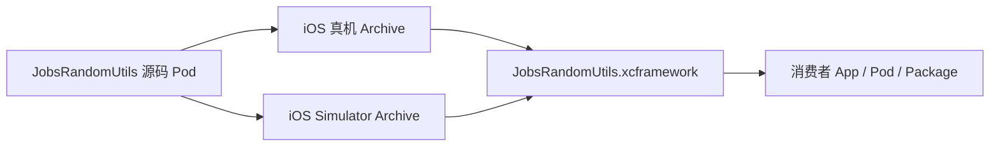

# `iOS Framework` 与 `XCFramework` 打包指南（Objective-C 本地 Pod）


[toc]

---

## 🔥 <font id=前言>前言</font>

> 本文以 `JobsOCBaseConfigDemo@ByPods` 的 Jobs 自建本地 Pod `JobsRandomUtils` 为最小样板，演示怎样把一份已经通过 [**CocoaPods**](https://cocoapods.org/) 管理的 [**Objective-C**](https://developer.apple.com/library/archive/documentation/Cocoa/Conceptual/ProgrammingWithObjectiveC/Introduction/Introduction.html) 源码模块继续下沉为二进制 `XCFramework`。

- `JobsRandomUtils` 只有一组 `JobsRandomUtils.h/.m`，没有其它 Pod 依赖，也没有资源，适合先验证公开头、模块、真机切片、模拟器切片和消费者导入。
- 当前示范不修改 `JobsRandomUtils` 源码、聚合头、podspec、`Podfile` 或 Pods 工程，只消费 workspace 中已经存在的 `JobsRandomUtils` Scheme。
- Apple 推荐使用[**多平台二进制 Framework Bundle**](https://developer.apple.com/documentation/xcode/creating-a-multi-platform-binary-framework-bundle)管理不同平台变体，不使用 `lipo` 把 iOS 真机和 iOS Simulator 混成一份旧式胖 Framework。

## 一、Framework、XCFramework 与链接方式 <a href="#前言" style="font-size:17px; color:green;"><b>🔼</b></a> <a href="#🔚" style="font-size:17px; color:green;"><b>🔽</b></a>

### 1.1、Framework 只代表一个平台变体

同名的 `JobsRandomUtils.framework` 可以分别来自：

- iOS 真机 Archive。
- iOS Simulator Archive。

它们的模块名相同，但二进制目标平台不同，不能互换。

### 1.2、XCFramework 负责选对变体



`.xcframework` 是变体容器，不改变内部二进制原本的静态或动态链接方式。

### 1.3、当前 Demo 是静态 Framework

当前 OC 新工程使用 `use_frameworks! :linkage => :static`：

| 项目 | 当前示范 |
| --- | --- |
| 外层形式 | `JobsRandomUtils.framework` |
| 二进制类型 | `staticlib` |
| 最终容器 | `JobsRandomUtils.xcframework` |
| App 接入 | 链接，通常选择 `Do Not Embed` |
| 公开接口 | `Headers` + `Modules/module.modulemap` |

如果需要动态 Framework，应新建或调整独立 Framework target，并重新核对 Embed、签名、启动装载、依赖、资源与最低系统版本。

## 二、什么模块适合二进制下沉 <a href="#前言" style="font-size:17px; color:green;"><b>🔼</b></a> <a href="#🔚" style="font-size:17px; color:green;"><b>🔽</b></a>

适合：

- 公开 API 已稳定，职责单一，能独立编译。
- 需要闭源交付或跨多个 App 复用。
- 依赖图明确，没有循环依赖。
- 资源已经独立成 Bundle，不依赖 `NSBundle.mainBundle` 猜宿主路径。
- 公开头没有泄漏 `Support` 私有头、宿主业务类型和无法交付的第三方类型。

暂不适合：

- API 和目录仍频繁调整。
- 依赖很多，且只在当前宿主靠 PCH、Header Search Paths 或间接 Pod 偶然编过。
- Category 依赖 `-ObjC`，但二进制 podspec 与消费者链接参数尚未声明。
- 资源、隐私清单、本地化或许可证没有独立交付方案。

## 三、最小 Demo 基线 <a href="#前言" style="font-size:17px; color:green;"><b>🔼</b></a> <a href="#🔚" style="font-size:17px; color:green;"><b>🔽</b></a>

### 3.1、样板模块

| 项目 | 内容 |
| --- | --- |
| workspace | `JobsOCBaseConfigDemo.xcworkspace` |
| Scheme | `JobsRandomUtils` |
| Product | `JobsRandomUtils.framework` |
| 聚合头 | `JobsRandomUtilsHeader.h` |
| Core | `Core/JobsRandomUtils/JobsRandomUtils.h/.m` |
| Pod 依赖 | 无 |
| 系统 Framework | `Foundation`、`UIKit` |
| 链接形态 | 静态 Framework |

### 3.2、Demo 目录

```text
iOS Framework 与 XCFramework 打包指南.md/
├── README.md
└── Demo/
    ├── JobsRandomUtilsConsumerDemo.h
    ├── JobsRandomUtilsConsumerDemo.m
    └── 【MacOS】📦生成JobsRandomUtils.xcframework.command
```

- 打包脚本负责双平台 Archive、创建 XCFramework、结构检查、消费者 Clang 检查、ZIP 与 SHA-256。
- 消费者 Demo 通过公开聚合头调用 `JobsRandomNumber(1, 10)`，不穿透 `Support` 或 Pods 私有路径。

## 四、一条命令生成 XCFramework <a href="#前言" style="font-size:17px; color:green;"><b>🔼</b></a> <a href="#🔚" style="font-size:17px; color:green;"><b>🔽</b></a>

### 4.1、确认 Scheme

```shell
cd "/Users/jobs/Documents/Github/JobsOCBaseConfigDemo@ByPods"
xcodebuild -workspace JobsOCBaseConfigDemo.xcworkspace -list | rg "JobsRandomUtils"
```

### 4.2、执行 Demo

```shell
zsh "OCDoc.md/iOS Framework 与 XCFramework 打包指南.md/Demo/【MacOS】📦生成JobsRandomUtils.xcframework.command"
```

脚本会先展示内置自述。按回车后才开始构建，并写入 `.gitignore` 已排除的 `build/XCFrameworkDemo`。

如果需要指定输出目录：

```shell
zsh "OCDoc.md/iOS Framework 与 XCFramework 打包指南.md/Demo/【MacOS】📦生成JobsRandomUtils.xcframework.command" \
  "/目标输出目录"
```

### 4.3、输出结构

```text
build/XCFrameworkDemo/JobsRandomUtils/时间戳/
├── Archives/
│   ├── JobsRandomUtils-iOS.xcarchive
│   └── JobsRandomUtils-iOS-Simulator.xcarchive
├── JobsRandomUtils.xcframework
├── JobsRandomUtils.xcframework.zip
└── JobsRandomUtils.xcframework.zip.sha256
```

## 五、核心命令拆解 <a href="#前言" style="font-size:17px; color:green;"><b>🔼</b></a> <a href="#🔚" style="font-size:17px; color:green;"><b>🔽</b></a>

### 5.1、iOS 真机 Archive

```shell
xcodebuild archive \
  -workspace JobsOCBaseConfigDemo.xcworkspace \
  -scheme JobsRandomUtils \
  -configuration Release \
  -destination "generic/platform=iOS" \
  -archivePath "JobsRandomUtils-iOS.xcarchive" \
  SKIP_INSTALL=NO \
  BUILD_LIBRARY_FOR_DISTRIBUTION=YES \
  CODE_SIGNING_ALLOWED=NO \
  ONLY_ACTIVE_ARCH=NO
```

### 5.2、iOS Simulator Archive

```shell
xcodebuild archive \
  -workspace JobsOCBaseConfigDemo.xcworkspace \
  -scheme JobsRandomUtils \
  -configuration Release \
  -destination "generic/platform=iOS Simulator" \
  -archivePath "JobsRandomUtils-iOS-Simulator.xcarchive" \
  SKIP_INSTALL=NO \
  BUILD_LIBRARY_FOR_DISTRIBUTION=YES \
  CODE_SIGNING_ALLOWED=NO \
  ONLY_ACTIVE_ARCH=NO
```

### 5.3、组合变体

```shell
xcodebuild -create-xcframework \
  -archive "JobsRandomUtils-iOS.xcarchive" \
  -framework "JobsRandomUtils.framework" \
  -archive "JobsRandomUtils-iOS-Simulator.xcarchive" \
  -framework "JobsRandomUtils.framework" \
  -output "JobsRandomUtils.xcframework"
```

| 设置 | 作用 |
| --- | --- |
| `SKIP_INSTALL=NO` | 把 Framework 放进 Archive 的 `Products/Library/Frameworks`。 |
| `BUILD_LIBRARY_FOR_DISTRIBUTION=YES` | 统一使用分发构建语义；对纯 OC 没有 Swift module stability 的额外收益，但便于同一脚本扩展到混编模块。 |
| `CODE_SIGNING_ALLOWED=NO` | 样板归档不占用宿主 App 签名环境。 |
| `ONLY_ACTIVE_ARCH=NO` | 不把产物限制为当前活动架构。 |
| `generic/platform=...` | 由 Xcode 根据目标平台选择架构。 |

## 六、公开头和模块边界 <a href="#前言" style="font-size:17px; color:green;"><b>🔼</b></a> <a href="#🔚" style="font-size:17px; color:green;"><b>🔽</b></a>

消费者只通过统一公开入口引用：

```objc
#if __has_include(<JobsRandomUtils/JobsRandomUtilsHeader.h>)
#import <JobsRandomUtils/JobsRandomUtilsHeader.h>
#else
#import "JobsRandomUtilsHeader.h"
#endif
```

```objc
int value = JobsRandomNumber(1, 10);
```

打包前检查：

- `JobsRandomUtilsHeader.h` 能完整导出消费者需要的 Core 公开头。
- `Headers` 中没有把 `Support` 私有实现意外公开。
- 公开头里的系统类型、其它模块类型和宏都有真实直接依赖。
- `Modules/module.modulemap` 的模块名与消费者 `import` / `@import` 一致。
- Category 型模块如果需要被静态链接器完整加载，在二进制 podspec 中明确维护 `-ObjC`，不要让每个消费者口口相传。

## 七、消费者接入方式 <a href="#前言" style="font-size:17px; color:green;"><b>🔼</b></a> <a href="#🔚" style="font-size:17px; color:green;"><b>🔽</b></a>

### 7.1、手工接入

1. 把 `JobsRandomUtils.xcframework` 拖入消费者工程。
2. 在 App target 中确认已链接。
3. 当前是静态 Framework，选择 `Do Not Embed`。
4. 通过公开聚合头调用，不添加指向源码 Pod 的 Header Search Paths。

### 7.2、二进制 CocoaPods

```ruby
Pod::Spec.new do |spec|
  spec.name             = 'JobsRandomUtilsBinary'
  spec.version          = '1.0.0'
  spec.summary          = 'Binary distribution for JobsRandomUtils.'
  spec.platform         = :ios, '16.6'
  spec.source           = { :http => 'https://example.com/JobsRandomUtils.xcframework.zip' }
  spec.vendored_frameworks = 'JobsRandomUtils.xcframework'
end
```

源码 Pod 与二进制 Pod 不要同时向同一 target 提供 `JobsRandomUtils` 模块。

### 7.3、Swift Package 二进制 Target

如需让 Swift 工程消费 OC 二进制，仍可以按照 Apple 的[**二进制 Framework Swift Package 分发文档**](https://developer.apple.com/documentation/xcode/distributing-binary-frameworks-as-swift-packages)包装：

```swift
.binaryTarget(
    name: "JobsRandomUtils",
    url: "https://example.com/JobsRandomUtils.xcframework.zip",
    checksum: "这里填写 ZIP 的 Swift Package checksum"
)
```

## 八、从其它本地 Pod 继续下沉 <a href="#前言" style="font-size:17px; color:green;"><b>🔼</b></a> <a href="#🔚" style="font-size:17px; color:green;"><b>🔽</b></a>

### 8.1、先验证独立性

```shell
xcodebuild \
  -workspace JobsOCBaseConfigDemo.xcworkspace \
  -scheme 目标Pod名 \
  -configuration Release \
  -destination "generic/platform=iOS Simulator" \
  build
```

必须关注：

- Scheme 是否真实存在。
- podspec 的直接依赖和第二层以下依赖。
- 聚合头、public headers、modulemap。
- `Core` 是否引用了未公开或未交付的 `Support`。
- `-ObjC`、C++、系统 Framework 与链接库。
- Resource Bundle、隐私清单和本地化。

### 8.2、替换 Demo 常量

```shell
readonly WORKSPACE_PATH="目标.xcworkspace"
readonly SCHEME_NAME="目标Pod名"
readonly PRODUCT_NAME="目标Product名"
```

### 8.3、依赖怎么发

优先保持模块边界：每个独立 Pod 分别产出 XCFramework，再通过二进制 podspec 或 Package 声明依赖。

只有确实要交付“单包 SDK”时，才设计统一门面 Framework；内部静态库合并必须重新检查：

- 重复符号。
- Category 装载。
- modulemap 与 umbrella header。
- C / C++ / Swift 混编。
- 资源 Bundle。
- 第三方许可证与再分发授权。

## 九、资源与签名 <a href="#前言" style="font-size:17px; color:green;"><b>🔼</b></a> <a href="#🔚" style="font-size:17px; color:green;"><b>🔽</b></a>

### 9.1、资源

- `JobsRandomUtils` 当前没有资源，因此 Demo 只打代码。
- 有资源的 Pod 继续使用 `Resource` 真实目录和独立 Bundle；二进制交付时把 Bundle 与 XCFramework 一起声明。
- Framework 内部不要使用宿主 `mainBundle` 定位组件资源。
- `PrivacyInfo.xcprivacy`、字体注册、本地化和图片命名冲突都要进入消费者验收。

### 9.2、签名

- 当前静态 Framework Demo 归档时关闭代码签名，最终消费者 App 按自己的发布配置签名。
- 动态 Framework 必须正确 Embed，并由最终 App 的签名流程处理嵌入内容。
- 对外发布 XCFramework 时可以按 Apple 文档单独签名，用于证明来源和完整性；证书撤销后需要重新签名并重新发布。

## 十、验证清单 <a href="#前言" style="font-size:17px; color:green;"><b>🔼</b></a> <a href="#🔚" style="font-size:17px; color:green;"><b>🔽</b></a>

### 10.1、结构

```shell
plutil -lint JobsRandomUtils.xcframework/Info.plist
find JobsRandomUtils.xcframework -type f -name JobsRandomUtils -exec file {} \;
find JobsRandomUtils.xcframework -type f -path "*/Headers/*" -print
find JobsRandomUtils.xcframework -type f -path "*/Modules/*" -print
```

### 10.2、消费者

Demo 脚本会使用模拟器 SDK 和 `-F` 指向刚生成的 Framework 变体，对 `JobsRandomUtilsConsumerDemo.m` 执行 `clang -fsyntax-only`。这能证明公开头和模块可以被独立消费者读取。

正式发布仍应验证：

- 一个不接源码 Pod 的干净 App 可以构建。
- 模拟器运行。
- 真机安装与核心 API 调用。
- Debug / Release 都不出现重复符号或未定义符号。
- 资源、Category、`-ObjC`、本地化和隐私清单行为正确。
- ZIP、SHA-256、版本号、许可证和 dSYM 完整。

## 十一、常见错误 <a href="#前言" style="font-size:17px; color:green;"><b>🔼</b></a> <a href="#🔚" style="font-size:17px; color:green;"><b>🔽</b></a>

| 错误 | 常见原因 | 处理 |
| --- | --- | --- |
| Archive 没有 `.framework` | `SKIP_INSTALL=YES` 或 Scheme 未构建 Framework target | 使用 `SKIP_INSTALL=NO`，检查 Scheme Build 列表。 |
| `file not found` | 公开头未进入 Headers，或消费者仍依赖源码搜索路径 | 修正 podspec `public_header_files` 与聚合头。 |
| `module not found` | modulemap、模块名或 `-F` 不正确 | 检查 XCFramework `Info.plist` 和 Framework `Modules`。 |
| 模拟器链接真机文件 | 只交付了一份 iOS Framework | 同时归档 iOS 与 iOS Simulator，再创建 XCFramework。 |
| `Undefined symbols` | 系统库、Pod 依赖或 Category 链接参数缺失 | 在二进制依赖图中显式声明。 |
| `Duplicate symbols` | 源码 Pod 与二进制 Pod 同时存在，或多个包重复打入实现 | 每个模块只保留一个实现来源。 |
| `unrecognized selector` | 静态 Category 没被链接，或实现文件没有进入 Framework target | 检查 `-ObjC`、target membership 和二进制内容。 |
| 资源找不到 | 资源未进入独立 Bundle，或仍读取 `mainBundle` | 单独交付 Resource Bundle 并从模块 Bundle 定位。 |

## 十二、发布边界 <a href="#前言" style="font-size:17px; color:green;"><b>🔼</b></a> <a href="#🔚" style="font-size:17px; color:green;"><b>🔽</b></a>

- 固定 Xcode、最低 iOS、支持架构、链接方式和依赖版本。
- 每个版本保留 XCFramework、ZIP、SHA-256、许可证和 API 说明。
- 破坏公开头兼容性的变更升级主版本。
- 在干净消费者工程验证，不让宿主 PCH、Pods、搜索路径或源码副本掩盖问题。
- 二进制不是秘密保险箱，不写入密码、Token、私钥或可以完全放到服务端的安全决策。
- 第三方代码只有在许可证允许二进制再分发时才能打进交付包。

<a id="🔚" href="#前言" style="font-size:17px; color:green; font-weight:bold;">我是有底线的➤点我回到首页</a>
