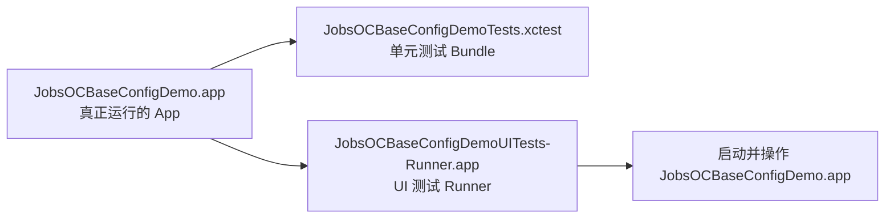

# `iOS 测试 Target 入门与使用指南`


[toc]

---

## 🔥 <font id=前言>前言</font>

哥，这份文档专门解释 [**Xcode**](https://developer.apple.com/xcode) 里的 `JobsOCBaseConfigDemoTests` 和 `JobsOCBaseConfigDemoUITests` 是什么、怎么跑、怎么写、怎么排查。

一句话先讲透：

- `JobsOCBaseConfigDemoTests` 是“单元测试 Target”，主要测代码逻辑。
- `JobsOCBaseConfigDemoUITests` 是“UI 自动化测试 Target”，主要像真人一样启动 App、点按钮、看页面。
- 它们不是 App 本体，而是挂在 App 旁边的测试工程模块。
- App 正常开发不强制写测试，但测试能帮你把“我改完感觉没问题”变成“Xcode 已经替我跑过一遍”。

## 一、它们到底是什么？ <a href="#前言" style="font-size:17px; color:green;"><b>🔼</b></a> <a href="#🔚" style="font-size:17px; color:green;"><b>🔽</b></a>

### 1.1、`JobsOCBaseConfigDemoTests`

`JobsOCBaseConfigDemoTests` 是 iOS 项目的单元测试 Target。它编译出来不是一个 App，而是一个测试 Bundle。

它适合测试这些内容：

| 适合测什么 | 例子 |
| --- | --- |
| Model 逻辑 | `JobsUserModel` 字段转换、默认值、空值兜底 |
| 工具方法 | 字符串处理、时间格式化、加密摘要、路径拼接 |
| 网络参数组装 | API 入参、签名字段、URL 拼接 |
| DSL / Category 行为 | 某个链式方法是否正确设置属性 |
| 数据解析 | JSON 转 Model 后字段是否符合预期 |

它不适合直接测试这些内容：

| 不适合测什么 | 原因 |
| --- | --- |
| 真实点击页面 | 这是 UI 测试的职责 |
| 依赖远端真实接口的完整流程 | 网络波动会让测试不稳定 |
| 必须人工登录或输入验证码的流程 | 自动化成本高，容易误判 |

### 1.2、`JobsOCBaseConfigDemoUITests`

`JobsOCBaseConfigDemoUITests` 是 UI 测试 Target。它会启动你的 App，然后通过 `XCUIApplication`、`XCUIElement` 去查找界面元素、点击、输入、断言。

它适合测试这些内容：

| 适合测什么 | 例子 |
| --- | --- |
| App 能否启动 | 启动后进程存在，不崩溃 |
| 首页关键控件是否存在 | Tab、按钮、标题、输入框 |
| 简单路径是否可走通 | 进入某个 Demo 页面，再返回 |
| 截图留档 | 首屏截图、关键页面截图 |
| 启动性能 | Xcode 的 Launch Performance |

它不适合拿来替代人工验收。UI 测试很适合守住“关键路径不崩”，但复杂视觉效果、动画手感、业务体验仍然需要人工看。

### 1.3、两个 Target 和 App Target 的关系



- 单元测试 Target 通过 `TEST_HOST` 挂到 App 上，因此能在 App 测试进程里跑。
- UI 测试 Target 自己有一个 Runner，它负责启动和操作被测 App。
- 你平时写业务代码还是写在 `JobsOCBaseConfigDemo` 或本地 Pods 里；测试代码写到这两个测试目录里。

## 二、新工程当前补齐了什么？ <a href="#前言" style="font-size:17px; color:green;"><b>🔼</b></a> <a href="#🔚" style="font-size:17px; color:green;"><b>🔽</b></a>

### 2.1、目录结构

新工程根目录现在补齐了两个测试目录：

```text
JobsOCBaseConfigDemo@ByPods
├── JobsOCBaseConfigDemo
├── JobsOCBaseConfigDemo.xcodeproj
├── JobsOCBaseConfigDemo.xcworkspace
├── JobsOCBaseConfigDemoTests
│   └── JobsOCBaseConfigDemoTests.m
├── JobsOCBaseConfigDemoUITests
│   ├── JobsOCBaseConfigDemoUITests.m
│   └── JobsOCBaseConfigDemoUITestsLaunchTests.m
└── iOS测试Target入门与使用指南.md
```

### 2.2、Xcode Target

新工程的 `JobsOCBaseConfigDemo.xcodeproj` 里补了两个 Target：

| Target | 类型 | 作用 |
| --- | --- | --- |
| `JobsOCBaseConfigDemoTests` | Unit Testing Bundle | 跑单元测试 |
| `JobsOCBaseConfigDemoUITests` | UI Testing Bundle | 跑 UI 自动化测试 |

它们和老工程保持平行命名：

```text
JobsOCBaseConfigDemo
JobsOCBaseConfigDemoTests
JobsOCBaseConfigDemoUITests
```

### 2.3、当前自带的入门用例

`JobsOCBaseConfigDemoTests.m` 里有三个入门用例：

| 方法 | 说明 |
| --- | --- |
| `testAppBundleCanBeLoaded` | 确认测试进程能拿到 `NSBundle.mainBundle` |
| `testInfoPlistBundleIdentifierReadable` | 确认能读取 Bundle Identifier |
| `testPerformanceExample` | 示例性能测试，测读取 `Info.plist` 的耗时 |

`JobsOCBaseConfigDemoUITests.m` 里有两个入门用例：

| 方法 | 说明 |
| --- | --- |
| `testAppCanLaunch` | 启动 App，并断言 App 存在 |
| `testLaunchPerformance` | 使用 Xcode 的启动性能指标 |

`JobsOCBaseConfigDemoUITestsLaunchTests.m` 里有一个截图用例：

| 方法 | 说明 |
| --- | --- |
| `testLaunch` | 启动 App 后保存一张首屏截图 |

## 三、怎么运行？ <a href="#前言" style="font-size:17px; color:green;"><b>🔼</b></a> <a href="#🔚" style="font-size:17px; color:green;"><b>🔽</b></a>

### 3.1、先打开 Workspace

这个工程用了 [**CocoaPods**](https://cocoapods.org/)，所以优先打开：

```text
JobsOCBaseConfigDemo.xcworkspace
```

不要优先打开：

```text
JobsOCBaseConfigDemo.xcodeproj
```

原因很简单：`.xcworkspace` 会同时带上 App 工程和 Pods 工程；`.xcodeproj` 只看主工程，依赖可能不完整。

### 3.2、在 Xcode 里跑全部测试

操作路径：

```text
Xcode 顶部 Scheme 选择 JobsOCBaseConfigDemo
选择一个 iPhone Simulator
按 Command + U
```

`Command + U` 会执行当前 Scheme 的 Test Action。正常情况下，它会编译 App，再跑测试。

### 3.3、只跑某一个测试文件

在 Xcode 左侧打开测试文件，找到方法左边的小菱形按钮：

```objc
-(void)testAppCanLaunch {
    XCUIApplication *app = [[XCUIApplication alloc] init];
    [app launch];
    XCTAssertTrue(app.exists, @"UI 测试必须能启动被测 App。");
}
```

点击方法左边的小菱形，只跑这一个方法。

### 3.4、只跑 Unit Test Target

操作路径：

```text
Xcode 顶部菜单
Product
Test Plan / Test
```

如果 Xcode 左侧 Test Navigator 已经显示测试列表，也可以只点 `JobsOCBaseConfigDemoTests` 下面的测试方法。

### 3.5、只跑 UI Test Target

UI 测试会真实启动模拟器里的 App。第一次跑可能慢一点，这是正常的。

操作路径：

```text
打开 Test Navigator
展开 JobsOCBaseConfigDemoUITests
点击某个测试方法左边的小菱形
```

## 四、怎么写单元测试？ <a href="#前言" style="font-size:17px; color:green;"><b>🔼</b></a> <a href="#🔚" style="font-size:17px; color:green;"><b>🔽</b></a>

### 4.1、单元测试基本结构

单元测试文件通常长这样：

```objc
#import <XCTest/XCTest.h>

@interface JobsOCBaseConfigDemoTests : XCTestCase

@end

@implementation JobsOCBaseConfigDemoTests

-(void)setUp {
    [super setUp];
}

-(void)tearDown {
    [super tearDown];
}

-(void)testExample {
    XCTAssertTrue(YES);
}

@end
```

重点只有一个：测试方法必须以 `test` 开头。

这些会被 Xcode 识别：

```objc
-(void)testUserNameCannotBeEmpty;
-(void)testURLManagerBuildsCorrectPath;
-(void)testButtonModelDefaultState;
```

这些不会被 Xcode 当成测试：

```objc
-(void)checkUserNameCannotBeEmpty;
-(void)demoURLManagerBuildsCorrectPath;
-(void)buttonModelDefaultState;
```

### 4.2、常用断言

断言就是“我期望这个结果必须成立”。不成立，测试失败。

| 断言 | 用途 |
| --- | --- |
| `XCTAssertTrue(value)` | 必须为真 |
| `XCTAssertFalse(value)` | 必须为假 |
| `XCTAssertNil(value)` | 必须为空 |
| `XCTAssertNotNil(value)` | 必须不为空 |
| `XCTAssertEqual(a, b)` | 两个基础值必须相等 |
| `XCTAssertEqualObjects(a, b)` | 两个对象必须相等 |
| `XCTAssertGreaterThan(a, b)` | `a` 必须大于 `b` |
| `XCTFail(@"原因")` | 主动标记失败 |

例子：

```objc
-(void)testStringLength {
    NSString *name = @"Jobs";
    XCTAssertEqual(name.length, 4);
    XCTAssertEqualObjects(name.uppercaseString, @"JOBS");
}
```

### 4.3、测试 Model

假设有一个 `JobsUserModel`：

```objc
-(void)testUserModelDefaultValue {
    JobsUserModel *model = JobsUserModel.alloc.init;
    XCTAssertNotNil(model);
    XCTAssertTrue(model.userName.length == 0);
}
```

如果测试文件找不到 `JobsUserModel`，通常是下面几类原因：

| 问题 | 处理 |
| --- | --- |
| 没有 import 头文件 | 在测试文件顶部 `#import "JobsUserModel.h"` |
| 文件没有暴露给测试 Target | 勾选 Target Membership，或调整工程引用 |
| 类在本地 Pod 里 | 优先 import 对应 Pod 的聚合头 |
| Pod 依赖没有刷新 | 需要重新 `pod install --no-repo-update` |

### 4.4、测试工具方法

例如测试字符串工具：

```objc
-(void)testTrimmedString {
    NSString *raw = @"  Jobs  ";
    NSString *value = [raw stringByTrimmingCharactersInSet:NSCharacterSet.whitespaceCharacterSet];
    XCTAssertEqualObjects(value, @"Jobs");
}
```

单元测试最适合从这种小函数开始。它不依赖 UI，不依赖网络，稳定、快、失败原因清楚。

### 4.5、测试异步回调

异步测试要用 `XCTestExpectation`：

```objc
-(void)testAsyncCallback {
    XCTestExpectation *expectation = [self expectationWithDescription:@"等待异步回调"];

    dispatch_after(dispatch_time(DISPATCH_TIME_NOW, (int64_t)(0.5 * NSEC_PER_SEC)), dispatch_get_main_queue(), ^{
        XCTAssertTrue(YES);
        [expectation fulfill];
    });

    [self waitForExpectationsWithTimeout:2 handler:nil];
}
```

原则：

- 超时时间不要太长，否则失败一次等半天。
- 异步任务完成后必须调用 `fulfill`。
- 如果测试网络，优先 mock 数据，不要依赖真实接口。

### 4.6、测试性能

性能测试用 `measureBlock`：

```objc
-(void)testJSONParsePerformance {
    [self measureBlock:^{
        NSDictionary *dict = @{@"name": @"Jobs"};
        XCTAssertNotNil(dict);
    }];
}
```

它会多次执行 block，然后统计耗时。适合比较某段代码修改前后的性能变化。

## 五、怎么写 UI 测试？ <a href="#前言" style="font-size:17px; color:green;"><b>🔼</b></a> <a href="#🔚" style="font-size:17px; color:green;"><b>🔽</b></a>

### 5.1、UI 测试基本结构

```objc
-(void)testAppCanLaunch {
    XCUIApplication *app = [[XCUIApplication alloc] init];
    [app launch];
    XCTAssertTrue(app.exists);
}
```

UI 测试不是直接调你的 ViewController 方法，而是通过可访问性树找界面元素。

### 5.2、给控件加 `accessibilityIdentifier`

UI 测试最怕“找不到控件”。最稳的办法是给控件设置 `accessibilityIdentifier`。

例如业务代码里：

```objc
self.loginButton.accessibilityIdentifier = @"login_button";
self.accountTextField.accessibilityIdentifier = @"account_text_field";
self.passwordTextField.accessibilityIdentifier = @"password_text_field";
```

测试代码里：

```objc
-(void)testLoginButtonExists {
    XCUIApplication *app = [[XCUIApplication alloc] init];
    [app launch];

    XCUIElement *loginButton = app.buttons[@"login_button"];
    XCTAssertTrue([loginButton waitForExistenceWithTimeout:5]);
}
```

注意：

- `accessibilityIdentifier` 是给自动化测试找控件用的。
- `accessibilityLabel` 更偏给辅助功能读屏使用。
- 写 UI 测试时，优先用 `accessibilityIdentifier`，不要靠中文文案硬找。

### 5.3、点击按钮

```objc
-(void)testTapLoginButton {
    XCUIApplication *app = [[XCUIApplication alloc] init];
    [app launch];

    XCUIElement *loginButton = app.buttons[@"login_button"];
    XCTAssertTrue([loginButton waitForExistenceWithTimeout:5]);
    [loginButton tap];
}
```

### 5.4、输入文字

```objc
-(void)testInputAccount {
    XCUIApplication *app = [[XCUIApplication alloc] init];
    [app launch];

    XCUIElement *accountTextField = app.textFields[@"account_text_field"];
    XCTAssertTrue([accountTextField waitForExistenceWithTimeout:5]);
    [accountTextField tap];
    [accountTextField typeText:@"jobs"];
}
```

如果模拟器键盘导致输入不稳定，可以在 Xcode 菜单里关闭硬件键盘连接：

```text
Simulator
I/O
Keyboard
Connect Hardware Keyboard
```

### 5.5、等待页面出现

UI 加载经常不是瞬间完成，所以不要马上断言：

```objc
XCUIElement *target = app.staticTexts[@"home_title"];
XCTAssertTrue([target waitForExistenceWithTimeout:5]);
```

比下面这种更稳定：

```objc
XCTAssertTrue(app.staticTexts[@"home_title"].exists);
```

### 5.6、截图留档

```objc
XCTAttachment *attachment = [XCTAttachment attachmentWithScreenshot:XCUIScreen.mainScreen.screenshot];
attachment.name = @"Home";
attachment.lifetime = XCTAttachmentLifetimeKeepAlways;
[self addAttachment:attachment];
```

截图适合记录首屏、关键状态、失败现场。

## 六、怎么在命令行跑？ <a href="#前言" style="font-size:17px; color:green;"><b>🔼</b></a> <a href="#🔚" style="font-size:17px; color:green;"><b>🔽</b></a>

### 6.1、列出 Scheme

在工程根目录执行：

```shell
xcodebuild \
  -workspace JobsOCBaseConfigDemo.xcworkspace \
  -list
```

### 6.2、跑全部测试

```shell
xcodebuild test \
  -workspace JobsOCBaseConfigDemo.xcworkspace \
  -scheme JobsOCBaseConfigDemo \
  -configuration Debug \
  -destination 'platform=iOS Simulator,name=iPhone 16'
```

### 6.3、只跑单元测试

```shell
xcodebuild test \
  -workspace JobsOCBaseConfigDemo.xcworkspace \
  -scheme JobsOCBaseConfigDemo \
  -configuration Debug \
  -destination 'platform=iOS Simulator,name=iPhone 16' \
  -only-testing:JobsOCBaseConfigDemoTests
```

### 6.4、只跑 UI 测试

```shell
xcodebuild test \
  -workspace JobsOCBaseConfigDemo.xcworkspace \
  -scheme JobsOCBaseConfigDemo \
  -configuration Debug \
  -destination 'platform=iOS Simulator,name=iPhone 16' \
  -only-testing:JobsOCBaseConfigDemoUITests
```

### 6.5、只跑一个测试方法

```shell
xcodebuild test \
  -workspace JobsOCBaseConfigDemo.xcworkspace \
  -scheme JobsOCBaseConfigDemo \
  -configuration Debug \
  -destination 'platform=iOS Simulator,name=iPhone 16' \
  -only-testing:JobsOCBaseConfigDemoTests/JobsOCBaseConfigDemoTests/testAppBundleCanBeLoaded
```

命令结构是：

```text
-only-testing:Target名/测试类名/测试方法名
```

## 七、怎么把现有代码变成可测试？ <a href="#前言" style="font-size:17px; color:green;"><b>🔼</b></a> <a href="#🔚" style="font-size:17px; color:green;"><b>🔽</b></a>

### 7.1、先从纯逻辑开始

新手最推荐先测这些：

| 优先级 | 内容 | 原因 |
| --- | --- | --- |
| 高 | 字符串、时间、路径、金额格式化 | 不依赖 UI，最稳定 |
| 高 | Model 默认值、JSON 映射 | 很容易写断言 |
| 中 | 网络参数组装 | 不需要真的发请求 |
| 中 | DSL 设置属性 | 能防止链式方法改坏 |
| 低 | 完整页面跳转 | UI 测试成本更高 |

### 7.2、让方法更容易测

不好测的代码通常长这样：

```objc
-(void)loadData {
    NSString *token = [NSUserDefaults.standardUserDefaults stringForKey:@"token"];
    [self.api requestWithToken:token completion:^(id data) {
        self.titleLabel.text = data[@"title"];
    }];
}
```

问题是：读缓存、发网络、改 UI 混在一起。

更容易测的做法是把纯逻辑拆出来：

```objc
-(NSString *)titleFromResponse:(NSDictionary *)response {
    NSString *title = response[@"title"];
    return title.length ? title : @"";
}
```

测试就很简单：

```objc
-(void)testTitleFromResponse {
    NSDictionary *response = @{@"title": @"Jobs"};
    NSString *title = [self.demo titleFromResponse:response];
    XCTAssertEqualObjects(title, @"Jobs");
}
```

### 7.3、测试本地 Pod 代码

新工程是本地 Pods 形态，测试时要注意边界：

- 如果测主工程代码，测试文件可以引用主工程公开头。
- 如果测某个 Pod 的公开能力，优先 import 这个 Pod 的聚合头。
- 不要为了测试直接 import Pod 内部 `Support` 私有文件。
- 如果确实要测 Pod 内部实现，优先考虑给这个 Pod 单独建测试，或者把能力提升为公开 API。

## 八、常见问题 <a href="#前言" style="font-size:17px; color:green;"><b>🔼</b></a> <a href="#🔚" style="font-size:17px; color:green;"><b>🔽</b></a>

### 8.1、为什么我按 `Command + U` 没反应？

检查这几个点：

| 检查项 | 说明 |
| --- | --- |
| Scheme 是否是 `JobsOCBaseConfigDemo` | 不要选到 Pods 的 Scheme |
| 运行目标是否是 Simulator | UI 测试通常先用模拟器 |
| 测试方法是否以 `test` 开头 | 不以 `test` 开头不会被发现 |
| 文件是否加入测试 Target | 看右侧 Target Membership |

### 8.2、为什么测试文件 import 不到业务类？

常见原因：

- 头文件没有暴露。
- 测试 Target 没有依赖 App Target。
- 被测代码在 Pod 里，但没有 import 聚合头。
- `pod install` 后工程引用还没刷新。

建议顺序：

```text
先确认业务代码能正常编译
再确认测试文件 import 路径
再确认 Target Membership
最后再看 Pod 依赖
```

### 8.3、为什么 UI 测试找不到按钮？

优先检查控件是否设置了 `accessibilityIdentifier`。

业务代码：

```objc
button.accessibilityIdentifier = @"submit_button";
```

测试代码：

```objc
XCUIElement *button = app.buttons[@"submit_button"];
XCTAssertTrue([button waitForExistenceWithTimeout:5]);
```

如果按钮在滚动列表里，还要先滚动到它可见。

### 8.4、为什么 UI 测试有时候成功、有时候失败？

这叫不稳定测试，常见原因：

| 原因 | 处理 |
| --- | --- |
| 页面还没加载完就断言 | 使用 `waitForExistenceWithTimeout:` |
| 依赖真实网络 | mock 数据或预置状态 |
| 依赖上一次 App 状态 | `setUp` 里清理状态或设置启动参数 |
| 动画未结束 | 等待目标元素出现，不要固定 sleep |

### 8.5、什么时候应该删测试？

不是所有测试都值得留。

可以删：

- 只测试系统 API 的测试。
- 经常误报、但没人维护的测试。
- 和真实业务无关的临时代码。

不要轻易删：

- 线上出过 bug 后补的回归测试。
- 核心工具、核心 Model、核心流程测试。
- 能稳定复现崩溃或边界问题的测试。

## 九、建议使用路线 <a href="#前言" style="font-size:17px; color:green;"><b>🔼</b></a> <a href="#🔚" style="font-size:17px; color:green;"><b>🔽</b></a>

### 9.1、第一阶段：会跑

目标：

- 能打开 `JobsOCBaseConfigDemo.xcworkspace`。
- 能按 `Command + U`。
- 能看懂绿色成功、红色失败。
- 能单独跑某一个测试方法。

### 9.2、第二阶段：会写

目标：

- 能写一个 `test` 开头的方法。
- 能用 `XCTAssertTrue`、`XCTAssertEqualObjects`。
- 能测试一个纯逻辑方法。
- 能看懂失败信息。

### 9.3、第三阶段：会测业务

目标：

- 给关键按钮加 `accessibilityIdentifier`。
- 写一个 UI 测试启动 App。
- 写一个简单点击路径。
- 给线上 bug 补一个回归测试。

### 9.4、第四阶段：接入日常开发

建议：

- 每次修 bug，尽量补一个对应测试。
- 改公共工具、Model、DSL 时，优先补单元测试。
- 改首页、登录、核心入口时，补 UI 冒烟测试。
- 不追求一口气全覆盖，先守住最容易出问题的路径。

## 十、最小可复制模板 <a href="#前言" style="font-size:17px; color:green;"><b>🔼</b></a> <a href="#🔚" style="font-size:17px; color:green;"><b>🔽</b></a>

### 10.1、单元测试模板

```objc
-(void)testSomething {
    id value = nil;
    XCTAssertNil(value);
}
```

### 10.2、UI 测试模板

```objc
-(void)testSomethingOnScreen {
    XCUIApplication *app = [[XCUIApplication alloc] init];
    [app launch];

    XCUIElement *element = app.buttons[@"button_identifier"];
    XCTAssertTrue([element waitForExistenceWithTimeout:5]);
    [element tap];
}
```

### 10.3、异步测试模板

```objc
-(void)testAsyncSomething {
    XCTestExpectation *expectation = [self expectationWithDescription:@"等待异步任务完成"];

    dispatch_after(dispatch_time(DISPATCH_TIME_NOW, (int64_t)(0.5 * NSEC_PER_SEC)), dispatch_get_main_queue(), ^{
        XCTAssertTrue(YES);
        [expectation fulfill];
    });

    [self waitForExpectationsWithTimeout:2 handler:nil];
}
```

## 十一、风险说明 <a href="#前言" style="font-size:17px; color:green;"><b>🔼</b></a> <a href="#🔚" style="font-size:17px; color:green;"><b>🔽</b></a>

### 11.1、测试代码也会参与编译

测试 Target 里的代码虽然不会进正式 App 包，但它会参与测试编译。测试代码写错，`Command + U` 一样会失败。

### 11.2、UI 测试会启动 App

UI 测试可能触发真实页面逻辑。不要在 UI 测试里随便点支付、提交、删除、发短信这类有副作用的按钮。

### 11.3、命令行测试可能很慢

第一次跑 `xcodebuild test` 可能要编译 App、Pods、测试 Bundle，还要启动模拟器。慢不代表错，失败日志才是关键。

### 11.4、本次未主动跑完整编译

`xcodebuild`、`pod install` 属于本机重型命令。本次只补测试 Target、测试文件和文档，不主动触发完整编译。需要最终确认时，再手动或按需执行：

```shell
xcodebuild test \
  -workspace JobsOCBaseConfigDemo.xcworkspace \
  -scheme JobsOCBaseConfigDemo \
  -configuration Debug \
  -destination 'platform=iOS Simulator,name=iPhone 16'
```

<a id="🔚" href="#前言" style="font-size:17px; color:green; font-weight:bold;">我是有底线的➤点我回到首页</a>
