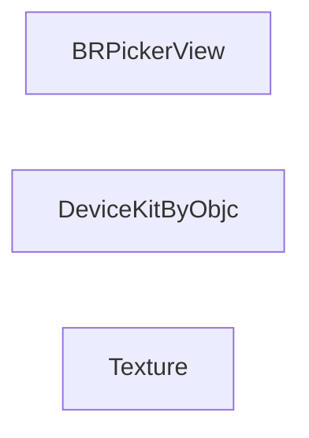
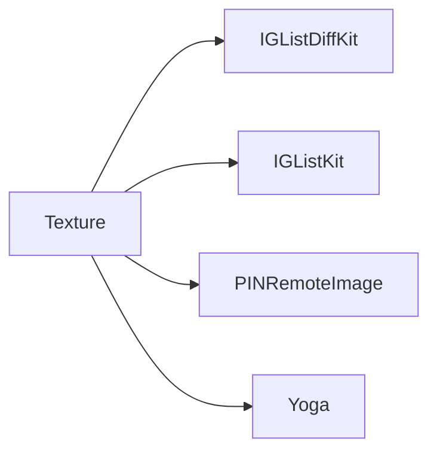

# Podspec 依赖分析报告

[toc]

## 🔥 前言 <a href="#前言" style="font-size:17px; color:green;"><b>🔼</b></a> <a href="#🔚" style="font-size:17px; color:green;"><b>🔽</b></a>

- 此文件由脚本自动运行分析得出
- 分析目录：`/Users/jobs/Documents/Github/JobsBaseConfig/JobsBaseConfig@JobsOCBaseConfigDemo`
- 生成时间：`2026-06-27 21:37:51`
- Podspec 数量：`3`
- 0 下游依赖 Pod 数量：`2`
- 全部依赖边数量：`4`
- 仓库内 Pod 依赖边数量：`0`
- Pod 间循环依赖数量：`0`
- 已过滤同 Pod 内部 subspec 依赖数量：`14`
- 外部依赖来源注释文件数量：`41`
- 已识别外部依赖来源链接数量：`75`
- DSL 执行式解析 Podspec 数量：`3`
- 静态兜底解析 Podspec 数量：`0`

> 更易读的动态关系图见：`PodspecDependencies_interactive.html`，其中默认保留 2D 关系图，并新增可拖动旋转的 3D 空间图。

## 一、总览 <a href="#前言" style="font-size:17px; color:green;"><b>🔼</b></a> <a href="#🔚" style="font-size:17px; color:green;"><b>🔽</b></a>

| Pod | Podspec | 下游依赖数量 | 下游依赖 | 上游依赖数量 | 上游依赖方 |
|---|---|---:|---|---:|---|
| [**BRPickerView**](#BRPickerView) | `JobsByPods/ManualByOCPods@Pods/BRPickerView/BRPickerView.podspec` | 0 |  | 0 |  |
| [**DeviceKitByObjc**](#DeviceKitByObjc) | `JobsByPods/ManualByOCPods@Pods/DeviceKitByObjc/DeviceKitByObjc.podspec` | 0 |  | 0 |  |
| [**Texture**](#Texture) | `JobsByPods/ManualByOCPods@Pods/Texture/Texture.podspec` | 4 | IGListDiffKit, IGListKit, PINRemoteImage, Yoga | 0 |  |

## 二、0 下游依赖 Pod <a href="#前言" style="font-size:17px; color:green;"><b>🔼</b></a> <a href="#🔚" style="font-size:17px; color:green;"><b>🔽</b></a>

| Pod | Podspec |
|---|---|
| [**BRPickerView**](#BRPickerView) | `JobsByPods/ManualByOCPods@Pods/BRPickerView/BRPickerView.podspec` |
| [**DeviceKitByObjc**](#DeviceKitByObjc) | `JobsByPods/ManualByOCPods@Pods/DeviceKitByObjc/DeviceKitByObjc.podspec` |

## 三、已过滤的同 Pod 内部 subspec 依赖 <a href="#前言" style="font-size:17px; color:green;"><b>🔼</b></a> <a href="#🔚" style="font-size:17px; color:green;"><b>🔽</b></a>

这些依赖只表达同一个 Pod 内部 subspec 的包含关系，不参与 Pod 与 Pod 之间的循环依赖判断。

| Pod | 声明位置 | 内部依赖 | 行号 |
|---|---|---|---:|
| [**BRPickerView**](#BRPickerView) | `BRPickerView/Support` | `BRPickerView/Core` | `140` |
| [**BRPickerView**](#BRPickerView) | `BRPickerView/Support/BRModel` | `BRPickerView/Core` | `140` |
| [**BRPickerView**](#BRPickerView) | `BRPickerView/Support/BRModel/BRStringPickerViewModel` | `BRPickerView/Core` | `140` |
| [**BRPickerView**](#BRPickerView) | `BRPickerView/Support/BRModel/BRTextModel` | `BRPickerView/Core` | `140` |
| [**BRPickerView**](#BRPickerView) | `BRPickerView/Support/UIKit` | `BRPickerView/Core` | `140` |
| [**BRPickerView**](#BRPickerView) | `BRPickerView/Support/UIKit/NSArray` | `BRPickerView/Core` | `140` |
| [**Texture**](#Texture) | `Texture/AssetsLibrary` | `Texture/Core` | `109` |
| [**Texture**](#Texture) | `Texture/IGListKit` | `Texture/Core` | `62` |
| [**Texture**](#Texture) | `Texture/MapKit` | `Texture/Core` | `93` |
| [**Texture**](#Texture) | `Texture/PINRemoteImage` | `Texture/Core` | `54` |
| [**Texture**](#Texture) | `Texture/Photos` | `Texture/Core` | `101` |
| [**Texture**](#Texture) | `Texture/TextNode2` | `Texture/Core` | `77` |
| [**Texture**](#Texture) | `Texture/Video` | `Texture/Core` | `85` |
| [**Texture**](#Texture) | `Texture/Yoga` | `Texture/Core` | `69` |

## 四、Pod 间循环依赖检测 <a href="#前言" style="font-size:17px; color:green;"><b>🔼</b></a> <a href="#🔚" style="font-size:17px; color:green;"><b>🔽</b></a>

> 未发现仓库内 Pod 间循环依赖。

## 五、仓库内 Pod 相互依赖图 Mermaid <a href="#前言" style="font-size:17px; color:green;"><b>🔼</b></a> <a href="#🔚" style="font-size:17px; color:green;"><b>🔽</b></a>

只展示依赖目标也在本次扫描到的 `.podspec` 里存在的关系；同 Pod 内部 subspec 依赖已过滤，不计入 Pod 级依赖/循环分析；跨 Pod subspec 依赖显示为主 Pod 名；仓库内 Pod 匹配只采用精确名称，避免把 MJRefresh 误判为 MJRefreshExtra。

## 六、全部依赖图 Mermaid <a href="#前言" style="font-size:17px; color:green;"><b>🔼</b></a> <a href="#🔚" style="font-size:17px; color:green;"><b>🔽</b></a>

## 七、外部依赖引用关系 <a href="#前言" style="font-size:17px; color:green;"><b>🔼</b></a> <a href="#🔚" style="font-size:17px; color:green;"><b>🔽</b></a>

这里统计本次扫描到的 `.podspec` 对外部 Pod 的引用；同 Pod 内部 subspec 依赖已过滤；跨 Pod subspec 依赖显示为主 Pod 名；仓库内 Pod 匹配只采用精确名称，避免把 MJRefresh 误判为 MJRefreshExtra。外部来源链接匹配规则已放宽为：完全匹配 → base 名匹配 → 字符串包含匹配。

| 外部依赖 | 被引用数量 | 引用方 | 引用声明 |
|---|---:|---|---|
| IGListDiffKit | 1 | [**Texture**](#Texture) | IGListDiffKit |
| IGListKit | 1 | [**Texture**](#Texture) | IGListKit |
| PINRemoteImage | 1 | [**Texture**](#Texture) | PINRemoteImage |
| Yoga | 1 | [**Texture**](#Texture) | Yoga |

## 八、明细 <a href="#前言" style="font-size:17px; color:green;"><b>🔼</b></a> <a href="#🔚" style="font-size:17px; color:green;"><b>🔽</b></a>

### 1、BRPickerView <a href="#前言" style="font-size:17px; color:green;"><b>🔼</b></a> <a href="#🔚" style="font-size:17px; color:green;"><b>🔽</b></a>

Podspec：`JobsByPods/ManualByOCPods@Pods/BRPickerView/BRPickerView.podspec`

### 2、DeviceKitByObjc <a href="#前言" style="font-size:17px; color:green;"><b>🔼</b></a> <a href="#🔚" style="font-size:17px; color:green;"><b>🔽</b></a>

Podspec：`JobsByPods/ManualByOCPods@Pods/DeviceKitByObjc/DeviceKitByObjc.podspec`

### 3、Texture <a href="#前言" style="font-size:17px; color:green;"><b>🔼</b></a> <a href="#🔚" style="font-size:17px; color:green;"><b>🔽</b></a>

Podspec：`JobsByPods/ManualByOCPods@Pods/Texture/Texture.podspec`

- **下游依赖**

  - **IGListDiffKit**
  - **IGListKit**
  - **PINRemoteImage**
  - **Yoga**

## 九、生成的文件 <a href="#前言" style="font-size:17px; color:green;"><b>🔼</b></a> <a href="#🔚" style="font-size:17px; color:green;"><b>🔽</b></a>

- `PodspecDependencies_interactive.html`：可搜索、可拖拽、可缩放动态图，内置 `2D 关系图` / `3D 空间图` 切换
- `PodspecDependencies.md`：本报告
- `PodspecDependencies_all.mmd`：全部依赖 Mermaid 图源码
- `PodspecDependencies_internal.mmd`：仓库内 Pod 相互依赖 Mermaid 图源码
- `PodspecDependencies_all.dot`：全部依赖 Graphviz DOT 源码
- `PodspecDependencies_internal.dot`：仓库内 Pod 相互依赖 Graphviz DOT 源码

<a id="🔚" href="#前言" style="font-size:17px; color:green; font-weight:bold;">我是有底线的➤点我回到首页</a>
