# **iOS@OC**<font color=red>靶场项目</font>蓝皮书📘

<p align="left">
  <a></a>
  <a></a>
  <a></a>
  <a></a>
  <a></a>
  <a></a>
  <a href="https://github.com/JobsKits/JobsOCBaseConfigDemo/stargazers"></a>
  <a href="https://github.com/JobsKits/JobsOCBaseConfigDemo/network"></a>
  <a href="https://github.com/JobsKits/JobsOCBaseConfigDemo/watchers"></a>
  <a href="https://github.com/JobsKits/JobsOCBaseConfigDemo"></a>
  <a></a>
  <a></a>
  <a></a>
  <a></a>
  <a></a>
  <a></a>
</p>


[toc]

## 🔥 <font id=前言>前言</font>

> 当前总行数：12111 行

* 🔧**工欲善其事必先利其器**

* 🌋 **站在巨人的肩膀上，才能看得更远**

* ✝️ **面向信仰编程**

* 🔔 **温馨提示**：本文较长，直接访问[**Github**](https://github.com/)无法完整阅读全文

  * 推荐⏬下载到本地以便完整阅读。推荐阅读器 ➤ [**Typora**](https://typora.io/)

  * 或者[**Google chrome浏览器**](https://www.google.com/intl/zh-CN/chrome/) 安装`Markdown Preview Plus`插件并启用

    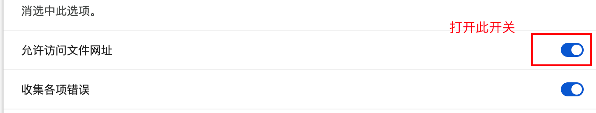
* [**➤点我查看运行效果**](https://appetize.io/app/b_7rdsqsdu5p5yimmziwrpst24si)

## 一、🎯项目白皮书 <a href="#前言" style="font-size:17px; color:green;"><b>🔼</b></a> <a href="#🔚" style="font-size:17px; color:green;"><b>🔽</b></a>

>程序员是一个高消耗的职业，除了日常基本的业务开发以外，新事物的不断涌现也需要持续性的学习，所以是一件非常消耗精力的事；而且由于长期的高压、高情绪、熬夜，**会打乱人体内正常的内分泌节奏**，大概率也会逐渐的引发各种职业疾病。业内普遍认为程序员的**黄金年龄在25～35周岁**。那么，还是希望，在我们（亦或者是暂时性的）离开这个行业的时候，一定要为自己或者后人，留下点什么，算是这么多年的一个工作总结。此外，能最大化的辅助人，帮助其在极短的时间内去：<u>回忆/上手/学习/实验</u>这个编程语言下的工程项目。所以，此项目就一定是要结合商业需求去务实拓展，解决当前痛点。

* 品控标准（只能严格的保证编译器正常，而不能完全保证运行时的不出错）
  * 一定要保证这个工程的成功编译通过，方便以后项目直接进行引用，乃至开新版本
  * <font color=blue>**示例Demo可能因为相关Api的升级，没有及时的覆盖处理，可能会出现闪退。修复即可**</font>
* 自此以后，所有新开的项目都可以根据这个**根项目**来进行统一的调配和使用
  * 将它作为所有项目的母版和基类，最大限度的做到全局的统一
  * 日积月累的记录一些平时生产生活中萌发的一些优秀的想法、灵光一现的创意。包括但不仅限于：<u>语法糖的封装</u>、<u>方法的调用</u>，<u>第三方的选用</u>、以及一些心得体会
* 作为某些代码**实践靶场**，在实际开发过程中，是非常有必要的
  * 为我们快速且稳定的复现一些业务场景，作为代码实验室🧪，而搭建的一个平台
* 作为代码笔记，记录一些常用的代码，方便查阅
  * 主要形式是可以运行的代码 + 文字性叙述 + 图文混编讲解
  * 作为学习的资料，可以快速了解到一些常用的知识，大幅**降低学习成本**
  * 作为其他项目的参考，可以快速的了解到项目的架构，代码规范，以及一些设计模式
  * 这么一些优秀的成果，其来源不仅仅是来自于作者本身的持续付出与积累。更是这个领域大家庭中各路优秀作者的智慧结晶

## 二、🌈特色一览 <a href="#前言" style="font-size:17px; color:green;"><b>🔼</b></a> <a href="#🔚" style="font-size:17px; color:green;"><b>🔽</b></a>

> **工程形态**：本工程将 Jobs 自维护能力直接集成于主工程目录管理，由既有源码、资源、聚合头、Build Phases 与 target 引用共同承载；功能按稳定职责分区，不额外拆成本地 Pod。

本节只回答“项目最值得复用什么”。具体原理、完整参数和边界说明继续以对应源码、模块 `README.md` 与可运行 Demo 为准。

### 2.1、统一工程基座

| 特色 | 精炼说明 |
| --- | --- |
| `JobsMakes` | 用 `jobsMakeXxx` 统一创建系统对象、集合、菜单、图片与常用配置对象。 |
| `JobsOCDSL` / `JobsModelDSL` | 系统 API 与 Jobs Model 都收口为 `byXxx(...)` 点语法；按“当前类型 → 父类 → 装配 → 布局”一链到底。 |
| `JobsBlock` | Block typedef 按返回值和参数签名集中管理；Jobs 功能方法的 0 / 1 入参 API 统一以 Block 表达，属性 / 协议等固定 selector 保留原 ABI 与 `jobsXxx` 门面，trampoline 非虚调用地绑定当前类 IMP；析构与 nullable 接收者按运行时安全边界守卫。 |
| `JobsOCDefs` / `JobsOCProtocols` | 统一属性宏、字体、颜色、枚举、通知、单例、国际化和公共协议簇。 |
| `JobsModel` | `UIViewModel`、`UITextModel`、`UIButtonModel` 等模型统一承载数据、外观、事件和页面传参。 |
| `JobsByOCPods` / `JobsBaseUI` | 聚合 UIKit 基座、公共分类、复用 Cell、按钮兼容管线和通用 UI 组件。 |
| `UIButton+UIControlState` | 直接集成于主工程；除常用单状态入口外，`imageForStateBy`、`backgroundImageForStateBy` 与 `titleColorForStateBy` 接受任意 `UIControlState` 及组合态。 |
| [**Masonry**](https://github.com/SnapKit/Masonry) | Jobs 自维护 UI 统一使用 Masonry；首次约束、常量更新、结构重建分别使用 make / update / remake；移出父视图使用 `UIView.byRemove()`，清空约束使用 `byClearConstraints()`。 |
| 新旧系统兼容 | `UIButtonConfiguration`、导航栏外观、媒体、权限与 deprecated API 的版本差异在 Jobs 封装内部消化。 |

Jobs 自维护的应用、Demo 与主工程集成功能统一执行同一套 [**Objective-C**](https://developer.apple.com/library/archive/documentation/Cocoa/Conceptual/ProgrammingWithObjectiveC/Introduction/Introduction.html) 表达：0 / 1 入参功能方法返回显式 `_Nonnull` Block，typedef 集中在 `JobsBlock`；对象属性写入先补到真实宿主 DSL，再从创建到子模型、装配和终止动作保持一条点语法链。`JobsDefines.h` 双通道只进入头文件，固定 ABI 才保留传统 selector trampoline；验收同时要求模拟器编译和冷启动通过。

### 2.2、最小 UI Demo

下面一个懒加载 getter 同时展示创建、按钮专用兼容配置、Block 事件、加入父视图和 Masonry 布局：

```objc
-(UIButton *)submitBtn{
    if (!_submitBtn) {
        _submitBtn = jobsMakeButton(^(__kindof UIButton * _Nullable button) {
            button
                .jobsResetBtnTitle(@"确认")
                .jobsResetBtnTitleCor(JobsWhiteColor)
                .jobsResetBtnTitleFont(UIFontWeightBoldSize(16))
                .jobsResetBtnBgCor(JobsSystemBlueColor)
                .jobsResetBtnCornerRadiusValue(JobsWidth(10))
                .onClickBy(^(__kindof UIButton * _Nullable sender) {
                    sender.byToggleSelected();
                })
                .addOn(self.view)
                .byAdd(^(MASConstraintMaker *make) {
                    make.center.equalTo(self.view);
                    make.size.mas_equalTo(CGSizeMake(JobsWidth(160), JobsWidth(44)));
                });
        });
    };return _submitBtn;
}
```

### 2.3、重点特色矩阵

| 能力域 | 代表模块 | 特色摘要 |
| --- | --- | --- |
| 登录注册 | `JobsAppDoor` | Style1 侧栏变形与 Style2 全屏横滑两套认证 UI；统一登录、注册、忘记密码、短信 / 图形验证码和资源包。 |
| 开屏 | `JobsOCSplash` | 本地图片、本地 GIF、远程图片、本地视频、远程视频五种内容；远程视频仅播放完整缓存，未命中时立即回退本地视频并持续预加载。 |
| 刷新与动画 | `JobsOCRefresher` + `JobsFuseAnimation` | 上下左右四向刷新、统一状态机、触感 / 声音；系统、图片、GIF、Lottie、今日头条、抖音动画可在挂载后原位热替换。 |
| 表格与长文字 | `JobsOCExcel` + `JobsOCUILabelScrolling` | Office 式冻结 `0...N` 列；单元格支持缩放、单行省略、多行省略和 CoreText 完整滚动。 |
| 截屏 | `JobsScreenCapture` | 主动渲染并保存相册、系统截屏观察、敏感区域截图保护三条能力独立组合。 |
| 音视频与硬件 | `JobsOCAudioRecorder`、`JobsOCVideoRecorder`、`JobsBluetooth`、`JobsBioKit` | 录音与本地音频管理、视频录制、多设备 BLE 扫描 / 连接 / 读写 / Mock、生物识别；录音与视频录制快门统一使用白色内圆、留白间隔和白色外圈，红色仅承担录制进度提示；视频写入采用单帧背压并丢弃迟到帧，录制页和直播采集进入后台时立即停止采集，回前台只恢复预览。 |
| UI 状态与交互 | `JobsOCSkeletonView`、`JobsOCGraphicCaptcha`、`JobsOCNumberStepper`、`JobsOCKeyboardMgr`、`JobsSuspend` | 骨架屏、按英文大写 / 小写 / 数字 / 简体 / 繁体五类独立生成单个至五类组合的图形验证码、边界数字步进输入、键盘避让、悬浮控件均提供可复用组件和独立 Demo。 |
| 抽奖轮盘 | `LuckyWheelView`、`LuckyWheelDemoVC` | 中心按钮在旋转中保持可点；每次点按都按当前配置重置初始角速度并视为新一轮抽奖，复用同一个 `CADisplayLink`，只在最终自然停止时结算。 |
| 二维码与条形码 | `NSString+CIFilter`、`JobsQRCodeDemoVC` | 支持普通二维码、带中心 Logo 二维码和 Code128 条形码；点击生成图像会通过 Jobs 手势 DSL 将来源字符串复制到系统剪切板。 |
| iconfont 资源门面 | `JobsIconfont` | 业务只使用语义资源与图标枚举；框架统一隐藏 URL、Unicode、字体名、SDWebImage、动态字体注册、占位兜底、缓存和复用防串图。 |
| 导航与转场 | `JobsNavBar`、`JobsTabBarCtrl`、`JobsViewNavigator`、`JobsViewPush`、`JobsSideDrawer` | 导航栏 / TabBar、UIView 栈式 push / pop、方向性交互转场、侧滑抽屉和防重复跳转。 |
| 数据与网络 | `JobsAPIs`、`JobsNetWorkTools`、`JobsMonitorNetwoking`、`JobsBitsMonitor`、`JobsOCWebSocket`、`SRWebSocketExtra` | API 请求层、网络状态 / 速率 / 流量监控；实例化 WebSocket 客户端统一连接生命周期、30 秒心跳与退避重连。 |
| Runtime 与安全 | `JobsOCRuntimeKits`、`JobsOCPatch`、`JobsCryptography`、`JobsOCOpen` | Runtime 查询 / 动态注册、受控 payload 补丁、摘要 / 编解码 / 加密、URL 打开兼容封装。 |
| 业务组件 | `JobsOCSearcher`、`JobsOCComment`、`JobsOCCalendar`、`JobsWallet`、`JobsLuckyEnvelopeRain` | 搜索、评论、日历、卡包、红包雨等能力均可单独复用。 |
| 工程化 | 本地能力模块、`Extra` 适配层、依赖报告、Xcode CodeSnippets、`.command` | 不改上游源码地扩展第三方能力；公开头、资源、依赖、Demo、README 与代码块一起维护。 |

### 2.4、代表性能力 Demo

开屏配置只描述内容和行为，展示层会自动处理缓存、本地兜底与倒计时：

```objc
JobsOCSplashConfiguration *configuration =
    [JobsOCSplashConfiguration remoteVideo:[NSURL URLWithString:@"https://example.com/splash.mp4"]
                        fallbackLocalVideo:@"welcome_video"
                              fileExtension:@"mp4"
                                     bundle:nil];
configuration
    .byCountdownSeconds(@8)
    .bySkipButtonVisible(YES)
    .byTapAction(JobsOCSplashAction.none);
[JobsOCSplashPresenter showOver:self configuration:configuration];
```

刷新状态机与动画表现层解耦，已挂载 Header 可直接换皮：

```objc
JobsOCRefreshConfig *config = JobsOCRefreshConfig.defaultHeaderConfig;
config.showsText = NO;
config.animator = [[JobsTodayNewsRefreshView alloc]
                   initWithConfig:JobsTodayNewsRefreshConfig.config];
[self.scrollView jobs_byRefreshHeaderWithConfig:config action:^{
    [self.scrollView jobs_switchRefreshAt:JobsOCRefreshPositionHeader
                                  toState:JobsOCRefreshStateIdle];
}];
[self.scrollView jobs_replaceRefreshAnimator:
    [[JobsDouyinRefreshView alloc] initWithConfig:JobsDouyinRefreshConfig.config]
                                      atPosition:JobsOCRefreshPositionHeader];
```

Excel 用列模型、行模型和一个冻结下标完成固定列语义：

```objc
NSArray<JobsOCExcelColumn *> *columns = @[
    [JobsOCExcelColumn columnWithTitle:@"城市" width:104],
    [JobsOCExcelColumn columnWithTitle:@"一月" width:112],
    [JobsOCExcelColumn columnWithTitle:@"二月" width:112]
];
NSArray<JobsOCExcelRow *> *rows = @[
    [JobsOCExcelRow rowWithValues:@[@"深圳", @"128", @"146"]],
    [JobsOCExcelRow rowWithValues:@[@"上海", @"116", @"134"]]
];
[self.excelView configureWithColumns:columns
                                rows:rows
                 freezeThroughColumn:0
                               style:nil];
```

截屏观察、主动保存和敏感内容保护可以按页面需要独立启用：

```objc
[self.screenshotObserver startWithHandler:^{
    JobsLog(@"检测到系统截屏");
}];
[self.screenshotCapturer captureAndSaveView:self.view.window ?: self.view
                         afterScreenUpdates:YES
                                  completion:nil];
self.protectionView.protectionEnabled = YES;
```

JobsIconfont 只暴露语义资源，远程地址、字体名称与 Unicode 均由框架内部管理：

```objc
[self.iconView byJobsIconfontAsset:JobsIconfontRemoteAssetLogo
                        targetSize:CGSizeMake(96, 96)
                      forceRefresh:NO
                        completion:nil];
[self.glyphLabel byJobsIconfontGlyph:JobsIconfontGlyphVerified
                                size:28
                               color:UIColor.systemBlueColor];
[self.titleLabel byJobsIconfontTextSize:32];
```

对应 Demo 总入口按列表细分远程成功 / 错误 URL、本地占位、列表复用防串图、缓存清理与重载、Icon Font / Unicode / UIImage，以及阿里妈妈文字字体场景。每个具体 Demo 页的导航栏主标题直接继承所点击入口 Cell 的主标题。框架运行时不抓取 iconfont 网页，也不依赖登录态或未公开接口。

### 2.5、完整能力模块清单

<details>
<summary><b>展开查看 107 个本地能力模块</b></summary>

> 清单覆盖 Jobs 核心能力与 `Extra` 适配层；手工托管的上游第三方源码不计入自主能力清单。

| 分类 | 模块 |
| --- | --- |
| 基础 / DSL / Model | `This`、`JobsClass`、`JobsOCDefs`、`JobsBlock`、`JobsOCProtocols`、`JobsModel`、`JobsMakes`、`JobsOCDSL`、`JobsModelDSL`、`JobsCallBackBlockDSL`、`UIBaseTextFieldDSL`、`JobsByOCPods`、`JobsBaseUI`、`JobsGetWindow`、`JobsLocker` |
| UI / 导航 / 交互 | `JobsNavBar`、`JobsTabBarCtrl`、`JobsViewNavigator`、`JobsViewPush`、`FDFullscreenPopGesture`、`JobsNavigationTransitionMgr`、`JobsPresentTransitionMgr`、`JobsSuspend`、`JobsBasePopupView`、`JobsCustomView`、`JobsMenuView`、`JobsDropDownListView`、`JobsFiltrationView`、`JobsLinkageMenuView`、`JobsWallet`、`JobsHotLabel`、`JobsImageNumberView`、`JobsOCNumberStepper`、`JobsClockView`、`JobsImageRotation`、`JobsMarqueeView`、`JobsProgressBar`、`JobsUploadingProgressView`、`JobsLoadingImage`、`JobsIconfont`、`JobsLuckyEnvelopeRain`、`JobsGestureLock`、`JobsCountdownBtn` |
| 业务 / 媒体 / 系统能力 | `JobsAppDoor`、`JobsOCSplash`、`JobsOCRefresher`、`JobsFuseAnimation`、`JobsOCExcel`、`JobsOCMarkdown`、`JobsOCUILabelScrolling`、`JobsScreenCapture`、`JobsOCAudioRecorder`、`JobsOCVideoRecorder`、`JobsBluetooth`、`JobsOCGraphicCaptcha`、`JobsOCSkeletonView`、`JobsOCKeyboardMgr`、`JobsOCCalendar`、`JobsOCCountryCodeCtrl`、`JobsOCSearcher`、`JobsOCComment`、`JobsBioKit` |
| 数据 / 服务 / 工程工具 | `JobsAPIs`、`JobsNetWorkTools`、`JobsMonitorNetwoking`、`JobsBitsMonitor`、`JobsOCWebSocket`、`JobsCryptography`、`JobsOCRuntimeKits`、`JobsOCPatch`、`JobsOCOpen`、`JobsOCSnowflake`、`JobsOCTimer`、`JobsOCTimerMgr`、`JobsTimeUtils`、`JobsRandomUtils`、`JobsStringUtils`、`JobsRichTextUtils`、`FileFolderHandleTool`、`JobsDeviceInfo`、`JobsLanMgr`、`JobsAppTools`、`JobsOCTools`、`JobsDebug`、`JobsAppIconRibbon` |
| 第三方增量适配层 | `AFSecurityPolicyExtra`、`BRPickerViewExtra`、`FMDatabaseExtra`、`FSCalendarExtra`、`GKCustomNavigationBarExtra`、`HTMLDocumentExtra`、`HXPhotoManagerExtra`、`HXPhotoViewExtra`、`IQKeyboardManagerExtra`、`JXCategoryViewExtra`、`LMJDropdownMenuExtra`、`MGSwipeTableCellExtra`、`MJRefreshExtra`、`RACExtra`、`ReachabilityExtra`、`SRWebSocketExtra`、`SYSAlertControllerExtra`、`SZTextViewExtra`、`TFPopupExtra`、`WHToastExtra`、`YTKNetworkExtra`、`ZFPlayerExtra`、`ZMJCellExtra` |

- `JobsGestureLock` 集成于主工程管理；现成控制器以 `BaseViewController` 为页面基座，`JobsSettingGestureVC` 直接复用统一的 `viewModel`、导航与主题契约，并以“手势解锁”为标题提供与 Swift 一致的设置 / 验证切换、56pt 语义色九宫格、跨点补点、状态反馈和清除重来入口。
- `JobsImageRotation` 集成于主工程管理；通用旋转器默认顺时针、Timer 间隔默认 `1/60` 秒，也可切换为逆时针并自定义速度；`JobsClockIconView` 额外提供无刻度、固定时针、仅分针旋转的纯图形组件，默认 `0.1` 秒一帧，方向与间隔由外界传入。
- `JobsOCTimerMgr` 集成于主工程管理；支持 `identifier + expectedTimer` 实例安全取消和页面 Scope 生命周期，时时彩 Demo 用绝对 `endAt` 作为 Model 时间真值，页面隐藏不会延长倒计时。
- `JobsOCNumberStepper` 集成于主工程管理；统一封装减号、整数输入框与加号，上下限可独立省略，到达已设置边界后自动禁用并置灰对应按钮。
- `JobsOCWebSocket` 集成于主工程管理；它只承接连接、心跳、重连和主线程回调，业务协议与鉴权继续留在业务层。
- `JobsIconfont` 集成于主工程管理；新增资源只更新框架内部清单与语义类型，调用方不接触 iconfont URL、字体文件名和 Unicode。
- `JobsOCMarkdown` 直接集成于老工程 `OCBaseConfig/JobsMixFunc`，不新增 Pod；构建阶段把仓库内 Jobs 自有 `*.md` 及相对资源打入 `JobsMarkdownDocuments.bundle`，Demo 按 YAML `title`、首个一级标题、文件名生成列表标题，列表点按态使用主题语义背景色，详情导航栏显示当前文档标题，并以 UTF-8 安全传输正文后离线渲染 `[toc]`、表格、任务列表、代码高亮、Mermaid、KaTeX、常用 HTML、深浅色和自定义 CSS。

</details>

## 三、🧨开发支持 <a href="#前言" style="font-size:17px; color:green;"><b>🔼</b></a> <a href="#🔚" style="font-size:17px; color:green;"><b>🔽</b></a>

### 1、周边相关支持 <a href="#前言" style="font-size:17px; color:green;"><b>🔼</b></a> <a href="#🔚" style="font-size:17px; color:green;"><b>🔽</b></a>

* [**过期的模拟器配件**](https://github.com/JobsKits/Xcode_Sys_lib)

* [**quicktype**](https://app.quicktype.io/)：从 **JSON** / **GraphQL** /其它数据格式 自动生成对应语言的类型定义➤[**Github@quicktype**](https://github.com/glideapps/quicktype?utm_source=chatgpt.com)

  * ```shell
    $SYSTEM_BIN_DIR/bash -c "$(curl -fsSL https://raw.githubusercontent.com/Homebrew/install/HEAD/install.sh)"
    ```

  * ```shell
    brew install npm
    ```

  * ```shell
    npm install -g quicktype
    ```

* [**snipaste**](https://www.snipaste.com/)：截图工具

* [**Sip**](https://sipapp.io/)：取色器

* [**热键配置**](https://github.com/JobsKits/JobsConfigHotKeyByHammerspoon)

* [**CocoaPods**](https://cocoapods.org/)

* [**MacOS配置个人热点🛜**](https://github.com/JobsKits/JobsDocs/blob/main/MacOS配置个人热点🛜.md/MacOS配置个人热点🛜.md)

* [**配置SourceTree脚本**](https://github.com/JobsKits/SourceTree.sh)

* [**代码块**](https://github.com/JobsKits/JobsCodeSnippets)

* [**图片占位符**](https://picsum.photos/)

* [**帮小忙@腾讯QQ浏览器在线工具箱**](https://tool.browser.qq.com/)

* [**Mac破解软件**](https://mac.macxz.com/)

* [**向附近设备分享文件**](https://localsend.org/download)

* [**波测**](https://www.boce.com/)

* [**uuwallet@虚拟卡**](https://www.uuwallet.com/)

* **注入调试工具**

  * 同时支持 [**Swift**](https://developer.apple.com/swift/), **Objc**& **C++ **的代码热重载工具！

    * [**InjectionIII**](https://github.com/johnno1962/InjectionIII)
    * [**InjectionNext**](https://github.com/johnno1962/InjectionNext)

  * [**UI界面调试工具**](https://lookin.work/)（必须是有线连接，并且**`Lookin.app`**要先于项目文件启动）

    > ```ruby
    > pod 'LookinServer', :configurations => ['Debug']
    > ```

### 2、📝 相关支持文档 <a href="#前言" style="font-size:17px; color:green;"><b>🔼</b></a> <a href="#🔚" style="font-size:17px; color:green;"><b>🔽</b></a>

#### 2.1、面试相关 <a href="#前言" style="font-size:17px; color:green;"><b>🔼</b></a> <a href="#🔚" style="font-size:17px; color:green;"><b>🔽</b></a>

* 来自师兄
  * [**yanmingLiu-Xminds**](https://github.com/yanmingLiu/Xminds)
  * [**yanmingLiu-iOSNotes**](https://github.com/yanmingLiu/iOSNotes)
* 自研
  * [**OC相关经验**](https://github.com/JobsKits/JobsOCBaseConfigDemo/blob/main/OCDoc.md/OCDoc.md)
  * [**Swift 相关经验**](https://github.com/JobsKits/JobsSwiftBaseConfigDemo/blob/main/SwiftDoc.md/SwiftDoc.md)
  * [**JobsDocs**](https://github.com/JobsKits/JobsDocs)
    * [**iOS音视频**](https://github.com/JobsKits/JobsDocs/blob/main/iOS相关的文档和资料.md/iOS音视频.md/iOS音视频.md)

#### 2.2、配置相关 <a href="#前言" style="font-size:17px; color:green;"><b>🔼</b></a> <a href="#🔚" style="font-size:17px; color:green;"><b>🔽</b></a>

* [**解决xcode出现：SDK does not contain 'libarclite' 错误**](https://github.com/JobsKits/JobsDocs/tree/main/iOS相关的文档和资料.md/解决Xcode出现：SDK does not contain 'libarclite' 错误)
* [**unknown class viewcontroller in interface builder file**](https://github.com/JobsKits/JobsDocs/blob/main/iOS相关的文档和资料.md/其他.md/unknown class viewcontroller in interface builder file.md)
* [**xcode资料下载**](https://developer.apple.com/download/more/)
* [**Swift Package Dependence使用指南🧭**](https://github.com/JobsKits/JobsDocs/blob/main/iOS相关的文档和资料.md/Swift Package Dependence使用指南.md/Swift Package Dependence使用指南.md)
* [**iOS 多语言环境设置**](https://github.com/JobsKits/JobsDocs/blob/main/iOS相关的文档和资料.md/iOS多语言环境设置.md/iOS多语言环境设置.md)
* [**跳转其他App没有则下载**](https://github.com/JobsKits/JobsDocs/blob/main/iOS相关的文档和资料.md/跳转其他App没有则下载.md/跳转其他App没有则下载.md)
* [**配置`info.plist`文件**](https://github.com/JobsKits/JobsOCBaseConfigDemo/blob/main/JobsOCBaseConfigDemo/配置info.plist/配置info.plist.md)
* [**利用quicktype自动建立数据模型**](https://github.com/JobsKits/JobsDocs/blob/main/利用quicktype自动建立数据模型.md/利用quicktype自动建立数据模型.md)
* [**Apple生成`*.p12`文件**](https://github.com/JobsKits/JobsDocs/blob/main/iOS相关的文档和资料.md/Apple生成 *.p12文件.md/Apple生成 *.p12文件.md)
* [**iOS项目集成Unity**](https://github.com/JobsKits/JobsDocs/blob/main/iOS相关的文档和资料.md/iOS项目集成Unity.md/iOS项目集成Unity.md)
* [**iOS项目多环境配置**](https://github.com/JobsKits/JobsDocs/blob/main/iOS相关的文档和资料.md/iOS项目多环境配置.md/iOS项目多环境配置.md)
* [**移动端上架流程**](https://github.com/JobsKits/JobsDocs/blob/main/iOS相关的文档和资料.md/移动端上架流程.md/移动端上架流程.md)
* [**在线演示**](https://appetize.io) ➤ 上传你的（支持**iOS**/**Android**）包，就能在线运行、演示、调试、自动化测试，还能嵌到网页或内部系统里给客服/销售/培训/QA 用
* [**代码块**](https://github.com/JobsKits/JobsCodeSnippets)
* [**Xcode文件模版的配置和使用**](https://github.com/JobsKits/xctemplate)
* [**Git的使用**](https://github.com/JobsKits/JobsDocs/tree/main/Git的使用.md)
  * [**Github.workflow（工作流）的使用**](https://github.com/JobsKits/JobsDocs/blob/main/Git的使用.md/Github.workflow.md/Github.workflow.md)
  * [**Git 子模块使用**](https://github.com/JobsKits/JobsDocs/blob/main/Git的使用.md/Git子模块使用.md/Git子模块使用.md)
  * [**Git的一些使用说明**](https://github.com/JobsKits/JobsDocs/blob/main/Git的使用.md/Git的一些使用说明.md/Git的一些使用说明.md)
  * [**通过SSH连接到GitHub**](https://github.com/JobsKits/JobsDocs/blob/main/Git的使用.md/通过SSH连接到GitHub/通过SSH连接到GitHub.md)
* [**制作(发布)Pods组件**](https://github.com/JobsKits/JobsDocs/blob/main/制作(发布)Pods组件.md/制作(发布)Pods组件.md)
* [**同一应用设置不同图标和名称**](https://github.com/JobsKits/JobsDocs/blob/main/iOS相关的文档和资料.md/同一应用设置不同图标和名称.md/同一应用设置不同图标和名称.md)
* [**Mac配置个人热点**](https://github.com/JobsKits/JobsDocs/blob/main/MacOS配置个人热点🛜.md/MacOS配置个人热点🛜.md)
* [**苹果开发者账户续费**](https://account.apple.com/account/manage/section/payment)

#### 2.3、功能相关 <a href="#前言" style="font-size:17px; color:green;"><b>🔼</b></a> <a href="#🔚" style="font-size:17px; color:green;"><b>🔽</b></a>

  * 响应链
    * [**关于响应链的一些研究成果**](https://github.com/JobsKits/JobsDocs/blob/main/iOS相关的文档和资料.md/其他.md/关于响应链的一些研究成果.md)
    * [**UICollectionView点击事件**](https://github.com/JobsKits/JobsDocs/blob/main/iOS相关的文档和资料.md/其他.md/UICollectionView点击事件.md)
  * UI
    * [**自定义 UITabBarController**](https://github.com/JobsKits/JobsDocs/blob/main/iOS相关的文档和资料.md/自定义 UITabBarController.md/自定义 UITabBarController.md)
      * [**UITableView 的使用指南**]()
      * [**关于UITableViewCell和UICollectionViewCell圆切角+Cell的偏移量**](https://github.com/JobsKits/JobsDocs/blob/main/iOS相关的文档和资料.md/其他.md/关于UITableViewCell和UICollectionViewCell圆切角+Cell的偏移量.md)
      * [**JXCategoryView框架的使用**](https://github.com/JobsKits/JobsDocs/tree/main/iOS相关的文档和资料.md/JXCategoryView.md)
      * [**iOS状态栏颜色的修改**](https://github.com/JobsKits/JobsDocs/blob/main/iOS相关的文档和资料.md/其他.md/iOS状态栏颜色的修改.md)
      * [**横屏UI切换**](https://github.com/JobsKits/JobsDocs/blob/main/iOS相关的文档和资料.md/横屏UI切换.md/横屏UI切换.md)
      * [**路由**](https://github.com/JobsKits/JobsDocs/blob/main/iOS相关的文档和资料.md/其他.md/路由.md)
  * Data
    * [**查找系统警告对应的编码**](https://github.com/JobsKits/JobsDocs/blob/main/iOS相关的文档和资料.md/查找系统警告对应的编码/查找系统警告对应的编码.png)
    * [**MJExtension用法**](https://github.com/JobsKits/JobsDocs/blob/main/iOS相关的文档和资料.md/MJExtension用法.md/MJExtension用法.md)
      * [**OC模型解析**](https://github.com/JobsKits/JobsDocs/blob/main/iOS相关的文档和资料.md/OC模型解析.md/OC模型解析.md)
      * [**iOS禁用返回手势**](https://github.com/JobsKits/JobsDocs/blob/main/iOS相关的文档和资料.md/其他.md/iOS禁用返回手势.md)
      * [**读取本地plist**](https://github.com/JobsKits/JobsDocs/blob/main/iOS相关的文档和资料.md/其他.md/读取本地plist.md)
      * [**<font color=red id=时间按照【年-月份】分组>时间按照【年-月份】分组</font>**](https://github.com/JobsKits/JobsDocs/blob/main/iOS相关的文档和资料.md/其他.md/时间按照【年-月份】分组.md)
      * [**精确度量 iOS App 的启动时间**](https://github.com/JobsKits/JobsDocs/blob/main/iOS相关的文档和资料.md/其他.md/精确度量 iOS-App的启动时间.md)
      * [**本地通知**](https://github.com/JobsKits/JobsDocs/blob/main/iOS相关的文档和资料.md/本地通知.md/本地通知.md)
      * [**中国公民身份证校验规则**](https://github.com/JobsKits/JobsDocs/blob/main/中国公民身份证校验规则.md/中国公民身份证校验规则.md)
    * [**<font color=red id=iOS功能：跳转其他App,如果本机不存在,则进行下载 >iOS功能：跳转其他App,如果本机不存在,则进行下载 （需要补充）</font>**](TODO)

#### 2.4、相关研究 <a href="#前言" style="font-size:17px; color:green;"><b>🔼</b></a> <a href="#🔚" style="font-size:17px; color:green;"><b>🔽</b></a>

* 语法糖问题
  * [**关于WMZBanner的怪异写法探究**](https://github.com/JobsKits/JobsDocs/blob/main/iOS相关的文档和资料.md/关于WMZBanner的怪异写法探究/关于WMZBanner的怪异写法探究.md)
  * [**关于RAC框架中的@符号进行宏定义唤起的探究**](https://github.com/JobsKits/JobsDocs/blob/main/iOS相关的文档和资料.md/其他.md/关于RAC框架中的@符号进行宏定义唤起的探究.md)
* 算法问题
  * [**N宫格问题**](https://github.com/JobsKits/JobsDocs/blob/main/iOS相关的文档和资料.md/其他.md/N宫格问题.md)
  * [**定一行个数得出几行**](https://github.com/JobsKits/JobsDocs/blob/main/iOS相关的文档和资料.md/其他.md/定一行个数得出几行.md)
* 加密体系相关
  * 加密（编码）算法
    * **Base编码系列**：[**Base16**](https://github.com/JobsKits/JobsOCBaseConfigDemo/blob/main/JobsOCBaseConfigDemo/🔨Manual_Add_ThirdParty（按需引入）/加密体系/加密（编码）算法/Base编码系列/Base16/Base16.md)、[**Base32**](https://github.com/JobsKits/JobsOCBaseConfigDemo/blob/main/JobsOCBaseConfigDemo/🔨Manual_Add_ThirdParty（按需引入）/加密体系/加密（编码）算法/Base编码系列/Base32/Base32.md)、[**Base64**](https://github.com/JobsKits/JobsOCBaseConfigDemo/blob/main/JobsOCBaseConfigDemo/🔨Manual_Add_ThirdParty（按需引入）/加密体系/加密（编码）算法/Base编码系列/Base64/Base64.md)、[**Base85**](https://github.com/JobsKits/JobsOCBaseConfigDemo/blob/main/JobsOCBaseConfigDemo/🔨Manual_Add_ThirdParty（按需引入）/加密体系/加密（编码）算法/Base编码系列/Base85/Base85.md)
    * [**Unicode**](https://github.com/JobsKits/JobsOCBaseConfigDemo/blob/main/JobsOCBaseConfigDemo/🔨Manual_Add_ThirdParty（按需引入）/加密体系/加密（编码）算法/Unicode/Unicode.md)
    * [**MIME**](https://github.com/JobsKits/JobsOCBaseConfigDemo/blob/main/JobsOCBaseConfigDemo/🔨Manual_Add_ThirdParty（按需引入）/加密体系/加密（编码）算法/MIME/MIME.md)
    * [**HexadecimalData**](https://github.com/JobsKits/JobsOCBaseConfigDemo/blob/main/JobsOCBaseConfigDemo/🔨Manual_Add_ThirdParty（按需引入）/加密体系/加密（编码）算法/HexadecimalData/HexadecimalData.md)
    * [**凯撒加密解密**](https://github.com/JobsKits/JobsOCBaseConfigDemo/blob/main/JobsOCBaseConfigDemo/🔨Manual_Add_ThirdParty（按需引入）/加密体系/加密（编码）算法/凯撒加密解密/凯撒加密解密.md)
    * [**AESCipher**](https://github.com/JobsKits/JobsOCBaseConfigDemo/tree/main/JobsOCBaseConfigDemo/🔨Manual_Add_ThirdParty（按需引入）/加密体系/加密（编码）算法/AES/AESCipher)
    * [**DES**](https://github.com/JobsKits/JobsOCBaseConfigDemo/blob/main/JobsOCBaseConfigDemo/🔨Manual_Add_ThirdParty（按需引入）/加密体系/加密（编码）算法/DES/DES.md)
    * [**SHA**](https://github.com/JobsKits/JobsOCBaseConfigDemo/blob/main/JobsOCBaseConfigDemo/🔨Manual_Add_ThirdParty（按需引入）/加密体系/加密（编码）算法/SHA/SHA.md)：[**SHA1**](https://github.com/JobsKits/JobsOCBaseConfigDemo/blob/main/JobsOCBaseConfigDemo/🔨Manual_Add_ThirdParty（按需引入）/加密体系/加密（编码）算法/SHA/SHA-1/SHA-1.md)、[**SHA-224**](https://github.com/JobsKits/JobsOCBaseConfigDemo/blob/main/JobsOCBaseConfigDemo/🔨Manual_Add_ThirdParty（按需引入）/加密体系/加密（编码）算法/SHA/SHA-224/SHA-224.md)、[**SHA-256**](https://github.com/JobsKits/JobsOCBaseConfigDemo/blob/main/JobsOCBaseConfigDemo/🔨Manual_Add_ThirdParty（按需引入）/加密体系/加密（编码）算法/SHA/SHA-256/SHA-256.md)、[**SHA-384**](https://github.com/JobsKits/JobsOCBaseConfigDemo/blob/main/JobsOCBaseConfigDemo/🔨Manual_Add_ThirdParty（按需引入）/加密体系/加密（编码）算法/SHA/SHA-384/SHA-384.md)、[**SHA-512**](https://github.com/JobsKits/JobsOCBaseConfigDemo/blob/main/JobsOCBaseConfigDemo/🔨Manual_Add_ThirdParty（按需引入）/加密体系/加密（编码）算法/SHA/SHA-512/SHA-512.md)
    * [**RSA**](https://github.com/JobsKits/JobsOCBaseConfigDemo/blob/main/JobsOCBaseConfigDemo/🔨Manual_Add_ThirdParty（按需引入）/加密体系/加密（编码）算法/非对称加密RSA/RSA.md)
  * HASH 信息摘要：[**MD5**](https://github.com/JobsKits/JobsOCBaseConfigDemo/blob/main/JobsOCBaseConfigDemo/🔨Manual_Add_ThirdParty（按需引入）/加密体系/HASH 信息摘要/MD5/MD5.md)、[**HASH**](https://github.com/JobsKits/JobsOCBaseConfigDemo/tree/main/JobsOCBaseConfigDemo/🔨Manual_Add_ThirdParty（按需引入）/加密体系/HASH 信息摘要)
* 其他研究
  * [**iOS项目常用的第三方框架**](https://www.cnblogs.com/sundaysgarden/articles/14208764.html)
  * [**滚动数字显示**](https://github.com/lf19940514/LFScrollNumberDemo)
  * [同行集成](https://github.com/SeongBrave/Swift__OC/blob/master/README.md?plain=1)
  * [**iOS圆盘转动引导图的简单实现**](https://blog.csdn.net/hmxhh/article/details/42145049)

#### 2.5、课外延展阅读 <a href="#前言" style="font-size:17px; color:green;"><b>🔼</b></a> <a href="#🔚" style="font-size:17px; color:green;"><b>🔽</b></a>

  * [**Fastlane-iOS持续集成自动打包发布**](https://github.com/yanmingLiu/Xminds/blob/main/iOS/Fastlane-iOS持续集成自动打包发布。.md)
  * [**Flutter-iOS-打包等采坑ing**](https://github.com/yanmingLiu/Xminds/blob/main/iOS/Flutter-iOS-打包等采坑ing---.md)
  * [**创建Framework**](https://github.com/yanmingLiu/Xminds/blob/main/iOS/创建Framework.md)
  * [**计算机底层的秘密**](https://github.com/JobsKits/JobsDocs/blob/main/计算机底层的秘密.pdf)
  * [**谁说HTTP GET就不能通过Body来发送数据呢？**](https://juejin.cn/post/6844903685206573069)

### 3、几点特别说明 <a href="#前言" style="font-size:17px; color:green;"><b>🔼</b></a> <a href="#🔚" style="font-size:17px; color:green;"><b>🔽</b></a>

* 个别地区（比如：柬埔寨），需要将浏览器语言改为英文状态，方可进入[**苹果开发者网站**](https://developer.apple.com/)

* **xcode**对中文的兼容性非常友好，可以以中文命名路径（比如，文件夹名称）

* <font color=blue>**xcode工程名不能有特殊字符（比如下划线）。否则会造成：虽然可以在iOS模拟器上面正常运行，但是却会在真机上编译失败**</font>

* 经实践证明，如果配置多语言化，那么xcode将会刷新`Info.plist`，<u>导致里面的注释消失</u>。正确的做法是，对`Info.plist`进行备份，随时进行替换

* 工程项目的`Info.plist`文件是对整个工程的配置说明，<u>系统固定读取</u>，所以必须在工程项目根目录的同名文件夹下。否则项目启动会出问题

  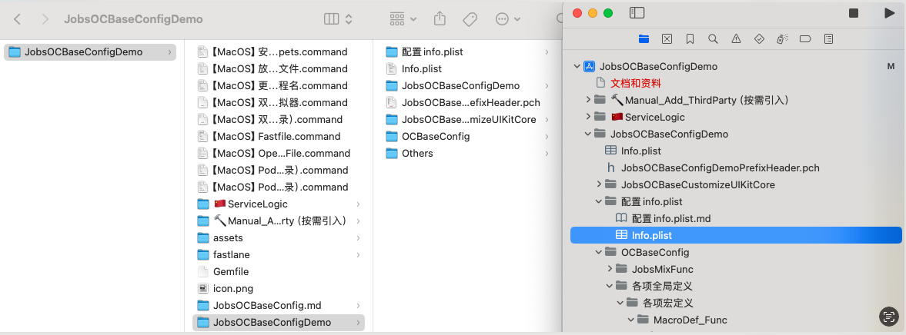


### 4、在Apple芯片（目前是M系列）编译失败的解决方案 <a href="#前言" style="font-size:17px; color:green;"><b>🔼</b></a> <a href="#🔚" style="font-size:17px; color:green;"><b>🔽</b></a>
* 安装 Rosetta
  
  ```shell
  softwareupdate --install-rosetta --agree-to-license
  ```
  
* 禁用系统完整性保护 (<font color=red>**S**</font>ystem <font color=red>**I**</font>ntegrity <font color=red>**P**</font>rotection, <font color=red>**SIP**</font>)   <font color=red>**如果不禁用，会对某些文件夹有读写权限控制**</font>
  
  * 重启**MacOS**，长按开机键，直到🌏页面，进入恢复模式
  * 在恢复模式的**macOS**实用工具窗口中，选择“实用工具”菜单，然后选择“终端”以打开终端窗口
    ```shell
    csrutil disable
    ```
  * 重启**macOS**
  * 在[**xcode**](https://developer.apple.com/xcode/)里面做如下设置：<font color=red>**每一个工程下都做检查**</font>
  	因为涉及到[**xcode**](https://developer.apple.com/xcode/)的安全设置，所以下列操作只能手动操作，而不能用脚本进行。如果不做设置，很可能编译失败
    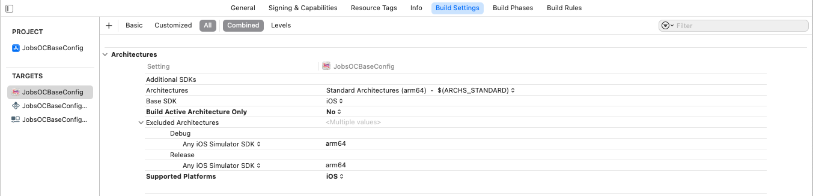
    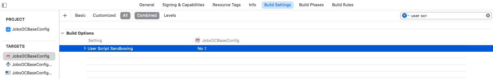
  
  * 文件夹授权
    ```shell
    sudo chown -R $(whoami) 项目目录
    sudo chmod -R u+rw 项目目录
    ```
  * 在`podfile`文件里面，设置：
    ```ruby
    # 用于指定你的 Pod 项目应使用静态库而不是动态库。
    # 这个选项主要用于解决某些与动态库相关的兼容性和性能问题。
    use_frameworks! :linkage => :static
    ```
  * 重新运行`pod`
    ```shell
    pod install
    ```
### 5、**iOS**模拟器 <a href="#前言" style="font-size:17px; color:green;"><b>🔼</b></a> <a href="#🔚" style="font-size:17px; color:green;"><b>🔽</b></a>

* [**过期的模拟器配件**](https://github.com/JobsKits/Xcode_Sys_lib)

* iOS模拟器下载@终端

  ```shell
  rm -rf ~/Library/Caches/com.apple.dt.Xcode
  rm -rf ~/Library/Developer/CoreSimulator/Caches
  
  xcodebuild -downloadPlatform iOS --verbose
  ```

* **iOS**存在假后台现象，有时需要主动手动关闭进程

* **iOS**模拟器目录

  * ```shell
    ~/Library/Developer/CoreSimulator/Devices/
    ```

    > <font color=red>**最常用的目录**</font>
    >
    > 🧼 清理建议：清理 `~/Library/Developer/CoreSimulator/Devices/` 可以释放大量空间，但会移除所有模拟器的 App 安装数据。
    >
    > **每个模拟器实例对应一个 UUID 子目录**。子目录包含该模拟器的所有数据，例如：
    >
    > - 应用程序数据（App 安装后的容器、沙盒）
    > - `data/` 目录里有模拟器的 `Documents`、`tmp`、`Library` 等路径
    > - `device.plist` 存储了模拟器的配置信息（名称、系统版本、状态等）
    > - `logs/` 保存了日志
    >
    > 当你运行模拟器、安装应用、查看沙盒路径，访问的就是这个目录中的对应路径。

  * ```
    ~/Library/Developer/CoreSimulator/Volumes/
    ```

    > 🧼 清理建议：`Volumes/` 通常空间不大，**可以直接删除**，Xcode 会自动重新创建。
    >
    > * 存放模拟器用到的 **挂载卷（Volumes）数据**。
    >
    > - 用于模拟 **iOS 设备的磁盘结构**，包括 `$SYSTEM_VOLUMES_DIR` 中的挂载点。
    > - 一些 App 或系统组件可能会在模拟器中访问 `$SYSTEM_VOLUMES_DIR` 路径（类似 macOS 磁盘挂载），就会挂载此目录中的数据。
    >
    > 例如：模拟器运行中，如果用户或 App 尝试挂载外部磁盘，或创建虚拟磁盘（如` .dmg `文件），就可能映射到这个目录。
    >
    > 📌 注意事项：
    >
    > - 通常这个目录在未特殊使用挂载卷的模拟器中是空的。
    > - 可被清理，**Xcode** 会在需要时自动重新创建。

* 查看目前有的**iOS**模拟器安装包

  ```shell
  xcrun simctl list runtimes
  ```

* 打印所有模拟器实例路径和设备名称

  ```shell
  xcrun simctl list devices -j | jq -r '.devices | to_entries[] | .value[] | select(.isAvailable == true) | "\(.name) (\(.state))\n↪︎  Path: ~/Library/Developer/CoreSimulator/Devices/\(.udid)\n"' 
  ```

  或，

  ```shell
  xcrun simctl list devices | grep -E '^    ' | while read -r line; do
    name=$(echo "$line" | cut -d '(' -f1 | xargs)
    uuid=$(echo "$line" | grep -oE '[A-F0-9\-]{36}')
    echo "$name"
    echo "↪︎  Path: ~/Library/Developer/CoreSimulator/Devices/$uuid"
    echo ""
  done
  ```

* 最新版本的Xcode（目前是：16.4），在设备选择器里面点选了较低版本的iOS模拟器（比如说：iPhone 7），只能通过命令行进行实例化并打开

  ```shell
  xcrun simctl list devices | grep 'iPhone 7'
  xcrun simctl boot "iPhone 7"
  ```

  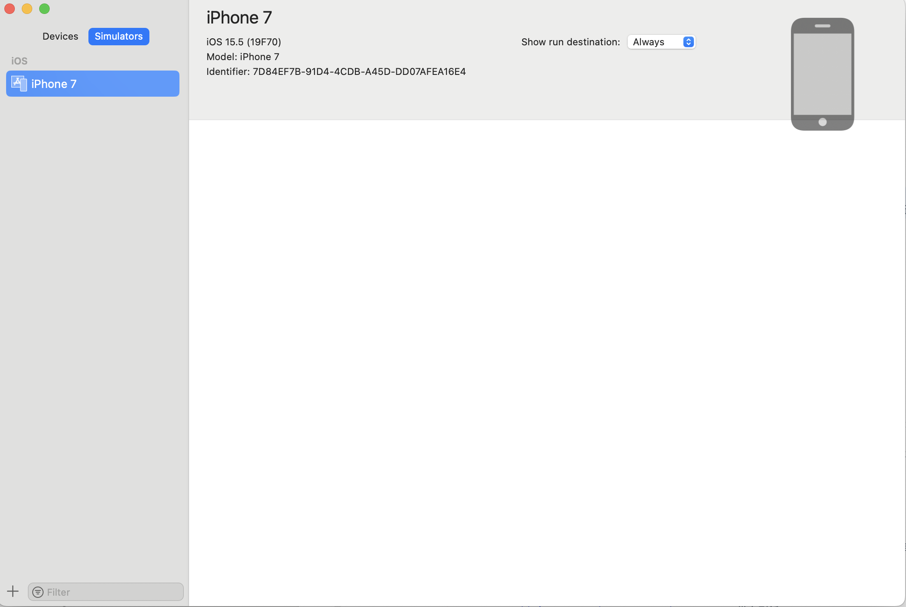

* 命令行唤起**iOS**模拟器

  ```shell
  open -a Simulator
  ```

* 如果更新或者删除**xcode**，那么下载的**iOS**模拟器将会丢失

### 6、`lldb`的使用 <a href="#前言" style="font-size:17px; color:green;"><b>🔼</b></a> <a href="#🔚" style="font-size:17px; color:green;"><b>🔽</b></a>

```shell
(lldb) target list
Current targets:
* target #0: $HOME/Developer/CoreSimulator/Devices/E17E7DE8-7ADA-42FD-A743-A1A3A6CB7E42/data/Containers/Bundle/Application/C590303C-50A7-4BB2-826F-8598E5F3A66C/JobsOCBaseConfigDemo.app/JobsOCBaseConfigDemo ( arch=x86_64-apple-ios-simulator, platform=ios-simulator, pid=89318, state=stopped )
(lldb) target select 0
Current targets:
* target #0: $HOME/Developer/CoreSimulator/Devices/E17E7DE8-7ADA-42FD-A743-A1A3A6CB7E42/data/Containers/Bundle/Application/C590303C-50A7-4BB2-826F-8598E5F3A66C/JobsOCBaseConfigDemo.app/JobsOCBaseConfigDemo ( arch=x86_64-apple-ios-simulator, platform=ios-simulator, pid=89318, state=stopped )
```

### 7、<font color=red>**C**</font>ommand <font color=red>**L**</font>ine <font color=red>**T**</font>ools <a href="#前言" style="font-size:17px; color:green;"><b>🔼</b></a> <a href="#🔚" style="font-size:17px; color:green;"><b>🔽</b></a>

* 安装

  * （通过终端）下载安装`Command Line Tools`

    ```
    xcode-select --install
    ```

  * 通过 Xcode 安装

    * 打开 Xcode
    * 在菜单栏选择 **Xcode > Settings > Locations**
    * 在 <font color=red>**C**</font>ommand <font color=red>**L**</font>ine <font color=red>**T**</font>ools 下拉菜单中选择对应的 Xcode 版本

* 卸载

  ```shell
  sudo rm -rf $SYSTEM_LIBRARY_DIR/Developer/CommandLineTools
  xcode-select --install
  ```

* 切换

  ```shell
  sudo xcode-select -s $APPLICATIONS_DIR/Xcode.app/Contents/Developer
  ```

* 验证命令

  ```shell
  ➜  ~ xcode-select -p
  $APPLICATIONS_DIR/Xcode.app/Contents/Developer
  ```

* 查看<font color=red>**C**</font>ommand <font color=red>**L**</font>ine <font color=red>**T**</font>ools版本

  ```shell
  ➜  ~ pkgutil --pkg-info=com.apple.pkg.CLTools_Executables
  package-id: com.apple.pkg.CLTools_Executables
  version: 26.0.0.0.1.1757719676
  volume: /
  location: /
  install-time: 1758341956
  ```

### 8、⚙️ xcode 配置 <a href="#前言" style="font-size:17px; color:green;"><b>🔼</b></a> <a href="#🔚" style="font-size:17px; color:green;"><b>🔽</b></a>

#### 8.1、⚙️ 新工程配置  <a href="#前言" style="font-size:17px; color:green;"><b>🔼</b></a> <a href="#🔚" style="font-size:17px; color:green;"><b>🔽</b></a>

* <font id =Unknown_class_in_Interface_Builder_file>处理编译器警告：**`Unknown class in Interface Builder file`**</font>

  * 错误的原因通常是因为在**Interface Builder**中指定的类名与实际代码中的类名不匹配
  * 在`*.Storyboard`或`*.xib`文件中，选择**View Controller**，查看**Identity Inspector**，确保**Class**字段中的类名拼写正确（这里的处理方式是删除），并且**Module**字段留空或选择正确的模块（通常是你的项目名）。

  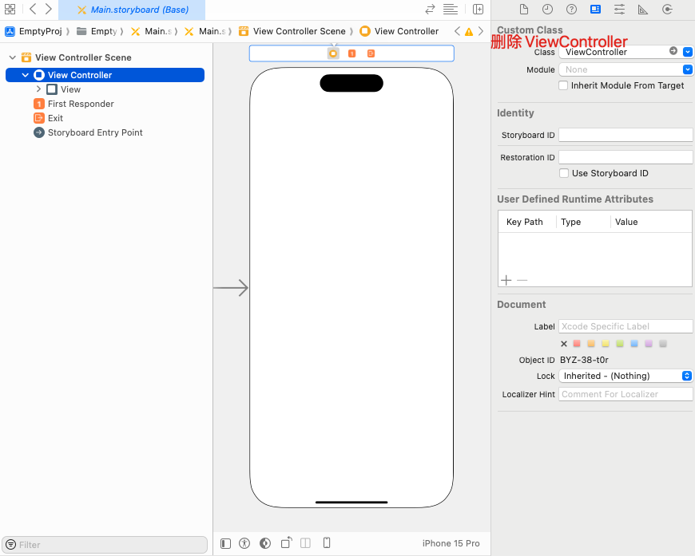

#### 8.2、🏷️`Arguments Passed On Launch`标签设置 <a href="#前言" style="font-size:17px; color:green;"><b>🔼</b></a> <a href="#🔚" style="font-size:17px; color:green;"><b>🔽</b></a>

* 设置应用的语言环境

  ```
  AppleLanguages ( "en" )
  ```

* 启用**Core Data SQL**语句调试日志

  ```
  -com.apple.CoreData.SQLDebug 1
  ```

* 忽略应用的保存状态，强制应用在每次启动时都以初始状态运行    <font color=red>**这个参数在调试应用启动问题时很有用**</font>

  ```
  -ApplePersistenceIgnoreState YES
  ```

* 强制应用使用特定的用户界面风格（浅色模式或深色模式）

  ```
  -UIUserInterfaceStyle Light
  -UIUserInterfaceStyle Dark
  ```

* 启用 **Firebase** 调试日志

  ```
  -FIRDebugEnabled
  ```

* 启用`僵尸对象`检测   <font color=red>**帮助调试被释放的对象仍然被访问的问题**</font>

  ```
  -NSZombieEnabled YES
  ```

* 启用视图对齐矩形的可视化   <font color=red>**这可以帮助调试视图布局问题**</font>

  ```
  -UIViewShowAlignmentRects YES
  ```

* 启用 **Foundation** 框架的调试描述

  ```
  -NSDebugDescription YES
  ```

* 启用文档修订调试模式

  ```
  -NSDocumentRevisionsDebugMode YES
  ```

* 启用 `CFNetwork` 诊断日志。    <font color=red>**这对于调试网络请求问题非常有用**</font>

  ```
  -CFNetworkDiagnosticsEnable 1
  ```

* 强制应用使用特定的文本方向（例如从左到右或从右到左）

  ```
  -AppleTextDirection YES
  ```

#### 8.3、🏷️ `Environment Variables`标签 <a href="#前言" style="font-size:17px; color:green;"><b>🔼</b></a> <a href="#🔚" style="font-size:17px; color:green;"><b>🔽</b></a>

* 日志配置：添加一个新的环境变量。将 `Name` 设置为 `IDEPreferLogStreaming`，将 `Value` 设置为 `YES`

  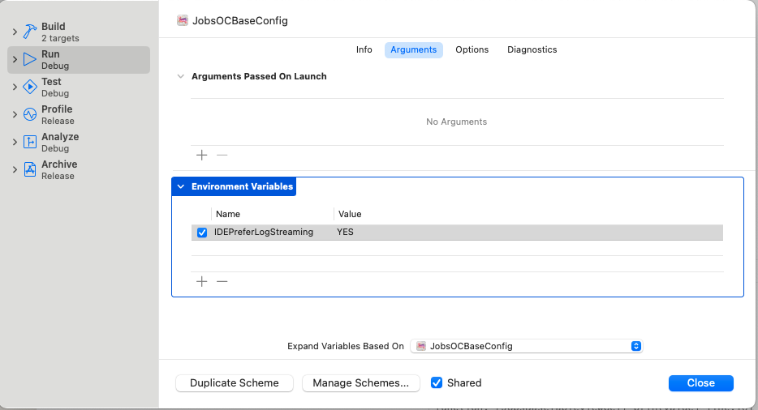

#### 8.4、利用`*.xcconfig`配置Xcode工程项目 <a href="#前言" style="font-size:17px; color:green;"><b>🔼</b></a> <a href="#🔚" style="font-size:17px; color:green;"><b>🔽</b></a>

* 新建配置文件

  <table style="width:100%; table-layout:fixed;">
    <tr>
      <td>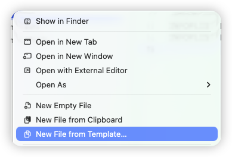</td>
      <td></td>
    </tr>
  </table>

* 自动识别关联

  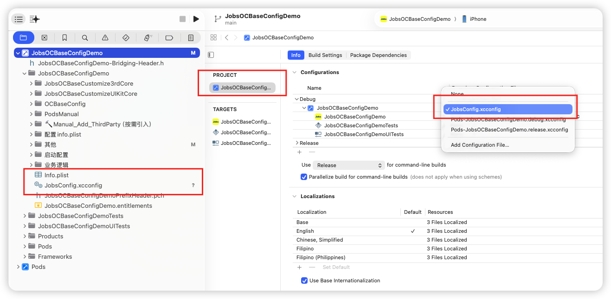

* `*.xcconfig`里面的内容

  ```objective-c
  //
  //  Config.xcconfig
  //  JobsSwiftBaseConfigDemo
  //
  //  Created by Mac on 11/1/25.
  //
  
  // Configuration settings file format documentation can be found at:
  // https://developer.apple.com/documentation/xcode/adding-a-build-configuration-file-to-your-project
  
  PRODUCT_NAME = SwiftDemo
  APP_DISPLAY_NAME = SwiftDemo
  INFOPLIST_KEY_CFBundleDisplayName = $(APP_DISPLAY_NAME)
  INFOPLIST_KEY_CFBundleName = $(PRODUCT_NAME)
  ```

### 9、🖨️ 调试打印 <a href="#前言" style="font-size:17px; color:green;"><b>🔼</b></a> <a href="#🔚" style="font-size:17px; color:green;"><b>🔽</b></a>

#### 9.1、🖨️ 重写打印输出  <a href="#前言" style="font-size:17px; color:green;"><b>🔼</b></a> <a href="#🔚" style="font-size:17px; color:green;"><b>🔽</b></a>

* 关注文件：[**MacroDef_Log.h**](https://github.com/JobsKits/JobsOCBaseConfigDemo/blob/main/JobsOCBaseConfigDemo/OCBaseConfig/各项全局定义/各项宏定义/MacroDef_Sys/MacroDef_Log.h)

  * 使之能定位到具体文件行的输出

    ```objective-c
    #pragma mark —— 控制台Log打印格式重写
    #ifndef NSLog
    #define NSLog(FORMAT, ...) fprintf(stderr,"\nfunction:%s line:%d content:%s\n", __FUNCTION__, __LINE__, [[NSString stringWithFormat:FORMAT, ##__VA_ARGS__] UTF8String]);
    #endif
    ```

  * 使之能简化打印结构体步骤

    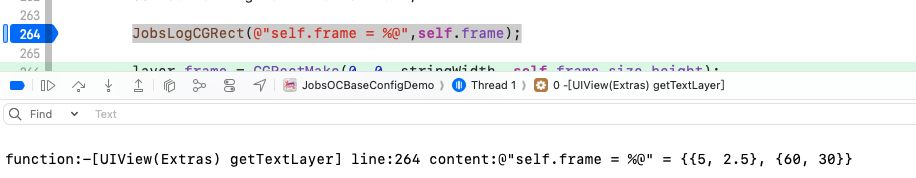

    ```objective-c
    #pragma mark —— 打印结构体
    #ifndef JobsLogCGPoint
    #define JobsLogCGPoint(format, ...) NSLog(@"%s = %@", #format, NSStringFromCGPoint(__VA_ARGS__))
    #endif
    
    #ifndef JobsLogCGVector
    #define JobsLogCGVector(format, ...) NSLog(@"%s = %@", #format, NSStringFromCGVector(__VA_ARGS__))
    #endif
    
    #ifndef JobsLogCGSize
    #define JobsLogCGSize(format, ...) NSLog(@"%s = %@", #format, NSStringFromCGSize(__VA_ARGS__))
    #endif
    
    #ifndef JobsLogCGRect
    #define JobsLogCGRect(format, ...) NSLog(@"%s = %@", #format, NSStringFromCGRect(__VA_ARGS__))
    #endif
    
    #ifndef JobsLogCGAffineTransform
    #define JobsLogCGAffineTransform(format, ...) NSLog(@"%s = %@", #format, NSStringFromCGAffineTransform(__VA_ARGS__))
    #endif
    
    #ifndef JobsLogUIEdgeInsets
    #define JobsLogUIEdgeInsets(format, ...) NSLog(@"%s = %@", #format, NSStringFromUIEdgeInsets(__VA_ARGS__))
    #endif
    
    #ifndef JobsLogDirectionalEdgeInsets
    #define JobsLogDirectionalEdgeInsets(format, ...) NSLog(@"%s = %@", #format, NSStringFromDirectionalEdgeInsets(__VA_ARGS__))
    #endif
    
    #ifndef JobsLogOffset
    #define JobsLogOffset(format, ...) NSLog(@"%s = %@", #format, NSStringFromUIOffset(__VA_ARGS__))
    #endif
    ```

* 关注实现类：[**@interface UIView (Extras)**](https://github.com/JobsKits/JobsOCBaseConfigDemo/tree/main/JobsOCBaseConfigDemo/JobsOCBaseCustomizeUIKitCore/UIView/UIView+Category/UIView+Extras)

  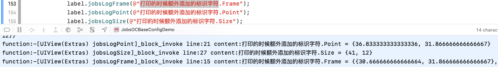

  * 定义在`View`层

    ```objective-c
    -(jobsByStringBlock _Nonnull)jobsLogFrame;
    -(jobsByStringBlock _Nonnull)jobsLogPoint;
    -(jobsByStringBlock _Nonnull)jobsLogSize;
    ```
  
  * 相关调用

    ```objective-c
    label.jobsLogFrame(@"打印的时候额外添加的标识字符");
    label.jobsLogPoint(@"打印的时候额外添加的标识字符");
    label.jobsLogSize(@"打印的时候额外添加的标识字符");
    ```
  
#### 9.2、🖨️ 利用**Runtime**的机制打印类的内容  <a href="#前言" style="font-size:17px; color:green;"><b>🔼</b></a> <a href="#🔚" style="font-size:17px; color:green;"><b>🔽</b></a>

* 返回并打印成员变量列表

  ```objective-c
  -(NSMutableArray <NSString *>*)printIvarList;
  ```

* 返回并打印属性列表

  ```objective-c
  -(NSMutableArray <NSString *>*)printPropertyList;
  ```

* 返回并打印方法列表

  ````objective-c
  -(NSMutableArray <NSString *>*)printMethodList;
  ````

* 返回并打印协议列表

  ```objective-c
  -(NSMutableArray <NSString *>*)printProtocolList;
  ```

### 10、Xcode@Objc<font color=red>代码块</font> <a href="#前言" style="font-size:17px; color:green;"><b>🔼</b></a> <a href="#🔚" style="font-size:17px; color:green;"><b>🔽</b></a>

> 提升编码效率必备之首选

* 提升编码效率，快用[**快捷键调取代码块**](https://github.com/JobsKits/JobsCodeSnippets)
* 脚本自动化：[**`【MacOS】安装JobsCodeSnippets.command`**](https://github.com/JobsKits/JobsCommand-iOS/blob/ec68af7ae10d4acaeabb5d27558a0415230660c4/【MacOS】⚙️双击安装JobsCodeSnippets.command)

### 11、**📦打包`*.ipa` <a href="#前言" style="font-size:17px; color:green;"><b>🔼</b></a> <a href="#🔚" style="font-size:17px; color:green;"><b>🔽</b></a>**

* 手动打包流程

  * 电脑桌面新建文件夹，并重命名为`payload`

  * 真机运行项目（不同设备，不同芯片组，底层指令集不一致）

  * 打开项目工程目录下`Products`，里面有个`*.app`

    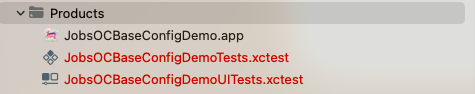

  * 将这个`*.app`复制到刚才电脑桌面新建的`payload`文件夹

  * 压缩电脑桌面新建的`payload`文件夹为zip格式的压缩包

  * 将这个`zip`格式的压缩包，强行改名`*.ipa`

* 脚本自动化打包工具：[**`【MacOS】放在iOS项目工程根目录下，自动打包并输出为ipa文件.command`**](https://github.com/JobsKits/JobsCommand-iOS/blob/ec68af7ae10d4acaeabb5d27558a0415230660c4/【MacOS】📦双击自动生成ipa文件.command)

### 12、应用程序图片 <a href="#前言" style="font-size:17px; color:green;"><b>🔼</b></a> <a href="#🔚" style="font-size:17px; color:green;"><b>🔽</b></a>

#### 12.1、iOS <a href="#前言" style="font-size:17px; color:green;"><b>🔼</b></a> <a href="#🔚" style="font-size:17px; color:green;"><b>🔽</b></a>

> 1️⃣ **@3x 的引入点是 iPhone 6 Plus（iOS 8）**。
>  6/7/8 的 **非 Plus** 机型始终是 **@2x**；6/7/8 **Plus** 是 **@3x**（而且渲染 1242×2208 后再下采样到 1080×1920 显示，这是当年的 downsampling 特性）。
>
> 2️⃣ **后来大量机型是 @3x**：iPhone X、XS/XS Max、11 Pro/Pro Max、12/12 mini/12 Pro/Pro Max、13/13 mini/13 Pro/Pro Max、14/14 Plus/14 Pro/Pro Max、15/15 Plus/15 Pro/Pro Max（以及后续大多数）。
>  **仍是 @2x 的典型**：iPhone XR、iPhone 11、各代 iPhone SE。
>
> 3️⃣ **iPad 到现在都没有 @3x**，都是 **@2x**（含 iPad Pro）。

* 启动图
  * 历史标准
    * **iPhone 3GS**：320×480 → `Default~iphone.png`
    * **iPhone 4/4S**（Retina）：640×960 → `Default@2x~iphone.png`
    * **iPhone 5/5s/SE(1st)**：640×1136 → `Default-568h@2x~iphone.png`
    * **iPhone 6/7/8**：750×1334 → `Default-667h@2x.png`（或 LaunchImage 槽位 `375w-667h@2x`）
    * **iPhone 6/7/8 Plus**：1242×2208（系统缩放到 1080×1920 显示）→ `Default-736h@3x.png` / 槽位 `414w-736h@3x`
    * **iPad（非 Retina）**：768×1024（竖）/ 1024×768（横）。**iPad Retina**：1536×2048（竖）/ 2048×1536（横）
    * **iPhone X / XS**：1125×2436（竖）等刘海机型在静态图时代也有人配，但官方当时已更**鼓励用 Launch Storyboard 适配安全区**。
  * ➤ 当前，苹果已彻底废弃静态 **LaunchImage**，上架App Store多尺寸位图会被拒。必须用 **LaunchScreen.storyboard** 自适应布局（Auto Layout／Safe Area／矢量或等比约束）。<font color=red>**如果非要放品牌图，用约束让它自适应 @2x/@3x，而不是提交一堆固定像素图**</font>
* 应用程序图标
  * App Store（营销图标）：**1024×1024 px**，**不允许透明**（无 alpha）
  * 在设备上的必需尺寸（像素）
    * iPhone 主屏：**180×180**（@3x），**120×120**（@2x）
    * iPad 主屏：**167×167**（iPad Pro），**152×152**（iPad）
    * Spotlight：**120×120**（iPhone @3x）、**80×80**（@2x，含 iPad）
    * 设置（Settings）：**87×87**（@3x iPhone）、**58×58**（@2x，含 iPad）
    * 通知（Notifications）：**60×60**（@3x iPhone）、**40×40**（@2x，含 iPad）

#### 12.2、Android <a href="#前言" style="font-size:17px; color:green;"><b>🔼</b></a> <a href="#🔚" style="font-size:17px; color:green;"><b>🔽</b></a>

> ldpi：（@0.75x）

* 启动图
  * 品牌横幅：**200×80 dp** →
    * mdpi：200×80 （@1x）
    * hdpi：300×120（@1.5x）
    * xhdpi：400×160（@2x）
    * xxhdpi：600×240（@3x）
    * xxxhdpi：800×320（@4x）
* 应用程序图标
  * 带背景的应用图标：**240×240 dp**（内容需装进 **160 dp** 直径圆内）
    * mdpi：240；360；480；720；960 px
  * 无背景的应用图标：**288×288 dp**（内容需装进 **192 dp** 圆内）
    * mdpi：288；432；576；864；1152 px
  * **自适应图标（Adaptive Icon，API 26+）**：前景层 + 背景层 **各 108×108 dp** 画布；**前景可视安全区建议 ≤66×66 dp**，四周 **18 dp** 供蒙版/动效裁切。常见像素导出：
    * mdpi：108 px
    * hdpi：162 px
    * xhdpi：216 px
    * xxhdpi：324 px
    * xxxhdpi：432 px
  * **旧设备（Legacy Launcher 图标）**（如仍需兼容）：48、72、96、144、192 px（mdpi…xxxhdpi）
  * **Google Play 上架图标（商店用）**：**512×512 px, 32-bit PNG, sRGB，≤1MB**（Play 会统一蒙版/投影）。这与启动器图标不同，单独上传。

### 13、🐢<font color=red>**马甲包**</font> <a href="#前言" style="font-size:17px; color:green;"><b>🔼</b></a> <a href="#🔚" style="font-size:17px; color:green;"><b>🔽</b></a>

  * 相关资料
    * https://github.com/520coding/confuse/blob/master/README_ZH.md
  * 相关工具
    * [**confuse**](https://github.com/520coding/confuse)

### 14、 打开苹果的[<font color=red>**反馈助理**</font>](applefeedback://) <a href="#前言" style="font-size:17px; color:green;"><b>🔼</b></a> <a href="#🔚" style="font-size:17px; color:green;"><b>🔽</b></a>

> ```url
> feedbackassistant://
> ```

## 四、💥代码讲解 <a href="#前言" style="font-size:17px; color:green;"><b>🔼</b></a> <a href="#🔚" style="font-size:17px; color:green;"><b>🔽</b></a>

### 1、[**<font color=red>`JobsBlock`</font>**](https://github.com/JobsKits/JobsBlock/blob/main/README.md) <a href="#前言" style="font-size:17px; color:green;"><b>🔼</b></a> <a href="#🔚" style="font-size:17px; color:green;"><b>🔽</b></a>

* 背景意义：**统一全局的Block定义，减少冗余代码**

* <font color=blue>**特别说明**</font>：如果有外源（非系统Api）类参与到Block的定义，此时<u>不能使用</u><font color=red>`#import`</font>，因为会产生编译错误。此时正确的做法是使用<font color=red>**`@class`**</font>

* ```ruby
  pod 'JobsBlock' # https://github.com/JobsKits/JobsBlock
  ```

  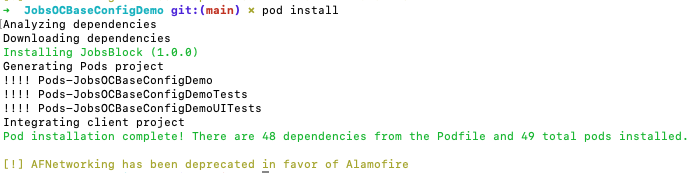

* <font color=red>因为**CDN**同步的原因，有些第三方pod并不能在[**cocoapods.org**](https://cocoapods.org/)被成功的搜索到，这就导致如果`pod install`拉取不到代码，可能需要切换镜像，然后再进行操作。建议运行项目根目录下的2个脚本文件，自动获取</font>

  * `【MacOS】Pod_Install（适用于IOS工程根目录）.command`
  * `【MacOS】Pod_Update（适用于IOS工程根目录）.command`
  
* <font color=blue>不定参数Block【 使用示例】</font>

  ```objective-c
  [self GettingPicBlock:^(id firstArg, ...)NS_REQUIRES_NIL_TERMINATION{
      @jobs_strongify(self)
      if (firstArg) {
          // 取出第一个参数
          NSLog(@"%@", firstArg);
          // 定义一个指向个数可变的参数列表指针；
          va_list args;
          // 用于存放取出的参数
          id arg = nil;
          // 初始化变量刚定义的va_list变量，这个宏的第二个参数是第一个可变参数的前一个参数，是一个固定的参数
          va_start(args, firstArg);
          // 遍历全部参数 va_arg返回可变的参数(a_arg的第二个参数是你要返回的参数的类型)
          if ([firstArg isKindOfClass:NSNumber.class]) {
              NSNumber *num = (NSNumber *)firstArg;
              for (int i = 0; i < num.intValue; i++) {
                  arg = va_arg(args, id);
  //                    NSLog(@"KKK = %@", arg);
                  if ([arg isKindOfClass:UIImage.class]) {
                      NSLog(@"");
                  }else if ([arg isKindOfClass:PHAsset.class]){
                      NSLog(@"");
                  }else if ([arg isKindOfClass:NSString.class]){
                      NSLog(@"");
                  }else if ([arg isKindOfClass:NSArray.class]){
                      NSLog(@"");
                  }else{
                      NSLog(@"");
                  }
              }
          }else{
              NSLog(@"");
          }
          // 清空参数列表，并置参数指针args无效
          va_end(args);
      }
  }];
  ```

### 2、[**<font color=red>`BaseProtocol` 相关继承结构关系图</font>**](https://github.com/JobsKits/JobsOCBaseConfigDemo/blob/main/JobsOCBaseConfigDemo/JobsOCBaseCustomizeUIKitCore/BaseProtocol/BaseProtocol.md) <a href="#前言" style="font-size:17px; color:green;"><b>🔼</b></a> <a href="#🔚" style="font-size:17px; color:green;"><b>🔽</b></a>

* **如果两个对象都继承了共同的协议，互相包含会造成编译器错误**

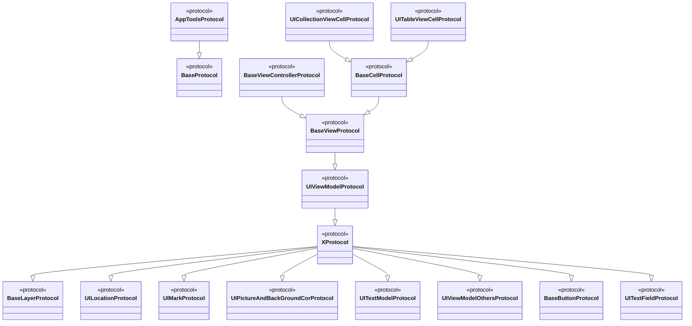

### 3、**`UIViewModelFamily`（将持续更新）<a href="#前言" style="font-size:17px; color:green;"><b>🔼</b></a> <a href="#🔚" style="font-size:17px; color:green;"><b>🔽</b></a>**

* 产生背景：页面之间传值，只需要瞄准1个<font color=red>**数据束**</font>。当需要增删数据的时候，可以有效减少操作，方便管理
* `UIViewModel`即是页面之间传值的这个<font color=red>**数据束**</font>
* `UITextModel`是专门针对文本的<font color=red>**数据束**</font>
* 结合`BaseProtocol`进行封装
* 减少冗余代码，将公用头文件提升到协议进行定义
### 4、`JobsOCBaseCustomizeUIKitCore` <a href="#前言" style="font-size:17px; color:green;"><b>🔼</b></a> <a href="#🔚" style="font-size:17px; color:green;"><b>🔽</b></a>

* 产生背景
  * OC的基类是单继承
  * 继承会产生很多基类，客观上造成代码的冗余
* 解决方案
  * 继承和分类应该结合使用，功能各有优劣
  * 分类即是"超级继承"，不需要产生额外的分类，方便管理和调用

### 5、📏<font id=度量衡>**度量衡**</font> <a href="#前言" style="font-size:17px; color:green;"><b>🔼</b></a> <a href="#🔚" style="font-size:17px; color:green;"><b>🔽</b></a>

> [**手机屏幕尺寸大全**](https://www.strerr.com/screen.html)
>
> 关注文件： **MacroDef_Size.h**

* **全局比例尺**

  * 长宽都按照一个比例尺📏进行缩放

    ```objective-c
    NS_INLINE CGFloat JobsWidth(CGFloat width){
        return (JobsDeviceRealWidth() / 375) * width;
    }
    
    NS_INLINE CGFloat JobsHeight(CGFloat height){
        return (JobsDeviceRealHeight() / 743) * height;
    }
    ```

  * <font color=red>长宽**分别按照**各自方向上的比例尺📏进行缩放</font>

    ```objective-c
    #pragma mark ——【全局比例尺】
    /// 基准设计尺寸
    #ifndef JobsDesignWidth
    #define JobsDesignWidth 375.0
    #endif
    
    #ifndef JobsDesignHeight
    #define JobsDesignHeight 812.0
    #endif
    /// 宽度适配（基于设计稿宽度）
    static inline CGFloat ScaleW(CGFloat value) {
        return value * (UIScreen.mainScreen.bounds.size.width / JobsDesignWidth);
    }
    /// 高度适配（基于设计稿高度）
    static inline CGFloat ScaleH(CGFloat value) {
        return value * (UIScreen.mainScreen.bounds.size.height / JobsDesignHeight);
    }
    ```

    ```objective-c
    CGRect rect = CGRectMake(ScaleW(20), ScaleH(10), ScaleW(200), ScaleH(44));
    ```

* <font color=red>**当设备横竖屏切换的时候，设备宽高定义会互相反转**</font>。 [即，**此时（横屏）的屏幕宽即为垂直屏的高。同样的，此时（横屏）的屏幕高即为垂直屏的宽**](#横屏的时候，较之于竖屏，宽高会互换)

  * 寻找此设备真正的高
    
    ```objective-c
    NS_INLINE CGFloat JobsDeviceRealHeight(void){
        return MAX(JobsMainScreen_WIDTH(), JobsMainScreen_HEIGHT());
    }
    ```
    
  * 寻找此设备真正的宽
    
    ```objective-c
    NS_INLINE CGFloat JobsDeviceRealWidth(void){
        return MIN(JobsMainScreen_WIDTH(), JobsMainScreen_HEIGHT());
    }
    ```
    
  * 寻找当前屏幕真正的高
    
    ```objective-c
    NS_INLINE CGFloat JobsRealHeight(void){
        return JobsAppTool.currentInterfaceOrientationMask == UIInterfaceOrientationMaskLandscape ? JobsDeviceRealWidth() :JobsDeviceRealHeight();
    }
    ```
    
  * 寻找当前屏幕真正的宽

    ```objective-c
    NS_INLINE CGFloat JobsRealWidth(void){
        return JobsAppTool.currentInterfaceOrientationMask == UIInterfaceOrientationMaskLandscape ? JobsDeviceRealHeight() :JobsDeviceRealWidth();
    }
    ```

* **当前设备是否是全面屏**：

  * 关注实现类：[**@interface UIDevice (XMUtils)**](https://github.com/JobsKits/JobsOCBaseConfigDemo/tree/main/JobsOCBaseConfigDemo/JobsOCBaseCustomizeUIKitCore/UIDevice/UIDevice+Category/UIDevice+XMUtils) 和 [**MacroDef_Size.h**](https://github.com/JobsKits/JobsOCBaseConfigDemo/blob/main/JobsOCBaseConfigDemo/OCBaseConfig/各项全局定义/各项宏定义/MacroDef_Size/MacroDef_Size.h)

    ```objective-c
    +(BOOL)isFullScreen;
    ```

* **安全距离**
  
  * 顶部的安全距离
  
    ```objective-c
    NS_INLINE CGFloat JobsTopSafeAreaHeight(void){
        if (@available(iOS 11.0, *)) {
            return NSObject.mainWindow().safeAreaInsets.top;
        } else return 0.f;
    }
    ```
  
  * 底部的安全距离：全面屏手机为**34pt**，非全面屏手机为**0pt** 
  
    ```objective-c
    NS_INLINE CGFloat JobsBottomSafeAreaHeight(void){
        if (@available(iOS 11.0, *)) {
            return NSObject.mainWindow().safeAreaInsets.bottom;
        } else return 0.f;
    }
    ```
  
* **状态栏高度**
  
  * `NS_INLINE CGFloat JobsStatusBarHeightByAppleIncData(void) `
  
  * ```objective-c
    NS_INLINE CGFloat JobsRectOfStatusbar(void){
        SuppressWdeprecatedDeclarationsWarning(
            if (@available(iOS 13.0, *)){
                UIStatusBarManager *statusBarManager = NSObject.mainWindow().windowScene.statusBarManager;
                return statusBarManager.statusBarHidden ? 0 : statusBarManager.statusBarFrame.size.height;
            }else return UIApplication.sharedApplication.statusBarFrame.size.height;);
    }
    ```
  
  * ```objective-c
    NS_INLINE CGFloat JobsStatusBarHeight(void){
        if (@available(iOS 11.0, *)) {
            return NSObject.mainWindow().safeAreaInsets.top;
        } else return JobsRectOfStatusbar();
    }
    ```
  
* **导航栏高度**
  * ```objective-c
    NS_INLINE CGFloat JobsNavigationHeight(UINavigationController * _Nullable navigationController){
        if (navigationController) {
            return navigationController.navigationBar.frame.size.height;
        }else return 44.f;
    }
    ```
  
* **状态栏 + 导航栏高度**
  * ```objective-c
    /// 非刘海屏：状态栏高度(20.f) + 导航栏高度(44.f) = 64.f
    /// 刘海屏系列：状态栏高度(44.f) + 导航栏高度(44.f) = 88.f
    NS_INLINE CGFloat JobsNavigationBarAndStatusBarHeight(UINavigationController * _Nullable navigationController){
        return JobsStatusBarHeight() + JobsNavigationHeight(navigationController);
    }
    ```
  
* **TabBar高度**：全面屏手机比普通手机多34的安全区域
  
  * ```objective-c
    NS_INLINE CGFloat JobsTabBarHeight(UITabBarController * _Nullable tabBarController){
        //因为tabbar可以自定义高度，所以这个地方返回系统默认的49像素的高度
        if (tabBarController) {
            return tabBarController.tabBar.frame.size.height;
        }else return 49.f;
    }
    ```
  
  * <font color=red>**包括了底部安全区域的TabBar高度，一般用这个**</font>
  
    ```objective-c
    /// tabbar高度：【包括了底部安全区域的TabBar高度，一般用这个】
    NS_INLINE CGFloat JobsTabBarHeightByBottomSafeArea(UITabBarController * _Nullable tabBarController){
        return JobsTabBarHeight(tabBarController) + JobsBottomSafeAreaHeight();
    }
    ```
  
* **除开 tabBarController 和 navigationController 的内容可用区域的大小**
  
  * ```objective-c
    #pragma mark ——  除开 tabBarController 和 navigationController 的内容可用区域的大小
    NS_INLINE CGFloat JobsContentAreaHeight(UITabBarController * _Nullable tabBarController,
                                                UINavigationController * _Nullable navigationController){
        CGFloat tabBarHeightByBottomSafeArea = JobsTabBarHeightByBottomSafeArea(tabBarController);
        CGFloat navigationBarAndStatusBarHeight = JobsNavigationBarAndStatusBarHeight(navigationController);
        return JobsMainScreen_HEIGHT(nil) - tabBarHeightByBottomSafeArea - navigationBarAndStatusBarHeight;
    }
    ```

### 6、字符串 <a href="#前言" style="font-size:17px; color:green;"><b>🔼</b></a> <a href="#🔚" style="font-size:17px; color:green;"><b>🔽</b></a>

* **富文本字符串的优先级要高于普通字符串。也就意味着，如果调用了富文本字符串，即便将其设置为nil，普通字符串的设置依然不会奏效**

  ```objective-c
  -(UILabel *)titleLab{
      if(!_titleLab){
          @jobs_weakify(self)
          _titleLab = jobsMakeLabel(^(__kindof UILabel * _Nullable label) {
              @jobs_strongify(self)
              label
                  .byNextAttributedText(NavBarConfig.attributedTitle)
                  .byText(NavBarConfig.title)
                  .byFont(NavBarConfig.font)
                  .byTextCor(NavBarConfig.titleCor)
                  .addOn(self.view)
                  .byAdd(^(MASConstraintMaker *make) {
                      @jobs_strongify(self)
                      make.center.equalTo(self);
                      make.height.mas_equalTo(self.height);
                  })
                  .makeLabelByShowingType(UILabelShowingType_03);
              self.refresh();
          });
      }return _titleLab;
  }
  ```

#### 6.1、<font color=red>**字符串判空**</font>  <a href="#前言" style="font-size:17px; color:green;"><b>🔼</b></a> <a href="#🔚" style="font-size:17px; color:green;"><b>🔽</b></a>

* 判空（因为nil是不能唤起方法的，为了防止字符串是nil，所以此方法必须是类方法或者是内敛函数）

  ```objective-c
  NS_INLINE BOOL isNull(NSString * _Nullable string){
      if(string == nil) return YES;
      if(string == NULL) return YES;
      if((NSNull *)string == NSNull.null) return YES;
      if([string isKindOfClass:NSNull.class]) return YES;
      if([string isKindOfClass:NSString.class]){
          NSString *str = (NSString *)string;
          if([str isEqualToString:@"(null)"]) return YES;
          if([str isEqualToString:@"null"]) return YES;
          if([str isEqualToString:@"<null>"]) return YES;
          if([str isEqualToString:@""]) return YES;
          /// 去掉两端的空格
          return ![str stringByTrimmingCharactersInSet:NSCharacterSet.whitespaceAndNewlineCharacterSet].length;
      }else{
          NSString *str = [NSString stringWithFormat:@"%@",string];
          /// 去掉两端的空格
          return ![str stringByTrimmingCharactersInSet:NSCharacterSet.whitespaceAndNewlineCharacterSet].length;
      }return NO;
  }
  ```

 * 有价值的字符串：`nil`、`NSNull`、`@”“`、`@”   “`均为无意义的字符串

   ```objective-c
   NS_INLINE BOOL isValue(NSString * _Nullable string){
       return !isNull(string);
   }
   ```

#### 6.2、字符串转化  <a href="#前言" style="font-size:17px; color:green;"><b>🔼</b></a> <a href="#🔚" style="font-size:17px; color:green;"><b>🔽</b></a>

* 关注头文件[**`JobsString.h`**](https://github.com/JobsKits/JobsOCBaseConfigDemo/blob/main/JobsOCBaseConfigDemo/JobsOCBaseCustomizeUIKitCore/NSString/JobsString.h)

* 基本数据类型转化成字符串类型

  ```objective-c
  NS_INLINE NSString * _Nonnull toStringByInt(int i){
      return [NSString stringWithFormat:@"%d",i];
  }
  
  NS_INLINE NSString * _Nonnull toStringByFloat(float i){
      return [NSString stringWithFormat:@"%f",i];
  }
  
  NS_INLINE NSString * _Nonnull toStringByDouble(double i){
      return [NSString stringWithFormat:@"%f",i];
  }
  
  NS_INLINE NSString * _Nonnull toStringByNSInteger(NSInteger i){
      return [NSString stringWithFormat:@"%ld",(long)i];
  }
  
  NS_INLINE NSString * _Nonnull toStringByNSUInteger(NSUInteger i){
      return [NSString stringWithFormat:@"%lu",(unsigned long)i];
  }
  
  NS_INLINE NSString * _Nonnull toStringByLong(long i){
      return [NSString stringWithFormat:@"%ld",i];
  }
  
  NS_INLINE NSString * _Nonnull toStringByLongLong(long long i){
      return [NSString stringWithFormat:@"%lld",i];
  }
  ```

#### 6.3、<font color=red>**字符串拼接**</font>  <a href="#前言" style="font-size:17px; color:green;"><b>🔼</b></a> <a href="#🔚" style="font-size:17px; color:green;"><b>🔽</b></a>

* ```objective-c
  -(JobsRetStringByStringBlock _Nonnull)add{
      @jobs_weakify(self)
      return ^NSMutableString *_Nullable(NSString *_Nonnull str) {
          @jobs_strongify(self)
          if(!str) str = @"";
          // 系统的stringByAppendingString方法在参数为nil的时候会崩溃
          return JobsMutableString([self stringByAppendingString:str]);/// 原始字符串不会改变，输出一个新的字符串
      };
  }
  ```
  
  ```objective-c
  config_01.targetString = JobsInternationalization(@"编译器自动管理内存地址").add(@"\n");
  ```

#### 6.4、<font color=red>**字符串比较**</font>  <a href="#前言" style="font-size:17px; color:green;"><b>🔼</b></a> <a href="#🔚" style="font-size:17px; color:green;"><b>🔽</b></a>

* **字符串相等**

  ```objective-c
  -(JobsRetBOOLByIDBlock _Nullable)isEqualToString{
      @jobs_weakify(self)
      return ^(NSString *data){
          @jobs_strongify(self)
          if ([data isKindOfClass:NSString.class]) {
              return [self isEqualToString:data];
          }return NO;
      };
  }
  ```

* **字符串包含**

  ```objective-c
  -(JobsRetBOOLByIDBlock _Nullable)containsString{
      @jobs_weakify(self)
      return ^(NSString *data){
          @jobs_strongify(self)
          if ([data isKindOfClass:NSString.class]) {
              return [self containsString:data];
          }return NO;
      };
  }
  ```

#### 6.5、字符串转`NSURL *`  <a href="#前言" style="font-size:17px; color:green;"><b>🔼</b></a> <a href="#🔚" style="font-size:17px; color:green;"><b>🔽</b></a>

* ```objective-c
  /**
   问题：直接其他地方复制过来的中文字进行网页搜索、或者中文字识别排序等情况的，会出现搜索不到的情况。
   解决方法：可能存在复制源里面的文字带了空白url编码%E2%80%8B，空白编码没有宽度，虽然看不到但是会影响结果无法正确匹配对应的中文字。可以把文字重新url编码即可。
   */
  -(NSString *_Nonnull)urlProtect{
      if ([self containsString:@"\u200B"]) {
          return [self stringByReplacingOccurrencesOfString:@"\u200B" withString:JobsInternationalization(@"")];
      }else return self;
  }
  /// 返回文件路径相关的NSURL *
  -(NSURL *_Nonnull)jobsFileUrl{
      return [NSURL fileURLWithPath:self];
  }
  ```
  
  ```objective-c
  @"http://47.243.60.31:9200".urlProtect;
  ```

#### 6.6、<font color=red>**字符串写文件**</font>  <a href="#前言" style="font-size:17px; color:green;"><b>🔼</b></a> <a href="#🔚" style="font-size:17px; color:green;"><b>🔽</b></a>

```objective-c
-(void)保留文字{
    @jobs_weakify(self)
    if (isValue(self.inputDataString)) {
        NSError *err;
        JobsUserModel.sharedManager.postDraftURLStr = [NSObject saveData:self.inputDataString
                                                    withDocumentsChildDir:JobsInternationalization(@"发帖草稿数据临时文件夹")
                                                             fileFullname:@"发帖草稿数据.txt"
                                                                    error:&err];
        if(err) JobsLog(@"%@",err.description);
    }else FileFolderHandleTool.cleanFilesWithPath(JobsUserModel.sharedManager.postDraftURLStr);
    JobsLog(@"%@",JobsUserModel.sharedManager.postDraftURLStr);
    [self.view hx_showLoadingHUDText:nil];
    dispatch_async(dispatch_get_global_queue(DISPATCH_QUEUE_PRIORITY_DEFAULT, 0), ^{
        BOOL success = [self.photoManager saveLocalModelsToFile];/// 保存图片
        dispatch_async(dispatch_get_main_queue(), ^{
            @jobs_strongify(self)
            [self.view hx_handleLoading];
            if (success) {
                self.back(nil);
            }else [self.view hx_showImageHUDText:JobsInternationalization(@"保存失败")];
        });
    });
}
```

### 7、`UILabel`的自适应 <a href="#前言" style="font-size:17px; color:green;"><b>🔼</b></a> <a href="#🔚" style="font-size:17px; color:green;"><b>🔽</b></a>

* 影响范围：**`UILabe`** 和 **`UIButton`**

* 关键代码

  * ```objective-c
    #ifndef JobsLabelDef_h
    #define JobsLabelDef_h
    typedef enum : NSInteger {
        /// 一行显示。定宽、定高、定字体。多余部分用…表示（省略号的位置由NSLineBreakMode控制）
        UILabelShowingType_01 = 1,
        /// 一行显示。定宽、定高、定字体。多余部分scrollerView
        UILabelShowingType_02,
        /// 一行显示。不定宽、定高、定字体。宽度自适应 【单行：ByFont】
        UILabelShowingType_03,
        /// 一行显示。定宽、定高。缩小字体方式全展示 【单行：ByWidth】
        UILabelShowingType_04,
        /// 多行显示。定宽、不定高、定字体 【多行：ByFont】
        UILabelShowingType_05,
    } UILabelShowingType;// UILabel的显示样式
    #endif /* JobsLabelDef_h */
    ```

  * 作用于 `UILabe` <font color=red>**必须等`UILabe *`的Frame正确刷新加载以后，才可以使用以下方法**</font>

    ```objective-c
    -(jobsByNSIntegerBlock _Nonnull)makeLabelByShowingType;
    ```

  * 作用于 `UIButton` <font color=red>**必须等`UIButton *`的Frame正确刷新加载以后，才可以使用以下方法**</font>

    ```objective-c
    -(jobsByNSIntegerBlock _Nonnull)makeBtnLabelByShowingType;
    ```

* 示例

  ```objective-c
  -(UILabel *)titleLab{
      if(!_titleLab){
          @jobs_weakify(self)
          _titleLab = jobsMakeLabel(^(__kindof UILabel * _Nullable label) {
              @jobs_strongify(self)
              label.byText(@"LOGIN".tr)
                  .byFont(bayonRegular(20))
                  .byTextCor(JobsCor(@"FFC700"))
                  .addOn(self.view)
                  .byAdd(^(MASConstraintMaker *make) {
                      @jobs_strongify(self)
                      make.centerX.equalTo(self);
                      make.top.equalTo(self).offset(JobsWidth(13));
                  })
         		     .makeLabelByShowingType(UILabelShowingType_03);
          });
      }return _titleLab;
  }
  ```

### 8、文件介绍 <a href="#前言" style="font-size:17px; color:green;"><b>🔼</b></a> <a href="#🔚" style="font-size:17px; color:green;"><b>🔽</b></a>

* 各项宏定义

  ```objective-c
  #import "MacroDef_Size.h"
  #import "MacroDef_App.h"
  #import "MacroDef_Cor.h"
  #import "MacroDef_Func.h"
  #import "MacroDef_Sys.h"
  #import "MacroDef_Font.h"
  #import "MacroDef_String.h"
  #import "MacroDef_Singleton.h"
  #import "MacroDef_Time.h"
  #import "MacroDef_QUEUE.h"
  #import "JobsUserDefaultDefine.h"
  #import "MacroDef_Strong@Weak.h"
  #import "MacroDef_Notification.h"
  #import "MacroDef_Log.h"
  ```

* 全局通知名字符串的管理

  ```objective-c
  #import "JobsOCBaseConfigNotificationManager.h"
  ```

* [**CocoaPods**](https://cocoapods.org/)的头文件管理

  ```objective-c
  #import "DDPods.h"
  #import "DDPodsManual.h"
  ```

* 全局枚举定义

  ```objective-c
  #import "JobsDefineAllEnumHeader.h"
  ```

* **`.pch`**文件

  ```objective-c
  #import "FMPrefixHeader.pch"
  #import "JobsOCBaseConfigDemoPrefixHeader.pch"
  ```

* 储存key值的文件：

  ```objective-c
  #import "APIKey.h"
  ```

* 网络请求的接口的文件

  ```objective-c
  #import "NSObject+URLManager.h
  ```

### 9、输入框（**`UITextField`**） <a href="#前言" style="font-size:17px; color:green;"><b>🔼</b></a> <a href="#🔚" style="font-size:17px; color:green;"><b>🔽</b></a>

#### 9.1、**`UITextFieldDelegate`**  <a href="#前言" style="font-size:17px; color:green;"><b>🔼</b></a> <a href="#🔚" style="font-size:17px; color:green;"><b>🔽</b></a>

* 在文本字段即将开始编辑时调用。返回YES表示允许编辑，返回NO则表示不允许编辑

  ```objective-c
  /// 用途：您可以使用此方法进行输入验证或单元格选择，以决定是否允许用户开始编辑。
  -(BOOL)textFieldShouldBeginEditing:(UITextField *)textField{
      return YES;
  }
  ```

* 文本字段已经开始编辑时调用

  ```objective-c
  /// 用途：在此方法中，您可以开始相应的操作，例如更新用户界面（UI），显示工具条等
  -(void)textFieldDidBeginEditing:(UITextField *)textField{}
  ```
  
* 在文本字段即将结束编辑时调用。返回YES表示允许结束编辑，返回NO则表示不允许结束编辑

  ```objective-c
  /// 用途：您可以在这里执行验证，例如检查用户输入的有效性
  -(BOOL)textFieldShouldEndEditing:(UITextField *)textField{
      return YES;
  }
  ```

* 文本字段已经结束编辑时调用

  ```objective-c
  /// 用途：在此方法中，可以处理输入完成后的操作，例如更新数据模型或用户界面的状态
  -(void)textFieldDidEndEditing:(UITextField *)textField{}
  ```
  
* 文本字段结束编辑时调用，并带有结束原因

  ```objective-c
  /// 用途：可以根据不同的结束原因执行不同的操作
  /// API_AVAILABLE(ios(10.0))
  -(void)textFieldDidEndEditing:(UITextField *)textField
                          reason:(UITextFieldDidEndEditingReason)reason{}
  ```
  
* <font color=red id=textField的文本变化监控>**在文本字段的字符将要改变时调用，因为用户输入、删除或粘贴内容。返回YES允许更改，返回NO禁止更改**</font>

  * 对于删除操作，此时的**string**是<u>长度为0个字符单位</u>的空字符
  * 对于空格操作，此时的**string**是<u>长度为1个字符单位</u>的空字符

  ```objective-c
  /// 用途：您可以用于限制输入的字符类型或长度，或实现某些格式化规则
  -(BOOL)textField:(UITextField *)textField
  shouldChangeCharactersInRange:(NSRange)range
  replacementString:(NSString *)string{
      return YES;
  }
  ```

* 在文本字段的选中文本发生改变时调用    <font color=red>**API_AVAILABLE(ios(13.0), tvos(13.0))**</font>

  ```objective-c
  /// 用途：可以用于实时更新相关UI或执行某些操作
  -(void)textFieldDidChangeSelection:(UITextField *)textField{}
  ```
  
* 在清除文本字段内容之前调用。返回YES允许清除，返回NO禁止清除

  ```objective-c
  /// 用途：可以用于提示用户、确认清除操作或进行额外的验证。
  -(BOOL)textFieldShouldClear:(UITextField *)textField{
      return YES;
  }
  ```

* 在用户按下**Return**键时调用。返回YES表示处理当前输入（如关闭键盘），返回NO表示不处理

  ```objective-c
  /// 用途：一般用于提交表单，关闭键盘，或进行下一步的输入
  -(BOOL)textFieldShouldReturn:(UITextField *)textField{
      return YES;
  }
  ```

* 在文本字段要展示编辑菜单时调用。可自定义菜单内容    <font color=red>**API_AVAILABLE(ios(16.0))**</font>

  ```objective-c
  /// 用途：可以提供自定义的剪切、复制、粘贴等操作选项
  -(nullable UIMenu *)textField:(UITextField *)textField
    editMenuForCharactersInRange:(NSRange)range
                suggestedActions:(NSArray<UIMenuElement *> *)suggestedActions{
      return nil;
  }
  ```

* 在文本字段即将展示编辑菜单时调用    <font color=red>**API_AVAILABLE(ios(16.0)) API_UNAVAILABLE(tvos, watchos)**</font>

  ```objective-c
  /// 用途：可以在菜单展示前进行动画处理或其他UI调整
  -(void)textField:(UITextField *)textField
  willPresentEditMenuWithAnimator:(id<UIEditMenuInteractionAnimating>)animator{}
  ```
  
* 在文本字段即将消失编辑菜单时调用

  ```objective-c
  /// 用途：可以在菜单消失前进行相关清理或动画效果
  /// API_AVAILABLE(ios(16.0)) API_UNAVAILABLE(tvos, watchos)
  -(void)textField:(UITextField *)textField
  willDismissEditMenuWithAnimator:(id<UIEditMenuInteractionAnimating>)animator{}
  ```

#### 9.2、系统提供的修改接口（子类需要重写以下父类方法） <a href="#前言" style="font-size:17px; color:green;"><b>🔼</b></a> <a href="#🔚" style="font-size:17px; color:green;"><b>🔽</b></a>

* **当前文本框聚焦时就会调用**

  ```objective-c
  -(BOOL)becomeFirstResponder{
      return [super becomeFirstResponder];
  }
  ```

* **当前文本框失去焦点时就会调用**

    ```objective-c
    -(BOOL)resignFirstResponder{
        return [super resignFirstResponder];
    }
    ```

* **重写来重置clearButton位置,改变size可能导致button的图片失真**

    ```objective-c
    -(CGRect)clearButtonRectForBounds:(CGRect)bounds{
    	return [super clearButtonRectForBounds:bounds];
    }
    ```

* **leftView——Rect 【键盘弹起会调用此方法】**

    ```objective-c
    -(CGRect)leftViewRectForBounds:(CGRect)bounds{
    	return [super leftViewRectForBounds:bounds];
    }
    ```

* **rightView——Rect 【键盘弹起会调用此方法】**

    ```objective-c
    - (CGRect)rightViewRectForBounds:(CGRect)bounds{
    	return [super rightViewRectForBounds:bounds];
    }
    ```

* **重写改变绘制占位符属性。重写时调用super可以按默认图形属性绘制;若自己完全重写绘制函数，就不用调用super了**

    ```objective-c
    -(void)drawPlaceholderInRect:(CGRect)rect{
    	return [super drawPlaceholderInRect:rect];
    }
    ```

* **重写来重置边缘区域**

    ```objective-c
    -(CGRect)borderRectForBounds:(CGRect)bounds{
        return [super borderRectForBounds:bounds];
    }
    ```

* **重写来重置占位符区域 【键盘弹起会调用此方法】**

    ```objective-c
    -(CGRect)placeholderRectForBounds:(CGRect)bounds{
        return [super placeholderRectForBounds:bounds];
    }
    ```

* **重写来重置文字区域 【未编辑状态下光标的起始位置】【键盘弹起会调用此方法】**

    ```objective-c
    -(CGRect)textRectForBounds:(CGRect)bounds{
        return [super textRectForBounds:bounds];
    }
    ```

* **重写来重置编辑区域【编辑状态下的起始位置】、UIFieldEditor的位置大小【键盘弹起会调用此方法】**

    ```objective-c
    -(CGRect)editingRectForBounds:(CGRect)bounds{
        return [super editingRectForBounds:bounds];
    }
    ```

#### 9.3、有4+1个`TextField`可供继承使用（具体使用方式，查询相关头文件定义） <a href="#前言" style="font-size:17px; color:green;"><b>🔼</b></a> <a href="#🔚" style="font-size:17px; color:green;"><b>🔽</b></a>

##### 9.3.1、处理方式：将**`UITextField`**作为一个子视图加载到一个父容器视图  <a href="#前言" style="font-size:17px; color:green;"><b>🔼</b></a> <a href="#🔚" style="font-size:17px; color:green;"><b>🔽</b></a>

* 产生背景

  * iOS系统的 **`UITextField`** 内部其实还有若干子视图，对于这些子视图原则上是不希望我们进行直接访问的，所以在设计之初就没有提供更多的Api对外暴露给我们使用
  * 然而，当我们需要自定义一些UI的时候，因为在`-(void)layoutSubviews`等生命周期方法中是过程值（不准确，不是我们想要的），这个过程值又UI的展开有关，很难定位终值，就会对我们的布局产生纠缠，至少增加思维量和代码厚度，加大接入难度
  * <font color=red>**键盘的弹起和回收也会对这些子视图的frame产生影响**</font>。这让情况变得更加错综复杂
  * 特别的，如果要<u>自定义光标的闪动位置</u>、<u>**TextField**.**leftView**.**frame**</u>、<u>**TextField**.**rightView**.**frame**</u>、<u>清除按钮的frame</u>等功能的话，就会变得很吃力，甚至不可为


  * 现在的做法是将系统的**UITextField**作为一个整体，<u>不再去关心内部的子视图的实现及其布局调整</u>
    * 外界传入的**leftView**替代系统的**`TextField`**.**leftView**
    * 外界传入的**rightView**替代系统的**`TextField`**.**rightView**
    
  * 对**`textField`**我们只关心2个值
    * 当下输入的文本值
    * 当前**`textField`**的文本值
    
  * `placeholder`是针对普通文本。系统原则上不希望我们在这个属性上去过多纠缠文本字体、文本色号，转而考虑`attributedPlaceholder`。但如果一定要对`placeholder`的文本字体、文本色号进行定义，则关注`placeholderColor`、`placeholderFont`

* <font color=red>`JobsTextField`</font>：**`BaseView`**

  ```objective-c
  -(JobsTextField *)textField_birthDay{
      if(!_textField_birthDay){
          @jobs_weakify(self)
          _textField_birthDay = makeJobsTextField(^(__kindof JobsTextField * _Nullable data) {
              @jobs_strongify(self)
              data.layoutSubviewsRectCorner = UIRectCornerAllCorners;
              data.layoutSubviewsRectCornerSize = CGSizeMake(JobsWidth(8), JobsWidth(8));
              data.byLeftViewByOutLineOffset(JobsWidth(4))
                  .byLeftViewByTextFieldOffset(JobsWidth(4))
                  .byRightViewByTextFieldOffset(JobsWidth(4))
                  .byRightViewByOutLineOffset(JobsWidth(14))
                  .byLeftView(BaseButton.jobsInit()
                              .jobsResetBtnBgImage(@"📅".img)
                              .onClickBy(^(UIButton *x){
                                  JobsLog(@"");
                              }).onLongPressGestureBy(^(id data){
                                  JobsLog(@"");
                              }).bySize(CGSizeMake(JobsWidth(16), JobsWidth(16))))
                  .byRightView(BaseButton.jobsInit()
                               .jobsResetBtnBgImage(@"向下的箭头".img)
                               .onClickBy(^(UIButton *x){
                                   @jobs_strongify(self)
                                   self.popupParameter = nil;
                                   ShowView(self.calenderView);
                               }).onLongPressGestureBy(^(id data){
                                   JobsLog(@"");
                               }).bySize(CGSizeMake(JobsWidth(16), JobsWidth(16))))
                  .byBgCor(@"#f7f7f7".cor)
                  .JobsRichViewByModel2(nil)
                  // 真实的textField，输入回调（每次输入的字符），如果要当前textField的字符，请取值textField.text
                  .JobsBlock1(^(id _Nullable data) {
                      JobsLog(@"ddf = %@",data);
                  });
              data.realTextField
                  .byReturnKeyType(UIReturnKeyDefault)
                  .byKeyboardAppearance(UIKeyboardAppearanceDefault)
                  .byKeyboardType(UIKeyboardTypePhonePad)
                  .byLeftViewMode(UITextFieldViewModeNever)
                  .byRightViewMode(UITextFieldViewModeNever)
                  .byPlaceholder(@"Pick a Date".tr)
                  .byPlaceholderColor(@"#BBBBBB".cor)
                  .byPlaceholderFont(pingFangTCRegular(15))
                  .byAttributedPlaceholder(nil)
                  .byTextCor(JobsCor(@"#788190"))
                  .bySecureTextEntry(NO);
          })
          .setLayerBy(jobsMakeLocationModel(^(__kindof JobsLocationModel * _Nullable data) {
              data.layerCor = @"#BBBBBB".cor;
              data.jobsWidth = 1;
              data.cornerRadiusValue = JobsWidth(8);
          }))
          .addOn(self.scrollView)
          .byAdd(^(MASConstraintMaker *make) {
              @jobs_strongify(self)
              make.size.mas_equalTo(CGSizeMake(JobsWidth(346), JobsWidth(40)));
              make.top.equalTo(self.birthDayTitleLab.mas_bottom).offset(JobsWidth(10));
              make.left.equalTo(self.scrollView).offset(JobsWidth(19));
          });
      }return _textField_birthDay;
  }
  ```
  
  ```objective-c
  -(UIImageView *)textFieldLeftView{
      if(!_textFieldLeftView){
          @jobs_weakify(self)
          _textFieldLeftView = jobsMakeImageView(^(__kindof UIImageView * _Nullable imageView) {
              @jobs_strongify(self)
              imageView.image = @"UserLogoTextFieldLeftImage".img;
              imageView.sizer = CGSizeMake(JobsWidth(15), JobsWidth(15));
          });
      }return _textFieldLeftView;
  }
  
  -(UIImageView *)textFieldRightView{
      if(!_textFieldRightView){
          @jobs_weakify(self)
          _textFieldRightView = jobsMakeImageView(^(__kindof UIImageView * _Nullable imageView) {
              @jobs_strongify(self)
              imageView.image = @"UserLogoTextFieldRightImage".img;
              imageView.sizer = CGSizeMake(JobsWidth(16), JobsWidth(16));
          });
      }return _textFieldRightView;
  }
  ```
  
* 一些系统Bug：

  * <font color=red>`secureTextEntry` 必须先于 `text` 设置，否则可能会触发系统Bug：导致无法输入的情况</font>

##### 9.3.2、处理方式：**`UITextField`**的子类  <a href="#前言" style="font-size:17px; color:green;"><b>🔼</b></a> <a href="#🔚" style="font-size:17px; color:green;"><b>🔽</b></a>

* `CJTextField`：**`UITextField`**

* `HQTextField`：**`CJTextField`**：**`UITextField`**

* `JobsMagicTextField`：**`ZYTextField`**：**`UITextField`**

  ```objective-c
  -(JobsMagicTextField *)textField{
      if (!_textField) {
          @jobs_weakify(self)
          _textField = jobsMakeMagicTextField(^(__kindof JobsMagicTextField * _Nullable textField) {
              @jobs_strongify(self)
              textField.byDelegate(self)
                  .addOn(self.view)
                  .byAdd(^(MASConstraintMaker *make) {
                      @jobs_strongify(self)
                      make.top.left.bottom.equalTo(self);
                  });
          });
          [_textField jobsTextFieldEventFilterBlock:^BOOL(id _Nullable data) {
              @jobs_strongify(self)
              return self.retBoolByIDBlock ? self.retBoolByIDBlock(data) : YES;
          } subscribeNextBlock:^(id _Nullable x) {
              @jobs_strongify(self)
              JobsLog(@"MMM = %@",x);
              [self block:textField value:x];
          }];
      }return _textField;
  }
  ```

  ```objective-c
  -(void)configTextField{
      _textField.leftView = [UIImageView.alloc initWithImage:self.doorInputViewBaseStyleModel.leftViewIMG];
      _textField.leftViewMode = self.doorInputViewBaseStyleModel.leftViewMode;
      _textField.returnKeyType = self.doorInputViewBaseStyleModel.returnKeyType;
      _textField.keyboardAppearance = self.doorInputViewBaseStyleModel.keyboardAppearance;
      _textField.placeholder = self.doorInputViewBaseStyleModel.placeHolderStr;
      _textField.keyboardType = self.doorInputViewBaseStyleModel.keyboardType;
      _textField.textColor = self.doorInputViewBaseStyleModel.titleStrCor;
      _textField.useCustomClearButton = self.doorInputViewBaseStyleModel.useCustomClearButton;
      _textField.isShowDelBtn = self.doorInputViewBaseStyleModel.isShowDelBtn;
      _textField.rightViewOffsetX = self.doorInputViewBaseStyleModel.rightViewOffsetX ? : JobsWidth(8);// 删除按钮的偏移量
      _textField.placeholderColor = self.doorInputViewBaseStyleModel.placeholderColor;
      _textField.leftViewOffsetX = self.doorInputViewBaseStyleModel.leftViewOffsetX ? : JobsWidth(17);
      _textField.placeholderFont = self.doorInputViewBaseStyleModel.placeholderFont;
      _textField.requestParams = self.textFieldInputModel;
      _textField.animationColor = self.doorInputViewBaseStyleModel.animationColor ? : Cor4;
      _textField.placeHolderAlignment = self.doorInputViewBaseStyleModel.placeHolderAlignment ? : NSTextAlignmentLeft;
      _textField.placeHolderOffset = self.doorInputViewBaseStyleModel.placeHolderOffset ? : JobsWidth(20);
      _textField.moveDistance = self.doorInputViewBaseStyleModel.moveDistance ? : JobsWidth(40);
      _textField.fieldEditorOffset = self.doorInputViewBaseStyleModel.fieldEditorOffset ? : JobsWidth(50);
  }
  ```

* `ZYTextField`： **UITextField**

  ```objective-c
  @synthesize textField = _textField;
  -(ZYTextField *)textField{
      if (!_textField) {
          @jobs_weakify(self)
          CGFloat TextFieldWidth = self.mj_w - JobsWidth(80);
          _textField = jobsMakeZYTextField(^(ZYTextField *_Nullable textField) {
              textField
                  .byPlaceholder(@"请输入搜索内容".tr)
                  .byDelegate(self)
                  .byLeftView(jobsMakeImageView(^(__kindof UIImageView * _Nullable imageView) {
                      imageView.byImage(@"放大镜".img);
                  }))
                  .byTextCor(JobsPurpleColor)
                  .byInputAccessoryView(jobsMakeLabel(^(__kindof UILabel * _Nullable label) {
                      label
                          .byText(@"Jobs安全聊天，为您的聊天加密护航".tr)
                          .byTextCor(JobsRedColor)
                          .byTextAlignment(NSTextAlignmentCenter)
                          .byFont(UIFontWeightRegularSize(JobsWidth(12)))
                          .byBgColor(JobsCyanColor)
                          .bySize(CGSizeMake(JobsMainScreen_WIDTH(), 30));
                  }))
                  .byLeftViewMode(UITextFieldViewModeAlways)
                  .byKeyboardAppearance(UIKeyboardAppearanceAlert)
                  .byReturnKeyType(UIReturnKeySearch)
                  .byPlaceHolderAlignment(NSTextAlignmentCenter)
                  .byLeftViewOffsetX(JobsWidth(5))
                  .byRightViewOffsetX(JobsWidth(3))
                  .addOn(self)
                  .byAdd(^(MASConstraintMaker *make) {
                      @jobs_strongify(self)
                      make.centerY.equalTo(self);
                      make.left.equalTo(self);
                      make.right.equalTo(self.cancelBtn.mas_left);
                      make.height.mas_equalTo(self.mj_h - JobsWidth(15));
                  })
                  .byBgColor(HEXCOLOR(0xFFFFFF))
                  .setLayerBy(jobsMakeLocationModel(^(__kindof JobsLocationModel * _Nullable model) {
                      model.jobsWidth = .05f;
                      model.layerCor = JobsBlueColor;
                      model.cornerRadiusValue = JobsWidth(8);
              }));
          });
          /// 不能写在 jobsMakeZYTextField 里面，否则会崩溃
          [[_textField.rac_textSignal filter:^BOOL(NSString *_Nullable value) {
              @jobs_strongify(self)
              if (isValue(self.textField.text)) {
                  self.cancelBtn.alpha = 1;
                  self.textField.width = TextFieldWidth - (self.cancelBtn.sizer.width + JobsWidth(5));
              }return isValue(value);
          }] subscribeNext:^(NSString * _Nullable x) {
              @jobs_strongify(self)
              JobsLog(@"输入的字符为 = %@",x);
              if (self.objBlock) self.objBlock(x);
          }];
      }return _textField;
  }
  ```

#### 9.4、字符过滤 <a href="#前言" style="font-size:17px; color:green;"><b>🔼</b></a> <a href="#🔚" style="font-size:17px; color:green;"><b>🔽</b></a>

* 一般情况下，如果要监控输入字符，需要实现相应的`UITextFieldDelegate`方法，某些情况下会比较繁琐，包括但不仅限于下列：

  * 监控**emoji**字符（多个字符组成一个**emoji**字符，且**emoji**字符集还在随时扩充）
  * [**监控输入空格和删除操作**](#textField的文本变化监控)

* 目前最好的字符过滤解决方案：利用[**ReactiveCocoa**](https://github.com/ReactiveCocoa/ReactiveObjC)框架

  * 对[**ReactiveCocoa**](https://github.com/ReactiveCocoa/ReactiveObjC)框架的二次封装，方便对[**ReactiveCocoa**](https://github.com/ReactiveCocoa/ReactiveObjC)框架不熟悉的使用者

    ```objective-c
    -(RACDisposable *)jobsTextFieldEventFilterBlock:(JobsRetBOOLByIDBlock)filterBlock
                                 subscribeNextBlock:(jobsByIDBlock)subscribeNextBlock{
        return [[self.rac_textSignal filter:^BOOL(NSString * _Nullable value) {
            return filterBlock ? filterBlock(value) : YES;
        }] subscribeNext:^(NSString * _Nullable x) {
            if (subscribeNextBlock) subscribeNextBlock(x);
        }];
    }
    ```

  * 最外层的调用方式

    ```objective-c
     @jobs_weakify(self)
     [_textField jobsTextFieldEventFilterBlock:^BOOL(id data) {
    //            @jobs_strongify(self)
         return YES;
     } subscribeNextBlock:^(NSString * _Nullable x) {
         @jobs_strongify(self)
         self.textField.text = x;
         [self textFieldBlock:self.textField
               textFieldValue:x];
     }];
    ```

#### 9.5、禁止编辑  <a href="#前言" style="font-size:17px; color:green;"><b>🔼</b></a> <a href="#🔚" style="font-size:17px; color:green;"><b>🔽</b></a>

* `isUserInteractionEnabled`：设置为 `false` 后，用户将无法与 `UITextField` 进行任何交互，包括无法选择文本、无法点击光标等

  ```objective-c
  UITextField *textField = UITextField.new;
  textField.isUserInteractionEnabled = NO;
  ```

* `enabled`：设置为 `false` 后，`UITextField` 将变成白色，用户无法输入文字，但仍然可以选择和复制文本

  ```objective-c
  UITextField *textField = UITextField.new;
  textField.enabled = NO;
  ```

#### 9.6、阻止键盘弹起（而是转向其他的操作） <a href="#前言" style="font-size:17px; color:green;"><b>🔼</b></a> <a href="#🔚" style="font-size:17px; color:green;"><b>🔽</b></a>

* ```objective-c
  // 实现代理方法
  - (BOOL)textFieldShouldBeginEditing:(UITextField *)textField {
      // 在这里执行其他操作
      NSLog(@"TextField 被点击了，但不会弹出键盘");
      return NO; // 返回 NO，阻止键盘弹出
  }
  ```

#### 9.7、[**RAC**](https://github.com/ReactiveCocoa/ReactiveObjC)监控输入框  <a href="#前言" style="font-size:17px; color:green;"><b>🔼</b></a> <a href="#🔚" style="font-size:17px; color:green;"><b>🔽</b></a>

* 制作信号

  * 如果**UITextField**不可用

    ```objective-c
    /// 则监控UITextField.text
    -(NSArray<RACSignal *>*_Nonnull)makeSignals1{
       @jobs_weakify(self);
       return [jobsMakeMutArr(^(__kindof NSMutableArray * _Nullable data) {
           @jobs_strongify(self)
           /// 获取所有需要监控的输入框
    //            data.add(textField1.realTextField)
    //            .add(textField2.realTextField);
       }).rac_sequence map:^id(UITextField *textField) {
           return [RACSignal merge:jobsMakeMutArr(^(__kindof NSMutableArray * _Nullable data) {
               data.add(textField.rac_textSignal)/// 监听用户输入
               .add(RACObserve(textField, text));/// 监听直接设置的 text
           })];
       }].array;
    }
    ```

  * 如果**UITextField**可用

    ```objective-c
    /// 创建每个输入框的信号：结合 `rac_textSignal` 和 KVO 信号
    -(id<NSFastEnumeration>)makeSignals2{
       @jobs_weakify(self);
       return jobsMakeMutArr(^(__kindof NSMutableArray * _Nullable data) {
           @jobs_strongify(self)
           /// 获取所有需要监控的输入框
    //        data.add(textField1.rac_textSignal)
    //        .add(textField2.rac_textSignal);
       });
    }
    ```

* 处理信号

  ```objective-c
  -(void)checkInput{
     @jobs_weakify(self);
     /// 合并信号并处理逻辑
     [[RACSignal combineLatest:self.makeSignals1 /// 或者 self.makeSignals2
                        reduce:^id(NSString *text1,
                                   NSString *text2) {
         /// 检查每个输入框是否有值
         return @(isValue(text1) && isValue(text2));
     }] subscribeNext:^(NSNumber *bothHaveText) {
         @jobs_strongify(self);
  //        if (bothHaveText.boolValue) {
  //            self.submitBtn.jobsResetBtnBgImage(@"SUBMIT".img);
  //            self.submitBtn.enabled = YES;
  //        } else {
  //            self.submitBtn.jobsResetBtnBgImage(@"SUBMIT（不可点击）".img);
  //            self.submitBtn.enabled = NO;
  //        }
     }];
  }
  ```

### 10、[<font color=red>**寻找系统关键变量**</font>](https://github.com/JobsKits/JobsOCBaseConfigDemo/blob/main/JobsOCBaseConfigDemo/OCBaseConfig/各项全局定义/各项宏定义/MacroDef_Func/MacroDef_Func.h) <a href="#前言" style="font-size:17px; color:green;"><b>🔼</b></a> <a href="#🔚" style="font-size:17px; color:green;"><b>🔽</b></a>
* [**寻找当前控制器 **](#寻找当前控制器 )

* 获取**window**

  * 获取<font color=blue>**iOS 13**</font>之前的 **window**

    ```objective-c
    NS_INLINE UIWindow *_Nullable jobsGetMainWindowBefore13(void){
        UIWindow *window = nil;
        /// 使用UIApplication的windows属性来获取当前窗口：
        /// 这种方式获取窗口的方式在iOS 13之前是常用的做法
        if (UIApplication.sharedApplication.delegate.window) {
            window = UIApplication.sharedApplication.delegate.window;
        }
        
        if(!window){
            /// 这种获取窗口的方式在iOS 2.0到iOS 13.0版本之间都是可用的
            SuppressWdeprecatedDeclarationsWarning(
                if (UIApplication.sharedApplication.keyWindow) {
                window = UIApplication.sharedApplication.keyWindow;
            });
        }return window;
    }
    ```

  * 获取<font color=blue>**iOS 13**</font>之后的 **window**

    ```objective-c
    NS_INLINE UIWindow *_Nullable jobsGetMainWindowAfter13(void){
        UIWindow *mainWindow = nil;
        if (@available(iOS 13.0, *)) {
            for (UIWindowScene* windowScene in UIApplication.sharedApplication.connectedScenes) {
                if (windowScene.activationState == UISceneActivationStateForegroundActive) {
                    for (UIWindow *window in windowScene.windows) {
                        if (window.isKeyWindow) {
                            mainWindow = window;
                            break;
                        }
                    }
                }
                if (mainWindow) {
                    break; // 如果找到主窗口，退出循环
                }else{
                    mainWindow = windowScene.windows.firstObject;
                }
            }
        }return mainWindow;
    }
    ```

  * 获取全系统是的 **window**

    `@implementation NSObject (Extras)`

    ```objective-c
    +(JobsRetWindowByVoidBlock _Nonnull)mainWindow{
        return ^__kindof UIWindow *_Nullable(){
            UIWindow *mainWindowBefore13 = jobsGetMainWindowBefore13().landscape;
            UIWindow *mainWindowAfter13 = jobsGetMainWindowAfter13().landscape;
            UIWindow *resultWindow = UIDevice.currentDevice.systemVersion.floatValue >= 13.0 ? mainWindowAfter13 : mainWindowBefore13;
            
            if(resultWindow) return resultWindow;
            if(mainWindowBefore13) return mainWindowBefore13;
            if(mainWindowAfter13) return mainWindowAfter13;
            return nil;
        };
    }
    ```

  * 获取一个有Size的 **window**

    ```objective-c
    NS_INLINE UIWindow *_Nullable jobsGetMainWindowWithSize(void){
        UIWindow *window = nil;
        window = NSObject.mainWindow();
        return CGSizeEqualToSize(CGSizeZero, window.size) ? jobsGetMainWindowBefore13() : window;
    }
    ```

  * 获取 **keyWindowScene**<font color=blue>**iOS 13**</font>版本后可用

    ```objective-c
    NS_INLINE UIWindowScene *_Nullable jobsGetkeyWindowScene(void) {
        if(@available(iOS 13.0, *)){
            UIWindowScene *keyWindowScene = (UIWindowScene *)UIApplication.sharedApplication.connectedScenes.allObjects.firstObject;
            return keyWindowScene;
        }else return nil;
    }
    ```
    

* 寻找**AppDelegate**

  * ```objective-c
    NS_INLINE id<UIApplicationDelegate> _Nullable getSysAppDelegate(void){
        return UIApplication.sharedApplication.delegate;
    }
    ```

  * ```objective-c
    AppDelegate *appDelegate;/// 声明，否则 extern AppDelegate *appDelegate;会崩溃
    @interface AppDelegate ()
    
    @end
    ```
  
    ```c
    extern AppDelegate *appDelegate;
    ```

* 寻找**SceneDelegate**

  * ```objective-c
    NS_INLINE id _Nullable getSysSceneDelegate(void){
        id sceneDelegate = nil;
        if (@available(iOS 13.0, *)) {
            sceneDelegate = UIApplication.sharedApplication.connectedScenes.allObjects.firstObject.delegate;
        }return sceneDelegate;
    }
    ```
  
* <font color=red>**读写用户信息**</font>

  ```objective-c
  /// 模拟用户数据
  -(jobsByVoidBlock _Nonnull)simulateUserData{
   	 @jobs_weakify(self)
      return ^(){
      	  @jobs_strongify(self)
          self.saveUserInfo(jobsMakeUserModel(^(__kindof JobsUserModel<NSCoding> * _Nullable userModel) {
              userModel.userHeaderIMG = @"用户默认头像".img;
              userModel.userName = @"张三丰";
              userModel.phone = @"13487878787".encryptedChineseTele;
          }));
          id f = self.readUserInfo;
          JobsLog(@"");
      };
  }
  /// 存取用户信息Demo
  -(jobsByVoidBlock _Nonnull)saveAndReadUserInfoDemo{
      @jobs_weakify(self)
      return ^(){
          @jobs_strongify(self)
          self.saveUserInfo(jobsMakeUserModel(^(__kindof JobsUserModel<NSCoding> * _Nullable userModel) {
              userModel.token = @"12345";
              userModel.uid = @"54321";
          }));
  //        JobsUserModel *f = self.readUserInfo;
  //        JobsLog(@"");
      };
  }
  ```
  
  ```objective-c
  -(jobsByVoidBlock _Nonnull)loginByAccAndPwd{
      return ^(){
          FM_loginByVerificationCode_api *api = [FM_loginByVerificationCode_api.alloc initWithParameters:@{
              @"captcha_id": @"",
              @"captcha_key": @"",
              @"captcha_output": @"",
              @"countryCode": @"CN",/// 国家编码两位码(中国CN、越南VN)-国家的ISO 3166-1 Alpha-2代码
              @"domain": @"",
              @"gen_time": @"",
              @"inviteCode": @"",/// 代理邀请码
              @"lot_number": @"",
              @"mobile": @"09668536375",/// 手机号
              @"pass_token": @"",
              @"password": @"",/// 密码
              @"referCode": @"",
              @"smsCode": @"888",/// 短信验证码
              @"userName": @""/// 用户名
          }];
          if ([api loadCacheWithError:nil]) {
              NSDictionary *json = api.responseJSONObject;
              NSLog(@"json = %@", json);
              // show cached data
          }
  
          api.animatingText = JobsInternationalization(@"正在登录");
          api.animatingView = self;
  
          [api startWithCompletionBlockWithSuccess:^(YTKBaseRequest *request) {
              JobsResponseModel *responseModel = [JobsResponseModel mj_objectWithKeyValues:request.responseObject];
              if(responseModel.code == HTTPResponseCodeSuccess){
                  NSLog(@"登录成功");
                  FMLoginModel *model = [FMLoginModel mj_objectWithKeyValues:responseModel.data];
                  self.jobsSaveUserInfo(model,FM用户数据);
                  id f = self.readUserInfoByUserName(FMLoginModel.class,FM用户数据);
                  if (self.objectBlock) self.objectBlock(self.login_btn);
              }
          } failure:^(YTKBaseRequest *request) {
              NSLog(@"failed");
          }];
      };
  }
  ```
### 11、[**`JobsTabBarCtrl`-深层次自定义`UITabbar`**](https://github.com/JobsKits/JobsOCBaseConfigDemo/blob/main/JobsOCBaseConfigDemo/OCBaseConfig/JobsMixFunc/UITabBarCtr/自定义 UITabBarController.md/自定义 UITabBarController.md) <a href="#前言" style="font-size:17px; color:green;"><b>🔼</b></a> <a href="#🔚" style="font-size:17px; color:green;"><b>🔽</b></a>

* 背景介绍
  * 完全继承自系统Api，最大化兼容系统特色
  * 扩展系统的一些方法，丰富使用
* 功能介绍
  * 支持 `Tabbaritem` 在居中对齐的大前提下，图文相对位置的4个方向适配
  * 自定义 `UITabBar`
  * 支持单例模式
  * 导航控制器包裹每一个子控制器，使得每一个子控制器具备`push`到其他控制器的能力
  * 支持手势滑动切换子控制器。（等效于： `- (void)tabBar:(UITabBar *)tabBar didSelectItem:(UITabBarItem *)item`切换挂载的子控制器 ）
  * 支持对某一特定的`Tabbaritem`向上凸起
  * 支持自定义 `UITabBar`的高度
  * `Tabbaritem`事件触发
    * 支持长按手势
      * 长按手势出菜单（高仿 **Telegram**）
    * 一些动画效果（比如：图片从小放大）
    * 点击震动
    * 点击声音
    * 支持`lottie`动画
    * 支持`PPBadgeView`
    * 支持强行自检跳转登录模块

### 12、iOS横竖屏切换 <a href="#前言" style="font-size:17px; color:green;"><b>🔼</b></a> <a href="#🔚" style="font-size:17px; color:green;"><b>🔽</b></a>

* [**相关文档：iOS 横竖屏切换**](https://github.com/JobsKits/JobsDocs/blob/main/iOS相关的文档和资料.md/横屏UI切换.md/横屏UI切换.md)

* <font color=red>**相关经验总结**</font>
  
  * <font id=横屏的时候，较之于竖屏，宽高会互换>**横屏的时候，较之于竖屏，宽高会互换**</font>
  
    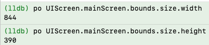
  
  * 系统通知`UIDeviceOrientationDidChangeNotification`也是需要服从界面UI的生命周期，否则取值不成功
  
  * 其实系统有2个维度来读取是否横屏
    * 设备真实的方向（定义手机横卧为横屏）
    * 在`AppDelegate`里面，对<font color=green>`- (UIInterfaceOrientationMask)application:(UIApplication *)application supportedInterfaceOrientationsForWindow:(UIWindow *)window`</font>进行了配置。因为是强制性的横屏呈现，所以<font color=red>**优先级最高**</font>
    
  * <font color=red>`- (BOOL)application:(UIApplication *)application didFinishLaunchingWithOptions:(NSDictionary *)launchOptions`</font> 的执行早于<font color=green>`- (UIInterfaceOrientationMask)application:(UIApplication *)application supportedInterfaceOrientationsForWindow:(UIWindow *)window`</font>
  
  * <font color=green>`- (UIInterfaceOrientationMask)application:(UIApplication *)application supportedInterfaceOrientationsForWindow:(UIWindow *)window`</font> **会执行多次**
  
  * 如果配置了<font color=green>`- (UIInterfaceOrientationMask)application:(UIApplication *)application supportedInterfaceOrientationsForWindow:(UIWindow *)window`</font>为横屏模式（默认为竖屏模式），但是终值为竖屏，**则为错误读取**
  
  * 如果不配置<font color=green>`- (UIInterfaceOrientationMask)application:(UIApplication *)application supportedInterfaceOrientationsForWindow:(UIWindow *)window`</font>为横屏模式（默认为竖屏模式），则以当前设备定位为准
  
  * 对于页面，因为需要自适应调整，那么以靠后的生命周期读取值为准。比如在**viewController**里面`-(void)viewDidAppear:(BOOL)animated`的值为最终系统在综合各种因素后调整后的值。<font color=red>**不要去关心中间值，以终值为准，这样方便定位我们从何时调用方法为有效调用**</font>
  
  * **一般的架构是将`UITabBarController`及其子类作为根控制器，那么在呈现页面的时候，内部会去调整UI适配横竖屏。所以，`UITabBarController`及其子类以及挂载在上面的子控制器，均是需要在页面生命周期走完以后（即，`-(void)viewDidAppear:(BOOL)animated`以后）才能获取到正确的值**
  
  * [**如果锚定`UIDevice.currentDevice.orientation`**](#锚定`UIDevice.currentDevice.orientation`)
    * `UIDevice.currentDevice.orientation`不是总是有效。在应用启动时，设备方向信息有时可能还没有完全初始化，这可能导致得到 `UIDeviceOrientationUnknown`
    * <font color=red>不能配置 </font> <font color=green>`- (UIInterfaceOrientationMask)application:(UIApplication *)application supportedInterfaceOrientationsForWindow:(UIWindow *)window`</font> <font color=red>因为竖屏检测会失败 </font>
    
    * 如果当前控制器为`UITabBarController`及其子类，`-(void)viewDidAppear:(BOOL)animated`生命周期以后（包含），方位数据才正常
    * 如果当前控制器为普通的`UIViewController`及其子类，则全部生命周期正常
    
  * [**如果锚定场景方向`UIInterfaceOrientation`**](#锚定场景方向`UIInterfaceOrientation`)，则需要在相关控制器的`-(void)viewDidAppear:(BOOL)animated`生命周期（包含）以后，才会获取到真正的`UIInterfaceOrientation`
  
  * [**如果锚定`view.traitCollection.verticalSizeClass`**](#锚定`view.traitCollection.verticalSizeClass`)，则需要配置 <font color=green>`- (UIInterfaceOrientationMask)application:(UIApplication *)application supportedInterfaceOrientationsForWindow:(UIWindow *)window`</font> 方可正常检测横竖屏

### 13、🧰 <font color=red>**全局工具箱**</font> <a href="#前言" style="font-size:17px; color:green;"><b>🔼</b></a> <a href="#🔚" style="font-size:17px; color:green;"><b>🔽</b></a>

* [**JobsAppTools**](https://github.com/JobsKits/JobsOCBaseConfigDemo/tree/main/JobsOCBaseConfigDemo/JobsOCBaseCustomizeUIKitCore/NSObject/BaseObject/JobsAppTools) （单例模式）

* [**NSObject+AppTools**](https://github.com/JobsKits/JobsOCBaseConfigDemo/tree/main/JobsOCBaseConfigDemo/JobsOCBaseCustomizeUIKitCore/NSObject/NSObject+Category/NSObject+AppTools) （分类模式）

* [**`FileFolderHandleModel`**](https://github.com/JobsKits/JobsOCBaseConfigDemo/tree/main/JobsOCBaseConfigDemo/JobsOCBaseCustomizeUIKitCore/NSObject/BaseObject/FileFolderHandleTool)：**文件夹操作**

  * ```ruby
    pod 'TXFileOperation' # 文件夹操作 https://github.com/xtzPioneer/TXFileOperation
    ```

    ```objective-c
    #if __has_include(<TXFileOperation/TXFileOperation.h>)
    #import <TXFileOperation/TXFileOperation.h>
    #else
    #import "TXFileOperation.h"
    #endif
    ```

* [**`JobsLoadingImage`**](https://github.com/JobsKits/JobsOCBaseConfigDemo/blob/main/JobsOCBaseConfigDemo/JobsOCBaseCustomizeUIKitCore/UIImage/JobsLoadingImage.h)：**图片存取**

### 14、<font color=red>`UIView` 和 `UIViewController`</font> <a href="#前言" style="font-size:17px; color:green;"><b>🔼</b></a> <a href="#🔚" style="font-size:17px; color:green;"><b>🔽</b></a>

* 两者都是属于UI层

* 因为`UIViewController`里面也包含了一部分数据层，不利于解耦。所以在[**Flutter**](https://flutter.dev)中对UI层和数据层进行完全的剥离，即一个UI层带一个状态（State）

* `View`层可以允许初始化方法带参（Frame）。而`UIViewController`是控制器，通常铺满整个屏幕，所以不需要带参（Frame）初始化

* 两者的生命周期有很大区别。主要关系到UI布局和进数据

* <font color=red>**因为是继承，所以创建和销毁必须调用父类，否则异常**</font>。<font size=2>因为是ARC模式，所以`-(void)dealloc`方法不需要调用父类</font>

* 一般`View`不会独立存在，会依附于`UIViewController`。<font color=red>就要求`ViewController`需要观察是否正常销毁</font>（即，退出页面是否执行`-(void)dealloc`方法）。<font color=blue>如果对象没有成功销毁，会影响数据的写入，且下一次新建对象的时候，会优先执行上一个对象的`-(void)dealloc`方法</font>

#### 14.1、`UIViewController`的生命周期 <a href="#前言" style="font-size:17px; color:green;"><b>🔼</b></a> <a href="#🔚" style="font-size:17px; color:green;"><b>🔽</b></a>

* **初始化方法**`-(instancetype)init`：最早装载本页面数据的时机
    * `- (void)loadView`：**一般在此方法里面装载**本页面的固定数据和刷新的数据（比如网络请求的数据）
    * `- (void)viewDidLoad`：最晚装载本页面数据的时机。**只要本页面没有被销毁，则此方法只执行一次**
    * `-(void)viewWillAppear:(BOOL)animated`：不建议在此生命周期方法及其以后装载本页面的一些固定的数据，刷新的数据（比如网络请求的数据）可以。**只要出现本页面都会走一次**
    * `-(void)viewDidAppear:(BOOL)animated`：同上
    * `-(void)viewWillLayoutSubviews`：页面UI进行调整的时候，都会执行（多次运行，直到UI布局）稳定。**这里取值可能是过程值，有可能不准确**
    * `-(void)viewDidLayoutSubviews `：同上
    
* 销毁流程
    * `-(void)viewWillDisappear:(BOOL)animated`
    * `-(void)viewDidDisappear:(BOOL)animated`
    * `-(void)dealloc`
    
* Push 和 Pop
  
    * A Push B 
    
      ```objective-c
      loadView@B
      viewDidLoad@B
      viewWillDisappear@A
      viewWillAppear@B
      出现界面B
      viewDidDisappear@1
      viewDidAppear@B
      ```
    
    * B Pop A 

      ```objective-c
      viewWillDisappear@B
      viewWillAppear@A
      出现界面A
      viewDidDisappear@B
      viewDidAppear@A
      ```
    

#### 14.2、`UIView`的生命周期 <a href="#前言" style="font-size:17px; color:green;"><b>🔼</b></a> <a href="#🔚" style="font-size:17px; color:green;"><b>🔽</b></a>

* **初始化方法** `-(instancetype)init`：最根本的初始化方法

  * **初始化方法（带参Frame）**`-(instancetype)initWithFrame:(CGRect)frame`
  * `- (void)layoutSubviews`：只要布局UI，此方法会执行多次，直到UI布局稳定。**这里取值可能是过程值，有可能不准确**
  * `-(void)drawRect:(CGRect)rect`：UI布局完成，进行绘制，**只会执行一次**
  * `- (void)layoutIfNeeded`：<font color=red>如果利用`Masonry`进行布局，不可能马上得到**Frame**值。但是如果需要马上得到**Frame**值，就需要在最顶层的父View上执行`layoutIfNeeded`，在子View上执行得到的值为过程值，可能不准确。</font>

* 销毁流程

  * 如果当前View是单例模式，则需要

    ```objective-c
    static JobsMenuView *JobsMenuViewInstance = nil;
    static dispatch_once_t JobsMenuViewOnceToken;
    + (void)destroyInstance {
        JobsMenuViewOnceToken = 0;
        JobsMenuViewInstance = nil;
    }
    ```

  * ```objective-c
    -(void)dealloc
    ```

### 15、<font color=red>**`AppDelegate`** 和 **`SceneDelegate`** </font> <a href="#前言" style="font-size:17px; color:green;"><b>🔼</b></a> <a href="#🔚" style="font-size:17px; color:green;"><b>🔽</b></a>

* 在iOS 13及更高版本中，Apple引入了多窗口支持，这意味着一个应用程序可以拥有多个场景（Scene），每个场景都有自己的生命周期和界面

* 这种多场景架构允许应用程序支持多窗口环境，特别是在iPad上，每个窗口可以有自己独立的生命周期和界面

* 一个iOS应用程序App的生命周期里面，只有一个**`AppDelegate`**实例存在，但是可能有多个**`SceneDelegate`**实例存在

  * **AppDelegate**：应用程序的委托对象。整个应用程序在其生命周期中只有一个`AppDelegate`实例，负责处理应用程序级别的事件，例如应用程序的启动、终止、后台和前台切换等
  * **SceneDelegate**：场景的委托对象。每个场景都有一个`SceneDelegate`实例，负责处理该场景级别的事件，例如场景的连接、断开、后台和前台切换等。在多窗口应用程序中，可能有多个`SceneDelegate`实例，每个实例对应一个场景

* <font color=red>故，**AppDelegate** 可以设计成为单例</font>

  ```objective-c
  static AppDelegate *AppDelegateInstance = nil;
  static dispatch_once_t AppDelegateOnceToken;
  +(instancetype)sharedManager{
      dispatch_once(&AppDelegateOnceToken, ^{
          AppDelegateInstance = [super allocWithZone:NULL].init;
      });return AppDelegateInstance;
  }
  /// 单例的销毁
  +(void)destroyInstance{
      AppDelegateOnceToken = 0;
      AppDelegateInstance = nil;
  }
  /// 防止外部使用 alloc/init 等创建新实例
  +(instancetype)allocWithZone:(struct _NSZone *)zone{
      dispatch_once(&AppDelegateOnceToken, ^{
          AppDelegateInstance = [super allocWithZone:zone];
      });return AppDelegateInstance;
  }
  
  -(instancetype)copyWithZone:(NSZone *)zone{
      return self;
  }
  
  -(instancetype)mutableCopyWithZone:(NSZone *)zone{
      return self;
  }
  
  -(instancetype)init{
      if (self = [super init]) {
  
      }return self;
  }
  ```

* 关于 **`UIWindow *`**

  * 每个`SceneDelegate`实例都有自己的`UIWindow`，而不再是通过`AppDelegate`共享一个单独的`UIWindow`实例
  * 即便是单场景App， `SceneDelegate`和 `AppDelegate`都有各自的`UIWindow`
  * `AppDelegate`中的`window`属性在多场景应用中实际上不再被使用。这是为了向后兼容一些现有代码，但在多场景环境下，`AppDelegate`不会处理任何具体的窗口
  * 在多场景架构下，`SceneDelegate`中的`window`是实际显示和管理UI的窗口，而`AppDelegate`中的`window`只是为了兼容老的单窗口应用

* 获取 **AppDelegate**

  * ```objective-c
    UIApplication.sharedApplication.delegate;
    ```

  * ```objective-c
    AppDelegate.sharedManager;
    ```

* 获取 **SceneDelegate**

  * ```objective-c
    if (@available(iOS 13.0, *)) {
    	sceneDelegate = UIApplication.sharedApplication.connectedScenes.allObjects.firstObject.delegate;
    }
    ```

  * 上述 `firstObject` 只能作为旧单窗口示意，不能用于多场景业务。页面应从自己的 `view.window.windowScene` 获取当前 Scene，再使用该 Scene 的 `session` 和 `delegate`。

#### 15.1、SceneDelegate 多场景与窗口会话 Demo

* 根列表提供独立入口 `JobsOCSceneDelegateDemoVC`，不是静态说明页：
  * 新建 Scene 窗口，并通过 `NSUserActivity` 直接路由到 Demo
  * 激活已有 Scene、关闭当前 Scene、请求刷新 `UISceneSession`
  * 展示 `supportsMultipleScenes`、`connectedScenes`、`openSessions`、会话 ID、角色和激活状态
  * 用每个 Scene 独立计数验证状态隔离，并由 `stateRestorationActivityForScene:` 恢复
  * 实时记录连接、前后台、活跃、失活、断开等 Scene 生命周期事件
* `JobsOCSceneCoordinator` 按 `UISceneSession.persistentIdentifier` 管理 Demo 状态；当前工程直接集成到主工程，不新增 Pod 依赖。
* `NSUserActivity` 的带参构造统一由 `NSUserActivity.initByActivityType(activityType)` 唤起，标题、`userInfo`、handoff / prediction 开关和生命周期动作继续走实例 `byXxx(...)`；时间格式器由 `jobsMakeDateFormatter(config Block)` 创建并在 Block 内配置，调用方不再直接 `new` / `alloc-init`。
* 已移除全局 `SceneDelegate *` 缓存。`AppDelegate` 仍只管理进程级能力；每个 `SceneDelegate` 持有自己的 `UIWindow`。
* `UIApplicationSupportsMultipleScenes` 只是声明；运行时还要以 `UIApplication.sharedApplication.supportsMultipleScenes` 为准。建议在支持多窗口的 iPad 环境验证完整流程。
* 场景操作按钮始终保留点击能力；当前设备不支持多窗口、没有可激活的其它 Scene、只剩最后一个 Scene，或页面尚未绑定当前 Scene 时，会立即通过 Toast 说明原因，不再静默禁用。
* 深入研究入口：[Supporting multiple windows on iPad](https://developer.apple.com/documentation/uikit/supporting-multiple-windows-on-ipad)、[Managing your app's life cycle](https://developer.apple.com/documentation/uikit/managing-your-app-s-life-cycle)、[UISceneSession](https://developer.apple.com/documentation/uikit/uiscenesession)。

### 16、**`UIScrollView` **的滚动生命周期 <a href="#前言" style="font-size:17px; color:green;"><b>🔼</b></a> <a href="#🔚" style="font-size:17px; color:green;"><b>🔽</b></a>

* 有2种方式驱动滚动效果

  * 用户手动拖拽（拖拽过程的执行生命周期，由上至下。<font color=red>**只会执行一次**</font>）

    * ```objective-c
      -(void)scrollViewWillBeginDragging:(UIScrollView *)scrollView;
      ```

    * ```objective-c
      -(void)scrollViewWillEndDragging:(UIScrollView *)scrollView 
                          withVelocity:(CGPoint)velocity
                   targetContentOffset:(inout CGPoint *)targetContentOffset
      ```

    * ```objective-c
      -(void)scrollViewDidEndDragging:(UIScrollView *)scrollView
                       willDecelerate:(BOOL)decelerate
      ```

  * 代码事件触发，改变`UIScrollView.contentOffset`

* <font color=red>**`- (void)scrollViewDidScroll:(UIScrollView *)scrollView`**</font>

  * 不管是哪种方式驱动的滚动效果，最终都会汇集到这个方法里面
  * 只要在滚动，<font color=red>**这个方法一定会重复多次的调用**</font>
  * 如果开启了分页滚动，即：`UIScrollView.pagingEnabled = YES;`。如果`scrollView.contentOffset.x`为负，<u>最后在这个方法里面会被调整为0</u>
  * 因为这个方法会被反复调用多次，所以一般的逻辑处理，不建议在这里进行处理

### 17、对象间传值比较（**通知**/**Block**/**协议**）<a href="#前言" style="font-size:17px; color:green;"><b>🔼</b></a> <a href="#🔚" style="font-size:17px; color:green;"><b>🔽</b></a>

#### 17.1、正向传值一般是通过初始化方法、属性等手段正向传入  <a href="#前言" style="font-size:17px; color:green;"><b>🔼</b></a> <a href="#🔚" style="font-size:17px; color:green;"><b>🔽</b></a>

#### 17.2、一般重点关注对象的反向传值  <a href="#前言" style="font-size:17px; color:green;"><b>🔼</b></a> <a href="#🔚" style="font-size:17px; color:green;"><b>🔽</b></a>

* **通知**
  * 万能的上帝模式。但<font color=red>**不建议过分的使用**</font>
  * 有一定的系统开销，在最开始的iOS版本里面，通知的使用是有上限的。后期版本可以无限制的使用
  * 如果对象释放的时候，不手动对其通知进行释放，可能会造成对象内存的溢出。所以，在iOS7以后，即便不写移除通知，系统帮我们解决
  
* **Block**
  
  * C语言底层的API，执行效率高。但是<font color=red>**只能单项订阅**</font>，<u>后出现的Block实现会覆盖掉之前的Block实现</u>。即，如果需要多个地方接收到数据，则不行
  * **Block不一定开异步线程**
  * 可以实现类似于内部类的功能
  * <font color=red>**如果数据的发出发和接收方之间存在若干对象，需要层层反向传值，比较冗余**</font>
  * 依附于实例变量，需要关注循环引用的问题
  
* **协议**
  
  * **协议也可以提取公共的头文件，作为一个规范，而广泛遵守**
  
  * 引申出一个中间对象：代理（**Delegate**）。对<font color=red>**代理检测和回调**</font>的封装
  
    * ```objective-c
      /// 代理用weak修饰，因为要调用NSObject层分类封装的方法，所以不能是id类型
      @property(nonatomic,weak)NSObject <MianTableViewCellDelegate>*delegate;
      ```
  
    * **@implementation NSObject (Extras)**
  
      ```objective-c
      @jobs_weakify(self)
      self.delegate.jobsDelegate(@"mianTableViewCellScrollerDid:",^(){
      		@jobs_strongify(self)
          self.delegate.mianTableViewCellScrollerDid(scrollView);
      });
      ```
  
  * 依附于实例变量。**协议同样存在循环引用的问题**
  
  * 可以多点订阅，解决Block的痛点
  
  * 容易造成代码割裂。<u>如果修改协议方法的定义，对应的协议方法的实现不会有警告或者报错，会降格为普通方法，会造成代码业务逻辑的变更</u>

#### 17.3、总结 <a href="#前言" style="font-size:17px; color:green;"><b>🔼</b></a> <a href="#🔚" style="font-size:17px; color:green;"><b>🔽</b></a>

* 一般建议系统级别的，使用通知。例如：检测键盘、横竖屏...
* 对象间传值一般的业务场景是：需要传值的对象之间至多有一个中间对象。此时建议用**Block**
* <font color=red>如果需要涉及到多点订阅，那么使用**通知**或者**协议**</font>

### 18、数据解析 <a href="#前言" style="font-size:17px; color:green;"><b>🔼</b></a> <a href="#🔚" style="font-size:17px; color:green;"><b>🔽</b></a>

#### 18.1、对 `json`数据的解析  <a href="#前言" style="font-size:17px; color:green;"><b>🔼</b></a> <a href="#🔚" style="font-size:17px; color:green;"><b>🔽</b></a>

* 对待data是数组

  ```objective-c
  NSMutableArray <VideoTagModel *>*tags = [VideoTagModel mj_objectArrayWithKeyValuesArray:data];
  ```

* 对待data是字典

  ```objective-c
  DDMyVipModel *myVipModel = [DDMyVipModel mj_objectWithKeyValues:data]; 
  ```
  
* 二次封装

  ```objective-c
  @implementation NSObject (Data)
  #pragma mark —— 关于数据（MJExtension）解析
  /// 对待输入参数是含字典的数组
  +(JobsRetArrByArrBlock _Nullable)byDataArr{
      @jobs_weakify(self)
      return ^__kindof NSArray *_Nullable(__kindof NSArray <NSDictionary *>*_Nullable data){
          @jobs_strongify(self)
          return [self.class mj_objectArrayWithKeyValuesArray:data];
      };
  }
  /// 对待输入参数是字典
  +(JobsRetIDByDicBlock _Nullable)byDataDic{
      @jobs_weakify(self)
      return ^id _Nullable(__kindof NSDictionary *_Nullable data){
          @jobs_strongify(self)
          return [self.class mj_objectWithKeyValues:data];
      };
  }
  /// 万能解析
  +(JobsRetIDByIDBlock _Nullable)byData{
      @jobs_weakify(self)
      return ^id _Nullable(id _Nullable data){
          @jobs_strongify(self)
          if(KindOfDicCls(data)) return [self.class mj_objectWithKeyValues:data];
          if(KindOfArrCls(data)) return [self.class mj_objectArrayWithKeyValuesArray:data];
          return nil;
      };
  }
  
  @end
  ```
  
* 字段替换：接口返回字段<font color=red>**id**</font>和OC关键字<font color=red>**id**</font>重合冲突，这里用<font color=green>**jj**</font>替换<font color=red>**id**</font>

  ```objective-c
  + (NSDictionary *)mj_replacedKeyFromPropertyName {
      return @{
          @"jj" : @"id"
      };
  }
  ```
  
* 字段映射

  * **`- (id)mj_newValueFromOldValue:(id)oldValue property:(MJProperty *)property `**解析 JSON 数据时，对模型属性的值进行自定义处理。

    可以通过重写这个方法，来实现对某些属性的特殊处理，比如数据转换或默认值设置

    ```objective-c
    // 重写这个方法进行自定义数据处理
    - (id)mj_newValueFromOldValue:(id)oldValue 
                         property:(MJProperty *)property {
        if ([property.name isEqualToString:@"age"]) {
            NSInteger age = [oldValue integerValue];
            if (age < 0) {
                return @(0); // 如果 age 小于 0，返回 0
            }
        } return oldValue;// 默认返回旧值
    }
    ```

  * **`+ (NSDictionary *)mj_objectClassInArray`** <font color=red>**解析模型里面的数组**</font>

    ```objective-c
    Prop_strong()NSArray<FMGameListModel *> *gameList; 
    // 告诉 MJExtension "gameList" 是一个 FMGameListModel 数组
    + (NSDictionary *)mj_objectClassInArray {
        return @{
            @"gameList" : FMGameListModel.class
        };
    }
    ```

#### 18.2、对图片URL数据的解析（对`SDWebImage`的二次封装） <a href="#前言" style="font-size:17px; color:green;"><b>🔼</b></a> <a href="#🔚" style="font-size:17px; color:green;"><b>🔽</b></a>

* ```ruby
  pod 'SDWebImage' # https://github.com/SDWebImage/SDWebImage YES_SMP
  ```

* ```objective-c
  #if __has_include(<SDWebImage/SDWebImage.h>)
  #import <SDWebImage/SDWebImage.h>
  #else
  #import "SDWebImage.h"
  #endif
  ```

* [**@interface UIImageView (SDWebImage)**]()

  ```objective-c
  self.bgImageView
      .imageURL(model.url)
      .placeholderImage(model.bgImage)
      .options(SDWebImageRefreshCached)/// 强制刷新缓存
      .completed(^(UIImage * _Nullable image,
                   NSError * _Nullable error,
                   SDImageCacheType cacheType,
                   NSURL * _Nullable imageURL) {
          if (error) {
              NSLog(@"图片加载失败: %@-%@", error,imageURL);
          } else {
              NSLog(@"图片加载成功");
          }
      }).load();
  ```
  
  [**@interface UIButton (SDWebImage）**]()
  
  ```objective-c
   self.headBtn.imageURL(self.BaseUrl.add(model.iosImage).jobsUrl)
           .placeholderImage(model.image)
           .options(SDWebImageRefreshCached)/// 强制刷新缓存
           .completed(^(UIImage * _Nullable image,
                        NSError * _Nullable error,
                        SDImageCacheType cacheType,
                        NSURL * _Nullable imageURL) {
               if (error) {
                   NSLog(@"图片加载失败: %@-%@", error,imageURL);
               } else {
                   NSLog(@"图片加载成功");
               }
           }).normalLoad();
  ```
  
  ```objective-c
  self.headBtn.imageURL(self.BaseUrl.add(self.loginModel.avatar).jobsUrl)
          .placeholderImage(self.loginModel.userDefaultHeadImage)
          .options(SDWebImageRefreshCached)/// 强制刷新缓存
          .completed(^(UIImage * _Nullable image,
                       NSError * _Nullable error,
                       SDImageCacheType cacheType,
                       NSURL * _Nullable imageURL) {
              if (error) {
                  NSLog(@"图片加载失败: %@-%@", error,imageURL);
              } else {
                  NSLog(@"图片加载成功");
              }
          }).bgNormalLoad();
  ```

### 19、水平菜单切换 <a href="#前言" style="font-size:17px; color:green;"><b>🔼</b></a> <a href="#🔚" style="font-size:17px; color:green;"><b>🔽</b></a>

* 对于子菜单是视图控制器的：推荐使用[<font size=5>**`JXCategoryView`**</font>](https://github.com/pujiaxin33/JXCategoryView)

  ```objective-c
  #if __has_include(<JXCategoryView/JXCategoryView.h>)
  #import <JXCategoryView/JXCategoryView.h>
  #else
  #import "JXCategoryView.h"
  #endif
  ```

  ```objective-c
  <
  JXCategoryTitleViewDataSource
  ,JXCategoryListContainerViewDelegate
  ,JXCategoryViewDelegate
  >
  ```

  ```objective-c
  #ifndef listContainerViewDefaultOffset
  #define listContainerViewDefaultOffset JobsWidth(50)
  #endif
  ```

  ```objective-c
  Prop_strong()JXCategoryListContainerView *listContainerView;/// 此属性决定依附于此的viewController
  -(JXCategoryListContainerView *)listContainerView{
      if (!_listContainerView) {
          @jobs_weakify(self)
          _listContainerView = self.view.addSubview(jobsMakeCategoryListContainerViewByCollectionViewStyle(self)
                                                    .byDefaultSelectedIndex(1))/// 默认从第二个开始显示)
          .setMasonryBy(^(MASConstraintMaker *_Nonnull make){
              @jobs_strongify(self)
  //            make.edges.equalTo(self.view);
              make.top.equalTo(self.gk_navigationBar.mas_bottom).offset(listContainerViewDefaultOffset);
              make.left.right.bottom.equalTo(self.view);
          }).on();
          /// ❤️在需要的地方写❤️
          NSNumber *currentIndex = self.listContainerView.valueForKey(@"currentIndex");
          NSLog(@"滑动或者点击以后，改变控制器，得到的目前最新的index = %d",currentIndex.intValue);
      }return _listContainerView;
  }
  Prop_strong()NSMutableArray <__kindof UIViewController<JXCategoryListContentViewDelegate> *>*childVCMutArr;
  -(NSMutableArray<__kindof UIViewController<JXCategoryListContentViewDelegate> *> *)childVCMutArr{
      if(!_childVCMutArr){
          _childVCMutArr = jobsMakeMutArr(^(__kindof NSMutableArray <__kindof UIViewController<JXCategoryListContentViewDelegate> *>* _Nullable arr) {
              arr.add(FMPromoAllVC.new)
                  .add(FMPromoNewComerVC.new)
                  .add(FMPromoDailyVC.new)
                  .add(FMPromoLimitedVC.new)
                  .add(FMPromoOfferVC.new);
          });
      }return _childVCMutArr;
  }
  Prop_copy()NSMutableArray <__kindof NSString *>*titles;
  -(NSMutableArray<__kindof NSString *> *)titles{
      if(!_titles){
          _titles = jobsMakeMutArr(^(__kindof NSMutableArray <NSString *>* _Nullable arr) {
              arr.add(JobsInternationalization(@"ALL"))
                  .add(JobsInternationalization(@"NEWCOMER"))
                  .add(JobsInternationalization(@"DAILY"))
                  .add(JobsInternationalization(@"LIMITED"))
                  .add(JobsInternationalization(@"OFFER"));
          });
      }return _titles;
  }
  #pragma mark JXCategoryTitleViewDataSource
  //// 如果将JXCategoryTitleView嵌套进UITableView的cell，每次重用的时候，JXCategoryTitleView进行reloadData时，会重新计算所有的title宽度。所以该应用场景，需要UITableView的cellModel缓存titles的文字宽度，再通过该代理方法返回给JXCategoryTitleView。
  //// 如果实现了该方法就以该方法返回的宽度为准，不触发内部默认的文字宽度计算。
  //- (CGFloat)categoryTitleView:(JXCategoryTitleView *)titleView
  //               widthForTitle:(NSString *)title{
  //
  //    return 10;
  //}
  #pragma mark JXCategoryListContainerViewDelegate
  /**
   返回list的数量
  
   @param listContainerView 列表的容器视图
   @return list的数量
   */
  - (NSInteger)numberOfListsInlistContainerView:(JXCategoryListContainerView *)listContainerView{
      return self.titles.count;
  }
  /**
   根据index初始化一个对应列表实例，需要是遵从`JXCategoryListContentViewDelegate`协议的对象。
   如果列表是用自定义UIView封装的，就让自定义UIView遵从`JXCategoryListContentViewDelegate`协议，该方法返回自定义UIView即可。
   如果列表是用自定义UIViewController封装的，就让自定义UIViewController遵从`JXCategoryListContentViewDelegate`协议，该方法返回自定义UIViewController即可。
  
   @param listContainerView 列表的容器视图
   @param index 目标下标
   @return 遵从JXCategoryListContentViewDelegate协议的list实例
   */
  - (id<JXCategoryListContentViewDelegate>)listContainerView:(JXCategoryListContainerView *)listContainerView
                                            initListForIndex:(NSInteger)index{
      return self.childVCMutArr[index];
  }
  #pragma mark JXCategoryViewDelegate
  ///【点击的结果】点击选中的情况才会调用该方法。传递didClickSelectedItemAt事件给listContainerView
  - (void)categoryView:(JXCategoryBaseView *)categoryView
  didClickSelectedItemAtIndex:(NSInteger)index {
      [self.listContainerView didClickSelectedItemAtIndex:index];
  }
  ///【点击选中或者滚动选中的结果】点击选中或者滚动选中都会调用该方法。适用于只关心选中事件，不关心具体是点击还是滚动选中的。
  - (void)categoryView:(JXCategoryBaseView *)categoryView
  didSelectedItemAtIndex:(NSInteger)index {
      
  }
  ///【滚动选中的结果】滚动选中的情况才会调用该方法
  - (void)categoryView:(JXCategoryBaseView *)categoryView 
  didScrollSelectedItemAtIndex:(NSInteger)index{
      
  }
  /// 传递scrolling事件给listContainerView，必须调用！！！
  - (void)categoryView:(JXCategoryBaseView *)categoryView
  scrollingFromLeftIndex:(NSInteger)leftIndex
          toRightIndex:(NSInteger)rightIndex
                 ratio:(CGFloat)ratio {
      NSLog(@"");
  //    [self.listContainerView scrollingFromLeftIndex:leftIndex
  //                                      toRightIndex:rightIndex
  //                                             ratio:ratio
  //                                     selectedIndex:categoryView.selectedIndex];
  }
  ```

  * ```objective-c
    Prop_strong()JXCategoryTitleView *categoryView;/// 文字
     -(JXCategoryTitleView *)categoryView{
         if(!_categoryView){
             @jobs_weakify(self)
             _categoryView = jobsMakeCategoryTitleView(^(JXCategoryTitleView * _Nullable view) {
                 @jobs_strongify(self)
                 view.byTitleSelectedColor(JobsRedColor)¡
                     .byTitleColor(JobsGrayColor)
                     .byTitleFont(UIFontWeightRegularSize(JobsWidth(10)))
                     .byTitleSelectedFont(UIFontWeightRegularSize(JobsWidth(11)))
                     .byTitles(self.titles)
                     .byTitleColorGradientEnabled(YES)
                     .byIndicators(jobsMakeMutArr(^(__kindof NSMutableArray <JXCategoryIndicatorBackgroundView *>* _Nullable arr) {
                         arr.add(jobsMakeCategoryIndicatorLineView(^(JXCategoryIndicatorLineView * _Nullable indicator) {
                             indicator.indicatorColor = HEXCOLOR(0xFFEABA);
                             indicator.indicatorHeight = JobsWidth(4);
                             indicator.indicatorWidthIncrement = JobsWidth(10);
                             indicator.verticalMargin = 0;
                         }));
                     }))/// 跟随的指示器（二选一）
                     .byIndicators(jobsMakeMutArr(^(__kindof NSMutableArray <JXCategoryIndicatorBackgroundView *>* _Nullable arr) {
                         arr.add(jobsMakeCategoryIndicatorBackgroundView(^(JXCategoryIndicatorBackgroundView * _Nullable bgView) {
                             bgView.indicatorHeight = JobsWidth(30);
                             bgView.indicatorWidth = JobsWidth(76);
                             bgView.indicatorColor = HEXCOLOR(0xFFEABA);
                             bgView.indicatorCornerRadius = JXCategoryViewAutomaticDimension;
                         }));
                     }))/// 跟随的指示器（二选一）BackgroundView 椭圆形
                     .byDefaultSelectedIndex(1)/// 默认从第二个开始显示
                     .byCellSpacing(JobsWidth(-20))
                     .byContentScrollView(self.listContainerView.scrollView)/// 关联cotentScrollView，关联之后才可以互相联动！！！
                     .byDelegate(self)
                     .byBgCor(JobsClearColor);
             })
             .addOn(self)
             .byAdd(^(MASConstraintMaker *make) {
                 @jobs_strongify(self)
                 make.centerY.equalTo(self);
                 make.left.equalTo(self);
                 make.right.equalTo(self.cancelBtn.mas_left);
                 make.height.mas_equalTo(self.mj_h - JobsWidth(15));
             })
         }return _categoryView;
     }
    ```
    
  * ```objective-c
    Prop_strong()JXCategoryImageView *categoryView;/// 纯图
     -(JXCategoryImageView *)categoryView{
         if (!_categoryView) {
             @jobs_weakify(self)
             _categoryView = jobsMakeCategoryImageView(^(JXCategoryImageView * _Nullable view) {
                 view.byImageNames(jobsMakeMutArr(^(__kindof NSMutableArray <NSString *>* _Nullable arr) {
                     arr.add(@"彩票_已选择")
                         .add(@"电子_已选择")
                         .add(@"棋牌_已选择")
                         .add(@"全部游戏_已选择")
                         .add(@"体育_已选择")
                         .add(@"真人直播_已选择");
                 }))
                 .bySelectedImageNames(jobsMakeMutArr(^(__kindof NSMutableArray <NSString *>* _Nullable arr) {
                     arr.add(@"彩票_已选择")
                         .add(@"电子_已选择")
                         .add(@"棋牌_已选择")
                         .add(@"全部游戏_已选择")
                         .add(@"体育_已选择")
                         .add(@"真人直播_已选择");
                 }))
                 .byImageInfoArray(jobsMakeMutArr(^(__kindof NSMutableArray <NSString *>* _Nullable arr) {
                     arr.add(@"彩票_已选择")
                         .add(@"电子_已选择")
                         .add(@"棋牌_已选择")
                         .add(@"全部游戏_已选择")
                         .add(@"体育_已选择")
                         .add(@"真人直播_已选择");
                 }))
                 .bySelectedImageInfoArray(jobsMakeMutArr(^(__kindof NSMutableArray <NSString *>* _Nullable arr) {
                     arr.add(@"彩票_已选择")
                         .add(@"电子_已选择")
                         .add(@"棋牌_已选择")
                         .add(@"全部游戏_已选择")
                         .add(@"体育_已选择")
                         .add(@"真人直播_已选择");
                 }))
                 .byImageSize(CGSizeMake(JobsWidth(30), JobsWidth(30)))
                 .byImageCornerRadius(JobsWidth(8))
                 .byImageZoomEnabled(YES)
                 .byImageZoomScale(2)
                 .byDefaultSelectedIndex(1)/// 默认从第二个开始显示
                 .byCellSpacing(JobsWidth(-20))
                 .byContentScrollView(self.listContainerView.scrollView)/// 关联cotentScrollView，关联之后才可以互相联动！！！
                 .byIndicators(jobsMakeMutArr(^(__kindof NSMutableArray <JXCategoryIndicatorLineView *>* _Nullable arr) {
                     arr.add(jobsMakeCategoryIndicatorLineView(^(JXCategoryIndicatorLineView * _Nullable view) {
                         view.indicatorColor = HEXCOLOR(0xFFEABA);
                         view.indicatorHeight = JobsWidth(4);
                         view.indicatorWidthIncrement = JobsWidth(10);
                         view.verticalMargin = 0;
                     }));
                 }))/// 二选一
                 .byIndicators(jobsMakeMutArr(^(__kindof NSMutableArray * _Nullable arr) {
                     arr.add(jobsMakeCategoryIndicatorBackgroundView(^(JXCategoryIndicatorBackgroundView * _Nullable view) {
                         view.indicatorHeight = JobsWidth(30);
                         view.indicatorWidth = JobsWidth(76);
                         view.indicatorColor = HEXCOLOR(0xFFEABA);
                         view.indicatorCornerRadius = JXCategoryViewAutomaticDimension;
                     }));
                 }))/// 二选一
                 .byDelegate(self)
                 .byBgCor(JobsClearColor);
             })
             .addOn(self)
             .byAdd(^(MASConstraintMaker *make) {
                 @jobs_strongify(self)
                 make.top.equalTo(self.gk_navigationBar.mas_bottom).offset(0);
                 make.left.right.equalTo(self.view);
                 make.height.mas_equalTo(listContainerViewDefaultOffset);
             });
         }return _categoryView;
     }
    ```
    
  * ```objective-c
    Prop_strong()JXCategoryDotView *categoryView;/// 右上角带红点
     -(JXCategoryDotView *)categoryView{
         if (!_categoryView) {
             @jobs_weakify(self)
             _categoryView = jobsMakeCategoryDotView(^(JXCategoryDotView * _Nullable view) {
                 view.byDotStates(jobsMakeMutArr(^(__kindof NSMutableArray <NSNumber *>* _Nullable arr) {
                     arr.add(@YES)
                         .add(@NO)
                         .add(@NO)
                         .add(@NO)
                         .add(@NO)
                         .add(@NO);
                 }))
                 .byDotSize(CGSizeMake(JobsWidth(5), JobsWidth(5)))
                 .byTitleSelectedColor(HEXCOLOR(0xAE8330))
                 .byTitleColor(HEXCOLOR(0xC4C4C4))
                 .byTitleFont(UIFontWeightBoldSize(JobsWidth(12)))
                 .byTitleSelectedFont(UIFontWeightBoldSize(JobsWidth(14)))
                 .byDefaultSelectedIndex(1)/// 默认从第二个开始显示
                 .byTitleColorGradientEnabled(YES)
                 .byTitles(self.titles)
                 .byIndicators(jobsMakeMutArr(^(__kindof NSMutableArray * _Nullable arr) {
                     arr.add(jobsMakeCategoryIndicatorLineView(^(JXCategoryIndicatorLineView * _Nullable view) {
                         view.indicatorColor = HEXCOLOR(0xFFEABA);
                         view.indicatorHeight = JobsWidth(4);
                         view.indicatorWidthIncrement = JobsWidth(10);
                         view.verticalMargin = 0;
                     }));
                 }))/// 二选一
                 .byIndicators(jobsMakeMutArr(^(__kindof NSMutableArray * _Nullable arr) {
                     arr.add(jobsMakeCategoryIndicatorBackgroundView(^(JXCategoryIndicatorBackgroundView * _Nullable view) {
                         view.indicatorHeight = JobsWidth(30);
                         view.indicatorWidth = JobsWidth(76);
                         view.indicatorColor = HEXCOLOR(0xFFEABA);
                         view.indicatorCornerRadius = JXCategoryViewAutomaticDimension;
                     }));
                 }))/// 二选一：BackgroundView 椭圆形
                 .byContentScrollView(self.listContainerView.scrollView)/// 关联cotentScrollView，关联之后才可以互相联动！！！
                 .byListContainer(self.listContainerView)
                 .reloadDatasWithoutListContainer()
                 .byDelegate(self)
                 .byBgCor(HEXCOLOR(0xFCFBFB));
             })
             .addOn(self)
             .byAdd(^(MASConstraintMaker *make) {
                 @jobs_strongify(self)
                 make.top.equalTo(self.gk_navigationBar.mas_bottom);
                 make.left.right.equalTo(self.view);
                 make.height.mas_equalTo(listContainerViewDefaultOffset);
             });
         }return _categoryView;
     }
    
    - (void)categoryView:(JXCategoryBaseView *)categoryView
    didSelectedItemAtIndex:(NSInteger)index {
        self.navigationController.interactivePopGestureRecognizer.enabled = (index == 0);
        //点击以后红点消除
        if ([self.dotStatesMutArr[index] boolValue]) {
            self.dotStatesMutArr[index] = @(NO);
            self.categoryTitleView.dotStates = jobsMakeMutArr(^(__kindof NSMutableArray <NSNumber *>* _Nullable arr) {
                arr.add(@YES)
                    .add(@NO)
                    .add(@NO)
                    .add(@NO)
                    .add(@NO)
                    .add(@NO);
            });[categoryView reloadCellAtIndex:index];
        }
    }
    ```
    
  * ```objective-c
    -(JXCategoryNumberView *)categoryView{
        if (!_categoryView) {
            @jobs_weakify(self)
            _categoryView = jobsMakeCategoryNumberView(^(JXCategoryNumberView * _Nullable view) {
                view.byNumberLabelOffset(CGPointMake(JobsWidth(5), JobsWidth(2)))
                    .byCounts(jobsMakeMutArr(^(__kindof NSMutableArray <NSNumber *>* _Nullable arr) {
                        arr.add(@1)
                            .add(@1)
                            .add(@1)
                            .add(@1)
                            .add(@1)
                            .add(@1);
                    }))
                    /// 内部默认不会格式化数字，直接转成字符串显示。比如业务需要数字超过999显示999+，可以通过该block实现。
                    .byNumberStringFormatterBlock(^NSString *(NSInteger number) {
                        if (number > 999) {
                            return @"999+";
                        }return [NSString stringWithFormat:@"%ld", (long)number];
                    })
                    .byTitles(self.titles)
                    .byTitleSelectedColor(HEXCOLOR(0xAE8330))
                    .byTitleColor(HEXCOLOR(0xC4C4C4))
                    .byTitleFont(UIFontWeightBoldSize(JobsWidth(12)))
                    .byTitleSelectedFont(UIFontWeightBoldSize(JobsWidth(14)))
                    .byDefaultSelectedIndex(1)/// 默认从第二个开始显示
                    .byTitleColorGradientEnabled(YES)
                    .byIndicators(jobsMakeMutArr(^(__kindof NSMutableArray * _Nullable arr) {
                        arr.add(jobsMakeCategoryIndicatorLineView(^(JXCategoryIndicatorLineView * _Nullable view) {
                            view.indicatorColor = HEXCOLOR(0xFFEABA);
                            view.indicatorHeight = JobsWidth(4);
                            view.indicatorWidthIncrement = JobsWidth(10);
                            view.verticalMargin = 0;
                        }));
                    }))/// 二选一
                    .byIndicators(jobsMakeMutArr(^(__kindof NSMutableArray * _Nullable arr) {
                        arr.add(jobsMakeCategoryIndicatorBackgroundView(^(JXCategoryIndicatorBackgroundView * _Nullable view) {
                            view.indicatorHeight = JobsWidth(30);
                            view.indicatorWidth = JobsWidth(76);
                            view.indicatorColor = HEXCOLOR(0xFFEABA);
                            view.indicatorCornerRadius = JXCategoryViewAutomaticDimension;
                        }));
                    }))/// 二选一：BackgroundView 椭圆形
                    .byContentScrollView(self.listContainerView.scrollView) /// 关联cotentScrollView，关联之后才可以互相联动！！！
                    .byListContainer(self.listContainerView)
                    .reloadDatasWithoutListContainer()
                    .byDelegate(self)
                    .byBgCor(HEXCOLOR(0xFCFBFB));
            })
            .addOn(self)
            .byAdd(^(MASConstraintMaker *make) {
                @jobs_strongify(self)
                make.top.equalTo(self.gk_navigationBar.mas_bottom);
                make.left.right.equalTo(self.view);
                make.height.mas_equalTo(listContainerViewDefaultOffset);
            });
        }return _categoryView;
    }
    ```
  
* 对于子菜单是视图控制器的：推荐使用`JobsToggleBaseView`

  ```objective-c
  -(JobsToggleBaseView *)toggleBaseView{
      if(!_toggleBaseView){
          @jobs_weakify(self)
          _toggleBaseView = jobsMakeToggleBaseView(^(JobsToggleBaseView * _Nullable toggleBaseView) {
              @jobs_strongify(self)
              toggleBaseView.btn_each_offset = JobsWidth(0);
              toggleBaseView.taggedNavView_width = JobsWidth(230);
              toggleBaseView.taggedNavView_height = JobsWidth(24);
              toggleBaseView.taggedNavViewBgColor = JobsClearColor.colorWithAlphaComponentBy(0);
              toggleBaseView.bySize(CGSizeMake(JobsWidth(346), JobsWidth(216)));
              toggleBaseView.jobsRichViewByModel(jobsMakeMutArr(^(__kindof NSMutableArray <UIButtonModel *>*_Nullable data) {
                  data.add(jobsMakeButtonModel(^(__kindof UIButtonModel * _Nullable data1) {
                      @jobs_strongify(self)
                      data1.baseBackgroundColor = JobsClearColor.colorWithAlphaComponentBy(0);
                      data1.titleFont = bayonRegular(JobsWidth(20));
                      data1.title = JobsInternationalization(@"PHONE NO.");
                      data1.jobsWidth = JobsWidth(90);
                      data1.titleCor = JobsCor(@"#8A93A1");
                      data1.selectedTitleCor = JobsCor(@"#C90000");
                      data1.roundingCorners = UIRectCornerAllCorners;
                      data1.view = FMLoginByPhoneView
                          .BySize(FMLoginByPhoneView.viewSizeByModel(nil))
                          .JobsRichViewByModel2(nil)
                          .JobsBlock1(^(id  _Nullable data) {
  
                          });/// 手机验证码登陆
                      data1.clickEventBlock = ^id _Nullable(__kindof UIButton *_Nullable x){
                          @jobs_strongify(self)
                          if(KindOfBaseButtonCls(x)){
                              self.toggleBaseView.switchViewsBy(x.index);
                          }return nil;
                      };
                  }));
                  data.add(jobsMakeButtonModel(^(__kindof UIButtonModel * _Nullable data1) {
                      @jobs_strongify(self)
                      data1.baseBackgroundColor = JobsClearColor.colorWithAlphaComponentBy(0);
                      data1.titleFont = bayonRegular(JobsWidth(20));
                      data1.title = JobsInternationalization(@"ACCOUNT NAME");
                      data1.jobsWidth = JobsWidth(130);
                      data1.titleCor = JobsCor(@"#8A93A1");
                      data1.selectedTitleCor = JobsCor(@"#C90000");
                      data1.roundingCorners = UIRectCornerAllCorners;
                      data1.view = FMLoginByUsrNameView
                          .BySize(FMLoginByUsrNameView.viewSizeByModel(nil))
                          .JobsRichViewByModel2(nil)
                          .JobsBlock1(^(id  _Nullable data) {
  
                          });/// 用户名密码
                      data1.clickEventBlock = ^id _Nullable(__kindof UIButton *_Nullable x){
                          @jobs_strongify(self)
                          if(KindOfBaseButtonCls(x)){
                              self.toggleBaseView.switchViewsBy(x.index);
                          }return nil;
                      };
                  }));
              }));
              toggleBaseView.addOn(self.view)
                  .byAdd(^(MASConstraintMaker *make) {
                      @jobs_strongify(self)
                      make.size.mas_equalTo(toggleBaseView.sizer);
                      make.top.equalTo(self.titleLab.mas_bottom);
                      make.centerX.equalTo(self.view);
                  });
              self.view.refresh();
          });
      }return _toggleBaseView;
  }
  ```

### 20、<font color=blue>**竖形菜单**</font>方案 <a href="#前言" style="font-size:17px; color:green;"><b>🔼</b></a> <a href="#🔚" style="font-size:17px; color:green;"><b>🔽</b></a>

#### 20.1、左边的目录是`UITableView`，右边的内容是<font color=purper>`UIView`</font>  <a href="#前言" style="font-size:17px; color:green;"><b>🔼</b></a> <a href="#🔚" style="font-size:17px; color:green;"><b>🔽</b></a>

* [**`JobsMenuView`**](https://github.com/JobsKits/JobsOCBaseConfigDemo/tree/main/JobsOCBaseConfigDemo/OCBaseConfig/JobsMixFunc/JobsMenuView)

  * <font color=green>**整体是一个大View**</font>

  * 左侧菜单标题是**`UIButton`**

  * 右侧的菜单内容是**`UIScrollView`**

    ```objective-c
    Prop_strong()JobsMenuView *menuView;
     -(JobsMenuView *)menuView{
         if(!_menuView){
             @jobs_weakify(self)
             _menuView = JobsMenuView.ByFrame(self.bounds)
             .JobsRichViewByModel2(nil)
             .JobsBlock1(^(id _Nullable data) {
                 @jobs_strongify(self)
                 if (self.objBlock) self.objBlock(data);
             });
         }return _menuView;
     }
    
     - (void)viewDidLoad {
         [super viewDidLoad];
         self.setGKNav(nil);
         self.setGKNavBackBtn(nil);
     
         self.menuView.resetOriginY([TopBar viewSizeWithModel:nil].height);
         self.menuView.linkageMenuViewConfig.MENU_WIDTH = JobsWidth(139);
         self.menuView.alpha = JobsAppTool.currentInterfaceOrientationMask == UIInterfaceOrientationMaskLandscape;
    //     self.menuView.alpha = JobsAppTool.jobsDeviceOrientation == DeviceOrientationLandscape;
         [self configMenuView];
     }
     
     -(void)configMenuView{
         self.menuView.titleMutArr = self.titleMutArr;
         self.menuView.subViewMutArr = self.subViewMutArr;
         self.menuView.normal_titleBgImageMutArr = self.normal_titleBgImageMutArr;
         self.menuView.select_titleBgImageMutArr = self.select_titleBgImageMutArr;
         self.menuView.jobsRichElementsInViewWithModel(nil);
         @jobs_weakify(self)
         [self.menuView actionObjectBlock:^(id _Nullable x) {
             @jobs_strongify(self)
             if([x isKindOfClass:UIButton.class]){
                 UIButton *btn = (UIButton *)x;
                 if([btn.titleForConfigurationAttributed isEqualToString:JobsInternationalization(@"TOP GAMES")]){
                     self.bgImageView.image = @"TOP GAMES".img;
                     self.topImageView.image = @"Top_Games".img;
                 }
                 
                 if([btn.titleForConfigurationAttributed isEqualToString:JobsInternationalization(@"SLOT GAMES")]){
                     self.bgImageView.image = @"SLOT GAMES".img;
                     self.topImageView.image = @"Slot_Games".img;
                 }
                 
                 if([btn.titleForConfigurationAttributed isEqualToString:JobsInternationalization(@"LIVE CASINO")]){
                     self.bgImageView.image = @"LIVE CASINO".img;
                     self.topImageView.image = @"Live_Casino".img;
                 }
                 
                 if([btn.titleForConfigurationAttributed isEqualToString:JobsInternationalization(@"TABLE GAMES")]){
                     self.bgImageView.image = @"TABLE GAMES".img;
                     self.topImageView.image = @"Table_Games".img;
                 }
                 
                 if([btn.titleForConfigurationAttributed isEqualToString:JobsInternationalization(@"SPORTS")]){
                     self.bgImageView.image = @"SPORTS".img;
                     self.topImageView.image = @"Sports".img;
                 }
                 
                 if([btn.titleForConfigurationAttributed isEqualToString:JobsInternationalization(@"FINSHING")]){
                     self.bgImageView.image = @"FINSHING".img;
                     self.topImageView.image = @"Fishing".img;
                 }
             }
         }];
     }
    ```
  
* [**`JobsVerticalMenuVC@0`**]() <font color=red>**强烈推荐**</font>

  * 右边点选进行切换的子View一定要继承自 JobsVerticalMenuSubView，否则点选的时候无法移除。

  ```objective-c
  #import "BaseViewController.h"
  
  #import "TopBar.h"
  #import "JobsHotRecommendView.h"
  
  #import "FMMenuTBVCell.h"
  
  #import "TopGamesView.h" /// 一定要继承自 JobsVerticalMenuSubView。否则点选的时候无法移除
  #import "SlotGamesView.h" /// 一定要继承自 JobsVerticalMenuSubView。否则点选的时候无法移除
  #import "LiveCasinoView.h" /// 一定要继承自 JobsVerticalMenuSubView。否则点选的时候无法移除
  #import "TableGamesView.h" /// 一定要继承自 JobsVerticalMenuSubView。否则点选的时候无法移除
  #import "SportsView.h" /// 一定要继承自 JobsVerticalMenuSubView。否则点选的时候无法移除
  #import "FishingView.h" /// 一定要继承自 JobsVerticalMenuSubView。否则点选的时候无法移除
  
  NS_ASSUME_NONNULL_BEGIN
  
  @interface IncentiveVC : BaseViewController
  <
  UITableViewDelegate,
  UITableViewDataSource
  >
  
  @end
  ```

  ```objective-c
  #import "FMIncentiveVC.h"
  #define MenuWidth JobsWidth(163)
  @interface FMIncentiveVC ()
  /// UI
  Prop_strong()UIImageView *topImageView;
  /// Data
  Prop_copy()NSMutableArray <UIViewModel *>*titleMutArr;
  Prop_copy()NSMutableArray <__kindof FMIncentiveBaseView *>*subViewMutArr;/// 右侧的视图数组
  Prop_copy()NSMutableArray <UIImage *>*bgImageMutArr1; /// 底图
  Prop_copy()NSMutableArray <UIImage *>*bgImageMutArr2; /// 最上面的小图
  
  @end
  
  @implementation FMIncentiveVC
  
  - (void)dealloc{
      JobsLog(@"%@",JobsLocalFunc);
      JobsRemoveNotification(self);
  }
  
  - (instancetype)init{
      if (self = [super init]) {
          JobsLog(@"");
      }return self;
  }
  
  -(void)loadView{
      [super loadView];
      
      if ([self.requestParams isKindOfClass:UIViewModel.class]) {
          self.viewModel = (UIViewModel *)self.requestParams;
      }
      self.viewModel.backBtnTitleModel.text = JobsInternationalization(@"INCENTIVE");
      self.viewModel.textModel.textCor = JobsWhiteColor;
      self.viewModel.textModel.text = JobsInternationalization(@"");
      self.viewModel.textModel.font = bayonRegular(JobsWidth(18));
      
      // 使用原则：底图有 + 底色有 = 优先使用底图数据
      // 以下2个属性的设置，涉及到的UI结论 请参阅父类（BaseViewController）的私有方法：-(void)setBackGround
      // self.viewModel.bgImage = @"内部招聘导航栏背景图".img;
      self.viewModel.navBgCor = JobsClearColor.colorWithAlphaComponentBy(0);
  //    self.viewModel.navBgImage = @"导航栏左侧底图".img;
  }
  
  - (void)viewDidLoad {
      [super viewDidLoad];
      self.makeNavByAlpha(1);
      self.navBar.closeBtn.jobsVisible = NO;
      self.bgImageView.image = self.bgImageMutArr1[0];
      self.topImageView.alpha = 1;
      self.tableView.reloadDatas();
      self.displayView(self.subViewMutArr[0]);/// 显示指定的右侧视图
  }
  
  -(void)viewWillAppear:(BOOL)animated{
      [super viewWillAppear:animated];
      self.gk_navigationBar.hidden = YES;
      self.showCustomTabBar(NO);
  }
  
  -(void)viewDidAppear:(BOOL)animated{
      [super viewDidAppear:animated];
  }
  
  -(void)viewWillDisappear:(BOOL)animated{
      [super viewWillDisappear:animated];
  }
  
  - (void)viewDidDisappear:(BOOL)animated{
      [super viewDidDisappear:animated];
  }
  #pragma mark —— UITableViewDelegate, UITableViewDataSource
  - (NSInteger)tableView:(__kindof UITableView *)tableView
   numberOfRowsInSection:(NSInteger)section {
      return self.titleMutArr.count;
  }
  
  -(__kindof UITableViewCell *)tableView:(__kindof UITableView *)tableView
                    cellForRowAtIndexPath:(NSIndexPath *)indexPath {
      return FMMenuTBVCell.cellStyleDefaultWithTableView(tableView)
          .byAccessoryType(UITableViewCellAccessoryNone)
          .byIndexPath(indexPath)
          .jobsRichElementsTableViewCellBy(self.titleMutArr[indexPath.row])
              .JobsBlock1(^(id _Nullable data) {
               
              });
  }
  
  - (CGFloat)tableView:(__kindof UITableView *)tableView
  heightForRowAtIndexPath:(NSIndexPath *)indexPath {
      return FMMenuTBVCell.cellHeightByModel(nil);
  }
  
  - (void)tableView:(__kindof UITableView *)tableView
  didSelectRowAtIndexPath:(NSIndexPath *)indexPath {
      self.displayView(self.subViewMutArr[indexPath.row]);
      FMMenuTBVCell *cell = [tableView cellForRowAtIndexPath:indexPath];
  
      for (int t = 0; t < tableView.visibleCells.count; t++) {
          FMMenuTBVCell *cell = tableView.visibleCells[t];
          UIViewModel *viewModel = self.titleMutArr[t];
          viewModel.isMark = NO;
          cell.jobsRichElementsCellBy(viewModel);
      }
      
      self.bgImageView.image = self.bgImageMutArr1[indexPath.row];
      self.topImageView.image = self.bgImageMutArr2[indexPath.row];
      /// 改变点选的文字图案
      UIViewModel *viewModel = self.titleMutArr[indexPath.row];
      viewModel.isMark = YES;
      cell.jobsRichElementsCellBy(viewModel);
      /// 右侧子视图的数据刷新和重载
      self.refreshSubView(indexPath.row);
  }
  #pragma mark —— 一些私有方法
  -(jobsByNSIntegerBlock _Nonnull)refreshSubView{
      @jobs_weakify(self)
      return ^(NSInteger data){
          @jobs_strongify(self)
          FMIncentiveBaseView *view = self.subViewMutArr[data];
  //        view.refreshSubView();
          view.jobsRichViewByModel(nil);
      };
  }
  /// 显示指定的右侧视图
  - (jobsByViewBlock _Nonnull)displayView {
      @jobs_weakify(self)
      return ^(__kindof UIView *subview) {
          @jobs_strongify(self)
          /// 移除当前显示的视图
          for (UIView *subView in self.view.subviews) {
              if ([subView isKindOfClass:JobsVerticalMenuSubView.class]) {
                  [subView removeFromSuperview];
              }
          }
          /// 添加新的视图
  //        view.frame = CGRectMake(self.tableView.width,
  //                                0,
  //                                self.view.width - self.tableView.width,
  //                                self.view.height);
          [self.view.addSubview(subview) mas_makeConstraints:^(MASConstraintMaker *make) {
              make.top.equalTo(self.tableView);
              make.bottom.equalTo(self.tableView);
              make.right.equalTo(self.view);
              make.width.mas_equalTo(JobsRealWidth() - MenuWidth);
          }];self.view.refresh();
      };
  }
  #pragma mark —— lazyLoad
  /// BaseViewProtocol
  @synthesize tableView = _tableView;
  -(UITableView *)tableView{
      if (!_tableView) {
          /// 一般用 initWithStylePlain。initWithStyleGrouped会自己预留一块空间
          @jobs_weakify(self)
          _tableView = self.view.addSubview(jobsMakeTableViewByGrouped(^(__kindof UITableView * _Nullable tableView) {
              @jobs_strongify(self)
              tableView.bySeparatorStyle(UITableViewCellSeparatorStyleSingleLine)
                  .bySeparatorColor(HEXCOLOR(0xEEE2C8))
                  .registerHeaderFooterViewClass(MSCommentTableHeaderFooterView.class,nil)
                  .byContentInset(UIEdgeInsetsMake(0, 0, JobsBottomSafeAreaHeight(), 0))
                  .byTableHeaderView(jobsMakeView(^(__kindof UIView * _Nullable view) {
                      /// 这里接入的就是一个UIView的派生类。只需要赋值Frame，不需要addSubview
                  }))
                  .byTableFooterView(jobsMakeView(^(__kindof UIView * _Nullable view) {
                      /// 这里接入的就是一个UIView的派生类。只需要赋值Frame，不需要addSubview
                  }))
                  .emptyDataByButtonModel(jobsMakeButtonModel(^(__kindof UIButtonModel * _Nullable data) {
                      data.title = JobsInternationalization(@"NO MESSAGES FOUND");
                      data.titleCor = JobsWhiteColor;
                      data.titleFont = bayonRegular(JobsWidth(30));
                      data.normalImage = @"小狮子".img;
                  }))
                  /// 普通的MJRefreshHeader（触发事件）（二选一）
                  .byMJRefreshHeader([MJRefreshNormalHeader headerWithRefreshingBlock:^{
                      @jobs_strongify(self)
                      /// TODO
                      NSObject.feedbackGenerator(nil);/// 震动反馈
                      self->_collectionView.endRefreshing(YES);
                  }].byMJRefreshHeaderConfigModel(self.mjHeaderDefaultConfig))
                  /// MJRefreshHeader的拓展：下拉刷新Lottie动画（二选一）
                  .byMJRefreshHeader(self.lotAnimMJRefreshHeader.byRefreshConfigModel(jobsMakeRefreshConfigModel(^(__kindof MJRefreshConfigModel * _Nullable model) {
                      
                  })))
                  /// 普通的MJRefreshFooter（触发事件）
                  .byMJRefreshFooter([MJRefreshAutoNormalFooter footerWithRefreshingBlock:^{
                      @jobs_strongify(self)
                      /// TODO
                      NSObject.feedbackGenerator(nil);/// 震动反馈
                      self->_collectionView.endRefreshing(YES);
                  }].byMJRefreshFooterConfigModel(self.mjFooterDefaultConfig))
                  .showsVerticalScrollIndicatorBy(NO)
                  .showsHorizontalScrollIndicatorBy(NO)
                  .byScrollEnabled(YES)
                  .byBgCor(JobsClearColor);
  
              if(@available(iOS 11.0, *)) {
                  tableView.contentInsetAdjustmentBehavior = UIScrollViewContentInsetAdjustmentNever;
              }else{
                  SuppressWdeprecatedDeclarationsWarning(self.automaticallyAdjustsScrollViewInsets = NO);
              }
              
  //            {
  //                tableView.MJRefreshNormalHeaderBy([self refreshHeaderDataBy:^id _Nullable(id  _Nullable data) {
  //                    @jobs_strongify(self)
  //                    self.feedbackGenerator(nil);//震动反馈
  //                    self->_tableView.endRefreshing(YES);
  //                    return nil;
  //                }]);
  //                tableView.mj_header.automaticallyChangeAlpha = YES;//根据拖拽比例自动切换透明度
  //            }
              
  //            {/// 设置tabAnimated相关属性
  //                // 可以不进行手动初始化，将使用默认属性
  //                tableView.tabAnimated = [TABTableAnimated animatedWithCellClass:JobsBaseTableViewCell.class
  //                                                                      cellHeight:[JobsBaseTableViewCell cellHeightWithModel:nil]];
  //                tableView.tabAnimated.superAnimationType = TABViewSuperAnimationTypeShimmer;
  //                [tableView tab_startAnimation];   // 开启动画
  //            }
              
  //            {
  //              [tableView xzm_addNormalHeaderWithTarget:self
  //                                                 action:selectorBlocks(^id _Nullable(id _Nullable weakSelf,
  //                                                                                     id _Nullable arg) {
  //                  NSLog(@"SSSS加载新的数据，参数: %@", arg);
  //                  @jobs_strongify(self)
  //                  /// 在需要结束刷新的时候调用（只能调用一次）
  //                  /// _tableView.endRefreshing();
  //                  return nil;
  //              }, MethodName(self), self)];
  //
  //              [tableView xzm_addNormalFooterWithTarget:self
  //                                                 action:selectorBlocks(^id _Nullable(id _Nullable weakSelf,
  //                                                                                     id _Nullable arg) {
  //                  NSLog(@"SSSS加载新的数据，参数: %@", arg);
  //                  @jobs_strongify(self)
  //                  /// 在需要结束刷新的时候调用（只能调用一次）
  //                  /// _tableView.endRefreshing();
  //                  return nil;
  //              }, MethodName(self), self)];
  //              [tableView.xzm_header beginRefreshing];
  //          }
          }))
  				.addOn(self.view)
          .byAdd(^(MASConstraintMaker *make) {
              @jobs_strongify(self)
  //                make.edges.equalTo(self.view);
              make.top.equalTo(self.balanceView.mas_bottom).offset(listContainerViewDefaultOffset);
              make.left.right.bottom.equalTo(self.view);
          })
          .dataLink(self);/// dataLink(self)不能写在Block里面，会出问题
      }return _tableView;
  }
  
  -(UIImageView *)topImageView{
      if(!_topImageView){
          @jobs_weakify(self)
          _topImageView = jobsMakeImageView(^(__kindof UIImageView * _Nullable imageView) {
              @jobs_strongify(self)
              imageView.byImage(self.bgImageMutArr2[0])
                  .addOn(self.bgImageView)
                  .byAdd(^(MASConstraintMaker *make) {
                      @jobs_strongify(self)
                      make.top.equalTo(self.view);
                      make.centerX.equalTo(self.view);
                      make.size.mas_equalTo(CGSizeMake(JobsWidth(182), JobsWidth(65)));
                  });
          });
      }return _topImageView;
  }
  
  - (NSMutableArray<UIViewModel *> *)titleMutArr {
      if (!_titleMutArr) {
          /// 最初默认的数据
          _titleMutArr = jobsMakeMutArr(^(NSMutableArray * _Nullable data) {
              data.add(jobsMakeViewModel(^(__kindof UIViewModel * _Nullable viewModel) {
                  viewModel.textModel.text = JobsInternationalization(@"ALL");
                  viewModel.textModel.textCor = JobsSecondaryLabelColor;
                  viewModel.image = @"All_activity_小图标".img;
                  viewModel.bgSelectedImage = @"All_activity".img;
                  viewModel.isMark = YES;
              }));
              data.add(jobsMakeViewModel(^(__kindof UIViewModel * _Nullable viewModel) {
                  viewModel.textModel.text = JobsInternationalization(@"Daily");
                  viewModel.textModel.textCor = JobsSecondaryLabelColor;
                  viewModel.image = @"Daily_activity_小图标".img;
                  viewModel.bgSelectedImage = @"Daily_activity".img;
              }));
              data.add(jobsMakeViewModel(^(__kindof UIViewModel * _Nullable viewModel) {
                  viewModel.textModel.text = JobsInternationalization(@"New Account");
                  viewModel.textModel.textCor = JobsSecondaryLabelColor;
                  viewModel.image = @"NewAcc_activity_小图标".img;
                  viewModel.bgSelectedImage = @"NewAcc_activity".img;
              }));
              data.add(jobsMakeViewModel(^(__kindof UIViewModel * _Nullable viewModel) {
                  viewModel.textModel.text = JobsInternationalization(@"Limited Time");
                  viewModel.textModel.textCor = JobsSecondaryLabelColor;
                  viewModel.image = @"LimitedTimeOffer_activity_小图标".img;
                  viewModel.bgSelectedImage = @"LimitedTimeOffer_activity".img;
              }));
          });
      }return _titleMutArr;
  }
  
  -(NSMutableArray<__kindof FMIncentiveBaseView *>*)subViewMutArr{
      if(!_subViewMutArr){
          _subViewMutArr = jobsMakeMutArr(^(NSMutableArray <__kindof FMIncentiveBaseView *>*_Nullable data) {
              data.add(FMPromAllView.ByFrame(CGRectMake(MenuWidth,
                                                        0,
                                                        JobsRealWidth() - MenuWidth,
                                                        JobsRealHeight())).JobsRichViewByModel2(nil))
              .add(FMIPromDailyView.ByFrame(CGRectMake(MenuWidth,
                                                       0,
                                                       JobsRealWidth() - MenuWidth,
                                                       JobsRealHeight())).JobsRichViewByModel2(nil))
              .add(FMPromNewAccView.ByFrame(CGRectMake(MenuWidth,
                                                       0,
                                                       JobsRealWidth() - MenuWidth,
                                                       JobsRealHeight())).JobsRichViewByModel2(nil))
              .add(FMPromLimitedTimeView.ByFrame(CGRectMake(MenuWidth,
                                                            0,
                                                            JobsRealWidth() - MenuWidth,
                                                            JobsRealHeight())).JobsRichViewByModel2(nil));
          });
      }return _subViewMutArr;
  }
  /// 底图
  -(NSMutableArray <UIImage *>*)bgImageMutArr1{
      if(!_bgImageMutArr1){
          _bgImageMutArr1 = self.makeBgImageMutArr1;
      }return _bgImageMutArr1;
  }
  /// 最上面的小图
  -(NSMutableArray<UIImage *> *)bgImageMutArr2{
      if(!_bgImageMutArr2){
          _bgImageMutArr2 = self.makeBgImageMutArr2;
      }return _bgImageMutArr2;
  }
  /// 在具体的子类去实现，以覆盖父类的方法实现
  @synthesize backBtnModel = _backBtnModel;
  -(UIButtonModel *)backBtnModel{
      if(!_backBtnModel){
          @jobs_weakify(self)
          _backBtnModel = self.makeBackBtnModel;
          _backBtnModel.titleFont = bayonRegular(JobsWidth(18));
          _backBtnModel.titleCor = JobsWhiteColor;
          _backBtnModel.selectedTitleCor = JobsWhiteColor;
          _backBtnModel.longPressGestureEventBlock = ^id(__kindof UIButton *x) {
              JobsLog(@"按钮的长按事件触发");
              return nil;
          };
          _backBtnModel.clickEventBlock = ^id(BaseButton *x){
              @jobs_strongify(self)
              if (self.objBlock) self.objBlock(x);
              self.jobsBackBtnClickEvent(x);
              self.popToRootVCBy(YES);
              return nil;
          };
      }return _backBtnModel;
  }
  
  @end
  ```
  
* [**`JobsVerticalMenuVC@2`**](https://github.com/JobsKits/JobsOCBaseConfigDemo/tree/main/JobsOCBaseConfigDemo/%E4%B8%9A%E5%8A%A1%E9%80%BB%E8%BE%91/%E5%8A%9F%E8%83%BD%E6%A8%A1%E5%9D%97/%E7%AB%96%E5%BD%A2%E8%8F%9C%E5%8D%95%E9%80%89%E6%8B%A9%E5%8A%9F%E8%83%BD/ViewController/JobsVerticalMenuVC)

  * 左侧的菜单标题是**`UITableView`**
  * 右侧的菜单内容是**`UICollectionView`** 

#### 20.2、左边的目录是`UITableView`，右边的内容是<font color=purper>`UIViewController`</font>  <a href="#前言" style="font-size:17px; color:green;"><b>🔼</b></a> <a href="#🔚" style="font-size:17px; color:green;"><b>🔽</b></a>

* [**`JobsVerticalMenuVC@1`**]() <font color=red>**强烈推荐**</font>
* [**`JXCategoryView`**](https://github.com/pujiaxin33/JXCategoryView)的垂直表达（<u>目前没有做到很好的支持，只能通过取巧</u>）<font color=red>**不推荐**</font>

### 21、**Excel**方案：[**JobsExcelView**](https://github.com/JobsKits/JobsOCBaseConfigDemo/tree/main/JobsOCBaseConfigDemo/%E4%B8%9A%E5%8A%A1%E9%80%BB%E8%BE%91/%E5%8A%9F%E8%83%BD%E6%A8%A1%E5%9D%97/Excel/Excel-JobsExcelView/View/JobsExcelView) <a href="#前言" style="font-size:17px; color:green;"><b>🔼</b></a> <a href="#🔚" style="font-size:17px; color:green;"><b>🔽</b></a>

* 框架介绍

  * 一横行用**`UITableViewCell`**、每一个单元小格是**`UICollectionViewCell`**

  * 起始格子

    * UI：**`JobsExcelView`** .**`titleL`**
    * 数据：**`JobsExcelConfigureViewModel`**.**`contentStr_00`**

  * 其他格子

    * 左边第一竖排的标题：**`JobsExcelLeftListView`**，内含一个**`UITableView`**，其中包含<font color=green>**`TableViewOneCell`**</font>
    * 顶部第一横行的标题：**`JobsExcelTopHeadView`**，内含一个**`UICollectionView`**，其中包含<font color=green>**`JobsTopViewItem`**</font>
    * （中部的）内容数据：**`JobsExcelContentView`**，内含一个**`UITableView`**，其中包含**`MainTableViewCell`**
      * **`MainTableViewCell`**内含一个**`UICollectionView`**，其中包含<font color=green>**`MainTableViewCellItem`**</font>

  * 数据源

    * **Excel**表格的总数据源：**`JobsExcelConfigureViewModel`**
    * 对单个的小格子的数据源用：**`UITextModel`**
    * 如果要设置**Excel**表的宽高，一定要在**`JobsExcelView`**里面的**`viewSizeWithModel`**方法里面进行设置

  * 一些人性化进阶设置

    **MainTableViewCell**

     ```objective-c
     #pragma mark —— UIScrollViewDelegate
     - (void)scrollViewDidScroll:(UIScrollView *)scrollView{
         NSLog(@"MainTableViewCell - scrollView.contentOffset.x = %f",scrollView.contentOffset.x);
         /// 防止在数据拉完的情况下，无意义的往右拉动➤🏻
         if (scrollView.contentOffset.x < 0) scrollView.contentOffset = CGPointMake(0, scrollView.contentOffset.y);
         if (scrollView.contentOffset.x >= 0) {
             /// 防止在数据拉完的情况下，无意义的往左拉动👈🏻
             CGFloat d = (self.viewModel_.rowNumber * self.viewModel_.itemW - self.viewModel_.XZExcelW) + self.viewModel_.itemW + self.viewModel_.scrollOffsetX;
             
             if(scrollView.contentOffset.x > d) scrollView.contentOffset = CGPointMake(d, scrollView.contentOffset.y);
             @jobs_weakify(self)
             self.delegate.jobsDelegate(@"mianTableViewCellScrollerDid:",^(){
                 @jobs_strongify(self)
                 [self.delegate mianTableViewCellScrollerDid:scrollView];
             });
         }
     }
     ```
    
    **JobsExcelTopHeadView**
    
    ```objective-c
    #pragma mark —— UIScrollViewDelegate
    - (void)scrollViewDidScroll:(UIScrollView *)scrollView{
        self.viewModel.jobsKVC(HorizontalScrollBegin,[NSValue valueWithCGPoint:scrollView.contentOffset]);
        NSLog(@"JobsExcelTopHeadView - scrollView.contentOffset.x = %f",scrollView.contentOffset.x)
        /// 防止在初始情况下，无意义的往右拉动➤🏻
        if (scrollView.contentOffset.x < 0) scrollView.contentOffset = CGPointMake(0, scrollView.contentOffset.y);
        /// 防止在初始情况下，无意义的往左拉动👈🏻
        CGFloat d = (self.viewModel.rowNumber * self.viewModel.itemW - self.viewModel.XZExcelW) + self.viewModel.itemW + self.viewModel.scrollOffsetX;
        if(scrollView.contentOffset.x > d) scrollView.contentOffset = CGPointMake(d, scrollView.contentOffset.y);
    }
    ```
    
    **JobsExcelLeftListView**

    ```objective-c
    #pragma mark —— UIScrollViewDelegate
    - (void)scrollViewDidScroll:(UIScrollView *)scrollView{
        NSLog(@"KKK3 = %f",scrollView.contentOffset.y);
        /// 防止在初始情况下，无意义的往下拉动👇🏻
        if (scrollView.contentOffset.y < 0) scrollView.contentOffset = CGPointMake(scrollView.contentOffset.x, 0);
        if (scrollView.contentOffset.y >= 0) {
            /// 防止在初始情况下，无意义的往上拉动👆🏻
            CGFloat d = ((self.viewModel.colNumber + 1) * self.viewModel.itemH - self.viewModel.XZExcelH) + self.viewModel.scrollOffsetY;
            if(scrollView.contentOffset.y > d) scrollView.contentOffset = CGPointMake(scrollView.contentOffset.x, d);
            if(scrollView.contentOffset.y <= d) self.viewModel.jobsKVC(VerticalScrollBegin,[NSValue valueWithCGPoint:scrollView.contentOffset]);
        }
    }
    ```

* 完整调用

  ```objective-c
  /// UI
  Prop_strong()JobsExcelView *excelView;
  /// Data
  Prop_strong()JobsExcelConfigureViewModel *excelData;
  ```

  ```objective-c
  -(JobsExcelView *)excelView{
      if(!_excelView){
          @jobs_weakify(self)
          _excelView = jobsMakeExcelView(^(__kindof JobsExcelView * _Nullable view) {
              @jobs_strongify(self)
              view.addOn(self.view)
                  .byAdd(^(MASConstraintMaker *make) {
                      @jobs_strongify(self)
                      make.center.equalTo(self.view);
                      make.size.mas_equalTo(JobsExcelView.viewSizeByModel(nil));
                  })
                  .JobsRichViewByModel(jobsMakeExcelConfigureViewModel(^(JobsExcelConfigureViewModel * _Nullable data) {
                      data.XZExcelH = JobsExcelView.viewSizeByModel(nil).height;
                      data.XZExcelW = JobsExcelView.viewSizeByModel(nil).width;
                      data.itemW = JobsWidth(80);
                      data.topHeaderTitles = jobsMakeMutArr(^(__kindof NSMutableArray <NSString *>*_Nullable arr) {
                          arr.add(@"Order Time".tr);
                          arr.add(@"Order No.".tr);
                          arr.add(@"Transaction Type".tr);
                          arr.add(@"Amount".tr);
                          arr.add(@"Method".tr);
                          arr.add(@"Status".tr);
                      });
                      data.configureDataBy(nil);
                  }))
                  .byBgColor(JobsRedColor);
          });
      }return _excelView;
  }
  ```

### 22、❄️雪花算法 <a href="#前言" style="font-size:17px; color:green;"><b>🔼</b></a> <a href="#🔚" style="font-size:17px; color:green;"><b>🔽</b></a>

> `Snowflake ID`或`Snowflake Algorithm`

#### 22.1、什么是雪花算法？ <a href="#前言" style="font-size:17px; color:green;"><b>🔼</b></a> <a href="#🔚" style="font-size:17px; color:green;"><b>🔽</b></a>

* 是一种分布式ID生成算法
* 由[**Twitter**](https://x.com/)在2010年开源
* 主要用于在分布式系统中生成唯一的、时间排序的ID
* 这种算法生成的ID是一个64位的整数，保证了全局唯一性和高性能，适用于分布式系统的需要

#### 22.2、雪花算法的特点 <a href="#前言" style="font-size:17px; color:green;"><b>🔼</b></a> <a href="#🔚" style="font-size:17px; color:green;"><b>🔽</b></a>

* **唯一性**：生成的每一个ID都是唯一的，没有重复。
* **时间有序性**：根据时间戳的增长，生成的ID也会按时间顺序递增，具有时间排序的特性。
* **高效率**：生成ID的过程非常快，能够每秒生成数百万个ID。
* **分布式**：支持在多个节点上并行生成ID，不会因为网络延迟等问题导致冲突。

#### 22.3、雪花算法的ID结构  <a href="#前言" style="font-size:17px; color:green;"><b>🔼</b></a> <a href="#🔚" style="font-size:17px; color:green;"><b>🔽</b></a>

> 雪花算法生成的ID是一个64位的整数，具体结构如下：

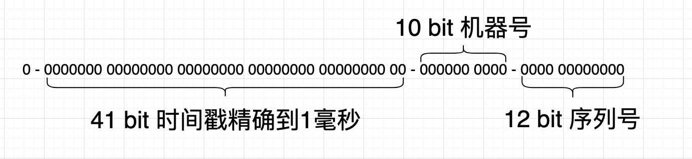

```scss
| 1 bit (符号位) | 41 bits (时间戳) | 10 bits (机器ID) | 12 bits (序列号) |
```

* **1 bit 符号位**：永远为0，不使用。
* **41 bits 时间戳**：存储当前时间与一个初始时间的差值（通常是1970-01-01的时间戳起点），单位为毫秒。41位可以表示大约69年的时间。
* **10 bits 机器ID**：用来区分不同的机器或节点。10位可以表示1024个不同的节点（5位工作节点ID + 5位数据中心ID）。
* **12 bits 序列号**：在同一毫秒内生成多个ID的情况下，用于区分这些ID。12位可以表示4096个不同的序列号。

#### 22.4、雪花算法的工作原理  <a href="#前言" style="font-size:17px; color:green;"><b>🔼</b></a> <a href="#🔚" style="font-size:17px; color:green;"><b>🔽</b></a>

* **时间戳生成**：每次生成ID时获取当前时间戳，减去一个初始时间（纪元）得到相对时间戳。
* **机器ID**：每个节点有唯一的机器ID，通过配置或计算获得。
* **序列号**：在同一毫秒内生成多个ID时，序列号递增，最多支持4096个序列号；当序列号用尽时，等待下一毫秒再生成ID。
* **组合ID**：将时间戳、机器ID和序列号组合成一个64位的整数，形成唯一ID。

#### 22.5、雪花算法的评价  <a href="#前言" style="font-size:17px; color:green;"><b>🔼</b></a> <a href="#🔚" style="font-size:17px; color:green;"><b>🔽</b></a>

*  <font color=red>**高效性**</font>：在本地内存中生成ID，不需要数据库等集中式服务的支持。
* <font color=red>**可扩展性**</font>：支持多个节点并行生成ID，无需担心ID冲突。
* <font color=red>**稳定性**</font>：不受网络环境的影响，即使在网络分区的情况下，仍能生成唯一的ID。
* <font color=green>**时间依赖**</font>：依赖于机器的时间戳，如果服务器的时间不准确或者发生了时间回拨，可能导致生成的ID不唯一或重复。
* <font color=green>**配置复杂**</font>：需要配置和管理机器ID，确保每个节点的ID是唯一的。

#### 22.6、雪花算法的使用场景  <a href="#前言" style="font-size:17px; color:green;"><b>🔼</b></a> <a href="#🔚" style="font-size:17px; color:green;"><b>🔽</b></a>

* 数据库主键ID生成
* 消息队列ID生成
* 分布式存储系统中的对象ID生成
* OC方法签名

#### 22.7、雪花算法的OC实现（及使用示例） <a href="#前言" style="font-size:17px; color:green;"><b>🔼</b></a> <a href="#🔚" style="font-size:17px; color:green;"><b>🔽</b></a>

*  通过[**ChatGPT**](https://chatgpt.com/)翻译自 https://github.com/DamonHu/SnowflakeSwift

```objective-c
#import <Foundation/Foundation.h>
#include <unistd.h>

@interface JobsSnowflake : NSObject

-(instancetype _Nonnull)initWithPublishMillisecond:(uint64_t)publishMillisecond
                                             IDCID:(uint32_t)IDC
                                         machineID:(uint32_t)machine;
-(nullable NSNumber *)nextID;
-(uint64_t)timeWithID:(uint64_t)id;
-(uint32_t)IDCWithID:(uint64_t)id;
-(uint32_t)machineWithID:(uint64_t)id;

@end
```

```objective-c
#import "JobsSnowflake.h"

static const uint32_t kSymbolBits = 1;
static const uint32_t kTimeBits = 41;
static const uint32_t kIDCBits = 5;
static const uint32_t kMachineBits = 5;
static const uint32_t kSequenceBits = 12;

@interface JobsSnowflake ()

@property(nonatomic,assign)uint32_t machine;
@property(nonatomic,assign)uint32_t IDC;
@property(nonatomic,assign)uint32_t sequence;
@property(nonatomic,assign)uint64_t publishMillisecond;
@property(nonatomic,assign)uint64_t lastGeneralMillisecond;

@end

@implementation JobsSnowflake
/// 初始化方法
/// - Parameters:
///   - publishMillisecond: 表示雪花算法开始生成 ID 的时间戳（以毫秒为单位）。这是生成 ID 时使用的基准时间。此参数设置生成雪花 ID 的起始时间点。例如，如果你希望雪花 ID 从某个特定的日期和时间开始生成，你需要提供该时刻的时间戳。
///   - IDC: 表示 IDC（数据中心）的标识符。用于唯一标识运行雪花算法的特定数据中心或集群。此参数帮助标识哪个数据中心或集群生成了某个雪花 ID。它允许你在多个数据中心中扩展 ID 生成而不会发生冲突。IDC 的值必须在算法配置允许的范围内（由 kIDCBits 定义）。
///   - machine: 表示数据中心内的机器或服务器的标识符。用于唯一标识生成雪花 ID 的特定机器或服务器。此参数帮助区分同一数据中心内不同机器生成的 ID。即使多台机器在生成 ID，每台机器生成的 ID 也将保持唯一。机器 ID 的值必须在算法配置允许的范围内（由 kMachineBits 定义）。
-(instancetype _Nonnull)initWithPublishMillisecond:(uint64_t)publishMillisecond
                                             IDCID:(uint32_t)IDC
                                         machineID:(uint32_t)machine{
    if (self = [super init]) {
        NSAssert(publishMillisecond <= ((uint64_t)1 << kTimeBits), @"time is too big");
        NSAssert(IDC <= ((uint32_t)1 << kIDCBits), @"IDC id is too big");
        NSAssert(machine <= ((uint32_t)1 << kMachineBits), @"machine id is too big");
        
        self.publishMillisecond = publishMillisecond;
        self.lastGeneralMillisecond = publishMillisecond;
        self.IDC = IDC & ((1 << kIDCBits) - 1);
        self.machine = machine & ((1 << kMachineBits) - 1);
        self.sequence = 0;
    }return self;
}

-(nullable NSNumber *)nextID{
    uint64_t currentTime = (uint64_t)NSDate.date.timeIntervalSince1970 * 1000;
    if (self.lastGeneralMillisecond < currentTime) {
        self.lastGeneralMillisecond = currentTime;
        self.sequence = 0;
    } else if (self.lastGeneralMillisecond == currentTime) {
        self.sequence = (self.sequence + 1) & ((1 << kSequenceBits) - 1);
        if (self.sequence == 0) {
            usleep(1000);
            currentTime = (uint64_t)NSDate.date.timeIntervalSince1970 * 1000;
            self.lastGeneralMillisecond = currentTime;
        }
    } else {
        // Clock rollback, should handle according to business logic
        return nil;
    }
    
    uint64_t timeParameter = self.lastGeneralMillisecond - self.publishMillisecond;
    uint64_t timeOffset = kIDCBits + kMachineBits + kSequenceBits;
    
    uint64_t idcParameter = self.IDC;
    uint64_t idcOffset = kMachineBits + kSequenceBits;
    
    uint64_t machineParameter = self.machine;
    uint64_t machineOffset = kSequenceBits;
    
    uint64_t result = (timeParameter << timeOffset) | (idcParameter << idcOffset) | (machineParameter << machineOffset) | self.sequence;
    return @(result);  // Return as NSNumber
}

- (uint64_t)timeWithID:(uint64_t)id {
    uint64_t timeOffset = kIDCBits + kMachineBits + kSequenceBits;
    return (id >> timeOffset) + self.publishMillisecond;
}

- (uint32_t)IDCWithID:(uint64_t)id {
    uint64_t step1 = id << (kTimeBits + kSymbolBits);
    return (uint32_t)(step1 >> (kTimeBits + kMachineBits + kSequenceBits + kSymbolBits));
}

- (uint32_t)machineWithID:(uint64_t)id {
    uint64_t step1 = id << (kTimeBits + kIDCBits + kSymbolBits);
    return (uint32_t)(step1 >> (kIDCBits + kTimeBits + kSequenceBits + kSymbolBits));
}

@end
```

```objective-c
 // 使用示例
-(NSNumber *_Nonnull)makeSnowflake{
    JobsSnowflake *snowflake = [JobsSnowflake.alloc initWithPublishMillisecond:self.currentUnixTimeStampInMilliseconds
                                                                         IDCID:1
                                                                     machineID:1];
    NSNumber *snowflakeID = snowflake.nextID;
    if (snowflakeID){
        NSLog(@"Generated Snowflake ID: %@", snowflakeID);
    }else{
        NSLog(@"Failed to generate Snowflake ID.");
    }return snowflakeID;
}
```

### 23、数据的归档和解档 <a href="#前言" style="font-size:17px; color:green;"><b>🔼</b></a> <a href="#🔚" style="font-size:17px; color:green;"><b>🔽</b></a>

#### 23.1、数据的序列化  <a href="#前言" style="font-size:17px; color:green;"><b>🔼</b></a> <a href="#🔚" style="font-size:17px; color:green;"><b>🔽</b></a>

* **数据的序列化**是指将数据结构或对象状态转换为一种可以存储或传输的格式的过程。
* 序列化后的数据可以保存在文件、内存、数据库中，或者通过网络进行传输。
* 当数据需要恢复成原来的数据结构或对象状态时，**反序列化**（即反序列化过程）就会将数据从序列化格式恢复为其原始状态。
* 序列化的必要性
  * 持久化存储
  * 网络传输
  * 缓存
  * 跨语言互操作性：不同编程语言之间的数据交换需要统一的格式。通过序列化，数据可以转换为一种标准化的格式（如 JSON、XML、Protocol Buffers 等），从而实现跨语言的互操作性
  * 复制和传递对象

#### 23.2、iOS.OC 的数据<u>归档/解档</u>  <a href="#前言" style="font-size:17px; color:green;"><b>🔼</b></a> <a href="#🔚" style="font-size:17px; color:green;"><b>🔽</b></a>

* 需要<u>归档/解档</u>的类必须遵守<NSCoding>编码协议 和  <NSSecureCoding>解码协议

* 在需要<u>归档/解档</u>的类的实现加入：

  ```objective-c
  #pragma mark —— NSSecureCoding
  /**
   方法的目的是告诉系统该类是否支持安全编码（NSSecureCoding）。
   通常情况下，为了确保数据的安全性，特别是在跨应用程序或跨设备之间传输数据时，您应该将其设置为 YES。这样可以确保在归档和解档过程中，只有指定的类可以被解档，从而防止潜在的安全风险。
   */
  +(BOOL)supportsSecureCoding{
      return YES;
  }
  ```

* 实现<NSCoding>编码协议

  * 对每个属性进行单独的处理

    ```objective-c
    @property(nonatomic,copy)NSString *accessToken;
    @property(nonatomic,copy)NSString *expireTime;
    ```

    ```objective-c
    /// 解档
    - (nullable instancetype)initWithCoder:(NSCoder *)coder {
        if (self = [super init]) {
            _accessToken = [coder decodeObjectOfClass:NSString.class forKey:@"accessToken"];
            _expireTime = [coder decodeObjectOfClass:NSString.class forKey:@"expireTime"];
            // 解码更多属性
        }return self;
    }
    /// 归档
    - (void)encodeWithCoder:(NSCoder *)coder {
        [coder encodeObject:self.accessToken forKey:@"accessToken"];
        [coder encodeObject:self.expireTime forKey:@"expireTime"];
        // 编码更多属性
    }
    ```

  * 如果不希望对每个属性进行单独的处理，可以用以下的方法。但是控制台会有警告⚠️出现

    ```objective-c
    /// 解档
    - (nullable instancetype)initWithCoder:(NSCoder *)decoder {
    //    _img = [coder decodeObjectOfClass:UIImage.class forKey:@"img"];
        if (self = [super initWithCoder:decoder]) {
            for (NSString *key in printPropertyListByClass(self.class)) {
                if ([self respondsToSelector:NSSelectorFromString(key)]) {
                    @jobs_weakify(self)
                    id value = [decoder decodeObjectOfClasses:jobsMakeMutSet(^(__kindof NSMutableSet <Class>*_Nullable data) {
                        @jobs_strongify(self)
                        data.add(self.class)
                        .add(NSString.class)
                        .add(NSNumber.class)
                        .add(NSArray.class)
                        .add(NSDictionary.class)
                        .add(UIImage.class);
                    }) forKey:key];
                    if (value) self.jobsKVC(key,value);
                }
            }
        }return self;
    }
    /// 归档
    -(void)encodeWithCoder:(NSCoder *)encoder{
        [super encodeWithCoder:encoder];
        // 获取对象的属性列表
        NSLog(@"printPropertyListByClass = %@",printPropertyListByClass(self.class));
        for (NSString *key in printPropertyListByClass(self.class)) {
            // 检查是否实现了协议中的属性对应的setter方法
            NSLog(@"key.jobsCapitalCaseString = %@",@"set".add(key.jobsCapitalCaseString).add(@":"));
            NSLog(@"key = %@",key);
            if ([self respondsToSelector:NSSelectorFromString(@"set".add(key.jobsCapitalCaseString).add(@":"))]) {
                id value = [self valueForKey:key];
                [encoder encodeObject:value forKey:key];
            }
        }
    }
    ```

* 最外层调用归档

  ```objective-c
  +(jobsByUserDefaultModelBlock)updateWithModel{
      return ^(UserDefaultModel *_Nonnull userDefaultModel) {
          if (isValue(userDefaultModel.key)) {
              if (userDefaultModel.obj && ![userDefaultModel.obj isKindOfClass:NSNull.class]) {
                  // 步骤1: 将NSObject对象归档为二进制数据
                  NSError *error = nil;
                  NSData *archivedData = [NSKeyedArchiver archivedDataWithRootObject:userDefaultModel.obj
                                                               requiringSecureCoding:YES
                                                                               error:&error];
                  if (error) {
                      NSLog(@"归档失败: %@", error.localizedDescription);
                  } else {
                      // 步骤2: 将归档数据存储到NSUserDefaults
                      JobsSetUserDefaultKeyWithObject(userDefaultModel.key, archivedData);
                      JobsUserDefaultSynchronize;
                      NSLog(@"%@",NSString.userDefaultsDir);
                      return;
                  }
              }
              
              if (userDefaultModel.booLValue) {
                  JobsSetUserBoolKeyWithBool(userDefaultModel.key, userDefaultModel.booLValue);
                  JobsUserDefaultSynchronize;
                  NSLog(@"%@",NSString.userDefaultsDir);
                  return;
              }
          }
      };
  }
  ```

* 最外层调用解档。需要加入需要进行<u>归档/解档</u>的类。否则解档出来为<font color=red>**nil**</font>

  如果没有加入需要进行<u>归档/解档</u>的类，那么需要进行<u>归档/解档</u>的目标类只会执行`-(void)encodeWithCoder:(NSCoder *)encoder`而不会执行`- (nullable instancetype)initWithCoder:(NSCoder *)decoder`

  ```objective-c
  -(JobsRetIDByClsAndSaltStrBlock _Nonnull)readUserInfoByUserName{
      return ^id _Nullable(Class _Nonnull cls,NSString *_Nullable userName){
          NSData *archivedData = NSUserDefaults.readWithKey(userName);
          if(archivedData){
              if(self.systemVersion.floatValue < 12.0){
                  SuppressWdeprecatedDeclarationsWarning(return [NSKeyedUnarchiver unarchiveObjectWithData:archivedData];);
              }else{
                  NSError *error = nil;
                  id userModel = nil;
                  /// 如果 JobsUserModel 中包含更多自定义类型或者你需要解码其他基本类型（例如 NSArray 或 NSDictionary），需要将这些类也加入到 allowedClasses 集合中。
                  /// 确保在解码所有需要的类时，将其包含在 allowedClasses 集合中以避免警告和潜在的解码失败。例如
                  userModel = [NSKeyedUnarchiver unarchivedObjectOfClasses:jobsMakeMutSet(^(__kindof NSMutableSet <Class>*_Nullable data) {
                      data.add(JobsUserModel.class)
                      .add(NSString.class)
                      .add(NSNumber.class)
                      .add(NSArray.class)
                      .add(NSDictionary.class)
                      .add(UIImage.class)
                      .add(NSArray.class)
                      .add(cls);
                  })
                                                                     fromData:archivedData
                                                                        error:&error];
                  if (!userModel) {
                      JobsLog(@"解档失败: %@", error.localizedDescription);
                      /// 没取到用户数据，就直接跳登录
      //                self.toLogin();
                  }return userModel;
              }
          }else{
              JobsLog(@"解档失败:需要被解档的数据为空");
              return nil;
          }
      };
  }
  ```

### 24、容器类的二次封装使用 <a href="#前言" style="font-size:17px; color:green;"><b>🔼</b></a> <a href="#🔚" style="font-size:17px; color:green;"><b>🔽</b></a>

* 数组

  [**@implementation NSMutableArray (Extra)**]()

  ```objective-c
  /// 清除数组元素
  -(jobsByVoidBlock _Nonnull)clean{
      @jobs_weakify(self)
      return ^(){
          @jobs_strongify(self)
          [self removeAllObjects];
      };
  }
  /// 元素包含
  -(JobsRetBOOLByIDBlock _Nonnull)containsObject{
    @jobs_weakify(self)
      return ^BOOL((id _Nullable data)){
      @jobs_strongify(self)
          return [self containsObject:data];
      };
  }
  /// 数组取值（无法关联数组的泛型）
  -(JobsRetIDByUIntegerBlock _Nonnull)objectAt{
      @jobs_weakify(self)
      return ^id _Nullable(NSUInteger data){
          @jobs_strongify(self)
          return [self objectAtIndex:data];
      };
  }
  /// 数组取下标
  -(JobsRetNSUIntegerByIDBlock _Nonnull)indexBy{
      @jobs_weakify(self)
      return ^NSUInteger(id _Nullable data){
          @jobs_strongify(self)
          return [self indexOfObject:data];
      };
  }
  /// 阻止向可变数组添加空元素
  -(JobsRetIDByIDBlock _Nonnull)add{
      @jobs_weakify(self)
      return ^id (id _Nullable data) {
          @jobs_strongify(self)
          if(data){
              [self addObject:data];/// 向数组加入nil会崩
          }else{
              NSLog(@"数组被添加了一个空元素");
          }return self;
      };
  }
  /// 向数组加入一个从来没有没有过的元素，以保证数组元素的单一性
  -(JobsRetIDByIDBlock _Nonnull)jobsAddSoleObject{
      @jobs_weakify(self)
      return ^id (id _Nullable data) {
          @jobs_strongify(self)
          if(data){
              if (![self containsObject:data]) {
                  [self addObject:data];
              }
          }else{
              NSLog(@"数组被添加了一个空元素");
          }return self;
      };
  }
  ```
  
  ```objective-c
  /// 可变数组的方便调用
  NS_INLINE __kindof NSArray *_Nonnull jobsMakeMutArr(jobsByMutableArrayBlock _Nonnull block){
      NSMutableArray *data = NSMutableArray.array;
      if (block) block(data);
      return data;
  }
  ```
  
* 集合

  [**@implementation NSMutableSet (Extra)**]()

  ```objective-c
  /// 阻止向可变集合添加空元素
  -(JobsRetIDByIDBlock _Nonnull)add{
      @jobs_weakify(self)
      return ^id (id _Nullable data) {
          @jobs_strongify(self)
          if(data){
              /// 向集合加入nil会崩
              [self addObject:data];
          }else{
              NSLog(@"集合被添加了一个空元素");
          }return self;
      };
  }
  ```

  ```objective-c
  /// 可变集合的方便调用
  NS_INLINE __kindof NSSet *_Nonnull jobsMakeMutSet(jobsBySetBlock _Nonnull block){
      NSMutableSet *data = NSMutableSet.set;
      if (block) block(data);
      return mutableSet;
  }
  ```

### 25、📃协议属性的使用  <a href="#前言" style="font-size:17px; color:green;"><b>🔼</b></a> <a href="#🔚" style="font-size:17px; color:green;"><b>🔽</b></a>

* 协议的属性值无法在控制台用`po`进行打印输出，只能通过`NSLog`。因为当本类的成员变量列表已经部署完毕了以后，再部署以runtime的形式部署分类的属性

* 同一属性，不要<font color=red>**@dynamic**</font>和<font color=red>**@synthesize**</font>，容易出现一些异常。（比如，<font color=red>**@synthesize**</font>修饰的属性，无法覆盖本类的子类）

* 就近原则：本类直接定义的属性 > <font color=red>**@synthesize**</font> > <font color=red>**@dynamic**</font>

* 在分类里面实现协议属性需要涉及到关键字<font color=red>**@dynamic**</font>

  * <font color=red>**copy**</font>：`Jobs_setAssociatedCOPY_NONATOMIC`、`Jobs_setAssociatedCOPY`

    ```objective-c
    #pragma mark —— @property(nonatomic,copy)jobsByIDBlock makeBlock;
    JobsKey(_makeBlock)
    @dynamic makeBlock;
    -(jobsByIDBlock)makeBlock{
        return Jobs_getAssociatedObject(_makeBlock);
    }
    
    -(void)setMakeBlock:(jobsByIDBlock)makeBlock{
        Jobs_setAssociatedCOPY_NONATOMIC(_makeBlock, makeBlock)
    }
    ```

  * <font color=red>**retain**</font>：`Jobs_setAssociatedRETAIN_NONATOMIC`、`Jobs_setAssociatedRETAIN`

    ```objective-c
    #pragma mark —— @property(nonatomic,strong,nullable)UIViewModel *viewModel;
    JobsKey(_viewModel)
    @dynamic viewModel;
    -(UIViewModel *)viewModel{
        UIViewModel *VM = Jobs_getAssociatedObject(_viewModel);
        if(!VM){
            VM = jobsMakeViewModel(^(__kindof UIViewModel * _Nullable vm) {
                vm.textModel.textCor = JobsLabelColor;
                vm.textModel.font = UIFontWeightRegularSize(16);
            });Jobs_setAssociatedRETAIN_NONATOMIC(_viewModel, VM);
        }return VM;
    }
    
    -(void)setViewModel:(UIViewModel *)viewModel{
        Jobs_setAssociatedRETAIN_NONATOMIC(_viewModel, viewModel)
    }
    ```

    对基本数据类型，需要封装成`NSNumber`对象再进行存储

    ```objective-c
    #pragma mark —— @property(nonatomic,assign)NSUInteger minimumNumberOfTouches API_UNAVAILABLE(tvos);
    JobsKey(_minimumNumberOfTouches)
    @dynamic minimumNumberOfTouches;
    -(NSUInteger)minimumNumberOfTouches{
        return [Jobs_getAssociatedObject(_minimumNumberOfTouches) unsignedIntegerValue];
    }
    
    -(void)setMinimumNumberOfTouches:(NSUInteger)minimumNumberOfTouches{
        Jobs_setAssociatedRETAIN_NONATOMIC(_minimumNumberOfTouches, @(minimumNumberOfTouches))
    }
    ```

  * <font color=red>**assign**</font>：`Jobs_setAssociatedASSIGN`

    weak对象

    ```objective-c
    #pragma mark —— <BaseViewControllerProtocol> @property(nonatomic,weak)UIViewController *fromVC;
    JobsKey(_fromVC)
    @dynamic fromVC;
    -(UIViewController *)fromVC{
        return Jobs_getAssociatedObject(_fromVC);
    }
    
    -(void)setFromVC:(UIViewController *)fromVC{
        Jobs_setAssociatedASSIGN(_fromVC, fromVC)
    }
    ```

* 在具体子类里面实现协议属性需要涉及到关键字<font color=red>**@synthesize**</font>

  ```objective-c
  @synthesize viewModel = _viewModel;
  -(UIViewModel *)viewModel{
      if (!_viewModel) {
          _viewModel = jobsMakeViewModel(^(__kindof UIViewModel * _Nullable vm) {
              vm.textModel.textCor = JobsLabelColor;
              vm.textModel.font = UIFontWeightRegularSize(16);
          });
      }return _viewModel;
  }
  ```

### 26、**Runtime** 获取`.m`文件的属性（指针） <a href="#前言" style="font-size:17px; color:green;"><b>🔼</b></a> <a href="#🔚" style="font-size:17px; color:green;"><b>🔽</b></a>

* ```objective-c
  WMZBannerControl *bannerControl = _bannerView.getObjByName(@"bannerControl");
  ```

* ```objective-c
  -(void)Test{
      object_setIvar(self.datePickerView,
                     class_getInstanceVariable([BRDatePickerView class], "_monthNames"),/// 必须是下划线接属性
                     jobsMakeMutArr(^(__kindof NSMutableArray <NSString *>* _Nullable arr) {
          arr.add(@"一月份".tr).add(@"二月份".tr);
      }));
  }
  ```
  
* 也可以用`KVC`。比方说有一个变量叫**aaa**，然后我用 变量 = [对象 valueForKey：@"aaa"]来取.顺序是这样的：

  * 看是否有`-aaa{}`，如果有就调用
  * 看是否有**_aaa**变量，如果有，直接取
  * 看是否有**aaa**变量，如果有，直接取
  * 看是否有**_isAaa**变量，如果有，直接取
  * 看是否有**isAaa**变量，如果有，直接取
  * 返回<font color=red>**nil**</font>

### 27、🪵架构相关 <a href="#前言" style="font-size:17px; color:green;"><b>🔼</b></a> <a href="#🔚" style="font-size:17px; color:green;"><b>🔽</b></a>

#### 27.1、[**不使用 Storyboard + 使用自定义的控制器（ViewController@1）**](#https://blog.csdn.net/htwhtw123/article/details/125348408) + **不使用多场景** <a href="#前言" style="font-size:17px; color:green;"><b>🔼</b></a> <a href="#🔚" style="font-size:17px; color:green;"><b>🔽</b></a>

* 给`AppDelegate.h`添加属性，作为渲染的window

  ```objective-c
  #import <UIKit/UIKit.h>
  #import "ViewController@1.h"
  
  @interface AppDelegate : UIResponder <UIApplicationDelegate>
  Prop_strong()UIWindow *window;
  @end
  ```

* `AppDelegate.m`

  ```objective-c
  - (BOOL)application:(UIApplication *)application
  didFinishLaunchingWithOptions:(NSDictionary *)launchOptions {
      JXScaleSetup(375.0, 812.0);
  //    JobsAppTool.currentInterfaceOrientation = UIInterfaceOrientationLandscapeLeft | UIInterfaceOrientationLandscapeRight;
  //    JobsAppTool.currentDeviceOrientation = UIDeviceOrientationLandscapeLeft | UIDeviceOrientationLandscapeRight;
  //    JobsAppTool.currentInterfaceOrientationMask = UIInterfaceOrientationMaskLandscapeRight;
  //    JobsAppTool.jobsDeviceOrientation = DeviceOrientationLandscape;
  
      self.localNotifications();
      self.launchFunc2();
      AppDelegate.launchFunc1();          // 如遇“重复副作用”，可改到 SceneDelegate，或在此加 @available 保护
  
      if (@available(iOS 13.0, *)) {
          // ➤ iOS 13+ 由 SceneDelegate 负责挂窗，这里不再创建 window
          return YES;
      }
      // ➤ iOS 12 及以下，沿用原有逻辑创建 window
      self.window = jobsMakeAppDelegateWindow(^(__kindof UIWindow * _Nullable window) {
          window.rootViewController = RootViewController;
          [window makeKeyAndVisible];
      }); return YES;
  }
  ```

* 删除以下`AppDelegate`里面对多场景的支持代码

  ```objective-c
  #pragma mark - UISceneSession lifecycle
  - (UISceneConfiguration *)application:(UIApplication *)application
  configurationForConnectingSceneSession:(UISceneSession *)connectingSceneSession
                                options:(UISceneConnectionOptions *)options {
      // Called when a new scene session is being created.
      // Use this method to select a configuration to create the new scene with.
      return [[UISceneConfiguration alloc] initWithName:@"Default Configuration" sessionRole:connectingSceneSession.role];
  }
  
  
  - (void)application:(UIApplication *)application
  didDiscardSceneSessions:(NSSet<UISceneSession *> *)sceneSessions {
      // Called when the user discards a scene session.
      // If any sessions were discarded while the application was not running, this will be called shortly after application:didFinishLaunchingWithOptions.
      // Use this method to release any resources that were specific to the discarded scenes, as they will not return.
  }
  ```

* 删除`Info.plist`中，关于多场景的键值对

  ```xml
  <key>UIApplicationSceneManifest</key>
  <dict>
    <key>UIApplicationSupportsMultipleScenes</key>
    <false/>
    <key>UISceneConfigurations</key>
    <dict>
      <key>UIWindowSceneSessionRoleApplication</key>
      <array>
        <dict>
          <key>UISceneConfigurationName</key>
          <string>Default Configuration</string>
          <key>UISceneDelegateClassName</key>
          <string>SceneDelegate</string>
          <key>UISceneStoryboardFile</key>
          <string>Main</string>
        </dict>
      </array>
    </dict>
  </dict>
  ```

* 删除新建工程默认生成的`ViewController` (或者不包含进工程目录，防止进入编译期)

  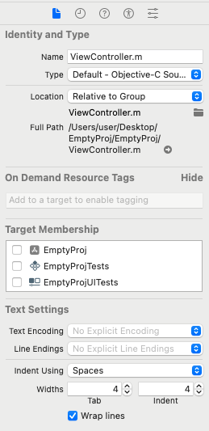

* 删除`SceneDelegate.h`和 `SceneDelegate.m`   (或者不包含进工程目录，防止进入编译期)

  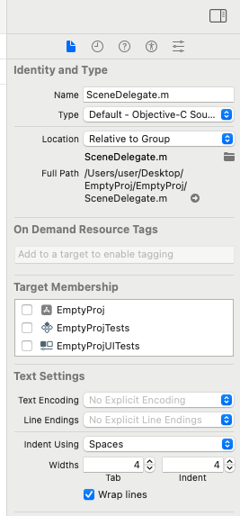

* [处理：**`Unknown class ViewController in Interface Builder file.`**](#Unknown_class_in_Interface_Builder_file)

#### 27.2、iOS新建应用使用多场景 <a href="#前言" style="font-size:17px; color:green;"><b>🔼</b></a> <a href="#🔚" style="font-size:17px; color:green;"><b>🔽</b></a>

* TODO

### 28、🔘 `UIButton` <a href="#前言" style="font-size:17px; color:green;"><b>🔼</b></a> <a href="#🔚" style="font-size:17px; color:green;"><b>🔽</b></a>

> 使用[**UIButtonConfiguration**](https://www.jianshu.com/p/12426709420e)会影响老旧Api的作用效果

#### 28.1、转换为 <font size=5>**`UIBarButtonItem`**</font>

```swift
self.navigationItem.leftBarButtonItem =
UIButton
    .jobsInit()
    .bgColorBy(JobsGreenColor)
    .jobsResetImagePlacement(NSDirectionalRectEdgeLeading)
    .jobsResetImagePadding(1)
    .jobsResetBtnImage(@"chevron.backward".sys_img)
    .jobsResetBtnTitle(@"返回")
    .jobsResetBtnTitleCor(JobsWhiteColor)
    .jobsResetBtnTitleFont(UIFontWeightBoldSize(JobsWidth(12)))
    .onClickBy(^(UIButton *x){
        NSLog(@"➤ 点击了左侧『返回』按钮");
    })
    .onLongPressGestureBy(^(id data){
        NSLog(@"➤ 长按了左侧『返回』按钮");
    })
    .bySize(CGSizeMake(30, 30))
    .barBtnItem;
```

#### 28.2、普通按钮 <a href="#前言" style="font-size:17px; color:green;"><b>🔼</b></a> <a href="#🔚" style="font-size:17px; color:green;"><b>🔽</b></a>

* 普通文本（字体大小、字体颜色）/ 短按 / 长按 / 按钮图 / 图文位置 / 图文距离 / 按钮尺寸

  ```objective-c
  UIButton
      .jobsInit()
      .bgColorBy(JobsGreenColor)
      .jobsResetImagePlacement(NSDirectionalRectEdgeLeading)
      .jobsResetImagePadding(1)
      .jobsResetBtnImage(@"chevron.backward".sys_img)
      .jobsResetBtnTitle(@"返回")
      .jobsResetBtnTitleCor(JobsWhiteColor)
      .jobsResetBtnTitleFont(UIFontWeightBoldSize(JobsWidth(12)))
      .onClickBy(^(UIButton *x){
          NSLog(@"➤ 点击了左侧『返回』按钮");
      })
      .onLongPressGestureBy(^(id data){
          NSLog(@"➤ 长按了左侧『返回』按钮");
      })
      .bySize(CGSizeMake(30, 30))
      .addOn(self.view)
      .byAdd(^(MASConstraintMaker *make) {
          @jobs_strongify(self)
          make.left.equalTo(self.view);
          make.top.equalTo(self.tableView.mas_bottom);
          make.size.mas_equalTo(CGSizeMake(TableViewWidth, EditBtnHeight));
      });
  ```

* 富文本（字体大小、字体颜色）/ 短按 / 长按 / 按钮图 / 图文位置 / 图文距离 / 按钮尺寸 <font color=blue>**富文本的优先级 > 普通文本的优先级**</font>

  ```objective-c
  BaseButton
      .jobsInit()
      .jobsResetBtnNormalAttributedTitle(self.richTextWithDataConfigMutArr(jobsMakeMutArr(^(__kindof NSMutableArray <__kindof JobsRichTextConfig *>* _Nullable data) {
          data.add(jobsMakeRichTextConfig(^(__kindof JobsRichTextConfig * _Nullable data1) {
          @jobs_strongify(self)
          data1.font = UIFontWeightRegularSize(14);
          data1.textCor = JobsCor(@"#666666");
          data1.targetString = self.richTextMutArr[0];
          data1.paragraphStyle = self.jobsParagraphStyleCenter;
      })).add(jobsMakeRichTextConfig(^(__kindof JobsRichTextConfig * _Nullable data1) {
          @jobs_strongify(self)
          data1.font = UIFontWeightRegularSize(14);
          data1.textCor = JobsCor(@"#BA9B77");
          data1.targetString = self.richTextMutArr[1];
          data1.paragraphStyle = self.jobsParagraphStyleCenter;
      })).add(jobsMakeRichTextConfig(^(__kindof JobsRichTextConfig * _Nullable data1) {
          @jobs_strongify(self)
          data1.font = UIFontWeightRegularSize(14);
          data1.textCor = JobsCor(@"#666666");
          data1.targetString = self.richTextMutArr[2];
          data1.paragraphStyle = self.jobsParagraphStyleCenter;
      }));
  }))).bgColorBy(JobsWhiteColor)
      .jobsResetImagePlacement(NSDirectionalRectEdgeLeading)
      .jobsResetImagePadding(1)
      .jobsResetBtnImage(@"APPLY NOW".img)
      .jobsResetBtnBgImage(@"APPLY NOW".img)
      .jobsResetBtnTitleCor(JobsWhiteColor)
      .jobsResetBtnTitleFont(UIFontWeightBoldSize(JobsWidth(12)))
      .jobsResetBtnTitle(@"APPLY NOW".tr)
      .onClickBy(^(UIButton *x){
          @jobs_strongify(self)
          x.selected = !x.selected;
          if (self.objBlock) self.objBlock(x);
      })
      .onLongPressGestureBy(^(id data){
          JobsLog(@"");
      })
      .bySize(CGSizeMake(30, 30))
      .addOn(self.view)
      .byAdd(^(MASConstraintMaker *make) {
          @jobs_strongify(self)
          make.left.equalTo(self.view);
          make.top.equalTo(self.tableView.mas_bottom);
          make.size.mas_equalTo(CGSizeMake(TableViewWidth, EditBtnHeight));
      });
  ```

* <font color=red size=5>`UIButtonConfiguration`</font> + <font color=red size=5>`SDWebImage`</font>

  ```objective-c
  -(UIButton *)mailBtn{
       if(!_mailBtn){
           @jobs_weakify(self)
           _mailBtn = BaseButton.jobsInit()
               .imageURL(@"".jobsUrl)
               .placeholderImage(JobsIMG(@"小狮子"))
               .options(SDWebImageRefreshCached)/// 强制刷新缓存
               .completed(^(UIImage * _Nullable image,
                            NSError * _Nullable error,
                            SDImageCacheType cacheType,
                            NSURL * _Nullable imageURL) {
                   if (error) {
                       JobsLog(@"图片加载失败: %@-%@", error,imageURL);
                   } else {
                       JobsLog(@"图片加载成功");
                   }
               })
               .onClickBy(^(UIButton *x){
                   @jobs_strongify(self)
                   if (self.objBlock) self.objBlock(x);
               })
               .onLongPressGestureBy(^(id data){
                   JobsLog(@"");
               })
               .addOn(self.view)
               .byAdd(^(MASConstraintMaker *make) {
                   @jobs_strongify(self)
                   // TODO
               });
               .bgNormalLoad();
       }return _mailBtn;
   }
  ```

#### 28.3、⏰ [**倒计时**](#JobsTimer)按钮的封装 <a href="#前言" style="font-size:17px; color:green;"><b>🔼</b></a> <a href="#🔚" style="font-size:17px; color:green;"><b>🔽</b></a>

```objective-c
/// ★ 倒计时按钮，使用 UIButton+JobsTimer 的封装
/// 内含定时器
-(UIButton *)countdownBtn{
    if (!_countdownBtn) {
        @jobs_weakify(self)
        _countdownBtn = jobsMakeButton(^(__kindof UIButton * _Nullable btn) {//
            @jobs_strongify(self)
            /// 基础 UI
            btn.jobsResetBtnBgCor(HEXCOLOR(0xAE8330))
               .jobsResetBtnTitle(JobsInternationalization(@"获取验证码"))
               .jobsResetBtnTitleCor(JobsWhiteColor)
               .jobsResetBtnTitleFont(UIFontWeightRegularSize(24))
               /// Timer 配置（UIButton+Timer 提供的属性）
               .byTimerType(JobsTimerTypeGCD)
               .byTimerStyle(TimerStyle_anticlockwise)  // 倒计时模式
               .byStartTime(8)                          // 总时长 8 秒
               .byTimeInterval(1)
               .byClickWhenTimerCycle(YES)              // 计时器运行期间：禁止点击
               .byOnTick(^(CGFloat time){
                   btn.jobsResetBtnTitle([NSString stringWithFormat:@"%f",ceil(time)].add(JobsSpace).add(@"秒"));
               })
               .byOnFinish(^(JobsTimer *_Nullable timer){
                   NSLog(@"");
               })
               /// 点击开始倒计时
               .onClickBy(^(UIButton *x){
                   x.startTimer();
               })
               .jobsResetBtnCornerRadiusValue(JobsWidth(18))
               .addOn(self.view)
               .byAdd(^(MASConstraintMaker *make) {
                   @jobs_strongify(self)
                   make.centerX.equalTo(self.view);
                   make.top.equalTo(self.countdownView.mas_bottom).offset(JobsWidth(12));
                   make.height.mas_equalTo(JobsWidth(80));
                   make.width.mas_equalTo(JobsWidth(180));
               });
        });
    }return _countdownBtn;
}

/// 开始
self.countDownBtn.startTimer();
/// 暂停
self.countDownBtn.timerSuspend();
/// 继续
self.countDownBtn.timerContinue();
/// 结束
[self.countdownBtn.timer stop];// 或者 self.countdownBtn.timerDestroy();
```

### 29、系统的导航控制器 <a href="#前言" style="font-size:17px; color:green;"><b>🔼</b></a> <a href="#🔚" style="font-size:17px; color:green;"><b>🔽</b></a>

* 将任意的`UIViewController`用系统的`UINavigationController`进行包裹

  ```objective-c
  self.tabBarVC.navCtrl
  ```

* 将任意的`UIViewController`用封装自系统的`BaseNavigationVC`进行包裹

  ```objective-c
  BaseNavigationVC.initBy(self);
  ```

### 30、[**`Masonry`**](https://github.com/SnapKit/Masonry) 的一些使用技巧 <a href="#前言" style="font-size:17px; color:green;"><b>🔼</b></a> <a href="#🔚" style="font-size:17px; color:green;"><b>🔽</b></a>

* ```ruby
  pod 'Masonry' # https://github.com/SnapKit/Masonry NO_SMP
  ```

  ```objective-c
  #if __has_include(<Masonry/Masonry.h>)
  #import <Masonry/Masonry.h>
  #else
  #import "Masonry.h"
  #endif
  ```

* 关注实现类：[**@interface UIView (Masonry)**](https://github.com/JobsKits/JobsOCBaseConfigDemo/tree/main/JobsOCBaseConfigDemo/JobsOCBaseCustomizeUIKitCore/UIView/UIView+Category/UIView+Masonry)

* 统一设置内边距
  
  ```objective-c
  [self.chatBubbleIMGV addSubview:_chatContentLab];
  [_chatContentLab mas_makeConstraints:^(MASConstraintMaker *make) {
      make.edges.equalTo(self.chatBubbleIMGV).with.insets(UIEdgeInsetsMake(5, 5, 5, 5));
  }];
  ```
  
* 对<font size=5>[**`Masonry`**](https://github.com/SnapKit/Masonry) </font>约束Block进行存储，一般一个**View**对应一个约束。先`addSubview`，再利用存储的约束进行绘制UI

  ```objective-c
  -(BaseButton *)forgotten_code_btn{
      if(!_forgotten_code_btn){
          @jobs_weakify(self)
          _forgotten_code_btn = BaseButton.jobsInit()
              .bgColorBy(JobsClearColor)
              .jobsResetBtnTitleCor(JobsCor(@"#FF0000"))
              .jobsResetBtnTitleFont(pingFangHKRegular(JobsWidth(13)))
              .jobsResetBtnTitle(JobsInternationalization(@"Forgot Password?"))
              .onClickBy(^(UIButton *x){
                  @jobs_strongify(self)
                  self.getCurrentViewController.comingToPushVC(FMForgotPwdVC.new);
              })
              .onLongPressGestureBy(^(id data){
                  JobsLog(@"");
              })
              .addOn(self.bgImageView)
              .byAdd(^(MASConstraintMaker *make) {
                  @jobs_strongify(self)
                  /// TODO
              });
      }return _forgotten_code_btn;
  }
  ```
  
* 将以前的约束全部清除，用最新的`mas_remakeConstraints`
  
* 如果在已有的约束基础上，再更新约束`mas_updateConstraints`
  
  ```objective-c
  -(UIView *)pointView{
      if(!_pointView){
          @jobs_weakify(self)
          _pointView = jobsMakeView(^(__kindof UIView * _Nullable view) {
              @jobs_strongify(self)
              self.addSubview(view);
              [view mas_makeConstraints:^(MASConstraintMaker *make) {
                  make.size.mas_equalTo(CGSizeMake(JobsWidth(8), JobsWidth(8)));
                  make.left.top.equalTo(self);
              }];
          });
      }return _pointView;
  }
  
  -(jobsByCGFloatBlock _Nonnull)updatePointViewPositionWithOffsetY{
      @jobs_weakify(self)
      return ^(CGFloat y){
          @jobs_strongify(self)
          [self.pointView mas_updateConstraints:^(MASConstraintMaker *make) {
              make.top.equalTo(self).offset(y);
          }];self.refresh();
      };
  }
  
  -(jobsByCGFloatBlock _Nonnull)updateLabelPositionWithOffsetX{
      @jobs_weakify(self)
      return ^(CGFloat x){
          @jobs_strongify(self)
          [self.label mas_updateConstraints:^(MASConstraintMaker *make) {
              make.left.equalTo(self.pointView.mas_right).offset(x);
          }];self.refresh();
      };
  }
  ```
  
* [**【开发笔记】Masonry 的 distributeViewsAlongAxis 方法**](https://juejin.cn/post/6935778993320755214)
  
  * 横向拉伸以均分
  
    ```objective-c
    [self.btnMutArr mas_distributeViewsAlongAxis:MASAxisTypeHorizontal/// 在水平方向上分布这些视图
                                withFixedSpacing:20/// 指定每个视图之间的固定间距
                                     leadSpacing:5/// 指定第一个视图与父视图左边缘之间的距离
                                     tailSpacing:5];/// 指定最后一个视图与父视图右边缘之间的距离
    [self.btnMutArr mas_makeConstraints:^(MASConstraintMaker *make) {
        make.top.equalTo(@60);
        make.height.equalTo(@60);
    }];
    ```
  
  * 纵向拉伸以均分
  
    ```objective-c
    [self.btnMutArr mas_distributeViewsAlongAxis:MASAxisTypeVertical/// 在垂直方向上分布这些视图
                                withFixedSpacing:20/// 指定每个视图之间的固定间距
                                     leadSpacing:5/// 指定第一个视图与父视图顶部之间的距离
                                     tailSpacing:5];/// 指定最后一个视图与父视图底部之间的距离
    [self.btnMutArr mas_makeConstraints:^(MASConstraintMaker *make) {
        make.left.equalTo(@0);
        make.width.equalTo(@60);
    }];
    ```
  
  * 纵向固定大小显示
  
    ```objective-c
    [self.btnMutArr mas_distributeViewsAlongAxis:MASAxisTypeVertical/// 在垂直方向上分布这些视图
                             withFixedItemLength:30/// 指定每个视图之间的固定间距
                                     leadSpacing:30/// 指定第一个视图与父视图顶部之间的距离
                                     tailSpacing:200];/// 指定最后一个视图与父视图底部之间的距离
    [self.btnMutArr mas_makeConstraints:^(MASConstraintMaker *make) {
        make.left.equalTo(@0);
        make.width.equalTo(@60);
    }];
    ```
    
  * 将上述进行封装以后的调用示例：
  
    ```objective-c
    #import "NSArray+Tools.h"
    
    Prop_strong()NSMutableArray <UIImageView *>*subViewsMutArr;
    self.subViewsMutArr.describe();
    
    -(NSMutableArray<UIImageView *> *)subViewsMutArr{
        if(!_subViewsMutArr){
            @jobs_weakify(self)
            _subViewsMutArr = jobsMakeMutArr(^(__kindof NSMutableArray <__kindof UIView *>*_Nullable data) {
                @jobs_strongify(self)
                data.add(BonusEarnedView.JobsRichViewByModel(nil).图片从小放大())
                .add(InvitedFriendsNumberView.JobsRichViewByModel(nil).图片从小放大())
                .add(CopyLinkView.JobsRichViewByModel(nil).图片从小放大())
                .add(DownloadQRCodeView.JobsRichViewByModel(nil).图片从小放大());
                for (UIView *view in data) {
                    self.view.addSubview(view);
                }
            }).installByMasonryModel1(jobsMakeMasonryModel(^(__kindof MasonryModel * _Nullable data) {
                data.axisType = MASAxisTypeHorizontal;
                data.fixedSpacing = JobsWidth(22);
                data.leadSpacing = JobsWidth(52);
                data.tailSpacing = JobsWidth(52);
                data.top = JobsWidth(90);
                data.height = BonusEarnedView.viewSizeByModel(nil).height;
                data.is_mas_makeConstraints = YES;
            })).installByMasonryBlock(^(MASConstraintMaker *_Nonnull data){
                
            });
        }return _subViewsMutArr;
    }
    ```
  

<details id="Masonry约束动画<br>">
 <summary><strong>点我了解详情：Masonry约束动画<br></strong></summary>

```objective-c
-(MSMineView2 *)view2{
    if(!_view2){
        @jobs_weakify(self)
        _view2 = jobsMakeBaseView(^(__kindof BaseView * _Nullable view) {
            @jobs_strongify(self)
            view.jobsRichViewByModel(nil);
            // 移除第一个 _view2 的约束
            [self.view.addSubview(view) mas_remakeConstraints:^(MASConstraintMaker *make) {
                // 添加第一个 _view2 的约束
                make.size.mas_equalTo(CGSizeMake(JobsWidth(88), JobsWidth(28)));
                make.right.equalTo(self.view).offset(JobsWidth(-10));
                make.top.equalTo(self.view).offset(JobsWidth(12));
            }];
            // 告诉视图需要更新布局
            [self.view setNeedsUpdateConstraints];
            // 执行动画
            [UIView animateWithDuration:0.5 animations:^{
                [self.view layoutIfNeeded]; // 让视图更新布局
            } completion:^(BOOL finished) {
                // 在动画完成后，切换到第二个 _view2 的约束
                [self.view2 mas_remakeConstraints:^(MASConstraintMaker *make) {
                    // 添加第二个 _view2 的约束
                    make.size.mas_equalTo(MSMineView2.viewSizeByModel(nil));
                    make.centerX.equalTo(self.view);
                    make.top.equalTo(self.view).offset(JobsWidth(12));
                }];
                // 再次告诉视图需要更新布局
                [self.view setNeedsUpdateConstraints];
                // 再次执行动画
                [UIView animateWithDuration:0.5 animations:^{
                    [self.view layoutIfNeeded]; // 让视图更新布局
                }];
            }];view.cornerCutToCircleWithCornerRadius(MSMineView2.viewSizeByModel(nil).height / 2);
        });
    }return _view2;
}
```


</details>

### 31、退出`UIViewController`的时候，需要做的操作 <a href="#前言" style="font-size:17px; color:green;"><b>🔼</b></a> <a href="#🔚" style="font-size:17px; color:green;"><b>🔽</b></a>

<details id="退出ViewController的时候，需要做的操作">
 <summary><strong>点我了解详情</strong></summary>

* 定义于`BaseViewProtocol`，因为是进数据，所以可以实现在控制器生命周期的任意处

  ```objective-c
   @jobs_weakify(self)
   self.jobsBackBlock = ^id _Nullable(id _Nullable data) {
       @jobs_strongify(self)
       NSLog(@"退出页面的逻辑");
       return nil;
   };
  ```

* 也可以在具体的子控制器覆写下列方法

  ```objective-c
  -(void)backBtnClickEvent:(UIButton *_Nullable)sender;
  ```
  
  ```objective-c
  -(jobsByBtnBlock _Nonnull)backBtnClickEvent{
      @jobs_weakify(self)
      return ^(UIButton *_Nullable sender) {
          @jobs_strongify(self)
          self.jobsBackBtnClickEvent(sender);
      };
  }
  
  -(jobsByBtnBlock _Nonnull)jobsBackBtnClickEvent{
      @jobs_weakify(self)
      return ^(__kindof UIButton *_Nullable sender) {
          @jobs_strongify(self)
          if (self.jobsBackBlock) self.jobsBackBlock(sender);
          UIViewController *vc = nil;
          if (KindOfVCCls(self)) {
              vc = (UIViewController *)self;
          }else if (KindOfViewCls(self)){
              UIView *view = (UIView *)self;
              vc = self.getViewControllerByView(view);
          }else return;
          
          switch (self.pushOrPresent) {
              case ComingStyle_PRESENT:{
                  [vc dismissViewControllerAnimated:YES completion:nil];
              }break;
              case ComingStyle_PUSH:{
                  vc.navigationController ? [vc.navigationController popViewControllerAnimated:YES] : [vc dismissViewControllerAnimated:YES completion:nil];
              }break;
                  
              default:
                  break;
          }
      };
  }
  ```

</details>

### 32、实例对象的**weak**化，避免循环引用 <a href="#前言" style="font-size:17px; color:green;"><b>🔼</b></a> <a href="#🔚" style="font-size:17px; color:green;"><b>🔽</b></a>
<details id="相关定义">
<summary><strong>点我了解详情：相关定义</strong></summary>

```objective-c
#ifndef MacroDef_Strong_Weak_h
#define MacroDef_Strong_Weak_h

/** 强弱引用
    Uses
    UIView *view;
    UIButton *btn;

    @jobs_weakify(view)
    weak_view.size;
    @jobs_weakify(btn)
    weak_btn.frame

 # 能用@符号进行调用的根本原因：来自GPT-3.5的回答
    在如下的宏定义中：
    @符号可以用于调用的原因是因为宏内部实际上不包含Objective-C代码块，而是包含了一个函数调用，
    这个函数调用是Objective-C代码中的一个有效表达式。
 */
#ifndef jobs_weakify
#if DEBUG
#if __has_feature(objc_arc)
#define jobs_weakify(self) autoreleasepool{} __weak __typeof__(self) weak##_##self = self;
#else
#define jobs_weakify(self) autoreleasepool{} __block __typeof__(self) block##_##self = self;
#endif
#else
#if __has_feature(objc_arc)
#define jobs_weakify(self) try{} @finally{} {} __weak __typeof__(self) weak##_##self = self;
#else
#define jobs_weakify(self) try{} @finally{} {} __block __typeof__(self) block##_##self = self;
#endif
#endif
#endif

#ifndef jobs_strongify
#if DEBUG
#if __has_feature(objc_arc)
#define jobs_strongify(self) autoreleasepool{} __typeof__(self) self = weak##_##self;
#else
#define jobs_strongify(self) autoreleasepool{} __typeof__(self) self = block##_##self;
#endif
#else
#if __has_feature(objc_arc)
#define jobs_strongify(self) try{} @finally{} __typeof__(self) self = weak##_##self;
#else
#define jobs_strongify(self) try{} @finally{} __typeof__(self) self = block##_##self;
#endif
#endif
#endif

#endif /* MacroDef_Strong_Weak_h */
```

</details>

<details id="使用方式">
 <summary><strong>点我了解详情：使用方式</strong></summary>

 ```objective-c
@jobs_strongify(self)
@jobs_weakify(self)
 ```
</details>

### 33、**使用block，对<font color=red>`@selector`</font>的替代封装，避免方法割裂** <a href="#前言" style="font-size:17px; color:green;"><b>🔼</b></a> <a href="#🔚" style="font-size:17px; color:green;"><b>🔽</b></a>

<details id="使用block，对selector的封装，避免方法割裂">
 <summary><strong>点我了解详情</strong></summary>

   ```objective-c
 typedef id _Nullable(^JobsRetIDBySelectorBlock)(id _Nullable weakSelf, id _Nullable arg);
-(SEL _Nullable)jobsSelectorBlock:(JobsRetIDBySelectorBlock)selectorBlock{
    return selectorBlocks(selectorBlock, MethodName(self), self);
}
   ```

   ```objective-c
   /// 替代系统 @selector(selector) ,用Block的方式调用代码，使得代码逻辑和形式上不割裂
   /// 类方法或全局函数，用于添加选择器
   /// - Parameters:
   ///   - block: 最终的执行体
   ///   - selectorName: 实际调用的方法名（可不填），用于对外输出和定位调用实际使用的方法
   ///   - target: 执行目标
   SEL _Nullable selectorBlocks(JobsRetIDBySelectorBlock _Nullable block,
                                NSString *_Nullable selectorName,// MethodName(self)
                                NSObject *_Nonnull target) {
       if (!block) {
           toastErr(JobsInternationalization(@"方法不存在,请检查参数"));
           return NULL;
       }
       NSString *selName = @"selector"
           .add(@"_")
           .add(toStringByID(target.makeSnowflake))
           .add(@"_")
           .add(selectorName);
       JobsLog(@"selName = %@", selName);
       SEL sel = NSSelectorFromString(selName);
       /// 检查缓存
       static NSMutableDictionary *methodCache;
       static dispatch_once_t onceToken;
       dispatch_once(&onceToken, ^{
           methodCache = NSMutableDictionary.dictionary;
       });
       
       NSValue *cachedSelValue = methodCache[selName];
       if (cachedSelValue) {
           return cachedSelValue.pointerValue;
       }
       /**
        方法签名由方法名称和一个参数列表（方法的参数的顺序和类型）组成
        注意：方法签名不包括方法的返回类型。不包括返回值和访问修饰符
        第一个参数是在哪个类中添加方法
        第二个参数是所添加方法的编号SEL
        第三个参数是所添加方法的函数实现的指针IMP
        第四个参数是所添加方法的签名
        */
       /// 检查目标类是否已有该方法
       if (class_getInstanceMethod([target class], sel)) {
           JobsLog(@"方法曾经已经被成功添加，再次添加会崩溃");
           return sel;
       } else {
           /// 动态添加方法
           if (class_addMethod([target class], sel, (IMP)selectorImp, "v@:@@")) {
               objc_setAssociatedObject(target, sel, block, OBJC_ASSOCIATION_COPY_NONATOMIC);
               methodCache[selName] = NSValue.byPointer(sel);
           } else {
               [NSException raise:JobsInternationalization(@"添加方法失败")
                           format:@"%@ selectorBlock error", target];
           }
       }return sel;
   }
   ```
</details>

#### 33.1、[**对按钮点击事件的使用**](#用新Api（UIButtonConfiguration）创建一个带富文本的UIButton)  <a href="#前言" style="font-size:17px; color:green;"><b>🔼</b></a> <a href="#🔚" style="font-size:17px; color:green;"><b>🔽</b></a>

#### 33.2、对通知的使用  <a href="#前言" style="font-size:17px; color:green;"><b>🔼</b></a> <a href="#🔚" style="font-size:17px; color:green;"><b>🔽</b></a>

关注实现类：[**`MacroDef_Notification.h`**](https://github.com/JobsKits/JobsOCBaseConfigDemo/blob/main/JobsOCBaseConfigDemo/OCBaseConfig/%E5%90%84%E9%A1%B9%E5%85%A8%E5%B1%80%E5%AE%9A%E4%B9%89/%E5%90%84%E9%A1%B9%E5%AE%8F%E5%AE%9A%E4%B9%89/MacroDef_Func/MacroDef_Notification.h) [**`@interface NSNotificationCenter (JobsBlock)`**]()

##### 33.2.1、发通知  <a href="#前言" style="font-size:17px; color:green;"><b>🔼</b></a> <a href="#🔚" style="font-size:17px; color:green;"><b>🔽</b></a>

* ```objective-c
  @implementation NSString (Notification)
  
  -(jobsByIDBlock _Nonnull)postNotificationBy{
      @jobs_weakify(self)
      return ^(id _Nullable data){
          @jobs_strongify(self)
          [JobsNotificationCenter postNotificationName:self object:data];
      };
  }
  
  -(jobsByNotificationModelBlock _Nonnull)postNotificationByModel{
      @jobs_weakify(self)
      return ^(NotificationModel *_Nullable data){
          @jobs_strongify(self)
          [JobsNotificationCenter postNotificationName:self
                                                object:data.anObject
                                              userInfo:data.userInfo];
      };
  }
  
  @end
  ```

*  ```objective-c
  [JobsNotificationCenter postNotificationName:LanguageSwitchNotification object:@(NO)];
  ```

* ```objective-c
  /// 在主线程上带参发通知
  -(jobsByKey_ValueBlock _Nonnull)JobsPost{
      return ^(NSString *_Nonnull key,id _Nullable value){
          dispatch_async(dispatch_get_main_queue(), ^{
              key.postNotificationBy(value);
          });
      };
  }
  /// 在主线程上带参发通知
  -(jobsByKeyValueModelBlock _Nonnull)JobsPostBy{
      return ^(JobsKeyValueModel *_Nullable data){
          dispatch_async(dispatch_get_main_queue(), ^{
              NSString *key = (NSString *)data.key;
              key.postNotificationBy(data.value);
          });
      };
  }
  /// 在主线程上不带参发通知
  -(jobsByStringBlock _Nonnull)jobsPost{
      return ^(NSString *_Nonnull key){
          dispatch_async(dispatch_get_main_queue(), ^{
              key.postNotificationBy(nil);
          });
      };
  }
  ```
  
* 
  ```objective-c
  /// 2.1、不带参数的发送通知
  #ifndef JobsPostNotification
  #define JobsPostNotification(NotificationName,Obj)\
  [JobsNotificationCenter postNotificationName:(NotificationName) object:(Obj)];
  #endif
  /// 2.2、带参数的发送通知
  #ifndef JobsPostNotificationUserInfo
  #define JobsPostNotificationUserInfo(NotificationName,Obj,UserInfo)\
  [JobsNotificationCenter postNotificationName:(NotificationName) \
                                        object:(Obj) \
                                      userInfo:(UserInfo)];
  #endif
  /// 2.3、在主线程上发送通知【建议】
  #ifndef JobsPostNotificationOnMainThread
  #define JobsPostNotificationOnMainThread(NotificationName, Obj, UserInfo)\
  dispatch_async(dispatch_get_main_queue(), ^{\
      JobsPostNotificationUserInfo(NotificationName,Obj,UserInfo);\
  });
  #endif
  ```

##### 33.2.2、接收通知  <a href="#前言" style="font-size:17px; color:green;"><b>🔼</b></a> <a href="#🔚" style="font-size:17px; color:green;"><b>🔽</b></a>

* ```objective-c
  @jobs_weakify(self)
  [self addNotificationName:kReachabilityChangedNotification
                      block:^(id _Nullable weakSelf,
                              id _Nullable arg) {
      @jobs_strongify(self)
      NSNotification *notification = (NSNotification *)arg;
      NSLog(@"通知传递过来的 = %@",notification.object);
  }];
  ```

* ```objective-c
  @jobs_weakify(self)
  [JobsNotificationCenter addObserver:self
                             selector:selectorBlocks(^id _Nullable(id _Nullable weakSelf,
                                                                   id _Nullable arg) {
      NSNotification *notification = (NSNotification *)arg;
      if([notification.object isKindOfClass:NSNumber.class]){
          NSNumber *b = notification.object;
          NSLog(@"SSS = %d",b.boolValue);
      }
      NSLog(@"通知传递过来的 = %@",notification.object);
      return nil;
  }, MethodName(self), self) name:JobsLanguageSwitchNotification object:nil];
  ```
  
* ```objective-c
  [JobsNotificationCenter addObserverForName:GSUploadNetworkSpeedNotificationKey
                                      object:nil
                                       queue:nil
                                  usingBlock:^(NSNotification * _Nonnull notification) {
      NSLog(@"%@",notification.object);
  }];
  ```

##### 33.2.3、移除通知  <a href="#前言" style="font-size:17px; color:green;"><b>🔼</b></a> <a href="#🔚" style="font-size:17px; color:green;"><b>🔽</b></a>

* [**@implementation NSNotificationCenter (JobsBlock)**]()
  
  ```objective-c
  -(jobsByIDBlock _Nonnull)remove{
      return ^(id _Nullable data){
          [JobsNotificationCenter removeObserver:data];
      };
  }
  
  -(jobsByKey_ValueBlock _Nonnull)Remove{
      return ^(NSString *_Nonnull key,id _Nullable value){
          [JobsNotificationCenter removeObserver:value
                                            name:key
                                          object:nil];
      };
  }
  ```

### 34、`UIViewModel`的使用 <a href="#前言" style="font-size:17px; color:green;"><b>🔼</b></a> <a href="#🔚" style="font-size:17px; color:green;"><b>🔽</b></a>

* 将数据束<font size=5>`UIViewModel`</font>绑定到UI中，包括一些UI交互事件

<details id="UIViewModel的使用">
 <summary><strong>对 UICollectionView 点击事件的封UIViewModel+block</strong></summary>

 ```objective-c
/// Data
Prop_strong()NSMutableArray <UIViewModel *>*dataMutArr;
 ```
```objective-c
-(NSMutableArray<UIViewModel *> *)dataMutArr{
    if (!_dataMutArr) {
        @jobs_weakify(self)
        _dataMutArr = jobsMakeMutArr(^(__kindof NSMutableArray * _Nullable data) {
            data.add(jobsMakeViewModel(^(__kindof UIViewModel * _Nullable data1) {
                data1.textModel = jobsMakeTextModel(^(__kindof UITextModel * _Nullable data2) {
                    data2.text = JobsInternationalization(@"Hello");
                    data2.textCor = JobsRedColor;
                    data2.textAlignment = NSTextAlignmentCenter;
                });
                data1.jobsBlock = ^id(id param){
                    @jobs_strongify(self)
                    NSLog(@"Hello");
                    return nil;
                };
            }));
        });
    }return _dataMutArr;
}
```

```objective-c
/// collectionView 选中操作
- (void)collectionView:(UICollectionView *)collectionView
didSelectItemAtIndexPath:(NSIndexPath *)indexPath {
    NSLog(@"%s", __FUNCTION__);
    self.dataMutArr[indexPath.item].jobsBlock(nil);
    /**
     滚动到指定位置
     _collectionView.contentOffset = CGPointMake(0,-100);
     [_collectionView setContentOffset:CGPointMake(0, -200) animated:YES];// 只有在viewDidAppear周期 或者 手动触发才有效
     */
}
```

</details>

### 35、统一注册全局的 `UICollectionViewCell` <a href="#前言" style="font-size:17px; color:green;"><b>🔼</b></a> <a href="#🔚" style="font-size:17px; color:green;"><b>🔽</b></a>
* 不注册相对应当`UICollectionViewCell`相关子类，使用时会崩溃

* 系统注册`UICollectionViewCell`相关子类，是利用字符串作为桥梁进行操作

* <font color=red>**注册不会开辟内存，只有当使用的时候才会开辟内存**</font>

* 对全局进行统一的`UICollectionViewCell`相关子类注册是很有必要的，方便管理，防止崩溃

* 关注实现类[<font color=blue>**`@implementation UICollectionView (JobsRegisterClass)`**</font>](https://github.com/JobsKits/JobsOCBaseConfigDemo/tree/main/JobsOCBaseConfigDemo/JobsOCBaseCustomizeUIKitCore/UICollectionView/UICollectionView+Category/UICollectionView+JobsRegisterClass)

* 在每一个`_collectionView`创建的时候，加入以下这一段代码

  ```objective-c
  [_collectionView registerCollectionViewClass];
  ```

### 36、全局的弹出框 <a href="#前言" style="font-size:17px; color:green;"><b>🔼</b></a> <a href="#🔚" style="font-size:17px; color:green;"><b>🔽</b></a>

#### 36.1、全局统一的<font color=red>**提示弹出框**</font>  <a href="#前言" style="font-size:17px; color:green;"><b>🔼</b></a> <a href="#🔚" style="font-size:17px; color:green;"><b>🔽</b></a>

* 本质是对[**`WHToast`**](https://github.com/remember17/WHToast)的二次封装。其实[**TFPopup**](https://github.com/shmxybfq/TFPopup)也有同样的功能

  * `Podfile`

    ```ruby
    pod 'WHToast' # https://github.com/remember17/WHToast 一个轻量级的提示控件，没有任何依赖 NO_SMP
    ```

  * ```objective-c
    #if __has_include(<WHToast/WHToast.h>)
    #import <WHToast/WHToast.h>
    #else
    #import "WHToast.h"
    #endif
    ```

* 使用方式：

  * ```objective-c
    @"您好".toast();
    ```

#### 36.2、[**`TFPopup`**](https://github.com/shmxybfq/TFPopup)  <a href="#前言" style="font-size:17px; color:green;"><b>🔼</b></a> <a href="#🔚" style="font-size:17px; color:green;"><b>🔽</b></a>

* 最底层承接的是一个**UIButton**

* **弹窗消失的时候，挂载的视图一定要销毁，而不是隐藏**

* 对其二次封装，方便使用。关注实现类：[<font color=blue>**`@implementation NSObject (TFPopup)`**</font>](https://github.com/JobsKits/JobsOCBaseConfigDemo/tree/main/JobsOCBaseConfigDemo/JobsOCBaseCustomizeUIKitCore/NSObject/NSObject%2BCategory/NSObject%2BTFPopup)

  * ```objective-c
    #pragma mark —— PopView
    /// 出现的弹窗需要手动触发关闭——禁止点击背景消失弹框
    -(jobsByViewBlock _Nonnull)show_view{
        @jobs_weakify(self)
        return ^(UIView *_Nonnull data) {
            @jobs_strongify(self)
            self.popupParameter.popupSize = data.viewSizeByModel(nil);
            self.popupParameter.dragEnable = YES;
            self.popupParameter.disuseBackgroundTouchHide = YES;/// 禁止点击背景消失弹框
            [self checkByView:data action:^{
                @jobs_strongify(self)
                [data tf_showSlide:MainWindow
                         direction:PopupDirectionContainerCenter
                        popupParam:self.popupParameter];
            }];
        };
    }
    /// 出现的弹窗需要手动触发关闭——允许点击背景消失弹框
    -(jobsByViewBlock _Nonnull)show_view2{
        @jobs_weakify(self)
        return ^(UIView *_Nonnull data) {
            @jobs_strongify(self)
            self.popupParameter.popupSize = data.viewSizeByModel(nil);
            self.popupParameter.dragEnable = YES;
            self.popupParameter.backgroundColor = JobsBlackColor.colorWithAlphaComponent(.3f);
            self.popupParameter.disuseBackgroundTouchHide = NO;/// 允许点击背景消失弹框
            [self checkByView:data action:^{
                @jobs_strongify(self)
                [data tf_showSlide:MainWindow
                         direction:PopupDirectionContainerCenter
                        popupParam:self.popupParameter];
            }];
        };
    }
    /// 出现的弹窗自动触发关闭
    -(jobsByViewBlock _Nonnull)show_tips{
        @jobs_weakify(self)
        return ^(UIView *_Nonnull data) {
            @jobs_strongify(self)
            self.tipsParameter.popupSize = data.viewSizeByModel(nil);
            [self checkByView:data action:^{
                @jobs_strongify(self)
                [data tf_showSlide:MainWindow
                         direction:PopupDirectionContainerCenter
                        popupParam:self.tipsParameter];
            }];
        };
    }
    ```

* 接入方式

  * `Podfile`

    ```ruby
    pod 'TFPopup' # https://github.com/shmxybfq/TFPopup 不耦合view代码,可以为已创建过 / 未创建过的view添加弹出方式;只是一种弹出方式;
    ```

  * ```objective-c
    #if __has_include(<TFPopup/TFPopup.h>)
    #import <TFPopup/TFPopup.h>
    #else
    #import "TFPopup.h"
    #endif
    ```

  * **出现**
    
    ```objective-c
    self.show_view(PopListBaseView
                   .BySize(CGSizeMake(JobsWidth(328), JobsWidth(37 * 2)))
                   .JobsRichViewByModel2(self.type_popList_dataMutArr)
                   .JobsBlock1(^(UITableViewCell __kindof * _Nullable data){
                       @jobs_strongify(self)
                       self.type_textField.placeholder = data.viewModel.text;
                   }));
    ```
    
  * **消失**（先消失，后展现）
  
    ```objective-c
    [self tf_hide:^{
        ShowTips(ResetPWDSuccessPopView
                 .BySize(ResetPWDSuccessPopView.viewSizeByModel(nil))
                 .JobsRichViewByModel2(nil));
    }];
    ```

### 37、关于`UIViewController`的一些配置 <a href="#前言" style="font-size:17px; color:green;"><b>🔼</b></a> <a href="#🔚" style="font-size:17px; color:green;"><b>🔽</b></a>

####  37.1、`BaseViewController`  <a href="#前言" style="font-size:17px; color:green;"><b>🔼</b></a> <a href="#🔚" style="font-size:17px; color:green;"><b>🔽</b></a>

  * 为了方便管理，理论上，全局只应有一个`UIViewController`。开发者不应该创建过多的子控制器

  * 如果在`BaseViewController`无法满足的操作，应该提升到`UIViewController`的分类进行

  * 最终形成`BaseViewController`背后是一系列的按照功能进行区分的子控制器。用户只需要对接`BaseViewController`即可

  * 命名为`BaseViewController`也是充分考虑同业者的偏好习惯

  * 正常情况下，在建立子控制器的时候，为了缩短命名，应该将`ViewController`命名为`VC`

  * 在 `BaseViewController` 里面对导航栏进行二选一的使用

    ```objective-c
    - (void)viewDidLoad {
        [super viewDidLoad];
    #pragma mark —— JobsNavBar <BaseViewControllerProtocol> 仅做Demo演示
        self.makeNavBarConfig(nil,nil);
        self.navBar.backBtn.normalTitleColor(JobsWhiteColor);
        self.navBar.backBtn.jobsVisible = YES;
        self.navBar.jobsVisible = YES;
    #pragma mark —— GKNavigationBar -(void)makeGKNavigationBarConfigure 仅做Demo演示
        self.gk_statusBarHidden = NO;
        self.setGKNav(nil);
        self.setGKNavBackBtn(nil);
        self.gk_navBackgroundColor = JobsWhiteColor;
        self.gk_navTitleFont = [UIFont systemFontOfSize:18 weight:UIFontWeightMedium];
        self.gk_navTitleColor = AppMainCor_01;
        self.gk_backStyle = GKNavigationBarBackStyleBlack;
        self.gk_navLineHidden = YES;
        self.gk_navRightBarButtonItem = JobsBarButtonItem(self.contactBtn);
        self.gk_navigationBar.jobsVisible = YES;
        @jobs_weakify(self)
        self.gk_navRightBarButtonItems = jobsMakeMutArr(^(NSMutableArray * _Nullable data) {
            @jobs_strongify(self)
            data.add(self.msgBtn);
            data.add(self.customerServiceBtn);
        });
    }
    ```
    
  * ```mermaid
    classDiagram
        class BaseViewController
        class JobsBaseDataSettingVC
        class JobsDebugVC
        class JobsMonitorVC
        class JobsNavSettingVC
        class JobsStatusBarSetttingVC
        class JobsTabBarSettingVC
        class UIViewController
    
        BaseViewController <|-- JobsBaseDataSettingVC
        JobsBaseDataSettingVC <|-- JobsDebugVC
        JobsDebugVC <|-- JobsMonitorVC
        JobsMonitorVC <|-- JobsNavSettingVC
        JobsNavSettingVC <|-- JobsTabBarSettingVC
    
        UIViewController <|.. UIViewController_JXCategoryListContentViewDelegate
        UIViewController <|.. UIViewController_JXPagerViewListViewDelegate
        UIViewController <|.. UIViewController_XLBubbleTransition
        UIViewController <|.. UIViewController_MJRefresh
        UIViewController <|.. UIViewController_SafeTransition
        UIViewController <|.. UIViewController_JPImageresizerView
        UIViewController <|.. UIViewController_BackBtn
        UIViewController <|.. UIViewController_EmptyData
        UIViewController <|.. UIViewController_Shake
        UIViewController <|.. UIViewController_BaseVC
        UIViewController <|.. UIViewController_GifImageView
        UIViewController <|.. UIViewController_BaseNavigationBar
        UIViewController <|.. UIViewController_Lottie
        UIViewController <|.. UIViewController_SuspendBtn
        UIViewController <|.. UIViewController_TFPopupView
    
    ```

#### 37.2、关于导航栏  <a href="#前言" style="font-size:17px; color:green;"><b>🔼</b></a> <a href="#🔚" style="font-size:17px; color:green;"><b>🔽</b></a>

- Demo 非根控制器由 `UINavigationController+SafeTransition` 统一补齐 Jobs/GK 导航栏、标题和 `backBtnCategory` Jobs 返回按钮；只处理真实导航栈成员或直接模态页面，导航 / Tab / Split 容器、`UIAlertController` 及其私有子控制器不会创建导航栏。已有系统富文本标题和右侧业务按钮迁移到 GK 导航栏，不显示系统导航容器。`JobsNavigationDemoVC` 继续使用系统导航栏，但同样接入公共导航主题绑定。
- 从 `ViewController_1` Demo 根列表进入的每个导航 / 模态子页面，以及类名包含 `Demo` 的独立演示页，右上角最多只显示一个透明背景的主题入口；没有页面业务动作时直接切换主题，月亮 / 太阳图标与无障碍文案表达下一次点击会切换到的主题；存在业务动作时使用 Demo 总入口同款 `ellipsis.circle` 展开下拉列表，展开后切换为填充图标与“收起”语义，把主题切换与全部页面动作统一收纳。系统导航栏专项 Demo 使用同一规则写入 `navigationItem`；主题状态由 `JobsThemeCenter` 持久化并按资源绑定更新。
- Demo 根列表支持拖拽调整普通分组顺序；“其他”作为兜底分组始终固定在列表末尾，不参与拖拽，也不会因历史持久化顺序恢复到中间。
- Demo 根列表搜索栏使用独立的蓝色“取消”按钮关闭搜索，不复用 `UISearchBar` 内置取消控件；输入框背景、文字、占位符、图标和边框统一读取 `JobsThemeCenter` 语义色。历史单条记录通过左滑“删除”，不额外占用透明附件区域；“清空”用于整批删除。
- Demo 根列表的二级入口统一使用 `50pt` 固定行高；主标题和副标题由“设置 → 列表主/副标题”统一选择一般裁切、省略号、缩小字体、连续跑马灯或左右来回滚动，短文仍走 UILabel 原生绘制，深浅色下与同层普通 Label 保持同色。设置中的开屏内容、应用语言和列表文字策略均以一级 Cell 展示当前值，点击展开缩进的二级选项后再点选。Swift / OC 的 Label 分组统一覆盖动效数字、四种定尺寸文字策略、UILabel 与 UIButton.titleLabel 表现列表、可交互自定义 Label、圆点文本和文字旋转。
- 根列表左侧抽屉的容器背景、文字、图标、右箭头和选中背景，以及左上角侧滑菜单图标与右上角功能菜单图标，均使用当前主题语义色；可点击的二级 Cell 与功能菜单 Cell 使用主题语义选中背景，功能菜单常态使用次级背景，主题切换时同步刷新。
- 进度条相关二级入口（系统、自定义与兼容入口）的主标题前统一展示三格循环充电动效，只刷新当前可见入口，折叠或离屏时不更新不可见 Cell。
- 主题公共能力集成于主工程 `OCBaseConfig/JobsOCDefs/Core/JobsTheme`，业务数据包位于 `其他/资源文件管理/Json文件/JobsThemeResources.json`。切换时先快照当前弱引用绑定对象，再重放通过 `JobsLabelColor`、`JobsSecondaryLabelColor`、`JobsSystemBackgroundColor` 等 Key 标记的背景 / 文字资源和显式主题图片，允许回调同步解绑而不修改正在遍历的集合；不写系统明暗 Trait，不遍历 Scene、Window 或控制器树。`CGColor`、`CALayer`、CoreText 与自绘内容需要显式绑定或监听 `JobsThemeDidChangeNotification`。
- Demo 子页返回按钮统一使用 template 图标、主题主文字色和主题次级背景，主标题 / 副标题分别使用主题主 / 次文字色；公共导航绑定同时覆盖 GK 与系统导航、普通标题与富文本 titleView，切换主题时重新解析颜色。
- `GKNavigationBar` 本身提供通用 `gk_navTitleView`，但没有主标题 / 副标题组件；主工程集成版由 `JobsOCBaseCustomize3rdCore/GKCustomNavigationBar` 提供 `gk_navTitleViewBy(UIViewModel *)`，其中 `textModel` 对应主标题、`subTextModel` 对应副标题，Demo 公共导航层负责最终主题色收口。
- Demo 统一跳转链路会测量导航标题宽度：短标题保持单行，长标题优先按 `｜`、`：`、`@`、括号、有效空格等语义边界拆成上下结构，其次选择靠近中点的语言词边界，最后才按完整字符居中拆分；页面已有自定义 `titleView` 时不会覆盖。

```objective-c
self.gk_navTitleViewBy(jobsMakeViewModel(^(__kindof UIViewModel * _Nullable data) {
    data
        .byTextModel(jobsMakeTextModel(^(__kindof UITextModel * _Nullable textModel) {
            textModel
                .byText(@"JobsOCExcel")
                .byFont(UIFontWeightSemiboldSize(15));
        }))
        .bySubTextModel(jobsMakeTextModel(^(__kindof UITextModel * _Nullable textModel) {
            textModel
                .byText(@"任意冻结列与四种文字策略")
                .byFont(UIFontWeightRegularSize(11));
        }));
}));
```

```objective-c
 self.makeNavByConfig(jobsMakeNavBarConfig(^(__kindof JobsNavBarConfig * _Nullable config) {
     config.viewModel = jobsMakeViewModel(^(__kindof UIViewModel * _Nullable viewModel) {
         viewModel.alpha = 1;
         viewModel.navBgCor = JobsClearColor;
         viewModel.navBgImage = @"".img;
         viewModel.titleImage = @"BSportRedLogo".img; /// 配置中间的标题为图片
     });
     /// 配置返回键
     config.backBtn = BaseButton.initByButtonModel(jobsMakeButtonModel(^(__kindof UIButtonModel * _Nullable buttonModel) {
//            @jobs_strongify(self)
         buttonModel.normalImage = @"全局返回箭头".img;
         buttonModel.highlightImage = @"全局返回箭头".img;
         buttonModel.title = JobsInternationalization(@"");
         buttonModel.titleFont = bayonRegular(14);
         buttonModel.titleCor = JobsCor(@"#8A93A1");
         buttonModel.imagePlacement = NSDirectionalRectEdgeLeading;
         buttonModel.textAlignment = NSTextAlignmentCenter;
         buttonModel.subTextAlignment = NSTextAlignmentCenter;
         buttonModel.baseBackgroundColor = JobsClearColor;
         buttonModel.imagePadding = JobsWidth(5);
         buttonModel.clickEventBlock = ^id(__kindof UIButton *_Nullable x){
             @jobs_strongify(self)
             x.selected = !x.selected;
             JobsAppTool.loginWork = FMLoginWork_MyFav;
 //            self.backTo(0);
             self.backViewControllerCore(self);
             return nil;
         };
         buttonModel.longPressGestureEventBlock = ^id(__kindof UIButton *_Nullable btn){
             // @jobs_strongify(self)
             return nil;
         };
     }));
 }));
```

##### 37.2.1、[**`GKNavigationBar`**](https://github.com/QuintGao/GKNavigationBar)  <a href="#前言" style="font-size:17px; color:green;"><b>🔼</b></a> <a href="#🔚" style="font-size:17px; color:green;"><b>🔽</b></a>

* ```ruby
  pod 'GKNavigationBar' # https://github.com/QuintGao/GKNavigationBar NO_SMP
  ```

  ```objective-c
  #if __has_include(<GKNavigationBar/GKNavigationBar.h>)
  #import <GKNavigationBar/GKNavigationBar.h>
  #else
  #import "GKNavigationBar.h"
  #endif
  ```
  
  ```objective-c
  self.setGKNav(nil);
  self.setGKNavBackBtn(nil);
  self.gk_navRightBarButtonItem = JobsBarButtonItem(self.contactBtn);
  self.gk_navigationBar.jobsVisible = YES;
  ```
  
* 产生的背景和原因

  * 系统原生的`NavigationBar`晦涩难懂不方便修改，很多人理解不深刻容易出问题
  * 系统原生的`NavigationBar`有很多内部类（系统创建但不希望程序员进行直接访问的）。某些版本内部类的图层结构会用有所不同
  * 第三方`GKNavigationBar`因为是分类实现，没有代码入侵性，更加的安全和方便
  * 第三方`GKNavigationBar`更加契合国人的开发思维

* 一般情况下，需要<font color=red>禁用系统的`UINavigationBar`转而用 [**`gk_navigationBar`**](https://github.com/QuintGao/GKNavigationBar)进行替代 </font>

* 分类实现，无代码入侵

* [**`gk_navigationBar`**](https://github.com/QuintGao/GKNavigationBar)没有做到对横屏模式的很好兼容，且没有办法自定义 [**`gk_navigationBar`**](https://github.com/QuintGao/GKNavigationBar)的高度

* 对系统类做了扩充和兼容

  * <font color=blue>**@interface UIBarButtonItem (GKNavigationBar)**</font>
  * <font color=blue>**@interface UIImage (GKNavigationBar)**</font>
  * <font color=blue>**@interface UINavigationController (GKNavigationBar)**</font>
  * <font color=blue>**@interface UINavigationItem (GKNavigationBar)**</font>
  * <font color=blue>**@interface UIViewController (GKNavigationBar)**</font>
  * <font color=red>**@interface GKCustomNavigationBar : UINavigationBar**</font>

* 在这个基础上进行的二次封装

  * 关注实现类：[**`@interface BaseViewController : UIViewController`**](https://github.com/JobsKits/JobsOCBaseConfigDemo/tree/main/JobsOCBaseConfigDemo/JobsOCBaseCustomizeUIKitCore/UIViewController/BaseViewController)
  * 关注实现类：[**`@interface UIViewController (BaseVC)`**](https://github.com/JobsKits/JobsOCBaseConfigDemo/tree/main/JobsOCBaseConfigDemo/JobsOCBaseCustomizeUIKitCore/UIViewController/UIViewController+Category/UIViewController+Others/UIViewController+BaseVC)

##### 37.2.2、[**`JobsNavBar`**](https://github.com/JobsKits/JobsOCBaseConfigDemo/tree/main/JobsOCBaseConfigDemo/%F0%9F%94%A8Manual_Add_ThirdParty%EF%BC%88%E6%8C%89%E9%9C%80%E5%BC%95%E5%85%A5%EF%BC%89/JobsNavBar)  <a href="#前言" style="font-size:17px; color:green;"><b>🔼</b></a> <a href="#🔚" style="font-size:17px; color:green;"><b>🔽</b></a>

* 适配横屏

* 内部含3个子控件：左按钮/中间的标题/右边的按钮。如果右边希望多个子控件按钮，获取[**JobsNavBar**](https://github.com/JobsKits/JobsOCBaseConfigDemo/tree/main/JobsOCBaseConfigDemo/%F0%9F%94%A8Manual_Add_ThirdParty%EF%BC%88%E6%8C%89%E9%9C%80%E5%BC%95%E5%85%A5%EF%BC%89/JobsNavBar)以后进行添加

* 可以自定义**NavBar**的高度

* 完全一个新的View，不涉及系统的**UINavigationBar**

* 以分类的方式集成在**UIViewController**层。关注实现类：[**`@interface UIViewController (BaseVC)`**](https://github.com/JobsKits/JobsOCBaseConfigDemo/tree/main/JobsOCBaseConfigDemo/JobsOCBaseCustomizeUIKitCore/UIViewController/UIViewController+Category/UIViewController+Others/UIViewController+BaseVC)

* 以继承的方式集成在**UIView**层。关注实现类：[**`@interface BaseView : UIView`**](https://github.com/JobsKits/JobsOCBaseConfigDemo/tree/main/JobsOCBaseConfigDemo/JobsOCBaseCustomizeUIKitCore/UIView/BaseView)

* 配置并使用

  * ```objective-c
    self.makeNavBarConfig(nil,nil);
    self.navBar.backBtn.normalTitleColor(JobsWhiteColor);
    self.navBar.backBtn.jobsVisible = YES;
    self.navBar.jobsVisible = YES;
    ```
    
    ```objective-c
    /// 在具体的子类去实现，以覆盖父类的方法实现
    @synthesize closeBtnModel = _closeBtnModel;
    -(UIButtonModel *)closeBtnModel{
        if(!_closeBtnModel){
            _closeBtnModel = jobsMakeButtonModel(^(__kindof UIButtonModel * _Nullable data) {
                data.backgroundImage = @"联系我们".img;
    //            data.highlightBackgroundImage = @"联系我们".img;
    //            data.jobsResetBtnImage = @"联系我们".img;
    //            data.highlightImage = @"联系我们".img;
    //            data.imagePadding = JobsWidth(5);
                data.roundingCorners = UIRectCornerAllCorners;
                data.baseBackgroundColor = JobsClearColor;
            });
        }return _closeBtnModel;
    }
    /// 导航返回键的配置
    -(UIButtonModel *)makeBackBtnModel{
        @jobs_weakify(self)
        return jobsMakeButtonModel(^(__kindof UIButtonModel * _Nullable data) {
            @jobs_strongify(self)
    //        data.backgroundImage = @"返回".img;
            data.selected_backgroundImage = @"返回".img;
            data.highlightImage = @"返回".img;
            data.normalImage = @"返回".img;
            data.baseBackgroundColor = JobsClearColor.colorWithAlphaComponentBy(0);
            data.title = self.viewModel.backBtnTitleModel.text;
            data.font = self.viewModel.backBtnTitleModel.font;
            data.titleCor = JobsBlackColor;
            data.selected_titleCor = JobsBlackColor;
            data.roundingCorners = UIRectCornerAllCorners;
            data.imagePlacement = NSDirectionalRectEdgeLeading;
            data.imagePadding = JobsWidth(5);
        });
    }
    @synthesize backBtnModel = _backBtnModel;
    -(UIButtonModel *)backBtnModel{
        if(!_backBtnModel){
            @jobs_weakify(self)
            _backBtnModel = self.makeBackBtnModel;
            _backBtnModel.titleFont = bayonRegular(JobsWidth(18));
            _backBtnModel.titleCor = JobsWhiteColor;
            _backBtnModel.selected_titleCor = JobsWhiteColor;
            _backBtnModel.longPressGestureEventBlock = ^id(__kindof UIButton *x) {
                JobsLog(@"按钮的长按事件触发");
                return nil;
            };
            _backBtnModel.clickEventBlock = ^id(BaseButton *x){
                @jobs_strongify(self)
                self.jobsBackBtnClickEvent(x);
                self.popToRootVCBy(YES);
                return nil;
            };
        }return _backBtnModel;
    }
    JobsNavBarConfig *static_navBarConfig = nil;
    -(JobsRetNavBarConfigByButtonModelBlock _Nonnull)makeNavBarConfig{
        return ^JobsNavBarConfig *_Nullable(UIButtonModel *_Nullable backBtnModel,
                                            UIButtonModel *_Nullable closeBtnModel) {
            @jobs_weakify(self)
            return Jobs3TO(static_navBarConfig, jobsMakeNavBarConfig(^(__kindof JobsNavBarConfig * _Nullable data) {
                @jobs_strongify(self)
                /// 对中间标题的配置
                data.bgCor = self.viewModel.navBgCor;
                data.bgImage = self.viewModel.navBgImage;
                data.attributedTitle = Jobs3TO(self.viewModel.attributedTitle, self.viewModel.textModel.attributedTitle);
                data.title = Jobs3TO(self.viewModel.text, self.viewModel.textModel.text);
                data.font = Jobs3TO(self.viewModel.font, self.viewModel.textModel.font);
                data.titleCor = self.viewModel.textModel.textCor;
                /// 对（左边）返回键的配置
                data.backBtnModel = Jobs3TO(backBtnModel, self.backBtnModel);
                /// 对（右边）关闭键的配置
                data.closeBtnModel = Jobs3TO(closeBtnModel, self.closeBtnModel);
                self.navBarConfig = data;
            }));
        };
    }
    ```

#### 37.3、推控制器（已做防止多次Push误操作）<a href="#前言" style="font-size:17px; color:green;"><b>🔼</b></a> <a href="#🔚" style="font-size:17px; color:green;"><b>🔽</b></a>

  * 关注实现类：[**`@interface NSObject (Extras)`**](https://github.com/JobsKits/JobsOCBaseConfigDemo/tree/main/JobsOCBaseConfigDemo/JobsOCBaseCustomizeUIKitCore/NSObject/NSObject%2BCategory/NSObject%2BExtras)

    ```objective-c
    /// 强制以Push的方式展现页面
    /// @param toPushVC 需要进行展现的页面
    /// @param requestParams 正向推页面传递的参数
    /// 如果想用AppDelegate的自定义TabbarVC：
    /// extern AppDelegate *appDelegate;
    /// (UIViewController *)appDelegate.tabBarVC;
    -(void)forceComingToPushVC:(UIViewController *_Nonnull)toPushVC
                 requestParams:(id _Nullable)requestParams;
    /// 强制以Present的方式展现页面
    /// @param toPresentVC 需要进行展现的页面
    /// @param requestParams 正向推页面传递的参数
    /// @param completion 完成Present动作以后得动作
    -(void)forceComingToPresentVC:(UIViewController *_Nonnull)toPresentVC
                    requestParams:(id _Nullable)requestParams
                       completion:(void (^ __nullable)(void))completion;
    ```
    
  * 关注实现类：[**`@interface UIViewController (BaseVC)`**](https://github.com/JobsKits/JobsOCBaseConfigDemo/tree/main/JobsOCBaseConfigDemo/JobsOCBaseCustomizeUIKitCore/UIViewController/UIViewController%2BCategory/UIViewController%2BOthers/UIViewController%2BBaseVC)

    ```objective-c
    /// present
    /// 简洁版强制present展现一个控制器页面【不需要正向传参】
    -(jobsByVCBlock _Nonnull)comingToPresentVC;
    /// 简洁版强制present展现一个控制器页面【需要正向传参】
    -(jobsByVCAndDataBlock _Nonnull)comingToPresentVCByRequestParams;
    /// pop
    /// pop到根控制器
    -(jobsByBOOLBlock _Nonnull)popToRootVCBy;
    /// pop到上一个控制器
    -(jobsByBOOLBlock _Nonnull)popToPreviousVCBy;
    /// push
    /// 简洁版强制push展现一个控制器页面【不需要正向传参】
    -(jobsByVCBlock _Nonnull)comingToPushVC;
    /// 简洁版强制push展现一个控制器页面【需要正向传参】
    -(jobsByVCAndDataBlock _Nonnull)comingToPushVCByRequestParams;
    ```
    
    ```objective-c
    /**
     ❤️【强制推控制器】❤️
     1、自定义是PUSH还是PRESENT展现控制器，如果自定义PUSH但是navigationController不存在，则换用PRESENT展现控制器
     2、定位于@implementation UINavigationController (SafeTransition)，交换系统的push方法，防止某些情况下系统资源紧张导致的多次推控制器
     @param fromVC 从A控制器（上一个页面）
     @param toVC  推到B控制器 （下一个页面）
     @param comingStyle 自定义展现的方式
     @param presentationStyle  如果是PRESENT情况下的一个系统参数设定
     @param requestParams  A控制器—>B控制器，正向传值
     @param hidesBottomBarWhenPushed 跳转子页面的时候隐藏tabbar
     @param animated  是否动画展现
     @param successBlock 在推控制器之前，反向block(B控制器），以便对B控制器的一些自定义修改
     */
    +(instancetype _Nullable)comingFromVC:(UIViewController *_Nonnull)fromVC
                                     toVC:(UIViewController *_Nonnull)toVC
                              comingStyle:(ComingStyle)comingStyle
                        presentationStyle:(UIModalPresentationStyle)presentationStyle
                            requestParams:(id _Nullable)requestParams
                 hidesBottomBarWhenPushed:(BOOL)hidesBottomBarWhenPushed
                                 animated:(BOOL)animated
                                  success:(jobsByIDBlock _Nullable)successBlock;
    ```

  #### 37.4、[**`UIViewController`转场动画的使用方法**](https://github.com/JobsKits/JobsOCBaseConfigDemo/blob/main/JobsOCBaseConfigDemo/JobsOCBaseCustomizeUIKitCore/UIViewController/UIViewController%2BCategory/UIViewController%2BXLBubbleTransition/UIViewController%2BXLBubbleTransition.md/UIViewController%2BXLBubbleTransition.md)  <a href="#前言" style="font-size:17px; color:green;"><b>🔼</b></a> <a href="#🔚" style="font-size:17px; color:green;"><b>🔽</b></a>

> 关注实现类：[**@interface UIViewController (XLBubbleTransition)**](https://github.com/JobsKits/JobsOCBaseConfigDemo/tree/main/JobsOCBaseConfigDemo/JobsOCBaseCustomizeUIKitCore/UIViewController/UIViewController%2BCategory/UIViewController%2BXLBubbleTransition)

  * ```objective-c
    /// 设置控制器的转场方向
    self.jobsNavDirectionBy(JobsTransitionDirectionLeft);
    self.jobsGetCurrentViewController.comingToPushVC(FMHomeMenuVC.new);
    ```

#### 37.5、<font color=red>**悬浮视图**</font>  <a href="#前言" style="font-size:17px; color:green;"><b>🔼</b></a> <a href="#🔚" style="font-size:17px; color:green;"><b>🔽</b></a>

Demo 根列表左下角显示“按”的悬浮按钮，短按会保留原有声音反馈，并使用滚动 DSL 在列表顶部与尾部之间动画切换；首次短按前往尾部，长按手写动画保持不变。

> 关注实现类：[**@interface UIViewController (SuspendBtn)**](https://github.com/JobsKits/JobsOCBaseConfigDemo/tree/main/JobsOCBaseConfigDemo/JobsOCBaseCustomizeUIKitCore/UIViewController/UIViewController+Category/UIViewController+Others/UIViewController+SuspendBtn)
>
> 关注实现类：[**@interface UIView (SuspendView)**](https://github.com/JobsKits/JobsOCBaseConfigDemo/tree/main/JobsOCBaseConfigDemo/JobsOCBaseCustomizeUIKitCore/UIView/UIView+Category/UIView+SuspendView)

  * 以分类的方式，定义在`view`层，针对全局所有的`UIView *`

  * 使用方法

    * **在需要作用的`UIView`的子类**

      * 关键代码（外界传进来的，父承接的VC）：<font color=red size=5>`self.vc = self.vcer;`</font>
      * 关键代码（是否允许拖动手势 <font color=red size=5>= isAllowDrag</font>）：<font color=red size=5>`self.panRcognize.enabled = YES;`</font>

      ```objective-c
      -(void)drawRect:(CGRect)rect{
           [super drawRect:rect];
      	   //开启悬浮效果
           if (self.isSuspend) {
               self.vc = self.vcer;//外界传进来的，父承接的VC
               self.panRcognize.enabled = YES;
           }else{
               self.vc = nil;
           }
       }
      ```

    * 在某个控制器上添加某个悬浮视图（按钮为例）

      * 关键代码：<font color=red size=5>`self.view.vc = weak_self;`</font>
      * 关键代码（悬浮效果必须要的参数）：<font color=red size=5>`SuspendBtn.isAllowDrag = YES;`</font>

      ```objective-c
      #pragma mark —— Prop_strong()JobsSuspendBtn *suspendBtn;
      JobsKey(_suspendBtn)
      @dynamic suspendBtn;
      -(JobsSuspendBtn *)suspendBtn{
          JobsSuspendBtn *SuspendBtn = Jobs_getAssociatedObject(_suspendBtn);
          if (!SuspendBtn) {
              @jobs_weakify(self)
              SuspendBtn = self.view.addSubview(JobsSuspendBtn.initByNormalImage(@"旋转".img)
                                                .onClickBy(^(UIButton *x){
                                                    @jobs_strongify(self)
                                                    x.selected = !x.selected;
                                                    JobsLog(@"%@",x.selected ? JobsInternationalization(@"开始旋转") : JobsInternationalization(@"停止旋转"));
                                                    x.旋转动画(x.selected);
                                                    if (self.objBlock) self.objBlock(x);
                                                }).onLongPressGestureBy(^(id data){
                                                    JobsLog(@"");
                                                })
                                                .cornerCutToCircleWithCornerRadius(SuspendBtn.width / 2)
                                                .byFrame(CGRectMake(JobsMainScreen_WIDTH() - JobsWidth(50) - JobsWidth(5),
                                                                    JobsMainScreen_HEIGHT() - JobsTabBarHeightByBottomSafeArea(nil) - JobsWidth(100),
                                                                    JobsWidth(50),
                                                                    JobsWidth(50))));
              SuspendBtn.isAllowDrag = YES;/// 悬浮效果必须要的参数
              self.view.vc = weak_self;
              Jobs_setAssociatedRETAIN_NONATOMIC(_suspendBtn, SuspendBtn)
          }return SuspendBtn;
      }
      ```

####  37.6、<font color=blue>**防止过多的`presented`模态推出`UIViewController`**</font>  <a href="#前言" style="font-size:17px; color:green;"><b>🔼</b></a> <a href="#🔚" style="font-size:17px; color:green;"><b>🔽</b></a>
  * 关注实现类：[**@interface UIViewController (SafeTransition)**](https://github.com/JobsKits/JobsOCBaseConfigDemo/tree/main/JobsOCBaseConfigDemo/JobsOCBaseCustomizeUIKitCore/UIViewController/UIViewController%2BCategory/UIViewController%2BOthers/UIViewController%2BSafeTransition)

#### 37.7、给当前控制器包裹一层导航控制器（使其具备Push其他控制器的能力）<a href="#前言" style="font-size:17px; color:green;"><b>🔼</b></a> <a href="#🔚" style="font-size:17px; color:green;"><b>🔽</b></a>

```objective-c
/// 如果当前的控制器本身就是导航控制器，则不包裹
vc.navCtrl
```

#### 37.8、<font color=red id=寻找当前控制器>**寻找当前控制器**</font>  <a href="#前言" style="font-size:17px; color:green;"><b>🔼</b></a> <a href="#🔚" style="font-size:17px; color:green;"><b>🔽</b></a>

* 关注实现类：[**@interface NSObject (Extras)**](https://github.com/JobsKits/JobsOCBaseConfigDemo/tree/main/JobsOCBaseConfigDemo/JobsOCBaseCustomizeUIKitCore/NSObject/NSObject%2BCategory/NSObject%2BExtras)

  ```objective-c
  /// 从一个视图（UIView）出发，获取它所在的视图控制器（UIViewController）
  -(JobsRetVCByView _Nonnull)getViewControllerByView;
  /// 获得当前的控制器。对getCurrentViewController的再次封装
  -(UIViewController *_Nullable)jobsGetCurrentViewController;
  /// 获得当前的控制器
  -(UIViewController *_Nullable)getCurrentViewController;
  /// 获得当前控制器的根控制器
  -(JobsRetVCByVC _Nullable )getCurrentViewControllerByRootVC;
  ```

* 关注实现类：[**@interface UIView (ViewController)**](https://github.com/JobsKits/JobsOCBaseConfigDemo/tree/main/JobsOCBaseConfigDemo/JobsOCBaseCustomizeUIKitCore/UIView/UIView%2BCategory/UIView%2BViewController)

  ```objective-c
  -(UIViewController *_Nullable)currentController;
  ```

### 38、`KVC`的封装 <a href="#前言" style="font-size:17px; color:green;"><b>🔼</b></a> <a href="#🔚" style="font-size:17px; color:green;"><b>🔽</b></a>

* 关注实现类：[**@interface NSObject (Extras)**](https://github.com/JobsKits/JobsOCBaseConfigDemo/tree/main/JobsOCBaseConfigDemo/JobsOCBaseCustomizeUIKitCore/NSObject/NSObject+Category/NSObject+Extras)

  * 存值

    ```objective-c
    -(jobsByKey_ValueBlock _Nonnull)jobsKVC;
    ```

  * 取值

    ```objective-c
    -(JobsRetIDByIDBlock _Nonnull)valueForKeyBlock;
    ```

* 使用方法

  ```objective-c
  /// 存值
  UIImageView *headIcon = UIImageView.new;
  headIcon.jobsKVC(@"name", @"John Doe");
  /// 取值
  UIImageView *headIcon = self.valueForKeyBlock(@"headIcon");/// 账户头像
  ```

### 39、👂 **键盘监听** <a href="#前言" style="font-size:17px; color:green;"><b>🔼</b></a> <a href="#🔚" style="font-size:17px; color:green;"><b>🔽</b></a>

* 关注实现类：[**`@implementation NSObject (Extras)`**](https://github.com/JobsKits/JobsOCBaseConfigDemo/tree/main/JobsOCBaseConfigDemo/JobsOCBaseCustomizeUIKitCore/NSObject/NSObject+Category/NSObject+Extras)

  ```objective-c
  /// 加入键盘通知的监听者
  -(void)keyboardByUpBlock:(jobsByNSNotificationKeyboardModelBlock _Nullable)upBlock
                 downBlock:(jobsByNSNotificationKeyboardModelBlock _Nullable)downBlock{
      [self addNotificationName:UIKeyboardWillChangeFrameNotification
                          block:^(id _Nullable weakSelf,
                                  id _Nullable arg) {
          NSNotification *notification = (NSNotification *)arg;
          JobsLog(@"通知传递过来的 = %@",notification.object);
          NSNotificationKeyboardModel *model = jobsMakeNotificationKeyboardModel(^(NSNotificationKeyboardModel * _Nullable data) {
              data.userInfo = notification.userInfo;
              data.beginFrame = [notification.userInfo[UIKeyboardFrameBeginUserInfoKey] CGRectValue];
              data.endFrame = [notification.userInfo[UIKeyboardFrameEndUserInfoKey] CGRectValue];
              data.keyboardOffsetY = data.beginFrame.origin.y - data.endFrame.origin.y;// 正则抬起 ，负值下降
              data.notificationName = UIKeyboardWillChangeFrameNotification;
          });
          JobsLog(@"KeyboardOffsetY = %f", model.keyboardOffsetY);
          if (model.keyboardOffsetY > 0) {
              JobsLog(@"键盘抬起");
              if (upBlock) upBlock(model);
          }else if(model.keyboardOffsetY < 0){
              JobsLog(@"键盘收回");
              if (downBlock) downBlock(model);
          }else{
              JobsLog(@"键盘");
          }
      }];
  }
  ```
  
  ```objective-c
  [self keyboardByUpBlock:^(NSNotificationKeyboardModel * _Nullable data) {
      NSLog(@"");
  } downBlock:^(NSNotificationKeyboardModel * _Nullable data) {
      NSLog(@"");
  }];
  ```

### 40、**iOS** 状态栏颜色的修改 <a href="#前言" style="font-size:17px; color:green;"><b>🔼</b></a> <a href="#🔚" style="font-size:17px; color:green;"><b>🔽</b></a>

#### 40.1、颜色的修改  <a href="#前言" style="font-size:17px; color:green;"><b>🔼</b></a> <a href="#🔚" style="font-size:17px; color:green;"><b>🔽</b></a>

* 全局修改

  * 在`Info.plist`里面加入如下键值对

    ```xml
    <!-- iOS 状态栏颜色的修改【全局设置 全局是NO、局部是YES】View controller-based status bar appearance : NO-->
    <key>UIViewControllerBasedStatusBarAppearance</key>
    <false/>
    <!-- iOS 状态栏颜色的修改【全局设置】Status bar style : Light Content-->
    <key>UIStatusBarStyle</key>
    <string>UIStatusBarStyleLightContent</string>
    ```

  * ```objective-c
    UIApplication.sharedApplication.statusBarStyle = UIStatusBarStyleLightContent;// iOS 13 后方法被标注废弃
    ```

* 局部修改

  * ```xml
    <!-- iOS 状态栏颜色的修改【全局设置 全局是NO、局部是YES】View controller-based status bar appearance : NO-->
    <key>UIViewControllerBasedStatusBarAppearance</key>
    <true/>
    ```

  * 关注实现类：[**`@interface BaseNavigationVC : UINavigationController`**](https://github.com/JobsKits/JobsOCBaseConfigDemo/tree/main/JobsOCBaseConfigDemo/JobsOCBaseCustomizeUIKitCore/UINavigationController/BaseNavigationVC)

    *在 `BaseNavigationVC.m`里面写入*

    ```objective-c
    - (UIViewController *)childViewControllerForStatusBarStyle {
        return self.topViewController;
    }
    ```

    *在具体的需要修改的`VC.m`里面写入*

    ```objective-c
    -(UIStatusBarStyle)preferredStatusBarStyle{
        return UIStatusBarStyleLightContent;
    }
    ```

#### 40.2、状态栏的隐藏（默认显示） <a href="#前言" style="font-size:17px; color:green;"><b>🔼</b></a> <a href="#🔚" style="font-size:17px; color:green;"><b>🔽</b></a>

* 全局隐藏

  ```xml
<key>UIViewControllerBasedStatusBarAppearance</key>
  <false/>
  <!--只设置UIViewControllerBasedStatusBarAppearance为false，而不设置UIStatusBarHidden为true，在某些情况下会显示本应该隐藏的iOS状态栏-->
  <key>UIStatusBarHidden</key>
  <true/>
  ```

* 在某个特定的视图控制器中隐藏状态栏。重写视图控制器的`- (BOOL)prefersStatusBarHidden`方法

  ```objective-c
  - (BOOL)prefersStatusBarHidden {
      return YES;
  }
  ```

* 动态隐藏（已经在 iOS 9.0 后被废弃）

  ```objective-c
  [UIApplication.sharedApplication setStatusBarHidden:YES withAnimation:UIStatusBarAnimationSlide];
  ```

#### 40.3、[状态栏高度的封装](#度量衡)  <a href="#前言" style="font-size:17px; color:green;"><b>🔼</b></a> <a href="#🔚" style="font-size:17px; color:green;"><b>🔽</b></a>

### 41、对`NSUserDefaults.standardUserDefaults` 的二次封装 <a href="#前言" style="font-size:17px; color:green;"><b>🔼</b></a> <a href="#🔚" style="font-size:17px; color:green;"><b>🔽</b></a>

#### 41.1、使用<font color=red>**宏定义**</font>对`NSUserDefaults.standardUserDefaults` 的二次封装  <a href="#前言" style="font-size:17px; color:green;"><b>🔼</b></a> <a href="#🔚" style="font-size:17px; color:green;"><b>🔽</b></a>

* 关注实现类：[**`JobsUserDefaultDefine.h`**](https://github.com/JobsKits/JobsOCBaseConfigDemo/blob/main/JobsOCBaseConfigDemo/JobsOCBaseCustomizeUIKitCore/NSUserDefaults/JobsUserDefaultDefine.h)

* 存数据

  * 设置 `UserDefault` 值（<font color=red>**Value**</font>）

    ```objective-c
    JobsSetUserDefaultKeyWithValue
    ```

  * 设置 `UserDefault` 对象（<font color=red>**Object**</font>）

    ```objective-c
    JobsSetUserDefaultKeyWithObject
    ```

  * 设置 `UserDefault` 布尔值（<font color=red>**Bool**</font>）

    ```objective-c
    JobsSetUserBoolKeyWithBool
    ```

  * 设置  `UserDefault`  整数值（<font color=red>**Integer**</font>）

    ```objective-c
    JobsSetUserDefaultKeyWithInteger
    ```

  * 设置  `UserDefault`  浮点数值（<font color=red>**Float**</font>）

    ```objective-c
    JobsSetUserDefaultKeyWithFloat
    ```

  * 设置  `UserDefault`  双精度浮点数值（<font color=red>**Double**</font>）

    ```objective-c
    JobsSetUserDefaultKeyWithDouble
    ```

  * 设置  `UserDefault`  URL（<font color=red>**URL**</font>）

    ```objective-c
    JobsSetUserDefaultKeyWithURL
    ```

* 读取数据

  * 获取 `UserDefault` 值（<font color=red>**Value**</font>）

    ```objective-c
    JobsGetUserDefaultValueForKey
    ```

  * 获取 `UserDefault` 对象（<font color=red>**Object**</font>）

    ```objective-c
    JobsGetUserDefaultObjForKey
    ```

  * 获取 `UserDefault` 布尔值（<font color=red>**Bool**</font>）

    ```objective-c
    JobsGetUserDefaultBoolForKey
    ```

  * 获取 `UserDefault` 整数值（<font color=red>**Integer**</font>）

    ```objective-c
    JobsGetUserDefaultIntegerForKey
    ```

  * 获取 `UserDefault` 浮点数值（<font color=red>**Float**</font>）

    ```objective-c
    JobsGetUserDefaultFloatForKey
    ```

  * 获取 `UserDefault` 双精度浮点数值（<font color=red>**Double**</font>）

    ```objective-c
    JobsGetUserDefaultDoubleForKey
    ```

  * 获取 `UserDefault` URL（<font color=red>**URL**</font>）

    ```objective-c
    JobsGetUserDefaultURLForKey
    ```

* 删除数据

  ```objective-c
  JobsDeleUserDefaultWithKey
  ```

* 其他

  * 单例对象

    ```objective-c
    JobsUserDefaults
    ```

  * 同步 `NSUserDefaults`

    ```objective-c
    JobsUserDefaultSynchronize
    ```

#### 41.2、以<font color=red>**分类**</font>的形式对`NSUserDefaults.standardUserDefaults` 的二次封装  <a href="#前言" style="font-size:17px; color:green;"><b>🔼</b></a> <a href="#🔚" style="font-size:17px; color:green;"><b>🔽</b></a>

* 关注实现类：[**`@interface NSUserDefaults (Manager)`**](https://github.com/JobsKits/JobsOCBaseConfigDemo/tree/main/JobsOCBaseConfigDemo/JobsOCBaseCustomizeUIKitCore/NSUserDefaults/NSUserDefaults+Category/NSUserDefaults+Manager)

* 存数据（包括父类直到`NSObject`的所有属性）。<font color=red>**将数据封装到对象`UserDefaultModel`里面进行存取**</font>

  ```objective-c
  +(jobsByUserDefaultModelBlock _Nonnull)updateWithModel{
  ```

* 读取数据

  ```objective-c
  +(JobsRetIDByStringBlock _Nonnull)readWithKey;
  ```

* 删除数据

  ```objective-c
  +(jobsByStringBlock _Nonnull)deleteWithKey;
  ```

### 42、对小型本地化数据的读取（`NSUserDefaults`）<a href="#前言" style="font-size:17px; color:green;"><b>🔼</b></a> <a href="#🔚" style="font-size:17px; color:green;"><b>🔽</b></a>

  * 产生背景：方便临时调试，避免打印输出

  * 关注Demo实现类：[**`@interface JobsShowObjInfoVC : BaseViewController`**](https://github.com/JobsKits/JobsOCBaseConfigDemo/tree/main/JobsOCBaseConfigDemo/OCBaseConfig/JobsMixFunc/Debug/DebugTools/%E6%9F%A5%E7%9C%8B%E5%AF%B9%E8%B1%A1)

  * 因为是小型化的一些临时数据，所以数据本地化方案选用的是`NSUserDefaults.standardUserDefaults`

  * 数据来源 <font size=5>`JobsUserModel`</font>。用key = 用户信息进行存取

    ```objective-c
    /// 读取用户信息【用户信息】/【JobsUserModel】
    -(JobsUserModel <NSCoding>*_Nullable)readUserInfo{
        return self.jobsReadUserInfo(用户信息);
    }
    ```

### 43、📺 视频播放器 <a href="#前言" style="font-size:17px; color:green;"><b>🔼</b></a> <a href="#🔚" style="font-size:17px; color:green;"><b>🔽</b></a>

* 关注实现类：[**@interface UIView (ZFPlayer)**](https://github.com/JobsKits/JobsOCBaseConfigDemo/tree/main/JobsOCBaseConfigDemo/JobsOCBaseCustomizeUIKitCore/UIView/UIView+Category/UIView+ZFPlayer)

* Demo 入口：根列表仅展示 `Douyin_ZFPlayer`；进入 `JobsZFPlayerDemoListVC` 后，通过 Cell 分别打开 `Douyin_ZFPlayer_1` 和 `Douyin_ZFPlayer_2`，避免同一播放器能力散落为多个根入口。

* `Podfile`

   ```ruby
   pod 'ZFPlayer' # https://github.com/renzifeng/ZFPlayer
   pod 'ZFPlayer/ControlView'
   pod 'ZFPlayer/AVPlayer'
   pod 'ZFPlayer/ijkplayer'
   #  pod 'KTVHTTPCache' # 边下边播
   #  pod 'VIMediaCache' # https://github.com/vitoziv/VIMediaCache 边下边播
   ```

### 44、动画相关 <a href="#前言" style="font-size:17px; color:green;"><b>🔼</b></a> <a href="#🔚" style="font-size:17px; color:green;"><b>🔽</b></a>

* `Podfile`

  ```
  pod 'lottie-ios', '~> 2.5.3' # 这是OC终极版本 https://github.com/airbnb/lottie-ios
  ```

* 关注实现类：[**@interface UIView (Animation)**](https://github.com/JobsKits/JobsOCBaseConfigDemo/tree/main/JobsOCBaseConfigDemo/JobsOCBaseCustomizeUIKitCore/UIView/UIView%2BCategory/UIView%2BAnimation)

### 45、👋手势封装 <a href="#前言" style="font-size:17px; color:green;"><b>🔼</b></a> <a href="#🔚" style="font-size:17px; color:green;"><b>🔽</b></a>

* 封装方式1：所有的手势都是在 **View**上添加以及触发的

  ```objective-c
  self.addGesture([jobsMakeTapGesture(^(UITapGestureRecognizer * _Nullable gesture) {
      /// 这里写手势的配置
  }) gestureActionBy:^{
      /// 这里写手势的触发
  }]);
  ```
  
* 封装方式2：

  ```objective-c
   UITapGestureRecognizer *tapGesture = UITapGestureRecognizer.rac_recognizer;
   [tapGesture.rac_gestureSignal subscribeNext:^(__kindof UIGestureRecognizer * _Nullable gesture) {
       NSLog(@"");
   }];
   self.topBar.addGesture(tapGesture);
  ```
  
* 封装方式3：

  因为手势传递是在view层。所以对其进行了一次封装。关注实现类：[**@interface UIView (Gesture)**](https://github.com/JobsKits/JobsOCBaseConfigDemo/tree/main/JobsOCBaseConfigDemo/JobsOCBaseCustomizeUIKitCore/UIView/UIView%2BCategory/UIView%2BGesture)

  ```objective-c
  {
      _adView.numberOfTouchesRequired = 1;
      _adView.numberOfTapsRequired = 1;/// ⚠️注意：如果要设置长按手势，此属性必须设置为0⚠️
      _adView.minimumPressDuration = 0.1;
      _adView.numberOfTouchesRequired = 1;
      _adView.allowableMovement = 1;
      _adView.userInteractionEnabled = YES;
      _adView.target = self;/// ⚠️注意：任何手势这一句都要写
  
      {
          _adView.longPressGR_SelImp.selector = [self jobsSelectorBlock:^id _Nullable(id  _Nullable weakSelf,
                                                                                      UILongPressGestureRecognizer *  _Nullable arg) {
             NSLog(@"长按手势被触发");
             return nil;
          }];
          _adView.longPressGR.enabled = YES;/// 必须在设置完Target和selector以后方可开启执行
      }
  
      {
          _adView.tapGR_SelImp.selector = [self jobsSelectorBlock:^id _Nullable(id  _Nullable target,
                                                                                UITapGestureRecognizer *_Nullable arg) {
             NSLog(@"单击手势被触发");
             return nil;
          }];
          _adView.tapGR.enabled = YES;/// 必须在设置完Target和selector以后方可开启执行
      }
  
      {
          _adView.doubleTapGR_SelImp.selector = [self jobsSelectorBlock:^id _Nullable(id  _Nullable target, UITapGestureRecognizer *_Nullable arg) {
              NSLog(@"双击手势被触发");
              return nil;
          }];
          _adView.doubleTapGR.enabled = YES; // 必须在设置完Target和selector以后方可开启执行
      }
  }
  ```
### 46、富文本 <a href="#前言" style="font-size:17px; color:green;"><b>🔼</b></a> <a href="#🔚" style="font-size:17px; color:green;"><b>🔽</b></a>

* 富文本是告诉系统，某段文字的表达方式。<u>其本质是一个带配置信息的字符串</u>

* 关注实现类

  *  [**@interface  NSMutableAttributedString (Extra)**]()
  * [**@interface NSAttributedString (Extra)**]()
  * [**@interface NSObject (RichText)**](https://github.com/JobsKits/JobsOCBaseConfigDemo/tree/main/JobsOCBaseConfigDemo/JobsOCBaseCustomizeUIKitCore/NSObject/NSObject+Category/NSObject+RichText)

* ```objective-c
  #pragma mark —— 创建不可变富文本
  NS_INLINE NSAttributedString *_Nonnull JobsAttributedString(NSString *_Nonnull data) {
      if (!data) data = @"";
      return [NSAttributedString.alloc initWithString:data];
  }
  
  NS_INLINE NSAttributedString *_Nonnull JobsAttributedStringByAttributes(NSString *_Nonnull data,
                                                                               NSDictionary<NSAttributedStringKey, id> *_Nullable attrs){
      if (!data) data = @"";
      return [NSAttributedString.alloc initWithString:data attributes:attrs];
  }
  
  NS_INLINE NSAttributedString *_Nonnull JobsAttributedStringByAttributeString(NSAttributedString *_Nullable data){
      if (!data) data = JobsAttributedString(@"");
      return [NSAttributedString.alloc initWithAttributedString:data];
  }
  
  NS_INLINE NSAttributedString *_Nonnull JobsAttributedStringByTextAttachment(NSTextAttachment *_Nonnull data) {
      if (!data) data = NSTextAttachment.alloc.init;
      return [NSAttributedString attributedStringWithAttachment:data];
  }
  #pragma mark —— 创建可变富文本
  NS_INLINE NSMutableAttributedString *_Nonnull toMutAttributedString(NSAttributedString *_Nonnull data) {
      if(!data) data = JobsAttributedString(@"");
      return [NSMutableAttributedString.alloc initWithAttributedString:data];
  }
  
  NS_INLINE NSMutableAttributedString *_Nonnull JobsMutAttributedStringByAttributes(NSString *_Nonnull data,
                                                                               NSDictionary<NSAttributedStringKey, id> * _Nullable attrs){
      return toMutAttributedString(JobsAttributedStringByAttributes(data,attrs));
  }
  
  NS_INLINE NSMutableAttributedString *_Nonnull JobsMutAttributedString(NSString *_Nonnull data) {
      return toMutAttributedString(JobsAttributedString(data));
  }
  
  NS_INLINE NSMutableAttributedString *_Nonnull JobsMutAttributedStringByTextAttachment(NSTextAttachment *_Nonnull data) {
      if (!data) data = NSTextAttachment.alloc.init;
      return toMutAttributedString(JobsAttributedStringByTextAttachment(data));
  }
  ```
  
* <font color=red>**富文本的简单调用（带段落信息）**</font>

  ```objective-c
  @synthesize attributedTitle = _attributedTitle;
  -(NSAttributedString *)attributedTitle{
      if (!_attributedTitle) {
          @jobs_weakify(self)
          _attributedTitle = self.richTextWithDataConfigMutArr(jobsMakeMutArr(^(__kindof NSMutableArray <JobsRichTextConfig *>*_Nullable data) {
              data.add(jobsMakeRichTextConfig(^(__kindof JobsRichTextConfig * _Nullable data1) {
                  @jobs_strongify(self)
                  data1.font = UIFontWeightRegularSize(JobsWidth(12));
                  data1.textCor = JobsBlueColor;
                  data1.targetString = JobsInternationalization(@"编译器自动管理内存地址").add(JobsNewline);
                  data1.textBgCor = JobsBrownColor;
                  data1.paragraphStyle = self.defaultParagraphStyle;
              }))
              .add(jobsMakeRichTextConfig(^(__kindof JobsRichTextConfig * _Nullable data1) {
                  data1.font = UIFontWeightSemiboldSize(JobsWidth(13));
                  data1.textCor = JobsWhiteColor;
                  data1.targetString = JobsInternationalization(@"让程序员更加专注于").add(JobsNewline);
                  data1.textBgCor = JobsBrownColor;
                  data1.paragraphStyle = self.defaultParagraphStyle;
              }))
              .add(jobsMakeRichTextConfig(^(__kindof JobsRichTextConfig * _Nullable data1) {
                  @jobs_strongify(self)
                  data1.font = UIFontWeightUltraLightSize(JobsWidth(14));
                  data1.textCor = JobsGreenColor;
                  data1.targetString = JobsInternationalization(@"APP的业务。");
                  data1.textBgCor = JobsBrownColor;
                  data1.paragraphStyle = self.defaultParagraphStyle;
              }));
          }));
      }return _attributedTitle;
  }
  /// 默认文本段落样式
  -(NSMutableParagraphStyle *)defaultParagraphStyle{
      return jobsMakeParagraphStyle(^(NSMutableParagraphStyle * _Nullable data) {
          data.byAlignment(NSTextAlignmentJustified)
              .byParagraphSpacing(0) // 段距，取值 float
              .byParagraphSpacingBefore(0) // 段首空间，取值 float
              .byFirstLineHeadIndent(0.0) // 首行缩进，取值 float
              .byHeadIndent(0.0) // 整体缩进(首行除外)，取值 float
              .byLineSpacing(0); // 行距，取值 float
      });
  }
  ```
  
* 富文本的复杂调用：富文本实现文本前面有个小圆点的效果

  * 公共部分

    ```objective-c
    Prop_strong()UILabel *label;
    -(UILabel *)label{
        if(!_label){
            @jobs_weakify(self)
            _label = jobsMakeLabel(^(__kindof UILabel * _Nullable label) {
                @jobs_strongify(self)
                label
                    .byNumberOfLines(0)
                    .byAttributedString(jobsMakeParagraphStyle(^(__kindof NSMutableParagraphStyle * _Nullable data) {
                        data.alignment = NSTextAlignmentJustified;
                        data.paragraphSpacing = 0;       // 段距，取值 float
                        data.paragraphSpacingBefore = 0; // 段首空间，取值 float
                        data.firstLineHeadIndent = 0.0;  // 首行缩进，取值 float
                        data.headIndent = 0.0;           // 整体缩进(首行除外)，取值 float
                        data.lineSpacing = 0;            // 行距，取值 float
                    }))
                    .byBgColor(JobsRandomColor)
                    .addOn(self.bgImageView)
                    .byAdd(^(MASConstraintMaker *make) {
                        @jobs_strongify(self)
                        /// TODO
                    })
                    .makeLabelByShowingType(UILabelShowingType_05);
            });
        }return _label;
    }
    ```
    
  * 方法1：不能定义点的尺寸大小
  
    ```objective-c
    Prop_strong()NSMutableAttributedString *attributedString;
    Prop_copy()NSString *dot;
    ```
  
    ```objective-c
    -(NSMutableAttributedString *)attributedString{
        if(!_attributedString){
            _attributedString = jobsMakeMutableAttributedString(^(__kindof NSMutableAttributedString *_Nullable data) {
                data.add(JobsAttributedString(self.dot
                                              .add(@"我是中国人我是中国人我是中国人我是中国人我是中国人我是中国人")
                                              .add(JobsNewline)));
                                                               
                data.add(JobsAttributedString(self.dot
                                              .add(@"你是日本人你是日本人你是日本人你是日本人你是日本人你是日本人")
                                              .add(JobsNewline)));
                /// 设置段落
                data.addAttributeNameByParagraphStyleModel(jobsMakeParagraphStyleModel(^(__kindof JobsParagraphStyleModel * _Nullable data) {
                    data.value = jobsMakeParagraphStyle(^(NSMutableParagraphStyle * _Nullable data1) {
                        data1.byHeadIndent(10) // 设置文本的缩进，使其与圆点对齐
                            .byFirstLineHeadIndent(0); // 第一行不缩进
                    });
                    data.range = NSMakeRange(0, self.attributedString.length);
                }))
                /// 设置小圆点的颜色
                .addForegroundColorAttributeNameByParagraphStyleModel(jobsMakeParagraphStyleModel(^(__kindof JobsParagraphStyleModel * _Nullable data1) {
                    data1.value = JobsRedColor;
                    data1.range = NSMakeRange(0, 1);// 第一个圆点
                }))
                .addForegroundColorAttributeNameByParagraphStyleModel(jobsMakeParagraphStyleModel(^(__kindof JobsParagraphStyleModel * _Nullable data1) {
                    data1.value = JobsYellowColor;
                    data1.range = NSMakeRange(@"我是中国人我是中国人我是中国人我是中国人我是中国人我是中国人".add(JobsNewline).length + 1, 1);// 第二个圆点
                }))
                /// 设置文本颜色
                .addForegroundColorAttributeNameByParagraphStyleModel(jobsMakeParagraphStyleModel(^(__kindof JobsParagraphStyleModel * _Nullable data1) {
                    data1.value = JobsCor(@"#D0D0D0");
                    data1.range = NSMakeRange(1, data.length - 1);
                }))
                .addFontAttributeNameByParagraphStyleModel(jobsMakeParagraphStyleModel(^(__kindof JobsParagraphStyleModel * _Nullable data1) {
                    data1.value = UIFontWeightRegularSize(JobsWidth(12));
                    data1.range = NSMakeRange(0, data.length);
                }));
            });
        }return _attributedString;
    }
    
    -(NSString *)dot{
        if(!_dot){
            _dot = @"\u2022";// @"⚫";
        }return _dot;
    }
    ```
  
  * 方法2：利用`NSTextAttachment *`，可以定义圆点的大小
  
    ```objective-c
    Prop_strong()NSMutableAttributedString *attributedString2;
    Prop_copy()NSMutableArray<NSString *> *items;
    ```
    
    ```objective-c
    -(NSMutableAttributedString *)attributedString2{
        if(!_attributedString2){
            @jobs_weakify(self)
            _attributedString2 = JobsMutAttributedString(JobsEmpty);
            // 通过循环来创建每一行的富文本
            for (NSString *item in self.items) {
                // 添加小圆点
                _attributedString2.add(JobsAttributedStringByTextAttachment(jobsMakeTextAttachment(^(NSTextAttachment * _Nullable data) {
                    data.bounds = CGRectMake(0, 0, 10, 10); // 设置圆点的大小和位置
                    UIGraphicsBeginImageContextWithOptions(data.bounds.size, NO, 0);
                    [JobsRedColor setFill];// 设置圆点的颜色
                    [[UIBezierPath bezierPathWithOvalInRect:data.bounds] fill];
                    data.image = UIGraphicsGetImageFromCurrentImageContext();
                    UIGraphicsEndImageContext();
                })));
                // 添加空格后再添加文本
                _attributedString2.add(JobsAttributedString(JobsSpace));
                // 添加对应的文本
                NSMutableAttributedString *text = JobsMutAttributedString(item);
                text.addFontAttributeNameByParagraphStyleModel(jobsMakeParagraphStyleModel(^(__kindof JobsParagraphStyleModel * _Nullable data) {
                    data.value = UIFontWeightRegularSize(JobsWidth(12));
                    data.range = NSMakeRange(0, text.length);
                }));
                text.addForegroundColorAttributeNameByParagraphStyleModel(jobsMakeParagraphStyleModel(^(__kindof JobsParagraphStyleModel * _Nullable data) {
                    data.value = JobsCor(@"#D0D0D0");
                    data.range = NSMakeRange(0, text.length);
                }));
                _attributedString2.add(text);
                // 添加换行符
                _attributedString2.add(JobsAttributedString(JobsNewline));
            }
            _attributedString2.addAttributeNameByParagraphStyleModel(jobsMakeParagraphStyleModel(^(__kindof JobsParagraphStyleModel * _Nullable data1) {
                @jobs_strongify(self)
                data1.value = jobsMakeParagraphStyle(^(NSMutableParagraphStyle * _Nullable data) {
                    data.byHeadIndent(10) // 设置文本的缩进，使其与圆点对齐
                        .byFirstLineHeadIndent(0); // 第一行不缩进
                });data1.range = NSMakeRange(0, self->_attributedString2.length);
            }));
        }return _attributedString2;
    }
    
    -(NSMutableArray<NSString *> *)items{
        if(!_items){
            _items = jobsMakeMutArr(^(__kindof NSMutableArray <NSString *>* _Nullable data) {
                data.add(@"Your deposit will be successfully credited to your wallet once the transaction completed.")
                .add(@"In case you meet any problem in deposit, please contact our CS.")
                .add(@"Additional information can be found on our website.");
            });
        }return _items;
    }
    ```
  
* 如果要实现富文本某段文字的点击事件的监听，此时的承接控件不能是**`UILabel`**，而应该换成**`UITextView`**，并实现其相应的**<UITextViewDelegate>**方法

  * <font color=red>注意：**`UITextView`**不像**`UITextField`**一样有<u>Placeholder</u>，为了延续使用习惯则引入[**第三方**](https://github.com/devxoul/UITextView-Placeholder)</font>
    
    ```ruby
    pod 'UITextView+Placeholder' # https://github.com/devxoul/UITextView-Placeholder A missing placeholder for UITextView.
    #import "UITextView+Placeholder.h"
    ```
    
    ```objective-c
    -(UITextView *)tipsTextView{
        if (!_tipsTextView) {
            @jobs_weakify(self)
            _tipsTextView = jobsMakeTextView(^(__kindof UITextView * _Nullable textView) {
                @jobs_strongify(self)
                textView.byDelegate(self)
                    .byEditable(NO) // 必须禁止输入，否则点击将会弹出输入键盘
                    .byScrollEnabled(NO)
                    .byLinkTextAttributes(@{NSForegroundColorAttributeName:HEXCOLOR(0xCCB17E)}) // 链接文字颜色
                    .byAttributedText(self.attributedStringData)
                    .byUserInteractionEnabled(YES)
                    .addOn(self.contentView)
                    .byAdd(^(MASConstraintMaker *make) {
                        @jobs_strongify(self)
                        /// TODO
                    });
            });
        }return _tipsTextView;
    }
    ```
    
  * <font color=red>**对富文本里面超链接的自定义设定问题**</font>
  
    * ```objective-c
      /// 超链接的文字以及下划线的颜色设置
      -(__kindof NSDictionary <NSAttributedStringKey,id>*)makeLinkTextAttributes{
          return @{
              NSForegroundColorAttributeName: JobsCor(@"#FFCC00"),/// 自定义超链接文本的颜色（系统默认蓝色）
              NSUnderlineStyleAttributeName: @(NSUnderlineStyleSingle),/// 显示下划线
              NSUnderlineColorAttributeName: JobsCor(@"#FFCC00"),/// 下划线颜色
          };
      }
      ```
    
      ```objective-c
      /// 修改textView超链接的文字颜色
      /// UITextView 默认会对 NSLinkAttributeName 使用蓝色和下划线，如果不设置 linkTextAttributes 会覆盖你自定义的颜色。
      textView.linkTextAttributes = self.makeLinkTextAttributes;
      ```
    
      ```objective-c
      textView.attributedText = self.richTextWithDataConfigMutArr(jobsMakeMutArr(^(__kindof NSMutableArray *_Nullable data) {
          data.add(jobsMakeRichTextConfig(^(__kindof JobsRichTextConfig *_Nullable data1) {
              @jobs_strongify(self)
              data1.font = UIFontWeightBoldSize(JobsWidth(14));
              data1.textCor = JobsCor(@"#6B6B6B");
              data1.targetString = JobsInternationalization(@"Please read our ").uppercaseString;
              data1.paragraphStyle = self.defaultParagraphStyle;
          }));
          data.add(jobsMakeRichTextConfig(^(__kindof JobsRichTextConfig *_Nullable data1) {
              @jobs_strongify(self)
              data1.font = UIFontWeightBoldSize(JobsWidth(14));
              data1.textCor = JobsCor(@"#FFCC00");
              data1.targetString = JobsInternationalization(@"RESPONSIBLE GAMING");
              data1.underlineCor = JobsCor(@"#FFCC00");
              data1.underlineStyle = NSUnderlineStyleSingle;
              data1.paragraphStyle = self.defaultParagraphStyle;
              data1.urlStr = @"myapp://responsible_gaming";/// 这里必须是一个URL形式的字符串，SDK框架内部才能识别处理，并执行协议方法
          }));
          data.add(jobsMakeRichTextConfig(^(__kindof JobsRichTextConfig *_Nullable data1) {
              @jobs_strongify(self)
              data1.font = UIFontWeightBoldSize(JobsWidth(14));
              data1.textCor = JobsCor(@"#6B6B6B");;
              data1.targetString = JobsInternationalization(@" carefully:").uppercaseString;
              data1.paragraphStyle = self.defaultParagraphStyle;
          }));
      }));
      ```
    
  * **UITextViewDelegate**
  
    * iOS 17 之后弃用
  
      ```objective-c
      /// 点击事件监听
      #pragma clang diagnostic push
      #pragma clang diagnostic ignored "-Wdeprecated-declarations"
      -(BOOL)textView:(UITextView *)textView
      shouldInteractWithURL:(NSURL *)URL
      inRange:(NSRange)characterRange
      interaction:(UITextItemInteraction)interaction {
          self.jobsToastMsg(JobsInternationalization(@"专属客服"));
          return YES;
      }
      #pragma clang diagnostic pop
      ```
  
    * iOS 17 之后使用
  
      ```objective-c
      /// 如果你只需要在用户点击URL时执行一个动作，可以使用primaryActionForTextItem:方法。这个方法允许你为指定的文本项（如URL）提供自定义的操作。
      - (nullable UIAction *)textView:(UITextView *)textView
             primaryActionForTextItem:(UITextItem *)textItem
                        defaultAction:(UIAction *)defaultAction {
          if (KindOfTextItemCls(textItem) && [textItem.link isEqual:@"你的URL".jobsUrl]) {
              return [UIAction actionWithTitle:@"专属客服"
                                         image:nil
                                    identifier:nil
                                       handler:^(__kindof UIAction * _Nonnull action) {
                  self.jobsToastMsg(JobsInternationalization(@"专属客服"));
              }];
          }return defaultAction; // 默认行为
      }
      /// 如果你希望显示一个自定义菜单而不是直接执行一个动作，可以使用menuConfigurationForTextItem:方法。
      - (nullable UITextItemMenuConfiguration *)textView:(UITextView *)textView
                            menuConfigurationForTextItem:(UITextItem *)textItem
                                             defaultMenu:(UIMenu *)defaultMenu {
          if (KindOfTextItemCls(textItem) && [textItem.link isEqual:@"你的URL".jobsUrl]) {
              UIAction *customAction = [UIAction actionWithTitle:JobsInternationalization(@"专属客服")
                                                           image:nil
                                                      identifier:nil
                                                         handler:^(__kindof UIAction * _Nonnull action) {
                  self.jobsToastMsg(JobsInternationalization(@"专属客服"));
              }];
              UIMenu *customMenu = [UIMenu menuWithTitle:@"" children:@[customAction]];
              return [UITextItemMenuConfiguration configurationWithMenu:customMenu];
          }return nil; // 默认菜单
      }
      ```

### 47、⌚️时间戳的处理 <a href="#前言" style="font-size:17px; color:green;"><b>🔼</b></a> <a href="#🔚" style="font-size:17px; color:green;"><b>🔽</b></a>

 时间为`2024-12-05 15:30:00（北京时间，UTC+8）`
 秒级时间戳：`1701761400`
 毫秒级别时间戳：`1701761400000`
 其对应的 **NSTimeInterval** timeInterval : `1701761400.0`

* 字符串时间戳转化为可读

  ```objective-c
  @"1701761400000".readableTimeByFormatter(@"yyyy-MM-dd");
  @"1701761400".readableTimeByFormatter(@"yyyy-MM-dd");
  ```
*  `NSDate`类型的时间转化为可读

  ```objective-c
  NSDate.date.toReadableTime(jobsMakeDateFormatter(^(__kindof NSDateFormatter * _Nullable dateFormatter) {
                data.dateFormat = @"yyyy"
                    .add(@"-")
                    .add(@"MM");
            }));
  
  NSDate.date.toReadableTimeBy(@"yyyy".add(@"-").add(@"MM"));
  ```
* `NSTimeInterval` 类型的时间转化为可读（无论是秒级还是毫秒级时间戳，经过必要的处理后，最终的 NSTimeInterval 都是相同的）

  ```objective-c
  self.toReadableTimeBy(timeInterval);
  或者:
  self.dateByTimeInterval(111).toReadableTime(nil);
  ```

### 48、字符串定义 <a href="#前言" style="font-size:17px; color:green;"><b>🔼</b></a> <a href="#🔚" style="font-size:17px; color:green;"><b>🔽</b></a>

*  在`*.h`文件中定义
   
  ```objective-c
  FOUNDATION_EXTERN NSString *const 皇冠符号;
  ```
  
  在`*.m`文件中定义

   ```objective-c
   NSString *const 皇冠符号 = @"♚　♛　♝　♞　♜　♟　♔　♕　♗　♘　♖　♟";
   ```
  
* 在`*.h`文件中定义
  
  ```objective-c
  extern NSString *const UserDefaultKey_AppLanguage;
  ```
  
  在`*.m`文件中定义
  
  ```objective-c
  NSString *const UserDefaultKey_AppLanguage = @"AppLanguage";
  ```

### 49、<font color=red>**万物回调**</font> <a href="#前言" style="font-size:17px; color:green;"><b>🔼</b></a> <a href="#🔚" style="font-size:17px; color:green;"><b>🔽</b></a>

* 产生背景：点击事件的带参回调

* 关注实现类：[**@interface NSObject (CallBackInfoByBlock)**](https://github.com/JobsKits/JobsOCBaseConfigDemo/tree/main/JobsOCBaseConfigDemo/JobsOCBaseCustomizeUIKitCore/NSObject/NSObject%2BCategory/NSObject%2BCallBackInfoByBlock)

* 调用情况

  * ```objective-c
    -(void)touchesBegan:(NSSet<UITouch *> *)touches
              withEvent:(UIEvent *)event{
        if (self.objectBlock) self.objectBlock(@1);
    }
    
    @jobs_weakify(self)
    [headerView actionObjectBlock:^(id data) {
      @jobs_strongify(self)
    }];
    ```
  
  * ```objective-c
    -(FMLoginByUsrNameView *)loginByUsrNameView{
        if(!_loginByUsrNameView){
            _loginByUsrNameView = FMLoginByUsrNameView
                .BySize(FMLoginByUsrNameView.viewSizeByModel(nil))
                .JobsRichViewByModel2(nil)
                .JobsBlock1(^(id  _Nullable data) {
                    
                });
        }return _loginByUsrNameView;
    }
    ```

### 50、📷 系统相机相册调取 <a href="#前言" style="font-size:17px; color:green;"><b>🔼</b></a> <a href="#🔚" style="font-size:17px; color:green;"><b>🔽</b></a>

* 借助第三方[**`HXPhotoPicker`**](https://github.com/SilenceLove/HXPhotoPicker)

  ```ruby
  pod 'HXPhotoPicker' # 相册选择 https://github.com/SilenceLove/HXPhotoPicker
  ```

  ```objective-c
  #if __has_include(<HXPhotoPicker/HXPhotoPicker.h>)
  #import <HXPhotoPicker/HXPhotoPicker.h>
  #else
  #import "HXPhotoPicker.h"
  #endif
  ```

* 对第三方[**`HXPhotoPicker`**](https://github.com/SilenceLove/HXPhotoPicker)的数据层进行二次封装，方便调用

  * 关注实现类：[**@interface HXPhotoPickerModel : NSObject**](https://github.com/JobsKits/JobsOCBaseConfigDemo/tree/main/JobsOCBaseConfigDemo/JobsOCBaseCustomizeUIKitCore/NSObject/NSObject%2BCategory/NSObject%2BHXPhotoPicker)
  * 关注实现类：[**@interface NSObject (HXPhotoPicker)<HXCustomNavigationControllerDelegate>**](https://github.com/JobsKits/JobsOCBaseConfigDemo/tree/main/JobsOCBaseConfigDemo/JobsOCBaseCustomizeUIKitCore/NSObject/NSObject%2BCategory/NSObject%2BHXPhotoPicker)

* [**需要对`info.plist` 文件进行相应字段的配置**](https://github.com/JobsKits/JobsOCBaseConfigDemo/blob/main/JobsOCBaseConfigDemo/%E9%85%8D%E7%BD%AEinfo.plist/%E9%85%8D%E7%BD%AEinfo.plist.md)。<font color=red>**系统需要主动索取用户权限。如果未授权，则以下代码将会调用失败**</font>

  ```xml
  <string>$(NSPhotoLibraryAddUsageDescription)</string><!-- 我们需要获取你的相册权限以完成选择本地图片功能 -->
  <key>NSPhotoLibraryUsageDescription</key>
  <string>$(NSPhotoLibraryUsageDescription)</string><!-- 我们需要获取你的相册权限以完成选择本地图片功能 -->
  <key>NSRemindersUsageDescription</key>
  ```

* 调取系统相册

  ```objective-c
  Prop_strong()NSMutableArray <UIImage *>*photosImageMutArr;
  ```

  ```objective-c
  /// 调取系统相册
  @jobs_weakify(self)
  [self invokeSysPhotoAlbumSuccessBlock:^(HXPhotoPickerModel *data) {
      self.photoManager = data.photoManager;
      [data.photoList hx_requestImageWithOriginal:NO
                                       completion:^(NSArray<UIImage *> * _Nullable imageArray,
                                                    NSArray<HXPhotoModel *> * _Nullable errorArray) {
          @jobs_strongify(self)
          self.photosImageMutArr = [NSMutableArray arrayWithArray:imageArray];
          self.imageView.image = (UIImage *)self.photosImageMutArr.lastObject;/// 永远值显示最后选择的图
      }];
  } failBlock:^(HXPhotoPickerModel *data) {
      @jobs_strongify(self)
  }];
  ```
  
* 调取系统相机（没有兼容横屏）

  ```objective-c
  @jobs_weakify(self)
  /// 调取系统相机（没有兼容横屏）
  [self invokeSysCameraSuccessBlock:^(HXPhotoPickerModel *data) {
      @jobs_strongify(self)
      self.imageView.image = data.photoModel.previewPhoto;
  } failBlock:^(HXPhotoPickerModel *data) {
      @jobs_strongify(self)
  }];
  ```
  
* 两种方式的完整调用

  * 从屏幕中间弹出菜单进行选择
    
    ```objective-c
    -(BaseButton *)frontPicBtn{
        if(!_frontPicBtn){
            @jobs_weakify(self)
            _frontPicBtn = BaseButton.jobsInit()
                .jobsResetBtnBgImage(@"上传ID正面照".img)
                .onClickBy(^(UIButton *x){
                    JobsLog(@"上传ID正面照");
                    ShowView(jobsMakePopListBaseView(^(PopListBaseView * _Nullable data) {
                        data.tableView.scrollEnabled = NO;
                        data.bySize(CGSizeMake(JobsWidth(328), JobsWidth(37 * 2)))
                            .JobsRichViewByModel2(jobsMakeMutArr(^(__kindof NSMutableArray * _Nullable data) {
                                @jobs_strongify(self)
                                data.add(self.configPopUpDataBy(JobsInternationalization(@"拍照")))
                                .add(self.configPopUpDataBy(JobsInternationalization(@"相册")));
                            }))
                            .JobsBlock1(^(__kindof UITableViewCell *_Nullable data) {
                                @jobs_strongify(self)
                                if(data.viewModel.text.isEqualToString(JobsInternationalization(@"拍照"))){
                                    self.invokeSysCamera();/// 完全意义上的调用系统的相机拍照功能
                                }
                                self.photoManager.configuration.photoMaxNum = 1;
                                if(data.viewModel.text.isEqualToString(JobsInternationalization(@"相册"))){
                                    [self hx_invokeSysPhotoAlbumSuccessBlock:^(HXPhotoPickerModel *data) {
                                        @jobs_strongify(self)
                                        self.photoManager = data.photoManager;
                                        [data.photoList hx_requestImageWithOriginal:NO
                                                                         completion:^(NSArray<UIImage *>*_Nullable imageArray,
                                                                                      NSArray<HXPhotoModel *>*_Nullable errorArray) {
                                            @jobs_strongify(self)
                                            self->_frontPicBtn.jobsResetBtnBgImage(NSMutableArray.initBy(imageArray).lastObject);/// 永远值显示最后选择的图
                                        }];
                                    } failBlock:^(HXPhotoPickerModel *data) {
    //                                    @jobs_strongify(self)
                                    }];
                                }
                            });
                    }));
    					})
              .onLongPressGestureBy(^(id data){
                    JobsLog(@"");
              })              
              .addOn(self.bgImageView)
              .byAdd(^(MASConstraintMaker *make) {
                    @jobs_strongify(self)
                    /// TODO
              });
        }return _frontPicBtn;
    }
    ```
    
  * 从屏幕底部弹出菜单进行选择
  
    ```objective-c
    -(BaseButton *)holdOnIDBtn{
        if(!_holdOnIDBtn){
            @jobs_weakify(self)
            _holdOnIDBtn = BaseButton.jobsInit()
                .jobsResetBtnBgImage(@"上传手持ID正面照".img)
                .onClickBy(^(UIButton *x){
                    JobsLog(@"上传手持ID正面照");
                    [self.userHeaderDataView tf_showSlide:jobsGetMainWindow()
                                                direction:PopupDirectionBottom
                                               popupParam:self.popupParameter];
                }).onLongPressGestureBy(^(id data){
                    JobsLog(@"");
                })
              .addOn(self.scrollView)
              .byAdd(^(MASConstraintMaker *make) {
                    @jobs_strongify(self)
                    /// TODO
              });
        }return _holdOnIDBtn;
    }
    
    -(JobsUserHeaderDataView *)userHeaderDataView{
        if(!_userHeaderDataView){
            @jobs_weakify(self)
            _userHeaderDataView = JobsUserHeaderDataView
                .BySize(JobsUserHeaderDataView.viewSizeByModel(nil))
                .JobsRichViewByModel2(nil)
                .JobsBlock1(^(JobsUserHeaderDataViewTBVCell *cell) {
                    @jobs_strongify(self)
                    if (cell.getTitleValue.isEqualToString(JobsInternationalization(@"拍照"))) {
                        self.invokeSysCamera();/// 完全意义上的调用系统的相机拍照功能
                    }else if ([cell.getTitleValue isEqualToString:JobsInternationalization(@"从相册中选取")]){
                        [self hx_invokeSysPhotoAlbumSuccessBlock:^(HXPhotoPickerModel *data) {
                            @jobs_strongify(self)
                            self.photoManager = data.photoManager;
                            [data.photoList hx_requestImageWithOriginal:NO
                                                             completion:^(NSArray<UIImage *>*_Nullable imageArray,
                                                                          NSArray<HXPhotoModel *>*_Nullable errorArray) {
                                @jobs_strongify(self)
                                self->_frontPicBtn.jobsResetBtnBgImage(NSMutableArray.initBy(imageArray).lastObject);/// 永远值显示最后选择的图
                            }];
                        } failBlock:^(HXPhotoPickerModel *data) {
            //                @jobs_strongify(self)
                        }];
                    }else if (cell.getTitleValue.isEqualToString(JobsInternationalization(@"取消"))){
                        @jobs_strongify(self)
                        [self->_userHeaderDataView tf_hide:nil];
                    }else{}
                });
        }return _userHeaderDataView;
    }
    ```

### 51、<font id=Objc单例>**Objc单例**</font> <a href="#前言" style="font-size:17px; color:green;"><b>🔼</b></a> <a href="#🔚" style="font-size:17px; color:green;"><b>🔽</b></a>

> - 在 **OC** 中，`static` 关键字声明的静态变量具有**进程生命周期**，作用域受限于其声明位置（文件/函数/块）。
> - 覆盖 `allocWithZone:` 的目的，是**防止外部 `alloc/init` 绕过单例**；**切记不要**在 `allocWithZone:` 里调用 `sharedInstance`，否则会形成递归（`alloc → allocWithZone: → sharedInstance → alloc → …`）。
> - 单例宏收敛在 `MacroDef_Singleton.h`，可一键切换 `dispatch_once` 与 `@synchronized` 实现。
>

#### 51.1、实现目标 <a href="#前言" style="font-size:17px; color:green;"><b>🔼</b></a> <a href="#🔚" style="font-size:17px; color:green;"><b>🔽</b></a>

```objective-c
MyManager *m1 = [MyManager sharedInstance];
MyManager *m2 = MyManager.new;            // 同一个实例
MyManager *m3 = MyManager.alloc.init;     // 同一个实例
MyManager *m4 = m1.copy;                  // 同一个实例
MyManager *m5 = m1.mutableCopy;           // 同一个实例
NSLog(@"%p %p %p %p" %p", m1, m2, m3, m4, m5);
```

#### 51.2、实现方式 <a href="#前言" style="font-size:17px; color:green;"><b>🔼</b></a> <a href="#🔚" style="font-size:17px; color:green;"><b>🔽</b></a>

| 项目                   | <font color=red>`@synchronized`</font> | `dispatch_once`                 |
| ---------------------- | :------------------------------------- | ------------------------------- |
| 线程安全               | ✅                                      | ✅                               |
| 性能                   | ⚠️略慢（锁）                            | ✅更快                           |
| 实现简洁               | 一般                                   | ✅简单                           |
| ARC兼容                | ✅                                      | ✅                               |
| **是否可以被手动销毁** | <font color=red>**可以**</font>        | <font color=red>**不行**</font> |
| 推荐程度               | ⚠️旧项目可用                            | ✅现代标准                       |

- **GCD 方式：`dispatch_once`（<font color=red>最推荐</font>，但是不能主动的手动被销毁）**

  - `onceToken` 必须是**静态/全局且零初始化**；`dispatch_once` 在**并发条件下也只执行一次**指定的初始化代码，线程安全。
  - 仍需覆盖 `allocWithZone:` 与 `copy/mutableCopy`，**封口**外部创建与拷贝路径。
  - <font color=red>**用 `dispatch_once` 的单例无法“销毁并重建”**（once 不能重置），只“重置/失效”</font>

  ```objective-c
  // 宏已封装：见 MacroDef_Singleton.h
  // 最终效果（要点）：
  + (instancetype)sharedInstance {
      static dispatch_once_t onceToken;
      dispatch_once(&onceToken, ^{
          _instance = [[self alloc] init];
      });return _instance;
  }
  
  + (instancetype)allocWithZone:(struct _NSZone *)zone {
      @synchronized(self) {                 // 防外部 alloc/init 绕过
          if (!_instance) {
              _instance = [super allocWithZone:zone];
          }return _instance;
      }
  }
  
  + (instancetype)new {
      return [self sharedInstance];
  }
  
  - (id)copyWithZone:(NSZone *)zone        { return self; }
  - (id)mutableCopyWithZone:(NSZone *)zone { return self; }
  ```

- **<font color=red>`@synchronized`</font> 方式**

  * 通过双重检查锁（DCL）降低锁开销；`allocWithZone:` 同样要封口

  * 性能略逊于 **GCD**，但逻辑路径直观，便于理解。

  * <font color=red>**可以“销毁并重建”**，但要自行保证：销毁时**外部没有线程在用**，否则有悬空指针风险。</font>

  * 安全、不递归、支持 <font color=red>**alloc**</font>/<font color=red>**init**</font>
  
    ```objective-c
    static id _instance = nil;// 单例指针。可以观察这个指针是否为nil来判断此单例是否被销毁
    + (instancetype)sharedInstance {
        if (!_instance) {// 提高性能，避免每次都进锁
            @synchronized(self) {// 锁定当前类对象，保证多线程下只创建一次实例。
                if (!_instance) {// // 防止多个线程同时通过第一次检查。
                    _instance = [[self alloc] init];
                }
            }
        }return _instance;
    }
    
    + (instancetype)allocWithZone:(struct _NSZone *)zone {
        @synchronized(self) {
            if (!_instance) {
                _instance = [super allocWithZone:zone];
            }return _instance;
        }
    }
    
    + (instancetype)new {
        return [self sharedInstance];
    }
    
    - (id)copyWithZone:(NSZone *)zone        { return self; }
    - (id)mutableCopyWithZone:(NSZone *)zone { return self; }
    ```

#### 51.3、单例的销毁 <a href="#前言" style="font-size:17px; color:green;"><b>🔼</b></a> <a href="#🔚" style="font-size:17px; color:green;"><b>🔽</b></a>

* 当前单例的销毁：无强引用时触发 `- (void)dealloc`

  ```objective-c
  /// 真·销毁
  + (void)destroySharedInstance {
      @synchronized (self) {
          _instance = nil;          // 若外部无其它强引用，会立即 dealloc
      }
  }
  
  - (void)dealloc {
      /// TODO ⬇️ 安全地释放资源
  }
  ```

* 多子类各自单例（支持销毁）

  用于<u>每个子类一个单例</u>的体系

  ```objective-c
  // BaseSingleton.h
  @interface BaseSingleton : NSObject
  + (instancetype)sharedInstance;
  + (void)destroySharedInstance;   // 销毁当前类的单例
  @end
  
  // BaseSingleton.m
  @implementation BaseSingleton
  static NSMutableDictionary<Class, id> *g_instances;
  static dispatch_once_t g_once;
  
  + (void)initialize {
      if (self == [BaseSingleton class]) {
          dispatch_once(&g_once, ^{ g_instances = [NSMutableDictionary dictionary]; });
      }
  }
  
  + (instancetype)sharedInstance {
      @synchronized (g_instances) {
          id obj = g_instances[self];
          if (!obj) {
              obj = [[self alloc] init];              // 触发 allocWithZone:
              g_instances[(id<NSCopying>)self] = obj;
          }return obj;
      }
  }
  
  + (instancetype)allocWithZone:(struct _NSZone *)zone {
      @synchronized (g_instances) {
          id obj = g_instances[self];
          if (!obj) {
              obj = [super allocWithZone:zone];
              g_instances[(id<NSCopying>)self] = obj;
          }return obj;
      }
  }
  
  + (void)destroySharedInstance {
      @synchronized (g_instances) {
          id obj = g_instances[self];
          if (obj) {
              // TODO（可选）：把对象标记为已失效并主动释放/关闭它持有的一切外部资源，让它从此“不可再用”
              g_instances[(id<NSCopying>)self] = nil; // 移除强引用
          }
      }
  }
  
  - (id)copyWithZone:(NSZone *)zone        { return self; }
  - (id)mutableCopyWithZone:(NSZone *)zone { return self; }
  
  @end
  ```

#### 51.4、注意事项 <a href="#前言" style="font-size:17px; color:green;"><b>🔼</b></a> <a href="#🔚" style="font-size:17px; color:green;"><b>🔽</b></a>

* **禁止**在 `allocWithZone:` 里调用 `sharedInstance`（递归崩）

* 继承型单例要对共享映射结构**所有访问**加锁（或串行队列），否则并发下会出现重复实例或数据竞争

* **ARC** 环境下，不需要重写 `retain/release`；只需覆盖 `copy/mutableCopy` 返回 `self`

* `dispatch_once_t` 为 0 才会进 `dispatch_once`

  > `onceToken` **必须是静态/全局且零初始化**
  >
  > `dispatch_once` **无论多少线程并发调用，只会执行一次 block**

  ```objective-c
  + (instancetype)sharedInstance {
      static dispatch_once_t onceToken;
      dispatch_once(&onceToken, ^{
          _instance = [[self alloc] init];
      });
      return _instance;
  }
  ```

### 52、🔗 打开`URL` <a href="#前言" style="font-size:17px; color:green;"><b>🔼</b></a> <a href="#🔚" style="font-size:17px; color:green;"><b>🔽</b></a>

* 关注实现类：[**@interface NSObject (OpenURL)**](https://github.com/JobsKits/JobsOCBaseConfigDemo/tree/main/JobsOCBaseConfigDemo/JobsOCBaseCustomizeUIKitCore/NSObject/NSObject+Category/NSObject+OpenURL)

* 处理警告，向下兼容API

* **URL**兼容`NSString *` 和 `NSURL *`

* 丰富打开失败后的操作

* 具体代码调用

  ```objective-c
              [self jobsOpenURL:self.redirectURL
  successCompletionHandlerBlock:^(id  _Nullable data) {
  
              } failCompletionHandlerBlock:^(id  _Nullable data) {
  
              }];
  ```

### 53、🗄️ 数据库 <a href="#前言" style="font-size:17px; color:green;"><b>🔼</b></a> <a href="#🔚" style="font-size:17px; color:green;"><b>🔽</b></a>

* [**FMDB**](https://github.com/ccgus/fmdb)

  > <font color=blue>**需要写SQL**</font>

  ```objective-c
  #if __has_include(<FMDB/FMDB.h>)
  #import <FMDB/FMDB.h>
  #else
  #import "FMDB.h"
  #endif
  
  /// 建表
  - (void)createTable {
      [self.databaseQueue inDatabase:^(FMDatabase * _Nonnull db) {
          NSString *createTableQuery = @"CREATE TABLE IF NOT EXISTS Users (id INTEGER PRIMARY KEY AUTOINCREMENT, name TEXT, age INTEGER)";
          BOOL success = [db executeUpdate:createTableQuery];
          if (success) {
              NSLog(@"Table created successfully.");
          } else {
              NSLog(@"Failed to create table.");
          }
      }];
  }
  /// 插入数据
  - (void)insertUserWithName:(NSString *)name age:(NSInteger)age {
      [self.databaseQueue inDatabase:^(FMDatabase * _Nonnull db) {
          NSString *insertQuery = @"INSERT INTO Users (name, age) VALUES (?, ?)";
          BOOL success = [db executeUpdate:insertQuery, name, @(age)];
          if (success) {
              NSLog(@"User inserted successfully.");
          } else {
              NSLog(@"Failed to insert user.");
          }
      }];
  }
  /// 查询数据
  - (NSArray *)fetchAllUsers {
      NSMutableArray *users = NSMutableArray.array;
      [self.databaseQueue inDatabase:^(FMDatabase * _Nonnull db) {
          NSString *selectQuery = @"SELECT * FROM Users";
          FMResultSet *result = [db executeQuery:selectQuery];
          while (result.next) {
              NSDictionary *user = @{
                  @"id": @([result intForColumn:@"id"]),
                  @"name": [result stringForColumn:@"name"],
                  @"age": @([result intForColumn:@"age"])
              };
              [users addObject:user];
          }
      }];return users;
  }
  /// 更新/改正 数据
  - (void)updateUserWithID:(NSInteger)userID
                   newName:(NSString *)newName
                    newAge:(NSInteger)newAge {
      [self.databaseQueue inDatabase:^(FMDatabase * _Nonnull db) {
          NSString *updateQuery = @"UPDATE Users SET name = ?, age = ? WHERE id = ?";
          BOOL success = [db executeUpdate:updateQuery, newName, @(newAge), @(userID)];
          if (success) {
              NSLog(@"User updated successfully.");
          } else {
              NSLog(@"Failed to update user.");
          }
      }];
  }
  /// 删除数据
  - (void)deleteUserWithID:(NSInteger)userID {
      [self.databaseQueue inDatabase:^(FMDatabase * _Nonnull db) {
          NSString *deleteQuery = @"DELETE FROM Users WHERE id = ?";
          BOOL success = [db executeUpdate:deleteQuery, @(userID)];
          if (success) {
              NSLog(@"User deleted successfully.");
          } else {
              NSLog(@"Failed to delete user.");
          }
      }];
  }
  ```

* **Realm**

  > * <font color=red>**不需要写SQL，pod一键集成**</font>
  > * **model**需要继承自**RLMObject**

  ```objective-c
  #if __has_include(<Realm/Realm.h>)
  #import <Realm/Realm.h>
  #else
  #import "Realm.h"
  #endif
  
  /// 插入数据
  - (void)insertUserWithName:(NSString *)name age:(NSInteger)age {
      RLMRealm *realm = RLMRealm.defaultRealm;
      [realm transactionWithBlock:^{
          User *newUser = User.new;
          newUser.name = name;
          newUser.age = age;
          [realm addObject:newUser];
      }];
  }
  /// 查询数据
  - (NSArray *)fetchAllUsers {
      RLMResults<User *> *results = User.allObjects;
      NSMutableArray *users = NSMutableArray.array;
      for (User *user in results) {
          [users addObject:user];
      }return users;
  }
  /// 更新/改正 数据
  - (void)updateUser:(User *)user
             newName:(NSString *)newName
              newAge:(NSInteger)newAge {
      RLMRealm *realm = RLMRealm.defaultRealm;
      [realm transactionWithBlock:^{
          user.name = newName;
          user.age = newAge;
      }];
  }
  /// 删除数据
  - (void)deleteUser:(User *)user {
      RLMRealm *realm = RLMRealm.defaultRealm;
      [realm transactionWithBlock:^{
          [realm deleteObject:user];
      }];
  }
  ```

* **Core Data**

  * <font color=blue>**不需要写SQL，但是需要在xcode上进行配置，比较繁琐**</font>

  * `Info.plist`中，添加一个新的键 `NSPersistentStoreTypeKey`，并将值设置为 `SQLite`

  * 创建**Core Data**模型文件`.xcdatamodeld`，并在其中创建一个实体 `User`，并添加两个属性：

    - `name` (**String**)
    - `age` (**Integer 32**)

    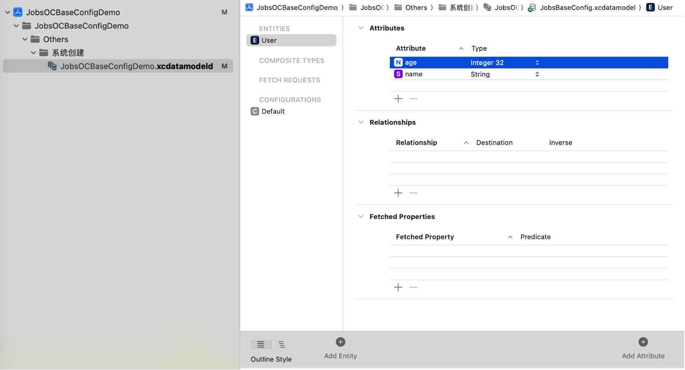

  * `AppDelegate`设置**Core Data**堆栈

    ```objective-c
    #import <UIKit/UIKit.h>
    #import <CoreData/CoreData.h>
    
    @interface AppDelegate : UIResponder <UIApplicationDelegate>
    
    Prop_strong()UIWindow *window;
    Prop_strong()NSPersistentContainer *persistentContainer;
    
    - (void)saveContext;
    
    @end
    ```

    ```objective-c
    #import "AppDelegate.h"
    
    @interface AppDelegate ()
    
    @end
    
    @implementation AppDelegate
    
    @synthesize persistentContainer = _persistentContainer;
    
    - (BOOL)application:(UIApplication *)application didFinishLaunchingWithOptions:(NSDictionary *)launchOptions {
        return YES;
    }
    
    - (NSPersistentContainer *)persistentContainer {
        @synchronized (self) {
            if (_persistentContainer == nil) {
                _persistentContainer = [[NSPersistentContainer alloc] initWithName:@"ModelName"];
                [_persistentContainer loadPersistentStoresWithCompletionHandler:^(NSPersistentStoreDescription *storeDescription, NSError *error) {
                    if (error != nil) {
                        NSLog(@"Unresolved error %@, %@", error, error.userInfo);
                        abort();
                    }
                }];
            }
        }
        return _persistentContainer;
    }
    
    - (void)saveContext {
        NSManagedObjectContext *context = self.persistentContainer.viewContext;
        if ([context hasChanges]) {
            NSError *error = nil;
            if (![context save:&error]) {
                NSLog(@"Unresolved error %@, %@", error, error.userInfo);
                abort();
            }
        }
    }
    
    @end
    ```

  * 增删查改

    ```objective-c
    #import "ViewController.h"
    #import "AppDelegate.h"
    #import <CoreData/CoreData.h>
    
    @interface ViewController ()
    
    Prop_strong() NSManagedObjectContext *context;
    
    @end
    
    @implementation ViewController
    
    - (void)viewDidLoad {
        [super viewDidLoad];
        
        self.context = ((AppDelegate *)[UIApplication sharedApplication].delegate).persistentContainer.viewContext;
        
        // 插入数据
        [self insertUserWithName:@"Alice" age:25];
        [self insertUserWithName:@"Bob" age:30];
        
        // 获取所有用户
        NSArray *users = [self fetchAllUsers];
        NSLog(@"Users: %@", users);
        
        // 更新用户
        if (users.count > 0) {
            NSManagedObject *user = users[0];
            [self updateUser:user newName:@"Alice Smith" newAge:26];
        }
        
        // 删除用户
        if (users.count > 1) {
            NSManagedObject *user = users[1];
            [self deleteUser:user];
        }
        
        // 获取更新后的用户列表
        users = [self fetchAllUsers];
        NSLog(@"Updated Users: %@", users);
    }
    
    - (void)insertUserWithName:(NSString *)name age:(NSInteger)age {
        NSManagedObject *newUser = [NSEntityDescription insertNewObjectForEntityForName:@"User" inManagedObjectContext:self.context];
        [newUser setValue:name forKey:@"name"];
        [newUser setValue:@(age) forKey:@"age"];
        [self saveContext];
    }
    
    - (NSArray *)fetchAllUsers {
        NSFetchRequest *fetchRequest = [NSFetchRequest fetchRequestWithEntityName:@"User"];
        NSError *error = nil;
        NSArray *result = [self.context executeFetchRequest:fetchRequest error:&error];
        if (error) {
            NSLog(@"Error fetching users: %@", error);
        }
        return result;
    }
    
    - (void)updateUser:(NSManagedObject *)user newName:(NSString *)newName newAge:(NSInteger)newAge {
        [user setValue:newName forKey:@"name"];
        [user setValue:@(newAge) forKey:@"age"];
        [self saveContext];
    }
    
    - (void)deleteUser:(NSManagedObject *)user {
        [self.context deleteObject:user];
        [self saveContext];
    }
    
    - (void)saveContext {
        NSError *error = nil;
        if ([self.context hasChanges] && ![self.context save:&error]) {
            NSLog(@"Unresolved error %@, %@", error, error.userInfo);
            abort();
        }
    }
    
    @end
    ```

### 54、🫆指纹识别 <a href="#前言" style="font-size:17px; color:green;"><b>🔼</b></a> <a href="#🔚" style="font-size:17px; color:green;"><b>🔽</b></a>

* 关注实现类：[**@interface  TouchID : NSObject**](https://github.com/JobsKits/JobsOCBaseConfigDemo/tree/main/JobsOCBaseConfigDemo/JobsOCBaseCustomizeUIKitCore/NSObject/BaseObject/TouchID)

### 55、**`UIScrollView`** <a href="#前言" style="font-size:17px; color:green;"><b>🔼</b></a> <a href="#🔚" style="font-size:17px; color:green;"><b>🔽</b></a>

* 如果需要将**`UIScrollView`**拖动到某个地方，就不能拖动了，需要配置其**contentSize**属性

  ```objective-c
  @synthesize scrollView = _scrollView;
  -(UIScrollView *)scrollView{
      if (!_scrollView) {
          @jobs_weakify(self)
          _scrollView = jobsMakeScrollView(^(__kindof UIScrollView * _Nullable scrollView) {
              @jobs_strongify(self)
              scrollView
                  .byDelegate(self)
                  .byShowsVerticalScrollIndicator(NO)
                  .byShowsHorizontalScrollIndicator(NO)
                  .byFrame(self.bounds)
                  .resetContentSizeWidth(1000);
          });
      }return _scrollView;
  }
  ```

* 要获取 **`UIScrollView`** 滑动的距离，你可以使用 `contentOffset` 属性。`contentOffset` 表示 `UIScrollView` 的内容视图的原点相对于 **`UIScrollView`**自身边界的偏移量。

### 56、<font id=创建UICollectionView color=red>创建**`UICollectionView`**</font> <a href="#前言" style="font-size:17px; color:green;"><b>🔼</b></a> <a href="#🔚" style="font-size:17px; color:green;"><b>🔽</b></a>

#### 56.1、关于**`UICollectionView`**  <a href="#前言" style="font-size:17px; color:green;"><b>🔼</b></a> <a href="#🔚" style="font-size:17px; color:green;"><b>🔽</b></a>

* 设置为NO，使得`UICollectionView`只能上拉，不能下拉

  ```objective-c
  _collectionView.bounces = NO;
  ```

* `UICollectionView`必须执行注册机制。当且仅当用字符串获取`UICollectionViewCell`的时候才开辟内存

  * ```objective-c
    _collectionView.registerCollectionViewClass();
    ```

  * ```objective-c
    _collectionView.registerCollectionElementKindSectionHeaderClass(TMSWalletCollectionReusableView.class);
    _collectionView.registerCollectionElementKindSectionFooterClass(TMSWalletCollectionReusableView.class);
    ```

  * ```objective-c
    _collectionView.registerCollectionElementKindSectionHeaderClass(TMSWalletCollectionReusableView.class);
    _collectionView.registerCollectionElementKindSectionFooterClass(TMSWalletCollectionReusableView.class);
    ```

* 滚动到指定位置

  * ```objective-c
    _collectionView.contentOffset = CGPointMake(0,-100);
    ```

  * ```objective-c
    [_collectionView setContentOffset:CGPointMake(0, -200) animated:YES];// 只有在viewDidAppear周期 或者 手动触发才有效
    ```

* 增加**`UICollectionView`** 的可滚动区域（`contentInset`）

  ```objective-c
  _collectionView.contentInset = UIEdgeInsetsMake(0, 0, JobsBottomSafeAreaHeight(), 0);
  ```

* 支持水平方向的<u>左拉加载</u>和<u>右拉刷新</u> [**XZMRefresh**](https://github.com/xiezhongmin/XZMRefresh)

  ```ruby
  pod 'XZMRefresh' # https://github.com/xiezhongmin/XZMRefresh
  ```

  ```objective-c
  #if __has_include(<XZMRefresh/XZMRefresh.h>)
  #import <XZMRefresh/XZMRefresh.h>
  #else
  #import "XZMRefresh.h"
  #endif
  ```

  ```objective-c
  [self layoutIfNeeded];
  @jobs_weakify(self)
  [_collectionView xzm_addNormalHeaderWithTarget:self
                                          action:selectorBlocks(^id _Nullable(id _Nullable weakSelf,
                                                                              id _Nullable arg) {
      NSLog(@"KKK加载新的数据，参数: %@", arg);
      /// 在需要结束刷新的时候调用（只能调用一次）
      /// _collectionView.endRefreshing();
      return nil;
  }, MethodName(self), self)];
  
  [_collectionView xzm_addNormalFooterWithTarget:self
                                          action:selectorBlocks(^id _Nullable(id _Nullable weakSelf,
                                                                              id _Nullable arg) {
      NSLog(@"KKK加载新的数据，参数: %@", arg);
      /// 在需要结束刷新的时候调用（只能调用一次）
      /// _collectionView.endRefreshing();
      return nil;
  }, MethodName(self), self)];
  
  [_collectionView.xzm_header beginRefreshing];
  ```
  
* 支持垂直方向上的<u>上拉加载</u>和<u>下拉刷新</u> [**MJRefresh**](https://github.com/CoderMJLee/MJRefresh) 

  ```objective-c
  pod 'MJRefresh' # https://github.com/CoderMJLee/MJRefresh
  ```

  ```objective-c
  _tableView.mj_header = self.view.MJRefreshNormalHeaderBy(jobsMakeRefreshConfigModel(^(__kindof MJRefreshConfigModel * _Nullable data) {
  		data.stateIdleTitle = @"下拉可以刷新".tr;
  		data.pullingTitle = @"下拉可以刷新".tr;
  		data.refreshingTitle = @"松开立即刷新".tr;
  		data.willRefreshTitle = @"刷新数据中".tr;
  		data.noMoreDataTitle = @"下拉可以刷新".tr;
      data.automaticallyChangeAlpha = YES;/// 根据拖拽比例自动切换透明度
      data.loadBlock = ^id _Nullable(id _Nullable data) {
          @jobs_strongify(self)
          /// 下拉刷新
          self.feedbackGenerator();//震动反馈
          self->_tableView.endRefreshing(YES);
          return nil;
      };
  }));
  ```
  
  ```objective-c
  _tableView.mj_footer = self.view.MJRefreshFooterBy(jobsMakeRefreshConfigModel(^(__kindof MJRefreshConfigModel * _Nullable data) {
      data.stateIdleTitle = @"".tr;
      data.pullingTitle = @"".tr;
      data.refreshingTitle = @"".tr;
      data.willRefreshTitle = @"".tr;
      data.noMoreDataTitle = @"".tr;
      data.loadBlock = ^id _Nullable(id _Nullable data){
          @jobs_strongify(self)
          self->_tableView.endRefreshing(YES);
          return nil;
      };
  }));
  ```
  
* 支持[**lottie**](https://github.com/airbnb/lottie-ios)动画

  ```ruby
  pod 'lottie-ios', '~> 2.5.3' # 这是OC终极版本 https://github.com/airbnb/lottie-ios
  ```

  ```objective-c
  #if __has_include(<lottie-ios/Lottie.h>)
  #import <lottie-ios/Lottie.h>
  #else
  #import "Lottie.h"
  #endif
  ```

  ```objective-c
  _tableView.mj_header = self.LOTAnimationMJRefreshHeaderBy(jobsMakeRefreshConfigModel(^(__kindof MJRefreshConfigModel * _Nullable data) {
    data.stateIdleTitle = @"下拉可以刷新".tr;
    data.pullingTitle = @"下拉可以刷新".tr;
    data.refreshingTitle = @"松开立即刷新".tr;
    data.willRefreshTitle = @"刷新数据中".tr;
    data.noMoreDataTitle = @"下拉可以刷新".tr;
    data.loadBlock = ^id _Nullable(id  _Nullable data) {
        @jobs_strongify(self)
        NSLog(@"下拉刷新");
        self.tableView.endRefreshing(self.jobsIMListMutArr.count);
        return nil;
    };
  }));
  ```

* **`UICollectionView`**的无数据占位方案

  * 静态图 [**LYEmptyView**](https://github.com/dev-liyang/LYEmptyView)

    ```ruby
    pod 'LYEmptyView' # https://github.com/dev-liyang/LYEmptyView iOS一行代码集成空白页面占位图(无数据、无网络占位图)
    ```

    ```objective-c
    #if __has_include(<LYEmptyView/LYEmptyViewHeader.h>)
    #import <LYEmptyView/LYEmptyViewHeader.h>
    #else
    #import "LYEmptyViewHeader.h"
    #endif
    ```

    ```objective-c
    _collectionView.ly_emptyView = [LYEmptyView emptyViewWithImageStr:@"暂无数据".tr
                                                             titleStr:@"暂无数据".tr
                                                            detailStr:@"".tr];
    
    _collectionView.ly_emptyView.titleLabTextColor = JobsLightGrayColor;
    _collectionView.ly_emptyView.contentViewOffset = JobsWidth(-180);
    _collectionView.ly_emptyView.titleLabFont = UIFontWeightMediumSize(16);
    ```

  * 动画 [**TABAnimated**](https://github.com/tigerAndBull/TABAnimated)

    ```ruby
    pod 'TABAnimated' # https://github.com/tigerAndBull/TABAnimated
    ```

    ```objective-c
    #if __has_include(<TABAnimated/TABAnimated.h>)
    #import <TABAnimated/TABAnimated.h>
    #else
    #import "TABAnimated.h"
    #endif
    ```

    ```objective-c
    #pragma mark —— 全局配置 TABAnimated
    -(jobsByVoidBlock _Nonnull)makeTABAnimatedConfig{
        return ^(){
            [TABAnimated.sharedAnimated initWithOnlySkeleton];
            /// 是否开启控制台Log提醒，默认不开启
            TABAnimated.sharedAnimated.openLog = YES;
            ///开启后，会在每一个动画元素上增加一个红色的数字，该数字表示该动画元素所在的下标，方便快速定位某个动画元素。
    //        TABAnimated.sharedAnimated.openAnimationTag = YES;
    //        TABAnimated.sharedAnimated.animationType;/// 全局动画类型
    //        TABAnimated.sharedAnimated.animatedHeightCoefficient;/// 动画高度与视图原有高度的比例系数，该属性仅仅对`UILabel`生效。
    //        TABAnimated.sharedAnimated.animatedColor;/// 全局动画内容颜色，默认值为0xEEEEEE
            TABAnimated.sharedAnimated.animatedBackgroundColor = JobsLightGrayColor;/// 全局动画背景颜色，默认值为UIColor.whiteColor
    //        TABAnimated.sharedAnimated.useGlobalCornerRadius;/// 是否开启全局圆角。开启后，全局圆角默认值为: 动画高度/2.0
    //        TABAnimated.sharedAnimated.animatedCornerRadius;/// 全局圆角的值。优先级：此属性 < view自身的圆角
    //        TABAnimated.sharedAnimated.useGlobalAnimatedHeight;/// 是否需要全局动画高度
    //        TABAnimated.sharedAnimated.animatedHeight;/// 全局动画高度
    //        TABAnimated.sharedAnimated.scrollEnabled;/// 是否可以在滚动，默认可以滚动
    //        TABAnimated.sharedAnimated.closeCache;/// 关闭缓存功能，默认开启
    //        TABAnimated.sharedAnimated.darkAnimatedBackgroundColor;/// 暗黑模式下，动画背景色
    //        TABAnimated.sharedAnimated.darkAnimatedColor;/// 暗黑模式下，动画内容的颜色
    //        TABAnimated.sharedAnimated.darkModeType;/// 暗黑模式选择，跟随系统、强制普通模式、强制暗黑模式
    //        TABAnimated.sharedAnimated.classicAnimation;/// 经典动画全局配置
    //        TABAnimated.sharedAnimated.dropAnimation;/// 下坠动画全局配置
    //        TABAnimated.sharedAnimated.binAnimation;/// 呼吸灯动画全局配置
    //        TABAnimated.sharedAnimated.shimmerAnimation;/// 闪光灯动画全局配置
        };
    }
    ```
    
    ```objective-c
    _collectionView.tabAnimated = [TABCollectionAnimated animatedWithCellClassArray:jobsMakeMutArr(^(__kindof NSMutableArray<NSObject *> * _Nullable arr) {
        arr.add(DDCollectionViewCell_Style2.class)
        .add(DDCollectionViewCell_Style3.class)
        .add(DDCollectionViewCell_Style4.class);
    })
                                                                      cellSizeArray:jobsMakeMutArr(^(__kindof NSMutableArray<NSObject *> * _Nullable arr) {
        arr.add(NSValue.bySize([DDCollectionViewCell_Style2 cellSizeWithModel:nil]))
            .add(NSValue.bySize([DDCollectionViewCell_Style3 cellSizeWithModel:nil]))
            .add(NSValue.bySize([DDCollectionViewCell_Style4 cellSizeWithModel:nil]))
    })
                                                                 animatedCountArray:@[@(1),@(1),@(1)]];
    [_collectionView.tabAnimated addHeaderViewClass:BaseCollectionReusableView_Style1.class
                                           viewSize:[BaseCollectionReusableView_Style1 collectionReusableViewSizeWithModel:nil]
                                          toSection:0];
    [_collectionView.tabAnimated addHeaderViewClass:BaseCollectionReusableView_Style1.class
                                           viewSize:[BaseCollectionReusableView_Style2 collectionReusableViewSizeWithModel:nil]
                                          toSection:2];
    
    _collectionView.tabAnimated.containNestAnimation = YES;
    _collectionView.tabAnimated.superAnimationType = TABViewSuperAnimationTypeShimmer;
    _collectionView.tabAnimated.canLoadAgain = YES;
    [_collectionView tab_startAnimation];   // 开启动画
    ```
    
    ```objective-c
    _collectionView.tabAnimated = [TABCollectionAnimated animatedWithCellClass:HomeCVCell.class
                                                                      cellSize:HomeCVCell.cellSizeByModel(nil)];
    _collectionView.tabAnimated.superAnimationType = TABViewSuperAnimationTypeBinAnimation;
    _collectionView.tabAnimated.canLoadAgain = YES;
    _collectionView.tabAnimated.animatedBackViewCornerRadius = JobsWidth(8);
    //_collectionView.tabAnimated.animatedBackgroundColor = JobsRedColor;
    [_collectionView tab_startAnimation];   // 开启动画
    ```


#### 56.2、关于**`UICollectionViewFlowLayout`**  <a href="#前言" style="font-size:17px; color:green;"><b>🔼</b></a> <a href="#🔚" style="font-size:17px; color:green;"><b>🔽</b></a>

  * `UICollectionView` 的一个布局对象，用于定义网格布局

  ```objective-c
  @jobs_weakify(self)
    _collectionView = BaseCollectionView.initByLayout(jobsMakeCollectionViewFlowLayout(^(UICollectionViewFlowLayout * _Nullable data) {
        @jobs_strongify(self)
        data = self.verticalLayout;
    //  data.itemSize = CGSizeMake(100, 100);  // 设置单元格尺寸
    //  data.minimumLineSpacing = 10;  // 设置行间距
    //  data.minimumInteritemSpacing = 10;  // 设置单元格之间的间距
    //  data.sectionInset = UIEdgeInsetsMake(20, 20, 20, 20);  // 设置 section 的内边距
    }));
  ```
 *  在`UICollectionViewFlowLayout`和`UICollectionViewDelegateFlowLayout`协议方法中设置布局属性时，<font color=red>**`UICollectionViewDelegateFlowLayout`协议方法的优先级更高**</font>。也就是说，如果你同时在`UICollectionViewFlowLayout`对象和`UICollectionViewDelegateFlowLayout`方法中设置了布局属性，集合视图将优先使用`UICollectionViewDelegateFlowLayout`方法中提供的值

#### 56.3、[<font color=red>**`UICollectionView`实现重叠的卡包效果**</font>](https://github.com/TMMMMMS/TMSWalletLayout)  <a href="#前言" style="font-size:17px; color:green;"><b>🔼</b></a> <a href="#🔚" style="font-size:17px; color:green;"><b>🔽</b></a>

* [**@interface TMSCollectionViewLayout : UICollectionViewLayout**](https://github.com/JobsKits/JobsOCBaseConfigDemo/tree/main/JobsOCBaseConfigDemo/%F0%9F%94%A8Manual_Add_ThirdParty%EF%BC%88%E6%8C%89%E9%9C%80%E5%BC%95%E5%85%A5%EF%BC%89/WalletLayout/TMSCollectionViewLayout)
* [**@interface TMSWalletCollectionReusableView : UICollectionReusableView<BaseViewProtocol,BaseProtocol>**](https://github.com/JobsKits/JobsOCBaseConfigDemo/tree/main/JobsOCBaseConfigDemo/%F0%9F%94%A8Manual_Add_ThirdParty%EF%BC%88%E6%8C%89%E9%9C%80%E5%BC%95%E5%85%A5%EF%BC%89/WalletLayout/TMSWalletCollectionReusableView)
* [**@interface TMSWalletCollectionViewCell : UICollectionViewCell<BaseViewProtocol>**](https://github.com/JobsKits/JobsOCBaseConfigDemo/tree/main/JobsOCBaseConfigDemo/%F0%9F%94%A8Manual_Add_ThirdParty%EF%BC%88%E6%8C%89%E9%9C%80%E5%BC%95%E5%85%A5%EF%BC%89/WalletLayout/TMSWalletCollectionViewCell)

#### 56.4、<font color=red id=关于UICollectionView的注册机制>关于**`UICollectionView`**的注册机制</font>  <a href="#前言" style="font-size:17px; color:green;"><b>🔼</b></a> <a href="#🔚" style="font-size:17px; color:green;"><b>🔽</b></a>

```objective-c
+(instancetype)cellWithCollectionView:(nonnull UICollectionView *)collectionView
                         forIndexPath:(nonnull NSIndexPath *)indexPath{
    JobsBtnStyleCVCell *cell = (JobsBtnStyleCVCell *)[collectionView collectionViewCellClass:JobsBtnStyleCVCell.class forIndexPath:indexPath];
    if (!cell) {
        collectionView.registerCollectionViewCellClass(JobsBtnStyleCVCell.class,@"");
        cell = (JobsBtnStyleCVCell *)[collectionView collectionViewCellClass:JobsBtnStyleCVCell.class forIndexPath:indexPath];
    }

    // UICollectionViewCell圆切角
//    cell.contentView.layer.cornerRadius = cell.layer.cornerRadius = JobsWidth(8);
//    cell.contentView.layer.borderWidth = cell.layer.borderWidth = JobsWidth(1);
//    cell.contentView.layer.borderColor = cell.layer.borderColor = RGBA_COLOR(255, 225, 144, 1).CGColor;
//    cell.contentView.layer.masksToBounds = cell.layer.masksToBounds = YES;

    cell.indexPath = indexPath;

    return cell;
}
```

* 注册的时候不开辟内存，只有当用字符串进行取值的时候才开辟内存

* **`UICollectionView`** 本身并没有直接提供公开的 API 来检查某个 **reuseIdentifier** 是否已经注册。如果通过字符串索取不到**`UICollectionView`**（未注册），会直接崩溃

* <font color=red>可以用方法交换去插入一个自定义标志位（**`NSMutableSet`**），如果没有在集合里面的即为未注册的**`UICollectionView`**，此时进入注册流程</font>。关注实现类：[**@interface UICollectionView (RegistrationTracking)**](https://github.com/JobsKits/JobsOCBaseConfigDemo/tree/main/JobsOCBaseConfigDemo/JobsOCBaseCustomizeUIKitCore/UICollectionView/UICollectionView%2BCategory/UICollectionView%2BRegistrationTracking)

  *  正常情况下，如果用字符串无法取**`UICollectionViewCell`**会直接崩溃，即`collectionViewCellClass`无意义。但是添加了上述的方法交换以后这里不会崩溃，其作用机制是：<font color=red>**利用方法交换，在进行复用时候，先检测标志位里面是否包含已经注册的对象索引，如果没有即进行注册，再进行复用**</font>。所以第一步得到的**Cell**一定会存在，不会出现<font color=red>**nil**</font>的情况。而保留`!cell`写法的作用更多是向下兼容，同时方便代码的阅读。同时，这个字符串是根据需要注册的cell的类名字符串化得到的，为了避免可能得命名冲突，保证全局的唯一性，在必要的时候，可以通过"<u>**加盐**</u>"的形式进行字符串拼接。（注意在用字符串进行索取的时候，也对应需要"<u>**加盐**</u>"）

  *  <font color=red>**涉及到的方法交换**</font>
  
    ```objective-c
    + (void)load {
        static dispatch_once_t onceToken;
        dispatch_once(&onceToken, ^{
    #pragma mark —— registerClass:forCellWithReuseIdentifier:
            Method originalMethod = class_getInstanceMethod(self,
                @selector(registerClass:forCellWithReuseIdentifier:));
            Method swizzledMethod = class_getInstanceMethod(self,
                @selector(swizzled_registerClass:forCellWithReuseIdentifier:));
            method_exchangeImplementations(originalMethod, swizzledMethod);
    #pragma mark —— registerClass:forSupplementaryViewOfKind:withReuseIdentifier:
            Method originalSupplementaryMethod = class_getInstanceMethod(self, @selector(registerClass:forSupplementaryViewOfKind:withReuseIdentifier:));
            Method swizzledSupplementaryMethod = class_getInstanceMethod(self, @selector(swizzled_registerClass:forSupplementaryViewOfKind:withReuseIdentifier:));
            method_exchangeImplementations(originalSupplementaryMethod, swizzledSupplementaryMethod);
    #pragma mark —— dequeueReusableCellWithReuseIdentifier:forIndexPath:
            Method originalMethod1 = class_getInstanceMethod(self.class, @selector(dequeueReusableCellWithReuseIdentifier:forIndexPath:));
            Method swizzledMethod1 = class_getInstanceMethod(self.class, @selector(swizzled_dequeueReusableCellWithReuseIdentifier:forIndexPath:));
            method_exchangeImplementations(originalMethod1, swizzledMethod1);
    #pragma mark —— dequeueReusableSupplementaryViewOfKind:withReuseIdentifier:forIndexPath:
            Method originalMethod2 = class_getInstanceMethod(self.class, @selector(dequeueReusableSupplementaryViewOfKind:withReuseIdentifier:forIndexPath:));
            Method swizzledMethod2 = class_getInstanceMethod(self.class, @selector(swizzled_dequeueReusableSupplementaryViewOfKind:withReuseIdentifier:forIndexPath:));
            method_exchangeImplementations(originalMethod2, swizzledMethod2);
        });
    }
    ```

#### 56.5、单选功能 <a href="#前言" style="font-size:17px; color:green;"><b>🔼</b></a> <a href="#🔚" style="font-size:17px; color:green;"><b>🔽</b></a>

在**选中**和**未选中**协议方法里面均需要写明逻辑

```objective-c
/// 取消选中操作
-(void)collectionView:(UICollectionView *)collectionView
didDeselectItemAtIndexPath:(NSIndexPath *)indexPath {//@@5
    NSLog(@"%s", __FUNCTION__);
    JobsBtnStyleCVCell *cell = (JobsBtnStyleCVCell *)[collectionView cellForItemAtIndexPath:indexPath];
    if(cell && cell.button) cell.button.jobsResetBackgroundImage(@"首页切换游戏种类按钮背景图（未选择）".img);
}
/// 选中操作
- (void)collectionView:(UICollectionView *)collectionView
didSelectItemAtIndexPath:(NSIndexPath *)indexPath {//@@6
    NSLog(@"%s", __FUNCTION__);
    FMHomeMainBizSubView *subView = self.subViewMutArr[indexPath.item];
    self.bringSubviewToFront(subView);
    for (JobsBtnStyleCVCell *cell in collectionView.visibleCells) {
        if(cell && cell.button) cell.button.jobsResetBackgroundImage(@"首页切换游戏种类按钮背景图（未选择）".img);
    }
    JobsBtnStyleCVCell *cell = (JobsBtnStyleCVCell *)[collectionView cellForItemAtIndexPath:indexPath];
    if(cell && cell.button) cell.button.jobsResetBackgroundImage(@"首页切换游戏种类按钮背景图（已选择）".img);
    /**
     滚动到指定位置
     _collectionView.contentOffset = CGPointMake(0,-100);
     [_collectionView setContentOffset:CGPointMake(0, -200) animated:YES];// 只有在viewDidAppear周期 或者 手动触发才有效
     */
}
```

```objective-c
-(jobsByIndexPathBlock _Nonnull)selectBy{
    @jobs_weakify(self)
    return ^(NSIndexPath *_Nullable indexPath){
        @jobs_strongify(self)
        JobsBtnStyleCVCell *cell = (JobsBtnStyleCVCell *)[self.collectionView cellForItemAtIndexPath:indexPath];
        [cell.button updateConfiguration];
        
        if ([self.collectionView.delegate respondsToSelector:@selector(collectionView:didDeselectItemAtIndexPath:)]) {
            [self.collectionView.delegate collectionView:self.collectionView didDeselectItemAtIndexPath:indexPath];
        }
        
        if ([self.collectionView.delegate respondsToSelector:@selector(collectionView:didSelectItemAtIndexPath:)]) {
            [self.collectionView.delegate collectionView:self.collectionView didSelectItemAtIndexPath:indexPath];
        }
    };
}
```

#### 56.6、**`UICollectionViewCell`**触发点击事件 <a href="#前言" style="font-size:17px; color:green;"><b>🔼</b></a> <a href="#🔚" style="font-size:17px; color:green;"><b>🔽</b></a>

<font color=red>`UICollectionView` 的选中机制是由系统管理的</font>

* 代码触发：此方法会触发**`UICollectionViewCell`**内部的刷新机制

  ```objective-c
  - (void)selectItemAtIndexPath:(nullable NSIndexPath *)indexPath animated:(BOOL)animated scrollPosition:(UICollectionViewScrollPosition)scrollPosition;
  ```

  * **更新 `cell.selected` 状态**；
  * **触发 `UICollectionViewCell` 的 `setSelected:` 方法**；
  * **间接促使 `UIButtonConfiguration` 或 UI 状态同步更新**；
  * **配合 `UICollectionViewDelegate` 自动调用 `didSelectItemAtIndexPath:`（如果已设置了 delegate）**。

* 调用系统协议触发

  ```objective-c
  if ([self.collectionView.delegate respondsToSelector:@selector(collectionView:didDeselectItemAtIndexPath:)]) {
      [self.collectionView.delegate collectionView:self.collectionView didDeselectItemAtIndexPath:indexPath];
  }
  
  if ([self.collectionView.delegate respondsToSelector:@selector(collectionView:didSelectItemAtIndexPath:)]) {
      [self.collectionView.delegate collectionView:self.collectionView didSelectItemAtIndexPath:indexPath];
  }
  ```

#### 56.7、一些用做基类的**`UICollectionViewCell`** <a href="#前言" style="font-size:17px; color:green;"><b>🔼</b></a> <a href="#🔚" style="font-size:17px; color:green;"><b>🔽</b></a>

* **`BaseCollectionViewCell`**
* **`JobsBaseCollectionViewCell`**
* **`JobsBtnStyleCVCell`**：只在**`BaseCollectionViewCell`**完整的盖一个**`Button`**，其目的是利用**`Button`**丰富的图文展示效果
* **演武堂 Demo 入口**：`JobsButtonCoverCellDemoListVC` 统一承接按钮完整覆盖 Cell 的演示，二级列表分别进入 `UITableViewCell` 和 `UICollectionViewCell` 两种表现形式
* **`JobsBtnsStyleCVCell`**：左右两边各有一个**`Button`**
* **`JobsImageViewStyleCVCell`**：只在**`BaseCollectionViewCell`**完整的盖一个**`ImageView`**
* **`JobsTextFieldStyleCVCell`**：只在**`BaseCollectionViewCell`**完整的盖一个**`TextField`**

#### 56.8、**`UICollectionView`**的完整调用 <a href="#前言" style="font-size:17px; color:green;"><b>🔼</b></a> <a href="#🔚" style="font-size:17px; color:green;"><b>🔽</b></a>

* <details id="UICollectionView的完整调用">
   <summary><strong>点我查看</strong></summary>
   
   ```objective-c
   @interface JobsImageNumberViewCVCell ()
   
   Prop_strong()UIImageView *textIMGV;
   
   @end
   
   @implementation JobsImageNumberViewCVCell
   #pragma mark —— UICollectionViewCellProtocol
   +(instancetype)cellWithCollectionView:(nonnull UICollectionView *)collectionView
                            forIndexPath:(nonnull NSIndexPath *)indexPath{
       JobsImageNumberViewCVCell *cell = (JobsImageNumberViewCVCell *)[collectionView collectionViewCellClass:JobsImageNumberViewCVCell.class forIndexPath:indexPath];
       if (!cell) {
           collectionView.registerCollectionViewCellClass(JobsImageNumberViewCVCell.class,@"");
           cell = (JobsImageNumberViewCVCell *)[collectionView collectionViewCellClass:JobsImageNumberViewCVCell.class forIndexPath:indexPath];
       }
       cell.indexPath = indexPath;
       return cell;
   }
   #pragma mark —— BaseCellProtocol
   /// 具体由子类进行复写【数据定UI】【如果所传参数为基本数据类型，那么包装成对象NSNumber进行转化承接】
   -(jobsByIDBlock _Nonnull)richElementsInCellWithModel{
       @jobs_weakify(self)
       return ^(id _Nullable model) {
           @jobs_strongify(self)
           self.backgroundColor = self.contentView.backgroundColor = JobsClearColor;
           self.textIMGV.image = model;
       };
   }
   ////具体由子类进行复写【数据定高】【如果所传参数为基本数据类型，那么包装成对象NSNumber进行转化承接】
   //+(CGFloat)cellHeightWithModel:(id _Nullable)model;
   //具体由子类进行复写【数据尺寸】【如果所传参数为基本数据类型，那么包装成对象NSNumber进行转化承接】
   +(CGSize)cellSizeWithModel:(UIImage *_Nullable)model{
       if ([model isEqual:@"小数点".img]) {
           return CGSizeMake(JobsWidth(15), JobsWidth(28));
       }return CGSizeMake(JobsWidth(19), JobsWidth(28));
   }
   #pragma mark —— lazyLoad
   -(UIImageView *)textIMGV{
       if (!_textIMGV) {
           @jobs_weakify(self)
           _textIMGV = jobsMakeImageView(^(__kindof UIImageView * _Nullable imageView) {
               @jobs_strongify(self)
               imageView.addOn(self.contentView)
                   .byAdd(^(MASConstraintMaker *make) {
                       @jobs_strongify(self)
                       make.edges.equalTo(self.contentView);
                   });
           });
       }return _textIMGV;
   }
   
   @end
   ```
   
   
   ```objective-c
   Prop_strong()BaseCollectionView *collectionView;
   ```
   
   ```objective-c
   /// BaseViewProtocol
   @synthesize collectionView = _collectionView;
   -(BaseCollectionView *)collectionView{
       if (!_collectionView) {
           @jobs_weakify(self)
           _collectionView = BaseCollectionView
               .initByLayout(self.horizontalLayout)
               .registerCollectionViewClass()
               .registerCollectionViewCellClass(JobsBtnStyleCVCell.class,@"")
               .registerCollectionElementKindSectionHeaderClass(BaseCollectionReusableView.class,@"")
               .registerCollectionElementKindSectionFooterClass(BaseCollectionReusableView.class,@"")
               .byEdgeInsets(UIEdgeInsetsMake(0, 0, 0, 0))
               /// 普通的MJRefreshHeader（触发事件）（二选一）
               .byMJRefreshHeader([MJRefreshNormalHeader headerWithRefreshingBlock:^{
                   @jobs_strongify(self)
                   /// TODO
                   NSObject.feedbackGenerator(nil);/// 震动反馈
                   self->_collectionView.endRefreshing(YES);
               }].byMJRefreshHeaderConfigModel(self.mjHeaderDefaultConfig))
               /// MJRefreshHeader的拓展：下拉刷新Lottie动画（二选一）
               .byMJRefreshHeader(self.lotAnimMJRefreshHeader.byRefreshConfigModel(jobsMakeRefreshConfigModel(^(__kindof MJRefreshConfigModel * _Nullable model) {
   
               })))
               /// 普通的MJRefreshFooter（触发事件）
               .byMJRefreshFooter([MJRefreshAutoNormalFooter footerWithRefreshingBlock:^{
                   @jobs_strongify(self)
                   /// TODO
                   NSObject.feedbackGenerator(nil);/// 震动反馈
                   self->_collectionView.endRefreshing(YES);
               }].byMJRefreshFooterConfigModel(self.mjFooterDefaultConfig))
               .byBounces(NO)///设置为NO，使得collectionView只能上拉，不能下拉
               .showsVerticalScrollIndicatorBy(NO)
               .showsHorizontalScrollIndicatorBy(NO)
               /// 无数据占位：用默认的图文占位表达（二选一）
               .emptyDataByButtonModel(jobsMakeButtonModel(^(__kindof UIButtonModel * _Nullable data) {
                   data.title = @"NO BANK CARD FOUND".tr;
                   data.titleCor = JobsWhiteColor;
                   data.titleFont = bayonRegular(JobsWidth(30));
                   data.normalImage = @"用户默认头像".img;
               }))
               /// 无数据占位：用自定义的视图表达（二选一）
               .showEmptyViewBy(FMMaintenanceView
                                .BySize(FMMaintenanceView.viewSizeByModel(nil))
                                .JobsRichViewByModel2(nil)
                                .JobsBlock1(^(id  _Nullable data) {
   
                                }))
               .addOn(self.bgImageView)
               .byAdd(^(MASConstraintMaker *make) {
                   @jobs_strongify(self)
                   /// TODO
               })
               .byBgCor(JobsClearColor)
               .dataLink(self);
   
           _collectionView.setContentOffsetByYES(CGPointMake(0, 0));// 这句最快在 viewWillLayoutSubviews 有效
   
           {/// 水平刷新控件
               [_collectionView xzm_addNormalHeaderWithTarget:self
                                                       action:selectorBlocks(^id _Nullable(id _Nullable weakSelf,
                                                                                           id _Nullable arg) {
                   NSLog(@"SSSS加载新的数据，参数: %@", arg);
                   @jobs_strongify(self)
                   /// 在需要结束刷新的时候调用（只能调用一次）
                   /// _collectionView.endRefreshing();
                   return nil;
               }, MethodName(self), self)];
   
               [_collectionView xzm_addNormalFooterWithTarget:self
                                                       action:selectorBlocks(^id _Nullable(id _Nullable weakSelf,
                                                                                           id _Nullable arg) {
                   NSLog(@"SSSS加载新的数据，参数: %@", arg);
                   @jobs_strongify(self)
                   /// 在需要结束刷新的时候调用（只能调用一次）
                   /// _collectionView.endRefreshing();
                   return nil;
               }, MethodName(self), self)];
               // 隐藏时间
               _collectionView.xzm_header.updatedTimeHidden = YES;
               [_collectionView.xzm_header beginRefreshing];
           }
   
   //        {
   //            _collectionView.tabAnimated = [TABCollectionAnimated animatedWithCellClassArray:jobsMakeMutArr(^(__kindof NSMutableArray<NSObject *> * _Nullable arr) {
   //                arr.add(DDCollectionViewCell_Style2.class)
   //                .add(DDCollectionViewCell_Style3.class)
   //                .add(DDCollectionViewCell_Style4.class);
   //            })
   //                                                                              cellSizeArray:jobsMakeMutArr(^(__kindof NSMutableArray<NSObject *> * _Nullable arr) {
   //                arr.add(NSValue.bySize([DDCollectionViewCell_Style2 cellSizeWithModel:nil]))
   //                    .add(NSValue.bySize([DDCollectionViewCell_Style3 cellSizeWithModel:nil]))
   //                    .add(NSValue.bySize([DDCollectionViewCell_Style4 cellSizeWithModel:nil]))
   //            })
   //                                                                         animatedCountArray:@[@(1),@(1),@(1)]];
   //            [_collectionView.tabAnimated addHeaderViewClass:BaseCollectionReusableView_Style1.class
   //                                                   viewSize:[BaseCollectionReusableView_Style1 collectionReusableViewSizeWithModel:nil]
   //                                                  toSection:0];
   //            [_collectionView.tabAnimated addHeaderViewClass:BaseCollectionReusableView_Style1.class
   //                                                   viewSize:[BaseCollectionReusableView_Style2 collectionReusableViewSizeWithModel:nil]
   //                                                  toSection:2];
   //
   //            _collectionView.tabAnimated.containNestAnimation = YES;
   //            _collectionView.tabAnimated.superAnimationType = TABViewSuperAnimationTypeShimmer;
   //            _collectionView.tabAnimated.canLoadAgain = YES;
   //            [_collectionView tab_startAnimation];   // 开启动画
   //        }
   //        {
   //            _collectionView.tabAnimated = [TABCollectionAnimated animatedWithCellClass:HomeCVCell.class
   //                                                                              cellSize:HomeCVCell.cellSizeByModel(nil)];
   //            _collectionView.tabAnimated.superAnimationType = TABViewSuperAnimationTypeBinAnimation;
   //            _collectionView.tabAnimated.canLoadAgain = YES;
   //            _collectionView.tabAnimated.animatedBackViewCornerRadius = JobsWidth(8);
   ////            _collectionView.tabAnimated.animatedBackgroundColor = JobsRedColor;
   //            [_collectionView tab_startAnimation];   // 开启动画
   //        }
       }return _collectionView;
   }
   ```
   
   ```objective-c
   #pragma mark - UICollectionViewDataSource
   - (NSInteger)numberOfSectionsInCollectionView:(UICollectionView *)collectionView {
       return 1;
   }
   
   - (nonnull __kindof UICollectionViewCell *)collectionView:(nonnull UICollectionView *)collectionView
                                      cellForItemAtIndexPath:(nonnull NSIndexPath *)indexPath {
       JobsImageNumberViewCVCell *cell = [JobsImageNumberViewCVCell cellWithCollectionView:collectionView
                                                                      forIndexPath:indexPath];
       cell.richElementsInCellWithModel(self.dataMutArr[indexPath.row]);
       return cell;
   }
   
   - (NSInteger)collectionView:(nonnull UICollectionView *)collectionView
        numberOfItemsInSection:(NSInteger)section {
       return self.dataMutArr.count;
   }
   #pragma mark —— UICollectionViewDelegate
   //允许选中时，高亮
   -(BOOL)collectionView:(UICollectionView *)collectionView
   shouldHighlightItemAtIndexPath:(NSIndexPath *)indexPath {
       NSLog(@"%s", __FUNCTION__);
       return YES;
   }
   // 高亮完成后回调
   -(void)collectionView:(UICollectionView *)collectionView
   didHighlightItemAtIndexPath:(NSIndexPath *)indexPath {
       NSLog(@"%s", __FUNCTION__);
   }
   // 由高亮转成非高亮完成时的回调
   -(void)collectionView:(UICollectionView *)collectionView
   didUnhighlightItemAtIndexPath:(NSIndexPath *)indexPath {
       NSLog(@"%s", __FUNCTION__);
   }
   // 设置是否允许选中
   -(BOOL)collectionView:(UICollectionView *)collectionView
   shouldSelectItemAtIndexPath:(NSIndexPath *)indexPath {
       NSLog(@"%s", __FUNCTION__);
       return YES;
   }
   // 设置是否允许取消选中
   -(BOOL)collectionView:(UICollectionView *)collectionView
   shouldDeselectItemAtIndexPath:(NSIndexPath *)indexPath {
       NSLog(@"%s", __FUNCTION__);
       return YES;
   }
   // 选中操作
   - (void)collectionView:(UICollectionView *)collectionView
   didSelectItemAtIndexPath:(NSIndexPath *)indexPath {
       NSLog(@"%s", __FUNCTION__);
   }
   // 取消选中操作
   -(void)collectionView:(UICollectionView *)collectionView
   didDeselectItemAtIndexPath:(NSIndexPath *)indexPath {
       NSLog(@"%s", __FUNCTION__);
   }
   #pragma mark —— UICollectionViewDelegateFlowLayout
   - (CGSize)collectionView:(UICollectionView *)collectionView
                     layout:(UICollectionViewLayout *)collectionViewLayout
     sizeForItemAtIndexPath:(NSIndexPath *)indexPath {
       return [JobsImageNumberViewCVCell cellSizeWithModel:self.dataMutArr[indexPath.row]];
   }
   /// 定义的是元素（垂直方向滚动的时候）垂直之间的间距 或者 是元素（水平方向滚动的时候）水平之间的间距
   - (CGFloat)collectionView:(UICollectionView *)collectionView
                      layout:(UICollectionViewLayout *)collectionViewLayout
   minimumLineSpacingForSectionAtIndex:(NSInteger)section {
       return 0;
   }
   /// 定义的是UICollectionViewScrollDirectionVertical下，元素水平之间的间距。
   /// UICollectionViewScrollDirectionHorizontal下，垂直和水平正好相反
   /// Api自动计算一行的Cell个数，只有当间距小于此定义的最小值时才会换行，最小执行单元是Section（每个section里面的样式是统一的）
   /// 定义的是元素（垂直方向滚动的时候）水平之间的间距 或者 是元素（水平方向滚动的时候）垂直之间的间距
   - (CGFloat)collectionView:(UICollectionView *)collectionView
                      layout:(UICollectionViewLayout *)collectionViewLayout
   minimumInteritemSpacingForSectionAtIndex:(NSInteger)section{
       return 0;
   }
   ///内间距
   -(UIEdgeInsets)collectionView:(UICollectionView *)collectionView
                          layout:(UICollectionViewLayout*)collectionViewLayout
          insetForSectionAtIndex:(NSInteger)section {
       return jobsSameEdgeInset(JobsWidth(0));
   }
   ```
   
   </details>

#### 56.9、**`UICollectionView`**的 `Masonry`平替 <a href="#前言" style="font-size:17px; color:green;"><b>🔼</b></a> <a href="#🔚" style="font-size:17px; color:green;"><b>🔽</b></a>

* 有些时候，我们需要一个类似于 `UICollectionView`的UI表现形式，但是又不希望涉及其复杂的协议以及内部约束。所以，转向于`Masonry`

  * 例：创建一个3 * 2 的矩形（内容为`BaseButton`）

    ```objective-c
     self.gridLayoutBy(jobsMakeMutArr(^(__kindof NSMutableArray<NSObject *> * _Nullable arr) {
                arr.add(BaseButton.jobsInit()
                        .bgColorBy(JobsClearColor)
                        .jobsResetImagePlacement(NSDirectionalRectEdgeTop)
                        .jobsResetImagePadding(1)
                        .jobsResetBtnImage(@"Betslip".img)
                        .jobsResetBtnTitleCor(JobsCor(@"#666666"))
                        .jobsResetBtnTitleFont(pingFangHKLight(JobsWidth(12)))
                        .jobsResetBtnTitle(JobsInternationalization(@"Betslip"))
                        .onClickBy(^(UIButton *x){
                            JobsLog(@"");
                        }).onLongPressGestureBy(^(id data){
                            JobsLog(@"");
                        }))
                .add(BaseButton.jobsInit()
                    .bgColorBy(JobsClearColor)
                    .jobsResetImagePlacement(NSDirectionalRectEdgeTop)
                    .jobsResetImagePadding(1)
                    .jobsResetBtnImage(@"Statement".img)
                    .jobsResetBtnTitleCor(JobsCor(@"#666666"))
                    .jobsResetBtnTitleFont(pingFangHKLight(JobsWidth(12)))
                    .jobsResetBtnTitle(JobsInternationalization(@"Statement"))
                    .onClickBy(^(UIButton *x){
                        JobsLog(@"");
                    }).onLongPressGestureBy(^(id data){
                        JobsLog(@"");
                    }))
                .add(BaseButton.jobsInit()
                    .bgColorBy(JobsClearColor)
                    .jobsResetImagePlacement(NSDirectionalRectEdgeTop)
                    .jobsResetImagePadding(1)
                    .jobsResetBtnImage(@"Promo".img)
                    .jobsResetBtnTitleCor(JobsCor(@"#666666"))
                    .jobsResetBtnTitleFont(pingFangHKLight(JobsWidth(12)))
                    .jobsResetBtnTitle(JobsInternationalization(@"Promo"))
                    .onClickBy(^(UIButton *x){
                        JobsLog(@"");
                    }).onLongPressGestureBy(^(id data){
                        JobsLog(@"");
                    }))
                .add(BaseButton.jobsInit()
                    .bgColorBy(JobsClearColor)
                    .jobsResetImagePlacement(NSDirectionalRectEdgeTop)
                    .jobsResetImagePadding(1)
                    .jobsResetBtnImage(@"Security".img)
                    .jobsResetBtnTitleCor(JobsCor(@"#666666"))
                    .jobsResetBtnTitleFont(pingFangHKLight(JobsWidth(12)))
                    .jobsResetBtnTitle(JobsInternationalization(@"Security"))
                    .onClickBy(^(UIButton *x){
                        JobsLog(@"");
                    }).onLongPressGestureBy(^(id data){
                        JobsLog(@"");
                    }))
                .add(BaseButton.jobsInit()
                    .bgColorBy(JobsClearColor)
                    .jobsResetImagePlacement(NSDirectionalRectEdgeTop)
                    .jobsResetImagePadding(1)
                    .jobsResetBtnImage(@"Help Center".img)
                    .jobsResetBtnTitleCor(JobsCor(@"#666666"))
                    .jobsResetBtnTitleFont(pingFangHKLight(JobsWidth(12)))
                    .jobsResetBtnTitle(JobsInternationalization(@"Help Center"))
                    .onClickBy(^(UIButton *x){
                        JobsLog(@"");
                    }).onLongPressGestureBy(^(id data){
                        JobsLog(@"");
                    }))
                .add(BaseButton.jobsInit()
                    .bgColorBy(JobsClearColor)
                    .jobsResetImagePlacement(NSDirectionalRectEdgeTop)
                    .jobsResetImagePadding(1)
                    .jobsResetBtnImage(@"Feedback".img)
                    .jobsResetBtnTitleCor(JobsCor(@"#666666"))
                    .jobsResetBtnTitleFont(pingFangHKLight(JobsWidth(12)))
                    .jobsResetBtnTitle(JobsInternationalization(@"Feedback"))
                    .onClickBy(^(UIButton *x){
                        JobsLog(@"");
                    }).onLongPressGestureBy(^(id data){
                        JobsLog(@"");
                    }));
            }),2,3);
    ```

### 57、<font color=red id=创建UITableView>创建**`UITableView`**</font> <a href="#前言" style="font-size:17px; color:green;"><b>🔼</b></a> <a href="#🔚" style="font-size:17px; color:green;"><b>🔽</b></a>

#### 57.1、关于<font color=red>**`UITableView`**</font> <a href="#前言" style="font-size:17px; color:green;"><b>🔼</b></a> <a href="#🔚" style="font-size:17px; color:green;"><b>🔽</b></a>

* <font color=red>**`UITableView`**的生命周期</font>

  * <u>**`UITableView`** 可以不用像**`UICollectionView`**一样执行注册机制</u>。注册机制的生命周期有别于普通的生命周期

  * 对于"三问一答"，如果**`UITableViewCell`**的高度为0，压根就不会执行**`UITableViewCell`**的绘制，即：`- (__kindof UITableViewCell *)tableView:(UITableView *)tableView cellForRowAtIndexPath:(NSIndexPath *)indexPath`。所以利用这一点，我们在进数据源的时候，可以在`- (CGFloat)tableView:(UITableView *)tableView heightForRowAtIndexPath:(NSIndexPath *)indexPath`这里面对数据源所需的高度进行计算和反馈

  * 在**`UITableViewCell`**将要出现的时候，进行最后的绘制

    ```objective-c
    - (void)tableView:(UITableView *)tableView
      willDisplayCell:(UITableViewCell *)cell
    forRowAtIndexPath:(NSIndexPath *)indexPath{
        /// 隐藏最后一个单元格的分界线
        [tableView hideSeparatorLineAtLast:indexPath
                                      cell:cell];
        /// 自定义 UITableViewCell 的箭头
        cell.img = @"向右的箭头（大）".img;
        @jobs_weakify(self)
        [cell customAccessoryView:^(id data) {
            @jobs_strongify(self)
            JobsBaseTableViewCell *cell = (JobsBaseTableViewCell *)data;
            NSLog(@"MMM - %ld",cell.index);
        }];
        /// 以 section 为单位，仅对每个 section 的最后一行 cell 做圆角处理（cell 之间没有分割线）
        [cell roundedCornerLastCellByTableView:tableView
                                     indexPath:indexPath
                                   layerConfig:jobsMakeLocationModel(^(__kindof JobsLocationModel * _Nullable model) {
            model.roundingCornersRadii = CGSizeMake(JobsWidth(10.0), JobsWidth(10.0));
            model.borderWidth = 1;
            model.layerBorderCor = JobsGrayColor;
        })];
    }
    ```

* **`UITableView`** 的初始化方法

  * ```objective-c
    BaseTableView.initWithStylePlain;
    ```

  * 会在每个`section`分组的时候，自动产生组与组之间的距离

    ```objective-c
    BaseTableView.initWithStyleGrouped;
    ```

* 对父类**`UIScrollView`**三要素（**`contentOffset`**、**`contentSize`**、**`contentInset`**）的封装设置。关注实现类[**@interface UIView (Measure)**](https://github.com/JobsKits/JobsOCBaseConfigDemo/tree/main/JobsOCBaseConfigDemo/JobsOCBaseCustomizeUIKitCore/UIView/UIView%2BCategory/UIView%2BMeasure)

  ```objective-c
  #pragma mark —— UIScrollView.contentSize
  -(jobsBySizeBlock _Nullable)resetContentSize;
  -(jobsByCGFloatBlock _Nullable)resetContentSizeWidth;
  -(jobsByCGFloatBlock _Nullable)resetContentSizeHeight;
  -(jobsByCGFloatBlock _Nullable)resetContentSizeOffsetWidth;
  -(jobsByCGFloatBlock _Nullable)resetContentSizeOffsetHeight;
  ```

  ```objective-c
  #pragma mark —— UIScrollView.contentOffset
  -(jobsByPointBlock _Nullable)resetContentOffset;
  -(jobsByCGFloatBlock _Nullable)resetContentX;
  -(jobsByCGFloatBlock _Nullable)resetContentY;
  -(jobsByCGFloatBlock _Nullable)resetContentOffsetX;
  -(jobsByCGFloatBlock _Nullable)resetContentOffsetY;
  ```

  ```objective-c
  #pragma mark —— UIScrollView.contentInset
  -(jobsByEdgeInsetBlock _Nullable)resetContentInset;
  -(jobsByCGFloatBlock _Nullable)resetContentInsetTop;
  -(jobsByCGFloatBlock _Nullable)resetContentInsetLeft;
  -(jobsByCGFloatBlock _Nullable)resetContentInsetBottom;
  -(jobsByCGFloatBlock _Nullable)resetContentInsetRight;
  -(jobsByCGFloatBlock _Nullable)resetContentInsetOffsetTop;
  -(jobsByCGFloatBlock _Nullable)resetContentInsetOffsetLeft;
  -(jobsByCGFloatBlock _Nullable)resetContentInsetOffsetBottom;
  -(jobsByCGFloatBlock _Nullable)resetContentInsetOffsetRight;
  ```

* 增加**`UITableView`** 的可滚动区域（`contentInset`）

  ```objective-c
  _tableView.contentInset = UIEdgeInsetsMake(0, 0, JobsBottomSafeAreaHeight(), 0);
  ```

* <font color=red>**滚动到指定行**</font>

  * ```objective-c
    NSInteger s = self.tableView.numberOfSections;/// 有多少组
    if (s < 1) return;
    NSInteger r = [self.tableView numberOfRowsInSection:s - 1];/// 最后一组有多少行
    if (r < 1) return;
    NSIndexPath *indexPath = [NSIndexPath indexPathForRow:r - 1 inSection:s - 1];/// 取最后一行数据
    [self.tableView scrollToRowAtIndexPath:indexPath
                          atScrollPosition:UITableViewScrollPositionBottom
                                  animated:YES];/// 滚动到最后一行
    ```

  * ```objective-c
    NSIndexPath *indexPath = [NSIndexPath indexPathForRow:0 inSection:0];/// 取第一行数据
    [self.tableView scrollToRowAtIndexPath:indexPath
                          atScrollPosition:UITableViewScrollPositionTop
                                  animated:YES];/// 滚动到第一行
    ```

* `tableHeaderView`也会随着**`UITableView`**的滚动而滚动

* **`UITableView`** 的可折叠效果。第三方分类实现，关注：[**@interface UITableView (WWFoldableTableView)**](https://github.com/JobsKits/JobsOCBaseConfigDemo/tree/main/JobsOCBaseConfigDemo/JobsOCBaseCustomizeUIKitCore/UITableView/UITableView+Category/UITableView+WWFoldableTableView)

  ```objective-c
  _tableView.byFoldable(YES);
  ```

* **`UITableView`**的无数据占位方案

  * 静态图 [**LYEmptyView**](https://github.com/dev-liyang/LYEmptyView)

    ```objective-c
    pod 'LYEmptyView' # https://github.com/dev-liyang/LYEmptyView iOS一行代码集成空白页面占位图(无数据、无网络占位图)
    ```

    ```objective-c
    #if __has_include(<LYEmptyView/LYEmptyViewHeader.h>)
    #import <LYEmptyView/LYEmptyViewHeader.h>
    #else
    #import "LYEmptyViewHeader.h"
    #endif
    ```

    ```objective-c
    _tableView.ly_emptyView = [LYEmptyView emptyViewWithImageStr:JobsInternationalization(@"暂无数据")
                                                        titleStr:JobsInternationalization(@"暂无数据")
                                                       detailStr:JobsInternationalization(@"")];
    
    _tableView.ly_emptyView.titleLabTextColor = JobsLightGrayColor;
    _tableView.ly_emptyView.contentViewOffset = JobsWidth(-180);
    _tableView.ly_emptyView.titleLabFont = UIFontWeightLightSize(16);
    ```

  * 动画 [**TABAnimated**](https://github.com/tigerAndBull/TABAnimated)

    ```ruby
    pod 'TABAnimated' # https://github.com/tigerAndBull/TABAnimated
    ```

    ```objective-c
    #if __has_include(<TABAnimated/TABAnimated.h>)
    #import <TABAnimated/TABAnimated.h>
    #else
    #import "TABAnimated.h"
    #endif
    ```

    ```objective-c
    // 可以不进行手动初始化，将使用默认属性
    _tableView.tabAnimated = [TABTableAnimated animatedWithCellClass:JobsBaseTableViewCell.class
                                                          cellHeight:JobsBaseTableViewCell.cellHeightByModel(nil)];
    _tableView.tabAnimated.superAnimationType = TABViewSuperAnimationTypeShimmer;
    [_tableView tab_startAnimation];   // 开启动画
    ```

* 支持垂直方向的<u>上拉加载</u>和<u>下拉刷新</u> [**MJRefresh**](https://github.com/CoderMJLee/MJRefresh)

  ```ruby
  pod 'MJRefresh' # https://github.com/CoderMJLee/MJRefresh NO_SMP 不支持横向刷新
  ```

  ```objective-c
  #if __has_include(<MJRefresh/MJRefresh.h>)
  #import <MJRefresh/MJRefresh.h>
  #else
  #import "MJRefresh.h"
  #endif
  ```

  ```objective-c
  _tableView.mj_header = self.view.MJRefreshNormalHeaderBy(jobsMakeRefreshConfigModel(^(__kindof MJRefreshConfigModel * _Nullable data) {
      data.stateIdleTitle = @"下拉可以刷新".tr;
      data.pullingTitle = @"下拉可以刷新".tr;
      data.refreshingTitle = @"松开立即刷新".tr;
      data.willRefreshTitle = @"刷新数据中".tr;
      data.noMoreDataTitle = @"下拉可以刷新".tr;
      data.automaticallyChangeAlpha = YES;/// 根据拖拽比例自动切换透明度
      data.loadBlock = ^id _Nullable(id _Nullable data) {
          @jobs_strongify(self)
          /// 下拉刷新
          self.feedbackGenerator();//震动反馈
          self->_tableView.endRefreshing(YES);
          return nil;
      };
  }));
  
  _tableView.mj_footer = self.view.MJRefreshFooterBy(jobsMakeRefreshConfigModel(^(__kindof MJRefreshConfigModel * _Nullable data) {
      data.stateIdleTitle = @"".tr;
      data.pullingTitle = @"".tr;
      data.refreshingTitle = @"".tr;
      data.willRefreshTitle = @"".tr;
      data.noMoreDataTitle = @"".tr;
      data.loadBlock = ^id _Nullable(id _Nullable data){
          @jobs_strongify(self)
          self->_tableView.endRefreshing(YES);
          return nil;
      };
  }));
  ```
  
* 支持水平方向的<u>左拉加载</u>和<u>右拉刷新</u> [**XZMRefresh**](https://github.com/xiezhongmin/XZMRefresh)

  ```ruby
  pod 'XZMRefresh' # https://github.com/xiezhongmin/XZMRefresh
  ```

  ```objective-c
  #if __has_include(<XZMRefresh/XZMRefresh.h>)
  #import <XZMRefresh/XZMRefresh.h>
  #else
  #import "XZMRefresh.h"
  #endif
  ```

  ```objective-c
  [self layoutIfNeeded];
  @jobs_weakify(self)
  [_tableView xzm_addNormalHeaderWithTarget:self
                                     action:selectorBlocks(^id _Nullable(id _Nullable weakSelf,
                                                                         id _Nullable arg) {
      NSLog(@"KKK加载新的数据，参数: %@", arg);
      /// 在需要结束刷新的时候调用（只能调用一次）
      /// _collectionView.endRefreshing();
      return nil;
  }, MethodName(self), self)];
  
  [_tableView xzm_addNormalFooterWithTarget:self
                                     action:selectorBlocks(^id _Nullable(id _Nullable weakSelf,
                                                                                      id _Nullable arg) {
      NSLog(@"KKK加载新的数据，参数: %@", arg);
      /// 在需要结束刷新的时候调用（只能调用一次）
      /// _collectionView.endRefreshing();
      return nil;
  }, MethodName(self), self)];
  
  [_tableView.xzm_header beginRefreshing];
  ```
  
* 切角

  * [**关于UITableViewCell和UICollectionViewCell圆切角+Cell的偏移量**](https://github.com/JobsKits/JobsOCBaseConfig/blob/main/%E6%96%87%E6%A1%A3%E5%92%8C%E8%B5%84%E6%96%99.md/%E5%85%B6%E4%BB%96.md/%E5%85%B3%E4%BA%8EUITableViewCell%E5%92%8CUICollectionViewCell%E5%9C%86%E5%88%87%E8%A7%92%2BCell%E7%9A%84%E5%81%8F%E7%A7%BB%E9%87%8F.md)

    ```objective-c
    - (void)tableView:(UITableView *)tableView
      willDisplayCell:(UITableViewCell *)cell
    forRowAtIndexPath:(NSIndexPath *)indexPath{
        /// 以 section 为单位，仅对每个 section 的最后一行 cell 做圆角处理【cell之间没有分割线】，且不描边顶部
        [cell roundedCornerLastCellByTableView:tableView
                                     indexPath:indexPath
                                   layerConfig:jobsMakeLocationModel(^(__kindof JobsLocationModel * _Nullable model) {
            model.roundingCornersRadii = CGSizeMake(JobsWidth(10.0), JobsWidth(10.0));
            model.borderWidth = 1;
            model.layerBorderCor = JobsGrayColor;
        })];
    }
    ```
  
    ```objective-c
    - (void)tableView:(UITableView *)tableView
      willDisplayCell:(UITableViewCell *)cell
    forRowAtIndexPath:(NSIndexPath *)indexPath{
        /// 以section为单位，每个section的第一行和最后一行的cell圆角化处理【cell之间没有分割线】
        [cell roundedCornerFirstAndLastCellByTableView:tableView
                                             indexPath:indexPath
                                           layerConfig:jobsMakeLocationModel(^(__kindof JobsLocationModel * _Nullable model) {
            model.roundingCornersRadii = CGSizeMake(JobsWidth(10.0), JobsWidth(10.0));
            model.borderWidth = 1;
            model.layerBorderCor = JobsGrayColor;
        })];
    }
    ```
  
* 其他

  * 隐藏最后一个单元格的分界线

    ```objective-c
    -(void)hideSeparatorLineAtLast:(NSIndexPath *)indexPath cell:(UITableViewCell *)cell{
        /// 判断是否是该 section 的最后一行
        if (indexPath.row == [self numberOfRowsInSection:indexPath.section] - 1){
            cell.separatorInset = UIEdgeInsetsMake(0, 0, 0, cell.bounds.size.width);
        }
    }
    ```
    
  * 自定义**`UITableViewCell`**的箭头
  
    <font color=red size=5>**使用前提：必须`UITableViewCell.accessoryType = UITableViewCellAccessoryDisclosureIndicator; `打开后才可以启用**</font>
  
    作用于：`- (void)tableView:(UITableView *)tableView willDisplayCell:(UITableViewCell *)cell forRowAtIndexPath:(NSIndexPath *)indexPath`
  
    ```objective-c
    -(void)customAccessoryView:(jobsByIDBlock _Nullable)customAccessoryViewBlock{
        /// 不用系统自带的箭头
        if (self.accessoryType == UITableViewCellAccessoryDisclosureIndicator) {
            @jobs_weakify(self)
            BaseButton *btn = BaseButton.initByBackgroundImage(self.img)
                .onClickBy(^(__kindof UIButton *x){
                    @jobs_strongify(self)
                    if (self.objBlock) self.objBlock(x);
                    if (customAccessoryViewBlock) customAccessoryViewBlock(self);
            });
            /// 特比注意:如果这个地方是纯view（UIView、UIIMageView...）就可以不用加size，UIButton是因为受到了UIControl，需要接收一个size，否则显示不出来
            btn.sizer = self.arrows_size;
            btn.resetWidthByOffset(JobsWidth(5));
            self.accessoryView = btn;
        }
    }
    ```
  
* <details id="UITableView的完整调用">
   <summary><strong>UITableView的完整调用</strong></summary>
   
   ```objective-c
   #pragma mark —— UI
   Prop_strong()BaseTableView *tableView;
   // 分组的 cell
   Prop_strong()NSMutableArray <NSMutableArray <__kindof UITableViewCell *>*>*tbvSectionRowCellMutArr;
   // 不分组的 cell
   Prop_strong()NSMutableArray <__kindof UITableViewCell *>*rowCellMutArr;
   // sectionView
   Prop_strong()NSMutableArray <__kindof UITableViewHeaderFooterView *>*tbvHeaderFooterViewMutArr;
   #pragma mark —— Data
   // 分组的 Data
   Prop_strong()NSMutableArray <NSMutableArray <UIViewModel *>*>*dataMutArr;
   // 不分组的 Data
   Prop_strong()NSMutableArray <UIViewModel *>*rowDataMutArr;
   ```
   
   ```objective-c
   /// self.tableView.dataLink(self);不要写在Block里面，会引起循环调用。用它进行唤起
   /// BaseViewProtocol
   @synthesize tableView = _tableView; 
   -(UITableView *)tableView{
       if (!_tableView) {
           /// 一般用 initWithStylePlain。initWithStyleGrouped会自己预留一块空间
           @jobs_weakify(self)
           _tableView = jobsMakeTableViewByInsetGrouped(^(__kindof UITableView * _Nullable tableView) {
               @jobs_strongify(self)
               tableView.bySeparatorStyle(UITableViewCellSeparatorStyleSingleLine)
                   .bySeparatorColor(HEXCOLOR(0xEEE2C8))
                   .registerHeaderFooterViewClass(MSCommentTableHeaderFooterView.class,nil)
                   .byContentInset(UIEdgeInsetsMake(0, 0, JobsBottomSafeAreaHeight(), 0))
                   .byTableHeaderView(jobsMakeView(^(__kindof UIView * _Nullable view) {
                       /// TODO
                   })) // 这里接入的就是一个UIView的派生类。只需要赋值Frame，不需要addSubview
                   .byTableFooterView(jobsMakeLabel(^(__kindof UILabel *_Nullable label) {
                       label.byText(@"- 没有更多的内容了 -".tr)
                           .byFont(UIFontWeightRegularSize(12))
                           .byTextAlignment(NSTextAlignmentCenter)
                           .byTextCor(JobsSecondaryLabelColor)
                           .makeLabelByShowingType(UILabelShowingType_03);
                   })) // 这里接入的就是一个UIView的派生类。只需要赋值Frame，不需要addSubview
                   .emptyDataByButtonModel(jobsMakeButtonModel(^(__kindof UIButtonModel * _Nullable data) {
                       data.title = @"NO MESSAGES FOUND".tr;
                       data.titleCor = JobsWhiteColor;
                       data.titleFont = bayonRegular(JobsWidth(30));
                       data.normalImage = @"小狮子".img;
                   }))
                   /// 普通的MJRefreshHeader（触发事件）@二选一
                   .byMJRefreshHeader([MJRefreshNormalHeader headerWithRefreshingBlock:^{
                       @jobs_strongify(self)
                       NSObject.feedbackGenerator(nil);/// 震动反馈
                       self->_tableView.endRefreshing(YES);
                   }].byMJRefreshHeaderConfigModel(self.mjHeaderDefaultConfig))
   //                {/// 配置封装在内部
   //                    tableView.MJRefreshNormalHeaderBy([self refreshHeaderDataBy:^id _Nullable(id  _Nullable data) {
   //                        @jobs_strongify(self)
   //                        NSObject.feedbackGenerator(nil);//震动反馈
   //                        self->_tableView.endRefreshing(YES);
   //                        return nil;
   //                    }]);
   //                    tableView.mj_header.automaticallyChangeAlpha = YES;//根据拖拽比例自动切换透明度
   //                }
                   /// MJRefreshHeader的拓展：下拉刷新Lottie动画@二选一
                   //.byMJRefreshHeader(self.lotAnimMJRefreshHeader.byRefreshConfigModel(jobsMakeRefreshConfigModel(^(__kindof MJRefreshConfigModel * _Nullable model) {})))
                   /// 普通的MJRefreshFooter（触发事件）
                   .byMJRefreshFooter([MJRefreshAutoNormalFooter footerWithRefreshingBlock:^{
                       @jobs_strongify(self)
                       NSObject.feedbackGenerator(nil);/// 震动反馈
                       self->_tableView.endRefreshing(YES);
                   }].byMJRefreshFooterConfigModel(self.mjFooterDefaultConfig))
   
                   .byShowsVerticalScrollIndicator(NO)
                   .byShowsHorizontalScrollIndicator(NO)
                   .byScrollEnabled(YES)
                   .byBgCor(JobsClearColor);
   
               if(@available(iOS 11.0, *)) {
                   tableView.contentInsetAdjustmentBehavior = UIScrollViewContentInsetAdjustmentNever;
               }else{
                   SuppressWdeprecatedDeclarationsWarning(self.automaticallyAdjustsScrollViewInsets = NO);
               }
   //            {/// 设置tabAnimated相关属性
   //                // 可以不进行手动初始化，将使用默认属性
   //                tableView.tabAnimated = [TABTableAnimated animatedWithCellClass:JobsBaseTableViewCell.class
   //                                                                      cellHeight:[JobsBaseTableViewCell cellHeightWithModel:nil]];
   //                tableView.tabAnimated.superAnimationType = TABViewSuperAnimationTypeShimmer;
   //                [tableView tab_startAnimation];   // 开启动画
   //            }
   
   //            {
   //              [tableView xzm_addNormalHeaderWithTarget:self
   //                                                 action:selectorBlocks(^id _Nullable(id _Nullable weakSelf,
   //                                                                                     id _Nullable arg) {
   //                  NSLog(@"SSSS加载新的数据，参数: %@", arg);
   //                  @jobs_strongify(self)
   //                  /// 在需要结束刷新的时候调用（只能调用一次）
   //                  /// _tableView.endRefreshing();
   //                  return nil;
   //              }, MethodName(self), self)];
   //
   //              [tableView xzm_addNormalFooterWithTarget:self
   //                                                 action:selectorBlocks(^id _Nullable(id _Nullable weakSelf,
   //                                                                                     id _Nullable arg) {
   //                  NSLog(@"SSSS加载新的数据，参数: %@", arg);
   //                  @jobs_strongify(self)
   //                  /// 在需要结束刷新的时候调用（只能调用一次）
   //                  /// _tableView.endRefreshing();
   //                  return nil;
   //              }, MethodName(self), self)];
   //              [tableView.xzm_header beginRefreshing];
   //          }
           })
           .addOn(self.view)
           .byAdd(^(MASConstraintMaker *make) {
               @jobs_strongify(self)
               make.left.right.bottom.equalTo(self.view);
               [self make:make topOffset:10];
           });
       }return _tableView;
   }
   ```
   
   ```objective-c
   #import "BaseView.h"
   
   NS_ASSUME_NONNULL_BEGIN
   
   @interface FMTableHeaderView1 : BaseView
   
   @end
   
   NS_ASSUME_NONNULL_END
   ```
   
   ```objective-c
   // sectionView
   -(NSMutableArray<__kindof UITableViewHeaderFooterView *> *)tbvHeaderFooterViewMutArr{
       if(!_tbvHeaderFooterViewMutArr){
           @jobs_weakify(self)
           _tbvHeaderFooterViewMutArr = jobsMakeMutArr(^(__kindof NSMutableArray<NSMutableArray *> * _Nullable arr) {
               @jobs_strongify(self)
               arr.add(self.tableView.tableViewHeaderFooterView(FMTBVHeaderFooterView1.class,@""))
               .add(self.tableView.tableViewHeaderFooterView(FMTBVHeaderFooterView2.class,@""))
               .add(self.tableView.tableViewHeaderFooterView(FMTBVHeaderFooterView2.class,@""));
           });
       }return _tbvHeaderFooterViewMutArr;
   }
   // 不分组的 cell
   -(NSMutableArray<__kindof UITableViewCell *> *)rowCellMutArr{
       if(!_rowCellMutArr){
           @jobs_weakify(self)
           _rowCellMutArr = jobsMakeMutArr(^(__kindof NSMutableArray<__kindof UITableViewCell *> * _Nullable arr) {
               @jobs_strongify(self)
               arr.add(FMTableViewCellStyle4.cellStyleValue1WithTableView(self.tableView));
           });
       }return _rowCellMutArr;
   }
   // 分组的 cell
   -(NSMutableArray<NSMutableArray<__kindof UITableViewCell *> *> *)tbvSectionRowCellMutArr{
       if(!_tbvSectionRowCellMutArr){
           @jobs_weakify(self)
           _tbvSectionRowCellMutArr = jobsMakeMutArr(^(__kindof NSMutableArray<NSMutableArray <__kindof UITableViewCell *>*> * _Nullable arr) {
               arr.add(jobsMakeMutArr(^(__kindof NSMutableArray<NSMutableArray <__kindof UITableViewCell *>*> * _Nullable rowCellMutArr) {
                   @jobs_strongify(self)
                   rowCellMutArr.add(FMTableViewCellStyle4.cellStyleValue1WithTableView(self.tableView))
                   .add(FMTableViewCellStyle3.cellStyleValue1WithTableView(self.tableView))
                   .add(FMTableViewCellStyle2.cellStyleValue1WithTableView(self.tableView))
                   .add(FMTableViewCellStyle4.cellStyleValue1WithTableView(self.tableView))
                   .add(FMTableViewCellStyle3.cellStyleValue1WithTableView(self.tableView))
                   .add(FMTableViewCellStyle3.cellStyleValue1WithTableView(self.tableView));
               }))
               .add(jobsMakeMutArr(^(__kindof NSMutableArray<NSMutableArray <__kindof UITableViewCell *>*> * _Nullable rowCellMutArr) {
                   @jobs_strongify(self)
                   rowCellMutArr.add([FMTableViewCellStyle3 cellStyleValue1WithTableView(self.tableView))
                       .add(FMTableViewCellStyle1.cellStyleValue1WithTableView(self.tableView);
               }))
               .add(jobsMakeMutArr(^(__kindof NSMutableArray<NSMutableArray <__kindof UITableViewCell *>*> * _Nullable rowCellMutArr) {
                   @jobs_strongify(self)
                   rowCellMutArr.add(FMTableViewCellStyle3.cellStyleValue1WithTableView(self.tableView))
                       .add(FMTableViewCellStyle1.cellStyleValue1WithTableView(self.tableView));
               }))
           });
       }return _tbvSectionRowCellMutArr;
   }
   ```
   
   ```objective-c
   // 分组的 Data
   -(NSMutableArray<NSMutableArray<UIViewModel *> *> *)dataMutArr{
       if(!_dataMutArr){
           _dataMutArr = jobsMakeMutArr(^(NSMutableArray * _Nullable dataMutArr) {
               dataMutArr.add(jobsMakeMutArr(^(__kindof NSMutableArray <UIViewModel *>*_Nullable temp) {
                   temp.data = jobsMakeViewModel(^(__kindof UIViewModel *_Nullable viewModel) {
                       viewModel.text = @"Please fill out your Personal Information completely".tr;
                       viewModel.textCor = @"#FFC700".cor;
                       viewModel.font = bayonRegular(JobsWidth(20));
                       viewModel.indexPath = JobsIndexPathForRow(0, 0);
                   });
                   temp.add(jobsMakeViewModel(^(__kindof UIViewModel * _Nullable viewModel) {
                       viewModel.text = @"Full Name".tr;
                       viewModel.textCor = @"#FFFFFF".cor;
                       viewModel.font = UIFontWeightRegularSize(14);
                       viewModel.placeholder = @"This Name must match the name on any IDs or any bank accounts".tr;
                       viewModel.indexPath = JobsIndexPathForRow(0, 1);
                       viewModel.jobsEnabled = YES;
                   }));
                   temp.add(jobsMakeViewModel(^(__kindof UIViewModel * _Nullable viewModel) {
                       viewModel.text = @"Nationality".tr;
                       viewModel.textCor = @"#FFFFFF".cor;
                       viewModel.font = UIFontWeightRegularSize(14);
                       /// 这里可以加入地理位置的判断
                       viewModel.placeholder = @"Philippines".tr;
                       viewModel.placeholderColor = @"#FFC700".cor;
                       viewModel.placeholderFont = UIFontWeightRegularSize(18);
                       viewModel.indexPath = JobsIndexPathForRow(0, 2);
                   }));
                   temp.add(jobsMakeViewModel(^(__kindof UIViewModel * _Nullable viewModel) {
                       viewModel.text = @"Date of Birth".tr;
                       viewModel.textCor = @"#FFFFFF".cor;
                       viewModel.font = UIFontWeightRegularSize(14);
                       viewModel.subText = @"21 / 09 / 2021".tr;
                       viewModel.subTextCor = @"#FFC700".cor;
                       viewModel.subFont = UIFontWeightRegularSize(18);
                       viewModel.indexPath = JobsIndexPathForRow(0, 3);
                   }));
                   temp.add(jobsMakeViewModel(^(__kindof UIViewModel * _Nullable viewModel) {
                       viewModel.text = @"Place of Birth".tr;
                       viewModel.textCor = @"#FFFFFF".cor;
                       viewModel.font = UIFontWeightRegularSize(14);
                       viewModel.indexPath = JobsIndexPathForRow(0, 4);
                   }));
                   temp.add(jobsMakeViewModel(^(__kindof UIViewModel * _Nullable viewModel) {
                       viewModel.text = @"Nature of Work".tr;
                       viewModel.textCor = @"#FFFFFF".cor;
                       viewModel.font = UIFontWeightRegularSize(14);
                       viewModel.indexPath = JobsIndexPathForRow(0, 5);
                   }));
                   temp.add(jobsMakeViewModel(^(__kindof UIViewModel * _Nullable viewModel) {
                       viewModel.text = @"Source of Income".tr;
                       viewModel.textCor = @"#FFFFFF".cor;
                       viewModel.font = UIFontWeightRegularSize(14);
                       viewModel.indexPath = JobsIndexPathForRow(0, 6);
                   }));
               }));
               dataMutArr.add(jobsMakeMutArr(^(__kindof NSMutableArray <UIViewModel *>*_Nullable temp) {
                   temp.data = jobsMakeViewModel(^(__kindof UIViewModel *_Nullable viewModel) {
                       viewModel.text = @"Current Address".tr;
                       viewModel.textCor = @"#FFC700".cor;
                       viewModel.font = bayonRegular(JobsWidth(20));
                       viewModel.indexPath = JobsIndexPathForRow(1, 0);
                   });
                   temp.add(jobsMakeViewModel(^(__kindof UIViewModel * _Nullable viewModel) {
                       viewModel.text = @"Province/City".tr;
                       viewModel.textCor = @"#FFFFFF".cor;
                       viewModel.font = UIFontWeightRegularSize(14);
                       viewModel.indexPath = JobsIndexPathForRow(1, 1);
                   }));
                   temp.add(jobsMakeViewModel(^(__kindof UIViewModel * _Nullable viewModel) {
                       viewModel.indexPath = JobsIndexPathForRow(1, 2);
                       viewModel.jobsEnabled = YES;
                   }));
               }));
               dataMutArr.add(jobsMakeMutArr(^(__kindof NSMutableArray <UIViewModel *>*_Nullable temp) {
                   temp.data = jobsMakeViewModel(^(__kindof UIViewModel *_Nullable viewModel) {
                       viewModel.text = @"Permanent Address".tr;
                       viewModel.textCor = @"#FFC700".cor;
                       viewModel.font = bayonRegular(JobsWidth(20));
                       viewModel.indexPath = JobsIndexPathForRow(2, 0);
                   });
                   temp.add(jobsMakeViewModel(^(__kindof UIViewModel * _Nullable viewModel) {
                       viewModel.text = @"Province/City".tr;
                       viewModel.textCor = @"#FFFFFF".cor;
                       viewModel.font = UIFontWeightRegularSize(14);
                       viewModel.indexPath = JobsIndexPathForRow(2, 1);
                   }));
                   temp.add(jobsMakeViewModel(^(__kindof UIViewModel * _Nullable viewModel) {
                       viewModel.indexPath = JobsIndexPathForRow(2, 2);
                       viewModel.jobsEnabled = YES;
                   }));
               }));
           });
       }return _dataMutArr;
   }
   /// 分组和不分组共用的数据源
   -(NSMutableArray<UIViewModel *> *)rowDataMutArr{
       if(!_rowDataMutArr){
           _rowDataMutArr = jobsMakeMutArr(^(__kindof NSMutableArray * _Nullable arr) {
               arr.data = jobsMakeViewModel(^(__kindof UIViewModel * _Nullable viewModel) {
                   viewModel.text = @"Please fill out your Personal Information completely".tr;
                   viewModel.textCor = @"#FFC700".cor;
                   viewModel.font = bayonRegular(JobsWidth(20));
               });
               arr.add(jobsMakeViewModel(^(__kindof UIViewModel * _Nullable viewModel) {
                   viewModel.text = @"Nationality".tr;
                   viewModel.textCor = @"#FFFFFF".cor;
                   viewModel.font = UIFontWeightRegularSize(14);
                   viewModel.placeholder = @"Philippines".tr;
               }))
               .add(jobsMakeViewModel(^(__kindof UIViewModel * _Nullable viewModel) {
                   viewModel.text = @"Nationality".tr;
                   viewModel.textCor = @"#FFFFFF".cor;
                   viewModel.font = UIFontWeightRegularSize(14);
                   viewModel.placeholder = @"Philippines".tr;
               }));
           });
       }return _rowDataMutArr;
   }
   ```
   
   ```objective-c
   #pragma mark —— UITableViewDelegate,UITableViewDataSource
   - (void)tableView:(UITableView *)tableView
   commitEditingStyle:(UITableViewCellEditingStyle)editingStyle
   forRowAtIndexPath:(NSIndexPath *)indexPath{}
   /// 编辑模式下，点击取消左边已选中的cell的按钮
   - (void)tableView:(UITableView *)tableView
   didDeselectRowAtIndexPath:(NSIndexPath *)indexPath{}
   
   - (void)tableView:(UITableView *)tableView
   didSelectRowAtIndexPath:(NSIndexPath *)indexPath{
   		UITableViewCell *cell = [tableView cellForRowAtIndexPath:indexPath];
       for (UITableViewCell *visibleCell in tableView.visibleCells) {
           
       }
   }
   
   - (NSInteger)numberOfSectionsInTableView:(UITableView *)tableView {
       return self.tbvSectionRowCellMutArr.count;
   }
   
   - (CGFloat)tableView:(UITableView *)tableView
   heightForRowAtIndexPath:(NSIndexPath *)indexPath{
       return JobsWidth(36);
   }
   
   - (NSInteger)tableView:(UITableView *)tableView
    numberOfRowsInSection:(NSInteger)section{
       return self.tbvSectionRowCellMutArr[section].count;
   }
   
   - (__kindof UITableViewCell *)tableView:(UITableView *)tableView
            cellForRowAtIndexPath:(NSIndexPath *)indexPath{
       return JobsBaseTableViewCell.cellStyleDefaultWithTableView(tableView)
           .byAccessoryType(UITableViewCellAccessoryDisclosureIndicator)
           .byIndexPath(indexPath)
           .jobsRichElementsTableViewCellBy(self.datas[indexPath.row])
               .JobsBlock1(^(id _Nullable data) {
                
               });
   }
   
   - (CGFloat)tableView:(UITableView *)tableView
   heightForHeaderInSection:(NSInteger)section{
       return JobsWidth(36);
   }
   /// 这里涉及到复用机制，return出去的是UITableViewHeaderFooterView的派生类
   /// tableView.registerHeaderFooterViewClass(BaseTableViewHeaderFooterView.class,@"");
   - (nullable __kindof UIView *)tableView:(UITableView *)tableView
                   viewForHeaderInSection:(NSInteger)section{
      /// 什么不配置就是悬浮
      /// JobsHeaderFooterViewStyleNone 还是悬浮
      /// JobsHeaderViewStyle 不是悬浮
      return BaseTableViewHeaderFooterView.initByReuseIdentifier(tableView,@"")
          .byStyle(JobsHeaderViewStyle)/// 悬浮开关
          .bySection(section)/// 悬浮配置
          .JobsRichViewByModel2(nil)
          .JobsBlock1(^(id _Nullable data) {
   
          });
   }
   
   - (void)tableView:(UITableView *)tableView
     willDisplayCell:(UITableViewCell *)cell
   forRowAtIndexPath:(NSIndexPath *)indexPath{
       /// 隐藏最后一个单元格的分界线
       [tableView hideSeparatorLineAtLast:indexPath cell:cell];
       /// 自定义 UITableViewCell 的箭头
       cell.img = @"向右的箭头（大）".img;
   //    @jobs_weakify(self)
       [cell customAccessoryView:^(id data) {
   //        @jobs_strongify(self)
           JobsBaseTableViewCell *cell = (JobsBaseTableViewCell *)data;
           JobsLog(@"MMM - %ld",cell.index);
       }];
       cell.accessoryView.resetWidth(10);
       /// 以 section 为单位，仅对每个 section 的最后一行 cell 做圆角处理（cell 之间没有分割线）
       [cell roundedCornerLastCellByTableView:tableView
                                    indexPath:indexPath
                                  layerConfig:jobsMakeLocationModel(^(__kindof JobsLocationModel * _Nullable model) {
           model.roundingCornersRadii = CGSizeMake(JobsWidth(10.0), JobsWidth(10.0));
           model.borderWidth = 1;
          model.layerBorderCor = JobsGrayColor;
      })];
   }
   #pragma mark —— UIScrollViewDelegate
   - (void)scrollViewDidScroll:(UIScrollView *)scrollView {
       /// 关闭悬停效果
       CGFloat sectionHeaderHeight = JobsWidth(36); /// header的高度
       if (scrollView.contentOffset.y <= sectionHeaderHeight && scrollView.contentOffset.y >= 0) {
           scrollView.resetContentInsetTop(-scrollView.contentOffset.y);
       } else if (scrollView.contentOffset.y >= sectionHeaderHeight) {
           scrollView.resetContentInsetTop(-sectionHeaderHeight);
       }
       scrollView.resetContentInsetOffsetBottom(200);/// 额外增加的可滑动区域距离
   }
   ```
   
   </details>
#### 57.2、关于<font id=UITableViewHeaderFooterView color=red>**`UITableViewHeaderFooterView`**</font>（**`viewForHeaderInSection`**）<a href="#前言" style="font-size:17px; color:green;"><b>🔼</b></a> <a href="#🔚" style="font-size:17px; color:green;"><b>🔽</b></a>

* **`UICollectionView`**没有类型相关的东西，有如下替代方案

  * 使用 `UICollectionReusableView` 作为头视图

* **系统默认布局**

  * 如果同时设置了`sectionHeaderHeight`和`sectionFooterHeight` ，=> 那么在每一个`sectionHeader`距离上一组的尾部，总会有一段距离（这个距离是22）

    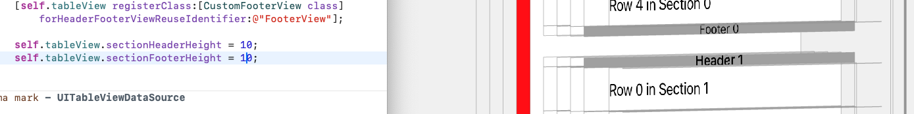

  * 如果只设置`sectionHeaderHeight`（<u>或者不管这个值设置的有多小</u>），而不设置`sectionFooterHeight` ，=> 那么在每一个`sectionHeader`距离上一组的尾部，总会有一段距离（这个距离是22）

    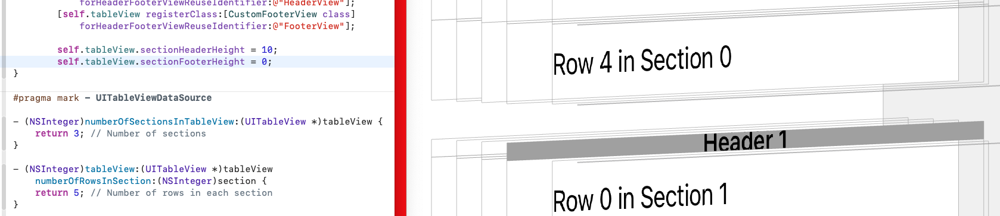

  * 如果不设置`sectionHeaderHeight`，只设置`sectionFooterHeight` ，=> <font color=red>**那么每个组之间无缝隙丝滑相接**</font>
  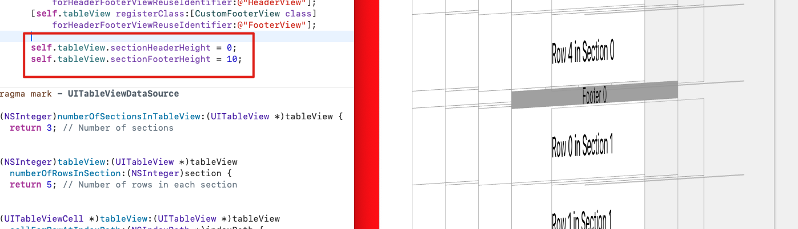

* 高度的优先级 => <font color=red>**协议方法的优先级 > 属性的优先级**</font>

  * 如果同时实现，则协议方法会覆盖属性配置

     ```objective-c
     - (CGFloat)tableView:(UITableView *)tableView heightForHeaderInSection:(NSInteger)section;
     - (CGFloat)tableView:(UITableView *)tableView heightForFooterInSection:(NSInteger)section;
     ```

    ```objective-c
    _tableView.sectionFooterHeight;
    _tableView.sectionHeaderHeight;
    ```

* **`UITableViewHeaderFooterView`** 的背景色

  * 默认情况下，**`UITableViewHeaderFooterView`**.**`backgroundView`** 是 <font color=red>nil</font>

  * ```objective-c
    self.backgroundColor 
      和 
    self.contentView.backgroundColor 
      
    均是无效操作❌
    ```

  * ```objective-c
    只有 
    self.backgroundView.backgroundColor 
    是有效操作✅
    ```

* 视图结构

  * 悬浮的时候：**UITableViewHeaderFooterView**→`_UISystemBackgroundView`(系统内部类)→<font color=red>`UIVisualEffectView`</font>(系统内部类)→<font color=red>`_UIVisualEffectBackdropView`</font>（系统内部类）→<font color=red>`_UIVisualEffectContentView`</font>（系统内部类）→`_UITableViewHeaderFooterContentView`（系统内部类）

  * 未悬浮的时候：**UITableViewHeaderFooterView**→`_UISystemBackgroundView`（系统内部类） →`UIView`→`_UITableViewHeaderFooterContentView`（系统内部类）

  * 结论

    * `_UIVisualEffectBackdropView`带背景色

    * <font color=red>**悬浮的时候，视图结构会发生变化**</font>。关注点：<u>新产生的视图的背景色</u>

    * 也就意味着，当视图内部进行调整的时候，会执行

      ```objective-c
      - (void)layoutSubviews{
          [super layoutSubviews];
          NSLog(@"");
      }
      ```

  * 解决方案

    * 在具体的`UITableViewHeaderFooterView *`子类，执行

      **此时，设置背景色是无效的**

      ```objective-c
      - (void)layoutSubviews{
          [super layoutSubviews];
          NSLog(@"");
          // 遍历子视图，找到UIVisualEffectView
            for (UIView *subview in self.subviews) {
                if([subview isKindOfClass:NSClassFromString(@"_UISystemBackgroundView")]){
                    // subview.backgroundColor = JobsClearColor; 设置成透明色，无效
                    subview.jobsVisible = NO;
                }
            }
      }
      ```

* <font color=red>**`UITableView`** 取消`viewForHeaderInSection` 产生的悬停效果</font>

  * 如果使用`BaseTableView.initWithStylePlain;`则会产生悬停效果

    * 方法一：`viewForHeaderInSection` 有值有高度 <font color=red>**强烈推荐**</font>

      假设 `viewForHeaderInSection` 的高度为 `JobsWidth(36)`，需要实现如下父类协议<UIScrollViewDelegate>关闭悬停效果

      ```objective-c
      #pragma mark - UIScrollViewDelegate
      - (void)scrollViewDidScroll:(UIScrollView *)scrollView {
          /// 关闭悬停效果
          CGFloat sectionHeaderHeight = JobsWidth(36); /// header的高度
          if (scrollView.contentOffset.y <= sectionHeaderHeight && scrollView.contentOffset.y >= 0) {
              scrollView.resetContentInsetTop(-scrollView.contentOffset.y);
          } else if (scrollView.contentOffset.y >= sectionHeaderHeight) {
              scrollView.resetContentInsetTop(-sectionHeaderHeight);
          }
          scrollView.resetContentInsetOffsetBottom(200);/// 额外增加的可滑动区域距离
      }
      ```

    * 方法二：<font color=red>**强烈推荐**</font>

      * <font color=green>**用了方法二，就可以不用方法一**</font>
      
      * [**资料来源**](https://github.com/Zydhjx/HeaderDemo)
      
      * 继承自基类**`BaseTableViewHeaderFooterView`**
      
        * <font color=red>**只能在基类实现。不可在分类实现**</font>
      
          ```objective-c
          /**
           #import "UITableViewHeaderFooterView+Attribute.h"
           在具体的子类实现，实现控制UITableViewHeaderFooterView是否悬停
           资料来源：https://github.com/Zydhjx/HeaderDemo
           */
          - (void)setFrame:(CGRect)frame {
              if (self.headerFooterViewStyle == JobsHeaderViewStyle) {
                  [super setFrame:[self.tableView rectForHeaderInSection:self.section]];
              }else if (self.headerFooterViewStyle == JobsFooterViewStyle){
                  [super setFrame:[self.tableView rectForFooterInSection:self.section]];
              }else{}
          }
          ```
      
      * 关注实现类：[**@interface BaseTableViewHeaderFooterView : UITableViewHeaderFooterView**](https://github.com/JobsKits/JobsOCBaseConfigDemo/tree/main/JobsOCBaseConfigDemo/JobsOCBaseCustomizeUIKitCore/UITableViewHeaderFooterView/BaseTableViewHeaderFooterView) + [**@interface UITableViewHeaderFooterView (Attribute)**](https://github.com/JobsKits/JobsOCBaseConfigDemo/tree/main/JobsOCBaseConfigDemo/JobsOCBaseCustomizeUIKitCore/UITableViewHeaderFooterView/BaseTableViewHeaderFooterView)
      
      * ```objective-c
        /// 这里涉及到复用机制，return出去的是UITableViewHeaderFooterView的派生类
        /// tableView.registerHeaderFooterViewClass(BaseTableViewHeaderFooterView.class,@"");
        - (nullable __kindof UIView *)tableView:(UITableView *)tableView
                   	     viewForHeaderInSection:(NSInteger)section{
           /// 什么不配置就是悬浮
           /// JobsHeaderFooterViewStyleNone 还是悬浮
           /// JobsHeaderViewStyle 不是悬浮
           return BaseTableViewHeaderFooterView.initByReuseIdentifier(tableView,@"")
               .byStyle(JobsHeaderViewStyle)/// 悬浮开关
               .bySection(section)/// 悬浮配置
               .JobsRichViewByModel2(nil)
               .JobsBlock1(^(id _Nullable data) {
        
               });
        }
        ```
      
    * 方法三：取巧，不推荐

      ```objective-c
      #pragma mark - UITableViewDelegate
      - (CGFloat)tableView:(UITableView *)tableView heightForHeaderInSection:(NSInteger)section {
          return CGFLOAT_MIN; // 设置 header 高度为非常小的值
      }
      
      - (UIView *)tableView:(UITableView *)tableView viewForHeaderInSection:(NSInteger)section {
          return jobsMakeView(^(__kindof UIView * _Nullable view) {
              
          }); // 返回一个空的 UIView
      }
      ```

  * 如果使用`BaseTableView.initWithStyleGrouped;`，则不会产生悬停效果

* <font color=red>如果需要在整个`TableView`的首尾出现一个大**View**，则用下面的代码。注意和**`viewForHeaderInSection`**进行区分</font>

  ```objective-c
  _tableView.tableHeaderView;
  _tableView.tableFooterView;
  ```

* 注册（注册不开辟内存，通过全局唯一的字符串进行取值的时候才开辟内存）

  ```objective-c
  _tableView.registerHeaderFooterViewClass(FMTBVHeaderFooterView1.class,@"");
  _tableView.registerHeaderFooterViewClass(FMTBVHeaderFooterView2.class,@"");
  ```

* 这里涉及到复用机制，`return`出去的是**`UITableViewHeaderFooterView`**的派生类

  ```objective-c
   /// 这里涉及到复用机制，return出去的是UITableViewHeaderFooterView的派生类
   /// tableView.registerHeaderFooterViewClass(BaseTableViewHeaderFooterView.class,@"");
   - (nullable __kindof UIView *)tableView:(UITableView *)tableView
                    viewForHeaderInSection:(NSInteger)section{
       /// 什么不配置就是悬浮
       /// JobsHeaderFooterViewStyleNone 还是悬浮
       /// JobsHeaderViewStyle 不是悬浮
       return BaseTableViewHeaderFooterView.initByReuseIdentifier(tableView,@"")
           .byStyle(JobsHeaderViewStyle)/// 悬浮开关
           .bySection(section)/// 悬浮配置
           .JobsRichViewByModel2(nil)
           .JobsBlock1(^(id _Nullable data) {
               
           });
   }
   
   /// 这里涉及到复用机制，return出去的是UITableViewHeaderFooterView的派生类
   /// tableView.registerHeaderFooterViewClass(BaseTableViewHeaderFooterView.class,@"");
   - (nullable __kindof UIView *)tableView:(UITableView *)tableView
              viewForFooterInSection:(NSInteger)section{
       /// 什么不配置就是悬浮
       /// JobsHeaderFooterViewStyleNone 还是悬浮
       /// JobsHeaderViewStyle 不是悬浮
       return BaseTableViewHeaderFooterView.initByReuseIdentifier(tableView,@"")
           .byStyle(JobsHeaderViewStyle)/// 悬浮开关
           .bySection(section)/// 悬浮配置
           .JobsRichViewByModel2(nil)
           .JobsBlock1(^(id _Nullable data) {
               
           });
   }
  ```
  
  ```objective-c
  - (CGFloat)tableView:(UITableView *)tableView
  heightForHeaderInSection:(NSInteger)section{
  		return JobsWidth(36);
  }
  
  - (CGFloat)tableView:(UITableView *)tableView
  heightForFooterInSection:(NSInteger)section{
      return JobsWidth(10);
  }
  ```
  
 * [<font color=red>对 **UITableView**.**section**的header和footer高度设置</font>](https://www.jianshu.com/p/65425a9d98e3)

   * 不实现 footer、header 设置方法，默认无 header、footer
   * footer 设置同 header 设置 
   * iOS 11 设置 header 高度必须同时实现 `viewForHeaderInSection` 和 `heightForHeaderInSection` 
   * iOS 11 之前版本只设置 `heightForHeaderInSection` 即可设置 header 高度，只是在 `UITableViewStyleGrouped` 时无法设置 header 高度为0，设置0时高度为系统默认高度
   
   |                    UITableViewStylePlain                     |               iOS 11               |             < iOS 11             |
   | :----------------------------------------------------------: | :--------------------------------: | :------------------------------: |
   |                   `viewForHeaderInSection`                   | 只实现此方法 header 高度为系统默认 |   只实现此方法 header 设置无效   |
   |                  `heightForHeaderInSection`                  |    只实现此方法 header 设置无效    | 只实现此方法 header 高度设置有效 |
   | 同时实现 `viewForHeaderInSection` 和 `heightForHeaderInSection` |        header 高度设置有效         |       header 高度设置有效        |
   
   |                   UITableViewStyleGrouped                    |               iOS 11               |                < iOS 11                 |
   | :----------------------------------------------------------: | :--------------------------------: | :-------------------------------------: |
   |                   `viewForHeaderInSection`                   | 只实现此方法 header 高度为系统默认 |   只实现此方法 header 高度为系统默认    |
   |                  `heightForHeaderInSection`                  | 只实现此方法 header 高度为系统默认 | 实现此方法 header 高度设置有效，不可为0 |
   | 同时实现 `viewForHeaderInSection` 和 `heightForHeaderInSection` |        header 高度设置有效         |           header 高度设置有效           |
   
 * **`UITableViewHeaderFooterView`**的子类

   ```objective-c
   #import "BaseViewProtocol.h"
   #import "UIViewModelOthersProtocol.h"
   
   NS_ASSUME_NONNULL_BEGIN
   
   @interface FMTBVHeaderFooterView1 : UITableViewHeaderFooterView
   <BaseViewProtocol,UIViewModelOthersProtocol>
   @end
   
   NS_ASSUME_NONNULL_END
   ```

   ```objective-c
   #import "FMTBVHeaderFooterView1.h"
   
   @interface FMTBVHeaderFooterView1 ()
   /// UI
   Prop_strong()UILabel *titleLab;
   
   @end
   
   @implementation FMTBVHeaderFooterView1
   @synthesize viewModel = _viewModel;
   /// 具体由子类进行复写【数据定UI】【如果所传参数为基本数据类型，那么包装成对象NSNumber进行转化承接】
   -(jobsByIDBlock)jobsRichElementsInViewWithModel{
       @jobs_weakify(self)
       return ^(id _Nullable model) {
           @jobs_strongify(self)
     		  self.contentView.backgroundColor = self.backgroundColor = JobsClearColor.colorWithAlphaComponent(0);
           if([model isKindOfClass:UIViewModel.class]){
              self.viewModel = (UIViewModel *)model;
       }self.titleLab.alpha = 1;
     };
   }
   #pragma mark —— lazyLoad
   -(UILabel *)titleLab{
       if(!_titleLab){
           @jobs_weakify(self)
           _titleLab = jobsMakeLabel(^(__kindof UILabel * _Nullable label) {
               @jobs_strongify(self)
               label.byText(self.viewModel.text)
               .byFont(self.viewModel.font)
               .byTextCor(self.viewModel.textCor)
               .addOn(self.contentView)
               .byAdd(^(MASConstraintMaker *make) {
                   @jobs_strongify(self)
                   /// TODO
               });
           });
       }return _titleLab;
   }
   
   @end
   ```

#### 57.3、锚定点击的控件下方（动画）出现的下拉菜单[**`JobsDropDownListView`**](https://github.com/JobsKits/JobsOCBaseConfigDemo/tree/main/JobsOCBaseConfigDemo/OCBaseConfig/JobsMixFunc/JobsDropDownListView) <a href="#前言" style="font-size:17px; color:green;"><b>🔼</b></a> <a href="#🔚" style="font-size:17px; color:green;"><b>🔽</b></a>

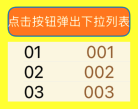

* 内部用**`UITableView`**创建

* 点击列表项后只收起一次并清理内部选择回调，再执行完成回调；`dropDownListViewDisappear` 允许传入 `nil`，此时只跳过触发控件的选中态复位。

* ```objective-c
  - (void)dealloc{
      NSLog(@"%@",JobsLocalFunc);
  //    JobsRemoveNotification(self);;
      [self endDropDownListView];
  }
  ```

  ```objective-c
  -(UIButton *)btn{
      if(!_btn){
          @jobs_weakify(self)
          _btn = BaseButton.initByButtonModel(jobsMakeButtonModel(^(__kindof UIButtonModel * _Nullable model) {
              model.title = JobsInternationalization(@"点击按钮弹出下拉列表");
              model.titleFont = UIFontWeightRegularSize(12);
              model.titleCor = JobsWhiteColor;
              model.titleLineBreakMode = NSLineBreakByWordWrapping;
              model.subtitleLineBreakMode = NSLineBreakByWordWrapping;
              model.baseBackgroundColor = JobsOrangeColor;
              model.imagePadding = JobsWidth(0);
              model.titlePadding = JobsWidth(0);
              model.imagePlacement = NSDirectionalRectEdgeNone;
              model.contentHorizontalAlignment = UIControlContentHorizontalAlignmentCenter;
              model.contentVerticalAlignment = UIControlContentVerticalAlignmentCenter;
              model.contentInsets = jobsSameDirectionalEdgeInsets(0);
              model.cornerRadiusValue = JobsWidth(8);
              model.roundingCorners = UIRectCornerAllCorners;
              model.borderWidth = JobsWidth(1);
          }))
          .onClickBy(^(UIButton *x){
              @jobs_strongify(self)
              if (self.objectBlock) self.objectBlock(x);
              NSLog(@"AAA = %@",self.dropDownListView);
              x.selected = !x.selected;
              if (x.selected) {
                  /// ❤️只能让它执行一次❤️
                  self.dropDownListView = [self motivateFromView:x
                                   jobsDropDownListViewDirection:self.dropDownListViewDirection
                                                            data:self.listViewData
                                              motivateViewOffset:JobsWidth(5)
                                                     finishBlock:^(UIViewModel *data) {
                      NSLog(@"data = %@",data);
                  }];
              }else{
                  [self endDropDownListView];
              }
          }).onLongPressGestureBy(^(id data){
              JobsLog(@"按钮的长按事件触发");
          })
          .addOn(self.view)
          .byAdd(^(MASConstraintMaker *make) {
              @jobs_strongify(self)
              /// TODO
          })
          .makeBtnLabelByShowingType(UILabelShowingType_03);
      }return _btn;
  }
  ```

### 58、**`UITableViewCell`** <a href="#前言" style="font-size:17px; color:green;"><b>🔼</b></a> <a href="#🔚" style="font-size:17px; color:green;"><b>🔽</b></a>

* **`UITableViewCell`** 的自带样式。关注实现类：[**@implementation UITableViewCell (UITableViewCellProtocol)**](https://github.com/JobsKits/JobsOCBaseConfigDemo/blob/main/JobsOCBaseConfigDemo/JobsOCBaseCustomizeUIKitCore/UITableViewCell/UITableViewCell%2BCategory/UITableViewCell%2BUITableViewCellProtocol/UITableViewCell%2BUITableViewCellProtocoll.m)

  * <font color=blue>**UITableViewCellStyleDefault**</font>

    ```objective-c
    +(JobsRetTableViewCellByTableViewBlock _Nonnull)cellStyleDefaultWithTableView{
        @jobs_weakify(self)
        return ^(UITableView * _Nonnull tableView) {
            @jobs_strongify(self)
            UITableViewCell *cell = tableView.tableViewCellClass(self.class,@"");
            if (!cell) {
                cell = [self initTableViewCell:self
                                     withStyle:UITableViewCellStyleDefault];
                cell.settingForTableViewCell();
            }return cell;
        };
    }
    ```

    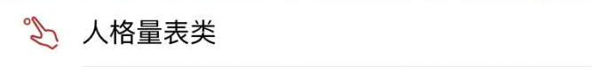

  * <font color=blue>**UITableViewCellStyleSubtitle**</font>

    ```objective-c
    +(JobsRetTableViewCellByTableViewBlock _Nonnull)cellStyleSubtitleWithTableView{
        @jobs_weakify(self)
        return ^(UITableView * _Nonnull tableView) {
            @jobs_strongify(self)
            UITableViewCell *cell = (UITableViewCell *)tableView.tableViewCellClass(self.class,@"");
            if (!cell) {
                cell = [self initTableViewCell:self
                                     withStyle:UITableViewCellStyleSubtitle];
                cell.settingForTableViewCell();
            }return cell;
        };
    }
    ```

    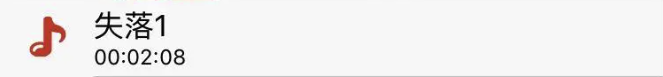

  * <font color=blue>**UITableViewCellStyleValue1**</font>

    ```objective-c
    +(JobsRetTableViewCellByTableViewBlock _Nonnull)cellStyleValue1WithTableView{
        @jobs_weakify(self)
        return ^(UITableView * _Nonnull tableView) {
            @jobs_strongify(self)
            UITableViewCell *cell = tableView.tableViewCellClass(self.class,@"");
            if (!cell) {
                cell = [self initTableViewCell:self
                                     withStyle:UITableViewCellStyleValue1];
                cell.settingForTableViewCell();
            }return cell;
        };
    }
    ```

    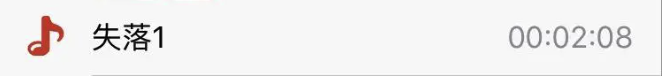

  * <font color=blue>**UITableViewCellStyleValue2**</font>

    ```objective-c
    +(JobsRetTableViewCellByTableViewBlock _Nonnull)cellStyleValue2WithTableView{
        @jobs_weakify(self)
        return ^(UITableView * _Nonnull tableView) {
            @jobs_strongify(self)
            UITableViewCell *cell = tableView.tableViewCellClass(self.class,@"");
            if (!cell) {
                cell = [self initTableViewCell:self
                                     withStyle:UITableViewCellStyleValue2];
                cell.settingForTableViewCell();
            }return cell;
        };
    }
    ```

    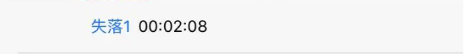

* 一些用做基类的**`UITableViewCell`**

  * **`JobsBaseTableViewCell`**：用于内部子控件的重定义Frame
  * **`JobsBtnStyleTBVCell`**：将一个按钮整体覆盖在`TableViewCell`之上，利用按钮内部图文进行布局
    * **`JobsImageStyleTBVCell`**：将一个图像整体覆盖在`TableViewCell`之上
  * **`JobsTextStyleTBVCell`**：将一个文本整体覆盖在`TableViewCell`之上
    * **`JobsBtnsStyleTBVCell`**：左右两边各有一个`UIButton`

* **`UITableViewCell`**.<font color=red>**registerClass**</font>

  * 使用`registerClass`注册`UITableViewCell`与直接创建`UITableViewCell`实例之间的**主要区别在于单元格的重用机制**

  * **生命周期**

    * **注册阶段**

      当调用 `registerClass` 方法时，`UITableView` 会提前为指定的重用标识符（`CellIdentifier`）注册一个 `UITableViewCell` 类。这样，当需要显示单元格时，`UITableView` 可以快速创建单元格实例。

      ```objective-c
      [self.tableView registerClass:UITableViewCell.class forCellReuseIdentifier:@"CellIdentifier"];
      ```

    * **创建阶段**

      ```objective-c
      UITableViewCell *cell = [tableView dequeueReusableCellWithIdentifier:@"CellIdentifier"];
      if (cell == nil) {
          cell = [UITableViewCell.alloc initWithStyle:UITableViewCellStyleDefault reuseIdentifier:@"CellIdentifier"];
      ```

      - 在 `tableView:cellForRowAtIndexPath:` 方法中，当需要显示某一行时，调用 `dequeueReusableCellWithIdentifier:` 方法
      - 如果有可重用的单元格存在（即之前已经创建并离开屏幕的单元格），则返回该重用单元格
      - 如果没有可重用的单元格存在，`UITableView` 会使用 `registerClass` 注册的类来创建一个新的单元格实例

    * **配置阶段**

      - 调用 `cellForRowAtIndexPath:` 方法时，获取重用或新创建的单元格实例，并配置其内容

    * **显示阶段**

      - 将配置好的单元格显示在屏幕上

    * **重用阶段**

      - 当单元格滑出屏幕时，系统会将其放入重用队列，以便后续使用

* 示例代码

  * 使用 **`registerClass`** 注册 **`UITableViewCell`**

    ```objective-c
    - (void)viewDidLoad {
        [super viewDidLoad];
        [self.tableView registerClass:[UITableViewCell class] forCellReuseIdentifier:@"CellIdentifier"];
    }
    
    - (__kindof UITableViewCell *)tableView:(UITableView *)tableView 
                      cellForRowAtIndexPath:(NSIndexPath *)indexPath{
        UITableViewCell *cell = [tableView dequeueReusableCellWithIdentifier:@"CellIdentifier" forIndexPath:indexPath];
        cell.textLabel.text = [NSString stringWithFormat:@"Row %ld", (long)indexPath.row];
        return cell;
    }
    ```

  * 不使用 **registerClass** 直接创建 **`UITableViewCell`**

    ```objective-c
    - (__kindof UITableViewCell *)tableView:(UITableView *)tableView
                      cellForRowAtIndexPath:(NSIndexPath *)indexPath{
        UITableViewCell *cell = [tableView dequeueReusableCellWithIdentifier:@"CellIdentifier"];
        if (cell == nil) {
            cell = [[UITableViewCell alloc] initWithStyle:UITableViewCellStyleDefault reuseIdentifier:@"CellIdentifier"];
        }
        cell.textLabel.text = [NSString stringWithFormat:@"Row %ld", (long)indexPath.row];
        return cell;
    }
    ```

* 编辑模式

  ```objective-c
  - (void)tableView:(UITableView *)tableView
  commitEditingStyle:(UITableViewCellEditingStyle)editingStyle
  forRowAtIndexPath:(NSIndexPath *)indexPath{
      
  }
  ```

  ```objective-c
  /// 编辑模式下，点击取消左边已选中的cell的按钮
  - (void)tableView:(UITableView *)tableView
  didDeselectRowAtIndexPath:(NSIndexPath *)indexPath{
      
  }
  ```

* [**MGSwipeTableCell**](https://github.com/MortimerGoro/MGSwipeTableCell) 滑动的**`TableViewCell`**

  ```ruby
  pod 'MGSwipeTableCell' # https://github.com/MortimerGoro/MGSwipeTableCell 滑动tableViewCell
  ```

  ```objective-c
  #if __has_include(<MGSwipeTableCell/MGSwipeTableCell.h>)
  #import <MGSwipeTableCell/MGSwipeTableCell.h>
  #else
  #import "MGSwipeTableCell.h"
  #endif
  ```

### 59、**`JobsStepView`** <a href="#前言" style="font-size:17px; color:green;"><b>🔼</b></a> <a href="#🔚" style="font-size:17px; color:green;"><b>🔽</b></a>

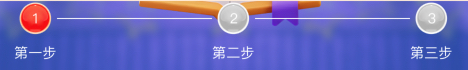

  ```objective-c
  -(JobsStepView *)stepView{
      if(!_stepView){
          _stepView = jobsMakeStepView(^(__kindof JobsStepView * _Nullable stepView) {
              stepView.byOffset(JobsWidth(10))
              .byLeftViewWidth(JobsWidth(60))
              .byRightViewWidth(JobsWidth(60))
              .byBtnOffset(JobsWidth(60))
              .byFirstBtnLeftOffset(JobsWidth(24))
              .byLeftLabHighlightBgCor(@"#C71A1A".cor)
              .byRightLabHighlightBgCor(@"#C71A1A".cor)
              .byLeftLabNormalBgCor(JobsGrayColor)
              .byRightLabNormalBgCor(JobsGrayColor)
              .byStatus(VerificationStatusVerifying)
              .jobsRichViewByModel(jobsMakeMutArr(^(__kindof NSMutableArray <__kindof UIButtonModel *>* _Nullable data) {
                  data.add(JobsStepView.makeButtonModelBy(@"Unverified".tr,@"正在进行第一步".img,@"正在进行第一步".img))
                      .add(JobsStepView.makeButtonModelBy(@"Verifiying".tr,@"还未进行第二步".img,@"正在进行第二步".img))
                      .add(JobsStepView.makeButtonModelBy(@"Verified".tr,@"还未进行第三步".img,@"正在进行第三步".img));
              }));
          })
          .addOn(self.view)
          .byAdd(^(MASConstraintMaker *make) {
              @jobs_strongify(self)
              /// TODO
          })
          .byBgCor(JobsWhiteColor);
      }return _stepView;
  }
  ```

```objective-c
#pragma mark —— 一些公有方法
+(JobsRetButtonModelByStringAndImagesBlock _Nonnull)makeButtonModelBy{
    return ^__kindof UIButtonModel *_Nullable(__kindof NSString *_Nullable title,
                                              UIImage *_Nullable image,
                                              UIImage *_Nullable highlightImage){
        return jobsMakeButtonModel(^(__kindof UIButtonModel * _Nullable model) {
            model.title = title;
            model.titleCor = JobsGrayColor;
            model.selectedTitleCor = JobsCor(@"#111111");
            model.titleFont = pingFangHKRegular(JobsWidth(14));
            model.normalImage = image;
            model.highlightImage = highlightImage;
            model.imagePlacement = NSDirectionalRectEdgeTop;
            model.imagePadding = JobsWidth(8);
            model.roundingCorners = UIRectCornerAllCorners;
            model.baseBackgroundColor = JobsClearColor;
        });
    };
}
```


### 60、关于**`UITabBarController`** <a href="#前言" style="font-size:17px; color:green;"><b>🔼</b></a> <a href="#🔚" style="font-size:17px; color:green;"><b>🔽</b></a>

#### 60.1、架构说明 <a href="#前言" style="font-size:17px; color:green;"><b>🔼</b></a> <a href="#🔚" style="font-size:17px; color:green;"><b>🔽</b></a>

* <font color=red size=5>`JobsTabBarVC`</font>：**`UITabBarController`**
  * `JobsTabBarItemConfig`：**`NSObject`**
  * **UITabBarItem**
    * `JobsTabBarItem`：**`UITabBarItem`**
    * `UITabBarItem+TLAnimation`
  * **UITabBar**
    * `UITabBar+Ex`
    * `UITabBar+TLAnimation`
    * `JobsTabBar`：**`UITabBar`**
* <font color=red size=5>`JobsCustomTabBarVC`</font>：**`UITabBarController`**
  * `JobsCustomTabBarConfig`：**`NSObject`**
  * `JobsCustomTabBar`：**`UIView`**
  * `JobsCustomTabBarButton`：**`UIButton`**
* <font color=red size=5>`LZTabBarController`</font>：**`UITabBarController`**
  * `LZTabBar`：**`UIView`**
  * `LZTabBarConfig` ：**`NSObject`**
  * `LZTabBarItem`：**`UIView`**

#### 60.2、[自定义 **`UITabBarController`**](https://github.com/JobsKits/JobsOCBaseConfigDemo/blob/main/JobsOCBaseConfigDemo/OCBaseConfig/JobsMixFunc/UITabBarCtr/%E8%87%AA%E5%AE%9A%E4%B9%89%20UITabBarController.md/%E8%87%AA%E5%AE%9A%E4%B9%89%20UITabBarController.md) <a href="#前言" style="font-size:17px; color:green;"><b>🔼</b></a> <a href="#🔚" style="font-size:17px; color:green;"><b>🔽</b></a>

### 61、🔪切角 <a href="#前言" style="font-size:17px; color:green;"><b>🔼</b></a> <a href="#🔚" style="font-size:17px; color:green;"><b>🔽</b></a>

* 切整个**View**的4个角为统一的切角参数

  ```objective-c
  -(JobsRetViewByFloatBlock _Nonnull)cornerCutToCircleWithCornerRadius{
      @jobs_weakify(self)
      return ^(CGFloat cornerRadiusValue) {
          @jobs_strongify(self)
          self.layer.cornerRadius = cornerRadiusValue;
          self.layer.masksToBounds = YES;
          return self;
      };
  }
  ```

* 指定圆切角

  ⚠️这种写法存在一定的弊端：如果在某个View上添加子View，并对这个View使用如下方法的圆切角，则这个View上的子视图不可见⚠️

  ```objective-c
  -(void)appointCornerCutToCircleByRoundingCorners:(UIRectCorner)corners cornerRadii:(CGSize)cornerRadii{
      // 设置切哪个直角
      //    UIRectCornerTopLeft     = 1 << 0,  左上角
      //    UIRectCornerTopRight    = 1 << 1,  右上角
      //    UIRectCornerBottomLeft  = 1 << 2,  左下角
      //    UIRectCornerBottomRight = 1 << 3,  右下角
      //    UIRectCornerAllCorners  = ~0UL     全部角
      /// 得到view的遮罩路径
      UIBezierPath *maskPath = [UIBezierPath bezierPathWithRoundedRect:self.bounds
                                                     byRoundingCorners:corners
                                                           cornerRadii:cornerRadii];
      @jobs_weakify(self)
      self.layer.mask = jobsMakeCAShapeLayer(^(__kindof CAShapeLayer * _Nullable data) {
          @jobs_strongify(self)
          data.frame = self.bounds;
          data.path = maskPath.CGPath;
      });
  }
  ```

### 62、刷新控件 <a href="#前言" style="font-size:17px; color:green;"><b>🔼</b></a> <a href="#🔚" style="font-size:17px; color:green;"><b>🔽</b></a>

> 期望：垂直/水平刷新，合二为一

* <font color=blue>都是锚定在其公共父类**UIScrollView**</font>

#### 62.1、纵向的刷新 [**MJRefresh**](https://github.com/CoderMJLee/MJRefresh) <a href="#前言" style="font-size:17px; color:green;"><b>🔼</b></a> <a href="#🔚" style="font-size:17px; color:green;"><b>🔽</b></a>

* 集成方式
  
  ```ruby
  pod 'MJRefresh' # https://github.com/CoderMJLee/MJRefresh NO_SMP 不支持横向刷新
  ```
  
  ```objective-c
  #if __has_include(<MJRefresh/MJRefresh.h>)
  #import <MJRefresh/MJRefresh.h>
  #else
  #import "MJRefresh.h"
  #endif
  ```
  
*  相关继承关系图
  
  ```Mermaid
  classDiagram
      UIView <|-- MJRefreshComponent
      MJRefreshComponent <|-- MJRefreshHeader
      MJRefreshComponent <|-- MJRefreshFooter
      MJRefreshHeader <|-- MJRefreshStateHeader
      MJRefreshStateHeader <|-- MJRefreshGifHeader
      MJRefreshStateHeader <|-- MJRefreshNormalHeader
      MJRefreshFooter <|-- MJRefreshAutoFooter
      MJRefreshFooter <|-- MJRefreshBackFooter
      MJRefreshAutoFooter <|-- MJRefreshAutoStateFooter
      MJRefreshAutoStateFooter <|-- MJRefreshAutoGifFooter
      MJRefreshAutoStateFooter <|-- MJRefreshAutoNormalFooter
      MJRefreshBackFooter <|-- MJRefreshBackStateFooter
      MJRefreshBackStateFooter <|-- MJRefreshBackGifFooter
      MJRefreshBackStateFooter <|-- MJRefreshBackNormalFooter
  
      class UIView {
      }
  
      class MJRefreshComponent {
      }
  
      class MJRefreshHeader {
      }
  
      class MJRefreshFooter {
      }
  
      class MJRefreshStateHeader {
      }
  
      class MJRefreshGifHeader {
      }
  
      class MJRefreshNormalHeader {
      }
  
      class MJRefreshAutoFooter {
      }
  
      class MJRefreshBackFooter {
      }
  
      class MJRefreshAutoStateFooter {
      }
  
      class MJRefreshAutoGifFooter {
      }
  
      class MJRefreshAutoNormalFooter {
      }
  
      class MJRefreshBackStateFooter {
      }
  
      class MJRefreshBackGifFooter {
      }
  
      class MJRefreshBackNormalFooter {
      }
  ```
  
*  使用方式
  
  * [**对`UITableView`的使用方式**](#创建UITableView) 
  * [**对`UICollectionView`的使用方式**](#创建UICollectionView)

#### 62.2、水平方向的刷新 [**XZMRefresh**](https://github.com/xiezhongmin/XZMRefresh) <a href="#前言" style="font-size:17px; color:green;"><b>🔼</b></a> <a href="#🔚" style="font-size:17px; color:green;"><b>🔽</b></a>

* 集成方式
  
  ```ruby
  pod 'XZMRefresh' # https://github.com/xiezhongmin/XZMRefresh
  ```
  
  ```objective-c
  #if __has_include(<XZMRefresh/XZMRefresh.h>)
  #import <XZMRefresh/XZMRefresh.h>
  #else
  #import "XZMRefresh.h"
  #endif
  ```
  
* 相关继承关系图

  ```Mermaid
  classDiagram
      UIView <|-- XZMBaseRefreshView
      XZMBaseRefreshView <|-- XZMRefreshHeader
      XZMBaseRefreshView <|-- XZMRefreshFooter
      XZMRefreshHeader <|-- XZMRefreshNormalHeader
      XZMRefreshHeader <|-- XZMRefreshGifHeader
      XZMRefreshFooter <|-- XZMRefreshNormalFooter
      XZMRefreshFooter <|-- XZMRefreshGifFooter
      
      class UIView{
      }
  
      class XZMBaseRefreshView{
      }
  
      class XZMRefreshHeader{
      }
  
      class XZMRefreshNormalHeader{
      }
  
      class XZMRefreshGifHeader{
      }
  
      class XZMRefreshFooter{
      }
  
      class XZMRefreshNormalFooter{
      }
  
      class XZMRefreshGifFooter{
      }
  ```
  
* <font color=red>**值得注意**</font>

  * 需要在母控件正确得出Frame值以后，**XZMRefresh**方可生效。否则可能出现**xzm_header**或者**xzm_footer**的Frame值不正确（比如，高为0）

    * ```objective-c
      [self layoutIfNeeded];
      ```
  
    * ```objective-c
      [self.view layoutIfNeeded];
      ```
  
  * 如果母控件是**`UICollectionView`**，需要使用<font color=red>**`XZMLayout`**</font>
  
    ```objective-c
    #import <UIKit/UIKit.h>
    @interface XZMLayout : UICollectionViewFlowLayout
    @end
    ```
  
    ```objective-c
    @implementation XZMLayout
    
    -(instancetype)init{
        if (self = [super init]) {
            
        }return self;
    }
    /**
     * 当collectionView的显示范围发生改变的时候，是否需要重新刷新布局
     * 一旦重新刷新布局，就会重新调用下面的方法：
     1.prepareLayout
     2.layoutAttributesForElementsInRect:方法
     */
    - (BOOL)shouldInvalidateLayoutForBoundsChange:(CGRect)newBounds{
        return YES;
    }
    /// 用来做布局的初始化操作（不建议在init方法中进行布局的初始化操作）
    - (void)prepareLayout{
        [super prepareLayout];
        // 水平滚动
        self.scrollDirection = UICollectionViewScrollDirectionHorizontal;
        CGFloat inset = (self.collectionView.frame.size.width - self.itemSize.width) * 0.5;
        /** 设置内边距 */
        self.sectionInset = UIEdgeInsetsMake(0, inset, 0, inset);
    }
    /**
     UICollectionViewLayoutAttributes *attrs;
     1.一个cell对应一个UICollectionViewLayoutAttributes对象
     2.UICollectionViewLayoutAttributes对象决定了cell的frame
     */
    /// 这个方法的返回值是一个数组（数组里面存放着rect范围内所有元素的布局属性）
    /// 这个方法的返回值决定了rect范围内所有元素的排布（frame）
    - (NSArray *)layoutAttributesForElementsInRect:(CGRect)rect{
        // 获得super已经计算好的布局属性
        NSArray *array = [super layoutAttributesForElementsInRect:rect];
        // 计算collectionView最中心点的x值
        CGFloat centerX = self.collectionView.contentOffset.x + self.collectionView.frame.size.width * 0.5;
        // 在原有布局属性的基础上，进行微调
        for (UICollectionViewLayoutAttributes *attrs in array) {
            // cell的中心点x 和 collectionView最中心点的x值 的间距
            CGFloat delta = ABS(attrs.center.x - centerX);
            // 根据间距值 计算 cell的缩放比例
            CGFloat scale = 1 - delta / self.collectionView.frame.size.width * 0.15;
            // 设置缩放比例
            attrs.transform = CGAffineTransformMakeScale(scale, scale);
        }return array;
    }
    /// 这个方法的返回值，就决定了collectionView停止滚动时的偏移量
    - (CGPoint)targetContentOffsetForProposedContentOffset:(CGPoint)proposedContentOffset
                                     withScrollingVelocity:(CGPoint)velocity{
        // 计算出最终显示的矩形框
        CGRect rect;
        rect.origin.y = 0;
        rect.origin.x = proposedContentOffset.x;
        rect.size = self.collectionView.frame.size;
        // 获得super已经计算好的布局属性
        NSArray *array = [super layoutAttributesForElementsInRect:rect];
        // 计算collectionView最中心点的x值
        CGFloat centerX = proposedContentOffset.x + self.collectionView.frame.size.width * 0.5;
        // 存放最小的间距值
        CGFloat minDelta = MAXFLOAT;
        for (UICollectionViewLayoutAttributes *attrs in array) {
            if (ABS(minDelta) > ABS(attrs.center.x - centerX)) {
                minDelta = attrs.center.x - centerX;
            }
        }
        // 修改原有的偏移量
        proposedContentOffset.x += minDelta;
        return proposedContentOffset;
    }
    
    @end
    ```
  
* 使用方式（以**UICollectionView**为例，**UITableView**同理）

  * **`UICollectionView` + 默认刷新**

    ```objective-c
    -(void)example01{
        @jobs_weakify(self)
        [_collectionView xzm_addNormalHeaderWithTarget:self
                                                action:selectorBlocks(^id _Nullable(id _Nullable weakSelf,
                                                                                    id _Nullable arg) {
            NSLog(@"SSSS加载新的数据，参数: %@", arg);
            @jobs_strongify(self)
            /// 在需要结束刷新的时候调用（只能调用一次）
            /// _collectionView.endRefreshing();
            return nil;
        }, MethodName(self), self)];
    
        [_collectionView xzm_addNormalFooterWithTarget:self
                                                action:selectorBlocks(^id _Nullable(id _Nullable weakSelf,
                                                                                    id _Nullable arg) {
            NSLog(@"SSSS加载新的数据，参数: %@", arg);
            @jobs_strongify(self)
            /// 在需要结束刷新的时候调用（只能调用一次）
            /// _collectionView.endRefreshing();
            return nil;
        }, MethodName(self), self)];
    
        [_collectionView.xzm_header beginRefreshing];
    }
    ```
    
  * **`UICollectionView` + 隐藏时间**
  
    ```objective-c
    -(void)example02{
        @jobs_weakify(self)
        [_collectionView xzm_addNormalHeaderWithTarget:self
                                                action:selectorBlocks(^id _Nullable(id _Nullable weakSelf,
                                                                                    id _Nullable arg) {
            NSLog(@"SSSS加载新的数据，参数: %@", arg);
            @jobs_strongify(self)
            /// 在需要结束刷新的时候调用（只能调用一次）
            /// _collectionView.endRefreshing();
            return nil;
        }, MethodName(self), self)];
    
        [_collectionView xzm_addNormalFooterWithTarget:self
                                                action:selectorBlocks(^id _Nullable(id _Nullable weakSelf,
                                                                                    id _Nullable arg) {
            NSLog(@"SSSS加载新的数据，参数: %@", arg);
            @jobs_strongify(self)
            /// 在需要结束刷新的时候调用（只能调用一次）
            /// _collectionView.endRefreshing();
            return nil;
        }, MethodName(self), self)];
        // 隐藏时间
        _collectionView.xzm_header.updatedTimeHidden = YES;
        [_collectionView.xzm_header beginRefreshing];
    }
    ```
    
  * **`UICollectionView` + 动图刷新**
  
    ```objective-c
    -(void)example04{
        @jobs_weakify(self)
        [_collectionView xzm_addGifHeaderWithTarget:self
                                             action:selectorBlocks(^id _Nullable(id _Nullable weakSelf,
                                                                                 id _Nullable arg) {
            NSLog(@"KKK加载新的数据，参数: %@", arg);
            // 模拟延迟加载数据，因此2秒后才调用）
            dispatch_after(dispatch_time(DISPATCH_TIME_NOW, (int64_t)(2.0 * NSEC_PER_SEC)),
                           dispatch_get_main_queue(), ^{
                @jobs_strongify(self)
                self->_collectionView.endRefreshing();
            });return nil;
        }, MethodName(self), self)];
    
        [_collectionView xzm_addGifFooterWithTarget:self
                                             action:selectorBlocks(^id _Nullable(id _Nullable weakSelf,
                                                                                 id _Nullable arg) {
            NSLog(@"SSSS加载新的数据，参数: %@", arg);
            @jobs_strongify(self)
            // 模拟延迟加载数据，因此2秒后才调用）
            dispatch_after(dispatch_time(DISPATCH_TIME_NOW,(int64_t)(2.0 * NSEC_PER_SEC)),
                           dispatch_get_main_queue(), ^{
                @jobs_strongify(self)
                self->_collectionView.endRefreshing();
            });return nil;
        }, MethodName(self), self)];
        // 隐藏时间
        _collectionView.xzm_gifHeader.updatedTimeHidden = YES;
        // 隐藏状态
        _collectionView.xzm_gifHeader.stateHidden = YES;
        _collectionView.xzm_gifFooter.stateHidden = YES;
        // 设置普通状态的动画图片
        NSMutableArray <UIImage *>*idleImages = jobsMakeMutArr(^(__kindof NSMutableArray * _Nullable data) {
            for (NSUInteger i = 1; i<=60; i++) {
                data.add([NSString stringWithFormat:@"dropdown_anim__000%zd", i].img);
            }
        });
    
        [_collectionView.xzm_gifHeader setImages:idleImages forState:XZMRefreshStateNormal];
        [_collectionView.xzm_gifFooter setImages:idleImages forState:XZMRefreshStateNormal];
        // 设置正在刷新状态的动画图片
        NSMutableArray <UIImage *>*refreshingImages = jobsMakeMutArr(^(__kindof NSMutableArray * _Nullable data) {
            for (NSUInteger i = 1; i<=3; i++) {
                data.add([NSString stringWithFormat:@"dropdown_loading_0%zd", i].img);
            }
        });
    
        [_collectionView.xzm_gifHeader setImages:refreshingImages forState:XZMRefreshStateRefreshing];
        [_collectionView.xzm_gifFooter setImages:refreshingImages forState:XZMRefreshStateRefreshing];
        // 马上进入刷新状态
        [_collectionView.xzm_gifHeader beginRefreshing];
    }
    ```
  
  * **`UICollectionView` + 动图刷新 + 隐藏文字**
  
    ```objective-c
    -(void)example04{
        @jobs_weakify(self)
        [_collectionView xzm_addGifHeaderWithTarget:self
                                             action:selectorBlocks(^id _Nullable(id _Nullable weakSelf,
                                                                                 id _Nullable arg) {
            NSLog(@"KKK加载新的数据，参数: %@", arg);
            // 模拟延迟加载数据，因此2秒后才调用）
            dispatch_after(dispatch_time(DISPATCH_TIME_NOW, (int64_t)(2.0 * NSEC_PER_SEC)),
                           dispatch_get_main_queue(), ^{
                @jobs_strongify(self)
                self->_collectionView.endRefreshing();
            });return nil;
        }, MethodName(self), self)];
    
        [_collectionView xzm_addGifFooterWithTarget:self
                                             action:selectorBlocks(^id _Nullable(id _Nullable weakSelf,
                                                                                 id _Nullable arg) {
            NSLog(@"SSSS加载新的数据，参数: %@", arg);
            @jobs_strongify(self)
            // 模拟延迟加载数据，因此2秒后才调用）
            dispatch_after(dispatch_time(DISPATCH_TIME_NOW,(int64_t)(2.0 * NSEC_PER_SEC)),
                           dispatch_get_main_queue(), ^{
                @jobs_strongify(self)
                self->_collectionView.endRefreshing();
            });return nil;
        }, MethodName(self), self)];
        // 隐藏时间
        _collectionView.xzm_gifHeader.updatedTimeHidden = YES;
        // 隐藏状态
        _collectionView.xzm_gifHeader.stateHidden = YES;
        _collectionView.xzm_gifFooter.stateHidden = YES;
        // 设置普通状态的动画图片
        NSMutableArray <UIImage *>*idleImages = jobsMakeMutArr(^(__kindof NSMutableArray * _Nullable data) {
            for (NSUInteger i = 1; i<=60; i++) {
                data.add([NSString stringWithFormat:@"dropdown_anim__000%zd", i].img);
            }
        });
    
        [_collectionView.xzm_gifHeader setImages:idleImages forState:XZMRefreshStateNormal];
        [_collectionView.xzm_gifFooter setImages:idleImages forState:XZMRefreshStateNormal];
        // 设置正在刷新状态的动画图片
        NSMutableArray <UIImage *>*refreshingImages = jobsMakeMutArr(^(__kindof NSMutableArray * _Nullable data) {
            for (NSUInteger i = 1; i<=3; i++) {
                data.add([NSString stringWithFormat:@"dropdown_loading_0%zd", i].img);
            }
        });
    
        [_collectionView.xzm_gifHeader setImages:refreshingImages forState:XZMRefreshStateRefreshing];
        [_collectionView.xzm_gifFooter setImages:refreshingImages forState:XZMRefreshStateRefreshing];
        // 马上进入刷新状态
        [_collectionView.xzm_gifHeader beginRefreshing];
    }
    ```
  
  * **`UICollectionView` + 自定义文字**
  
    ```objective-c
    -(void)example05{
        @jobs_weakify(self)
        [_collectionView xzm_addNormalHeaderWithTarget:self
                                                action:selectorBlocks(^id _Nullable(id _Nullable weakSelf,
                                                                                    id _Nullable arg) {
            NSLog(@"SSSS加载新的数据，参数: %@", arg);
            @jobs_strongify(self)
            /// 在需要结束刷新的时候调用（只能调用一次）
            /// _collectionView.endRefreshing();
            return nil;
        }, MethodName(self), self)];
    
        [_collectionView xzm_addNormalFooterWithTarget:self
                                                action:selectorBlocks(^id _Nullable(id _Nullable weakSelf,
                                                                                    id _Nullable arg) {
            NSLog(@"SSSS加载新的数据，参数: %@", arg);
            @jobs_strongify(self)
            /// 在需要结束刷新的时候调用（只能调用一次）
            /// _collectionView.endRefreshing();
            return nil;
        }, MethodName(self), self)];
        // 设置header文字
        [_collectionView.xzm_header setTitle:JobsInternationalization(@"滑动可以刷新") forState:XZMRefreshStateNormal];
        [_collectionView.xzm_header setTitle:JobsInternationalization(@"释放立即刷新") forState:XZMRefreshStatePulling];
        [_collectionView.xzm_header setTitle:JobsInternationalization(@"正在刷新中 ...") forState:XZMRefreshStateRefreshing];
        // 设置字体
        _collectionView.xzm_header.font = UIFontWeightRegularSize(15);
        // 设置颜色
        _collectionView.xzm_header.textColor = JobsRedColor;
        // 设置footer文字
        [_collectionView.xzm_footer setTitle:JobsInternationalization(@"滑动可以刷新") forState:XZMRefreshStateNormal];
        [_collectionView.xzm_footer setTitle:JobsInternationalization(@"释放立即刷新") forState:XZMRefreshStatePulling];
        [_collectionView.xzm_footer setTitle:JobsInternationalization(@"正在加载中数据 ...") forState:XZMRefreshStateRefreshing];
        // 设置字体
        _collectionView.xzm_footer.font = UIFontWeightRegularSize(17);
        // 设置颜色
        _collectionView.xzm_footer.textColor = JobsBlueColor;
        // 自动刷新(一进入程序就下拉刷新)
        [_collectionView.xzm_header beginRefreshing];
    }
    ```

### 63、<font color=red>**网络请求框架**</font> <a href="#前言" style="font-size:17px; color:green;"><b>🔼</b></a> <a href="#🔚" style="font-size:17px; color:green;"><b>🔽</b></a>

* ```objective-c
  -(void)基础的网络请求示例{
     [AFHTTPSessionManager.manager GET:@"http://172.24.135.12/CommentData.json"
                            parameters:nil
                               headers:nil
                              progress:^(NSProgress * _Nonnull downloadProgress) {
     } success:^(NSURLSessionDataTask * _Nonnull task,
                 id  _Nullable responseObject) {
         NSLog(@"%@",responseObject);
     } failure:^(NSURLSessionDataTask * _Nullable task,
                 NSError * _Nonnull error) {
         NSLog(@"%@",error);
     }];
  }
  ```

#### 63.1、[**猿题库的网络框架（强烈推荐使用）**](https://github.com/yuantiku/YTKNetwork) <a href="#前言" style="font-size:17px; color:green;"><b>🔼</b></a> <a href="#🔚" style="font-size:17px; color:green;"><b>🔽</b></a>

* 集成
  
  ```ruby
  pod 'YTKNetwork' # https://github.com/yuantiku/YTKNetwork
  ```
  
  ```objective-c
  #if __has_include(<YTKNetwork/YTKNetwork.h>)
  #import <YTKNetwork/YTKNetwork.h>
  #else
  #import "YTKNetwork.h"
  #endif
  ```
  
* 公共配置：下列配置一般体现在**AppDelegate**

  ```objective-c
  YTKNetworkConfig *config = YTKNetworkConfig.sharedConfig;
  config.baseUrl = self.BaseUrl;
  config.cdnUrl = JobsInternationalization(@"");
  //config.urlFilters = nil;
  //config.cacheDirPathFilters = nil;
  config.securityPolicy = [AFSecurityPolicy policyWithPinningMode:AFSSLPinningModeNone];
  config.debugLogEnabled = YES;
  config.sessionConfiguration = NSURLSessionConfiguration.defaultSessionConfiguration;
  
  YTKUrlArgumentsFilter *urlFilter = [YTKUrlArgumentsFilter filterWithArguments:@{@"version": self.appVersion}];
  [config addUrlFilter:urlFilter];
  ```

* 请求的配置（<font color=blue>**请求的方式**</font>、<font color=blue>**请求的URL**</font>、是否使用CND...）

  * <font color=red>**所有的Api均需要继承此类**</font>

    ```objective-c
    #import <Foundation/Foundation.h>
    #import "YTKNetworkToolsHeader.h"
    NS_ASSUME_NONNULL_BEGIN
    
    @interface JobsBaseApi : BaseRequest
    
    @end
    
    NS_ASSUME_NONNULL_END
    ```
    
    ```objective-c
    #import "JobsBaseApi.h"
    @implementation JobsBaseApi
    #pragma mark —— 需要在很具体子类进行实现的
    /// URL
    -(NSString *)requestUrl{
        return @"";
    }
    /// 请求方式
    -(YTKRequestMethod)requestMethod {
        return YTKRequestMethodPOST;
    }
    #pragma mark —— （本类）父类实现的
    /// Body 参数
    -(id _Nullable)requestArgument{
        return self.parameters;
    }
    /// 限定接收到的字段类型，如果不匹配则外层block走Failure
    -(id)jsonValidator{
        return nil;
    }
    
    -(NSInteger)cacheTimeInSeconds{
        return 60 * 3;
    }
    /// 设置自定义的 HTTP Header
    -(NSDictionary<NSString *, NSString *> *)requestHeaderFieldValueDictionary {
        // 在这里添加你想要的 HTTP header
        FMLoginModel *loginModel = self.readUserInfoByUserName(FMLoginModel.class,FM用户数据);
        return @{
            @"Content-Type": @"application/json", // 设置 Content-Type
            @"Authorization": loginModel.accessToken ? : @"" // 设置 Authorization
        };
    }
    
    - (NSURLRequest *)buildCustomUrlRequest{
        NSMutableURLRequest *request = self.request(self.requestUrl.jobsUrl);
        for (NSString *key in self.requestHeaderFieldValueDictionary) {
            JobsRequestBuilder.initByURLRequest(request)
                .httpHeaderField(key)
                .value(self.requestHeaderFieldValueDictionary[key]);
        }
        request.HTTPMethod = httpMethod(self.requestMethod);
        if(self.requestMethod != YTKRequestMethodGET){
            request.HTTPBody = self.dataByJSONObject(self.parameters);//body 数据
        }
        self.printRequestMessage(request);
        return request;
    }
    
    @end
    ```
    
  * 一般的请求
  
    ```objective-c
    #import "JobsBaseApi.h"
    
    NS_ASSUME_NONNULL_BEGIN
    
    @interface FM_favoriteGames_delete_api : JobsBaseApi
    
    @end
    
    NS_ASSUME_NONNULL_END
    
    @implementation FM_favoriteGames_delete_api
    /// 请求的完整URL：游戏大厅喜爱的游戏-删除【POST】
    -(NSString *)requestUrl{
        return self.BaseUrl.add(self.post_game_home_favoriteGames_delete.url);
    }
    /// 请求方式
    -(YTKRequestMethod)requestMethod {
        return YTKRequestMethodPOST;
    }
    
    @end
    ```
  
  * 图片上载
  
    ```objective-c
    #import <UIKit/UIKit.h>
    #import "JobsBlock.h"
    #import "JobsBaseApi.h"
    
    @interface UploadImageApi : JobsBaseApi
    
    +(JobsRetIDByImageBlock _Nonnull)initByImage;
    -(instancetype)initWithImage:(UIImage *)image;
    -(NSString *)responseImageId;
    
    @end
    ```
    
    ```objective-c
    #import "UploadImageApi.h"
    
    @interface UploadImageApi ()
    
    Prop_strong()UIImage *image;
    
    @end
    
    @implementation UploadImageApi
    
    +(JobsRetIDByImageBlock _Nonnull)initByImage{
        @jobs_weakify(self)
        return ^id(UIImage *_Nullable data){
            @jobs_strongify(self)
            return [self.class.alloc initWithImage:data];
        };
    }
    
    -(instancetype)initWithImage:(UIImage *)image {
        if (self = [super init]) {
            self.image = image;
        }return self;
    }
    /// 请求的完整URL：
    -(NSString *)requestUrl {
        return This.BaseUrl.add(@"/iphone/image/upload");
    }
    /// 请求方式
    -(YTKRequestMethod)requestMethod {
        return YTKRequestMethodPOST;
    }
    
    -(AFConstructingBlock _Nullable)constructingBodyBlock{
        @jobs_weakify(self)
        return ^(id<AFMultipartFormData> formData) {
            @jobs_strongify(self)
            NSData *data = UIImageJPEGRepresentation(self.image, 0.9);
            NSString *name = @"image";
            NSString *formKey = @"image";
            NSString *type = @"image/jpeg";
            [formData appendPartWithFileData:data
                                        name:formKey
                                    fileName:name
                                    mimeType:type];
        };
    }
    
    -(id)jsonValidator {
        return @{@"imageId": NSString.class};
    }
    
    -(NSString *)responseImageId {
        NSDictionary *dict = self.responseJSONObject;
        return dict[@"imageId"];
    }
    
    @end
    
    ```
  
* 打印**`YTKBaseRequest`**

  ```objective-c
  -(void)checkRequest:(YTKBaseRequest *_Nonnull)request{
      NSLog(@"request.error = %@\n",request.error);
      NSLog(@"request.requestArgument = %@\n",request.requestArgument);
      NSLog(@"request.requestUrl = %@\n",request.requestUrl);
      NSLog(@"request.baseUrl = %@\n",request.baseUrl);
  }
  ```
  
* 请求方式

  * **普通的单个请求**

    ```objective-c
    /// 普通的单个请求
    -(void)loadCacheData:(jobsByResponseModelBlock _Nullable)successBlock{
        GetCustomerContactApi *api = GetCustomerContactApi
            .ByURLParameters(nil) /// 添加URL参数
            .byBodyParameters(nil) /// 添加Body参数
            .byHeaderParameters(nil); /// 添加Header参数
        self.handleErr(api);
        // self.tipsByApi(self);
        @jobs_weakify(self)
        [api startWithCompletionBlockWithSuccess:^(YTKBaseRequest *request) {
            /// 解析+处理HTTPResponseCode
            JobsResponseModel *responseModel = JobsResponseModel.byData(request.responseObject);
            if(responseModel.code == HTTPResponseCodeSuccess){
                if(successBlock) successBlock(responseModel);
            }
        } failure:^(YTKBaseRequest *request) {
            @jobs_strongify(self)
            if(self) self.jobsHandelFailure(request);
        }];
    }
    ```
    
  * **多请求**

    * <font color=red>**同步请求**</font>

      ```objective-c
      -(void)sendBatchRequest:(jobsByYTKBatchRequestBlock _Nullable)successBlock{
          @jobs_weakify(self)
          [YTKBatchRequest.initByRequestArray(jobsMakeMutArr(^(__kindof NSMutableArray <__kindof YTKRequest *>*_Nullable data) {
              data.add(GetImageApi.initByBodyParameters(nil));
              data.add(GetImageApi.initByBodyParameters(nil));
              data.add(GetImageApi.initByBodyParameters(nil));
              data.add(GetUserInfoApi.initByBodyParameters(nil));
          })) startWithCompletionBlockWithSuccess:^(YTKBatchRequest *batchRequest) {
              JobsLog(@"succeed");
              if(successBlock) successBlock(batchRequest);
              NSArray <__kindof YTKRequest *>*requests = batchRequest.requestArray;
              GetImageApi *a = (GetImageApi *)requests[0];
              GetImageApi *b = (GetImageApi *)requests[1];
              GetImageApi *c = (GetImageApi *)requests[2];
              GetUserInfoApi *user = (GetUserInfoApi *)requests[3];
              ///deal with requests result ...
              JobsLog(@"%@, %@, %@, %@", a, b, c, user);
              /// 以下是我们需要的值
      //        a.responseObject;
      //        b.responseObject;
      //        c.responseObject;
      //        user.responseObject;
          } failure:^(YTKBatchRequest *batchRequest) {
              @jobs_strongify(self)
              self.jobsHandelFailure(batchRequest.failedRequest);
          }];
      }
      ```
      
    * <font color=red>**链式请求**</font>
    
      ```objective-c
      /// 链式请求的结果集体现在<YTKChainRequestDelegate>
      -(void)sendChainRequest:(jobsByYTKChainRequestBlock _Nullable)successBlock{
          RegisterApi *api = RegisterApi
              .ByURLParameters(nil) /// 添加URL参数
              .byBodyParameters(nil) /// 添加Body参数
              .byHeaderParameters(nil); /// 添加Header参数
          @jobs_weakify(self)
          jobsMakeYTKChainRequest(^(YTKChainRequest * _Nullable chainRequest) {
              @jobs_strongify(self)
              [chainRequest addRequest:api
                              callback:^(YTKChainRequest *chainRequest,
                                         YTKBaseRequest *baseRequest) {
                  RegisterApi *result = (RegisterApi *)baseRequest;
                  /// 在链式请求中，下一个请求的参数来源于上一个请求的结果
                  [chainRequest addRequest:GetUserInfoApi
                   .ByURLParameters(nil)
                   .byBodyParameters(jobsMakeMutDic(^(__kindof NSMutableDictionary *_Nullable data) {
                       if(result.userId) [data setValue:result.userId forKey:@"KKK"];
                   }))callback:nil];
              }];
              chainRequest.delegate = self;
              if(successBlock) successBlock(chainRequest);
          }).go();
      }
      ```
      
      链式请求的结果集体现在 **YTKChainRequestDelegate**
      
      ```objective-c
      #pragma mark —— YTKChainRequestDelegate
      -(void)chainRequestFinished:(YTKChainRequest *)chainRequest{
          NSLog(@"all requests are done");
      }
      
      -(void)chainRequestFailed:(YTKChainRequest *)chainRequest
              failedBaseRequest:(YTKBaseRequest*)request{
          NSLog(@"some one of request is failed");
      }
      ```

#### 63.2、[**ZBNetworking**](https://github.com/Suzhibin/ZBNetworking) <a href="#前言" style="font-size:17px; color:green;"><b>🔼</b></a> <a href="#🔚" style="font-size:17px; color:green;"><b>🔽</b></a>

* 集成

  ```ruby
  pod 'ZBNetworking', :git => 'https://github.com/Suzhibin/ZBNetworking.git'
  ```

  ```objective-c
  #if __has_include(<ZBNetworking/ZBNetworking.h>)
  #import <ZBNetworking/ZBNetworking.h>
  #else
  #import "ZBNetworking.h"
  #endif
  ```

* 一些拓展

  **JobsNetworkingAPI**

  ```objective-c
  @interface JobsNetworkingAPI : NSObject
  #pragma mark —— 普通的网络请求
  /// 【只有Body参数、不需要错误回调】
  +(void)requestApi:(NSString *_Nonnull)requestApi
         parameters:(id _Nullable)parameters
       successBlock:(jobsByIDBlock _Nullable)successBlock;
  ///【只有Body参数、需要错误回调的】
  +(void)requestApi:(NSString *_Nonnull)requestApi
         parameters:(id _Nullable)parameters
       successBlock:(jobsByIDBlock _Nullable)successBlock
       failureBlock:(jobsByIDBlock _Nullable)failureBlock;
  #pragma mark —— 特殊的上传文件的网络请求
  /// 上传【图片】文件的网络请求
  +(void)requestApi:(NSString *_Nonnull)requestApi
  uploadImagesParamArr:(NSArray *_Nullable)uploadImagesParamArr
       successBlock:(jobsByIDBlock _Nullable)successBlock
       failureBlock:(jobsByIDBlock _Nullable)failureBlock;
  /// 上传【视频】文件的网络请求
  +(void)requestApi:(NSString *_Nonnull)requestApi
  uploadVideosParamArr:(NSArray *_Nullable)uploadVideosParamArr
       successBlock:(jobsByIDBlock _Nullable)successBlock
       failureBlock:(jobsByIDBlock _Nullable)failureBlock;
  /// 请求成功的处理代码
  +(void)networkingSuccessHandleWithData:(JobsResponseModel *_Nullable)responseObject
                                 request:(ZBURLRequest *_Nullable)request
                            successBlock:(jobsByIDBlock _Nullable)successBlock
                            failureBlock:(jobsByIDBlock _Nullable)failureBlock;
  #pragma mark —— 错误处理
  +(jobsByIDBlock _Nonnull)handleError;
  
  @end
  ```

* 普通的请求（**POST**、**GET**）：<font color=blue>**请求方法配置在如下的单个的api里面**</font>

  ```objective-c
  NSString *appInterfaceTesting;
  +(void)appInterfaceTesting:(id)parameters
                successBlock:(jobsByIDBlock _Nullable)successBlock
                failureBlock:(jobsByIDBlock _Nullable)failureBlock{
  //    NSDictionary *parameterss = @{};
  //    NSDictionary *headers = @{};
      
      [ZBRequestManager requestWithConfig:^(ZBURLRequest * _Nullable request) {
  
          request.server = self.BaseUrl;
          request.url = request.server.add(self.appInterfaceTesting.url);
          
          NSLog(@"request.URLString = %@",request.url);
          
          request.methodType = ZBMethodTypeGET;//默认为GET
          request.apiType = ZBRequestTypeRefresh;//（默认为ZBRequestTypeRefresh 不读取缓存，不存储缓存）
          request.parameters = parameters;//与公共配置 Parameters 兼容
  //        request.headers = headers;//与公共配置 Headers 兼容
          request.retryCount = 1;//请求失败 单次请求 重新连接次数 优先级大于 全局设置，不影响其他请求设置
          request.timeoutInterval = 10;//默认30 //优先级 高于 公共配置,不影响其他请求设置
          if (!DataManager.sharedInstance.tag.nullString) {
              request.userInfo = @{@"info":DataManager.sharedInstance.tag};//与公共配置 UserInfo 不兼容 优先级大于 公共配置
          };//与公共配置 UserInfo 不兼容 优先级大于 公共配置
          
          {
  //            request.filtrationCacheKey = @[JobsInternationalization(@"")];//与公共配置 filtrationCacheKey 兼容
  //            request.requestSerializer = ZBJSONRequestSerializer; //单次请求设置 请求格式 默认JSON，优先级大于 公共配置，不影响其他请求设置
  //            request.responseSerializer = ZBJSONResponseSerializer; //单次请求设置 响应格式 默认JSON，优先级大于 公共配置,不影响其他请求设置
             
              /**
               多次请求同一个接口 保留第一次或最后一次请求结果 只在请求时有用  读取缓存无效果。默认ZBResponseKeepNone 什么都不做
               使用场景是在 重复点击造成的 多次请求，如发帖，评论，搜索等业务
               */
  //            request.keepType=ZBResponseKeepNone;
          }//一些临时的其他的配置
          
      }progress:^(NSProgress * _Nullable progress){
          NSLog(@"进度 = %f",progress.fractionCompleted * 100);
      }success:^(id  _Nullable responseObject,
                 ZBURLRequest * _Nullable request){
          [JobsNetworkingAPI networkingSuccessHandleWithData:responseObject
                                                   request:request
                                              successBlock:successBlock
                                              failureBlock:failureBlock];
      }failure:^(NSError * _Nullable error){
          NSLog(@"error = %@",error);
          if (failureBlock) {
              failureBlock(error);
          }
      }finished:^(id  _Nullable responseObject,
                  NSError * _Nullable error,
                  ZBURLRequest * _Nullable request){
          NSLog(@"请求完成 userInfo:%@",request.userInfo);
      }];
  }
  ```

* 调用示例

  * 一般的网络请求，只带body参数，最多也就是自定义header

    ```objective-c
     -(void)networking_messageSecondClassListGET{
         NSLog(@"当前是否有网：%d 状态：%ld",[ZBRequestManager isNetworkReachable],(long)[ZBRequestManager networkReachability]);
         DataManager.sharedInstance.tag = [ReuseIdentifier stringByAppendingString:NSStringFromSelector(_cmd)];
         [RequestTool setupPublicParameters];//公共配置、插件机制、证书设置
         @jobs_weakify(self)
         NSDictionary *parameters = @{};
         [JobsNetworkingAPI requestApi:NSObject.messageSecondClassListGET.funcName
                          parameters:parameters
                        successBlock:^(id data) {
             @jobs_strongify(self)
         }failureBlock:^(id data) {
             @jobs_strongify(self)
         }];
     }
    ```

    ```objective-c
     /// 邀请好友
     +(void)userInfoInviteFriendPOST:(id)parameters
                        successBlock:(jobsByIDBlock _Nullable)successBlock{
     //    NSDictionary *parameterss = @{};
     //    NSDictionary *headers = @{};
         [ZBRequestManager requestWithConfig:^(ZBURLRequest * _Nullable request) {
    
             request.server = NSObject.BaseUrl;
             request.url = [request.server stringByAppendingString:NSObject.userInfoInviteFriendPOST.url];
             
             NSLog(@"request.URLString = %@",request.url);
             
             request.methodType = ZBMethodTypePOST;//默认为GET
             request.apiType = ZBRequestTypeRefresh;//（默认为ZBRequestTypeRefresh 不读取缓存，不存储缓存）
             request.parameters = parameters;//与公共配置 Parameters 兼容
     //        request.headers = headers;//与公共配置 Headers 兼容
             request.retryCount = 1;//请求失败 单次请求 重新连接次数 优先级大于 全局设置，不影响其他请求设置
             request.timeoutInterval = 10;//默认30 //优先级 高于 公共配置,不影响其他请求设置
             if (!DataManager.sharedInstance.tag.nullString) {
                 request.userInfo = @{@"info":DataManager.sharedInstance.tag};//与公共配置 UserInfo 不兼容 优先级大于 公共配置
             };//与公共配置 UserInfo 不兼容 优先级大于 公共配置
             
             {
     //            request.filtrationCacheKey = @[JobsInternationalization(@"")];//与公共配置 filtrationCacheKey 兼容
     //            request.requestSerializer = ZBJSONRequestSerializer; //单次请求设置 请求格式 默认JSON，优先级大于 公共配置，不影响其他请求设置
     //            request.responseSerializer = ZBJSONResponseSerializer; //单次请求设置 响应格式 默认JSON，优先级大于 公共配置,不影响其他请求设置
                
     /// 多次请求同一个接口 保留第一次或最后一次请求结果 只在请求时有用  读取缓存无效果。默认ZBResponseKeepNone 什么都不做。使用场景是在 重复点击造成的 多次请求，如发帖，评论，搜索等业务
     //            request.keepType=ZBResponseKeepNone;
             }//一些临时的其他的配置
             
         }progress:^(NSProgress * _Nullable progress){
             NSLog(@"进度 = %f",progress.fractionCompleted * 100);
         }success:^(id  _Nullable responseObject,
                    ZBURLRequest * _Nullable request){
             if (successBlock) {
                 successBlock(responseObject);
             }
         }failure:^(NSError * _Nullable error){
             NSLog(@"error = %@",error);
         }finished:^(id  _Nullable responseObject,
                     NSError * _Nullable error,
                     ZBURLRequest * _Nullable request){
             NSLog(@"请求完成 userInfo:%@",request.userInfo);
         }];
    }
    ```
    
  * 特殊的网络请求：可以body里面携带参数，也可以自定义header，并且表单模式post传输data数据
  
    * **传输图片**
  
      ```objective-c
      -(void)networking_postUploadImagePOST{
       NSLog(@"当前是否有网：%d 状态：%ld",[ZBRequestManager isNetworkReachable],(long)[ZBRequestManager networkReachability]);
       DataManager.sharedInstance.tag = [ReuseIdentifier stringByAppendingString:NSStringFromSelector(_cmd)];
      
       [RequestTool setupPublicParameters];//公共配置、插件机制、证书设置
       @jobs_weakify(self)
       NSDictionary *parameters = @{};
       [JobsNetworkingAPI requestApi:NSObject.postUploadImagePOST.funcName
              uploadImagesParamArr:@[parameters,
                                     self.photosImageMutArr]
                      successBlock:^(id data) {
           @jobs_strongify(self)
           NSLog(@"data = %@",data);
       }
                      failureBlock:^(id data) {
           @jobs_strongify(self)
           NSLog(@"data = %@",data);
       }];
      }
      ```
  
      ```objective-c
      +(void)postUploadImagePOST:(id)parameters
             uploadImageDatas:(NSMutableArray<UIImage *> *)uploadImageDatas
                 successBlock:(jobsByIDBlock _Nullable)successBlock
                 failureBlock:(jobsByIDBlock _Nullable)failureBlock{
       
       NSMutableArray *uploadDatas = NSMutableArray.array;
       for (int i = 0; i < uploadImageDatas.count; i++) {
           UIImage *image = uploadImageDatas[i];
           NSData *imageData = UIImageJPEGRepresentation(image, 1.0);
           NSInteger time = NSDate.date.timeIntervalSince1970 * 1000;
           NSString *fileName = [NSString stringWithFormat:@"%ld_%u.jpeg",time,arc4random() / 1000];
           ZBUploadData *zbdata = [ZBUploadData formDataWithName:@"file"
                                                        fileName:fileName
                                                        mimeType:@"image/jpeg"
                                                        fileData:imageData];
           [uploadDatas addObject:zbdata];
       }
       [ZBRequestManager requestWithConfig:^(ZBURLRequest * request) {
           request.server = NSObject.BaseUrl;
           request.url = [request.server stringByAppendingString:NSObject.postUploadImagePOST.url];
           NSLog(@"request.URLString = %@",request.url);
           request.methodType = ZBMethodTypeUpload;
           request.apiType = ZBRequestTypeRefresh;//（默认为ZBRequestTypeRefresh 不读取缓存，不存储缓存）
      //        request.parameters = parameters;//与公共配置 Parameters 兼容
      //        request.headers = headers;//与公共配置Headers 兼容
           request.retryCount = 1;//请求失败 单次请求 重新连接次数 优先级大于 全局设置，不影响其他请求设置
           request.timeoutInterval = 120;//默认30 //优先级 高于 公共配置,不影响其他请求设置
           request.requestSerializer = ZBHTTPRequestSerializer;
           request.uploadDatas = uploadDatas;
           if (!DataManager.sharedInstance.tag.nullString) {
               request.userInfo = @{@"info":DataManager.sharedInstance.tag};//与公共配置 UserInfo 不兼容 优先级大于 公共配置
           };//与公共配置 UserInfo 不兼容 优先级大于 公共配置
       } progress:^(NSProgress * _Nullable progress) {
           NSLog(@"onProgress: %.2f", 100.f * progress.completedUnitCount/progress.totalUnitCount);
       } success:^(id  responseObject,ZBURLRequest * request) {
           NSLog(@"responseObject: %@", responseObject);
           if (successBlock) {
               successBlock(responseObject);
           }
       } failure:^(NSError * _Nullable error) {
           NSLog(@"error: %@", error);
           if (failureBlock) {
               failureBlock(error);
           }
       }];
      }
      ```
  
    * **传输视频**
  
      ```objective-c
      /// 帖子视频上传 POST
      -(void)networking_postuploadVideoPOST{
       NSLog(@"当前是否有网：%d 状态：%ld",[ZBRequestManager isNetworkReachable],(long)[ZBRequestManager networkReachability]);
       DataManager.sharedInstance.tag = [ReuseIdentifier stringByAppendingString:NSStringFromSelector(_cmd)];
      
       [RequestTool setupPublicParameters];//公共配置、插件机制、证书设置
       @jobs_weakify(self)
       NSDictionary *parameters = @{};
       
       extern NSString *postuploadVideoPOST;
       extern NSString *preproccess;
       
       [JobsNetworkingAPI requestApi:NSObject.postuploadVideoPOST.funcName
              uploadVideosParamArr:@[parameters,
                                     self.videosData]
                      successBlock:^(id data) {
           @jobs_strongify(self)
           NSLog(@"data = %@",data);
       }
                      failureBlock:^(id data) {
           @jobs_strongify(self)
           NSLog(@"data = %@",data);
       }];
      }
      ```
  
      ```objective-c
       NSString *postuploadVideoPOST;
       +(void)postuploadVideoPOST:(id)parameters
                      uploadVideo:(NSMutableArray <NSData *>*)videoDatas
                     successBlock:(jobsByIDBlock _Nullable)successBlock
                     failureBlock:(jobsByIDBlock _Nullable)failureBlock{
           NSMutableArray *uploadDatas = NSMutableArray.array;
           for (int i = 0; i < videoDatas.count; i++) {
               NSInteger time = NSDate.date.timeIntervalSince1970 * 1000;
               NSString *fileName = [NSString stringWithFormat:@"%ld_%u.mp4", time, arc4random() / 1000];
      
               ZBUploadData *zbdata = [ZBUploadData formDataWithName:@"file"
                                                            fileName:fileName
                                                            mimeType:@"video/mp4"
                                                            fileData:videoDatas[i]];
               
           //    ZBUploadData *zbdata = [ZBUploadData formDataWithName:@"file"
           //                                                 fileName:fileName
           //                                                 mimeType:@"video/mp4"
           //                                                  fileURL:videoURL];
               [uploadDatas addObject:zbdata];
           }
           
           [ZBRequestManager requestWithConfig:^(ZBURLRequest * request) {
               request.server = NSObject.BaseUrl;
               request.url = [request.server stringByAppendingString:NSObject.postuploadVideoPOST.url];
               NSLog(@"request.URLString = %@",request.url);
               request.methodType = ZBMethodTypeUpload;
               request.apiType = ZBRequestTypeRefresh;//（默认为ZBRequestTypeRefresh 不读取缓存，不存储缓存）
       //        request.parameters = parameters;//与公共配置 Parameters 兼容
       //        request.headers = headers;//与公共配置Headers 兼容
               request.retryCount = 1;//请求失败 单次请求 重新连接次数 优先级大于 全局设置，不影响其他请求设置
               request.timeoutInterval = 120;//默认30 //优先级 高于 公共配置,不影响其他请求设置
               request.requestSerializer = ZBHTTPRequestSerializer;
               request.uploadDatas = uploadDatas;
               if (!DataManager.sharedInstance.tag.nullString) {
                   request.userInfo = @{@"info":DataManager.sharedInstance.tag};//与公共配置 UserInfo 不兼容 优先级大于 公共配置
               };//与公共配置 UserInfo 不兼容 优先级大于 公共配置
           } progress:^(NSProgress * _Nullable progress) {
               NSLog(@"onProgress: %.2f", 100.f * progress.completedUnitCount/progress.totalUnitCount);
               [WHToast toastLoadingMsg:@"视频上传中...请稍后"];
           } success:^(id  responseObject,ZBURLRequest * request) {
               NSLog(@"responseObject: %@", responseObject);
               [WHToast toastHide];
               if (successBlock) {
                   successBlock(responseObject);
               }
           } failure:^(NSError * _Nullable error) {
               NSLog(@"error: %@", error);
               [WHToast toastHide];
               if (failureBlock) {
                   failureBlock(error);
               }
           }];
       }
      ```

### 64、数据容器 = 数组 + 字典 + 集合 <a href="#前言" style="font-size:17px; color:green;"><b>🔼</b></a> <a href="#🔚" style="font-size:17px; color:green;"><b>🔽</b></a>

* 从底层开始，有且只有如下的容器类

  * 数组（**`NSArray`**、**`NSMutableArray`**）

    ```objective-c
    /// 阻止向可变数组添加空元素
    -(JobsRetMutableArrayByIDBlock _Nonnull)add{
        @jobs_weakify(self)
        return ^NSMutableArray *_Nullable(id _Nullable data) {
            @jobs_strongify(self)
            if(data){
                [self addObject:data];/// 向数组加入nil会崩
            }else JobsLog(@"数组被添加了一个空元素");
            return self;
        };
    }
    /// 向数组加入一个从来没有没有过的元素，以保证数组元素的单一性
    -(JobsRetIDByIDBlock _Nonnull)jobsAddSoleObject{
        @jobs_weakify(self)
        return ^id (id _Nullable data) {
            @jobs_strongify(self)
            if(data){
                if (!self.containsObject(data)) self.add(data);
            }else JobsLog(@"数组被添加了一个空元素");
            return self;
        };
    }
    ```
    
  * 字典（**`NSDictionary`**、**`NSMutableDictionary`**）
  
    * <font color=red>**在php语言中，没有字典的概念，转而用数组进行替代。即，数组下标做为key进行存取**</font>
  
  * 集合（**`NSSet`**、**`NSMutableSet`**）
  
* **原则上，是不希望在数据容器上用继承关系的。因为这样可能会导致一些未知错误的发生。**但是可以用分类的方式，定义一些算法方面的方法，减少应用层的负担

### 65、第三方验证码 <a href="#前言" style="font-size:17px; color:green;"><b>🔼</b></a> <a href="#🔚" style="font-size:17px; color:green;"><b>🔽</b></a>

#### 65.1、[网易验证码](https://github.com/yidun/NTESVerifyCode)的二次封装 <a href="#前言" style="font-size:17px; color:green;"><b>🔼</b></a> <a href="#🔚" style="font-size:17px; color:green;"><b>🔽</b></a>

* ```ruby
  pod 'NTESVerifyCode' # 网易验证码 https://github.com/yidun/NTESVerifyCode https://support.dun.163.com/documents/15588062143475712?docId=150442931089756160
  ```

  ```objective-c
  #if __has_include(<VerifyCode/NTESVerifyCodeManager.h>)
  #import <VerifyCode/NTESVerifyCodeManager.h>
  #else
  #import "NTESVerifyCodeManager.h"
  #endif
  ```

  ```objective-c
  -(void)verifyCode_simpleCall{
      // 显示验证码
      [self.verifyCodeManager openVerifyCodeView:nil];
  }
  ```

* 关注实现类 [**@interface NSObject (NTESVerifyCodeManager)<NTESVerifyCodeManagerDelegate>**](https://github.com/JobsKits/JobsOCBaseConfigDemo/tree/main/JobsOCBaseConfigDemo/JobsOCBaseCustomizeUIKitCore/NSObject/NSObject%2BCategory/NSObject%2BNTESVerifyCodeManager)

#### 65.2、[极验验证码](https://www2.geetest.com/)的二次封装 <a href="#前言" style="font-size:17px; color:green;"><b>🔼</b></a> <a href="#🔚" style="font-size:17px; color:green;"><b>🔽</b></a>

* 关注实现类 [**@interface NSObject (GTCaptcha4)<GTCaptcha4SessionTaskDelegate>**](https://github.com/JobsKits/JobsOCBaseConfigDemo/tree/main/JobsOCBaseConfigDemo/JobsOCBaseCustomizeUIKitCore/NSObject/NSObject%2BCategory/NSObject%2BNTESVerifyCodeManager)

  ```objective-c
  #import "NSObject+GTCaptcha4.h"
  ```

  ```objective-c
  #if __has_include(<GTCaptcha4/GTCaptcha4.h>)
  #import <GTCaptcha4/GTCaptcha4.h>
  #else
  #import "GTCaptcha4.h"
  #endif
  ```

  ```objective-c
  // 显示验证码
  -(jobsByVoidBlock _Nonnull)show_verifyCode_GTCaptcha4{
      @jobs_weakify(self)
      return ^(){
          @jobs_strongify(self)
          [self.captchaSession verify];
      };
  }
  ```

### 66、<font color=red id=UIView支持push和pop>让 **`UIView`**像 **`UINavigationController`**一样支持 push 和 pop</font> <a href="#前言" style="font-size:17px; color:green;"><b>🔼</b></a> <a href="#🔚" style="font-size:17px; color:green;"><b>🔽</b></a>

* <font color=green size=5>**pop**</font>

  ```objective-c
  if(self.navigator) self.navigator.popViewAnimated(YES);
  ```
  
* <font color=blue size=5>发起点为**`UIViewController *`**，在**`UIView *`**中进行push 和 pop</font>

  * 在**`UIViewController *`**中的配置（以下几种操作等价）

    * ```objective-c
      /// 一些必要配置
      JobsViewNavigator *navigator = self.view.addSubview(jobsMakeViewNavigator(^(__kindof JobsViewNavigator * _Nullable navigator) {
          navigator.frame = self.view.bounds;
          self.pushView.navigator = navigator;
      }));
      /// push 页面
      navigator.pushView(self.pushView,YES);
      ```

    * ```objective-c
      /// 一些必要配置
      self.view.configViewNavigatorByPushview(self.pushView);
      /// push 页面
      self.view.navigator.pushView(self.pushView,YES);
      ```

    * ```objective-c
      /// 一些必要配置
      self.pushView.configViewNavigatorBySuperview(self.view);
      /// push 页面
      self.view.navigator.pushView(self.pushView,YES);
      ```

    * ```objective-c
      /// 一些必要配置
      self.configViewNavigatorBySuperviewAndView(self.view,self.pushView);
      /// push 页面
      self.view.navigator.pushView(self.pushView,YES);
      ```

  * 在**`UIView *`**中的配置（以下几种操作等价）

    * ```objective-c
      /// 一些必要配置
      /// 完全新的一个 navigator
      JobsViewNavigator *navigator = self.addSubview(jobsMakeViewNavigator(^(__kindof JobsViewNavigator * _Nullable navigator) {
          navigator.frame = self.bounds;
          self.pushView.navigator = navigator;
      }));
      /// push 页面
      navigator.pushView(self.pushView,YES);
      ```

    * ```objective-c
      /// 一些必要配置
      self.navigator.frame = self.bounds;
      self.pushView.navigator = self.navigator;// 承接的上个控制器页面带来的 navigator
      /// push 页面
      self.navigator.pushView(self.pushView,YES);
      ```

    * ```objective-c
      /// 一些必要配置
      self.configViewNavigatorByPushview_(self.pushView);//（内含）承接的上个控制器页面带来的 navigator
      /// push 页面
      self.navigator.pushView(self.pushView,YES);
      ```

    * ```objective-c
      /// 一些必要配置
      self.pushView.configViewNavigatorBySuperview_(self);//（内含）承接的上个控制器页面带来的 navigator
      /// push 页面
      self.navigator.pushView(self.pushView,YES);
      ```

    * ```objective-c
      /// 一些必要配置
      self.configViewNavigatorBySuperviewAndView_(self,self.pushView);//（内含）承接的上个控制器页面带来的 navigator
      /// push 页面
      self.navigator.pushView(self.pushView,YES);
      ```

* <font color=blue size=5>发起点为**`UIView *`**，在**`UIView *`**中进行push 和 pop</font>

  * 在发起点**`UIView *`**中的配置

    * ```objective-c
      /// 一些必要配置
      JobsViewNavigator *navigator = self.addSubview(jobsMakeViewNavigator(^(__kindof JobsViewNavigator * _Nullable navigator) {
          navigator.frame = self.bounds;
          self.pushView.navigator = navigator;
      }));
      /// push 页面
      navigator.pushView(self.pushView,YES);
      ```

    * ```objective-c
      /// 一些必要配置
      self.configViewNavigatorByPushview(self.pushView);
      /// push 页面
      self.navigator.pushView(self.pushView,YES);
      ```

    * ```objective-c
      /// 一些必要配置
      self.pushView.configViewNavigatorBySuperview(self);
      /// push 页面
      self.navigator.pushView(self.pushView,YES);
      ```

    * ```objective-c
      /// 一些必要配置
      self.configViewNavigatorBySuperviewAndView(self,self.pushView);
      /// push 页面
      self.navigator.pushView(self.pushView,YES);
      ```

  * 在`push`的**`UIView *`**中的配置（以下几种操作等价）

    * ```objective-c
      /// 一些必要配置
      /// 完全新的一个 navigator
      JobsViewNavigator *navigator = self.addSubview(jobsMakeViewNavigator(^(__kindof JobsViewNavigator * _Nullable navigator) {
          navigator.frame = self.bounds;
          self.pushView.navigator = navigator;
      }));
      /// push 页面
      navigator.pushView(self.pushView,YES);
      ```

    * ```objective-c
      /// 一些必要配置
      self.navigator.frame = self.bounds;
      self.pushView.navigator = self.navigator;// 承接的上个页面带来的 navigator
      /// push 页面
      self.navigator.pushView(self.pushView,YES);
      ```

    * ```objective-c
      /// 一些必要配置
      self.configViewNavigatorByPushview_(self.pushView);//（内含）承接的上个页面带来的 navigator
      /// push 页面
      self.navigator.pushView(self.pushView,YES);
      ```

    * ```objective-c
      /// 一些必要配置
      self.pushView.configViewNavigatorBySuperview_(self);//（内含）承接的上个页面带来的 navigator
      /// push 页面
      self.navigator.pushView(self.pushView,YES);
      ```

    * ```objective-c
      self.configViewNavigatorBySuperviewAndView_(self,self.pushView);//（内含）承接的上个页面带来的 navigator
      /// push 页面
      self.navigator.pushView(self.pushView,YES);
      ```

### 67、轮播图 [**WMZBanner**](https://github.com/wwmz/WMZBanner) <a href="#前言" style="font-size:17px; color:green;"><b>🔼</b></a> <a href="#🔚" style="font-size:17px; color:green;"><b>🔽</b></a>

* <font color=red>**作者停止维护**</font>

* 文字过长会出现问题。跑马灯功能需要另辟蹊径

* <details id="WMZBanner的完整调用">
     <summary><strong>WMZBanner的完整调用</strong></summary>

  ```ruby
  pod 'WMZBanner' # https://github.com/wwmz/WMZBanner 轻量级轮播图+卡片样式+自定义样式 ⚠️作者停止维护
  ```

  ```objective-c
  #if __has_include(<WMZBanner/WMZBannerView.h>)
  #import <WMZBanner/WMZBannerView.h>
  #else
  #import "WMZBannerView.h"
  #endif
  ```

  ```objective-c
  Prop_strong()WMZBannerView *bannerView; /// 轮播广告
  ```
  
  ```objective-c
  #pragma mark —— 一些私有方法
  -(jobsByVoidBlock _Nonnull)adData{
      @jobs_weakify(self)
      return ^(){
          @jobs_strongify(self)
          self.configAdDefaultImage(self.makeAdDefaultImage[0]);/// 当数据源没有图的时候，配置缺省图
          [self.bannerView updateUI];
      };
  }
  /// 刷新广告数据源
  -(jobsByArrayBlock _Nonnull)refreshAdBy{
      @jobs_weakify(self)
      return ^(__kindof NSArray <FMBannerAdsModel *>*_Nullable data){
          @jobs_strongify(self)
          if(data && data.count){
              [self->_bannerView removeFromSuperview];
              self->_bannerView = WMZBannerView.initBy(self.makeHomeWindowPopViewParamBy(data));
              self.view.addSubview(self->_bannerView);
              [self->_bannerView updateUI];
          }
      };
  }
  /// 当数据源没有图的时候，配置缺省图
  -(jobsByImageBlock _Nullable)configAdDefaultImage{
      @jobs_weakify(self)
      return ^(UIImage *_Nullable data){
          @jobs_strongify(self)
          for (FMBannerAdsModel *model in self.dataMutArr) {
              model.image = data;
          }
      };
  }
  #pragma mark —— 一些公有方法
  ///
  -(NSMutableArray<FMBannerAdsModel *> *)dataMutArr{
      if(!_dataMutArr || !_dataMutArr.count){
          _dataMutArr = self.makeAdHomeDataMutArr;
      }return _dataMutArr;
  }
  /// 刷新数据源
  @synthesize dataMutArr = _dataMutArr;
  -(void)setDataMutArr:(NSMutableArray<FMBannerAdsModel *> *)dataMutArr{
      if(dataMutArr.count) _dataMutArr = dataMutArr;
      self.refreshAdBy(_dataMutArr);
  }
  /// 首页轮播图的数据源
  -(JobsRetWMZBannerParamByArrBlock _Nonnull)makeHomeGameBannerParamBy{
      @jobs_weakify(self)
      return ^WMZBannerParam *_Nonnull(NSMutableArray <FMBannerAdsModel *>* data){
          @jobs_strongify(self)
          WMZBannerParam *bannerParam = self.makeBaseBannerParam(data,FMAdsType_homeBanner)
              .wBannerControlSelectImageSet(@"首页广告轮播图指示器（已选中）")
              .wBannerControlImageSet(@"首页广告轮播图指示器（未选中）")
              .wFrameSet(CGRectMake(0,
                                    JobsStatusBarHeight() + JobsWidth(54),
                                    JobsMainScreen_WIDTH(),
                                    JobsWidth(163)));
          /// 第一次创建的时候，如果此数据源没有值，那么后续即便刷新UI也不会显示
          bannerParam.wDataSet(data);
          return bannerParam;
      };
  }
  ```
  ```objective-c
  -(WMZBannerParam *)bannerParam{
      if (!_bannerParam) {
          _bannerParam = self.makeHomeGameBannerParamBy(self.dataMutArr);
      }return _bannerParam;
  }
  
  -(WMZBannerView *)bannerView{
      if (!_bannerView) {
          _bannerView = WMZBannerView.initBy(self.bannerParam);
          self.view.addSubview(_bannerView);
          [_bannerView updateUI];
      }return _bannerView;
  }
  ```
  
  </details>

### 68、自动布局 <a href="#前言" style="font-size:17px; color:green;"><b>🔼</b></a> <a href="#🔚" style="font-size:17px; color:green;"><b>🔽</b></a>

* [**SDAutoLayout**](https://github.com/gsdios/SDAutoLayout) 和 [**`Masonry`**](https://github.com/SnapKit/Masonry) 一起使用时可能会导致冲突

* 一个工程项目用一个自动布局框架即可

* 等价

  * ```objective-c
    self.mainV.sd_layout
    .topSpaceToView(self.view,260)
    .leftSpaceToView(self.view,15)
    .rightSpaceToView(self.view,15)
    .heightIs(200);
    
    [self.mainV mas_makeConstraints:^(MASConstraintMaker *make) {
        make.top.equalTo(self.view).offset(260);
        make.left.equalTo(self.view).offset(15);
        make.right.equalTo(self.view).offset(-15);
        make.height.mas_equalTo(200);
    }];
    ```

  * ```objective-c
    _tableV.sd_layout.spaceToSuperView(UIEdgeInsetsMake(0, 0, 0, 0));
    
    [_tableV mas_makeConstraints:^(MASConstraintMaker *make) {
        make.edges.equalTo(self).insets(UIEdgeInsetsMake(0, 0, 0, 0));
    }];  
    ```

#### 68.1、[**`Masonry`**](https://github.com/SnapKit/Masonry) <a href="#前言" style="font-size:17px; color:green;"><b>🔼</b></a> <a href="#🔚" style="font-size:17px; color:green;"><b>🔽</b></a>

* 基于自动布局的轻量级封装，允许通过链式语法设置约束

  ```ruby
  pod 'Masonry' # https://github.com/SnapKit/Masonry NO_SMP
  ```

  ```objective-c
  #if __has_include(<Masonry/Masonry.h>)
  #import <Masonry/Masonry.h>
  #else
  #import "Masonry.h"
  #endif
  ```
  
* 所有的约束必须依托于

  ```objective-c
  - (void)addSubview:(UIView *)view;
  - (void)insertSubview:(UIView *)view belowSubview:(UIView *)siblingSubview;
  - (void)insertSubview:(UIView *)view aboveSubview:(UIView *)siblingSubview;
  ```
  
  * 也就意味着：<font color=red>如果执行`- (void)removeFromSuperview;`即便之后再将这些子视图加载到父视图，约束也需要重新加载，否则约束会有问题</font>
  
* 设置约束的Block里面，并没有使用`__weak typeof(self) weakSelf = self;`的原因

  * [**`Masonry`**](https://github.com/SnapKit/Masonry) 的 block 是“立刻执行”的
  
  * [**`Masonry`**](https://github.com/SnapKit/Masonry) 内部的 block 是 **同步执行、立即释放** 的
  
  * 如果把 [**`Masonry`**](https://github.com/SnapKit/Masonry) 的 block **存储起来以后再执行**，就可能出现循环引用。所以就需要做如下的正确处理：
  
    ```objective-c
    -(FMLoginByPhoneView *)phoneView{
        if(!_phoneView){
            @jobs_weakify(self)
            _phoneView = FMLoginByPhoneView
                          .JobsRichViewByModel(nil)
                          .JobsBlock1(^(id _Nullable data) {
    
                          })
                          .addOn(self.bgImageView)
                          .byAdd(^(MASConstraintMaker *make) {
                              @jobs_strongify(self)
                              /// TODO
                          });
        }return _phoneView;
    }
    ```
  
* Bug：[**`Masonry`**](https://github.com/SnapKit/Masonry)也不是尽善尽美的，也会在某些使用场景下出现错误：

  * 当使用 `UIScrollView`作为底图进行父控件承载视图的时候，如果子控件使用`make.left.right.equalTo(self.scrollView);`会使得`UIScrollView`无法正常滑动。因为这样，会造成两个问题：
    * **AutoLayout 推断的宽度为0**
       由于 `scrollView` 本身**没有明确的宽度限制**（AutoLayout 会推断其内容宽度），子视图的左右对齐会导致系统不清楚到底该有多宽，从而得出错误的或不明确的 `contentSize.width`，通常是 0 或屏幕外的错误值。
    * `contentSize` 无法正确计算，导致无法滚动
    * 将此改为`make.width.equalTo(self.scrollView.mas_width);`问题得以解决
    
  * 慎用`centerX`、`centerY`、`center`。⚠️ 常见问题场景：
    * 在 `UIScrollView` 中使用 `centerX`（`ScrollView` 的 `contentSize` 是由其子视图决定的，但 `centerX` 不会影响子视图的实际尺寸或边缘对齐。）
    * 子视图没有设置 `width` 和 `centerX` 同时使用
    * 动画或动态更新时 `center` 类约束优先级冲突（居中是个对齐逻辑，而你有时可能想偏移或重设位置）
    
  * `mas_updateConstraints`只能更新已经锚定view的约束，如果更换View是无法实现更新的。此时需要用到`mas_remakeConstraints`
  
    ```objective-c
    [self.submitBtn mas_remakeConstraints:^(MASConstraintMaker *make) {
          make.top.equalTo(targetView.mas_bottom).offset(JobsWidth(10));
          make.centerX.equalTo(self.scrollView);
          make.size.mas_equalTo(CGSizeMake(JobsWidth(345), JobsWidth(50)));
    }];
    
    如果只希望将make.top.equalTo(targetView.mas_bottom).offset(JobsWidth(10));替换成make.top.equalTo(targetView2.mas_bottom).offset(JobsWidth(10));
    
    mas_updateConstraints无效
    只能用mas_remakeConstraints
    ```

#### 68.2、[**`SDAutoLayout`**](https://github.com/gsdios/SDAutoLayout) <a href="#前言" style="font-size:17px; color:green;"><b>🔼</b></a> <a href="#🔚" style="font-size:17px; color:green;"><b>🔽</b></a>

* 基于链式语法的简单自动布局框架

  ```ruby
  pod 'SDAutoLayout' # https://github.com/gsdios/SDAutoLayout
  ```

  ```objective-c
  #if __has_include(<SDAutoLayout/SDAutoLayout.h>)
  #import <SDAutoLayout/SDAutoLayout.h>
  #else
  #import "SDAutoLayout.h"
  #endif
  ```

### 69、颜色透明度 <a href="#前言" style="font-size:17px; color:green;"><b>🔼</b></a> <a href="#🔚" style="font-size:17px; color:green;"><b>🔽</b></a>

* 手动提取颜色的 RGB 分量并创建一个新的颜色对象，这样可以更加灵活地控制颜色的生成过程

  ```objective-c
  JobsBlackCor(0.5);
  ```

* 调用 `UIColor` 自带的方法，不改变颜色的 RGB 值，只调整透明度

  ```objective-c
  JobsBlackColor.colorWithAlphaComponent(0.5f);
  ```

### 70、数据模型的封装调用 <a href="#前言" style="font-size:17px; color:green;"><b>🔼</b></a> <a href="#🔚" style="font-size:17px; color:green;"><b>🔽</b></a>

#### 70.1、封装系统Api（关注 **`JobsMakes.h`**） <a href="#前言" style="font-size:17px; color:green;"><b>🔼</b></a> <a href="#🔚" style="font-size:17px; color:green;"><b>🔽</b></a>

#### 70.2、封装自建Api（持续更新中...） <a href="#前言" style="font-size:17px; color:green;"><b>🔼</b></a> <a href="#🔚" style="font-size:17px; color:green;"><b>🔽</b></a>

#### 70.3、`UIAlertController` + `UIAlertAction` <a href="#前言" style="font-size:17px; color:green;"><b>🔼</b></a> <a href="#🔚" style="font-size:17px; color:green;"><b>🔽</b></a>

* `UIAlertController` 的标题和消息属性仅支持简单的字符串 (NSString) 类型，而不直接支持富文本 (NSAttributedString)

* 普通系统 Alert 直接通过 `presentViewController:animated:completion:` 展示，不进入会写入页面导航元数据的通用页面转场链路。

  ```objective-c
  UIAlertController *alertController = self.makeAlertControllerByAlertModel(jobsMakeAlertModel(^(JobsAlertModel * _Nullable data) {
       data.alertControllerTitle = @"主标题";
       data.message = @"副标题";
       data.preferredStyle = UIAlertControllerStyleAlert;
       data.alertActionTitle = @"OK";
       data.alertActionStyle = UIAlertActionStyleDefault;
       data.alertActionBlock = ^(__kindof UIAlertAction * _Nullable action) {
           NSLog(@"OK");
       };
       data.cancelAlertActionTitle = @"取消";
       data.cancelAlertActionStyle = UIAlertActionStyleCancel;
       data.cancelAlertActionBlock = ^(__kindof UIAlertAction * _Nullable action) {
           NSLog(@"Cancel");
       };
   }));
  [self presentViewController:alertController
                     animated:YES
                   completion:nil];
  ```

  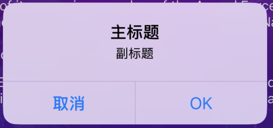

### 71、PDF的处理 <a href="#前言" style="font-size:17px; color:green;"><b>🔼</b></a> <a href="#🔚" style="font-size:17px; color:green;"><b>🔽</b></a>

```objective-c
#import <PDFKit/PDFKit.h> /// 系统API，处理PDF

@synthesize pdfView = _pdfView;
-(__kindof PDFView *)pdfView{
    if(!_pdfView){
        @jobs_weakify(self)
        _pdfView = jobsMakePDFView(^(__kindof PDFView * _Nullable view) {
            @jobs_strongify(self)
            view.autoScales = YES;
            view.document = PDFDocument.byURL([NSBundle.mainBundle URLForResource:@"Terms of Use" withExtension:@"pdf"]);
            [self.addSubview(view) mas_makeConstraints:^(MASConstraintMaker *make) {
                make.centerX.equalTo(self);
                make.top.equalTo(self.label.mas_bottom).offset(JobsWidth(10));
                make.size.mas_equalTo(CGSizeMake(JobsWidth(290), JobsWidth(300)));
            }];
        });
    }return _pdfView;
}
```

### 72、控制器自定义转场动画 <a href="#前言" style="font-size:17px; color:green;"><b>🔼</b></a> <a href="#🔚" style="font-size:17px; color:green;"><b>🔽</b></a>

```objective-c
/// 设置控制器的转场方向（及对应手势）
FMHomeMenuVC *vc = [self viewController:FMHomeMenuVC.new transitionDirection:JobsTransitionDirectionLeft];
```

```objective-c
/// 设置控制器的转场方向（及对应手势）
-(__kindof UIViewController *_Nullable)viewController:(__kindof UIViewController *_Nonnull)viewController
                                  transitionDirection:(JobsTransitionDirection)transitionDirection{
    if(!viewController && viewController.isKindOfClass(UIViewController.class)) return nil;
    /// 自定义 push/pop 控制器的动画方向
    self.jobsNavDirectionBy(transitionDirection);
    /// 自定义 push/pop 控制器的手势方向
    [JobsNavigationTransitionMgr attachToViewController:viewController animationDirection:transitionDirection];
    return viewController;
}
```

### 73、Layer <a href="#前言" style="font-size:17px; color:green;"><b>🔼</b></a> <a href="#🔚" style="font-size:17px; color:green;"><b>🔽</b></a>

* `-(JobsRetViewByCorBlock _Nonnull)layerByBorderCor;`
* `-(JobsRetViewByFloatBlock _Nonnull)layerByBorderWidth;`
* `-(JobsRetViewByFloatBlock _Nonnull)cornerCutToCircleWithCornerRadius;`

```objective-c
-(FMAnnouncementView *)announcementView{
    if(!_announcementView){
        @jobs_weakify(self)
        _announcementView = FMAnnouncementView
            .JobsRichViewByModel(nil)
            .JobsBlock1(^(id _Nullable data) {

            })
            .addOn(self.bgImageView)
            .byAdd(^(MASConstraintMaker *make) {
                @jobs_strongify(self)
                /// TODO
            })
            .layerByBorderCor(@"#FFD8D8".cor)
            .layerByBorderWidth(1)
            .cornerCutToCircleWithCornerRadius(JobsWidth(8));
    }return _announcementView;
}
```

* `-(JobsRetViewByLocationModelBlock _Nonnull)setLayerBy;`

```objective-c
 -(JobsTextField *)textField_birthDay{
     if(!_textField_birthDay){
         @jobs_weakify(self)
         _textField_birthDay = self.scrollView.addSubview(makeJobsTextField(^(__kindof JobsTextField * _Nullable data) {
             @jobs_strongify(self)
             data.layoutSubviewsRectCorner = UIRectCornerAllCorners;
             data.layoutSubviewsRectCornerSize = CGSizeMake(JobsWidth(8), JobsWidth(8));
             data.byLeftViewByOutLineOffset(JobsWidth(4))
                 .byLeftViewByTextFieldOffset(JobsWidth(4))
                 .byRightViewByTextFieldOffset(JobsWidth(4))
                 .byRightViewByOutLineOffset(JobsWidth(14))
                 .byLeftView(BaseButton.jobsInit()
                             .jobsResetBtnBgImage(@"📅".img)
                             .onClickBy(^(UIButton *x){
                                 JobsLog(@"");
                             }).onLongPressGestureBy(^(id data){
                                 JobsLog(@"");
                             }).bySize(CGSizeMake(JobsWidth(16), JobsWidth(16))))
                 .byRightView(BaseButton.jobsInit()
                              .jobsResetBtnBgImage(@"向下的箭头".img)
                              .onClickBy(^(UIButton *x){
                                  @jobs_strongify(self)
                                  self.popupParameter = nil;
                                  ShowView(self.calenderView);
                              }).onLongPressGestureBy(^(id data){
                                  JobsLog(@"");
                              }).bySize(CGSizeMake(JobsWidth(16), JobsWidth(16))))
                 .byBgCor(JobsCor(@"#f7f7f7"))
                 .JobsRichViewByModel2(nil)
                 // 真实的textField，输入回调（每次输入的字符），如果要当前textField的字符，请取值textField.text
                 .JobsBlock1(^(id _Nullable data) {
                     JobsLog(@"ddf = %@",data);
                 });
             data.realTextField
                 .byReturnKeyType(UIReturnKeyDefault)
                 .byKeyboardAppearance(UIKeyboardAppearanceDefault)
                 .byKeyboardType(UIKeyboardTypePhonePad)
                 .byLeftViewMode(UITextFieldViewModeNever)
                 .byRightViewMode(UITextFieldViewModeNever)
                 .byPlaceholder(JobsInternationalization(@"Pick a Date"))
                 .byPlaceholderColor(JobsCor(@"#BBBBBB"))
                 .byPlaceholderFont(pingFangTCRegular(15))
                 .byAttributedPlaceholder(nil)
                 .byTextCor(JobsCor(@"#788190"))
                 .bySecureTextEntry(NO);
         })).setLayerBy(jobsMakeLocationModel(^(__kindof JobsLocationModel * _Nullable data) {
             data.layerCor = JobsCor(@"#BBBBBB");
             data.jobsWidth = 1;
             data.cornerRadiusValue = JobsWidth(8);
         }))
           .addOn(self.bgImageView)
                .byAdd(^(MASConstraintMaker *make) {
                    @jobs_strongify(self)
                    /// TODO
                });
     }return _textField_birthDay;
 }
```

* `-(JobsRetViewByLocationModelBlock _Nonnull)layerBy;`

```objective-c
cell.contentView.layerBy(jobsMakeLocationModel(^(__kindof JobsLocationModel * _Nullable model) {
  model.layerCor = JobsClearColor;
  model.jobsWidth = JobsWidth(0.5f);
  model.masksToBounds = YES;
}));
```

### 74、响应链 <a href="#前言" style="font-size:17px; color:green;"><b>🔼</b></a> <a href="#🔚" style="font-size:17px; color:green;"><b>🔽</b></a>

|                    方法名                    |                  作用                  | 是否影响是否响应 `touchesBegan / touchesEnded` |                          说明                           |
| :------------------------------------------: | :------------------------------------: | :--------------------------------------------: | :-----------------------------------------------------: |
|       `- (BOOL)pointInside:withEvent:`       | 判断点击点是否在当前视图“可点击区域”内 |                 ✅ 是第一步判断                 | 若返回 NO，当前 view 和其子视图都不再考虑，事件会被忽略 |
|       `- (UIView *)hitTest:withEvent:`       | 递归查找最终响应事件的视图（从上到下） |                ✅ 决定最终接收者                |       若当前视图或其子视图命中，则返回最终响应者        |
| `- (void)touchesBegan:` / `touchesEnded:` 等 |         事件真正的响应逻辑处理         |     ✅ 只有命中并返回为最终响应者才会被调用     |        若上面两个流程未命中，则不会触发这些方法         |


* ```mermaid
  graph TD
      A[用户点击屏幕] --> B[UIWindow 开始 hitTest]
      B --> C[调用 pointInside 方法]
      C --> D{是否命中}
      D -->|NO| Z[返回 nil 不响应事件]
      D -->|YES| E[继续对子视图递归 hitTest]
      E --> F[找到最前面的 subview]
      F --> G[再次调用 pointInside 方法]
      G -->|YES| H[命中 subview 继续递归]
      G -->|NO| I[检查下一个 subview]
      H --> J[最终找到命中的 View]
      J --> K[返回作为响应者的 View]
      K --> L[调用 touches 相关方法]
      I --> G
  ```

* 只有在 **需要自定义事件传递路径或拦截事件** 时，才需要关心 `hitTest:withEvent:`

* `pointInside:` 和 `hitTest:` 经常**一起使用**；

* 单独修改 `pointInside:` 只能控制"是否命中当前 view"，但不决定"最终由谁响应"，这个是 `hitTest:` 做的；

* `- (BOOL)pointInside:withEvent:`+`- (UIView *)hitTest:withEvent:`==>`- (void)touchesBegan:` / `touchesEnded:`

* 默认情况下，如果此 view：`userInteractionEnabled = YES`＋`alpha > 0.01`＋`hidden = NO`+`点击的 point 在 bounds 内` ==> 就会返回 YES，即会响应点击事件。

  如果希望某个视图（即使是透明的）**也能接收点击事件**，那么可以在这个视图的子类中重写：

  ```objective-c
  @interface MyOverlayView : UIView
  @end
  
  @implementation MyOverlayView
  /// 默认情况下透明 view 是不会响应事件的，重写这个方法就可以
  -(BOOL)pointInside:(CGPoint)point withEvent:(UIEvent *)event {
      if (CGRectContainsPoint(self.specialTouchArea, point)) {
          return YES;// 即使透明，也可以响应事件
      }return NO; // 点不在区域内就当没点中
  }
  
  @end
  ```

* 按钮点击的完整流程（当你点击按钮时，系统内部会这样做）

  * 调用 `hitTest:withEvent:` → 找到这个按钮
  * 系统把事件交给按钮
  * 按钮内部触发 `TouchDown` → `TouchUpInside`
  * 最终执行你设置的 `buttonClicked:` 方法

  ```objective-c
  UIButton *btn = [[UIButton alloc] initWithFrame:CGRectMake(50, 50, 100, 40)];
  [btn setTitle:@"点击我" forState:UIControlStateNormal];
  [btn addTarget:self action:@selector(buttonClicked:) forControlEvents:UIControlEventTouchUpInside];
  [cell.contentView addSubview:btn];
  ```

* 让父视图相应事件（而非按钮）

  ```text
  MyTransparentView
  ├── UIButton
  ```

  ```objective-c
  /// MyTransparentView.m
  - (UIView *)hitTest:(CGPoint)point withEvent:(UIEvent *)event {
      return self; // 强行让自己接收事件
  }
  
  - (BOOL)pointInside:(CGPoint)point withEvent:(UIEvent *)event {
      return YES;
  }
  ```

### 75、推送 <a href="#前言" style="font-size:17px; color:green;"><b>🔼</b></a> <a href="#🔚" style="font-size:17px; color:green;"><b>🔽</b></a>

* [**Apple生成 `*.p12`文件**](https://github.com/JobsKits/JobsDocs/blob/main/Apple%E7%94%9F%E6%88%90%20*.p12%E6%96%87%E4%BB%B6/Apple%E7%94%9F%E6%88%90%20*.p12%E6%96%87%E4%BB%B6.md)

### 76、🖼️ <font color=red>**使用`Color Set`**</font> <a href="#前言" style="font-size:17px; color:green;"><b>🔼</b></a> <a href="#🔚" style="font-size:17px; color:green;"><b>🔽</b></a>

* 选中图片以后，跳到第四个选项卡

  ```swift
  if #available(iOS 11.0, *) {
      UIColor(named: "TextColor0")
  }
  ```

  <p align="center">
    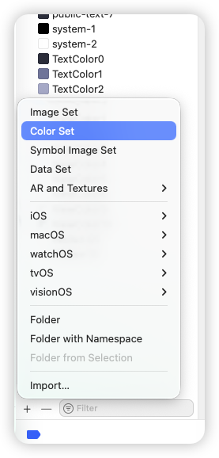
    
  </p>

* 支持暗黑模式

  > Dark优先级高一些，如果在Dark里面没有找到对应的图片，会去Any找


### 77、[📖](https://sdwebimage.github.io/documentation/sdwebimage/) [**`SDWebImage`**](https://github.com/SDWebImage/SDWebImage) <a href="#前言" style="font-size:17px; color:green;"><b>🔼</b></a> <a href="#🔚" style="font-size:17px; color:green;"><b>🔽</b></a>

#### 77.1、`SDAnimatedImage` <a href="#前言" style="font-size:17px; color:green;"><b>🔼</b></a> <a href="#🔚" style="font-size:17px; color:green;"><b>🔽</b></a>

* **SDAnimatedImage 是 [`SDWebImage`](https://github.com/SDWebImage/SDWebImage) 提供的“可播放的动态图像对象”**（继承自 `UIImage`），搭配 **`SDAnimatedImageView`** 来播放。它解决了 `UIImage.animatedImage…` 一次性把所有帧解码进内存、容易内存暴涨/掉帧的问题

  * **按需解码**：不是把 **GIF**/**APNG**/**WebP** 全部帧一次性放进内存，而是“边播边解码 + 帧缓存策略”，显著降低峰值内存
  * **多格式动画**：不仅是 **GIF**，还支持 **APNG**、**WebP**、**HEIC**/**HEIF**、**AVIF** 等（通过对应 coder 插件）
  * **可控缓存**：有最大缓冲区、帧复用等策略，平衡 **CPU 解码** 🆚 **内存占用**
  * **即插即用**：API 形态跟 `UIImage` 相近；只要把 `SDAnimatedImage` 赋给 `SDAnimatedImageView.image` 就能平滑播放
  * **更顺滑**：基于 `CADisplayLink` 的驱动，按每帧的真实 duration 播放，不容易掉帧或节奏不对

* 和系统 `UIImage.animatedImage…` 的差异

  | 点       | `UIImage.animatedImage` | `SDAnimatedImage`                                     |
  | -------- | ----------------------- | ----------------------------------------------------- |
  | 解码策略 | 预解所有帧              | 按需解码 + 帧缓存                                     |
  | 内存峰值 | 高（帧数×分辨率×通道）  | 低很多                                                |
  | 支持格式 | 主要 **GIF**            | **GIF**/**APNG**/**WebP**/**HEIC**/**AVIF**（配插件） |
  | 播放视图 | `UIImageView`           | `SDAnimatedImageView`（更顺滑、控件化）               |

* 使用方式

  * 一次性注册（AppDelegate）

    ```objective-c
    // AppDelegate.m
    @import SDWebImage;
    @import SDWebImageWebPCoder;   // 需要 WebP 动图就加
    //#import <SDWebImageAVIFCoder/SDImageAVIFCoder.h> // 需要 AVIF 的话
    
    - (BOOL)application:(UIApplication *)application didFinishLaunchingWithOptions:(NSDictionary *)launchOptions {
        [[SDImageCodersManager sharedManager] addCoder:[SDImageWebPCoder sharedCoder]];
        // [[SDImageCodersManager sharedManager] addCoder:[SDImageAVIFCoder sharedCoder]];
        return YES;
    }
    ```

  * 基础播放（本地 Data / Bundle 文件）

    ```objective-c
    @import SDWebImage;
    
    SDAnimatedImageView *imageView = [SDAnimatedImageView new];
    imageView.frame = CGRectMake(20, 100, 200, 200);
    imageView.contentMode = UIViewContentModeScaleAspectFit;
    [self.view addSubview:imageView];
    
    // 从 data 构造
    NSData *data = [NSData dataWithContentsOfFile:[[NSBundle mainBundle] pathForResource:@"demo" ofType:@"gif"]];
    SDAnimatedImage *anim = [[SDAnimatedImage alloc] initWithData:data scale:[UIScreen mainScreen].scale];
    imageView.image = anim;           // 关键：用 SDAnimatedImageView 播放 SDAnimatedImage
    imageView.animationRepeatCount = 0; // 0 = 无限循环
    // [imageView startAnimating];     // 通常设置 image 后会自动播放
    ```

  * 从 URL 加载（最常见）

    ```objective-c
    @import SDWebImage;
    
    SDAnimatedImageView *iv = [SDAnimatedImageView new];
    iv.frame = CGRectMake(20, 320, 200, 200);
    iv.contentMode = UIViewContentModeScaleAspectFit;
    [self.view addSubview:iv];
    
    NSURL *url = [NSURL URLWithString:@"https://example.com/a.webp"];
    SDWebImageOptions opts = SDWebImageRetryFailed | SDWebImageHighPriority; // 举例
    [iv sd_setImageWithURL:url
           placeholderImage:nil
                    options:opts
                   progress:^(NSInteger receivedSize, NSInteger expectedSize, NSURL * _Nullable targetURL) {
                       // 需要的话做进度 UI
                   }
                  completed:^(UIImage * _Nullable image, NSError * _Nullable error, SDImageCacheType cacheType, NSURL * _Nullable imageURL) {
                      if (error) {
                          NSLog(@"load error: %@", error);
                      }
                  }];
    ```

  * **`UITableViewCell`** 场景（复用安全、停止/启动动画）

    ```objective-c
    // AnimatedImageCell.h
    @import UIKit;
    @class SDAnimatedImageView;
    
    @interface AnimatedImageCell : UITableViewCell
    - (void)configWithURL:(NSURL *)url;
    @end
    ```

    ```objective-c
    // AnimatedImageCell.m
    @import SDWebImage;
    #import "AnimatedImageCell.h"
    
    @interface AnimatedImageCell ()
    @property (nonatomic, strong) SDAnimatedImageView *gifView;
    @end
    
    @implementation AnimatedImageCell
    
    - (instancetype)initWithStyle:(UITableViewCellStyle)style reuseIdentifier:(NSString *)reuseIdentifier {
        if (self = [super initWithStyle:style reuseIdentifier:reuseIdentifier]) {
            _gifView = [SDAnimatedImageView new];
            _gifView.contentMode = UIViewContentModeScaleAspectFill;
            _gifView.clipsToBounds = YES;
            [self.contentView addSubview:_gifView];
        }
        return self;
    }
    
    - (void)layoutSubviews {
        [super layoutSubviews];
        _gifView.frame = self.contentView.bounds;
    }
    
    - (void)prepareForReuse {
        [super prepareForReuse];
        // 复用前停止并清理旧图，避免错播 & CPU 浪费
        [_gifView stopAnimating];
        [_gifView sd_cancelCurrentImageLoad];
        _gifView.image = nil;
    }
    
    - (void)configWithURL:(NSURL *)url {
        // 也可以设置占位图
        [_gifView sd_setImageWithURL:url
                    placeholderImage:nil
                             options:(SDWebImageRetryFailed | SDWebImageLowPriority)
                            progress:nil
                           completed:^(UIImage * _Nullable image, NSError * _Nullable error, SDImageCacheType cacheType, NSURL * _Nullable imageURL) {
            if (error) {
                NSLog(@"gif load failed: %@", error);
            }
            // 加载完成后会自动播；若需手控：[_gifView startAnimating];
        }];
    }
    
    @end
    ```

  * 常见控制 & 参数

    ```objective-c
    // 停止/开始
    [imageView stopAnimating];
    [imageView startAnimating];
    
    // 循环次数（0 = 无限）
    imageView.animationRepeatCount = 0;
    
    // 仅第一帧占位（滚动列表省电）
    imageView.shouldCustomLoopCount = NO; // 默认 NO
    imageView.autoPlayAnimatedImage = YES; // 默认 YES
    
    // 全局/单图编码选项（比如禁用解码预拉伸）
    SDWebImageContext *ctx = @{
        SDWebImageContextImageScaleFactor : @(UIScreen.mainScreen.scale),
        SDWebImageContextAnimatedImageClass : SDAnimatedImage.class, // 明确指定
    };
    [imageView sd_setImageWithURL:url placeholderImage:nil options:0 context:ctx];
    
    // 限制内存帧缓存（更细：SDAnimatedImageView 有 maxBufferSize；新版本已内部自适应）
    ```

* 特别注意

  * **一定用 `SDAnimatedImageView`** 来播 `SDAnimatedImage`，不要用系统 `UIImageView`。
  * 需要 **WebP**/**AVIF** 等，**别忘装对应 coder 插件并注册**。
  * 超大、超长动图仍会吃 CPU，必要时**限制尺寸/帧率或懒加载**。

### 78、延迟一段时间后去做事 <a href="#前言" style="font-size:17px; color:green;"><b>🔼</b></a> <a href="#🔚" style="font-size:17px; color:green;"><b>🔽</b></a>

```objective-c
/// 用于：UI刷新（高频需求）
-(void)delayByMainQueue:(int64_t)time block:(jobsByUInt64_tBlock)block;
/// 用于：重计算 / IO
-(void)delayByGlobalQueue:(int64_t)time block:(jobsByUInt64_tBlock)block;
```

```objective-c
@jobs_weakify(self)
[self delayByMainQueue:self.timeSecIntervalSinceDate block:^(uint64_t data) {
    @jobs_strongify(self)
    switch (self.timerType) {
        case JobsTimerTypeNSTimer:      [self startNSTimer];      break;
        case JobsTimerTypeGCD:          [self startGCDTimer];     break;
        case JobsTimerTypeDisplayLink:  [self startDisplayLink];  break;
    }
}];
```

### 79、<font id=JobsTimer>JobsTimer</font> <a href="#前言" style="font-size:17px; color:green;"><b>🔼</b></a> <a href="#🔚" style="font-size:17px; color:green;"><b>🔽</b></a>

#### 79.1、倒计时 <a href="#前言" style="font-size:17px; color:green;"><b>🔼</b></a> <a href="#🔚" style="font-size:17px; color:green;"><b>🔽</b></a>

```objective-c
@synthesize timer = _timer;
-(JobsTimer *)timer{
    if (!_timer) {
        @jobs_weakify(self)
        _timer = jobsMakeTimer(^(JobsTimer * _Nullable timer) {
            timer.byTimerType(JobsTimerTypeNSTimer)
            .byTimerStyle(TimerStyle_anticlockwise) // 倒计时模式
            .byTimeInterval(1)
            .byTimeSecIntervalSinceDate(0)
            .byQueue(dispatch_get_main_queue())
            .byTimerState(JobsTimerStateIdle)
            .byStartTime(10)
            .byTime(0)
            .byOnTick(^(CGFloat time){
                @jobs_strongify(self)
                JobsLog(@"正在倒计时...");
                if (self.objBlock) self.objBlock(timer);
            })
            .byOnFinish(^(JobsTimer *_Nullable timer){
                @jobs_strongify(self)
                JobsLog(@"倒计时结束...");
                if (self.objBlock) self.objBlock(timer);
            });

            timer.accumulatedElapsed       = 0;
            timer.lastStartDate            = nil;
        });
    }return _timer;
}
```

#### 79.2、正计时 <a href="#前言" style="font-size:17px; color:green;"><b>🔼</b></a> <a href="#🔚" style="font-size:17px; color:green;"><b>🔽</b></a>

```objective-c
@synthesize timer = _timer;
-(JobsTimer *)timer{
    if (!_timer) {
        @jobs_weakify(self)
        _timer = jobsMakeTimer(^(JobsTimer * _Nullable timer) {
            timer.byTimerType(JobsTimerTypeNSTimer)
            .byTimerStyle(TimerStyle_clockwise) // 正计时模式
            .byTimeInterval(1)
            .byTimeSecIntervalSinceDate(0)
            .byQueue(dispatch_get_main_queue())
            .byTimerState(JobsTimerStateIdle)
            .byStartTime(10)
            .byTime(0)
            .byOnTick(^(CGFloat time){
                @jobs_strongify(self)
                JobsLog(@"正在倒计时...");
                if (self.objBlock) self.objBlock(timer);
            })
            .byOnFinish(^(JobsTimer *_Nullable timer){
                @jobs_strongify(self)
                JobsLog(@"倒计时结束...");
                if (self.objBlock) self.objBlock(timer);
            });

            timer.accumulatedElapsed       = 0;
            timer.lastStartDate            = nil;
        });
    }return _timer;
}
```

### 80、按钮的点击事件追加 <a href="#前言" style="font-size:17px; color:green;"><b>🔼</b></a> <a href="#🔚" style="font-size:17px; color:green;"><b>🔽</b></a>

```objective-c
/// 普通按钮
-(UIButton *)usrNameBtn{
    if(!_usrNameBtn){
        @jobs_weakify(self)
        _usrNameBtn = UIButton.jobsInit()
            .bgColorBy(JobsWhiteColor)
            .jobsResetImagePlacement(NSDirectionalRectEdgeLeading)
            .jobsResetImagePadding(1)
            .jobsResetBtnImage(@"APPLY NOW".img)
            .jobsResetBtnBgImage(@"APPLY NOW".img)
            .jobsResetBtnTitleCor(JobsWhiteColor)
            .jobsResetBtnTitleFont(UIFontWeightBoldSize(JobsWidth(12)))
            .jobsResetBtnTitle(@"APPLY NOW".tr)
            .onClickBy(^(UIButton *x){
                JobsLog(@"普通的点击事件");
            })
            .onClickAppendBy(^(UIButton *x){
                JobsLog(@"追加的点击事件");
            })
            .onLongPressGestureBy(^(id data){
                JobsLog(@"普通的长按事件");
            })
            .onLongPressGestureAppendBy(^(id data){
                JobsLog(@"追加的长按事件");
            })
            .addOn(self.view)
            .byAdd(^(MASConstraintMaker *make) {
                @jobs_strongify(self)
                // TODO
            });
        _usrNameBtn.makeBtnTitleByShowingType(UILabelShowingType_03);
    }return _usrNameBtn;
}
```

### 81、真机/模拟器区分 <a href="#前言" style="font-size:17px; color:green;"><b>🔼</b></a> <a href="#🔚" style="font-size:17px; color:green;"><b>🔽</b></a>

> 只能按照CPU架构来进行区分，具体设备要在真机代码部分，再进行详细区分

* ```objective-c
  #import <TargetConditionals.h>
  #if TARGET_OS_SIMULATOR
      // 模拟器专用代码
  #else
      // 真机（iPhone / iPad 设备）代码
  #endif
  ```

* ```objective-c
  #import <TargetConditionals.h>
  #if TARGET_OS_IOS && !TARGET_OS_SIMULATOR
      // 只有 iOS 真机（iPhone / iPad）代码
  #endif
  
  #if !TARGET_OS_SIMULATOR
      // 只有真机（iPhone / iPad）会编译到这里
  #endif
  ```

* ```objective-c
  #import <TargetConditionals.h>
  #if TARGET_OS_SIMULATOR
      // 模拟器专用代码
  #endif
  ```

### 82、其他 <a href="#前言" style="font-size:17px; color:green;"><b>🔼</b></a> <a href="#🔚" style="font-size:17px; color:green;"><b>🔽</b></a>

* <font color=red>属性化的block可以用**assign**修饰，但是最好用**copy**</font>

* <font color=red>不要在属性上加`__block`</font>。转而是在这个对象上使用`__block`

* <font color=red>属性化的`NSString *`可以用**assign**修饰，但是最好用**copy**</font>

* ```objective-c
  /// 获取 GKPhotoBrowser 类的 layoutSubviews 方法。
  Method method = class_getInstanceMethod(GKPhotoBrowser.class, sel_registerName("layoutSubviews"));
  /// 获取到的方法实现转换为一个函数指针 super_func，并指定了函数的参数类型为 (id, SEL)。
  void (*super_func)(id,SEL) = (void *)method_getImplementation(method);
  /// 检查 super_func 是否为非空，即是否成功获取到 layoutSubviews 方法的实现。
  /// 如果 super_func 不为空，它执行 super_func 函数，传递 self 和 sel_registerName("layoutSubviews") 作为参数，从而调用了 GKPhotoBrowser 类的 layoutSubviews 方法。
  if (super_func) super_func(self, sel_registerName("layoutSubviews"));
  
  [super layoutSubviews];
  ```

* <font color=red>**根据后端接口文档返回的字段类型为 `number`，建议在 iOS 的模型中使用 `NSNumber`，而不是 `NSString` 。**</font>原因如下：

  1. **兼容多种数字类型**：`NSNumber` 是一个对象类，可以存储 `int`、`float`、`double` 等数值类型，非常适合处理后端返回的 `number` 字段。
  2. **方便与数值类型转换**：`NSNumber` 可以方便地与数值类型进行转换，比如 `intValue`、`floatValue`、`doubleValue`，而 `NSString` 则需要额外的解析和转换操作。
  3. **避免解析问题**：如果使用 `NSString` 存储数字类型字段，在解析时需要手动转换，这可能会引入额外的复杂性和潜在的错误。`NSNumber` 则直接支持数值类型，无需额外处理。

* **将视图至于最底层**

  ```objective-c
  [cell insertSubview:imageView atIndex:0];
  ```

* [**iOS 父视图透明度影响到子视图**](https://blog.csdn.net/ios_xumin/article/details/114263960)

  * 父视图的透明度会影响到其子视图。跟着一起变得半透明

    ```objective-c
    self.view.backgroundColor = UIColor.redColor;
    self.view.alpha = 0.5f;
    ```

  * 避免以上的情况的写法

    ```objective-c
    self.view.backgroundColor = [UIColor.redColor colorWithAlphaComponent:0.5f];
    ```

* <font color=red>**nil**</font> 🆚 <font color=red>**NULL**</font>

  * ```objective-c
    NSObject *object = nil; // object 是一个空指针，不指向任何对象。
    ```

  * ```c
    int *ptr = NULL; // ptr 是一个空指针，不指向任何内存地址。
    ```

* `+ (void)load`会在类或分类被加载到内存时自动调用。即使这个类或分类没有被直接引用，只要它被编译进目标程序并被加载，它的 `+ (void)load` 方法仍然会被调用。通常早于 `main()` 函数的执行。相比 `+ (void)load`，`+ (void)initialize` 只有在类首次使用时才会被调用

* 泛型

  * 协变（`__covariant`）：如果 `B` 是 `A` 的子类，那么 `Container<B>` 可以被当作 `Container<A>` 来使用。这意味着子类型可以赋值给父类型。

  * 逆变（`__contravariant`）：与协变相反，如果 `B` 是 `A` 的子类，那么 `Container<A>` 可以被当作 `Container<B>` 来使用。父类型可以被赋值给子类型。

  * `__covariant` 和 `__contravariant` 是用于泛型类型的修饰符，无法直接用于局部变量或非泛型方法。

  * 正确的写法（<font color=red>**不能在分类中使用**</font>）

    ```objective-c
    @interface MyGenericDictionary<__covariant KeyType, __covariant ObjectType> : NSObject
    
    @end
    ```

* 在函数内部修改外部的值

  * 如果你希望在函数内部能够修改外部变量的值，你可以使用指针的指针（`UIView  **` ），传递变量的地址来改变原变量的值。

    ```objective-c
    NS_INLINE void destroyView(__strong __kindof UIView * _Nonnull * _Nonnull view) {
        [*view removeFromSuperview];
        *view = nil;
    }
    
    destroyView(&view);
    ```

    ```objective-c
    /// 在 Objective-C 中，无法直接通过函数参数隐式传递对象的地址。
    /// 如果希望在函数调用时自动传递对象的地址，只能通过宏来实现。
    #ifndef DestroyView
    #define DestroyView(view) destroyView(&(view))
    #endif /* DestroyView */
    ```

  * <font color=red>**"Passing address of non-local object to __ autoreleasing parameter for write-back"**</font>警告的原因是 **Objective-C **对指针操作的内存管理有一套特殊的机制，特别是涉及  <font color=red>**__autoreleasing**</font>、<font color=red>**__strong**</font> 等修饰符时

  * 当你传递一个对象的指针（比如 UIView）时，编译器可能会将这个指针的参数视为 <font color=red>**__autoreleasing**</font>。而你试图传递一个本地对象的地址给<font color=red>**__autoreleasing**</font> 参数时，就会触发这个警告。简而言之，**Objective-C** 认为这样操作可能会引发内存管理上的问题。

  * 要解决这个问题，首先可以强制指定参数为<font color=red>**__strong**</font> 以避免自动推导为  <font color=red>**__autoreleasing**</font>

* `CGRect` 可能因为浮点数的精度问题或隐式转换，导致某些底层操作触发异常。在设备屏幕渲染中，整数更符合逻辑像素值的要求，因此不会触发异常。

  * ```objective-c
    (lldb) po stringWidth
    628.1015625 
    
    layer.frame = CGRectMake(0, 0, stringWidth, self.frame.size.height); /// 崩溃
    layer.frame = CGRectMake(0, 0, 628, self.frame.size.height);/// 不崩溃
    ```

## 五、<font color=red>**F**</font><font color=green>**A**</font><font color=blue>**Q**</font> <a href="#前言" style="font-size:17px; color:green;"><b>🔼</b></a> <a href="#🔚" style="font-size:17px; color:green;"><b>🔽</b></a>

### 1、在[**Objective-C**](https://developer.apple.com/library/archive/documentation/Cocoa/Conceptual/ProgrammingWithObjectiveC/Introduction/Introduction.html)里面，主类有一个**方法A**，分类里面也有一个**方法A**，它们都是同名的，那么在执行的时候，是执行分类的还是主类的**方法A** ❓ <a href="#前言" style="font-size:17px; color:green;"><b>🔼</b></a> <a href="#🔚" style="font-size:17px; color:green;"><b>🔽</b></a>

  > **运行时调用时，会执行分类的方法，覆盖主类的实现**

### 2、如果在两个分类文件里面都写了同一个方法，在实际调用的时候执行谁 ❓ <a href="#前言" style="font-size:17px; color:green;"><b>🔼</b></a> <a href="#🔚" style="font-size:17px; color:green;"><b>🔽</b></a>

  * 最终在运行时注册类方法表时，**后加载的分类会覆盖前面的**；（后编译进二进制的分类实现）
  * 所以在大型项目中，如果多个模块都给同一个类写了相同方法名的分类，会导致：
    - 调用结果 **不确定**；
    - 甚至不同环境下结果会不一样。
  
### 3、为什么在[**Masonry**](https://github.com/SnapKit/Masonry)/[**SnapKit**](https://github.com/SnapKit/SnapKit)里面可以不用**weak**化的`self`❓ <a href="#前言" style="font-size:17px; color:green;"><b>🔼</b></a> <a href="#🔚" style="font-size:17px; color:green;"><b>🔽</b></a>

  * 因为 [**Masonry**](https://github.com/SnapKit/Masonry)/[**SnapKit**](https://github.com/SnapKit/SnapKit) 的约束闭包是**同步执行、不会被保存（non-escaping）**的
  
    > `mas_makeConstraints:` 的实现本质上就是：创建一个 `MASConstraintMaker`，**立刻**调用你传进来的 **block**，然后安装约束，整个过程当场结束，不会把 **block** 存到任何被 `self` 持有的地方，自然也就**不会形成 self ↔︎ block 的循环引用**。
  
  * 只有当**闭包会被保存/逃逸**时才需要 `weak self`，例如：
  
    - 把 **block** 存成 `self.someBlock = ^{ ... self ... };`（典型循环引用）
    - 传给会把 **block** 保存在属性里的对象，而这个对象又被 `self` 强持有
  
### 4、只有对不可变对象进行`copy`操作是指针复制（浅复制），其它情况都是内容复制（深复制） <a href="#前言" style="font-size:17px; color:green;"><b>🔼</b></a> <a href="#🔚" style="font-size:17px; color:green;"><b>🔽</b></a>

  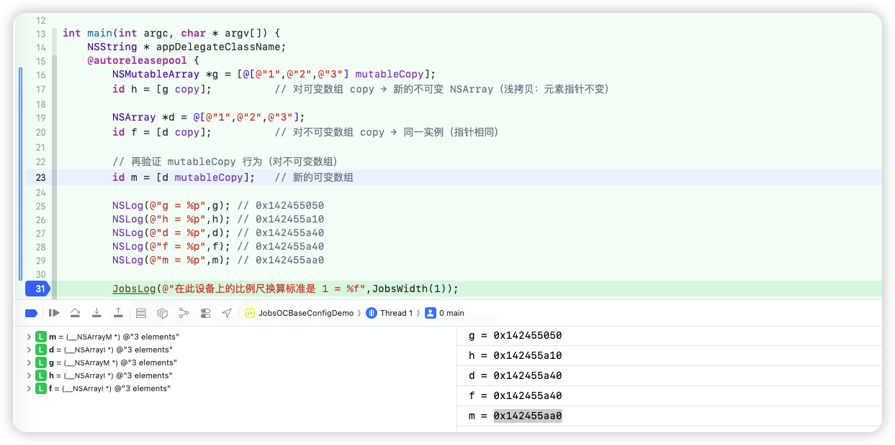
  
### 5、在[**Objective-C**](https://developer.apple.com/library/archive/documentation/Cocoa/Conceptual/ProgrammingWithObjectiveC/Introduction/Introduction.html)里面，`NSMutableArray`属性用`copy`还是`strong`修饰❓ <a href="#前言" style="font-size:17px; color:green;"><b>🔼</b></a> <a href="#🔚" style="font-size:17px; color:green;"><b>🔽</b></a>

  * `NSMutableArray` 当属性，正常情况下用 `strong`，不要用 `copy`。因为，如果用<font color=red>**copy**</font>，**setter** 会做的是：对一个 `NSMutableArray` 调用 `copy`，**返回的是不可变的 `NSArray` 对象**（类簇行为）。此时调用`addObject`会崩溃！

### 6、[**Objective-C**](https://developer.apple.com/library/archive/documentation/Cocoa/Conceptual/ProgrammingWithObjectiveC/Introduction/Introduction.html)为主混编一部分[**Swift**](https://www.swift.org/)，以及[**Swift**](https://www.swift.org/)为主混编一部分[**Objective-C**](https://developer.apple.com/library/archive/documentation/Cocoa/Conceptual/ProgrammingWithObjectiveC/Introduction/Introduction.html)，包体会变大吗❓ <a href="#前言" style="font-size:17px; color:green;"><b>🔼</b></a> <a href="#🔚" style="font-size:17px; color:green;"><b>🔽</b></a>

  > **只要新增实现实际被链接、资源实际被复制，通常都会产生包体增量；但两种方向的增量往往不对称：[Objective-C](https://developer.apple.com/library/archive/documentation/Cocoa/Conceptual/ProgrammingWithObjectiveC/Introduction/Introduction.html) 主工程首次引入 [Swift](https://www.swift.org/) 通常更明显，[Swift](https://www.swift.org/) 主工程加入少量 [Objective-C](https://developer.apple.com/library/archive/documentation/Cocoa/Conceptual/ProgrammingWithObjectiveC/Introduction/Introduction.html) 通常较小。**

  | 项目结构 | 常见包体变化 |
  | --- | --- |
  | [**Objective-C**](https://developer.apple.com/library/archive/documentation/Cocoa/Conceptual/ProgrammingWithObjectiveC/Introduction/Introduction.html) 为主，首次加入 [**Swift**](https://www.swift.org/) | 通常更明显，可能存在一次性的 [**Swift**](https://www.swift.org/) 基础成本 |
  | [**Swift**](https://www.swift.org/) 为主，加入部分 [**Objective-C**](https://developer.apple.com/library/archive/documentation/Cocoa/Conceptual/ProgrammingWithObjectiveC/Introduction/Introduction.html) | 通常较小，主要增加 [**Objective-C**](https://developer.apple.com/library/archive/documentation/Cocoa/Conceptual/ProgrammingWithObjectiveC/Introduction/Introduction.html) 代码、元数据和资源 |
  | 已经是 [**Objective-C**](https://developer.apple.com/library/archive/documentation/Cocoa/Conceptual/ProgrammingWithObjectiveC/Introduction/Introduction.html) + [**Swift**](https://www.swift.org/) 混编 | 继续加入任一语言时，主要取决于新增代码、依赖和资源 |

  * **[Objective-C](https://developer.apple.com/library/archive/documentation/Cocoa/Conceptual/ProgrammingWithObjectiveC/Introduction/Introduction.html) 为主，首次加入 [Swift](https://www.swift.org/)**

    * 除 [**Swift**](https://www.swift.org/) 业务代码外，还会增加 [**Swift**](https://www.swift.org/) 类型、协议、泛型、反射，以及与 [**Objective-C**](https://developer.apple.com/library/archive/documentation/Cocoa/Conceptual/ProgrammingWithObjectiveC/Introduction/Introduction.html) 互操作所需的元数据。
    * [**Swift**](https://www.swift.org/) 5 的 ABI 稳定运行时从 iOS 12.2 开始作为系统组件提供。最低系统版本早于 iOS 12.2 时，面向旧系统的变体可能需要携带 [**Swift**](https://www.swift.org/) 运行库；运行在较新系统的 App Store 变体可通过 App Thinning 获得更小体积。
    * 即使最低系统版本高于 iOS 12.2，Xcode 仍可能根据使用到的 [**Swift**](https://www.swift.org/) 特性、兼容库和嵌入产物决定需要随 App 携带的内容。`ALWAYS_EMBED_SWIFT_STANDARD_LIBRARIES` 用于控制包装类 Target 是否始终嵌入 [**Swift**](https://www.swift.org/) 标准库，不应仅为解决包体问题盲目开启。
    * 因此，加入第一个 [**Swift**](https://www.swift.org/) 文件可能比继续加入第十个 [**Swift**](https://www.swift.org/) 文件更显著；但当前多数项目的最低系统版本已经高于 iOS 12.2，“首次加入 [**Swift**](https://www.swift.org/) 就固定增加数 MB”不能再作为通用结论。
    * 参考：[**Swift ABI 稳定性说明**](https://www.swift.org/blog/abi-stability-and-apple/)、[**Swift 5 Release Notes for Xcode 10.2**](https://developer.apple.com/documentation/xcode-release-notes/swift-5-release-notes-for-xcode-10_2)、[**Xcode Build Settings Reference**](https://developer.apple.com/documentation/xcode/build-settings-reference)。

  * **[Swift](https://www.swift.org/) 为主，加入部分 [Objective-C](https://developer.apple.com/library/archive/documentation/Cocoa/Conceptual/ProgrammingWithObjectiveC/Introduction/Introduction.html)**

    * [**Swift**](https://www.swift.org/) 相关运行时与元数据成本已经存在，新增内容通常是 [**Objective-C**](https://developer.apple.com/library/archive/documentation/Cocoa/Conceptual/ProgrammingWithObjectiveC/Introduction/Introduction.html) 编译后的机器码、类、方法、Selector、Category 等元数据，以及依赖携带的资源。
    * [**Objective-C**](https://developer.apple.com/library/archive/documentation/Cocoa/Conceptual/ProgrammingWithObjectiveC/Introduction/Introduction.html) Runtime、Foundation 和 UIKit 由系统提供，不会因为加入几个 `.m` 文件再给 App 打包一套 [**Objective-C**](https://developer.apple.com/library/archive/documentation/Cocoa/Conceptual/ProgrammingWithObjectiveC/Introduction/Introduction.html) 运行环境。
    * 所以在代码规模、依赖和资源相近时，[**Swift**](https://www.swift.org/) 主工程加入少量 [**Objective-C**](https://developer.apple.com/library/archive/documentation/Cocoa/Conceptual/ProgrammingWithObjectiveC/Introduction/Introduction.html) 的额外成本，通常小于纯 [**Objective-C**](https://developer.apple.com/library/archive/documentation/Cocoa/Conceptual/ProgrammingWithObjectiveC/Introduction/Introduction.html) 工程首次加入 [**Swift**](https://www.swift.org/)。

  * **真正决定包体增量的常见因素**

    * [**Objective-C**](https://developer.apple.com/library/archive/documentation/Cocoa/Conceptual/ProgrammingWithObjectiveC/Introduction/Introduction.html) 静态库为加载 Category 常配置 `-ObjC`，可能让链接器保留更多目标文件；`-all_load`、`-force_load` 的影响通常更明显。
    * [**Swift**](https://www.swift.org/) 大量使用复杂泛型或跨模块特化时，编译器可能为不同类型生成多份机器码。
    * 动态 Framework 会附带自身 Mach-O、签名和语言元数据；为了少量能力引入大型 SDK，往往比语言混编本身更占空间。
    * 图片、Bundle、字体、音视频等资源，以及同一依赖被重复打包，常常比 [**Swift**](https://www.swift.org/) / [**Objective-C**](https://developer.apple.com/library/archive/documentation/Cocoa/Conceptual/ProgrammingWithObjectiveC/Introduction/Introduction.html) 代码本身更大。
    * Debug 包含更多符号和未优化代码，不能用来判断正式包体。

  * **正确比较方式**

    ```text
    相同 Xcode、部署版本、架构和依赖
    → 分别生成 Release Archive
    → Distribute App 并生成 App Thinning Size Report
    → 比较同一设备变体的下载大小与安装大小
    ```

    `.xcarchive`、导出的 `.ipa`、App Store 下载大小和安装后大小不是同一个指标。Xcode 报告适合本地对比，上传后的 App Store Connect 设备变体数据最接近用户实际结果。参考：[**Reducing your app’s size**](https://developer.apple.com/documentation/xcode/reducing-your-app-s-size)、[**App Store Connect 构建大小说明**](https://developer.apple.com/help/app-store-connect/manage-builds/view-builds-and-metadata/)。

  * **结论速记**

    ```text
    纯 Objective-C → 首次加入 Swift：
    可能支付一次 Swift 基础成本，增量相对明显。

    纯 Swift → 加入 Objective-C：
    通常只增加 Objective-C 代码、元数据和资源，增量相对较小。

    已经混编 → 继续增加任一语言：
    主要看新增代码、链接方式、第三方依赖和资源，不再有明显的首次混编成本。
    ```

    不需要仅为了包体刻意拒绝少量 [**Swift**](https://www.swift.org/) / [**Objective-C**](https://developer.apple.com/library/archive/documentation/Cocoa/Conceptual/ProgrammingWithObjectiveC/Introduction/Introduction.html) 混编；优先检查大型 SDK、重复 Framework、资源文件、链接器加载参数、[**Swift**](https://www.swift.org/) 泛型特化和 Release 优化。

## 六、TODO <a href="#前言" style="font-size:17px; color:green;"><b>🔼</b></a> <a href="#🔚" style="font-size:17px; color:green;"><b>🔽</b></a>

### 1、急需解决 <a href="#前言" style="font-size:17px; color:green;"><b>🔼</b></a> <a href="#🔚" style="font-size:17px; color:green;"><b>🔽</b></a>

  * 研究[**ComponentKit**](https://componentkit.org/)（以前叫做 **Async Display Kit**） 

### 2、亟待解决 <a href="#前言" style="font-size:17px; color:green;"><b>🔼</b></a> <a href="#🔚" style="font-size:17px; color:green;"><b>🔽</b></a>

  * 将[**时间按照【年-月份】分组**](#时间按照【年-月份】分组)集成到靶场项目里
  * 完善 [**iOS功能：跳转其他App,如果本机不存在,则进行下载（需要补充）**](#iOS功能：跳转其他App,如果本机不存在,则进行下载)
* DebugLogDescription 会崩溃：`id value = self.valueForKeyBlock(name) ? : @"nil";//默认值为nil字符串`

<a id="🔚" href="#前言" style="font-size:17px; color:green; font-weight:bold;">我是有底线的➤点我回到首页</a>
